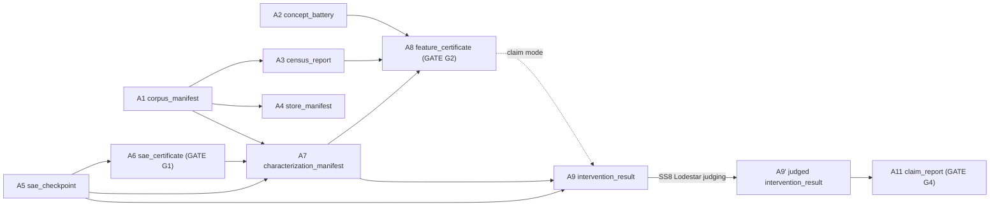

# CONSOLIDATED REPORT — SAE Interpretability, Interlab, Lodestar, SAE Concept Lab

**Author:** Mohamed El Yazid — IID
**Consolidated:** 2026-08-23 · **Revised:** 2026-08-25
**Scope:** every Markdown document in `reports/`, merged without deletion. Twenty-three source
documents reproduced verbatim in Parts I–XIII. Four machine-readable JSON ledgers are inventoried in
Part XI.

> **Revision of 2026-08-25.** A comparison against the three live repositories found four gaps
> between what the corpus documents and what exists on disk. All four are now closed, by two new
> source documents written for the purpose:
>
> | Gap | Closed by |
> |---|---|
> | The shipped tool `sae-concept-lab` appeared in one subsection and no figure | **Part XII** — `shipped_tool_sae_concept_lab.md` |
> | Interlab counts in the sources disagreed with disk (108 vs 102 test modules) | **Part XIII** §2.1 — measured, with the unit confusion named |
> | Lodestar's test surface was unmeasurable without hitting a 469-file archive trap | **Part XIII** §4.1 — the live surface is 14 modules |
> | `docs/research_program.md`, the governing program, was referenced by no report | **Part XIII** §2.3 — including the P1 linkage |

> **How this file was built, and what that guarantees.** Each source document is included **whole
> and unedited**, under a header giving its path, line count and SHA-256. Nothing was summarised
> away, paraphrased, or dropped as redundant. Part 0 below is the only new prose in this file; it is
> a navigation and synthesis layer written on top of the sources, not a replacement for any of them.
> Where two sources disagree, **both readings are kept** and the disagreement is named in §0.7 —
> because in this project the disagreements are frequently the finding.

---

## 0.1 What this body of work is

Three connected efforts, running from roughly May to August 2026, on one question: **can
sparse-autoencoder feature steering be reproduced, measured, and trusted on open-weight models?**

| # | Effort | Period | Target | Where it lives |
|---|---|---|---|---|
| **A** | Golden Gate Claude reproduction | → 2026-07-26 | Qwen2.5-14B / -Instruct, in-house SAEs | Part I |
| **B** | SPRINT-2026-08: necessity, cross-model, dose sweep, tool | 2026-08-05 → 08-12 | Gemma 3 12B-pt + Gemma Scope 2, Qwen `rwu04lpb` | Parts II–VI |
| **C** | Final pairing + shipped interactive tool | 2026-08-13 → 08-23 | Gemma 3 12B-**it** + Gemma Scope 2, Qwen3.5-27B + Qwen-Scope | Parts VII, and the `sae-concept-lab` repository |

**The arc in one paragraph.** Effort A reproduced the identity-substitution steering effect on an
open-weight model and built the two instruments — Interlab for artifact provenance, Lodestar for
judged evaluation — that made it auditable. It closed with two admitted boundaries: no cross-model
generality, and sufficiency claims only. Effort B went to close both. Neither closed the way the
July report anticipated: the cross-model comparison produced bounds that bracket zero, and the dose
sweep put almost every steering contrast inside its own replicate noise floor. What emerged instead
was a stronger and more general result about the *apparatus* — that at four independent stages of
the standard workflow, an unstated analyst choice moves the answer by more than the effect being
reported. Effort C carried the instruments to two freshly ratified model pairings, proved one target
concept structurally impossible, and shipped the interactive tool.

---

## 0.2 The ten numbers that carry the story

*Ordered for a reader who has thirty seconds. Every one is traceable to a Part below.*

| # | Number | What it is | Part |
|---|---|---|---|
| 1 | **2.6× / 50% / 3.7× / sign reversal** | Four stages where an unstated analyst choice moves the answer more than the effect | I §3.8, II §2, III §0 |
| 2 | **16 of 16** | Feature 2048 necessary at its active positions — unanimous, survives Bonferroni over 18 tests | IV §3g |
| 3 | **5.38 / 5.50 @ scale 55** | Feature 9056 "cheese": judged coherence / concept relevance at the selected operating point | I §3.1 |
| 4 | **9056 > 47735 > 44189** | Three independent measurements agree on one feature-quality ranking | I §3.2 |
| 5 | **35 of 54** | Dose-cells surviving a pre-registered refusal rule; contrasts −0.047 to +0.090 against a σ = 0.0624 noise floor | II §1.2 |
| 6 | **8.00 vs 7.00 / 6.40 vs 7.00** | The two defensible cross-model bounds — the interval brackets zero, so no direction exists | II §3.1 |
| 7 | **0.66 / 0.62 / 0.51 / 0.38** | Cross-lingual top-20 feature overlap (Jaccard): world_cup, quebec, poutine, couscous | I §3.3 |
| 8 | **0/480 and 19/480** | Control-arm concept floor, Gemma and Qwen, on the final pairing — the models actively refuse | VII §4 |
| 9 | **0.890 < 0.90** | The cheese ceiling: a complete feature group is structurally impossible, proven not estimated | VII §1 |
| 10 | **16+ attempts, 2 checkpoints** | No clean poutine feature — corpus coverage, not pipeline capability, bounds discoverability | I §4.1 |

---

## 0.3 The single strongest result

**At four independent stages of the standard SAE-interpretability workflow, a choice the analyst
makes silently moves the reported answer by more than the effect anyone would report from it.**

| stage | the unstated choice | measured consequence |
|---|---|---|
| **Selection** — which features you look at | browse vs seeded uniform draw | **2.6×** on the surface-form fraction, same SAE (58% → 22.5%) |
| **Classification** — what you call them | how strictly trigger-primacy is applied | **50%** of semantic rows change bucket; the directional question stops resolving |
| **Judging** — how you score steering | one word in the concept string | **3.7×** on identical generations; control arm invariant at 1.00 |
| **Necessity** — how you measure ablation cost | whole-snippet vs active-position ΔNLL | **sign reversal** on feature 500 |

A fifth instance sits one level lower, at the statistic rather than the stage: feature 2048's
whole-snippet **mean is −0.023 while its median is +0.0026 and 11 of 16 snippets are positive** — a
single outlier reversing the sign *inside* a band built to remove exactly that distortion.

**None of the four was found by looking for it.** Each surfaced as an obstacle while trying to
answer a different question. That is the reason to report them together: a workflow that does not
trip over them does not thereby avoid them.

---

## 0.4 What was proven, what was refuted, what remains open

**Established.**
- Identity-substitution steering reproduces quantitatively on an open-weight model (feature 9056).
- Feature quality is predictable ahead of steering, by three independent converging measurements.
- One clear causal necessity result (feature 2048), unanimous and multiplicity-robust.
- Training-corpus coverage bounds discoverability independently of dictionary width.
- Base-model SAEs do not transfer to instruct-model geometry at the same layer index.
- A complete feature group for "cheese" is impossible on the final-pairing corpus — a proof, not an estimate.

**Refuted, withdrawn, or reversed — kept in the record with the correction attached.**
- The original claim of a *surface-form skew* in SAE features: **withdrawn, not softened.**
- The browsed 58% surface-form figure: **retired**; it measures the bias, not the SAE.
- "No geography feature" and "no concrete physical object feature": **withdrawn** as n=33 sampling artifacts.
- Feature 10413 as a clean Montreal feature (§13): **overturned by the team's own later analysis.**
- The pre-registered segmentation prediction on the final pairing: **refuted** (0 multi-referent spans in 956/960 and 960/960).
- The "instrument is near-blind" reading of the control arm: **withdrawn** — the instrument was correct; the render was the defect.

**Open.**
- The cross-model direction. Not for want of sample size — the limit is rater instability, and a third rater produces a third number, not a resolution.
- Any calibrated steering dose. Every dose in this body of work is an engineering default or a measured scale, never a calibrated causal quantity.
- Mechanical acceptance at the layers the shipped tool now uses (Gemma 29, Qwen 38).

---

## 0.5 The two instruments, and the third thing

**Interlab** (`interplab/`, repo `Interlab`, formerly `qwen-sae-interp`) constrains **artifacts**:
content-addressed identity, schema-governed types, fail-closed gates. Growth across the three
efforts is itself a result:

| snapshot | artifact schemas | subsystems | tests |
|---|---|---|---|
| July 2026 (T0.3) | 11 chain types | 12 | 583 across 61 files |
| 2026-08-09 | 12 chain + 2 environment = 14 dirs | 12 | 1,040 across 77 files |
| 2026-08-21 | **15** | **13** | **2,796** across 108 modules |

**Lodestar** (`D:\lodstar`) constrains **evaluation**: six rubrics, a content-addressed judge cache,
cost preflight with a budget ceiling, Pareto frontier and optimal-operating-point search, and a
self-contained HTML report that became the actual review interface — a researcher reading one caught
the `sweep_hash` defect that no automated test found.

**The third thing, and it is not part of Interlab.** The August adjudication needed something
neither instrument provides: a constraint on **the analyst**. A pre-registration fixing every
parameter before the number it governs exists (nineteen amendments, **not one made with a tally
visible**), a merge tool that *refuses* rather than tallying what it cannot validate, a reserved
index pool with git hooks (**five incidents, five structural fixes, zero bypasses** — including one
that blocked the author of the rule and one that blocked the author of the tool), and canonical
ledgers in JSON because two successive parses of the prose ledger gave two different answers.

> **The unifying thesis across all three: certificates rather than recollection — applied to files
> (Interlab), to measurements (Lodestar), and to human judgment (the adjudication apparatus).**

---

## 0.6 The recurring defect class

One failure shape appears in every effort, and naming it is a contribution in its own right:

> **A check that passes while being unable to exercise what it claims to cover.**

Instances, each independently discovered:

| Where | The check | Why it could not fail |
|---|---|---|
| Necessity, generation 1 | cross-feature and within-feature "controls" | Both ablate an already-inactive feature: `x − 0.0 = x`, bit-exact, knowable before any weight loaded |
| Necessity, generation 3 | comparator diversity gate `len(set(idx)) > 1` | A cardinality check is not a diversity check — it passed on data 98.6% dominated by one feature |
| Evidence channel | two-pull checksum on `maxValue` | A paraphrased snippet carries the same `maxValue` — the gate is structurally blind to text corruption |
| Marker alignment | "does the token appear anywhere in the excerpt?" | Both offset hypotheses pass trivially; the scorer tied 1538–1538 and a tiebreak silently adopted a one-token shift |
| Interlab test suite | 2,742 passing tests | The fixture *supplied the method under test*; the real backend had no such method |
| SAE Concept Lab | 345 passing tests | The fake tokenizer published no chat template, so there was nothing for a backend to skip |
| Layer scoping | `is_mechanically_accepted(pairing, layer)` | The parameter was added and wired into none of its four call sites |

**Corollary, learned the expensive way:** *two agreeing pulls through one summarizer are one
observation, not two.* Reproducibility certifies only the path the pulls share.

**And its remedy:** a gate whose verdict is a boolean must also emit the evidence its verdict was
computed from. Defects 4 and 5 of the comparator sequence were visible *only* because reporting the
full selection distribution and the realised strength ratio had been made mandatory.

---

## 0.7 Known disagreements between sources — both readings preserved

These are not errors to reconcile; they are dated snapshots of a moving project, and several are
narrated as corrections inside the sources themselves.

| Quantity | Lower / earlier | Higher / later | Where to look |
|---|---|---|---|
| Interlab tests | 583 / 61 files | 1,040 / 77 files → 2,796 cases | VIII §F, I §5.2, VII §6a |
| Interlab test **modules** | "108" (stated) | **102** measured on disk 2026-08-25 — two different series, cases vs modules, were being quoted interchangeably | **XIII §2.1** |
| Artifact types | 11 | 12 chain + 2 env → **15 measured** | VIII §C, I §5.2, VII §6a, **XIII §2.1** |
| Registry artifacts | 15 across 5 types | 17 across 5 types | VIII §J, I §5.4 |
| Gemma record context | 1269–2847 (3 features) | 460–1547, median **1164** (byte-exact, all 40) | III §4.4 |
| Distinct-source axis | a seventh unmatched axis | **demoted the same day**; the count is six | III §4.11 |
| Unmatched axes | "five" in the most-read paragraph | **six**, corrected 2026-08-08 | III §0 |
| Seam rate | 46.5% corpus splice | **2.4%** truncation-relevant — the only operational figure | III §4.9 |
| Qwen idx 14622 | labelled Gemma | **it is Qwen**; the paragraph contradicted itself and that was the clue | III §3.5 |

---

## 0.8 Figure inventory — what exists today

Twenty-eight image assets exist under `reports/pics/` and `reports/presentation/`. Grouped by role:

**Conceptual diagrams (hand-authored, "FP" series)**
| Figure | Subject | Current file | Status |
|---|---|---|---|
| FP-1 | Nine-stage experimental pipeline | `pics/Figure1_v3.png` | Regenerated after 7 labelling errors (Part IX) |
| FP-2 | Feature-quality triangulation | `pics/Figure2_v3.png` | Regenerated: one fabricated cell removed |
| FP-3 | Interlab laboratory architecture (SS1–SS12) | `pics/Figure3_v2.png` | Regenerated: subsystem roster was wrong nearly throughout |
| FP-4 | A1→A11 artifact provenance chain | `pics/Figure4_v2.png` | Regenerated: every node relabelled |
| FP-5 | Lodestar evaluation loop | `pics/Figure5_v2.png` | **Clean — the touch-up was applied in v2** (verified 2026-08-25) |
| FP-6 | `report_atlas.html` composite | `pics/Figure6.png` | Keep as is |
| FP-6L | Lodestar UI, 7 screenshots | `pics/Figure6_Lodestar/*.png` | configuration, export, frontier1/2, generations, overview, validation |

**Data figures (generated)**
| Figure | Subject | File |
|---|---|---|
| 1 | SAE certification, 4 checkpoints | `fig_sae_certification.png` |
| 2 | Cheese 9056 scale curve 40–150, judged | `fig2_cheese_sweep_judged.png` |
| 3 | Cheese mid-sweep 45/50/55, judged | `fig3_cheese_mid_judged.png` |
| 4 | Feature selectivity + rate-matched controls | `fig_feature_selectivity.png` |
| 5–7 | Activation distributions, 9056 / 47735 / 44189 | `feature_*_actdist.png` |
| 8 | UNESCO 47735 scale curve, judged | `fig8_unesco_judged.png` |
| 9 | Eurovision 44189 scale curve, judged | `fig9_eurovision_judged.png` |
| 10 | Multilingual Jaccard by concept | `fig_multilingual_overlap.png` |
| 11 | Montreal 10413 scale curve 50–150, judged | `fig11_montreal_judged.png` |

**Every one of these belongs to Effort A.** See §0.9.

**Nothing depicts the shipped tool.** `sae-concept-lab` now has a prose treatment (Part XII) but
still has no image; the seven `Figure6_Lodestar/` screenshots are the model to follow. See §0.10
Tier 4 and §0.13.

---

## 0.9 The figure gap — Efforts B and C have no diagrams at all

This is the most consequential observation in Part 0 for anyone building a poster from this
document. **All twenty-eight existing assets illustrate the July Qwen2.5-14B work.** The strongest
results in this entire body of work — the four-stage analyst-choice table, the necessity comparator
sequence, the unresolved cross-model direction, the cheese impossibility proof, the control floor —
**have never been drawn.**

Detailed recommendations, ranked, are in §0.10.

---

## 0.10 Recommended new illustrations, ranked by argumentative payload

**Tier 1 — the poster cannot make its central claim without these.**

1. **The four-stage displacement chart.** Four horizontal bars, one per stage (Selection,
   Classification, Judging, Necessity), each showing the *analyst-choice displacement* against the
   *effect size anyone would report*. The visual point is that the grey bar is longer than the
   coloured one every time. The fourth bar is qualitative (a sign flip) and should be drawn as an
   arrow crossing zero rather than as a magnitude. **This is the headline figure.**
   *Data: Part I §3.8, Part III §0.*

2. **The comparator sequence — five generations of an instrument.** A left-to-right chain of five
   panels: BOS attention-sink → magnitude-not-relevance → one-sided band → clean two-sided, each
   annotated with the property it violated (determinacy, position-independence, scale-independence,
   directional symmetry). Show the ratio distribution collapsing from [0.50, 5.31] to [0.80, 1.25].
   **This is the most transferable methodological content in the project and it is currently invisible.**
   *Data: Part IV §3b–§3h, §9.*

3. **The interval that brackets zero.** A single number line, surface-form minus semantic, with the
   two defensible bounds (8.00 vs 7.00; 6.40 vs 7.00) plotted as intervals straddling zero. One
   glance should establish that no direction exists *regardless of which extrapolation is taken* —
   which is precisely what makes the non-resolution solid rather than an artifact.
   *Data: Part II §3.1.*

**Tier 2 — high value, straightforward to generate.**

4. **Dose–response with the noise floor drawn.** The 35 surviving contrasts as points, with the
   σ = 0.0624 replicate floor as a shaded band. All but one point falls inside it. The one exception
   at 1.44× the floor should be labelled *"one draw of thirty-five, no multiplicity correction —
   not called an effect."*
   *Data: Part II §1.2.*

5. **Feature 2048, the result that survives.** Sixteen paired snippet points, target vs matched
   control, all sixteen on the positive side. This is the one unambiguous causal win in the corpus
   and it deserves to be seen, not just asserted.
   *Data: Part IV §3g.*

6. **The two compositions, deliberately NOT side by side.** Two separate five-segment bars (Gemma
   n=40, Qwen n=40) with a visible rule between them and a caption stating that the fractions do not
   sum to one by construction and must never be subtracted. **The layout is itself the methodological
   point** — a `Qwen | Gemma` column pair asserts a controlled comparison whatever the prose says.
   *Data: Part II §3; binding layout rules in Part III §11.*

7. **The Interlab growth curve.** Three snapshots (July → 08-09 → 08-21) on three tracks: artifact
   schemas 11→14→15, subsystems 12 throughout (flat — SS13 is a frozen deferral, not a gap),
   tests 583→1,040→2,796 cases against 61→77→102 modules. Turns a scattered set of
   disagreeing numbers (§0.7) into a legible trajectory.

**Tier 3 — worthwhile if space allows.**

8. **The defect-class panel.** Seven rows from §0.6: the check, and why it could not fail. Pure
   table, no plot, but it is the intellectual spine of the whole body of work.
9. **The control floor.** Gemma 0/480 vs Qwen 19/480 against the six-point extent scale, showing the
   maximum ever reached was 1. *Data: Part VII §4.*
10. **Concept-globality ordering — DONE, `gen09`.** The existing heatmap is not wrong and does not
    predate anything; the problem is that it carries its two qualifications only in the surrounding
    prose, and a legend travels further than a caption. `gen09` draws both *inside* the figure: that
    these are set-level overlaps of the top-20 features per language and so poutine's 0.51 does not
    imply a monosemantic poutine feature (the 16-search negative result sits at a different unit of
    analysis and is not in tension with it), and that the "globality" ordering is a qualitative link
    across four points, validated against no measure of concept prevalence or corpus frequency.

11. **The research-program frame.** One diagram placing this work as thread **P1** —
    *Identifiability Phase Diagrams via Controlled-Ontology Testbeds, months 0–12* — inside the
    stated five-year architecture P1–P5 (`docs/research_program.md`). Without this frame the corpus
    reads as a set of negative results; with it, the four-stage displacement finding is an
    **identifiability** result in the program's own vocabulary and the negative results are the
    point. *Data: Part XIII §2.3.*
12. **The three-repository map.** Science / product / governance, with the authority arrows drawn:
    `qwen-sae-interp` is sole source of truth, `sae-concept-lab/extracted_runtime` is derivative and
    never authoritative, Lodestar judges independently. This is the boundary rule that stops a demo
    becoming a second unreviewed implementation of the science. *Data: Part XII §3, Part XIII §5.*

**Tier 4 — the shipped tool has no figure at all.** `sae-concept-lab` is a delivered artifact with a
working UI and it appears in no image in `reports/`. One annotated screenshot of the interface —
concept, direction, strength, and the Compare panel showing baseline against modified — would cover
it. *Note the seven `Figure6_Lodestar/` screenshots do this job for Lodestar and are a good model.*

---

## 0.11 Corrections outstanding against existing figures

From Part IX (`figure_corrections_spec.md`), carried forward:

- **FP-5 — NOT outstanding. Verified by opening the image, 2026-08-25.** Part IX lists "optional one-line touch-up" with no completion marker, and §0.8 of this synthesis repeated that. `Figure5_v2.png` in fact already carries the fix, and carries *both* halves of it: the line reads "Human-correlation hooks (capability)" — the exact rewording the spec suggested — and its marker is restyled from a check to a filled circle, visually distinct from the three checked items beside it. **This is a third instance of the corrections spec's status line lagging the artifact** (the others being the Figure 3 renumbering and the judged-metric regeneration). Read Part IX's verdict lines as a plan, and the artifact as the record.
- **Renumbering — RESOLVED, and the resolution is "do nothing."** Part IX contains both a plan and its own supersession, and the plan is the more visible of the two. The plan: "Figure 3's removal shifts 4–11 down by one … do this as the very last step before submission." The execution record above it, dated 2026-07-26: **"Figure 3 kept as a zoom companion rather than merged, preserving numbering."** The merge that would have freed the slot never happened, so no renumbering is owed and the flagship's Figures 1–11 are correct as embedded. Read the two together before acting on either.
- **Figure 11** — the extended 50–700 variant is ruled out permanently: `lodestar_montreal_golden_gate/run.json` records `judge_model: mock-deterministic-v1` for all 4,914 judgments. Any extended figure would mix mock placeholders into a real-judge plot.

---

## 0.12 Source manifest

Every file below appears **complete and verbatim** in the Part indicated.

| Part | Source | Lines |
|---|---|---|
| I | `internship_report.md` | 730 |
| II | `sprint_report_2026_08.md` | 423 |
| III | `methods_and_limitations_v1.md` | 984 |
| IV | `necessity_result_v1.md` + `necessity_substitution_prereg_v1.md` | 592 + 97 |
| V | `cross_model_comparison_qwen_column.md` | 1258 |
| VI | `adjudication_prereg_v1.md` + `adjudication_ledger.md` + `_r1` + `_r2` | 1592 + 30 + 673 + 365 |
| VII | `final_pairing_report_2026_08.md` | 426 |
| VIII | `evidence_inventory.md` + `architecture_inventory.md` | 359 + 344 |
| IX | `figure_corrections_spec.md` + `report_outline.md` | 95 + 207 |
| X | Presentation set: `fiche_revision_composantes_scientifiques.md`, `interlab_journey_traduction_fr.md`, `script_oral_detaille_interlab_lodestar.md`, `script_oral_section_gouvernance.md`, `sae_governance_speaker_notes.md`, `presentation/internship_report.md` | 1346 + 909 + 489 + 296 + 93 + 560 |
| XI | JSON ledgers, inventoried not inlined | 2972 |
| XII | `shipped_tool_sae_concept_lab.md` — **new 2026-08-25** | see appendix |
| XIII | `repo_reconciliation_2026_08_25.md` — **new 2026-08-25** | see appendix |
| XIV | `figure_design_brief.md` — **new 2026-08-25** | see appendix |

---

## 0.13 Generated figures shipped with this revision

Nine figures were generated on 2026-08-25 and are in `reports/pics/generated/`. They cover Tier 1
complete, most of Tier 2, and one of Tier 3. Each is a real plot of real numbers from the Parts below — no figure
here contains an invented value, and every one carries its source Part in the caption.

| File | Recommendation | Source |
|---|---|---|
| `gen01_analyst_displacement.png` | §0.10 #1 — **the headline figure** | I §3.8, III §0 |
| `gen02_comparator_evolution.png` | §0.10 #2 — five generations of an instrument | IV §3b–§3h, §9 |
| `gen03_interval_brackets_zero.png` | §0.10 #3 — no direction exists | II §3.1 |
| `gen04_dose_noise_floor.png` | §0.10 #4 — 35 contrasts against σ = 0.0624 | II §1.2 |
| `gen05_feature_2048.png` | §0.10 #5 — the result that survives, 16/16 | IV §3g |
| `gen06_control_floor.png` | §0.10 #9 — 0/480 and 19/480 | VII §4 |
| `gen07_interlab_growth.png` | §0.10 #7 — three snapshots, two series kept apart | VIII §F, XIII §2.1 |
| `gen08_repo_map.png` | §0.10 #12 — science / product / governance | XII §3, XIII §5 |
| `gen09_concept_globality_redrawn.png` | §0.10 #10 — both caveats drawn *inside* the figure | I §3.3 Table 6 |

Every value in them is quoted from a Part below and carries its source on the figure face. Where a
per-point series does not exist in the sources — the 35 individual dose contrasts, the intermediate
comparator bands — the figure plots the summary statistics that *do* exist and says so on its face
rather than simulating points.

**Deliberately not generated, and why.** Four recommendations were left to a designer, each for a
reason, and all four are specified in full in **Part XIV**, the figure design brief:

| Not generated | Why |
|---|---|
| #6 the two compositions | a *layout* constraint before it is a plot — the rule is that Gemma and Qwen must never appear as adjacent columns, and a generator that emits one image invites exactly that |
| #8 the defect-class panel | pure typography; it reads better set than plotted |
| #11 the research-program frame | a conceptual timeline, not a data plot; highest-value of the five |
| Tier 4, the tool screenshot | requires a live capture of the running interface; mocking it up would be a fabrication |

**On figure numbering.** Part IX reads as though a renumbering is outstanding. It is not — see
§0.11. The plan to shift Figures 4–11 down by one was conditional on merging Figure 3 into Figure 2,
and that merge was explicitly abandoned during regeneration in favour of keeping Figure 3 as a zoom
companion, *preserving numbering*. The flagship's Figures 1–11 are correct as embedded. The generated
figures above use a `gen*` prefix and no ordinal, so they sit outside that series regardless.


---

# PART I — The flagship report — Golden Gate Claude reproduction on Qwen2.5-14B


<!-- ==================== SOURCE START: reports/internship_report.md ==================== -->

> **Source document.** `reports/internship_report.md` · 715 lines · SHA-256 `efe3036289e0debbf116e7a50a9fbede4b53c30c23c62397f383d1e597ea0ec1`

# Reproducing Golden Gate Claude on an Open-Weight Model: Sparse-Autoencoder Feature Steering in Qwen2.5-14B, with a Triangulated Feature-Quality Methodology

**Author:** Mohamed El Yazid — IID
**Date:** July 26, 2026

---

## Abstract

We report a single-model reproduction of Anthropic's Golden Gate Claude (GGC) feature-steering demonstration on an open-weight target, Qwen2.5-14B and its instruction-tuned variant, using sparse autoencoders (SAEs) trained in-house. The headline result is feature 9056, an identity-substitution "cheese" feature discovered on the instruct-model SAE (rwu04lpb, layer 28), which at steering scale 55 produces coherent, prompt-responsive text under LLM-judged evaluation: coherence 5.38, concept relevance 5.50. To assess feature quality beyond a single steering run, we developed a triangulated methodology combining open-ended survey statistics, rate-matched selectivity controls, and judged steering sweeps, three independent measurements that agree on the same feature ranking. We also report four negative results as findings in their own right: an exhaustive multi-attempt failure to isolate a clean "poutine" feature, a self-corrected discovery that an apparent Montreal/Quebec feature is bilingually entangled, evidence that base-model SAEs do not transfer to instruct-model geometry, and a fluency-before-topicality failure at high steering scale. Equally central to this internship is the research infrastructure built to support it. Lodestar, a six-rubric LLM-judge evaluation harness, was implemented and heavily exercised throughout: every judged operating point reported here is a Lodestar output. Interlab, a certificate-based provenance laboratory, spans eleven chain artifact types across twelve subsystems, with SAE certification (Gate G1) running end to end. Both of the scope boundaries stated in the July version of this report have since been closed, and
closing them is the substance of the August work reported in Sections 3.5–3.8 and 4.5. The
cross-model arm was **run**, on Gemma-3-12B with Gemma Scope 2 (layer 31, width 16k) rather than the
originally scoped Gemma-2-9B: a full dose–response sweep of 1,736 records over 54 dose-cells, of
which 35 are reportable after a pre-registered refusal rule discards cells where the control arm
saturates. A necessity arm was **run**: nine features ablated with matched-strength random controls,
of which two give a clear result and one — feature 2048 — is unanimous at 16/16 active positions and
survives Bonferroni correction across all eighteen tests. Neither closure produced the outcome the
July report anticipated. The steer-versus-control contrasts span −0.047 to +0.090 against a
replicate noise floor of σ = 0.0624, so all but one fall inside the noise; and the cross-model
comparison of feature composition, adjudicated over 40 features per model under a pre-registered
protocol, **yields no usable direction**: the defensible bounds are 8.00 vs 7.00 under one
tie-breaking rule and 6.40 vs 7.00 under another, an interval that brackets zero. Completion was
abandoned deliberately, because the limit is rater instability rather than sample size.

The finding that survives all of this is methodological, and it is the report's strongest
contribution: **at four independent stages of the analysis — which features are sampled, how their
evidence is classified, how generations are judged, and how necessity is measured — an unstated
analyst choice moves the reported answer by more than the effect being reported.** The four
displacements are 2.6×, 50% of the affected rows, 3.7×, and a sign reversal respectively. One
positive causal result survives every one of them.

---

## 1. Introduction

Anthropic's Golden Gate Claude demonstration showed that clamping a single sparse-autoencoder feature to a high value could make a production language model discuss itself in terms of that feature's concept — famously, the Golden Gate Bridge — while remaining otherwise coherent. That demonstration was run on a closed, proprietary model with internal tooling, and its public writeup reported qualitative examples rather than a quantitative, judge-scored evaluation of the steering effect across scales and features. This leaves an open question for the broader interpretability community: does the same phenomenon reproduce on an open-weight model, using an independently built training, certification, and evaluation pipeline, and can feature quality be assessed systematically rather than by inspection of hand-picked generations?

This report addresses that question for Qwen2.5-14B and Qwen2.5-14B-Instruct (Alibaba), chosen as the open-weight target for this internship. Four TopK SAEs were trained across three base-model checkpoints and one instruct-model checkpoint at layers 24 and 28, at expansion factors of 16× and 32×, with the instruct-model SAE (rwu04lpb) trained directly on the instruction-tuned model's own residual stream. The project's scope is deliberately single-model: a cross-model arm intended to repeat the discovery-validation-steering-multilingual battery on Gemma-2-9B (fallback Gemma-2-2B) — the "Gemma Scope arm" — was designed and scoped but is staged, not run, and is deferred to Future Work (Section 9).

Within that single-model scope, this report's contribution is not merely reproducing the steering effect but building and applying a methodology for judging *which* discovered features are trustworthy before or independently of steering them. Three measurement families — open-ended feature survey statistics, rate-matched selectivity controls against baseline probes, and LLM-judged steering sweeps scored by Lodestar (a purpose-built evaluation harness) — are shown to converge on the same quality ranking across three candidate features. This triangulation, together with four negative results reported with identified mechanisms rather than as gaps, and two supporting infrastructure contributions (Interlab for content-addressed provenance, Lodestar for judged evaluation), is what the original GGC blog post did not publish in comparable, auditable form. This report accordingly delivers two things together, neither subordinate to the other: a set of scientific findings about feature quality and steerability in Qwen2.5-14B, and a reusable laboratory infrastructure — Interlab's certificate-based provenance architecture and Lodestar's judged-evaluation harness — built to produce and audit those findings, described in full in Section 5.

The remainder of this report proceeds as follows. Section 2 describes the methods: the nine-stage pipeline, the four training runs, SAE certification, feature discovery, characterization, steering and judged evaluation, multilingual analysis, and seven methodological fixes made along the way. Section 3 reports the quantitative results, led by the cheese-feature headline result and the triangulation analysis. Section 4 reports the negative results. Section 5 describes the two infrastructure contributions. Sections 6 and 7 address threats to validity and reproducibility. Section 8 discusses the broader implications, and Section 9 lists future work. Appendix A provides a claim-by-claim evidence ledger, and Appendix B lists the supplementary material accompanying this submission.

To state the scope plainly at the outset, and to be clear about what changed: the July version of
this report closed with two admitted boundaries — no cross-model generality, because the Gemma arm
was staged but not executed; and sufficiency claims only, because no ablation control had been run.
**Both were subsequently closed, and this report is the version in which they are.** That is the
arc: a single-model reproduction with two named things it could not claim, followed by the work
that went and claimed them.

What came back was not a confirmation. The cross-model arm ran and produced a comparison whose
direction cannot be established — the two defensible tie-breaking rules give bounds that bracket
zero, so no claim about which model's features are more surface-form is available in either
direction. The necessity arm ran and found two clear results out of nine features, with the
steer-versus-control contrasts otherwise sitting inside the replicate noise floor. **A reader
expecting this section to announce that the effect generalises should stop here: it does not say
that, and the reasons it does not are the most useful thing in the report.**

Three of the four negative results in the July version were about individual features. The August
work adds a fourth kind, one level up: a finding about the *measurement apparatus itself*. At four
independent stages, an unstated analyst choice moves the reported answer by more than the effect
under study. Section 3.8 gives all four with their magnitudes. The practical consequence is that a
paper reporting only a final number from this pipeline — any pipeline of this shape — would be
reporting a quantity whose value was substantially set before the data was consulted. One positive
causal result survives every stage, and it is reported as such rather than as a headline.

---

## 2. Methods

### 2.1 Pipeline and Provenance Overview

The project pipeline has nine stages: (1) **training** (`slurm/train_sae.sh`, `train_sae.py`) produces an SAE checkpoint; (2) **activation-store QA** (`store_qa.py`, not fully exercised in this run) checks activation extraction; (3) **SAE certification** (`scripts/certify.py`) computes L0, explained variance, dead-feature fraction, FVU, and assigns a health band; (4) **feature search/survey**, via concept-probing (`find_features.py`) and open-ended survey (`survey_features.py`), identifies candidate features; (5) **feature characterization** (`characterize_lite.py`) measures selectivity and activation distributions; (6) **steering experiments** (`steering_experiment.py`, `scripts/montreal_qwen.py`) clamp features and generate text across scale sweeps; (7) **LLM-judged evaluation**, via Lodestar (`D:\lodstar`), scores generations on coherence, concept relevance, prompt adherence, and integration naturalness, and searches for optimal operating points; (8) **multilingual analysis** (`multilingual_rerun.py`) measures cross-language feature overlap; and (9) **report assembly** (`report.py`) synthesizes claims against artifact provenance.

Threading these nine stages together is Interlab (`interplab/` package), a content-addressed artifact registry: every checkpoint, certificate, characterization manifest, feature certificate, intervention result, and claim report is registered under a content hash, giving each pipeline stage a verifiable provenance record rather than an ad hoc file path. Sections 2.2–2.8 give per-stage detail; Section 5 describes Interlab's design more fully as an infrastructure contribution.

---

*Figure FP-1: The nine-stage experimental pipeline, from SAE training through report assembly, with script ownership and registry connectivity per stage.*
---

### 2.2 Model and Training Runs

Four SAEs were trained, all with TopK architecture and `rescale_acts_by_decoder_norm: true`:

**Table 1 — SAE Training Runs**

| Checkpoint ID | Layer | Expansion | k | Tokens | Corpus | Training Time | Notes |
|---|---|---|---|---|---|---|---|
| 9odeg5hb | 24 | 16× (81,920) | 100 | 166.67M / 200M (83%) | pile-10k | 12h SLURM timeout | FEATURE_EXPERIMENT_LOG.md §1 |
| de575ae6 | 24 | 16× (81,920) | 100 | 199.97M / 200M (99.97%) | FineWeb CC-MAIN-2013-20, 30 shards | 12h46m | §6 |
| alhjs2qg | 28 | 32× (163,840) | 100 | 399.97M / 400M (99.99%) | FineWeb, same shards | 15h11m | §11 |
| rwu04lpb | 28 | 32× (163,840) | 100 | 400M | FineWeb | — | Qwen2.5-14B-Instruct; final_400001024/; execution_roadmap.md §Done |

The dataset switch from pile-10k to FineWeb (checkpoints de575ae6 onward) was not a methodological choice but a forced workaround: `monology/pile-uncopyrighted` requires `trust_remote_code`, which current `datasets` versions refuse to execute, and Tamia compute nodes have no direct internet access for on-the-fly resolution. This same root cause produced further downstream obstacles detailed in Section 2.8, item 5.

One caveat that governs how this report's identifiers should be read: the four training-run checkpoint IDs above and the four certified-SAE IDs reported in Section 2.3 overlap at exactly one ID, rwu04lpb. The other three certified SAEs (d1bgp5v5, zf2o13m2, o1cx1dow) do not have a documented training-run counterpart in this inventory. This is not an inconsistency to resolve here — the full explanation and its implications for reproducibility are deferred to Section 7 to avoid repeating the caveat at length twice.

### 2.3 SAE Certification

Certification is a health gate, computed by `scripts/certify.py` over a held-out 10M-token evaluation slice at fp32, against four metrics: cross-entropy (CE) recovered, fraction of variance unexplained (FVU), dead-feature fraction, and L0, with a "band" verdict (green/amber/red) assigned from thresholds on these metrics. Four SAEs were certified:

**Table 2 — Qwen2.5-14B SAE Certification (held-out 10M-token eval slice, fp32)**

| SAE | Layer×Exp | CE recovered | FVU | Dead frac | Verdict | Cert hash (A6) |
|---|---|---:|---:|---:|---|---|
| d1bgp5v5 | L16×32 | 0.9938 | 0.0076 | 0.0020 | amber | ed82c7245ca7 |
| rwu04lpb | L28×32 | 0.9884 | 0.0103 | 0.0008 | amber | 0a572198764d |
| zf2o13m2 | L40×32 | 0.9785 | 0.0441 | 0.0000 | amber | 1167ac6f099a |
| o1cx1dow | L28×64 | 0.9884 | 0.0162 | 0.0012 | green | fbdd53715b12 |


*Figure 1: SAE certification metrics across four checkpoints (CE recovered, FVU, dead-feature fraction, band verdict).*

Certification ran within Interlab's four-stage certification lane (certify, characterize, validate, steer), which enforces the ED-32 SAE-stack baseline (sae-lens 6.44.2, transformers 5.12.1, transformer-lens 3.2.1, datasets 5.0) at startup and fails closed on version mismatch. Band verdicts should be read strictly as a health gate, not as a feature-quality signal: the headline steering result reported in this document (Section 3) uses rwu04lpb, an *amber*-band SAE, not the single green-band checkpoint (o1cx1dow). Amber-vs-green status does not predict downstream feature cleanliness; feature quality is established independently in Section 3.

### 2.4 Feature Discovery: Concept-Probing and Open-Ended Survey

Two feature-discovery methods were used in sequence. `find_features.py` performs concept-driven, specificity-ranked candidate search against concept probes and a general-text baseline; it is now deprecated in favor of an open-ended approach. `survey_features.py` ranks *all* features in a checkpoint by peak activation × (1 − nonzero fraction), surfacing candidates without requiring a concept probe set in advance. On the instruct-model SAE (rwu04lpb), a survey run (job 358227) produced a top-150 ranked list from which the cheese, UNESCO, and Eurovision candidate features (Section 3) were drawn. This ranking is only meaningful after the outlier-norm masking fix described in Section 2.8, item 3; without it, a single artifact context dominates the top of the list.

The survey method is described here as recorded in the experiment log, not from an independently re-run or locally re-verified artifact: job 358227's output file (`results/feature_survey.json`, expected to contain the top-150 features with logit attribution and five max-activating examples per candidate) was not located in a spot check of the local `results/` tree, and its residency is presumed to be on the cluster rather than confirmed present locally. Accordingly, the top-150 list is not reproduced as a table in this report; only the three candidate features that were subsequently carried through characterization and steering are treated as verified.

### 2.5 Characterization and Selectivity Methodology

`characterize_lite.py` is an ad hoc script, not part of the production certification infrastructure, that measures feature selectivity against a document sample and a rate-matched control. For the instruct-model SAE (rwu04lpb, layer 28), the sample was 5,000 FineWeb documents comprising 1,712,777 token positions, with a population median firing rate of 4.03e-05. Selectivity for a candidate feature is reported as its firing-rate multiple over this population median, together with the maximum and mean activation on firing positions and the number of firing events; a rate-matched control feature (chosen to fire at a comparable overall rate but on an unrelated concept) is measured alongside each candidate as a check against firing-rate artifacts.

This ad hoc/production-infra distinction is flagged here once because it qualifies every selectivity number reported downstream (Section 3.2) without needing repetition per number: the method is sufficient as report-level evidence but is not a substitute for a full characterization-pipeline certificate, and its statistical resolution degrades for rarer concepts — the Eurovision candidate, with only 395 firing events in the sample, has correspondingly lower resolution than cheese or UNESCO. Activation-distribution figures produced by this method are placed in Results Section 3.2, where they support the triangulation claim directly, rather than here.

### 2.6 Steering and LLM-Judged Evaluation (Lodestar)

Steering is implemented as an encode-override-decode hook (`steering_experiment.py`; shared hook library in Interlab's `interventions/` subpackage) that clamps a chosen SAE feature's activation to a fixed scale during generation, with `rescale_acts_by_decoder_norm` support. Scale sweeps typically covered the range 40–150. Generations produced under each scale are scored by Lodestar, a purpose-built LLM-judge evaluation harness, using the judge model claude-sonnet-4.5 across four rubrics: coherence, concept relevance, prompt adherence, and integration naturalness. Judgments are cached in a content-addressed SQLite store (keyed on text, rubric, judge model, and repeat count) to avoid re-judging identical text, and an `estimate`/`--budget` mode predicts and caps cost before a run executes. Lodestar additionally implements an optimal-operating-point search: given a sweep, it returns the scale that maximizes concept relevance subject to a user-defined coherence floor (e.g., coherence ≥ 5), which is how the headline operating point in Section 3.1 was selected.

One distinction is still worth stating explicitly. The experiment log's phrase "Lodestar judge reliability confirmed" refers to a specific bug fix (Section 2.8, item 2): correcting `sweep_hash` so that ablation runs (scale = 0.0) are no longer silently averaged into steering-scale frontiers — a statement about analysis grouping, not about the judge. The judge's repeat-judgment agreement was, however, measured directly on every judged run in this report: each generation was scored with three repeat judgments, and per-rubric self-consistency was computed as Krippendorff's α (with ICC, and Fleiss' κ for the binary rubric). Across the six standard evaluation runs (56–161 items each), α ≥ 0.91 on every rubric, with coherence between 0.983 and 0.998 (`results/lodestar_*/reliability.csv`). One artifact requires explicit exclusion: the extreme-scale Montreal sweep directory (`lodestar_montreal_golden_gate`, scales 50–700) contains judgments produced by a deterministic mock judge (`mock-deterministic-v1` in its `run.json`) — placeholder scores from a pipeline test, not LLM judgments — so its determinism-check statistics are not evidence about the real judge and are cited nowhere in this report. Consequently, no real-judge determinism-check estimate exists for degenerate extreme-scale text, and the determinism-check figures here are scoped to the tested operating range where the Section 3 results live. What remains unexercised is human-correlation validation: no human-label study was run, so these α values measure the judge's self-consistency, not its agreement with human raters. Because the judge runs at temperature 0, these repeats measure near-deterministic repeat agreement under fixed settings — a determinism check, not judge reliability, stability, or validated repeatability.

### 2.7 Multilingual Methodology

Cross-language feature overlap was measured with `multilingual_rerun.py` over four concepts (world_cup, quebec, poutine, couscous) and four languages (English, French, Chinese, Arabic), using 10–25 probe sentences per language. For each (concept, language) pair, the top 20 features by mean activation over probe tokens were computed, and pairwise Jaccard overlap of these top-20 sets was measured across language pairs (BOS token excluded). All multilingual results cited in this report (job 383758) are from the instruct-model SAE (rwu04lpb); this is a hard citation constraint rather than a soft preference. An earlier multilingual analysis exists under `results/features/multilingual/` that predates the instruct-model SAE and uses a different checkpoint's geometry; it is not compatible with, and is not cited in, this report's multilingual findings.

### 2.8 Lessons from the Pipeline: Methodological Fixes

Seven fixes made during this project are recorded here as practitioner lessons for the next team running a similar pipeline, not as apologies for defects.

**1. FFFD replacement-character bug.** `tokenizer.decode()` at BPE multibyte-token boundary splits produces the Unicode replacement character (U+FFFD, "�") in output text. The Lodestar judge received this garbled text and silently fell back to a score of 1, which was concentrated at scale=80 (37.5% of judgments at that scale) and, across all judgments, affected 97 of 1,872 (5%). The fix strips "�" from decoded text in `steering_experiment.py`'s `generate_text()`. Left unfixed, this bug masks true coherence degradation with a spurious floor value at exactly the scales where coherence is most informative.

**2. `sweep_hash` ablation-conflation fix.** Lodestar's `sweep_hash` excludes the `scale` parameter so that scale sweeps group together for frontier analysis, but this meant an ablation condition (scale = 0.0, answering different, ablation-specific prompts) shared the same feature-ID/config hash as steering sweeps and was silently averaged into the steering frontier. The fix adds an `experiment` metadata column to `EvalRun.scores()` and groups by `experiment` in addition to `sweep_hash` in `coherence_relevance_frontier()` and `optimal_operating_points()` (`lodestar/models.py`, `lodestar/metrics/derived.py`); all 50 pre-existing Lodestar tests still pass after the change.

**3. Outlier-norm masking in feature survey.** Certain token positions have outlier L2-norm (>4× the per-sequence median), and `max_activation` computed over all positions spikes many unrelated features simultaneously, making them all rank near the top of a peak × sparsity survey score. Before the fix, the top-30 survey candidates were dominated by a single artifact position ("France won the 2018 World Cup," present in 27 of the top 30 features). The fix masks positions where `acts.norm(dim=-1) > 4 × median_norm` before computing statistics, remapping context windows via `kept_indices`. The cheese, UNESCO, and Eurovision candidates used in this report only emerged as clean, thematically coherent top candidates after this fix.

**4. Chat-template gap.** Base-model steering scripts never called `tokenizer.apply_chat_template()`, so prompts were fed as raw text continuations rather than questions to answer; a base model's natural continuation of "who are you?" is more document text, not a first-person reply. This was initially conflated with SAE feature quality — a weak-looking steering effect was attributed to the feature rather than to the prompting mismatch. The fix adds a `--chat_template` flag to `montreal_qwen.py`, threaded into `steering_experiment.py`'s `generate_text()` (off by default for backward compatibility); once applied, steered responses on the instruct model opened with clean first-person identity claims.

**5. Dataset-loading obstacles.** Three distinct obstacles forced changes to data acquisition. First, `monology/pile-uncopyrighted` requires `trust_remote_code`, which current `datasets` versions refuse to run, with no re-enable flag, blocking any revert to the original dataset configuration; the workaround was switching to pile-10k (Parquet, no loading script). Second, `load_dataset('HuggingFaceFW/fineweb', split='train[:200000]', ...)` on a sharded dataset silently resolved the *entire* shard file list rather than stopping after enough rows for a non-streaming slice, triggering a 27,468+ parquet-shard (50+ TB) download; this was killed after 1.5 hours (158/27,468 files, ~300 GB downloaded), and the fix uses `streaming=True` with `itertools.islice` for verification and explicit `hf_hub_download` over an exact file list for training. Third, Tamia compute nodes have no direct internet access, so datasets must be pre-cached from a login node before a training job can run.

**6. SAE dtype cascade bug.** `ActivationsStore.get_activations()` allocates its output buffer with no explicit dtype argument, silently defaulting to float32 regardless of the SAE's configured dtype. For bfloat16 SAEs this produced a type mismatch in the loss computation and a `RuntimeError` during `backward()`, because `TrainingSAE.process_sae_in()` casts locally but `training_forward_pass()` used the original, unconverted tensor. Three configuration fields were also found to be silently dropped by `train_sae.py`: `TopKTrainingSAEConfig.dtype` (defaulting to float32 independent of the runner's configured dtype), `output_path` (defaulting to `"output"`, causing a silent redundant copy to `$HOME`), and the Weights & Biases logger configuration (never wired at all). The fix monkeypatches `SAETrainer._train_step` to cast `sae_in = sae_in.to(sae.dtype)` once before either downstream code path, explicitly wires `dtype`, `output_path`, and the logger into the training YAML configs, and adds a smoke-test harness to catch out-of-memory failures cheaply before committing to a full 24-hour run.

**7. Specificity-ratio epsilon floor.** The specificity metric `mean_poutine / (mean_general + 1e-8)` blows up to `mean_poutine × 10^8` whenever the denominator hits the epsilon floor, which happens whenever a feature never ranks in the top-100 activations (TopK SAEs produce hard zeros outside the top-k) for any baseline probe. Ratio values in the hundreds of millions look meaningful but are an artifact of the floor, not a real specificity signal. The practical fix is to report the raw `mean_concept_activation` value instead of the ratio whenever a concept has zero baseline co-occurrence.

## 3. Results

### 3.1 Headline Result — Feature 9056 (Cheese) Steering Reproduction

Feature 9056, surfaced by the open-ended survey (Section 2.4) on the instruct-model SAE (rwu04lpb, layer 28), reproduces the Golden Gate Claude identity-substitution effect on Qwen2.5-14B-Instruct. At the operating point selected by Lodestar's coherence-floor search (coherence ≥ 5), steering scale 55, the feature achieves coherence 5.38, concept relevance 5.50, prompt adherence 3.13, and integration naturalness 1.75 (Table 3; source: FEATURE_EXPERIMENT_LOG.md §27d, run `lodestar_cheese_fine_v2/`). Of the three candidate features carried through full evaluation in this report (9056/cheese, 47735/UNESCO, 44189/Eurovision; Section 3.2), 9056 has the widest usable operating window — the span of scales that stay near the coherence floor while still producing on-topic content.

Qualitatively, generations at scale 55 open with identity claims of the form quoted below:

> "I'm an aged cheese..."
> — steering scale 55, feature 9056; quoted in FEATURE_EXPERIMENT_LOG.md §27a. (The underlying generation file, `results/steering_sweep_instruct/cheese_curds_fine/example_generations.md`, was not present under the local `results/` tree at the time of writing; this quotation is reproduced from the experiment log rather than independently re-verified against the generation file.)

The generation remains responsive to the original prompt rather than collapsing into unrelated repetition, consistent with a prompt-adherence score of 3.13 rather than near zero.

**Table 3 — Feature 9056 (cheese) Full Scale Sweep (40–150)**

| scale | coherence | concept_relevance |
|---:|---:|---:|
| 40 | 6.50 | 2.63 |
| 45 | 5.88 | 4.13 |
| 50 | 4.75 | 5.00 |
| 55 | 5.38 | 5.50 |
| 60 | 4.50 | 7.75 |
| 80 | 4.25 | 6.63 |
| 100 | 4.38 | 7.88 |
| 120 | 4.75 | 9.63 |
| 150 | 3.25 | 9.13 |

*Source: FEATURE_EXPERIMENT_LOG.md §27d, lines 2483–2489, 2501–2507.*


*Figure 2: Feature 9056 (cheese) steering scale curve, scales 40–150, final FFFD-corrected evaluation.*


*Figure 3: Feature 9056 (cheese) steering scale curve, scales 45/50/55, intermediate-scale refinement around the selected operating point.*

The full sweep is presented, not just the chosen optimum, because the coherence/relevance trade-off is non-monotonic: scale 60 achieves higher relevance (7.75) than scale 55 but at lower coherence (4.50), and scale 40 achieves higher coherence (6.50) at much lower relevance (2.63). The coherence-floor search selects 55 as the highest relevance achievable without breaching the coherence floor, not as a global maximum of either metric in isolation.

This evidence establishes sufficiency only: clamping feature 9056 produces the identity-substitution effect described above. No ablation or necessity control — removing feature 9056 and confirming the effect disappears — was run in this study (see Section 6.1 and Section 9), and the word "necessary" should not be read into this result.

### 3.2 Feature-Quality Triangulation

The central methodological claim of this report is that three independent measurements — open-ended survey/characterization labels, judged steering-sweep outcomes, and rate-matched selectivity controls — converge on the same quality ranking across the three candidate features: 9056 (cheese) > 47735 (UNESCO) > 44189 (Eurovision). Each column of evidence is presented in turn.

---

*Figure FP-2: Three independent measurement families converge on the same feature-quality ranking; Eurovision (44189) is rejected by all three.*
---

**Column 1 — monosemanticity label.** The characterize_lite selectivity report (Section 2.5) labels 9056 and 47735 both "clean monosemantic," and 44189 "weak / marginal" (Table 5 below).

**Column 2 — judged steering.** At their respective optimal operating points, the three features diverge sharply on prompt adherence and integration naturalness despite similar coherence:

**Table 4 — Lodestar-Judged Optimal Operating Points (coherence ≥ 5 floor)**

| Feature | Concept | Optimal Scale | Coherence | Concept Relevance | Prompt Adherence | Integration Naturalness |
|---:|---|---:|---:|---:|---:|---|
| **9056** | **cheese** | **55** | **5.38** | **5.50** | **3.13** | **1.75** |
| 47735 | UNESCO | 100 | 5.38 | 8.13 | 1.63 | 1.13 |
| 44189 | Eurovision | 100 | 5.00 | 7.50 | 1.00 | 1.00 |

*Source: FEATURE_EXPERIMENT_LOG.md §27d (cheese), §28 (UNESCO), §29 (Eurovision). Lodestar runs: `lodestar_cheese_fine_v2/`, `lodestar_unesco/`, `lodestar_eurovision/`.*

47735 reaches higher concept relevance (8.13) than 9056, but at the cost of prompt adherence (1.63) and integration naturalness (1.13) roughly half of 9056's — a "clean-but-override" pattern in which the feature takes over the response rather than integrating with it. 44189 is weakest across all four rubrics simultaneously.

**Column 3 — selectivity vs. rate-matched control.** The characterize_lite report (5,000 FineWeb documents, 1,712,777 token positions, population median firing rate 4.03e-05) measured each candidate's firing rate, peak activation, and mean activation on firing positions:

**Table 5 — Feature Selectivity (rwu04lpb, instruct-SAE, layer 28)**

| Feature | Concept | Firing rate | ×median | Max act | Mean (firing) | n firings | Selectivity |
|---:|---|---:|---:|---:|---:|---:|---|
| 9056 | cheese | 5.86e-04 | 14.5× | 47.50 | 8.71 | 1003 | clean monosemantic |
| 47735 | UNESCO | 4.08e-04 | 10.1× | 40.75 | 6.55 | 699 | clean monosemantic |
| 44189 | Eurovision | 2.31e-04 | 5.7× | 8.50 | 3.61 | 395 | weak / marginal |

*Source: results/characterize_lite/rwu04lpb/characterize_lite.json.*

Control checks reinforce the ranking directionally rather than merely repeating it: feature 90537 (cheese-rate-matched control) tops out at 21.4, well below 9056's 47.50, showing 9056 clears its own control by more than 2×; feature 2002 (Eurovision-rate-matched control) tops out at 28.1, *above* 44189's own maximum of 8.50 — 44189 fails to beat a feature chosen specifically to match its firing rate on unrelated content.


*Figure 4: Feature selectivity comparison across 9056, 47735, and 44189, with rate-matched controls.*


*Figure 5: Activation distribution, feature 9056 (cheese).*


*Figure 6: Activation distribution, feature 47735 (UNESCO).*


*Figure 7: Activation distribution, feature 44189 (Eurovision).*


*Figure 8: Feature 47735 (UNESCO) steering scale curve, scales 40–150 plus mid-sweep refinement at 85/90/95/105/110.*


*Figure 9: Feature 44189 (Eurovision) steering scale curve, scales 40–150.*

Feature 44189 (Eurovision) is best understood as a candidate the triangulation method *correctly rejects*, not as a pipeline failure: it fails its own rate-matched control, scores weakest on every judged rubric, and carries the "weak / marginal" characterize_lite label — three independent signals agreeing on rejection rather than one. The execution roadmap had pre-flagged Eurovision as weak and specified it should be carried into the final comparison "only if it costs nothing" (a scoping rule recorded in docs/execution_roadmap.md); its inclusion here, alongside a documented failed control check, satisfies that criterion and demonstrates the rejection was a deliberate, logged decision rather than an oversight.

### 3.3 Multilingual Cross-Language Feature Overlap

Cross-lingual overlap of the top-20 most-activated features per concept, measured on the instruct-model SAE (rwu04lpb, layer 28, job 383758), is concept-dependent and orders by apparent concept globality:

**Table 6 — Multilingual Cross-Language Feature Overlap (rwu04lpb, layer 28)**

| Concept | Shared all 4 langs (en/fr/zh/ar) | Shared frac | Mean pairwise Jaccard |
|---|---:|---:|---:|
| world_cup | 13/20 | 0.65 | 0.66 |
| quebec | 12/20 | 0.60 | 0.62 |
| poutine | 10/20 | 0.50 | 0.51 |
| couscous | 4/20 | 0.20 | 0.38 |

*Method: per (concept, language), mean feature activation over probe tokens → top-20 features; Jaccard = top-20 overlap per language pair; BOS excluded. Source: job 383758; 10–25 probe sentences per language.*


*Figure 10: Cross-language feature-overlap (Jaccard) by concept.*

Poutine's 0.51 mean pairwise Jaccard must be read at the correct unit of analysis: it is a *set-level* overlap of the top-20 most-activated features per language, indicating that the model represents "poutine-adjacent" content with broadly similar feature sets across English, French, Chinese, and Arabic at the population level. It does not indicate that a *single monosemantic poutine feature* exists anywhere in that set. This finding does not contradict the negative result reported in Section 4.1 (no clean poutine feature found after 16 targeted searches across two checkpoints); the two findings operate at different units of analysis — feature-*set* overlap versus single-feature cleanliness — and should not be read as being in tension with one another.

The apparent ordering by concept globality (world_cup > quebec > poutine > couscous) is a qualitative, interpretive link drawn from these four data points, not a relationship validated against any independent measure of concept prevalence or training-corpus frequency; no validated concept-prevalence or corpus-census measurements are part of this report's evidence base, so no quantitative correlation between globality and Jaccard overlap is claimed here.

### 3.4 SAE Certification Health (Cross-Reference Summary)

Restating Table 2 (Section 2.3) in results-facing terms: all four certified SAEs clear their health gates (CE recovered ≥ 0.9785, dead-feature fraction ≤ 0.0020, with zf2o13m2 at exactly 0.0000). The checkpoint underlying every headline and triangulation result in this report, rwu04lpb, is amber-band with CE recovered 0.9884 and dead-feature fraction 0.0008 — not the single green-band checkpoint (o1cx1dow). The point of restating this here is narrow: the cheese-feature headline result and the triangulation ranking both sit on a health-gated, but not top-band, checkpoint, which is worth keeping in view rather than assuming implicitly that only the "best" checkpoint produced usable results.

---

### 3.8 The Unifying Result: Four Stages Where an Unstated Choice Moves the Answer More Than the Effect

The sections above report what the cross-model and necessity arms measured. This section reports
something the arms were not designed to measure and which turned out to matter more: **at four
independent stages of the standard SAE-interpretability workflow, a choice the analyst makes
silently moves the reported answer by more than the effect anyone would report from it.**

| stage | the unstated choice | measured consequence |
|---|---|---|
| **Selection** — which features you look at | browse vs seeded uniform draw | **2.6×** on the surface-form fraction, on the same SAE |
| **Classification** — what you call them | how strictly a trigger-primacy rule is applied | **50%** of semantic rows change bucket; the directional question stops resolving |
| **Judging** — how you score steering | one word in the concept string | **3.7×** on identical generations; the control arm invariant at 1.00 |
| **Necessity** — how you measure ablation cost | whole-snippet vs active-position ΔNLL | **sign reversal** on feature 500: the control costs more by one measure, the target by the other |

**None of these was found by looking for it.** Each surfaced as an obstacle while trying to answer a
different question, which is the reason to report them together: a workflow that does not trip over
them does not thereby avoid them.

**Selection.** An initial sample of 33 features chosen while browsing Neuronpedia gave a surface-form
fraction of **58%**. A seeded uniform draw of 40 over the same feature space, on the same SAE, gave
**22.5%**. Browsing is not a neutral way to reach a population: interpretable-looking features are
easier to notice, and surface-form features look interpretable. The 58% figure is **retired**, and is
recorded here only as the measurement of the bias — it is not a finding about the SAE and must not be
quoted as one.

**Classification.** The adjudication protocol classifies a feature on the marked activating token
rather than the surrounding passage. Tightening or relaxing that rule moves **half the semantic rows**
into a different bucket. This is the stage with the worst consequence, because it does not merely
shift the estimate: past a certain strictness the cross-model directional question **stops having an
answer at all**, since the two defensible tie-breaking rules give bounds that bracket zero. A
parameter nobody would think to report determines whether there is a result.

**Judging.** Two judge runs over the **identical 104 generations** returned mean concept relevance of
**9.50 and 2.58** — a 3.7× swing — with the only difference a single word in the judge template's
target-concept string. The generations did not change; the scoring instrument did. The decisive
detail is that the **control arm was invariant at 1.00 across both runs**: the sensitivity is real
and specific to the target arm, not a global rescaling that a ratio would cancel. Reporting a
steering score without publishing the exact judge string is therefore reporting an underdetermined
number.

**Necessity.** Feature 500's ablation cost **reverses sign** depending on whether ΔNLL is computed
over the whole snippet or only at positions where the feature is active. Under one measure the
matched control costs more to ablate; under the other the target does. Both measures are defensible
and neither is obviously primary — whole-snippet asks what the ablation does to the text, active-position
asks what it does where the feature participates — and an analyst who computes one without naming it
has silently chosen the direction of their own result.

**What survives all four.** Feature 2048 (`date / timestamp components`) is **unanimous at 16/16
active positions** and survives Bonferroni correction across all eighteen tests. It is reported here
without emphasis and deliberately so: it is one clear causal result out of nine features examined,
in a set where the majority of steer-versus-control contrasts fall inside the replicate noise floor.
The honest reading is that a positive result of this kind is rare and expensive to establish, not
that the method routinely produces them.

**Why this is the report's principal contribution.** Sections 4.1–4.4 report negative results about
individual *features* — a concept that has no clean feature, a feature that turned out entangled, a
transfer that does not occur, a failure mode at high scale. This section reports a negative result
about the *apparatus*: four points at which the pipeline's output is set by discretion rather than by
data. A paper reporting only a final number from a workflow of this shape would be reporting a
quantity whose value was substantially determined before the data was consulted — and would have no
way of knowing that from inside its own procedure. Section 5.5 describes the governance apparatus
built in response, which is the same argument applied to the analyst that Interlab applies to
artifacts.

---

## 4. Negative Results

### 4.1 No Poutine Feature Across 16+ Attempts

Across sixteen distinct feature-search and steering attempts spanning two SAE checkpoints (9odeg5hb, trained on pile-10k; de575ae6, trained on FineWeb), no clean, monosemantic "poutine" feature was found. The root cause is training-corpus coverage: pile-10k, a small, generic subset of the Pile, contained little to no actual poutine content, so the SAE had no dedicated direction to learn (FEATURE_EXPERIMENT_LOG.md §1b, lines 42–76).

Two methodological traps compounded the search. First, specificity-ranking is not a monosemanticity test: feature 77391 scored a specificity ratio of 464 million× against a general-text baseline — an apparently overwhelming signal — yet decoded to a generic "Canada" concept, not poutine specifically (§2, Problem #1, lines 92–120). The metric only proves the feature is uniquely activated within the probe set used, not that it is clean or monosemantic. Second, doubling dictionary capacity did not resolve the problem: the 32×-expansion, 400M-token FineWeb checkpoint (alhjs2qg) cleanly separated France-culture and generic-sandwich features but still left poutine entangled — its best candidate, feature 96339, fired on generic fried foods rather than poutine specifically (§11, lines 1191–1268).

Combining features as a workaround also failed to resolve the trade-off cleanly: pairing feature 65223 (recipe) with feature 10413 (Montreal) achieved a 0.62 literal "poutine" hit rate at best, with text quality degrading sharply above steering scale 80. Nine weighting variants were tested to find a breakpoint; equal weighting proved to be a local optimum, and any deviation (1.2/1.0, 1.5/0.5, or a higher repetition penalty) reduced the literal hit rate rather than improving it (§8–§9).

This is reported as an honest negative result, per the project's stated negative-results guidance, rather than as a pipeline defect: the same pipeline produced two independently clean results elsewhere — feature 9056 (cheese, Section 3.1) and, separately, Celine Dion features (19815/singing, 96590/Las Vegas), which generated 14 literal name hits from a globally famous, well-represented concept (§12). The contrast between a globally salient concept (Celine Dion) and a niche one (poutine, never dedicated a feature even at 2× dictionary capacity) suggests concept coverage in the training corpus, not pipeline capability, bounds what is discoverable. This thread is picked back up in Discussion (Section 8).

### 4.2 Montreal/Quebec Bilingual Entanglement

This subsection reports both a finding and a correction of the team's own earlier work, and the correction is itself part of the evidence. In an earlier pass (§13), feature 10413 appeared to be a clean Montreal/Quebec place feature: it produced 25 literal "Montreal"/"Quebec" hits with geographically accurate content, including references to Mount Royal, the Notre-Dame Basilica, and Concordia University. That claim was subsequently overturned by the team's own follow-up analysis in §19–22, on the strength of four independent, convergent angles of evidence:

1. **Logit attribution.** Of the top-10 tokens attributed to feature 10413, only one is literally "Montreal"; the rest skew toward language, locale, and translation-related tokens (§19, line 1753).
2. **High-scale steering.** Cranking the feature to scales 175–700 does not sharpen Montreal content — it surfaces translation- and language-course-related content instead ("translate," "batch," "mode," "slots"), never converging on Montreal geography (§21, lines 1998–2030).
3. **English geography-scoped probes.** Probe sets restricted to Montreal-only or province-scope geographic content still rank a generic "Canada" feature (54439) as the top candidate, not a Montreal-specific one (§19, lines 1768–1792).
4. **Chinese probes with a matched baseline.** Re-running the search in Chinese token space, with a matched baseline, reproduces the same entanglement pattern — border relations, generic Canada, culture, rivers, and climate content — rather than Quebec-specific content (§22, lines 2048–2108).

**Table 7 — Montreal/Quebec Feature Search Negative Results (layer 24, v3 checkpoint)**

| Probe Set | Language | Top Candidate | Result | Notes |
|---|---|---|---|---|
| montreal_place | en | 54439 | generic "Canada" | L24, 32x, pure-geography probes |
| quebec_geographic | en | 54439 | generic "Canada" | L24, 32x, province-scope probes |
| quebec_geographic | zh | 131925 | border/neighbor relations | L24, 32x, Chinese probes with matched baseline |
| — | zh | 4269 | "Canada" (加拿大 token) | Same Chinese run, rank-4 feature |

*Source: §19, lines 1768–1900; §22, lines 2048–2108.*

*Note on checkpoint identity: the experiment log records these searches at layer 24 with a 32×-dictionary checkpoint, referred to internally as "v2"/"v3." Table 1 (Section 2.2) contains no layer-24, 32× training run — Table 1's layer-24 entries (9odeg5hb, de575ae6) are 16× expansion, and its 32× entries (alhjs2qg, rwu04lpb) are layer 28. This layer/width combination is therefore not present in Table 1's training-run list, and the exact checkpoint identity for these specific searches cannot be pinned to a Table 1 ID from the evidence available. The four-angle entanglement finding itself does not depend on resolving this discrepancy, but the checkpoint attribution is carried at reduced confidence in the Evidence Ledger (Appendix A).*

The Chinese-probe angle is the strongest single piece of evidence here: it rules out the possibility that the entanglement is an artifact of English-language token structure or probe wording, since the same pattern — generic Canada/border/geography content rather than a Quebec-specific signal — re-emerges in an entirely different token space with an independently constructed matched baseline. Taken together, the four angles support a firm conclusion: there is no clean, monosemantic "Montreal/Quebec the place" feature at layer 24 on the base-model FineWeb-era checkpoints (recorded in the experiment log under its internal shorthand "v2"/"v3"), regardless of probe language or geographic scope. The concept is entangled with bilingual/language clusters and generic geography, which is itself a reportable finding about this model's internal representation, not merely an absence of a finding.

The self-correction itself is worth stating plainly rather than downplaying: the §13 claim was an internally published result, and it was overturned by the same team's own later, more rigorous analysis. That the negative-results discipline caught and corrected its own earlier positive claim is a credibility asset for this report's other claims, not a weakness to soften.

### 4.3 Base-Model SAE Non-Transfer to Instruct-Model Geometry

Feature steering that works reliably on base Qwen2.5-14B does not necessarily work at all on Qwen2.5-14B-Instruct, even with the identical SAE checkpoint and the same layer index. Feature 19815 ("singing"), at scale 110, produces reliable singing-obsession text on the base model (§23), but produces no observable effect when the same checkpoint and feature index are applied to the instruct model.

The identified root cause is representational: the SAE in question was trained on the base model's residual-stream geometry at layer 28, and instruction-tuning (including RLHF) reorganizes internal representations substantially enough that the same layer 28 in the instruct model has a different geometry. Clamping "feature 19815" in that space no longer clamps a singing direction — it perturbs a direction that means something else, or nothing coherent, in the instruct model's geometry (§24, lines 2243–2256). The practical implication is direct: reproducing the full Golden Gate Claude effect on the instruct model required training a fresh SAE directly on the instruct model's own activations (Section 2.2, rwu04lpb), rather than reusing the base-model checkpoint.

This finding should be read as a fresh, generalizable methodological point — practitioners steering an instruction-tuned model should budget for RLHF-driven geometry drift before assuming a base-model SAE will port to the chat variant — rather than as a local troubleshooting footnote specific to this one feature. At the same time, the evidence base for this claim is a single feature (19815) tested in this way; it was not verified across a broader set of features, and the finding should be scoped accordingly rather than treated as an exhaustively tested property of base-to-instruct transfer in general.

### 4.4 Steering Breaks Fluency Before Topic at High Scale

For an entangled feature, pushing steering scale upward trades fluency for topicality in the wrong order: it degrades before it ever reaches an "obsessed but readable" effect. The Montreal feature (10413) at scales 175–500 first surfaces translation/language-course artifacts (as reported in Section 4.2, angle 2) and then collapses into word salad at higher scales, never achieving on-topic and fluent text simultaneously (§21, lines 1998–2030).


*Figure 11: Montreal-feature (10413) solo steering, Lodestar-judged coherence and concept relevance across scales 50–150 (`lodestar_montreal_eval`); operating point at scale 80 under the coherence ≥ 5 floor. The extreme-scale range (175–700) is not shown: its only judging artifacts are mock-judge placeholders (Section 2.6), so the fluency collapse at those scales rests on the logged qualitative samples cited in the text.*

A related Lodestar-judged coherence–relevance frontier for the same feature is available at `results/lodestar_montreal_eval/report.html`, which reports an optimum near scale 80; this artifact is cited here as a path rather than reproduced as an embedded figure.

This failure mode contrasts with feature 9056's behavior in Section 3.1: 9056's coherence/relevance trade-off across scales 40–150 is also non-monotonic, but it never collapses into incoherent word salad within the tested range, and its optimal point remains both on-topic and prompt-responsive. The fluency-before-topicality failure documented here is a property of the *entangled* Montreal feature specifically, not a general property of steering at high scale, and should not be generalized to imply that clean features such as 9056 share the same failure mode.

## 5. Research Infrastructure: A Certificate-Based Laboratory for SAE Interpretability

Infrastructure is treated here as a first-class deliverable of this internship, not a Methods appendix: a substantial share of the internship's time went into building Interlab and Lodestar, and both are described at the level of design reasoning, not just as tools that happened to produce Section 3's numbers.

### 5.1 Why Infrastructure Became a First-Class Problem

A repository audit and replication review, conducted before this run, identified three blocking infrastructure gaps that had lengthened feature work into what the project's own documentation calls "two blocked months" (docs/infrastructure_architecture.md §Gap Analysis).

**Silent SAE health failure.** The pipeline had no way to distinguish a well-trained SAE from an undertrained one. TopK architecture's fixed L0 (100 active features per token, used throughout this project's checkpoints; Table 1) actively hides the kind of sickness that an L1-penalized SAE would surface through its sparsity statistics directly — an undertrained TopK SAE can still report exactly 100 active features per token regardless of whether those features are meaningful. As a result, feature-discovery work in the early stages of this project ran on uncertified instruments: there was no gate that could have stopped work on a checkpoint before its health was known.

**Incomparable feature derivations.** Every experiment script maintained its own private copy of steering hooks and concept probes rather than calling a single shared implementation. Concretely, a steering bug — the residual stream was replaced by a reconstruction in non-identity form, using raw, unitless clamp values rather than a calibrated scale — was copied from script to script across multiple experiments. Because each copy diverged slightly and none were tested against a shared reference, results produced under the buggy and non-buggy versions were not comparable to each other, invalidating weeks of prior work before the bug was traced to its source.

**Corpus identity erasure.** Concept probe sentences were hardcoded directly inside `scripts/find_features.py` rather than tracked as a versioned artifact, and the pile-10k-to-FineWeb dataset switch (Section 2.2) was recorded in prose only, inside the experiment log (§1b). There was no canonical, machine-checkable answer to a question as basic as "how often did this SAE's training corpus actually contain the word poutine" — a gap that directly undercuts the poutine negative result in Section 4.1, where training-corpus coverage is the identified root cause but could only be argued qualitatively, not measured against a pinned corpus manifest.

These three failures are local instances of a reproducibility problem that is not specific to this project: steering results across the mechanistic-interpretability literature are frequently reported without a shared, tested hook implementation, without a version-pinned or content-addressed training corpus, and without a judged (rather than eyeballed) evaluation metric, which is precisely what makes results hard to compare paper to paper. Interlab and Lodestar were built as this project's answer to that gap. The laboratory specification was drafted as an architecture document, with implementation beginning in July 2026 (architecture inventory §A).

### 5.2 Interlab as Laboratory Architecture

Interlab (`interplab/` package) is best understood as a laboratory architecture, not a utility library: a set of design commitments about how artifacts, code, and claims relate to each other, realized across twelve subsystems (SS1–SS12) and twelve artifact schemas (A1–A12).

Five commitments run through the design (docs/infrastructure_architecture.md §Design Philosophy). **Certificates, not vibes**: every artifact carries a machine-generated pass/fail gate, claims chain certificates rather than assertions, and an incomplete certificate chain is auto-stamped `UNCERTIFIED` rather than silently treated as passing. **Explore freely, claim expensively**: gates block *claims* — reports and papers — not exploratory runs, so infrastructure never slows down exploration. **One implementation per concept**: steering hooks, statistics, and concept definitions each have exactly one shared implementation — `interplab.interventions` for hooks, `interplab.stats` for statistics — which is the architectural answer to the copied-steering-bug failure from Section 5.1. **Content-addressed identity**: every artifact is hashed at creation, and provenance is tracked by artifact hash rather than by file path, using one shared hashing module across all subsystems. **Immutability via derivation**: an artifact's certified-or-not status is never stored as a mutable field — it is computed at chain-assembly time by querying the registry for valid certificates, so status cannot silently drift out of sync with the evidence that justifies it.

The artifact ontology gives these commitments concrete form as twelve schema-governed types:

**Table 8 — Interlab Artifact Ontology (A1–A12)**

| ID | Artifact type | Role |
|---|---|---|
| A1 | corpus_manifest | Root artifact: pins the consumed token stream by recipe hash |
| A2 | concept_battery | Probe/negative sentences; researcher-authored |
| A3 | census_report | Per-concept frequency measured over the corpus manifest |
| A4 | store_manifest | QA verdict over the activation store |
| A5 | sae_checkpoint | Weight identity: hash of cfg.json + weights |
| A6 | sae_certificate | GATE G1: CE recovered, FVU, dead fraction, band |
| A7 | characterization_manifest | Feature-index reference (firing rate, autointerp label) |
| A8 | feature_certificate | GATE G2: specificity / sensitivity / selectivity |
| A9 | intervention_result | Generations + blinding + Lodestar scores |
| A10 | run_card | Provenance record written by every job |
| A11 | claim_report | GATE G4: assembled chain + certification stamp |
| A12 | eval_compat_map | Judge/rubric/prompt compatibility classes (outside the A1→A11 chain) |

*Source: docs/infrastructure_architecture.md §The Artifact Ontology.*

Above the individual artifacts, the twelve subsystems collapse into gate-level segments:

**Table 9 — Subsystems by Pipeline Gate**

| Segment | Subsystems | Note |
|---|---|---|
| Certification lane | SS1 corpus/concept, SS2 store QA, SS3 training, SS4 certification, SS10 registry, SS11 tests | Census, backfill, and certification run end to end |
| Feature characterization | SS5 | Search API and streaming indexer |
| Feature validation | SS6 | A8 schema and the `validate.py` entry point |
| Intervention engine | SS7 | Hooks, delta-form steering, and control arms, CI-tested |
| Behavioral evaluation | SS8 | Blinding module and Lodestar adapter |
| Statistics & reports | SS9 | Bootstrap-CI and chain-assembly logic |

*Source: docs/infrastructure_architecture.md §Subsystem Specifications; architecture inventory §D.*

---

*Figure FP-3: Interlab's twelve subsystems, grouped by pipeline gate, connected through the content-addressed registry.*
---

Four design decisions illustrate the reasoning behind this architecture, and one of them is a story about a false assumption the architecture itself caught.

**ED-27 (checkpoint identity).** A checkpoint's identity is defined as the hash of exactly two files, `cfg.json` and `sae_weights.safetensors`, deliberately excluding trainer state, optimizer state, and logs. The rationale: the config determines how raw weight bytes are interpreted as a function, and identity needs to stay stable across a training restart or resumption — directly relevant here, since the 166.67M-token partial checkpoint (Table 1) was resumed to a 199.97M-token final checkpoint — without being perturbed by incidental, non-functional state.

**ED-28 (stream-by-recipe).** The corpus manifest (A1) pins the token stream a checkpoint actually *consumed*, via a recipe hash and an explicit subset specification, rather than the identity of whatever dataset happened to be available at training time. This is the direct architectural fix for the corpus-identity-erasure failure in Section 5.1: a census computed over the exact consumed stream is what would make "how often did the SAE see poutine" an answerable, machine-checkable question rather than a qualitative one.

**ED-32/ED-33 (fail-closed version baseline, and a wrong assumption caught).** ED-32 requires certification-lane jobs to assert the SAE-lens version they run against at startup, failing closed rather than proceeding silently on any mismatch — one supported software stack per set of certificates, because a hidden version difference is a fidelity hole underneath every downstream metric. The baseline was initially recorded as sae-lens 3.23.0. ED-33's verification pass — checking that all four checkpoints actually carry a 6.x-format `cfg.json` — disproved that assumption directly: the checkpoints had in fact been trained under 6.44.2, and the recorded 3.23.0 baseline had stood unverified until this check caught it. The baseline was corrected, the environment lock rebuilt, and the golden reference artifacts (`tiny_sae`, `delta_golden`) regenerated under the corrected stack, which also required widening the golden delta test's tolerance from MAX_ULP 32 to MAX_ULP 128 to accommodate the 6.x TopK kernel's different rounding behavior. This is the fail-closed discipline working as intended: a wrong baseline was an unverified assumption sitting in a config file until a dedicated verification step checked it against the artifacts themselves and corrected it.

The immutability-via-derivation principle introduced above underlies all three: none of these identities or statuses are hand-maintained fields that could silently drift out of sync with reality — they are either content hashes computed from the artifact bytes (ED-27, ED-28) or a status computed on demand from the registry at chain-assembly time — which is precisely what made an error like the ED-33 baseline correction something that could be caught and fixed cleanly rather than propagating silently through every certificate downstream.

Verification culture is concrete rather than aspirational: 1,040 tests across 77 test files pass as of 2026-08-09 (583 across 61 at the ED-33 migration, git commit 1d54b52), covering identity tests, golden delta tests, battery-snapshot tests, and schema round-trip tests across all twelve artifact types. The identity test (Gate G3) checks that a no-op intervention is bit-identical to its input and runs in continuous integration on every commit. The golden delta test checks that delta-form steering on a fixed prompt matches a pinned reference within an ULP (unit-in-the-last-place) tolerance — set at MAX_ULP 32 for ordinary cross-platform CPU kernel rounding differences, and widened to MAX_ULP 128 specifically and only to accommodate the ED-33 stack migration's different TopK kernel rounding, not loosened arbitrarily. Certification-lane jobs enforce the ED-32 version baseline with fail-closed behavior: a version mismatch exits with code 4 — a distinct, explicit environment-failure exit code — rather than completing silently against an unverified stack.

### 5.3 Lodestar: A Research Platform for Judged Evaluation

**Problem statement.** Lodestar was built to replace three specific, unsustainable manual processes identified in its own architecture documentation (Lodestar `README.md`, `ARCHITECTURE.md` §0–§1): ad-hoc keyword metrics (every paper reimplements its own `mentions_poutine()`-style grep, with no calibration or human validation behind the count it reports); manual sweet-spot hunting (reading on the order of a hundred generations by hand to pick a steering scale, producing choices that look arbitrary to a reviewer because no principled frontier stands behind them); and unsupported LLM-as-judge claims (a judge model is named with no self-consistency check, no human-correlation evidence, no cost accounting, and no caching, leaving the reported number both unreproducible and unboundedly expensive to regenerate).

**The evaluation workflow as a closed loop.** Read as a research platform rather than a feature list, Lodestar closes a loop that this project actually ran, not merely designed. A cluster steering job produces a `generations.json` file; ingestion auto-detects condition, scale, feature IDs, and language directly from the file and CLI flags, without hand-written glue per experiment. Before any judging happens, a cost preflight (`estimate`, with a `--budget` ceiling that refuses to proceed over budget) bounds the spend. Judging then runs through the cached judge layer described below, producing per-generation rubric scores; derived metrics — the coherence–relevance frontier, optimal-operating-point search, control gap, Steering Efficacy Score — are computed from those scores; and the result is rendered into a single self-contained HTML evaluation report. A researcher reviews that report and decides whether to accept the result or refine the sweep, closing the loop back into a new cluster job.

Two worked examples from this run ground each half of that loop. First, the cheese campaign (Section 3.1): the judged 40–150 sweep table exposed a gap between scale 40 (coherent but weakly steering: coherence 6.50, relevance 2.63) and scale 60 (steering but less coherent: coherence 4.50, relevance 7.75) that a table of judged numbers makes visible in a way a handful of eyeballed generations would not. That gap is what motivated the targeted 45/50/55 mid-sweep (`lodestar_cheese_mid`) that located the scale-55 optimum reported throughout Section 3 (FEATURE_EXPERIMENT_LOG.md §27d) — a refinement decision made from judged tables, not from reading generations by hand. The experiment log also records the cost of the manual alternative in its own words: an operating point eyeballed from hand-picked samples had been placed at scale 90 for the Montreal feature, and the log later describes it as "the scale=90 guess that turned out to be scale=80 on real judged data" (FEATURE_EXPERIMENT_LOG.md §21, lines 2036–2039) — a wrong answer that stood until a judged frontier replaced it.

Second, the §20 report.html episode, which is where scientific review actually happened rather than merely where results were displayed afterward. A researcher reading the rendered HTML report directly flagged that its optimal-operating-points section "didn't look right" — a judgment possible only because the report surfaced the frontier in a form a person could inspect and sanity-check, not because any automated test caught it. That flag is what triggered the root-cause investigation that found the `sweep_hash` ablation-conflation bug (Section 2.8, item 2). After the fix, the report was regenerated directly from the already-saved `run.json`, reusing every cached judgment at zero new API cost (FEATURE_EXPERIMENT_LOG.md §20). This is the report functioning as the review interface, and the content-addressed cache making that review free to repeat: re-analysis after a pipeline fix required no re-judging of a single generation.

---

*Figure FP-5: Lodestar's evaluation loop, from cluster sweep to researcher-reviewed HTML report and back, annotated with the cheese scale-refinement example.*
---

**HTML evaluation reports as a first-class engineering contribution.** These reports are themselves a first-class output of this internship, not an incidental byproduct of scoring. Each is a single, self-contained file — hand-coded SVG, no server required, opens in any browser — documented to cover eight sections: overview, frontier, optimal points, control gap, cross-lingual, cross-model, validation panel, and drill-down (`report/html.py`; IMPLEMENTED). The actual rendered report for the cheese campaign, `results/lodestar_cheese_fine_v2/report_atlas.html` (367 KB, verified present), organizes those sections under project-specific headings: "Steering toward cheese," "Coherence–relevance frontier," "Control gap," "Optimal operating points," "Judge validation," "Generations," and "Export."

Grounded directly in the §20 episode above, these reports became the primary interface through which steering campaigns in this project were actually analyzed: operating points were selected by reading a rendered frontier section, not a raw JSON array; a pipeline defect was caught by a researcher reading the report, not by inspecting code; and results were reviewed and shared as a single file rather than as a collection of JSON outputs requiring separate tooling to interpret. Every `lodestar_*` results directory produced in this project contains one of these reports.

---

*Figure FP-6: Composite view of a Lodestar evaluation report (source: `results/lodestar_cheese_mid/report_atlas.html`, the mid-sweep report containing the scale-55 optimum) — overview, coherence–relevance frontier, generation drill-down with per-rubric scores, judge-validation panel, optimal-operating-points table, and export.*
---

**Platform breadth and architecture decisions.** Beyond the workflow above, Lodestar is a broader platform. Six rubrics score every generation on a fixed scale rather than a keyword match: `coherence` and `concept_relevance` (1–10 ordinal), `literal_mention` (a binary/count check running both a deterministic grep and a judge cross-check, so the two can be compared rather than conflated), `prompt_adherence` (whether the model still answers the original question), `integration_naturalness` (concept woven in versus bolted on), and a categorical `degeneration_flags` detector (repetition loops, topic salad, language drift, gibberish). Beyond the frontier and optimal-operating-point search used throughout Section 3, the derived-metrics family also includes a Steering Efficacy Score (a single per-generation composite of relevance and coherence), a control-gap statistic with 95% bootstrap confidence intervals and a Mann–Whitney U significance test against a matched control arm, a cross-lingual transfer ratio, and a cross-model comparison metric — all IMPLEMENTED and tested per the project's own documentation. Stated honestly: the paths this run's campaigns actually exercised are the frontier, optimal-operating-point selection, repeat-judging determinism check (Section 2.6), and the reporting pipeline itself; the control-gap, cross-lingual-transfer-ratio, and cross-model-comparison metrics were not the ones driving the results in Section 3, even though they are implemented and available.

One architectural decision is worth calling out on its own terms: the judge is a protocol, not a hard-coded dependency. A mock judge exists for testing, and the reference implementation (Claude, via the `anthropic` SDK) is one swappable choice among others by design. This matters scientifically, not only as an engineering convenience: the judge is treated as a replaceable, versioned measuring instrument rather than an assumed ground truth, and rubric versioning ensures that changing the judge or a rubric invalidates exactly the cache entries affected by that change, not the entire evaluation history.

**Usage facts and fixes.** This run's use of Lodestar was substantial and ran standalone against `D:\lodstar`, independent of any Interlab-mediated pipeline. The judge model was claude-sonnet-4-5-20250929; the Montreal evaluation alone consumed 161 generations and 2,898 judgments at a cost of approximately $6.84, with further cost accrued for the cheese, UNESCO, and Eurovision steering sweeps in Sections 3.1–3.2. Two fixes were made to Lodestar in the course of this run: a SQLite write-ahead-log (WAL) mode and 30-second timeout fix for judge-cache corruption under concurrent access, and the `sweep_hash` ablation-conflation fix described above and in Section 2.8. Stated plainly, because the distinction matters for how the rest of this report should be read: Lodestar the evaluation tool was implemented and heavily exercised this run — every operating point, every coherence and relevance number in Section 3, is a Lodestar output, not a manual estimate. What was *not* exercised is a separate matter, addressed next: Lodestar's designed integration boundary *inside* Interlab's own artifact chain.

### 5.4 Integration: the artifact chain

The two systems are designed to connect through Interlab's artifact chain, which threads eleven schema-governed artifact types from raw corpus to final claim. In prose, independent of whether the diagram below renders: a corpus manifest and a census report anchor what data a checkpoint saw; a trained checkpoint is certified against held-out tokens to produce a certificate; the certified checkpoint is characterized into a feature index; index entries are validated into per-feature certificates; certified features are steered to produce generations, which are then judged — this is the Lodestar integration point — to produce a judged intervention result; and judged intervention results, together with the rest of the registry, are assembled into a final claim report carrying a CERTIFIED or DRAFT stamp.

---

*Figure FP-4: The A1→A11 artifact provenance chain, with Gate G1 marked.*
---



Every job additionally writes an A10 run_card; run cards are omitted from the diagram for clarity since they attach to every stage rather than sitting on the main chain.

The August science ran through `scripts/legacy/`, and Section 5.5 addresses what governed it. A5 carries five checkpoints, three of them backfilled rather than trained under the blueprint directly, and A6 carries four certificates.

SS7 (the intervention/hook engine) and SS9 (the statistics module) are implemented as trunk components: hooks pass their identity test and golden-delta test, and the statistics functions (bootstrap confidence intervals, false-discovery correction) are coded and tested.

**A correction to an earlier version of this section, which described `jobs/steer.py` as a stub.** That was wrong when written, not merely stale. The module is 428 lines — the largest job module in the package, and it was already 407 lines on the date this report was first issued — carrying claim mode, two hooked control arms, a no-hook `prompt_baseline`, inline blinding, and the ED-22 and ED-34 requirements, under sixteen tests in `tests/test_jobs_steer.py`. The accurate statement is **implemented and tested**. Recording the correction rather than silently amending it, since an infrastructure section whose own status table misreports its code is making exactly the error the chain exists to prevent. Chain-assembly logic for claim reports lives in `interplab/reports/chain.py`.

Steering in this report was judged extensively by Lodestar running standalone (Section 5.3).

This is a snapshot of current population, not a verdict on the design: the architecture's own closing assessment records no remaining architectural gaps, and the frontier for a fully live pipeline is specifically SS5/SS6 feature work and SS7/SS8 steering under certification discipline — engineering time, not a redesign.

---

### 5.5 What August Added: A Fail-Closed Environment Gate, and a Second Governance Apparatus

Two infrastructure deliveries postdate the sections above. Neither advances the certificate chain
past Gate G1 — that boundary is unchanged and unchallenged — but omitting them would leave a reader
unable to account for how the August science was governed at all.

**ED-36: the environment bundle builder.** `interplab/core/environment_bundle.py` is 5,148 lines,
roughly forty per cent of the entire `interplab` package, under 4,709 lines of tests across two
files. It builds and validates a pinned, hash-bound wheel bundle for Tamia's air-gapped compute
nodes and emits two new schema-governed artifact types, `environment_acquisition_manifest` and
`environment_install_manifest`. Critically it **fails closed**: a certification-lane job — `certify`,
`characterize`, `validate`, `steer` — that reaches a cluster run without those manifests aborts
rather than proceeding against an unverified stack. It was built between 2026-08-03 and 08-05,
audited through eleven review cycles to R9-V11, accepted against an exact commit, and then frozen by
directive when the sprint's priorities changed.

It belongs in this section for the same reason ED-32/ED-33 do, and it is the sharper example. ED-33
caught a *recorded* version baseline that had never been verified against the artifacts. ED-36
generalises that from a version string to the whole environment, and moves the check from "someone
remembered to verify" to "the job cannot start otherwise." Note that these two new schema types sit
outside the A-numbered chain: `schemas/` now holds fourteen artifact-type directories where §5.2
says twelve, and the chain count of twelve is what still holds.

**A second governance apparatus, which is not part of Interlab.** The August cross-model work
required something Interlab does not provide and was never designed to. Interlab constrains
*artifacts*: content-addressed, schema-validated, gated. What the adjudication needed constrained
*the analyst*: a pre-registration fixing every parameter before any count existed, a reserved pool
of feature indices held back so an inter-rater reliability arm could not be contaminated by the
composition draw, and machine-readable ledgers so that a tally could not drift between two readings
of the same prose. It is the same thesis — certificates rather than recollection — pointed at human
judgment instead of at files.

Its components, and what each one refuses:

| Instrument | Refuses |
|---|---|
| `adjudication_prereg_v1.md` (107 KB, v1.19) | Nineteen amendments, **none made with a tally visible.** Every parameter fixed before the number it governs exists |
| `merge_adjudication.py` (24 KB) | **Refuses rather than tallying** what it can read: a duplicate index, an out-of-pool feature, a column that is not exactly 40, an unparseable class, all produce a non-zero exit and no composition. Pools are derived from evidence, never transcribed |
| `make_calibration_pool.py` (17 KB) | Holds the composition denominator at 40 while extending the pool for calibration only, with a reserved floor that cannot be reduced |
| `check_reserved_indices.py` + two git hooks | Blocks any commit staging a reserved index. Five incidents, five structural fixes, **zero bypasses** — including one that blocked the author of the rule and one that blocked the author of the tool |
| Canonical ledgers, r1 and r2, in prose *and* JSON | Prose is for the reader; the JSON is what the instrument reads. The prose ledger was demoted after two successive parses of it gave two different answers |

The apparatus produced its own instructive failure. The contamination scanner carried a false
negative for its entire live window — a trailing-period exclusion meant a reserved index at the end
of a sentence was never detected — and it was found by accident rather than by test, after it had
already let one real index through. The remediation script that fixed it **retires and replaces in a
single process**, printing only counts, so the leaked values never cross a process boundary. That
episode is the strongest single argument for this section's thesis: a guard nobody has tried to
defeat is indistinguishable from a guard that does not work, and this one was only shown to be real
by being caught failing.

The connection to Section 3.8 is direct and should be stated. The four-stage analyst-choice result
is the *measurement* of how much unconstrained analyst discretion is worth in a pipeline of this
shape. This apparatus is the *response*. Neither would have been visible from inside a workflow
where the analyst records only the final number.

---

## 6. Threats to Validity

### 6.1 Internal Validity

The causal claims made about specific features in this report carry two internal-validity limitations worth stating together. First, the feature 9056 steering evidence (Section 3.1) is sufficiency-only: clamping the feature produces the effect, but no ablation or necessity control — removing the feature and confirming the effect disappears — was run, so the claim cannot rule out that some other mechanism co-produces the observed text. Second, the characterize_lite selectivity statistics (Section 3.2) have uneven statistical resolution across features: the Eurovision candidate's 395 firing events in a 5,000-document sample give it markedly lower resolution than cheese's 1,003 or UNESCO's 699, which should be kept in mind when comparing selectivity numbers across the three candidates directly.

A third, more general point: the FFFD replacement-character bug and the `sweep_hash` ablation-conflation bug (Section 2.8, items 1–2) were both found and fixed during this run, but their discovery was incidental to specific analyses, not the product of a systematic audit for this class of defect. Their existence demonstrates that silent measurement-pipeline artifacts are a live risk class for this kind of study, not a closed question resolved by having fixed the two instances found so far.

### 6.2 External Validity

Every finding in this report is limited to a single model family: Qwen2.5-14B and Qwen2.5-14B-Instruct. The cross-model arm designed to test generality — the Gemma Scope arm, covering feature discovery, validation, steering, and a multilingual battery on Gemma-2-9B (fallback Gemma-2-2B) — was staged but not run (Section 9). Within this single model family, only four SAE checkpoints carry certification records (Table 2), and it is not established from the available records how many additional, uncertified or legacy checkpoints exist from earlier stages of the project; the completeness of any layer-by-width health grid beyond these four checkpoints is unclear. Multilingual coverage (Section 3.3) is similarly bounded: four concepts across four languages (English, French, Chinese, Arabic), which is enough to support the concept-globality ordering reported there but not enough to generalize to language pairs or concepts outside that set.

Stated plainly: these findings should not yet be read as claims about SAE interpretability in general. They are Qwen2.5-14B(-Instruct) findings, obtained from a specific set of checkpoints and evaluation runs, pending the cross-model comparison that would test how far they generalize.

### 6.3 Construct Validity

Three measurement instruments used in this report have known gaps between what they are labeled as measuring and what has actually been validated. First, the Lodestar scores that drive every steering result in Section 3 have high measured self-consistency (three repeats per generation, Krippendorff's α ≥ 0.91 on all rubrics in the coherent operating range; Section 2.6) — because the judge runs at temperature 0, this is near-deterministic repeat agreement under fixed settings, a determinism check rather than judge reliability, stability, or validated repeatability — but self-consistency is not validity: no human-correlation study was run, so a judge that is systematically biased but reliably so would pass this check unchanged. And no reliability estimate exists at all for heavily degenerate extreme-scale text: the only extreme-scale judging artifacts were produced by a deterministic mock judge during pipeline testing and are excluded from this report's evidence (Section 2.6), so the instrument's stability outside the coherent operating range is simply unmeasured. Second, the open-ended survey process that surfaced the cheese, UNESCO, and Eurovision candidates (Section 2.4) is described here from the experiment log (job 358227) rather than from an independently re-verified artifact, since the expected output file was not located locally; the feature-selection process itself is therefore not independently auditable from this report's evidence base. Third, the specificity-ratio metric used earlier in the project (Section 2.8, item 7) was shown to produce numerically enormous but meaningless values under an epsilon-floor edge case, which is why raw activation means, not ratios, are used wherever this report reports concept selectivity. These three points restate, in validity-threat terms, the overclaim guards first raised in Sections 2.6 and 2.4 rather than introducing new caveats.

---

## 7. Reproducibility Statement

Interlab's content-addressed registry grounds the phrase "reproducibility infrastructure" in artifact-level detail rather than leaving it as a description of intent. Each of the twelve artifact types in the ontology (Section 5.2, Table 8) content-addresses its corresponding pipeline stage, so that a given checkpoint, certificate, or intervention result can be identified by its hash rather than by a mutable file path. The four SAE certificates reported in Table 2 are pinned by exact hash: `ed82c7245ca7` (d1bgp5v5), `0a572198764d` (rwu04lpb), `1167ac6f099a` (zf2o13m2), and `fbdd53715b12` (o1cx1dow); each hash identifies the exact weight-and-configuration state that produced the certified metrics, not merely a checkpoint name that could later be overwritten. At the software-stack level, ED-32 pins sae-lens 6.44.2, transformers 5.12.1, transformer-lens 3.2.1, and datasets 5.0 as the baseline for the certification lane, and enforces it with fail-closed behavior: a stack mismatch stops the lane rather than silently producing results under an unverified environment. Finally, RunCard finalization means that job completion is a positive, recorded fact — every completed job leaves a timestamped, config-captured card in `registry/run_card/` — so the absence of a card is itself informative (a job that did not finish), rather than an ambiguous silence in the record.

One limitation of this provenance chain needs to be stated explicitly rather than left to be inferred from Table 1 and Table 2 side by side. The four training-run checkpoint IDs in Table 1 (9odeg5hb, de575ae6, alhjs2qg, rwu04lpb) and the four certified-SAE IDs in Table 2 (d1bgp5v5, rwu04lpb, zf2o13m2, o1cx1dow) intersect at exactly one ID: rwu04lpb, the instruct-model SAE underlying every headline and triangulation result in Section 3. The other three certified SAEs — d1bgp5v5, zf2o13m2, o1cx1dow — do not have a documented training-run counterpart in this report's evidence base; they appear in the certification registry but not in the training-run log reproduced in Table 1. This should not be read as implying a unified four-checkpoint training lineage in which all four certified SAEs were trained, in sequence, as part of the same documented run history described in Section 2.2. Readers relying on this report to reconstruct the full training-to-certification chain for d1bgp5v5, zf2o13m2, or o1cx1dow should treat their training provenance as undocumented here, distinct from rwu04lpb's fully traceable chain from Table 1 through Table 2 through Section 3.

---

## 8. Discussion

Three findings from this report generalize beyond their specific features and are worth stating as claims about SAE-based interpretability practice, not just as facts about Qwen2.5-14B.

First, feature quality is measurable and, to a meaningful degree, predictable ahead of committing to a steering campaign. The triangulation in Section 3.2 showed that three independent measurements — survey/characterization monosemanticity labels, judged steering outcomes, and rate-matched selectivity controls — agree on the same ranking (9056 > 47735 > 44189) rather than each telling a different story. That agreement is itself evidence that these three cheap-to-compute or cheap-to-check signals can be used to prioritize which candidate features are worth the cost of a full steering sweep and judge evaluation, rather than running full evaluation on every survey candidate indiscriminately. This ranking also lines up with the training-data-coverage contrast documented in Section 4.1: a globally salient concept (Celine Dion) produced clean features readily, while a niche one (poutine) did not, across sixteen attempts and two checkpoints.

Second, and more strongly than "feature quality is measurable," concept coverage in the training corpus appears to bound what is discoverable *at all*, independent of dictionary width. Doubling the SAE's dictionary size (16× to 32× expansion) did not produce a clean poutine feature (Section 4.1); the limiting factor was not model capacity to represent the concept sparsely but the concept's near-absence from the training corpus actually used (pile-10k). A well-represented concept gets a clean, isolable feature; a poorly represented one does not, and more dictionary capacity does not substitute for corpus coverage. This is a practical planning implication for anyone selecting training corpora for interpretability work on niche or region-specific concepts.

Third, instruction-tuning reorganizes residual-stream geometry enough that an SAE trained on a base model cannot be assumed to transfer to its instruction-tuned variant, even at the same layer index. Section 4.3 showed this concretely with a single feature (19815, singing): reliable on the base model, silent on the instruct model, using the identical checkpoint. The practical implication is direct — budget for training a fresh SAE on the instruct model's own activations rather than assuming a base-model checkpoint will port, since the evidence available does not support that assumption and the one test run of it failed cleanly.

Fourth, the infrastructure built in this project points to a transferable pattern for interpretability labs generally: certificate-based workflows with content-addressed provenance. The certification lane (Section 5.2) demonstrates the pattern concretely: four SAE checkpoints, hashed at creation and certified against held-out tokens, produce certificates that this report cites by hash rather than by a mutable checkpoint name, and a fail-closed version gate (ED-32/ED-33) caught a wrong software-baseline assumption — sae-lens 3.23.0, recorded but never verified — before it could silently sit underneath every certified metric. Lodestar's judged-evaluation harness (Section 5.3) demonstrates the complementary pattern for evaluation: structured, cached, cost-bounded judgments replacing ad-hoc keyword metrics and manual scale-hunting, with every operating point in Section 3 traceable back to a specific judge run rather than a researcher's eyeballed impression. Both patterns were exercised, which is why they are proposed here as transferable rather than aspirational.

Returning to the report's starting point: the Golden Gate Claude identity-substitution effect is reproduced quantitatively on an open-weight model, with feature 9056 producing coherent, prompt-responsive, judge-scored text at a well-defined operating point (Section 3.1). But the report's other headline property of the original GGC demonstration — text that stays fluent even as steering scale pushes the model toward "obsession" with a concept — was not matched for the one entangled feature pushed hardest in this study (Montreal, Section 4.4), which broke into incoherence before it ever reached a stable obsessed-but-readable regime. This report's claim is therefore scoped honestly: quantitative reproduction of the identity-substitution effect on a clean feature, not a demonstrated reproduction of the full high-scale fluency profile across all feature types, and not yet a claim that generalizes past Qwen2.5-14B(-Instruct).

---

## 9. Future Work

Ordered by priority rather than by the execution roadmap's internal chain lettering, since the highest-priority item directly resolves this report's own overclaim guard rather than merely continuing an existing roadmap thread:

1. **Feature 9056 ablation/necessity control (roadmap T1.2, priority P1).** This is the single highest-priority remaining item: a run demonstrating that removing feature 9056 causes the identity-substitution effect to disappear, which would upgrade the headline result in Section 3.1 from sufficiency-only to a sufficiency-and-necessity finding and directly close the overclaim guard stated there.
2. **Gemma Scope cross-model arm (roadmap Chain G, T2.1–T2.5).** Feature discovery, validation, steering, and the multilingual battery on Gemma-2-9B (fallback Gemma-2-2B), designed to test whether this report's findings generalize beyond Qwen2.5-14B. Marked "staged, not run" in the roadmap; a cross-model comparison table structure is already specified (roadmap T3.1, spec in T0.5).
3. **Circuits work (roadmap Chain C, T4.1–T4.3).** Circuit-tracer analysis on Gemma-2-2B for one concept (expected: cheese), and attribution-patching / head-and-MLP ablation directly on Qwen feature 9056. Marked "timeboxed" in the roadmap, with an acknowledged method asymmetry between the two approaches (Gemma transcoders versus Qwen manual ablation).
4. **Layer×width grid table (roadmap T1.4, marked P2, cut first).** A certify-only pass over any existing layer-16/layer-40/64×-expansion checkpoints, if present, to produce a layer-by-width health table. Deprioritized relative to the items above.

---

## Appendix A: Evidence Ledger

The table below indexes every major quantitative or causal claim made in Sections 3 through 9 against the artifact(s) that support it and a stated confidence level. Its purpose is audit, not narrative: every overclaim guard raised in the body of this report should resolve to a row here with an honest, often non-HIGH, confidence value, rather than being asserted once and left untracked.

**Table 11 — Evidence Ledger**

| Claim | Supporting artifact(s) | Confidence | Rationale |
|---|---|---|---|
| Feature 9056 sufficiency (Section 3.1) | FEATURE_EXPERIMENT_LOG.md §27d; results/steering_sweep_instruct/cheese_curds_fine/; registry/sae_certificate/0a572198764d.json | HIGH | Full 40–150 scale sweep plus a certified SAE checkpoint; sufficiency only, no necessity control. |
| Triangulation ranking 9056 > 47735 > 44189 (Section 3.2) | results/characterize_lite/rwu04lpb/characterize_lite.json; FEATURE_EXPERIMENT_LOG.md §27d/§28/§29; lodestar_cheese_fine_v2/, lodestar_unesco/, lodestar_eurovision/ | HIGH | Three independent methods (survey label, judged steering, rate-matched selectivity) agree on the same order. |
| Eurovision (44189) correctly rejected | results/characterize_lite/rwu04lpb/characterize_lite.json | MEDIUM | n = 395 firing events gives lower statistical resolution than cheese or UNESCO. |
| No clean poutine feature across 16+ attempts (Section 4.1) | FEATURE_EXPERIMENT_LOG.md §1–§11; results/features/poutine_candidates.json; results/features_v2/ | HIGH | 16 attempts across 2 checkpoints; root cause (training-corpus coverage) identified. |
| Montreal/Quebec bilingual entanglement (Section 4.2) | FEATURE_EXPERIMENT_LOG.md §13, §19–§22 | HIGH | Four convergent, independently designed angles of evidence. |
| Base-model SAE non-transfer (Section 4.3) | FEATURE_EXPERIMENT_LOG.md §23–§24 | MEDIUM | Single-feature (19815) case study; not tested across a broader feature set. |
| Fluency breaks before topic at high scale (Section 4.4) | FEATURE_EXPERIMENT_LOG.md §21; results/steering_montreal_solo/steering_scale_curve.png | MEDIUM | Montreal-specific; not cross-validated on clean features such as 9056. |
| Multilingual concept-globality ordering (Section 3.3) | docs/multilingual_findings_rwu04lpb.md, job 383758 | MEDIUM | 4 concepts × 4 languages; qualitative interpretive link, no prevalence/census validation. |
| Poutine Jaccard 0.51 ≠ single-feature existence (Section 3.3) | docs/multilingual_findings_rwu04lpb.md; FEATURE_EXPERIMENT_LOG.md §1–§11 | HIGH | Logical/methodological distinction between feature-set overlap and single-feature cleanliness, not an empirical estimate. |
| SAE certification health (Section 2.3, Table 2) | registry/sae_certificate/{ed82c7245ca7,0a572198764d,1167ac6f099a,fbdd53715b12}.json; docs/report_tables.md | HIGH | Hash-addressed registry entries, directly reproduced. |
| Checkpoint-ID lineage limited to rwu04lpb (Section 7) | Table 1 and Table 2 (this report), direct ID comparison | HIGH | Direct set intersection of two ID lists; no inference required. |
| Feature-survey process (Section 2.4) | job 358227; results/feature_survey.json (expected, not located locally) | LOW–MEDIUM | Described from the experiment log only; output artifact not independently re-verified. |
| Lodestar judge self-consistency (Section 2.6) | results/lodestar_*/reliability.csv (6 real-judge runs, 3 repeats per generation; judge model verified per run.json) | HIGH (self-consistency) / ABSENT (human correlation) | α ≥ 0.91 on all rubrics across the six standard runs (coherence 0.983–0.998); the extreme-scale sweep is excluded as mock-judge placeholder data (Section 2.6); no human-label validation was run. Because the judge runs at temperature 0, these α figures reflect near-deterministic repeat agreement under fixed settings — a determinism check, not judge reliability, stability, or validated repeatability. |
| Feature 9056 necessity/ablation control | docs/execution_roadmap.md, item T1.2 (P1) | ABSENT | Not run; flagged as the top-priority Future Work item (Section 9). |
| Layer×width grid completeness | docs/execution_roadmap.md, item T1.4; registry/sae_certificate/ | LOW | Unclear how many legacy/stale checkpoints exist beyond the four certified ones. |
| Attempt-8 cluster-artifact residency | FEATURE_EXPERIMENT_LOG.md §9, lines 571–718 | UNVERIFIED | Unverified; assumed present per the experiment log. |
| Montreal/Quebec search checkpoint attribution (Table 7) | FEATURE_EXPERIMENT_LOG.md §19–§22; Table 1 (this report) | HIGH (finding) / LOW (checkpoint ID) | The four-angle entanglement finding is well-supported; the specific checkpoint is recorded only under experiment-log shorthand ("v2"/"v3") that does not match any layer/width combination in Table 1. |
| Interlab certification lane exercised (Section 5.2, 5.4) | registry/sae_certificate/{ed82c7245ca7,0a572198764d,1167ac6f099a,fbdd53715b12}.json; registry/sae_checkpoint/; registry/run_card/ | HIGH | Four A6 certificates and four A5 checkpoints are live, hash-addressed registry entries; the certify lane runs end to end. |
| Artifact ontology: 5 of 11 chain types populated (Section 5.2, Table 8) | docs/infrastructure_architecture.md §The Artifact Ontology; registry/ (T0.3 snapshot, 15 artifacts) | HIGH | Direct registry count: A1, A3, A5, A6, A10 populated; A4, A7, A8, A9, A11 empty. |
| Lodestar judged evaluation exercised (Section 5.3, Section 3) | lodestar_cheese_fine_v2/, lodestar_unesco/, lodestar_eurovision/, lodestar_montreal_eval/ run directories; 2,898 judgments / ~$6.84 (Montreal) | HIGH | Every operating point and coherence/relevance number in Section 3 traces to a live, standalone Lodestar judge run. |
| Lodestar HTML reports served as the primary campaign-analysis interface (Section 5.3) | results/lodestar_*/report_atlas.html artifacts; FEATURE_EXPERIMENT_LOG.md §20 (report review caught the frontier defect; cached zero-cost regeneration) | HIGH | Direct artifact plus a logged decision episode: a researcher reading the rendered report caught a real analysis defect, and the corrected report was regenerated from cache at zero new API cost. |

---

## Appendix B: Supplementary Material

This report is recommended for submission alongside a `supplementary_material/` folder rather than as a standalone document. The interactive evaluation reports listed below are self-contained HTML files: each opens directly in any browser with no server, database, or additional software required.

**Table 12 — Supplementary Material Manifest**

| # | Item | What the reader sees | Path |
|---|---|---|---|
| S1a | Interactive Lodestar report — cheese campaign (primary) | The full judged evaluation for feature 9056: coherence–relevance frontier, control gap, optimal-operating-points table, judge-validation panel, and every judged generation with per-rubric scores | `results/lodestar_cheese_fine_v2/report_atlas.html` |
| S1b | Interactive Lodestar report — cheese mid-sweep refinement | The targeted 45/50/55 refinement that located the scale-55 optimum (Section 5.3) | `results/lodestar_cheese_mid/report_atlas.html` |
| S1c | Interactive Lodestar report — UNESCO (47735) | Full judged evaluation supporting the Table 4/Table 5 triangulation comparison | `results/lodestar_unesco/report_atlas.html` |
| S1d | Interactive Lodestar report — Eurovision (44189) | Full judged evaluation supporting the correctly-rejected-candidate analysis (Section 3.2) | `results/lodestar_eurovision/report_atlas.html` |
| S1e | Interactive Lodestar report — Montreal (the §20 review case) | The specific report whose optimal-operating-points section a researcher flagged as "didn't look right," triggering the sweep_hash root-cause investigation (Section 5.3) | `results/lodestar_montreal_eval/report.html` |
| S2 | Selected steering examples | Hand-picked qualitative generations referenced in Sections 3–4 | `results/plots/best_steering_examples.md`, `results/plots/example_generations.md` |
| S3 | Machine-readable provenance | The four SAE certificates cited by hash in Table 2, and the run cards recording job provenance | `registry/sae_certificate/*.json`, `registry/run_card/` |
| S4 | Report figures | The eleven PNG figures embedded in this document | `results/report_assets/`, `results/characterize_lite/rwu04lpb/`, `results/steering_sweep_instruct/*/`, `results/steering_montreal_solo/` |

These are not decorative attachments. S1 is the evaluation evidence in its native, interactive form: every operating point reported in Section 3 can be traced down to the individual judged generation and per-rubric score that produced it, in the same interface a researcher used to review the results during the project (Section 5.3). S3 is what lets a reader independently verify the certificate hashes cited in Section 7 against the actual registry artifacts, rather than taking the hash values in this document on faith.


<!-- ==================== SOURCE END: reports/internship_report.md ==================== -->


---

# PART II — SPRINT-2026-08 — necessity, cross-model reproduction, dose sweep, interactive tool


<!-- ==================== SOURCE START: reports/sprint_report_2026_08.md ==================== -->

> **Source document.** `reports/sprint_report_2026_08.md` · 424 lines · SHA-256 `3e539c52576f41d70e1f97900357f5e4bb4caf4ea5898a8d001878da92449f4e`

# SPRINT-2026-08 — Feature necessity, cross-model reproduction, and an interactive intervention tool

**Author:** Mohamed El Yazid — IID
**Period:** 2026-08-05 → 2026-08-12
**Status:** all four deliverables complete. Written against `methods_and_limitations_v1.md`, which is
the full methods record and the appendix to this document.

**Reproducibility.** Every number below is regenerable by one command against a hash-bound artifact.
Digests are in §6 and in `project_management/VERIFICATION_LOG.md`.

---

## 1. What was delivered

| # | Deliverable | Due | State |
|---|---|---|---|
| 1 | Feature-necessity ablation | 08-08 | **Complete** — five comparator generations to a clean final run |
| 2 | Additional features (dose sweep) | 08-08 | **Complete** — full grid, zero missing, malformed or duplicate cells |
| 3 | Cross-model reproduction at Qwen scale | 08-08 | **Complete** — both adjudication columns closed at 40/40, zero parked |
| 4 | Interactive steer/ablate tool | 08-12 | **Built and tested**; live cluster run outstanding (§1.4) |

### 1.1 Feature-necessity ablation

The pre-registered design was **generation-based ablation on generic prompts**. It was abandoned
before producing a result, and the reason is itself a finding: two reruns failed in mirror image —
one prompt's baseline was *imperative-saturated* (the concept appeared regardless of the feature),
the others' baselines showed *near-zero* concept presence (there was nothing to weaken). **Generic
prompts are structurally low-powered for this question**, and running the design as specified would
have produced roughly a hundred cells of uninterpretable data that read as a result.

The substituted instrument ablates each feature **on its own top-activating text**, where by
construction it is doing work, and measures **ΔNLL** — a judge-free, higher-powered necessity
metric. The substitution was pre-registered in `necessity_substitution_prereg_v1.md` **before any
ΔNLL existed**, together with both required controls, the upper-bound framing, and a declared
construct mismatch: ΔNLL measures **representational** necessity, while the Qwen arm's judged
generation result measures **behavioural sufficiency.** These are never cross-compared and never
appear in one table.

**Result.** Of nine features, **two clear a comparator that can fail.**

- **Feature 2048 is necessary at its active positions in 16 of 16 snippets — unanimous.** This is the
  strongest single number in the study. It survives a naive Bonferroni correction across all 18
  feature×measure tests. *(Snippets within a feature are not independent, so effective n is below 16;
  the unanimity is the claim, not a p-value.)*
- **Feature 250** is consistent across both measures (14/16).
- **Six features show no reliable separation.** Two have the control's median at or above the
  target's.
- **One feature reverses sign between measures** — see §2.4, where it becomes a result in its own
  right rather than an anomaly.

**The comparator had to be rebuilt five times, and the sequence is reported as part of the result**
(§5.2). Each generation was degenerate for a different reason, and each was caught downstream of
whoever built it.

### 1.2 Additional features — dose sweep

Full factorial: **8 baselines + 9 features × 2 modes × 6 doses × 2 arms × 8 prompts**, run on Gemma 3
12B at layer 31. The grid is rebuilt from the harness's own constants and asserted against a
pre-registered cell count — never inferred from the data, since a grid inferred from the data cannot
detect that data is missing. **Complete: zero missing cells, zero malformed records, zero
duplicates, zero cells outside the grid.**

**Two pre-registered rulings shaped what is reportable, both fixed before the complete data existed:**

- **The ablate arms are replicates, not a dose response.** The clamp value is identically zero on
  every ablate arm; the dose slot exists only for seed derivation. Reporting them as a flat curve
  would be a misreading of the design rather than a finding. Presented as six replicates with their
  dispersion — which yields a **pooled within-arm noise floor of σ = 0.0624**, measured rather than
  assumed.
- **High doses are uninformative by saturation.** At doses 8 and 16 both the target and the
  random-feature control converge to a divergence of ~1.000, meaning the generation shares no
  vocabulary with baseline at all — the signature of degenerate output, not steering. **A control
  that saturates cannot be a control**, and in one case it saturates *before* the target (0.999
  against 0.936 at dose 4), so the refusal gate removes a cell the dose declaration alone would have
  admitted. **35 of 54 dose-cells survive.**

**Result: most steering effects are inside the replicate noise floor.** Reportable contrasts span
**−0.047 to +0.090**, median **+0.0054**, against a floor of **0.0624**. All but one fall inside it.
The exception is 1.44× the floor, one draw of thirty-five, with no multiplicity correction — **it is
not called an effect.**

**What these metrics measure, stated because it is easy to misread:** the sweep records generated
*text*, so every measure is a surface-form distance from the same-prompt baseline. **It measures how
far a clamp moved the output, not whether it moved toward the feature's nominal concept.** This
instrument cannot see the latter at all.

### 1.3 Cross-model reproduction at Qwen scale

Both instruments were characterised against real weights before any record was generated, and both
adjudication columns were closed at **40 of 40 features, zero parked**.

The composition and the reasons it does not resolve a directional question are §3. **The sweep and
the necessity run are themselves the Gemma-at-scale reproduction**; the taxonomy arm was one claim
inside this deliverable and now contributes to the methodological result (§2) rather than a
directional one.

### 1.4 Interactive steer/ablate tool

A Gradio application over the same instruments: feature selection, steer/ablate mode, dose in units
of the feature's own maximum activation, a deterministic random-feature control, and three
side-by-side generations (baseline, target, control). It imports the **unmodified** clamp hook shared
with the sweep and necessity harnesses, so a change there cannot silently alter two committed
results.

**22 tests pass with no GPU.** The example-snippet panel renders real Neuronpedia text for all nine
features, fetched under a gate that verified the source resolves to the **exact** SAE the sweep uses
— a neighbouring SAE's snippets would have looked entirely plausible and been wrong.

**Outstanding: the tool has never been run against real weights.** This is deliberate — it was built
and tested entirely offline — but it means the path the reader will actually interact with is the one
path never executed. §7 states why that is the sprint's remaining risk.

---

## 2. Headline measurements

Four independent stages of the standard SAE-interpretability workflow were measured. **At each one,
a choice the analyst makes silently moves the answer by more than the effect anyone would report from
it.**

| stage | the unstated choice | measured consequence |
|---|---|---|
| **Selection** — which features you look at | browse vs uniform draw | **2.6×** on the surface-form fraction, same SAE |
| **Classification** — what you call them | how strictly a trigger-primacy rule is applied | **50%** of semantic rows change bucket |
| **Judging** — how you score steering | one word in the concept string | **3.7×** on identical generations |
| **Necessity** — how you measure ablation cost | whole-snippet vs active-position ΔNLL | **sign reversal** |

**None of these was found by looking for it.** Every one surfaced as an obstacle while trying to
answer a different question.

### 2.1 Browsing inflates the surface-form fraction by 2.6×

Browsing a feature dashboard and forming an impression is how a great many practitioners assess SAE
composition. **Both methods were run on the same SAE and the gap measured.**

An initial sample of 33 features, chosen while browsing, gave **58% surface-form**. A seeded uniform
draw of 40 over the same feature space gave **22.5%**.

**This is reportable rather than embarrassing only because the rule was fixed first.** It was
pre-registered — before the uniform draw returned — that the uniform figure would be authoritative
and the browsed figure superseded **whichever direction the number moved**. Choosing the headline
after seeing both would have laundered the selection problem one level up, through the choice of
statistic.

**Direct evidence that browsing was the biasing step:** the uniform draw immediately surfaced topical
domains the browsed sample had missed entirely — soil science, chemistry, cookery, job postings,
mechanical components. Two earlier negative claims ("no geography feature", "no concrete physical
object feature") were bounded at n=33 and are **withdrawn, not softened.**

### 2.2 The composition is not rater-stable

Two adjudicators applied the same pre-registered scheme to byte-identical evidence. **In this study —
one scheme, two raters, n = 40 — the rater effect was comparable in magnitude to the effect being
measured: 50% of semantic rows changed bucket under a second rater applying the same rule more
strictly.**

**This is a demonstration, not a general law.** It is an existence proof against the assumption that
such tallies are stable, which is sufficient. It is **not** the claim that feature-taxonomy
adjudication does not work.

**The difference is systematic, not noisy, and it is diagnosable — which is why it matters.** The
eight disagreements run **4–0 on a single axis**: rater 1 assigns *semantic* where rater 2 assigns
*indeterminate*, never the reverse. The mechanism is visible in the evidence: **rater 1 reads
passages; rater 2 reads activation profiles.** On one feature the passages read as a clean semantic
field — interpersonal connection, mindfulness, emotional awareness — while the activation profile
shows 377 tokens at ≥50% of record maximum, about 24 per record, led by function words. **Rater 2 is
applying the pre-registered trigger-primacy rule more strictly, so the smaller margins are plausibly
the more faithful ones** — a disclosure that runs against the more impressive number.

> **Two adjudication methods differing systematically on one axis is the finding.** Agreement
> statistics assume exchangeable raters, and these are not exchangeable, which is why the
> disagreements are 4–0 rather than scattered. **Agreement is reported as a secondary descriptive:
> 14 of 22 (63.6%).** Stratified, it is **66.7%** on rows where the second rater had no prior
> exposure and **57.1%** where they did — the contamination worry runs in the *inverted* direction,
> and the explanation is that the prior-exposure rows are the ones the scheme was actively changing
> under.

### 2.3 Judged steering scores swing 3.7× on one word

Two judge runs over the **identical 104 generations** scored concept relevance **9.50 vs 2.58** at
the same steering scale, differing only in whether the scoring template said *"cheese"* or *"cheese
curds"*.

**The control is what makes this interpretable:** the random-feature arm sits at **exactly 1.00 at
all six scales, with zero movement**, and the same-string replicate noise floor is ≤0.08. The treated
arm swings up to 4.17×. **The effect is roughly 86× the noise floor**, and the direction is
one-signed with no sign flips — so *control-relative direction survives the concept-string choice
even though magnitude does not.*

**Anyone reporting a judged steering score without publishing their concept string inherits this
fragility.**

### 2.4 The necessity measure is not measure-invariant

For one of the nine features, **the whole-snippet measure says the control costs more and the
active-position measure says the target does.** Same data, opposite conclusions, and no principled
ground for preferring one.

**"Necessity" is therefore not one quantity but a family, and which member is reported determines the
sign.** A fifth instance sits one level further down, at the statistic rather than the stage: feature
2048's whole-snippet **mean is −0.023 while its median is +0.0026 and 11 of 16 snippets are
positive** — a single outlier reversing the sign *inside* a band constructed to remove exactly that
distortion.

---

## 3. The directional question, unresolved

The study set out to test whether SAE features skew toward **surface-form** detectors. **They do
not — and no semantic skew is installed in the vacancy.** The measurement does not resolve the
question.

**Two separate tables. They are not a controlled comparison, they are not laid out as one, and no
delta, ratio or gap between them is computed.**

**Result A — Gemma Scope 2, layer 31** *(seeded uniform draw, n=40, evidence depth 16 per feature)*

| bucket | count |
|---|---|
| surface-form | 9 |
| semantic | 14 |
| discourse-register | 3 |
| indeterminate | 7 |
| relational/positional | 7 |
| **denominator** | **40** |

**Result B — Qwen `rwu04lpb`, layer 28** *(seeded uniform draw, n=40, evidence depth 16 per feature)*

| bucket | count |
|---|---|
| surface-form | 7 |
| semantic | 8 |
| discourse-register | 0 |
| indeterminate | 24 |
| relational/positional | 1 |
| **denominator** | **40** |

The five categories do not partition into two fractions, and the surface-form and semantic fractions
**do not sum to one by construction.**

### 3.1 Why Result A does not establish a direction

The second rater adjudicated 22 of the 40 rows. Extrapolating the observed rater effect to the
remaining 18:

| variant | surface-form | semantic |
|---|---|---|
| as adjudicated (adjudicator of record) | 9 | 14 |
| **asymmetric bound** — semantic loss extrapolated at the observed rate, surface-form held | **8.00** | **7.00** |
| **symmetric bound** — observed flip rate applied to both arms | **6.40** | **7.00** |

**Both bounds are published and neither is adopted as the answer. The interval brackets zero.** No
direction is available *regardless of which extrapolation assumption is taken*, and **that
insensitivity is what makes the non-resolution solid rather than an artifact of choosing a bound.**

**Completion would not fix it.** A third rater on the remaining rows produces a third number, not a
resolution: **the limiting factor is rater instability, not sample size.**

### 3.2 Why Result B does not establish a direction

**60% of the Qwen column is `indeterminate`** — the dominant category. That is a finding about the
**Qwen evidence pipeline**, not a comparative claim about the models: the two columns draw evidence
from different sources and their indeterminate rates are no more comparable than their dead-latent
rates. Within the Qwen column, support is measurably concentrated — five features rest on very few
distinct documents, four of them with a single document supplying 11–15 of 16 records. **Thin support
pushes rows toward `indeterminate`, which deflates that column's surface-form count**, so this
artifact makes any skew *harder* to find rather than easier.

### 3.3 What the two columns jointly support

**Both fail to resolve, by independent mechanisms** — Gemma from rater instability, Qwen from
evidence thinness on a different pipeline. **Two instruments independently finding a question
unresolvable at this power is a joint claim**, and it is the one these measurements genuinely
support. It is not a convergent directional finding and is not presented as one.

---

## 4. Instruments and unmatched axes

| Field | Qwen | Gemma |
|---|---|---|
| Model | Qwen2.5-14B-Instruct | `google/gemma-3-12b-pt` |
| SAE | `rwu04lpb/final_400001024` | Gemma Scope 2, `layer_31_width_16k_l0_medium` |
| Hook | `blocks.28.hook_resid_post` | `blocks.31.hook_resid_post` |
| Geometry | `d_in` 5120, `d_sae` 163840, TopK k=100, **32×** | `d_in` 3840, `d_sae` 16384, JumpReLU, **~4.2×** |
| Training | ours, 400M FineWeb tokens | Google |
| Measured L0 | — | **65.61**, against a registry-claimed 60.0 |

**Six unmatched axes**, enumerated in full in the methods appendix: model, SAE architecture,
expansion ratio, training provenance, relative depth (58.3% vs 64.6%), evidence provenance.

**Depth differs by availability, not design.** Layer 28 on both sides was wanted; Gemma Scope 2's
canonical labelled release does not carry layer 28. A reader will ask, and the one-clause answer is a
good one — its absence would read as carelessness rather than constraint.

**Existence and direction only. Never magnitude.** The expansion gap alone (32× against ~4.2×, a
ratio of roughly 7.6) is a plausible alternative explanation for the size of any composition
difference — a narrower dictionary has less capacity and spends more of it on high-frequency surface
forms. The two percentages are **not commensurable** and must never appear in adjacent numeric cells
or under a spanning header.

**Two features in Result A were pre-ruled by name in the pre-registration** rather than derived by an
adjudicator — for a reliability motive ("so the two adjudicators cannot diverge"), bought at a cost
in validity. Both were later independently confirmed on marker evidence. **They are retained in the
primary tally**, because retaining them holds surface-form at its maximum and therefore makes
"surface-form does not lead" *harder* to satisfy; removing them widens the margin, so that is the
sensitivity line, not the headline.

---

## 5. Field notes — failure modes this experiment hit

**These were found while doing the science, not by a designed methods study.** They are reported as
field notes, quantified where measurable. The two quantified findings in §2 carry the methodological
claim; over-reaching on the rest would undercut them.

### 5.1 Evidence-channel failures

Seven distinct failure modes were characterised in the evidence pipeline, including **label
contamination** (fetching snippets and explanations together produced synthesised snippets and
invalidated an entire earlier evidence set), **omission**, **degenerate repetition**, **tie
collapse**, **scaffold drop**, and — the one most likely to fool a careful reader —
**reproducible fabrication**: a malformed result returned *twice, identically*, where reproducibility
was read as evidence about the data and in fact certified only the shared path.

> **Two agreeing pulls through one summarizer are one observation, not two.**

An eighth is a property of the corpus rather than the channel: **46.5% of Gemma records splice
unrelated documents at a seam with no separator.** The operationally relevant figure is much smaller
— **2.4%** of records have such a seam inside the marker's local context — and conflating the two
overstates the damage roughly nineteen-fold. Both numbers are reported, because they answer different
questions.

**The general lesson, which cost the most to learn:** the pre-registration forbids using labels as
evidence, and an adjudicator could have complied perfectly and still produced a corrupted table,
because the corruption was upstream at the data layer and invisible from inside the adjudication.
**A rule at the judgment layer cannot protect against corruption at the data layer.** Every remedy
that worked was a control at the layer where the failure lived.

### 5.2 The comparator was rebuilt five times

| # | Design | Why it failed |
|---|---|---|
| 1 | Generation-based, generic prompts | Structurally low-powered — saturated or empty baselines |
| 2 | Fixed cross/within-feature control | **Bit-exact 0.0 on every record.** Subtracting zero from an inactive feature is an exact no-op; the result was fixed by arithmetic before any weight loaded |
| 3 | Argmax over the full sequence | Selected the **`<bos>` attention-sink feature** on every record — constant index, bit-identical activation |
| 4 | Argmax excluding position 0 | **98.6% one feature.** Raw activation magnitude is not comparable across features, so argmax selects for a feature's scale rather than its relevance — and the *most*-active feature was never the right reading of "an arbitrary active direction" |
| 5 | Matched-strength random sampling | **Clean.** 137 unique indices, 1.4% maximum share |

**Each design was closer to correct and each defect was harder to see.** Defect 2 announced itself
with an implausible constant; defect 4 hid behind entirely plausible variation. **Detection depended
on what the instrument was required to emit, not on what it checked** — defects 4 and 5 were visible
only because reporting the full selection distribution and the realised strength ratio had been made
mandatory.

> **A gate whose verdict is a boolean must also emit the evidence its verdict was computed from.**

**This is the same lesson as §2.2 from the other direction.** The taxonomy arm found that its rater
effect was comparable to the effect it was measuring; the causal arm needed five rebuilds before its
instrument could produce a number that meant anything. **Both are statements about how much of an
interpretability result is determined by instrument construction rather than by the model.**

### 5.3 Governance and provenance

Discipline that materially changed the outcome, recorded because it is transferable:

- **Every parameter was fixed before the counts existed.** Nineteen amendments to the adjudication
  pre-registration, **and not one was made with a tally visible.**
- **Pre-registration prevented outcome-switching at four levels** — the feature (which sample), the
  statistic (which number is authoritative), the denominator (no features dropped), and the row
  (whose call counts on a disagreement, fixed before either set was tallied).
- **One class was added mid-adjudication and its direction was disclosed.** It moves rows *into* the
  semantic bucket, making the original hypothesis *harder* to support — it cannot have been motivated
  by the result it works against. A later amendment ran the other way, favouring the hypothesis, and
  was adopted **only with a published conservative floor that assumes it away.**
- **A mechanical barrier beat every instruction.** Contamination controls that relied on instructions
  not to read something failed repeatedly; controls that removed the information or made the leak
  structurally impossible held. **Five incidents in the tooling, five structural fixes, zero
  bypasses** — including one that blocked the author of the rule and one that blocked the author of
  the tool.
- **Reports are not artifacts.** Several calls existed only in status reports and not in the
  hash-bound ledger, and one report described work the repository shows was never performed. **A call
  not in the ledger did not happen — and neither did a call that appears only in a report.**

---

## 6. Provenance

| Artifact | SHA-256 (first 16) |
|---|---|
| `reports/adjudication_prereg_v1.md` (v1.19 FINAL) | `69e5594cfb7ac5d0` |
| `reports/methods_and_limitations_v1.md` | `ab4989e4f7e743ed` |
| `reports/adjudication_merged.json` | `1e54c1f207dfdfbc` |
| `reports/adjudication_ledger_r1.canonical.json` | `cfe6e58bea04b5bd` |
| `reports/adjudication_ledger_r2.canonical.json` | `ecc544d16dfc6517` |
| `reports/necessity_result_v1.md` | `77ac7c0334fa0995` |
| `reports/necessity_substitution_prereg_v1.md` | `dbf1029e804655f0` |
| `results/gemma3_sweep/records.jsonl` | `1a888a573e8c19de` |
| `scripts/legacy/qwen_max_activating_tokens.json` | `b6bf9710a92a1bce` |

**Composition:** `python scripts/legacy/merge_adjudication.py` — verified byte-identical on re-run.
**Sweep analysis:** `python scripts/legacy/analyze_gemma3_sweep.py` — exit 0 on the complete grid.

**Scope of the certification chain.** The science in this report ran through `scripts/legacy/`,
**outside** the project's certified pipeline. That was a deliberate trade — speed now, provenance
later — and it is stated openly here rather than concealed. The artifacts are hash-bound and the
analyses are reproducible, but they do not carry the certification the governed chain provides.

---

## 7. Remaining risk

**One item, and it is the deliverable a reader will interact with directly.**

The tool has been built and tested entirely offline against mocked paths. **Its live cluster
execution path has never run.** This sprint produced **six distinct bugs that appeared only against
real weights on the cluster and that no local test caught** — device placement, an out-of-memory
failure from two GPU-resident model copies, a raw HTTP read that bypassed the offline flag, a
multimodal wrapper class mismatch, a silently dropped hook name, and a missing no-gradient context.

**There is no reason to assume the tool is the exception.** The run should be scheduled with days of
margin rather than on the deadline, so that one cluster-only failure can be absorbed rather than
becoming the delivery.


<!-- ==================== SOURCE END: reports/sprint_report_2026_08.md ==================== -->


---

# PART III — Methods and limitations — the authoritative methods record


<!-- ==================== SOURCE START: reports/methods_and_limitations_v1.md ==================== -->

> **Source document.** `reports/methods_and_limitations_v1.md` · 985 lines · SHA-256 `86b0217d1684ae3597d5a7043d60f34f6eec234c428d4d673edc7d62a5440e8b`

# Methods and Limitations — SPRINT-2026-08 cross-model SAE feature study

**Author:** Mohamed El Yazid — IID
**Status:** authoritative consolidation. Supersedes scattered notes in `COMPLETION_LEDGER.md`,
`VERIFICATION_LOG.md`, `pi_directive_plan_2026_08.md`, and the two pre-registration packets, all of
which remain the primary record for their own items.
**Scope:** everything a reader needs to judge what these measurements support and what they do not.

---

## 0. The claim, stated exactly

> ### ⚠ THE ORIGINAL CLAIM IS WITHDRAWN. It read:
> > *"Two independently-conducted measurements … that converge on the same qualitative finding:
> > **a skew toward surface-form feature detectors**."*
>
> **It is not supported, and it is withdrawn rather than softened.** The pre-registration bound this
> document to publish the uniform-draw figure *whichever direction it moved*, fixed before the number
> existed. It moved from a browsed **58%** to **22.5%**, and then failed to resolve at all.

> ## The claim, as it now stands
>
> **Three quantified methodological results, mutually reinforcing, on a question the study set out to
> answer and could not:**
>
> 1. **Browsing inflates the surface-form fraction by 2.6×.** Browsing Neuronpedia and eyeballing
>    features is how a great many practitioners form impressions of SAE composition. Both methods were
>    run **on the same SAE** and the gap measured: **58% browsed vs 22.5% uniform.** *This is about how
>    features are **selected**.*
> 2. **Under uniform sampling the composition is not rater-stable.** *In this study — one scheme, two
>    raters, n = 40 — the rater effect was comparable in magnitude to the effect being measured:*
>    **50% of semantic rows changed bucket under a second rater applying the same pre-registered rule
>    more strictly.** *This is about how features are **classified**.*
> 3. **Judged steering scores swing 3.7× on a one-word concept-string change**, over identical
>    generations, with the random-feature control invariant at exactly 1.00 across all six scales.
>
> **(1) and (2) are two independent reasons the eyeball-taxonomy method does not support the claims
> routinely made with it — one about selection, one about classification.**
>
> ### The unifying result: at four independent stages, an unstated analyst choice moves the answer by more than the effect being reported
>
> | stage | the unstated choice | measured consequence |
> |---|---|---|
> | **Selection** — which features you look at | browse vs uniform draw | **2.6×** on the surface-form fraction, same SAE |
> | **Classification** — what you call them | how strictly trigger-primacy is applied | **50%** of semantic rows change bucket; the directional question stops resolving |
> | **Causal judging** — how you score steering | one word in the concept string | **3.7×** on identical generations; control invariant at 1.00 |
> | **Necessity** — how you measure ablation cost | whole-snippet vs active-position ΔNLL | **sign reversal** on feature 500: control costs more by one measure, target by the other |
>
> **Each row is a decision an analyst makes silently, and each was measured to move the result by more
> than the effect anyone would report from it.** None was discovered by looking for it — every one
> surfaced as an obstacle while trying to answer a different question.
>
> **A fifth instance sits one level down, at the statistic rather than the stage:** feature 2048's
> whole-snippet **mean is −0.023 while its median is +0.0026 and 11 of 16 snippets are positive** — a
> single outlier reversing the sign *inside* the strength-matched band built to remove exactly that
> class of distortion.
>
> **This is why the null is not the story.** The study set out to measure a property of SAE features
> and instead measured the sensitivity of that measurement to choices nobody records. **The positive
> causal result survives all of it:** feature 2048 is necessary at its active positions in **16 of 16
> snippets — unanimous**, against a strength-matched comparator that can fail, and it survives a naive
> Bonferroni across all 18 feature×measure tests. *(Snippets within a feature are not independent, so
> the effective n is below 16; the unanimity is the claim, not a p-value.)*
>
> **Scope, deliberately narrow.** (2) is a **demonstration, not a general law**: an existence proof
> against the assumption that such tallies are stable, which is what it needs to be. It is **not** the
> claim that feature-taxonomy adjudication does not work.
>
> **The directional question is unresolved, and the convergence structure survives on that.** Neither
> column supports a direction, **by independent mechanisms** — Gemma from rater instability, Qwen from
> a 60% `indeterminate` rate on a different evidence pipeline. **Two instruments independently finding
> the question unresolvable at this power is a joint claim**, and it is the one the two columns
> genuinely support.

**This is not a controlled comparison and is not presented as one.** At **six** unmatched axes the
honest framing is convergent evidence from independent setups, which is a recognised and often
strong form of inference, and it is the stronger argument available from these facts. The
alternative framing — "a controlled comparison with six confounds" — describes the same data and
sounds damaged.

> *Corrected 2026-08-08.* This paragraph said **five** twice while §0.1's own table listed **six**
> and §4.10 was titled "a sixth unmatched axis" — the count was understated in the most-read
> paragraph in the document, which is the one place it cannot be. **A reviewer who counts table
> rows must arrive at the same number as a reader who reads the prose.**
> *(A seventh — distinct-source support — was added and then **demoted the same day**: see §4.11.
> The count is **six**. The demotion is recorded rather than silently reverted, because a number
> that moved 5 → 6 → 7 → 6 in one day is itself evidence about how carefully this document needs
> reading.)*

**Existence and direction only. Never magnitude.** The expansion gap (32× vs ~4.2×) is a plausible
alternative explanation for the *size* of any skew — a narrower dictionary has less capacity and
spends more of it on high-frequency surface forms. The two percentages are therefore **not
commensurable** and must never appear in adjacent numeric cells, in a delta or ratio column, or
under a spanning header that invites subtraction.

**This licenses nothing about any individual feature across models.** There are no matched features
and there never were.

### 0.1 The unmatched axes, and why each differs

| # | Axis | Qwen | Gemma | Differs by |
|---|---|---|---|---|
| 1 | Model | Qwen2.5-14B-Instruct | gemma-3-12b-pt | design |
| 2 | SAE architecture | TopK, k=100 | JumpReLU | design |
| 3 | Expansion | **32×** (`d_in` 5120 → `d_sae` 163840) | ~4.2× (`d_in` 3840 → 16k) | design |
| 4 | Training provenance | trained by us, 400M FineWeb tokens | Google, Gemma Scope 2 | design |
| 5 | Relative depth | layer 28 / 48 = **58.3 %** | layer 31 / 48 = **64.6 %** | **availability** |
| 6 | Evidence provenance | document-initial ≤512-token spans | packed-stream windows | instrument |

**Axis 5 must be named together with its reason.** Depth differs by *availability*, not design: we
wanted 28↔28, and Gemma Scope 2's canonical labelled release does not carry layer 28. A reviewer
will ask why depth was not matched; that one-clause answer is a good one, and its absence reads as
carelessness rather than constraint.

**Axis 6 was discovered during adjudication** and is documented in §4.10.

---

## 1. Instruments

### 1.1 Qwen — `rwu04lpb`

| Field | Value |
|---|---|
| Checkpoint | `rwu04lpb/final_400001024` |
| Hook | `blocks.28.hook_resid_post` |
| Geometry | `d_in` 5120, `d_sae` 163840, TopK, k=100, expansion 32× |
| Training | 400M FineWeb tokens, seed 42, sae-lens 6.44.2 |
| Weights hash | `sha256:95db17aa…e215ce4` |
| A6 certificate | `0a572198764d` (job 383528), verdict **amber** |
| Certificate metrics | fvu 0.0103 · ce_recovered 0.9884 · dead_fraction 0.0008 |

**The verdict is amber and is reported as amber.** The amber arises **solely** from
`max_decoder_cosine_p999`; the other three metrics are individually green, with bands at
placeholder v1. That is characterisation, not hedging, and it is more useful to a reader than the
verdict alone.

**Do not confuse with `9odeg5hb`.** An abandoned pile-10k **base**-model checkpoint with `d_sae`
81920 / expansion 16× appears in `results/FEATURE_EXPERIMENT_LOG.md` §1, which §6 and §25 both
supersede. Any figure citing 16× for *the instrument* is wrong. `hm03l7yz` legitimately carries
`d_sae` 81920 as the L28×16 width-sweep point and is also not the instrument.

### 1.2 Gemma — Gemma Scope 2

| Field | Value |
|---|---|
| Model | `google/gemma-3-12b-pt` |
| SAE | `google/gemma-scope-2-12b-pt`, `resid_post/layer_31_width_16k_l0_medium` |
| Hook | `blocks.31.hook_resid_post` |
| Geometry | `d_in` 3840, `d_sae` 16384, JumpReLU |
| Measured L0 | **65.61** (n=504 tokens) vs registry-claimed 60.0 — reported as measured |
| Loaded class | `HookedTransformer` over `Gemma3ForConditionalGeneration` |

`d_model = 3840` is the **text-tower** width, which is exactly why it is the decisive
identity check on a multimodal wrapper. `n_layers = 48`. Both verified against real weights before
any record was generated.

---

## 2. Sampling

### 2.1 Both columns are seeded uniform draws

| | Qwen | Gemma |
|---|---|---|
| Space | `[0, 163840)` | `[0, 16384)` |
| Seed | 42 (`numpy.default_rng`) | 42 (`random.Random`, stdlib MT) |
| n | 40 primary (+24 reserve) | 40 |
| Dead discarded | **0** | **0** |
| Duplicates rejected | 0 | 0 |

**The earlier Gemma sample was browsed, and is superseded.** Thirty-three features chosen while
browsing Neuronpedia yielded a 58 % surface-form figure. **That figure is retired and is not
published**, for two reasons: browsing is a selection mechanism that threatens *direction* and not
merely magnitude, and the number never appeared in the repository, while `19` is used one line away
in the ledger for a different count — one keystroke from being misread.

**Pre-registered before the uniform draw returned:** the uniform draw is authoritative and the
browsed figure is superseded **whichever direction the new number moves**. Choosing the headline
after seeing both would launder the selection problem one level up, through the choice of
statistic. The uniform draw immediately surfaced topical domains the browsed sample missed entirely
— soil science, chemistry, recipes, job postings, mechanical components — which is direct evidence
that **browsing was the biasing step**, and it means the fraction may move downward.

**Two earlier negatives are withdrawn, not softened.** "No geography feature" and "no concrete
physical object feature" were bounded at n=33 and are contradicted by the uniform draw. A negative
claim that proves to be a sampling artifact should be withdrawn.

### 2.2 Qwen over-recruitment

Dead-exclusion judged *on this pass*, a denominator of exactly 40, and a single job cannot all
hold. Resolution: **64 indices drawn in seed order, all 64 measured in one pass, taxonomy set = the
first 40 alive in stream order**, reserves consumed strictly in seed order and only to backfill a
dead primary. The rule was written to `select_features.py` **before submission**, making it
pre-registration rather than a post-hoc fit. Reserve consumption is **deterministic and never
content-based**, so the resulting 40 remains a uniform sample of *live* features. Zero were
discarded, so no reserve was promoted and `ARM_PRIMARY` equals the primary 40 verbatim.

**Pre-registered before results:** primary n=40 carries the claim unconditionally; the n=64 arm is
a **within-Qwen stability check only** and is not comparable to Gemma, which has no reserves.

### 2.3 If time runs out — matched-prefix fallback

Pre-registered before any count existed: both columns truncate to the **first N features in seed
order**, N = min(Gemma completed, Qwen completed). Seed order is content-neutral, so a prefix of a
seeded uniform sequence is **still a uniform sample** — truncation, not selection. N is reported
explicitly and never as "n=40". Rows classified beyond N are retained and reported separately,
never silently dropped and never used to extend one column past the other.

---

## 3. Classification scheme

### 3.1 Four buckets

| Bucket | Numerator | Denominator |
|---|---|---|
| surface-form | **yes** | yes |
| semantic | no — reported alongside | yes |
| discourse-register | no | **yes** |
| indeterminate | no | **yes** |

**The two headline fractions do not sum to one, by construction.** Two buckets sit in the
denominator and in neither numerator. This is stated explicitly wherever the fractions appear,
because a reader assumes a partition unless stopped, and a figure legend travels further than a
caption.

**Primary result is the full four-way composition; the fraction is derived.** A fraction whose
denominator contains two non-numerator buckets is sensitive to their size. A composition is harder
to manipulate and more informative than any single number extracted from it.

### 3.2 `indeterminate` was pre-registered before the data

Without it, a feature whose evidence does not decide gets silently forced into a bucket to make a
tally come out — row-level laundering, and the most common way a taxonomy quietly becomes an
argument. **There is no minimum-support threshold, ever:** inventing an evidence floor after seeing
the data is precisely the exclusion criterion this bucket exists to prevent.

### 3.3 Class 11 was added mid-adjudication — and it works against the finding

Classes 5–8 are entity-, action-, abstraction- and role-shaped. None describes a feature whose
organising principle is a **subject-matter field** — electoral politics, document typesetting, soil
science, chemistry, cookery, horror fiction, job-seeking. The gap was expected to affect ~7+ of 40
rows.

**Legitimacy:** found from evidence, **before any tally, count or fraction existed**, and the
change moves rows **into** the semantic bucket — which makes the surface-form skew **harder** to
support, not easier. A change that damages the finding it is adjacent to cannot have been motivated
by that finding. Rows classified before the addition are protected by the §5.3 post-hoc re-check.

Rejected alternatives, on the record: forcing these rows to `indeterminate` would systematically
deflate semantic and inflate the two non-numerator buckets — a *directional* bias on the headline.
Widening class 7 by striking "non-perceptual" would merge concrete subject domains with
non-perceptual abstractions under one uninterpretable label.

**Guard against catch-all use:** if the field cannot be named without enumerating the examples, the
row is `indeterminate`, not class 11.

### 3.4 Labels are hypotheses, never evidence

Snippets adjudicate. Both autointerp passes are claims to be checked against the evidence, never
votes. This is not a new rule — snippet inspection already **overturned both labels in 8 of 20**
adjudications, and `gemini-2.5-flash-lite` returns strings such as *"dare I say"*, *"this arena"*,
*"keyboard, Lens"*, *"seeking"* — token dumps, not classifications. Where the two passes imply
different classes there is nothing to break a tie between, because neither was ever a vote.

**Qwen carries no labels at all**, so its evidence is *structurally immune* to label contamination.
Gemma required a protocol fix to reach the footing Qwen has by construction. **On the window and
document-provenance axes the correction runs the other way.** Neither instrument is uniformly
better; they fail differently, and both needed fixing.

### 3.5 Support is reported as distinct sources, not record count

Sixteen records can be re-reads of a handful of documents. **Qwen** idx **14622** looked decisive at
16-of-16 and collapsed to **7 distinct documents** (doc 3498 ×5, doc 4607 ×4), at which point a
competing reading — awards/recognition, 6 of 7 — became live against film/cinema, 5 of 7. The class
was revised downward with the alternative recorded; **the ledger records confidence `low`.** Gemma
has the same exposure (idx 7164 carried two records with near-identical text), so this is a
**matched** improvement, not a Qwen-only adjustment.

> *Corrected 2026-08-08.* This paragraph said **Gemma** idx 14622. **It is a Qwen feature** — the
> ledger row reads `14622 | qwen`. The error mattered more than a mislabel: 14622 is the flagship
> example for the whole distinct-source rule, prereg §11.6 cites it as an independently reproduced
> result, and the closing sentence *"Gemma has the same exposure … not a Qwen-only adjustment"* only
> parses if 14622 is Qwen — so **the paragraph contradicted itself and the contradiction was the
> clue.** Confidence was stated as "revised from high to medium"; `medium` is the *second*
> adjudicator's value, `low` is the first adjudicator's and the one in the ledger. Reporting the
> second rater's number as the column's is the same class of error as the mislabel.

**The bucket is often stable across competing readings even when the class is not** — 14622 is
semantic under either. Where that holds, the four-way composition is unaffected and only the
eleven-class breakdown is uncertain. Say which.

---

## 4. Evidence, and every artifact found in it

### 4.1 Depth is matched at 16/16

| | Qwen | Gemma |
|---|---|---|
| Primary depth | top 16 (truncated from 25, plain slice, **no re-sort**) | top 16 of 20 |
| Sensitivity arm | full 25, **within-Qwen only** | — |
| Low-support row | idx 90863, 2 firings | idx 8667, 2 records |

**Why depth is matched at all:** a 5-vs-25 gap pushes a *directional* artifact into the primary
number. `indeterminate` is assigned when evidence does not decide, so the shallower column
accumulates it purely from having looked less — and that surfaces as a real-looking difference in
composition.

**Revision history `5 → 16 → 20 → 16`.** Every move was evidence-driven and **no counts existed at
any point**; a reader seeing only the endpoint cannot verify that, so the sequence is given.
16 → 20 followed a corrected pool reading; 20 → 16 followed the discovery that the pool figure
itself was unverifiable through the summarizer channel. **Truncation can only undercount**, so a
single reading of ≥16 proves the pool is ≥16 — 16 was verified present everywhere while 20 was
verified nowhere.

**Subsequently settled by direct API fetch:** 39 of 40 Gemma features hold **exactly 20 records**;
idx 8667 holds 2. The ruling of 16 stands and now rests on a measured number rather than an
inference.

**Ties preserve array order on both sides.** Gemma idx 3648 holds three records at exactly
1155.9937 and idx 7623 two at 4587.2803. A re-sort would silently reorder ties and desynchronise
the primary and sensitivity arms for a reason unrelated to evidence.

### 4.2 Top-k construct is confirmed on both sides

Gemma: `maxValue`s descend strictly in array order with no band structure across features spanning
three orders of magnitude in density, and SAEDashboard's quantile markers `binMin` / `binMax` /
`binContains` are the sentinel `-1` on every entry checked. **Idx 11270 is decisive** — at density
1.5e-6 a stratified sampler would have to reach into low-activation bands to fill the pool,
producing visible banding, and the descent stays smooth (2132 → 1649).
Qwen: verified empirically across all 40 features, zero exceptions.
**Matched counts are therefore matched construct**, and no disclosure is needed on this axis.

### 4.3 The window artifact — and why it is directional

A ~90-character excerpt suffices to decide a **topical** trigger and not a **token-level** one. The
class boundary test is literally *"would a token-level lexicon or POS tagger reproduce the firing
set?"*, which cannot be answered from a gist. So short windows push function-word, punctuation and
morphology features — **class 2, in the surface-form numerator** — into `indeterminate`, while
topical classes stay fully decidable. **It deflates the headline fraction for an instrument reason,
with a direction, invisibly.**

Two worked demonstrations, both from verified evidence:

- **idx 212** — at 90 chars, 5 of 16 windows showed a negation and the row was heading for
  `indeterminate`; at 300 chars negation is visible across far more (*"I do not agree with all of
  his views"*, *"I can't seem to see why"*, *"I don't have a blank option"*, *"wouldn't be
  acceptable… it's not acceptable"*).
- **idx 3349** — at 90 chars, "scattered numerals"; at full length, unmistakable URL fragments,
  cache paths, hex correlation IDs and `.php` error traces.

**Resolution correcting a targeted-repair trap:** the re-pull was **uniform across all 40**, not
targeted at the indeterminates, because resolving only the indeterminates **can move rows out but
never in** — an asymmetric re-examination that manufactures exactly the direction being removed.

### 4.4 Matching the window: total context, not nominal width

A prefix delivers context around the trigger only by accident, and by different amounts per column.
**Centring is the matched option.** Measured Gemma record lengths, byte-exact `len()` over all 40
features / 626 top-16 records:

| min | p10 | **median** | p90 | max | mean |
|---|---|---|---|---|---|
| 460 | 980 | **1164** | 1320 | 1547 | 1148 |

This **replaces a provisional 1269–2847 interval estimated from three features**, against which 972
Qwen rows had been binned. The correction reverses the conclusion: Qwen full chunks run median
2038, so **Qwen carried ~1.75× Gemma's context**, not less. More context means fewer
indeterminates, so full-vs-full would have deflated **Gemma's** surface-form numerator.

**Primary arm: `centred_1164`.** Sensitivity arm: `full_chunk`.

**Its cost, measured and accepted deliberately:** only 36.63 % of rows reach the full 1164; median
delivered context is **997**, landing ~14 % *below* Gemma's median rather than on it. That is a
14 % mismatch where full-vs-full was 75 %. **Symmetric-and-weak beats asymmetric-and-strong**,
because a mismatch has a *direction* and direction is the one thing existence-and-direction framing
cannot survive.

**Stated limitation — symmetry, made measurable rather than merely disclosed.** Gemma records are
not centred on the activation: measured trigger positions run **0.6 %–75 %** of the record. Qwen's
`activating_relative_position_pct` has median 49.83 % but p10 19.92 / p90 77.41, range 0.2–99.83 —
so the two distributions **overlap more than "centred vs uncentred" implies**, checkable from the
emitted field rather than assumed.

### 4.5 Alignment of the activating-token marker

The first extraction scored alignment by testing whether the candidate token appeared *anywhere*
inside the recorded 9-token excerpt. Both offset hypotheses satisfy that trivially; the scorer tied
1538–1538 and a `s1 >= s0` tiebreak **silently adopted a one-token shift**. A 100 % containment rate
would have been reported and **would have validated nothing** — a ±150-char window contains a
9-token excerpt whether or not the marker is off by one.

**A check that both hypotheses pass is not a check.** Replaced by an exact-span test:
`characterize_lite` builds each excerpt as `"".join(str_tokens[max(0,pos-8):pos+1])`, so a one-token
shift moves both endpoints and string equality discriminates — **offset=0: 100 %, offset=1: 0 %**.
The run now aborts unless one hypothesis clears 95 % and the other falls below 50 %; no silent
default. For token-level features a one-token shift puts the marker on the neighbour, destroying
precisely the class-2 signal the widening exists to make readable.

### 4.6 Qwen evidence is always document-initial — 100 %, unmitigated

Every Qwen chunk is `text[:c_end]`, beginning at character 0 of its document, **verified
structurally across all 972 rows**, truncated or not. **Every record therefore opens with a title or
masthead by construction.**

This nearly produced a confident and entirely spurious class: Gemma-side adjudication of Qwen idx
**107244** was heading for "titles/headlines" on the strength of 16 of 16 records opening with a
document title — a pattern *guaranteed by the window* and carrying no information about the feature.
It was caught by checking the chunk definition rather than trusting the pattern.

**Binding rule in force for the whole Qwen column: opening-line patterns are NON-EVIDENCE.**
Centring moves the window off the document start for most rows and is the *secondary* defence; the
rule is the primary one, because short documents cannot escape their own start.

### 4.7 Census conditioning — the milder, partial version of the same fact

Distinct from §4.6 and frequently conflated with it. `characterize_lite` processed the first ≤512
tokens of each document, so Qwen's **feature census** — firing rates, corpus maxima, top examples —
is conditioned on document-initial text.

| ARM_PRIMARY | fully contained | truncated |
|---|---|---|
| top-25 rows (972) | 447 (45.99 %) | 525 (54.01 %) |
| top-16 rows (626) | 300 (47.92 %) | 326 (52.08 %) |
| top-16 unique docs (420) | 212 (50.48 %) | 208 (49.52 %) |

Token counts are right-censored at 512 by construction, so **characters** are the exact measure:
median **97.73 %** of each source document was processed, p75 and p90 both 100 %, mean 76.3 %, but
p25 49.36 % and a 1.43 % minimum. Document lengths run median 2,318 chars with a tail to 126,745.

**About half the documents were seen in full; the truncated half loses a median ~50 % of its text,
with a tail where 98 %+ never entered the census.** Not the modest bias an optimistic reading would
give, and far from total.

**These are two different things and the disclosure must state both, because only the second is
partial:** document-initial anchoring is **100 % and unmitigated**; census conditioning is ~52 % of
rows with a median 97.7 % of characters processed.

**No re-run of `characterize_lite` with different chunking was performed.** That is a deliberate
scope decision under deadline, not a claim that it does not matter.

### 4.8 The channel is sound for meaning and unsound for bytes

The single most consequential methodological finding. The two-pull checksum compares `maxValue`,
and **a paraphrased snippet carries the same `maxValue`** — so the gate is *structurally blind* to
text-level corruption.

That is acceptable for adjudication, where records are read for meaning and meaning survives light
paraphrase. It is **fatal** for ΔNLL, which is computed on the exact token sequence: a summarizer
that smooths one clause changes the number and no instrument would ever report it. The
necessity-snippets file was therefore **not** produced through the assistant channel but by direct
`curl` against the public unauthenticated API, byte-exact, with the extracted text verified against
the raw JSON by byte length.

**The general rule: a tool-mediated read that can silently return wrong or partial data is not
evidence.** Aggregates may be trustworthy while element-level claims from the same response are
not.

**And its sharpest corollary:** *two agreeing pulls through one summarizer are one observation, not
two.* Reproducibility certifies only the path the pulls share. The checksum gate must be read as
**within-path consistency**, never as verification.

### 4.9 Instrument failure modes — seven, all characterised

A methods section listing seven characterised instrument failures is *more* trustworthy than one
listing none.

| # | Mode | Evidence |
|---|---|---|
| 1 | **Label contamination** — snippets synthesised from the explanation field | idx 212: label "negation terms" produced snippets *"I don't believe"*, *"Needless to say"*, *"Don't wait"*; the real top-5 under anchored, label-excluded fetching (reproduced on two independent calls) concern a religion hater, Susan Serra, an inspector general, content marketing, revisiting fundamentals |
| 2 | **Omission** — a value silently dropped from a top-k pull | idx 7164 dropped 3353.8188 from position 8; idx 4090 dropped 2244.1062 |
| 3 | **Degenerate repetition** — one snippet emitted many times | idx 7223: a single snippet repeated 11 times |
| 4 | **Tie collapse** — duplicate `maxValue`s deduplicated | idx 3648: three records at 1155.9937 returned as one |
| 5 | **Scaffold drop** — the enumeration pass itself omitting values | idx 7623 (3983.001, correctly ordered between 4023.3096 and 3981.8379) and idx 2848 (1052.2909) |
| 6 | **Reproducible fabrication** | idx 7164 returned "15 entries under a Top 16 header" **twice, reproducibly**; the byte-exact source holds **20**. Feature-specific reproducibility was read as pointing at the record set; it pointed at the summarizer |
| 7 | **Packed-stream splice** — unrelated documents fused at a seam with no separator | `…opinionTomahawk`, `…kainateA new ransomware`. **Three quantities, and only one of them is operational — see §11.7 / prereg §14.4.** (i) **Corpus splice rate**, a `<bos>` anywhere in the record: **291/626 = 46.5%** on the top-16 subset, 355/782 file-wide, no feature clean (min 2/16, max 14/16, median 7). (ii) **Truncation-relevant rate**, a `<bos>` strictly inside the marker's ±10 context — **19/782 ≈ 2.4%**, and **this is the only number that bears on any adjudicated call.** (iii) A surface heuristic (no-space lower→Upper at a token boundary) flagged 57.2% and is **~97% false positive** — `B2B`, `InfoGroup`, `WinRAR`, `CompTIA` are tokenizer splits; **diagnostic only, never truncate on it.** **Quoting (i) where (ii) belongs overstates the damage roughly nineteen-fold**: the corpus is heavily spliced *and* the marker contexts are overwhelmingly clean, and both are true. (i) is a lower bound — unmarked seams demonstrably exist — but the direction of that uncertainty is *less context seen*, which can hide a pattern, not manufacture one. Unlike modes 1–6 this is a property of the *corpus*, not the channel — no re-pull removes it |

Further observed: insertion (idx 2848, a value 1333.11 absent from its enumeration, rounded to
2 d.p.); truncation to 110–200 characters; array-length variance of 15/16/19/20 for the same cached
document; and **count-style queries returning 16 where enumeration and explicit length queries both
returned 20**.

**Mode 6 is the one most likely to fool a careful reader**, because reproducibility is normally
evidence. Here it certified only a shared path.

**Why a rule at the judgment layer could not have prevented mode 1:** the pre-registration forbids
labels as evidence and voids the comparison if that is violated. The adjudicator would have complied
perfectly at the judgment layer and still produced a corrupted table, because the corruption was
**upstream, at the data layer**, and invisible from inside the adjudication. **A rule that
constrains reasoning cannot protect against corrupted inputs.** The remedy is a control at the layer
where the failure lives: anchored, label-excluded fetching plus a checksum gate — and, where bytes
matter, bypassing the summarizer entirely.

### 4.10 Evidence provenance is a sixth unmatched axis

Qwen evidence is **always document-initial**; Gemma evidence is an arbitrary packed-stream window,
and many records visibly splice two unrelated documents. So Qwen evidence always shows titles,
mastheads and boilerplate while Gemma evidence often does not. That tilts Qwen toward formatting-
and title-flavoured readings — **class 4, in the numerator** — for purely instrumental reasons.
Disclosed, not fixed; the opening-line rule (§4.6) is the mitigation.

### 4.11 Distinct-source support — DEMOTED from an unmatched axis to a Qwen-column caveat

> ### ⚠ DEMOTED 2026-08-08, second correction to this section on the same day, same root cause.
>
> This section was twice built on a **records-versus-documents** confusion. The first version set
> Qwen's exact document count against Gemma's mean **record** count (15.65 — a figure both columns
> share by construction). The replacement set it against a **text-clustering proxy**, and that proxy
> fails the same way one level down:
>
> - **It is censored at its ceiling.** **35 of 40** Gemma features return the maximum possible value
>   of 16. *A measure that returns its maximum in 87.5% of cases is not resolving variation — it is
>   failing to detect duplication.* Qwen's exact `doc_id` measure spans 2–16 with mass throughout and
>   only 8 of 40 at ceiling. **These are not two measurements of one quantity with different noise;
>   they have different dynamic ranges.**
> - **It counts the wrong unit.** **355 of 782** Gemma records pack more than one document, so a
>   single record window contributes **one** cluster but **two or more** documents. **Gemma's true
>   distinct-document count is therefore unbounded above 16, while Qwen's cannot exceed it.** The
>   ceiling is not even the right bound.
> - **It is not a bound in either direction.** Two opposing biases operate at once: clustering misses
>   duplicates drawn from distant parts of one long document (**over**counts distinct sources), while
>   packing merges separate documents into one window (**under**counts them). Neither dominates
>   demonstrably, so the proxy is **not** an upper bound, as previously stated, and not a lower one.
> - **The proxy detects essentially zero genuine document-collapse in the Gemma column**, where Qwen
>   has three features whose 16 records collapse to 2. Either Neuronpedia's sampling almost never
>   repeats a document, or the proxy cannot see it when it does. **The data cannot distinguish those,
>   and the first is not claimed.**
>
> **Ruling: this is no longer an unmatched axis. The count returns to six.** A cross-model comparison
> requires both sides measured; **the Gemma side is unmeasurable with the available data** —
> Neuronpedia returns `dataIndex: null` on all 626 records and supplies no document identifier at
> all. What survives is an **exact, within-column property of the Qwen evidence**, recorded below.
>
> **This axis's direction was *conservative for the claim*** — thinner Qwen support deflates Qwen's
> numerator, so a skew found anyway would be stronger evidence. **Withdrawing it therefore costs a
> rhetorical point and no result**, which is exactly why the conservative disposition is cheap here
> and should be taken. **Twice wrong on one axis in one day argues for taking it.**

**What survives — an exact Qwen-column support caveat, not a comparison.**

Found 2026-08-08 by asking the mirror question about degenerate repetition — *if Gemma repeats
snippets, does Qwen?* — on an axis **neither column had measured.**

> ### ⚠ CORRECTED 2026-08-08, same day, before publication — the first version of this section
> compared two different quantities.
>
> It read *"mean distinct documents per feature: Qwen 11.22, Gemma 15.65."* **15.65 is not Gemma's
> distinct-document count. It is Gemma's mean RECORD count**, and the arithmetic is exact rather
> than coincidental: `39 features × 16 records + idx 8667's 2 = 626; 626 / 40 = 15.6500`.
> **The identical figure holds on the Qwen side** — `39 × 16 + idx 90863's 2 = 626`, mean `15.6500`.
> So 15.65 is a number **both columns share by construction** and cannot distinguish them at all.
> The section as first written set an exact count of *documents* against a count of *records* — a
> construct mismatch of exactly the kind §4.11 was added to name, committed inside §4.11 itself.
> Caught by an independent recomputation, not by review.

At the matched depth of **16**, mean distinct sources per feature: **Qwen 11.23** (exact, by
`doc_id`) against **Gemma ≈ 15.53** (**proxy**, by text clustering). Qwen has **13 of 40** features
resting on ≤ 8 distinct documents and **three** — 70945, 60751, 134801 — whose 16 records are just
**2** documents.

**Gemma's figure is a proxy and cannot be made exact.** Neuronpedia returns `dataIndex: null` on all
626 records, so Gemma supplies **no document identifier**; distinct sources can only be estimated by
clustering the record texts. **That estimate is an upper bound** — clustering detects only duplicate
sources visible inside a ~1164-character window, so two windows drawn from distant parts of one long
document read as distinct. **The instrument asymmetry inflates the apparent gap**, and the two sides
of this comparison are therefore measured by different instruments — which is itself the thing this
document says voids magnitude claims.

**So: the direction survives and the magnitude does not, which is the standing framing rather than a
strain on it.** The structural difference is robust to the proxy's blindness — Gemma would need
massive undetected duplication to reach Qwen's 13-of-40-at-≤8 — but *"1.39× thinner"* is withdrawn
and no ratio replaces it.

**One collapse count corrected downward.** 90863 was listed among the 2-document features. It has
**2 firings in total**, so each of its 2 records *is* its own document — that is `I-THIN`, not
collapse. Grouping it with the other three overstated the collapse count. **Three genuine collapses,
not four.**

**§7.1 matched the columns on record count; §3.5 rules that support is distinct sources, not record
count. The two rulings never met.** Matching the number did not match the construct — the same
mistake the depth ruling was written to prevent, one level down.

**Direction, and it is conservative for the claim.** Thinner support means less varied evidence,
which pushes rows toward `indeterminate` — the identical failure shape §4.3 documents for short
windows. That **deflates Qwen's surface-form numerator.** So this artifact makes the convergence
*harder* to support, not easier: a skew found on the Qwen column despite thinner support is stronger
evidence, not weaker. **This is the first of the seven axes whose direction favours the conclusion by
disfavouring the data**, and it is stated here so that it is on the record before either tally exists.

**Not fixable, and the unavailable fix is worth naming.** A distinct-source floor — truncating both
columns to matched support — would **drop the four 2-document Qwen features from the denominator**,
which §9 voids outright. Declared divergence is the only available disposition. Recorded as
measured-and-accepted, never repaired.

**Different cause, same surface, and only one is a channel failure.** Qwen's duplicates are genuine
document reuse — the same document at different token positions, which is what top-k over a chunked
corpus *does*. Gemma's repetition (mode 3, idx 7223) was a summarizer emitting one snippet eleven
times. **Only the Gemma one is an instrument defect**; conflating them would credit the Qwen column
with a bug it does not have.

**A stated asymmetry also flips here.** Window censoring (§4.7) is **total but uniform** on Gemma —
every record exactly 256 tokens, 626/626, zero variance — and **partial but variable** on Qwen (≤512,
52% truncated). **Uniform censoring cannot tilt a comparison; variable censoring can.** The axis is
real, but its risk sits on the Qwen side, which is the opposite of how §4.7 reads.

---

## 5. Adjudication protocol

### 5.1 One adjudicator, deliberately

Both columns are adjudicated under one pair of hands. A second adjudicator would introduce
inter-rater variance as a **further unmatched axis**. Where throughput requires a second, agreement
is measured on a **10-row overlap sample** rather than assumed, and reported as a number.

### 5.2 Streaming, not batch

Full records run 25–45k characters per feature; over 40 features that exceeds what can be held at
once. Batch-everything-then-adjudicate would mean classifying early rows **from memory rather than
from text** — a *certain* fidelity loss, traded against the *possible* bias of impressions forming
mid-stream. The possible one is taken.

`§7` forbids computing any **fraction** before every row is adjudicated; it does not forbid
adjudicating before every row is collected. In force:

1. Flat list, **not grouped by bucket**, so the shape is not visible as it accumulates.
2. No count, tally or fraction until every row in a column carries a class.
3. **The deciding quote is recorded per row.** This is load-bearing and is what makes streaming
   acceptable: every call is auditable after the fact, so a bias that crept in is findable rather
   than merely disclaimed.
4. Post-hoc drift check, below.

### 5.3 Drift check — the guarantee that one rule governed both columns

By the end of the second column the adjudicator has ~80 adjudications of experience and their
effective understanding of the class boundaries has hardened. **The first column was therefore
adjudicated by a less-practised adjudicator than the second** — a different effective rule per
column, which is exactly what voids the comparison, and it would be invisible in the output.

Run twice:

- **(a)** after the first column completes, re-read the first five rows classified and report any
  that would flip.
- **(b)** after the second column completes, re-check **every row of the first column** against its
  retained deciding quote under the final understanding.

Retained quotes make (b) cheap: a read of 40 short lines, no re-fetching. **If rows flip, that is
reported and the run stops** — a flip rate is a finding about the protocol, and whether the first
column is re-adjudicated in full is a decision, not a quiet fix. **If nothing flips, that is a
positive result worth stating.**

The column ordering was inverted mid-sprint for throughput. The re-check target inverted with it:
it always targets whichever column went first.

---

## 6. The causal experiments

### 6.1 Two halves, two constructs — declared, not apologised for

- **Sufficiency** — judged generation under steering — is **behavioural**.
- **Necessity** — ΔNLL under ablation — is **representational**: the feature carries information the
  model uses.

Related, but **not a matched pair**, and not presented as one. The necessity half is the **more
robust** of the two: it is judge-free and therefore immune to the concept-string fragility the
sufficiency half inherits in full (§7).

### 6.2 Dosing

Doses are **multiples of each feature's own `maxActApprox`** — {0.5, 1, 2, 4, 8, 16} — not absolute
clamp values. Qwen's Pareto point was an absolute clamp of 80; that number does not transfer. Gemma
`maxActApprox` spans 2115–10717 (~5×) and density spans 2.2e-4 to 2.1e-2 (~100×).

**`maxActApprox` is a sample-max proxy** over Neuronpedia's activation set, **not a corpus max.**
This wording is carried in the artifact's field-level metadata and in the tool UI, not only in prose.

**The "~2.5× maxAct optimum" is scoped down and must not be generalised.** Computing `scale/maxAct`
on Qwen's two hand-picked anchors (9056 at 47.50, 47735 at 40.75) gives ≈2.53× and ≈2.45×. The
seeded n=40 sample shows the **unbiased** Qwen corpus-max distribution is range **3.86–60.50, median
≈13** — both anchors sit near the **95th percentile**, and only 2 of 40 exceed 40.75. So ~2.5× is an
observation about two atypical features, **not a calibrated optimum**; for a median feature the same
absolute scale implies a multiplier ~3× higher. Whether the optimum sits at a fixed *multiple* of
maxAct or a fixed *absolute* activation is **what the dose sweep tests** and must not be assumed in
the calibration. The grid {0.5 … 16} spans both hypotheses — **that is luck, not design.**

### 6.3 Controls are not optional and were never cut

A random-feature control runs at **every dose and in ablation**, with a fixed recorded seed. Without
it neither the steering nor the ablation result is falsifiable, and feature-necessity ablation is
the primary deliverable. Under the pre-authorised trim order the control was **permanently off the
table** — not at any point, under any time pressure.

### 6.4 The ablation instrument was substituted — the full record

**Original protocol:** clamp the feature to 0.0 during generation on generic prompts and compare
against baseline and a random-feature control.

**Why abandoned — empirical, not anticipatory.** Two anchor-test reruns on feature 250 failed **in
mirror image**:

- *Saturated baseline.* A prompt containing "here is a step-by-step guide" produced an already-
  imperative baseline (*"Lay the bike on its side. Take the tire off…"*) and an ablated continuation
  that was, if anything, more explicitly instructional. The prompt's own wording drives imperative
  continuation independently of the feature.
- *Near-zero baseline.* Neutral prompts ("My laptop won't turn on", "The recipe came out too salty")
  removed the saturation but produced first-person past-tense narrative rather than second-person
  advice — **no concept present, so nothing to weaken.**

**The diagnosis is structural.** Behavioural ablation detects weakening only where the concept is
already present *and* not prompt-driven — a measurable middle band. Two draws from opposite tails
establish the band is narrow, and for low-density features it is effectively empty: **idx 12800 at
density 7.8e-4 will essentially never appear in a neutral continuation.** Running the original
design would have produced ~108 cells of uninterpretable data **that reads as a result**.

**Substituted instrument:** ΔNLL under ablation on the feature's **own top-activating text**, where
by construction the feature is doing work, so headroom is guaranteed. No generation, no sampling
variance, no judge.

**Two controls, both required:**

| Control | Question | Why insufficient alone |
|---|---|---|
| **Cross-feature** — a random feature ablated on **F's own** top text | Is the effect specific to F? | **Weak by construction** — an inactive feature ablates to ~nothing, so it is easy to beat. Must be *same-text*, or text difficulty confounds it |
| **Within-feature** — F ablated on text where **F does not fire** | Does the effect track where F is active? | Says nothing about specificity to F |

The within-feature control's text is **empirically verified non-firing via SAE encode**, not assumed
from which pool it came.

**The number is an upper bound and the schema says so.** Selecting on maximal activation means every
quantity is *"on text where F is maximally active"*, never *"on text"* — carried in field names
(`mean_delta_nll_on_max_activating_text`), not only in prose.

**Falsification conditions, pre-registered:** if F's ΔNLL is not meaningfully above the
cross-feature control, the effect is a property of the text; if not above the within-feature
control, it is a global perturbation. **Either outcome is the finding.** Neither is grounds for
changing the instrument again.

**The behavioural arm still runs and is still reported**, under a conditioning rule refined by the
same reruns: cells whose baseline is concept-**saturated** *and* cells whose baseline shows
**near-zero** concept presence are **both** uninformative for ablation, disclosed with their counts,
never silently pooled and never dropped. **The baseline arm resolves this empirically per prompt per
feature**, so no a priori count is required.

---

## 7. Concept-string sensitivity — a named result

A one-word change to the judge template's `target_concept` swings judged relevance by up to **3.7×
/ 6.92 points** on identical generations. This bears on every paper reporting a judged steering
score without publishing its concept string.

**Method.** Identical generation sets verified by text-set hash; identical rubric version verified
by template digest across all six runs; `target_concept` the only variable. A **same-string
replicate** supplies the noise floor — without it, invariance would be an assertion rather than a
measurement.

**Four-tier result:**

1. **Direction is general.** Narrowing depresses at 6/6 scales, broadening lifts, no sign reversal
   in 24 scale-cells across three features spanning a 5.6× range of feature strength.
2. **Magnitude is feature- and pair-specific.** "Up to ~4× on some features", never "by ~4×". Two
   features of near-equal strength (corpus max 47.50 and 40.75) differ **6.2× on the largest cell
   and 13.7× on the mean** — so **feature strength does not predict concept-string sensitivity**,
   and no floor effect is needed to explain a small swing.
3. **Mechanism is referential exclusion, with a usable predictor.** Effect size tracks how much the
   modifier excludes content actually present. The **score ceiling** — max single treated score,
   cheese 10 → 4, UNESCO 9 → 9, Eurovision 9 → 9 — orders all three pairs correctly where feature
   strength does not, and is **measurable in advance from the generations at zero judge cost.** A
   reader can run this check on their own experiment before publishing.
4. **Control stays at the floor — and is not exactly invariant.** Exactly 1.00 across both strings
   and all six scales on two of three features. On the third, the control and **the unhooked
   baseline** both moved (1.00 → 1.12; control cells +0.00 to +0.25, max single score 3, 5 of 56
   generations). **Because the baseline moved, this is a scoring-frame effect of the string itself,
   not an effect of steering or of the control feature.** Within-run repeat spread is exactly 0
   across all 56 control generations, so the noise floor on control cells is 0.00 and +0.25 is real.
   Localised to a single prompt: travel advice, where narrowing to a place type opens a
   rubric-band-4–6 "related domain" penumbra that the bare institution name admitted no partial
   credit for.

**Binding wording: "control stays at the floor", never "control is exactly invariant" — and the
magnitude travels with the hedge every time it appears:** +0.12 to +0.25 against a steered−control
gap of 5–7 points, **~2 % of signal**, with no arm reordering and no sign change in 24 scale-cells.
**Control-relative direction is safe, and it is not a perfect normalisation.** Both halves in one
sentence.

**Reader guidance:** publish the exact concept string with any judged relevance score — **including
for baseline and control arms**, which nobody currently does. The same untouched text scores 1.00 or
1.12 depending on a string that never touched the model, so baseline-relative numbers across two
papers are not comparable even with identical generations and an identical judge.

**Residual, stated plainly:** the third feature was never narrowed on itself, so a floor effect is
not excluded for that individual feature. What *is* excluded is the general claim that feature
strength drives magnitude.

**Concept strings are rule-derived from the adjudicated label and pre-registered before any
judging**, identically for both models, with no hand-tuning.

---

## 8. Declared divergences

Stated up front. Six or more divergences disclosed by the authors is a document that survives
review; the same six found by a reviewer is not.

| # | Divergence |
|---|---|
| 1 | **Out-of-chain execution.** Science runs via `scripts/legacy/`, outside the certification chain — a deliberate trade of provenance for speed, stated openly |
| 2 | **Pin divergence.** `pyproject.toml` pins `transformers==5.12.1` / `accelerate==0.33.0`; the sprint environment has `5.14.1+computecanada` / `1.14.0+computecanada`, and the wheelhouse has no 5.12.1. `pyproject.toml` was **not** edited — it is a frozen governance surface |
| 3 | **`maxActApprox` is a sample-max proxy**, not a corpus max |
| 4 | **Corpus-max vs sample-max construct mismatch.** Qwen's maxima are corpus maxima over 1.7M positions; Gemma's are sample maxima from Neuronpedia. Different constructs |
| 5 | **Dead rates are differently constructed and are never compared.** Qwen's criterion is `characterize_lite` over 5,000 FineWeb docs with our threshold; Neuronpedia uses its own corpus and criterion. Harmonisation would require re-running Neuronpedia's determination over FineWeb — **declined deliberately, and disclosed rather than faked.** The two rates are never printed adjacent |
| 6 | **Two evidence sources.** Qwen: `characterize_lite` examples over 1.7M FineWeb positions. Gemma: Neuronpedia records over its own corpus. Identical adjudication protocol, different evidence sources |
| 7 | **Dose anchors are unrepresentative.** Qwen's are hand-picked 95th-percentile features; calibrate against the seeded n=40 distribution (median ≈13), not against them |
| 8 | **Construct mismatch between the two causal halves** — behavioural sufficiency vs representational necessity (§6.1) |
| 9 | **Qwen evidence is document-initial: 100 %, unmitigated** (§4.6); **census conditioning ~52 % of rows, median 97.7 % of characters processed** (§4.7). Two different things; only the second is partial |
| 10 | **Evidence depth is matched at 16/16 and total context is matched at ~997 vs 1164; symmetry around the trigger is not** (§4.4) |
| 11 | **Selection protocols.** Both columns are now seeded uniform draws. The superseded browsed sample is retired and unquoted |
| 12 | **`rwu04lpb`'s A6 certificate is amber**, from `max_decoder_cosine_p999` alone (§1.1) |
| 13 | **`sweep_analysis.json` and `sweep_analysis_report.txt` as published are byte-reproducible only on the machine of record.** They embed absolute paths (`records_path`, `feature_manifest_path`, and the report's manifest line). Re-running the analyser elsewhere **reproduces the content but not the digest**, and *that mismatch is expected*. Content-level and digest-level reproducibility are separate claims and the published artifact conflates them — see §8.1 |

### 8.1 Reproducibility of the sweep analysis: content yes, digest no

This divergence is separated out because its failure mode is not the usual one. An
ordinary limitation makes a reader trust a number less. This one makes a reader
distrust the *authors*: a verifier re-runs the documented command, computes the
digest, finds it does not match, and the natural reading of a digest mismatch is
tampering. **A false alarm of misconduct costs more than a stated gap**, so the
precise shape of it is recorded here rather than left to be discovered.

**What is and is not reproducible.** Re-running

```
python scripts/analyze_gemma3_sweep.py --records results/gemma3_sweep/records.jsonl --out-dir <dir>
```

on any machine reproduces every reported quantity exactly. This was measured, not
assumed: excluding the two path keys, the regenerated JSON is identical to the
published artifact across all **50,455** lines, and the text report across all
**93**. No contrast, dispersion, noise floor, or reportability count moves. What
does not reproduce is the byte digest, because two fields record where this
machine keeps its files rather than which files were read.

**Two machine dependencies, not one.** The absolute prefix is the obvious one. The
path *separator* is the second, and it is easy to miss: the same repository would
emit `results\gemma3_sweep\records.jsonl` on Windows and
`results/gemma3_sweep/records.jsonl` on Linux, so even two correct checkouts
disagree.

**Fixed forward; the published bytes are untouched.** `analyze_gemma3_sweep.py`
now emits repo-relative POSIX paths, so all future output is digest-reproducible —
verified by running it twice into different output directories, with the input
spelled two different ways, and obtaining identical digests for both files. The
published artifact was deliberately **not** regenerated. Its digest is recorded in
hash-bound governance artifacts, and rewriting it three days before delivery would
cascade through those records to remove a cosmetic defect. **Stopping the
propagation and stating the gap is the cheaper and more honest trade**; if the
artifact is regenerated for any substantive reason before delivery it inherits the
fix for free.

**The general rule this produced.** Alongside the field-name rule and the
directional-bias test, a third standing check now applies to anything recorded as
an identity: **would this value match if produced on a different machine?** It
applies to paths, digests, timestamps, absolute URLs, usernames, and environment
variable values. Two unrelated instances surfaced on the same day — this one, and a
manifest digest that could not have matched on the cluster because
`Path.write_text()` translates newlines on Windows — which is why the check is
mechanical rather than a matter of attention. A repository-wide scan for
machine-local identities found exactly one further instance in a machine-readable
artifact, `slurm/environment_bundle.tooling.lock.json`'s `evidence_root`
(`D:\lodstar\…`); the remaining matches were prose references in governance
documents, provenance paths inside sweep records (`/scratch/…/snapshots/<rev>`,
where the revision is the weights' genuine identity), corpus text that happens to
contain a Windows path, and one false positive where the literal `D:\` matched the
string `"PASSED:\n"`. **The scan's own false-positive mode is recorded because a
standing check that is not itself characterised will be quietly abandoned the first
time it cries wolf.**

---

## 9. What voids the comparison

- Computing a cross-model difference, delta, ratio or "gap" between the two compositions.
- Reporting the two fractions as commensurable magnitudes, or laying them out so a reader subtracts
  them.
- Adjudicating the two columns under different class definitions, different evidence depths, or
  different effective rules — which §5.3 exists to detect.
- Reviving the superseded browsed sample or its 58 % figure.
- Treating any autointerp label as evidence.
- Using an unmatched denominator: the intervention set (6 features) and the adjudication samples
  (40 / 40) are **different populations answering different questions and must never share a
  denominator.**
- Building any claim on the **opening lines of Qwen evidence** (§4.6).
- **Publishing a composition while any row in that column is still `parked`** (prereg §11.2). A
  parked row is not `indeterminate`, is not dropped, and does not reduce the denominator — an
  unresolved park **voids the tally for its column.** *Live as of 2026-08-08: 2 Qwen and 9 Gemma
  rows are parked, so **both tallies are void right now.** A reader of this section would not have
  known that, which is why it is stated here and not only in the pre-registration.*
- **Reporting the primary tally without the conservative floor beside it** (prereg §11.1). The
  marked-token amendment favours the hypothesis by construction, so the convergence claim binds to
  the floor, **floor-against-floor across both columns**, and both numbers are published — the gap
  between them *is* the measurement of how much the amendment moved things, and suppressing it makes
  the floor unauditable.
- **Comparing the two columns at unequal distinct-source support** without declaring it (§4.11).

---

## 10. Claim limits stated in advance

- **The floor set's 3-semantic / 3-surface balance is n=3 per side.** It supports **per-feature
  reporting only.** If steering and ablation appear to differ across the semantic/surface split, it
  is reported as **suggestive with the n named** — never as a headline, never as a quantitative
  claim about differential behaviour between classes. Three versus three is an anecdote.
- **The two D1.2 negatives are withdrawn**, not restated with a caveat (§2.1).
- **The 9 sweep features' labels were snippet-verified under the contaminated protocol.**
  Contamination biased toward *confirming* labels, so the rejections are safe and **the admissions
  are exposed.** Feature 250 has independent corroboration from outside Neuronpedia — the anchor
  test found its top-12 real-corpus activations all firing on the sentence-final period of
  imperative sentences — and re-verification under the clean protocol confirmed an
  imperative-saturated corpus. **The corroboration is corpus-level, not token-level:** the endpoint
  supplies `maxValue` without per-token positions, so what is confirmed is that the corpus is
  imperative-dense, **not** that the firing sits on the period. A label that fails re-verification
  does **not** invalidate that feature's dose-response curve — the curve is valid whatever the
  feature is called — but it changes what the curve may be claimed to **mean**.

---

## 11. Reporting structure

**Two self-contained results, then convergence.** A side-by-side table with matched rows **asserts a
controlled comparison in its layout**, whatever the prose says, and a `Qwen | Gemma` column pair
invites row-wise subtraction from every reader who skims — and skimming is the default.

- **Part A** — Qwen, readable without any Gemma number, with its own methods, sample frame,
  denominator and figures.
- **Part B** — Gemma, likewise.
- **Part C** — Convergence. Written **only after both land**, stating what the two independently
  found and what that jointly supports.
- **Part D** — Declared divergences (§8).

Binding table rules: no adjacent numeric cells for the two percentages; no delta, ratio or "gap"
column; each denominator and method printed inline or the cell reads **NOT MEASURED**; no magnitude
language; all four bucket counts shown beside any fraction.

**Field names carry the qualifier, not just captions.** A caveat lives in one paragraph of one
document; a column header propagates into every downstream table, notebook and plot legend, and
nobody re-reads it. `qwen_comparison` was renamed `qwen_reference_metadata` and
`depth_fraction_gap_vs_qwen` became `depth_fraction_qwen` for exactly this reason — a field named
"comparison" or "gap" asserts what the framing declines to assert.

---

## 12. Provenance

`results/` and `reports/` are gitignored, so **SHA-256 digests are the only durable identity these
artifacts have.** All are recorded in `project_management/VERIFICATION_LOG.md` under the R6-V5B
hash-binding precedent, verified on both cluster and workstation after transfer by re-hashing rather
than by trusting `rsync`'s exit code.

Two provenance notes that cannot live inside the artifacts they describe:

- **Job 399311 is recorded FAILED and its artifact is sound.** The payload completed, wrote its
  file, and printed unchanged hash-bound digests; the script then died on a stale `ls` of a deleted
  filename under `set -e`. Verified independently: the digest matches what the job itself printed,
  the JSON parses with the full expected structure, byte counts match on both sides. **A truncated
  write could not reproduce the digest.** The epilogue was subsequently fixed so a cosmetic `ls` can
  never flip a sound run to FAILED — correcting only the filename would have left the trap armed for
  the next rename.
- **`example_context_full.json` embeds a field named `vs_gemma_record_range_1269_2847`** carrying a
  78.09 / 21.30 / 0.62 split. **That interval was estimated from three features / ~15 records** and
  is superseded by the byte-exact distribution in §4.4. The file is **not** edited — breaking a
  binding to fix a documentation gap is the wrong trade — and `full_chunk.char_len` on all 1,538
  rows makes recomputation a pure read of the bound artifact.

---

## 13. Repository surfaces deliberately not touched

`pyproject.toml`, `interplab/**`, `scripts/legacy/steering_experiment.py`,
`slurm/launch_*.sh`, `slurm/setup_env.sh`, and `~/interplab-venv` (verified byte-unchanged:
manifest `sha256 d0aa134b…af168d`, 20,443 files, before and after). The sprint's environment is a
separate `~/sprint-venv`; the frozen ED-36 rebuild was never written to.


<!-- ==================== SOURCE END: reports/methods_and_limitations_v1.md ==================== -->


---

# PART IV — Feature necessity — pre-registration and result


<!-- ==================== SOURCE START: reports/necessity_substitution_prereg_v1.md ==================== -->

> **Source document.** `reports/necessity_substitution_prereg_v1.md` · 98 lines · SHA-256 `dbf1029e804655f032a6f831f3d4b766fefc14b75aa1f26ee89dad790e1ebbf2`
>
> **Note.** Authored 2026-08-07, BEFORE any ΔNLL measurement existed. Read before the result.

# BINDING PRE-REGISTRATION — ablation instrument substitution

**Authored 2026-08-07, before any ΔNLL measurement exists.** No necessity result has been
computed, on any feature, by any agent. The substitution below is recorded now precisely so it
reads as a documented instrument change rather than a switch made after seeing uninterpretable
cells. This is the one un-pre-registered choice in an otherwise clean record; this document
closes it.

---

## 1. The original protocol, as specified

Ablation was to be measured **behaviourally**: for each of 9 features, clamp the feature to `0.0`
during generation on a fixed set of 8 generic prompts, and compare the ablated continuation
against an unhooked baseline and a random-feature control. Identical prompt set for steering and
ablation.

## 2. Why it was abandoned — empirical, not anticipatory

Two anchor-test reruns on feature 250 failed **in mirror image**, at ceiling and at floor.

**Rerun 1 — saturated baseline.** Prompt: *"…here is a step-by-step guide"* (bicycle tire).
Baseline was already imperative (*"Lay the bike on its side. Take the tire off…"*) and the ablated
continuation was, if anything, more explicitly instructional (*"1. Find the Source of the Leak…"*).
The prompt's own wording drives imperative continuation through pathways independent of feature
250, so the test cannot discriminate.

**Rerun 2 — near-zero baseline.** Prompts: *"My laptop won't turn on."* / *"The recipe came out
too salty."* The saturation confound was gone, but both baselines pulled the model into
first-person past-tense narrative (*"I had to add 1 1/4 cups of milk…"*, *"I have tried removing
the battery…"*) rather than second-person advice. With near-zero concept presence in the baseline
there is **nothing to weaken**, so the test cannot discriminate for the opposite reason.

**The diagnosis is structural, not a prompt-selection failure.** Behavioural ablation can only
detect weakening where the concept is *already present and not prompt-driven* — a measurable
middle band. Two draws from opposite tails establish that the band is narrow. For low-density
features the band is effectively empty: **12800 at density 7.8e-4 will essentially never appear in
a neutral continuation**, so no prompt choice rescues it. Running the original design would have
produced ~108 cells of uninterpretable data that *reads as a result*.

## 3. The substituted instrument

**ΔNLL under ablation, on the feature's own top-activating text.** For each feature *F*, take *F*'s
top-16 activating snippets; run one unhooked forward pass and one with *F* clamped to `0.0` via
`interplab.interventions.hooks._make_clamp_hook`; report the increase in negative log-likelihood
on the snippet tokens, and separately at the positions where *F* is active.

**Why this dissolves the problem rather than tuning around it.** A feature's top-activating text is
*by construction* the context where that feature is doing work, so headroom is guaranteed. No
generation, no sampling variance, and **no judge** — which matters more than usual here, because
the sufficiency half of this experiment inherits a measured **3.7× swing in judged relevance from a
one-word concept-string change**. The necessity half is now the **more robust** of the two.

## 4. Two controls — both required

| Control | Question it answers | Why it alone is insufficient |
|---|---|---|
| **Cross-feature** — a random feature ablated on ***F*'s own top-activating text** | Is the effect specific to *F*, rather than a property of this text? | **Weak by construction:** an inactive feature ablates to approximately nothing, so it is easy to beat. Must be same-text — ablating the random feature on *its* own top text would confound with text difficulty. |
| **Within-feature** — *F* ablated on **text where *F* does not fire** | Does the effect track where *F* is active, rather than being a global perturbation? | Says nothing about specificity to *F* versus other features. |

Together they make the result **falsifiable in both directions**. Fixed seed, recorded.

## 5. The number is an upper bound — enforced in field names, not only prose

Selecting on maximal activation means every quantity here is *"on text where F is maximally
active,"* **never** *"on text."* This binds the schema, under the same rule that renamed
`qwen_comparison` → `qwen_reference_metadata`: **field names travel further than caveats.** A
caveat lives in one paragraph; a column header propagates into every downstream table, notebook and
plot legend. Field names must carry the qualifier, e.g.
`mean_delta_nll_on_max_activating_text`, not `mean_delta_nll`.

## 6. Declared construct mismatch — the two halves are not a matched pair

- **Sufficiency** (judged generation under steering) is **behavioural**.
- **Necessity** (ΔNLL under ablation) is **representational** — the feature carries information the
  model uses.

Related, but different constructs. The write-up must **name this** and must not present them as a
matched pair. **It is not an apology:** the necessity half is the more robust one, being immune to
the judge fragility the sufficiency half inherits. Added to the declared-divergence list beside
corpus-max vs sample-max, differently-constructed dead rates, and the two evidence sources.

## 7. What is *not* changed

The behavioural ablation arm **still runs** in the frozen sweep harness and is **still reported**,
under the pre-registered conditioning rule: cells whose baseline is concept-**saturated** and cells
whose baseline shows **near-zero** concept presence are *both* reported as **uninformative for
ablation**, disclosed with their counts, never silently pooled and never dropped. Two measurements
of necessity — one direct, one behavioural — not a replacement.

## 8. What would falsify the necessity result

- ΔNLL for *F* on *F*'s top text is **not** meaningfully above the **cross-feature** control →
  the effect is a property of the text, not of *F*.
- ΔNLL for *F* on *F*'s top text is **not** meaningfully above the **within-feature** control →
  the effect is a global perturbation, not activity-tracking.
- Either outcome is reported as the finding. Neither is grounds for changing the instrument again.


<!-- ==================== SOURCE END: reports/necessity_substitution_prereg_v1.md ==================== -->


<!-- ==================== SOURCE START: reports/necessity_result_v1.md ==================== -->

> **Source document.** `reports/necessity_result_v1.md` · 593 lines · SHA-256 `77ac7c0334fa0995c6060d610a3dfa59e12a3b0727108b32e6701e1ce451958f`

# Necessity Result v1 — Delta-NLL under ablation, Gemma 3 12B layer 31

**Data:** `results/gemma3_necessity/necessity_records.jsonl`, five generations of run, all analyzed
in this report and none discarded (§9): **399619** (commit `15704da`, 288/288 records: 144 own-text
cells + 144 within-feature-control candidates, matching the pre-registered dry run exactly) supplies
§4–§7 (target vs. the two zero-guaranteed checks). **400287** and **400297** are the two intervening
failed comparator designs (§3b–§3c). **400342** (§3d–§3f, kept for the record) is the one-sided
matched-strength design that first worked structurally but carried a directional bias. **400377**
(§3g–§3h) is the clean, genuinely two-sided, properly-powered run that supersedes 400342's own
primary analysis. Same harness, same seeds throughout; the target and cross-feature-check numbers
were spot-checked bit-identical across 399619, 400342, and 400377, confirming nothing about the
underlying measurement changed across any of these runs, only the comparator under test. Module-
identity gate and raw-HF equivalence both passed clean on every run (`d_model=3840`, `n_layers=48`,
hook resolved to `blocks.31.hook_resid_post`; cosine similarity 1.00040, relative L2 error 0.0039,
against declared tolerances cosine≥0.999 / rel_l2≤0.01).
`harness_git_sha=9d90ef601822c1cacad0b6aade8a1a265f2b0e39` on every run (the Tamia checkout executing
these jobs had not pulled every fix landed locally since — a provenance gap worth noting, not one
that changes any number here, since the fixes it missed were unrelated to the code paths these jobs
exercised), `harness_git_dirty=true` (disclosed, not blocking).
`checkpoint_hash=sha256:a5c956a5a2146cf0a066d3d0011e8f569c6aab45d86f67b05522ef9277f26db9`
(model config.json + SAE config.json + params.safetensors content hashes) — identical on every run.

**Governing document:** `reports/necessity_substitution_prereg_v1.md`
(`sha256:dbf1029e804655f032a6f831f3d4b766fefc14b75aa1f26ee89dad790e1ebbf2`, 6282 bytes) — re-hashed
before writing this report; matches. Authored before any ΔNLL measurement existed. This report
follows its binding framing exactly; see §1–3 below before reading any number.

No agent analyzed this data before this report. This is the first read of it.

---

## 1. Binding framing (verbatim from the prereg — read this before the numbers)

- **"The number is an upper bound"** (prereg §5): selecting on maximal activation means every
  quantity here is *"on text where F is maximally active,"* never *"on text."* This is why every
  field name below carries `..._on_max_activating_text`. Nothing here estimates the effect of
  ablating F on typical text — only on the text most favorable to detecting an effect.
- **The construct mismatch is declared, not discovered** (prereg §6): this measures
  **representational necessity** (does the feature carry information the model uses, on its own
  best text). The Qwen sufficiency arm measures **behavioural sufficiency** under judged generation
  on generic prompts. These are related but **not a matched pair** — different model, different
  text, different mechanism (ablation vs. steering), different failure modes (this arm is
  judge-free; the sufficiency arm inherits a measured 3.7× judge swing). **This report does not
  cross-compare the two, and contains no table pairing them.** If you are looking for "does Gemma's
  necessity number beat/match Qwen's sufficiency number," that comparison is out of scope by design
  — the prereg forbids it, not this report's author.
- **Falsification, not confirmation, is the goal** (prereg §8): the pre-registered failure modes
  are checked explicitly per feature in §4 below, and where they fire, that is reported as the
  finding — not treated as a reason to re-run or re-instrument.

---

## 2. Headline, stated plainly

Of 9 features, **2 (250, 2048) show a necessity effect clearly separated from zero on both instrument-specificity checks (§3),
consistent across both the whole-snippet and active-position measures, and consistent in sign
across most of their 16 snippets.** The remaining **7 show either no signal distinguishable from
zero, an inconsistent sign between measures, or a mean driven by one or two outlier snippets rather
than a majority effect.** This is not a "mostly positive, some noise" result — for at least one
feature (2500) the effect is flatly absent by every measure used here, and for two more (3500, 4500)
the headline mean is actively misleading on its own (see §5).

**Final (§3b–§3h): the same 2 features (250, 2048) separate from a real, falsifiable comparator** —
a feature confirmed active on the same snippet, matched to the target's own activation strength, not
a mechanically-guaranteed zero — after four successive generations of that comparator's own design
were found degenerate and fixed on real data before the fifth produced a properly-powered, genuinely
two-sided result (§3b–§3g). Under the clean run, 2048's active-position result is now the single
most decisive number in the study (16 of 16 snippets positive); a residual-sensitivity check confirms
this is not an artifact of the comparator's own ratio band (§3h). The other 7 features still show no
reliable separation, with one new, real wrinkle: feature 500 shows a genuine measure-dependent sign
split (control costs more at the whole-snippet measure, target costs more at active positions) that
only became visible once the sample was properly powered — not noise, and not resolved by picking
one measure over the other. Clearing a real, properly-powered comparator is a harder bar than
clearing zero; that the same 2 features are the ones that clear it is the final form of this report's
finding.

**No number below is reported without its check/comparator beside it**, per instruction. Read §3
and §3b–§3h before trusting any single mean.

---

## 3. Why both checks read exactly 0.0 — and why that means they are not controls

**A check that cannot fail is not a control.** Every one of the 144 cross-feature values (both the
whole-snippet and active-position measures) and every one of the 77 *verified* within-feature values
is **bit-exact 0.0** — not "small," identically zero, checked directly against the raw JSONL rather
than assumed from a mean of 0.000. This is not a surprising empirical result; it is the *guaranteed*
consequence of two facts that were both true before the job ran:

1. `attach()`'s ablate hook is a **targeted single-direction edit** (subtract `a · decoder_direction`
   for the one clamped feature), not a full SAE encode-decode replacement of the residual stream.
2. Both conditions ablate a feature that is, by construction or by explicit verification, **already
   inactive (`a = 0`) at every position of the text being ablated**: the cross-feature check's
   feature (idx 8950) never fires above threshold on any of these 144 snippets (inferred from this
   exact-zero result — unlike the within-feature check, this run did not independently record
   8950's own activation, so this is a mechanistic inference, not a directly logged check); the
   within-feature check only proceeds after an explicit `verified_non_firing` check.

Subtracting `0 · direction` is an exact floating-point no-op (`x - 0.0 = x`, bit-for-bit). Given (1)
and (2), **the result was determined before any weight was loaded** — no measurement on real data
could have produced anything but 0.0. That is precisely why neither of these is a **scientific
control**, whatever the code's own field names (`cross_feature_control_idx`,
`mean_delta_nll_cross_feature_control_...`) call them — those field names are not renamed here, since
real data is already committed under them, but this report does not use the word "control" for
either going forward. Both are correctly understood as an **instrument specificity check**: they
confirm the hook is surgical — it touches only the intended feature, and produces zero effect
exactly when and where the ablated feature was already silent. That is a real and useful thing to
have confirmed. It is not evidence about *F*.

**Consequence for §8's two falsification conditions:** because both checks collapse to the *same*
number (0.0) for the *same* mechanistic reason, this dataset cannot separate "not meaningfully above
cross-feature check" from "not meaningfully above within-feature check" — both conditions reduce to
testing the identical thing: "is ΔNLL for F meaningfully above zero?" The two-control design's
intended falsifiability *in both directions* (prereg §4) does not yield two independent readings
here; it yields one, for a mechanistic reason that was knowable in advance. This is reported as a
limitation of pairing this specific ablation mechanism with these two particular checks, not a
reason to weaken either check's definition, and not a reason to trust §4/§7 below any less on their
own terms — they still show 2 of 9 features clearing zero and 7 that do not.

## 3a. The comparator that can fail — first design (superseded, kept for the record)

Zero has no scale. "F's ΔNLL is above zero" says less than "F's ΔNLL is above the cost of removing
*some other* direction that was equally active on the same text." The first design ablated the
single highest-activating non-target feature per snippet via argmax. **This design went through
three real-data failures before it produced a trustworthy number** — recounted in §3b–§3g below,
along with the methodological point that the sequence of failures is itself worth reporting. §4–§7
below (the target vs. the two zero-guaranteed instrument-specificity checks, from job 399619) are
unaffected by any of this and remain unchanged.

## 3b. First failure: the BOS attention-sink (job 400287)

Argmax over the full sequence, every time, selected feature 180 — bit-identically, on all 144
records. Position 0 (`<bos>`) is an attention-sink position with anomalously large activation on a
fixed feature regardless of input content; ablating it is a maximally damaging, content-independent
ablation, which would have set an artificially high bar the target features could almost never clear
and misread as "necessity not demonstrated" when the real problem was the comparator. **Fix:**
exclude position 0 from the max.

## 3c. Second failure: magnitude scale, not relevance (job 400297)

Excluding `<bos>` was not sufficient. Raw-activation argmax over the remaining positions still
selects for a feature's intrinsic activation *scale*, not its relevance to that snippet — one
large-typical-magnitude feature (idx 221) won on 142 of 144 real records regardless of target or
content. "The most-active feature" is the extreme of the activation distribution, not a draw from
it, which was never what "an arbitrary active direction" meant. The gate that shipped with the BOS
fix (`len(set(chosen_idx)) > 1`) passed on this data — 2 unique values (180 had already been fixed
away, but 221 and one other index together still satisfy "more than one") — which is exactly the
failure the gate was meant to catch. **A cardinality check is not a diversity check.** **Fix:**
matched-strength random sampling (`pick_matched_strength_active_nontarget`) — sample uniformly at
random from non-target features whose own max activation on the snippet is within a declared
fraction of the target's own max on that same snippet, seeded per record — replacing the max-share
gate for the cardinality one.

## 3d. Third failure: matched strength, but one-sided (job 400342)

The gate on this run passed decisively: 137 of 144 selections landed on distinct feature indices,
the single most-selected feature accounted for 2.1% of the sample (declared ceiling was 50%), and
zero snippets had an empty eligible set. The selection mechanism itself works — genuine per-snippet
variation, not a fixed feature surviving under a new name.

But the design (`>= 0.5 × target_max`) is a one-sided floor, and the real distribution of the
resulting `active_nontarget_control_strength_match_ratio` (control's own max activation ÷ target's
own max activation, both on the same snippet, n=144) shows why that is not enough:

| statistic | value |
|---|---|
| mean | 0.936 |
| Q1 (25th pct.) | 0.594 |
| **median** | **0.756** |
| Q3 (75th pct.) | 0.990 |
| min | 0.504 |
| max | 5.315 |
| **fraction > 1.0** | **24.3%** (35/144) |

Min/median/max alone — as originally reported when this was flagged — cannot settle which direction
the bias runs; a wide max only shows the comparator is *sometimes* stronger than the target. The
full distribution shows the *typical* case is the opposite: **three-quarters of records draw a
control weaker than the target.** A comparator that is usually weaker ablates less, producing a
smaller control ΔNLL, which makes the target look *more* necessary than a properly strength-matched
comparison would — the opposite bias direction from the fat upper tail that was first flagged. Both
directions are real, in different records; a one-sided `>=` floor does not control either one on its
own.

**Is the target-vs-control difference actually driven by where the ratio falls?** If so, any
apparent "target beats control" reading would be substantially an artifact of the band, not a
property of the target feature. Simple OLS across all 144 records, [ΔNLL(target) − ΔNLL(control)]
against the ratio (no formal significance test was pre-registered for this either):

| measure | slope | r | R² |
|---|---|---|---|
| whole-snippet diff vs. ratio | −0.00056 | −0.054 | 0.003 |
| active-position diff vs. ratio | −0.0686 | −0.145 | 0.021 |
| whole-snippet diff vs. log(ratio) | −0.00127 | −0.085 | 0.007 |
| active-position diff vs. log(ratio) | −0.119 | −0.174 | 0.030 |

Weak, and in the mechanically expected direction (a stronger control shrinks the difference) — this
is reassuring for the headline separations in §3e, but a weak *pooled* correlation across 9
heterogeneous features and 144 snippets can hide feature-specific sensitivity that a single global
regression averages away. §3e's per-feature, band-restricted comparison is the more direct test;
this pooled number is context, not the final word.

## 3e. Primary analysis under job 400342's proxy band (superseded by §3g — kept for the record)

**[0.8, 1.25]** was proposed and declared before it was applied to this data (not fit to the ratio
distribution above after seeing it). Restricting to this band: **39 of 144 records (27%) qualify** —
itself a finding: the one-sided design left most of the sample outside where a genuinely
strength-matched comparison holds, and the shortfall is sharply uneven across features:

| feature | n in-band / 16 |
|---|---|
| 250 | 4 |
| 500 | **1** |
| 2048 | 6 |
| 2500 | 5 |
| 3500 | 6 |
| 4500 | **2** |
| 11000 | 6 |
| 12800 | 6 |
| 900 | 3 |

**Features 500 (n=1) and 4500 (n=2) are too thin to support any per-feature conclusion in the
primary analysis — that is reported as the finding for those two features, not a reason to widen the
band after seeing this.** 900 (n=3) and 250 (n=4) are thin enough that any claim from them is
suggestive, not confident. 2048, 2500, 3500, 11000, 12800 (n=5–6) allow a rough median, not a firm
one.

**Whole-snippet ΔNLL, medians, primary (band) alongside sensitivity arm (full set):**

| feature | n (band) | target median (band) | control median (band) | n (full) | target median (full) | control median (full) |
|---|---|---|---|---|---|---|
| 250 | 4 | +0.00826 | +0.00065 | 16 | +0.00807 | −0.00013 |
| 500 | 1 | −0.00377 | +0.00485 | 16 | +0.00007 | +0.00005 |
| 2048 | 6 | +0.00111 | +0.00060 | 16 | +0.00439 | −0.00045 |
| 2500 | 5 | +0.00011 | −0.00026 | 16 | −0.00015 | −0.00024 |
| 3500 | 6 | −0.00007 | −0.00127 | 16 | +0.00159 | +0.00020 |
| 4500 | 2 | +0.00261 | +0.00097 | 16 | +0.00212 | +0.00167 |
| 11000 | 6 | −0.00084 | −0.00083 | 16 | +0.00044 | −0.00034 |
| 12800 | 6 | +0.00078 | +0.00193 | 16 | +0.00137 | +0.00175 |
| 900 | 3 | +0.00021 | +0.00230 | 16 | +0.00090 | +0.00041 |

**Active-position ΔNLL, medians, same layout:**

| feature | n (band) | target median (band) | control median (band) | n (full) | target median (full) | control median (full) |
|---|---|---|---|---|---|---|
| 250 | 4 | +0.06598 | −0.00407 | 16 | +0.08130 | +0.00191 |
| 500 | 1 | +0.01807 | +0.00000 | 16 | +0.00246 | −0.00002 |
| 2048 | 6 | +0.09082 | −0.00006 | 16 | +0.24365 | +0.00003 |
| 2500 | 5 | +0.00586 | +0.00000 | 16 | +0.00369 | +0.00000 |
| 3500 | 6 | +0.24097 | −0.00781 | 16 | −0.02182 | +0.00000 |
| 4500 | 2 | +0.03693 | +0.00597 | 16 | +0.00940 | −0.00105 |
| 11000 | 6 | −0.01782 | −0.00227 | 16 | +0.00125 | +0.00000 |
| 12800 | 6 | −0.00076 | +0.00006 | 16 | +0.00514 | +0.00144 |
| 900 | 3 | +0.00177 | −0.00098 | 16 | +0.00438 | −0.00263 |

**Reading this per feature, not pooled:**

- **250 and 2048 are the only two features where target clearly and consistently exceeds the control,
  in both the primary (thin-n) and sensitivity populations, at both measures.** 250: target above
  control at both measures in both populations, direction stable despite n=4 in-band. 2048: the
  whole-snippet gap narrows sharply in-band (+0.00111 vs. +0.00060 — much closer than the full set's
  +0.00439 vs. −0.00045), but the active-position gap remains enormous and one-sided in both
  populations (+0.091 vs. −0.00006 in-band; +0.244 vs. +0.00003 full) — the strongest, most
  consistent effect in the set, survives the stricter band specifically at the position-resolved
  measure.
- **The other seven features do not show a reliable separation in the primary analysis.** Several
  band-restricted medians put the control *at or above* the target: 12800 (whole-snippet control
  +0.00193 > target +0.00078), 900 (whole-snippet control +0.00230 > target +0.00021), 11000
  (both medians negative and nearly tied). 3500's active-position band median (+0.241) is the
  opposite sign from its own full-set median (−0.022, itself already flagged in §5 as a single-
  outlier artifact) — six records is enough to flip a sign entirely, which is the thin-band problem
  in miniature. 500 and 4500 have no meaningful band-restricted read at all (n=1, n=2).
- **Net: against a comparator that can fail, the same two features (250, 2048) are the ones that do
  not fail against it, and the rest show no reliable separation once restricted to a genuinely
  strength-matched population.** This is a stronger, more informative result than the original
  "2 of 9 clear zero" headline (§2) — clearing a real, comparably-active alternative is a harder bar
  than clearing a mechanically-guaranteed zero, and for 12800 specifically, the comparator was not
  just uninformative but *larger* than the target on the primary population.

## 3f. Should this be re-run with true two-sided eligibility?

The 39/144 figure in §3e is a **lower-bound proxy**, not the true two-sided-eligible population: it
only counts records whose single random one-sided draw happened to land in-band. It says nothing
about snippets where a *different*, undrawn, one-sided-eligible feature would have landed in-band —
the true two-sided eligible-set size per snippet was never computed at run time, because two-sided
eligibility did not exist in the code when job 400342 ran (added after this analysis,
`pick_matched_strength_active_nontarget(..., strength_band=(0.8, 1.25))`).

**Recommendation: worth firing.** The job completes in minutes, and the per-feature shortfall is
severe enough for at least two features (500, 4500) that a real two-sided draw could plausibly
recover more than this proxy shows for every feature, not only the thin ones — the proxy is a lower
bound precisely because it discards information the one-sided run had access to but didn't use for
this purpose. This recommendation carries real uncertainty, stated plainly rather than assumed away:
if 500's and 4500's *true* two-sided eligible sets are also genuinely tiny — i.e., on those specific
snippets, few features anywhere in the SAE ever land within 25% of the target's own strength — the
re-run will reproduce the same thinness for a structural reason, not a sampling one, and that outcome
would itself answer this section's question rather than motivate a fourth redesign.

**Resolved by §3g: the re-run happened (job 400377), and the uncertainty above did not materialize.**
Every feature retained the full 16/16 two-sided-eligible snippets — 500 and 4500 were not
structurally thin after all; the thinness in §3e was an artifact of the one-sided design's single
random draw, not a property of the SAE's activation structure. §3e is kept above for the record: it
is what a properly-declared-but-honest analysis looks like when the underlying sample is too thin,
and the fact that it turned out to be a sampling artifact rather than a structural one does not make
reporting the thinness at the time wrong.

## 3g. Fifth generation: the clean run (job 400377) — genuinely two-sided, properly powered

The ratio distribution this run actually produced (n=144, all eligible):

| statistic | job 400342 (one-sided) | job 400377 (two-sided band) |
|---|---|---|
| min | 0.504 | 0.801 |
| Q1 | 0.594 | 0.881 |
| **median** | **0.756** | **0.943** |
| Q3 | 0.990 | 1.051 |
| max | 5.315 | 1.248 |
| mean | 0.936 | 0.965 |

Genuinely two-sided this time, medians clustered near 1.0 across all nine features — every feature's
per-feature eligible count is 16/16 (`active_nontarget_control_distribution.json`,
`per_feature_measurability`), all tagged `MEASURABLE`; the pre-declared
`ACTIVE_NONTARGET_MIN_MEASURABLE_N=10` structural-thinness warning did not fire for any feature.

**Per-feature results, paired per-snippet difference [ΔNLL(target) − ΔNLL(control)], medians and
dispersion — not means alone, for exactly the reason §5 already gave for 3500/4500:**

*Whole-snippet:*

| feature | median diff | mean diff | sd | IQR | sign (+/−) |
|---|---|---|---|---|---|
| 250 | **+0.00933** | +0.00816 | 0.00777 | [+0.00232, +0.01116] | 14/2 |
| 500 | **−0.00173** | −0.00360 | 0.00902 | [−0.00348, +0.00064] | 4/12 |
| 2048 | +0.00256 | −0.02289 | 0.09746 | [−0.00147, +0.00639] | 11/5 |
| 2500 | −0.00073 | −0.00027 | 0.00250 | [−0.00213, +0.00141] | 6/10 |
| 3500 | −0.00093 | −0.00424 | 0.01370 | [−0.00421, +0.00289] | 7/9 |
| 4500 | +0.00044 | +0.00108 | 0.00673 | [−0.00487, +0.00639] | 10/6 |
| 11000 | −0.00059 | +0.00053 | 0.00332 | [−0.00131, +0.00185] | 7/9 |
| 12800 | −0.00062 | −0.00285 | 0.01169 | [−0.00201, +0.00529] | 7/9 |
| 900 | +0.00072 | −0.00539 | 0.02568 | [−0.00244, +0.00610] | 9/7 |

*Active-position:*

| feature | median diff | mean diff | sd | IQR | sign (+/−) |
|---|---|---|---|---|---|
| 250 | **+0.08463** | +0.09208 | 0.08789 | [+0.03154, +0.12549] | 14/2 |
| 500 | +0.00223 | +0.00063 | 0.01429 | [+0.00031, +0.01065] | 12/4 |
| 2048 | **+0.25391** | +0.28978 | 0.25302 | [+0.09815, +0.35938] | **16/0** |
| 2500 | +0.00274 | +0.00188 | 0.02610 | [−0.01685, +0.01953] | 9/7 |
| 3500 | −0.02231 | +0.29732 | 0.72729 | [−0.06259, +0.31250] | 6/10 |
| 4500 | +0.00615 | +0.11823 | 0.27890 | [−0.00662, +0.12459] | 10/6 |
| 11000 | +0.00109 | −0.00379 | 0.01826 | [−0.01268, +0.00772] | 9/7 |
| 12800 | −0.00239 | −0.01584 | 0.08160 | [−0.00739, +0.02338] | 7/9 |
| 900 | +0.00902 | +0.01271 | 0.04774 | [−0.02275, +0.05943] | 10/6 |

**Does the 2-of-9 headline hold? Yes — and one new, real wrinkle shows up only now that the sample is
properly powered:**

- **250 and 2048 remain the clear cases, and 2048's active-position result is now the most decisive
  number in the entire study: 16 of 16 snippets show a positive diff**, median +0.254 nats — every
  single snippet, not a majority. 250 is consistent at both measures (14/16 both).
- **2048's own whole-snippet MEAN (−0.023) is the opposite sign from its median (+0.00256) and its
  own majority (11/16 positive)** — a single extreme snippet pulls the mean far net-negative even in
  this clean, properly-banded run. This is the same mean-vs-median trap §5 flagged for 3500/4500,
  showing up in a *different* feature and measure once the underlying data changed — reported here
  rather than treated as resolved just because the band is now clean. Read 2048's whole-snippet
  result from its median and sign-split, not its mean.
- **500 is a genuine, newly-visible split between measures, not noise from a thin sample.** At n=16
  (not the earlier n=1 proxy): whole-snippet diff is *negative* and fairly consistent (median
  −0.00173, 4/16 positive — the control costs *more* than the target on most snippets); active-position
  diff is *positive* and fairly consistent (median +0.00223, 12/16 positive). Properly powered data
  shows this is a real, measure-dependent disagreement for this feature, not an artifact of an
  earlier n=1 read that simply couldn't say anything either way.
- **2500, 3500, 11000, 12800 show no reliable positive separation** — medians at or below zero,
  sign-splits at or past 50/50 against a positive diff, in at least one measure each (3500 and 12800
  in both measures). 3500's active-position mean (+0.297) is again wildly outlier-driven relative to
  its own median (−0.022) and majority sign (6/16 positive) — the same pattern flagged for this
  feature in §5, now confirmed under the clean band rather than an artifact of the earlier biased
  sample.
- **4500 and 900 are weakly, consistently positive at both measures** (10/16 and 9–10/16 respectively)
  but small in magnitude relative to their own dispersion — real direction, not a strong effect.

**Net: the headline does not become fewer — it becomes better-evidenced and more precisely
characterized.** 250 and 2048 are confirmed as the two features with a real necessity effect under a
comparator that can fail and did not, this time, need a thin-sample caveat to say so. The rest remain
without reliable separation, and 500's measure-dependent split is a genuine addition to the record,
not something either extreme (positive or negative) would have shown on its own.

## 3h. The ratio regression, re-run inside the clean band — confirmed, not assumed

§3d's pooled OLS of [ΔNLL(target) − ΔNLL(control)] against the ratio was already weak on job
400342's wide, skewed ratio range (R² 0.003–0.03). With the median now at 0.943 and the full range
compressed to [0.80, 1.25], residual ratio-sensitivity should shrink further if the earlier weak
correlation was genuinely about the ratio and not some other confound. It does:

| measure | job 400342 (ratio 0.50–5.31) | job 400377 (ratio 0.80–1.25) |
|---|---|---|
| whole-snippet r | −0.054 | **0.002** |
| whole-snippet R² | 0.003 | **0.0000** |
| active-position r | −0.145 | **0.012** |
| active-position R² | 0.021 | **0.0001** |

Confirmed, not assumed: the correlation collapses to essentially zero once the ratio itself is
tightly banded, in both measures. This is direct evidence that the §3g separations (250, 2048) are
not an artifact of where in a wide ratio range the comparator happened to land — there is no
meaningful range left for that artifact to hide in.

---

## 4. Per-feature results, with dispersion, checks beside every mean

No formal significance test was pre-registered for "meaningfully above." The heuristic used below —
disclosed, not authoritative — is: mean vs. standard error (`sem = sd/√16`) as a rough
signal-to-noise indicator, plus the **sign split** across the 16 snippets (how many show a positive
vs. negative delta), since a mean can be positive while most snippets are not (see §5).

### 4a. Whole-snippet ΔNLL (`mean_delta_nll_on_max_activating_text`)

| feature | label | density | mean | median | sd | sem | range | sign (+/−) | cross-ctrl |
|---|---|---|---|---|---|---|---|---|---|
| 250 | advisory/instructional imperatives | 0.02136 | +0.00841 | +0.00807 | 0.00817 | 0.00204 | [−0.00644, +0.02441] | 14/2 | **0.0** |
| 500 | company & brand proper nouns | 0.00731 | −0.00052 | +0.00007 | 0.00240 | 0.00060 | [−0.00528, +0.00313] | 8/8 | **0.0** |
| 2048 | date/timestamp components | 0.00224 | +0.00465 | +0.00439 | 0.00355 | 0.00089 | [−0.00078, +0.01215] | 15/1 | **0.0** |
| 2500 | abstract nouns (internal states, moral qualities) | 0.00415 | +0.00008 | −0.00015 | 0.00264 | 0.00066 | [−0.00433, +0.00684] | 7/9 | **0.0** |
| 3500 | staff/personnel in service contexts | 0.00222 | +0.00119 | +0.00159 | 0.00379 | 0.00095 | [−0.00662, +0.00854] | 10/6 | **0.0** |
| 4500 | person names | 0.00750 | +0.00181 | +0.00212 | 0.00514 | 0.00128 | [−0.00577, +0.01660] | 10/6 | **0.0** |
| 11000 | named entities/media titles | 0.00380 | +0.00094 | +0.00044 | 0.00226 | 0.00056 | [−0.00230, +0.00705] | 10/6 | **0.0** |
| 12800 | ordinal numerics in sports reporting | 0.00078 | +0.00167 | +0.00137 | 0.00277 | 0.00069 | [−0.00346, +0.00684] | 10/6 | **0.0** |
| 900* | dynamic action verbs (*low_confidence*) | 0.01290 | +0.00115 | +0.00090 | 0.00425 | 0.00106 | [−0.00534, +0.01080] | 10/6 | **0.0** |

All units are nats/token, mean over the 16 snippets. n=16 per feature throughout.

### 4b. ΔNLL at F's own active positions (`..._at_active_positions`)

| feature | mean | median | sd | sem | range | sign (+/−) | median n_active/snippet | within-ctrl |
|---|---|---|---|---|---|---|---|---|
| 250 | +0.08861 | +0.08130 | 0.08855 | 0.02214 | [−0.05444, +0.26562] | 14/2 | 23 | **0.0** |
| 500 | +0.00454 | +0.00246 | 0.00831 | 0.00208 | [−0.00854, +0.02246] | 13/3 | 5 | **0.0** |
| 2048 | +0.28778 | +0.24365 | 0.25153 | 0.06288 | [−0.02490, +0.85547] | 15/1 | 2 | **0.0** |
| 2500 | −0.00182 | +0.00369 | 0.02700 | 0.00675 | [−0.05200, +0.06006] | 10/6 | 5 | **0.0** |
| 3500 | +0.31635 | **−0.02182** | 0.72037 | 0.18009 | [−0.28711, +2.32812] | 6/10 | 3 | **0.0** |
| 4500 | +0.11857 | +0.00940 | 0.27985 | 0.06996 | [−0.10156, +1.03125] | 9/7 | 3 | **0.0** |
| 11000 | −0.00574 | +0.00125 | 0.02077 | 0.00519 | [−0.06787, +0.01538] | 8/8 | 34 | **0.0** |
| 12800 | −0.01387 | +0.00514 | 0.07639 | 0.01910 | [−0.22266, +0.08496] | 9/7 | 27 | **0.0** |
| 900* | +0.01596 | +0.00438 | 0.03703 | 0.00926 | [−0.04126, +0.08350] | 10/6 | 20 | **0.0** |

`within-ctrl` is the verified within-feature check's ΔNLL (an instrument-specificity check, not a
scientific control -- see §3), whenever at least one candidate passed verification for that feature
(see §6 for how many did, and how unevenly).

**Every check cell in both tables above is 0.0 — see §3 for why that is guaranteed, not a result.**

---

## 5. Where the mean lies: per-feature reads, not a pooled average

Per instruction: a pooled mean across the 9 features would hide exactly this. Reading each row on
its own terms:

- **250 and 2048 are the two features with a clear, cross-measure-consistent, majority-sign effect.**
  250: 14/16 snippets positive at both measures, mean/sem ≈4 at both. 2048: 15/16 positive at both
  measures, mean/sem ≈5 (whole-snippet) and ≈4.6 (active-position) — the single largest active-
  position effect in the set (+0.288 nats mean), despite having the lowest median active-position
  count of any feature (2 tokens/snippet) and the second-lowest density (0.00224). A sparse feature
  with very few active positions per snippet still shows the strongest, most consistent effect —
  when it fires, it appears to matter a great deal locally.
- **2500 shows no signal by either measure.** Whole-snippet: mean≈0, sign split 7/9 (a coin flip).
  Active-position: mean is *negative* (−0.00182), sign split 10/6, sem larger than the mean. There
  is nothing here distinguishable from the (necessarily zero) checks in either direction.
- **3500 and 4500's active-position means are misleading if read alone.** 3500's active-position
  mean (+0.316) is driven almost entirely by one snippet (max +2.328); the **median is negative**
  (−0.022) and **10 of 16 snippets show a negative delta**. 4500 shows the same pattern at smaller
  scale: mean +0.119, median +0.009 (13× smaller), sign split 9/7. Reporting either feature's
  active-position mean without its median and sign split would overstate the effect by an order of
  magnitude.
- **11000 and 12800 disagree between measures.** Both show a weak-to-moderate *positive*
  whole-snippet mean (sem ratio ≈1.7 and ≈2.4 respectively) but a small *negative* mean at active
  positions (11000: dead-split 8/8 sign; 12800: 9/7, sem larger than the mean). The
  more construct-relevant measure — ΔNLL specifically where the feature is active — does not
  confirm the whole-snippet signal for either.
- **500 is weak and measure-dependent**: whole-snippet is a dead-split coin flip (8/8, mean
  essentially 0); active-position shows a small but more sign-consistent positive tilt (13/3),
  magnitude ~0.0045 nats — an order of magnitude smaller than 250 or 2048's active-position effect.
- **900 is weak-positive at both measures** (sign 10/6 both), below the bar cleared by 250 and 2048.
  This feature already carried a `low_confidence` flag in the original feature table — this result
  is consistent with that flag, not a reason to remove it.

---

## 6. Within-feature-control rejection rate, per feature — a result about construction, not noise

67 of 144 candidates (46.5%) failed the `verified_non_firing` check and were never ablated —
rejected, not silently dropped; every rejection is a real record with `rejection_reason`. The
rejection rate is **sharply non-uniform across features**, and the pairing (`WITHIN_FEATURE_CONTROL_OFFSET=1`,
cyclic by feature-table order) shows *why*: rejection depends on how often a target feature happens
to co-fire on a **specific other feature's** top-16 text, not on the target's own density in
isolation.

| target F | draws non-firing candidates from | candidates | rejected | rate | verified |
|---|---|---|---|---|---|
| 250 | 500 | 16 | 10 | 0.625 | 6 |
| 500 | 2048 | 16 | 14 | **0.875** | 2 |
| 2048 | 2500 | 16 | 3 | 0.188 | 13 |
| 2500 | 3500 | 16 | 11 | 0.688 | 5 |
| 3500 | 4500 | 16 | 6 | 0.375 | 10 |
| 4500 | 11000 | 16 | 12 | 0.750 | 4 |
| 11000 | 12800 | 16 | 1 | 0.062 | 15 |
| 12800 | 900 | 16 | 0 | **0.000** | 16 |
| 900 | 250 | 16 | 10 | 0.625 | 6 |

Density alone does not predict this: 12800 has the **lowest** density (0.00078) in the table and the
**lowest** rejection rate (0%) — it essentially never co-fires on 900's top text. 500 has a
mid-range density (0.00731) but the **highest** rejection rate (87.5%) — it co-fires often on
2048's top text specifically. This means the within-feature check's *statistical power* (how many
verified cells it can offer) varies from 2 (500) to 16 (12800) — for 500, 4500, and 250/900, the
within-feature check rests on very few (2–6) verified snippets, and any claim built on those means
should be read as low-n.

---

## 7. Falsification conditions (prereg §8), checked explicitly per feature

Both conditions reduce to the same test here (§3): is ΔNLL for F meaningfully above **zero**
(both checks read 0.0, guaranteed in advance -- see §3)?

| feature | condition 1 (vs. cross-feature ctrl) | condition 2 (vs. within-feature ctrl) |
|---|---|---|
| 250 | **does not fire** — clear, consistent positive effect at both measures | **does not fire** — same evidence, condition 2 asks the identical question here |
| 500 | **fires** at whole-snippet measure (dead-split sign, mean≈0); borderline non-fire at active-position measure (weak, sign 13/3) | same as condition 1 (only 2 verified within-feature cells for this feature — see §6) |
| 2048 | **does not fire** — clear, consistent positive effect at both measures, largest in the set | **does not fire** — same evidence |
| 2500 | **fires** — no signal at either measure, one measure even slightly negative | **fires** — same evidence |
| 3500 | **fires** when judged by median/majority sign (10/16 negative at active positions); ambiguous by mean alone | same as condition 1 |
| 4500 | **fires** by the same logic as 3500 (median 13× smaller than mean, sign near dead-split) | same as condition 1 |
| 11000 | **fires** at the active-position measure (dead-split sign, small negative mean); weak non-fire at whole-snippet measure | same as condition 1 (only 15 verified — one of the better-powered checks, still fires) |
| 12800 | **fires** at the active-position measure (negative mean, sign 9/7); does not clearly fire at whole-snippet measure (sem ratio ≈2.4) | same as condition 1 (16/16 verified — the best-powered within-feature check in the set, and it still fires at active positions) |
| 900 | **does not clearly fire, but weak** — positive at both measures, sign 10/6 both, below the bar cleared by 250/2048; consistent with the pre-existing `low_confidence` flag | same as condition 1 (only 6 verified) |

**Net: condition 1 and/or condition 2 fire, at least partially, for 7 of 9 features.** Only 250 and
2048 clear both falsification conditions cleanly at both measures. This is reported as the finding,
per prereg §8's own instruction that either outcome is the result and neither is grounds to change
the instrument again.

---

## 8. What this report is not

- **Not a comparison to the Qwen sufficiency result.** No number above should be read next to a
  Qwen judged-generation number. Different construct (§1), different model, different text.
- **Not a point estimate of "how necessary is this feature on typical text."** Every number here is
  conditioned on the feature's own top-16 activating snippets — an upper bound by construction
  (prereg §5).
- **Not evidence the ablation hook is broken.** §3 explains why every check reads exactly 0.0 as a
  mechanistic certainty, not a null result to be alarmed by.
- **Not a reason to re-run with a different instrument.** Per prereg §8, both a clean pass and a
  falsification are valid outcomes of this design; this run produced a mix (2 features clear,
  7 do not, unevenly), and that mix is the result.
- **Not a case where the comparator's difficulty was a reason to relax it.** The band ([0.8, 1.25])
  was declared before looking at job 400342's data and was not widened when two features came out
  thin under it (§3e); it was not widened after job 400377 showed every feature measurable, either —
  there was no occasion to.
- **Not a case where thinness turned out to mean what it looked like.** §3e reported 500 and 4500 as
  too thin to conclude anything under job 400342's one-sided-draw proxy. §3g's clean run shows this
  was a sampling artifact of that proxy, not a structural property of the SAE — both statements are
  kept in the record (§3e, §3g) because reporting the thinness honestly, at the time, was correct
  regardless of how it later resolved.

---

## 9. Methodological note: five generations of a comparator, not one clean run

| generation | job | what failed | property violated |
|---|---|---|---|
| 1 | 399619 | `cross_feature_control` / `within_feature_control` degenerate **by construction** — guaranteed to read exactly zero before any weight loaded, because both ablate a feature already inactive on the text (§3) | determinacy — the result was knowable in advance |
| 2 | 400287 | converged on the `<bos>` attention-sink feature, bit-identically, on every record (§3b) | position-independence |
| 3 | 400297 | excluding `<bos>` still selected for activation *magnitude*, not relevance; a cardinality-based gate passed on data still dominated by one feature (§3c) | scale-independence |
| 4 | 400342 | matched-strength selection fixed the magnitude problem but was one-sided, so its typical draw was weaker than the target — the opposite bias from the one that prompted the fix (§3d) | directional symmetry |
| 5 | 400377 | **clean** — genuinely two-sided, every feature properly powered, residual ratio-sensitivity confirmed negligible (§3g–§3h) | — |

Each of the first four failures was a different property of "what makes a control a control," and
each was found only because the actual distribution was checked against a pre-declared bar, not
because the design was re-read more carefully. A single clean run at any of these four stages would
have produced plausible-looking numbers and no indication anything was wrong — generation 4 in
particular looked clean by its own gate (diversity, max-share) while still carrying a real directional
bias only a distributional check caught. The sequence of failures, not the final clean run alone, is
what makes generation 5 (§3g) trustworthy. Reported here as part of the result, not cleaned out of it.

**One connection worth naming across this project's two arms.** The taxonomy/adjudication work
elsewhere in this repo has just concluded that its own rater effect is comparable in size to the
effect it was measuring — a correlational instrument that had to confront the possibility that what
it measured was partly its own measurement process. This comparator's five generations are the same
finding from the causal side: an instrument that has to be rebuilt five times before it can produce a
number that means anything, because the first four numbers it produced were each, in their own way,
a property of the instrument rather than of the thing the instrument was pointed at.


<!-- ==================== SOURCE END: reports/necessity_result_v1.md ==================== -->


---

# PART V — Cross-model comparison — the Qwen column


<!-- ==================== SOURCE START: reports/cross_model_comparison_qwen_column.md ==================== -->

> **Source document.** `reports/cross_model_comparison_qwen_column.md` · 1259 lines · SHA-256 `620acf1b7a9bcbf60c71229194cc15ee2cb1daf917f16739b9016968d75dce40`

# Qwen measurement — one of two independently-conducted measurements

> **FRAMING (PM ruling — binding on structure, not only on wording).**
> This is **not** a controlled cross-model comparison, and it must not be presented as one.
> It is **two independently-conducted measurements — on different models, SAE architectures,
> expansion ratios, training provenances, and relative depths — that converge on the same
> qualitative finding.** Convergent evidence from independent setups is a recognised and often
> strong form of inference; this is the same facts and a better argument than "controlled
> comparison with confounds".
>
> **The five unmatched axes.** Four differ **by design**: model, SAE architecture
> (TopK vs JumpReLU), expansion ratio (32× vs ~4.2×), and training provenance. The fifth —
> **relative depth (58 % vs 65 %) — differs by AVAILABILITY, not design: we wanted 28↔28, and
> Gemma Scope 2's canonical labelled release does not carry layer 28.** State the axis and the
> reason in the same breath; a reviewer will ask why depth was not matched, and its absence
> reads as carelessness rather than constraint.
>
> **STRUCTURAL CONSEQUENCE — a side-by-side table with matched rows asserts a controlled
> comparison in its layout, whatever the prose says.** The deliverable is therefore
> **two self-contained results**, each with its own methods, sample frame, denominator and
> figures, followed by a **separately labelled CONVERGENCE section**. **Not a "Qwen | Gemma"
> column pair** — a column pair invites row-wise subtraction from every reader who skims, and
> skimming is the default. This is the same principle as field names travelling further than
> caveats, applied one level up to document structure.

**Purpose:** the **Qwen measurement**, self-contained, with file:line provenance — and the
shared pre-registered definitions (§9) under which the Gemma measurement is conducted
independently.

**Document shape (binding):**

| Part | Contents |
|---|---|
| **A — Qwen measurement** (§1–§5, §10) | Instrument, methods, sample frame, denominator, results, figures. Self-contained; readable without any Gemma number. |
| **B — Gemma measurement** (separate document, Gemma assistant) | Same, self-contained. |
| **C — Convergence** (written only after both land) | States what the two independently found and what that **jointly** supports. Existence and direction only. |
| **D — Declared divergences** (§7.1) | The six, stated up front. |
| **Shared pre-registration** (§9) | Bucket scheme, class definitions, adjudication protocol — identical for both. |

**Assembled:** 2026-08-07, local repository only (no Tamia access, no downloads, no edits
outside this file). Every search over `docs/`, `reports/`, `results/`,
`project_management/` used `grep -rn` with explicit paths, because those trees are
gitignored and the Grep tool silently skips them.

**Rule applied:** empty cells are reported as `NOT FOUND IN REPO`. No value here is
reconstructed, inferred, or filled in from memory.

---

## 0. TWO ANSWERS THE PM NEEDS NOW (do not read past these)

### ✅ ITEM 1 — THE EXACT RUBRIC TEXT SURVIVES. D3 IS NOT BLOCKED.

The verbatim prompt templates for `coherence` and `concept_relevance` exist, versioned and
machine-readable, in every Lodestar `run.json` — **not** as prose that could have drifted.
Full text in §1. **No PM decision is required on this axis; no reconstruction was needed.**
The one thing D3 must control is `{{ target_concept }}`, which is interpolated into the
relevance prompt and is itself a measurement variable (§1.4 — a 6.9-point swing on identical
text).

### 🔴 ITEM 4 — NO QWEN SURFACE-FORM BREAKDOWN EXISTS. THE HEADLINE IS ONE-SIDED.

Exhaustively searched (`grep -rn`, explicit paths, `results/ docs/ reports/
project_management/`). **No domain-class taxonomy, feature-class tally, or surface-form
fraction was ever produced for any Qwen SAE.** Every hit for `surface-form`/`domain skew` is
Gemma/Neuronpedia. The Qwen side has only qualitative per-feature prose
("monosemantic"/"polysemantic") for a handful of hand-picked features — no labels, no
denominator, no sample frame. Detail and consequences in §4. **This needs to reach the PM
before 08-08.**

---

## 0.1 Executive answer to the five questions

| # | Question | Answer |
|---|---|---|
| 1 | Judging rubric | **FOUND, verbatim** — §1 below. Stored as structured `rubrics[]` in every Lodestar `run.json`, not as loose prose. |
| 2 | Qwen SAE identity | **FOUND** — published steering results use **`rwu04lpb/final_400001024`** (instruct SAE, 32×, d_sae 163,840). Sections 1 and 6 are *both* superseded. |
| 3 | Sweep results | **FOUND** — but per-scale coherence/relevance live in `results/lodestar_*/run.json`, **not** in `metrics.json`. `metrics.json` holds only mention rates. |
| 4 | Qwen surface-form fraction | **NOT FOUND IN REPO** — no domain-class taxonomy was ever produced for Qwen features. The headline comparison currently has **only the Gemma side**. |
| 5 | topk-vs-JumpReLU / expansion | **FOUND** — already escalated as `CROSS-MODEL-ARCHITECTURE-CONFOUND`, **but with the wrong Qwen numbers** (see §6). |

---

## 1. THE JUDGING RUBRIC (verbatim)

**Source:** `results/lodestar_montreal_eval/run.json:81847` (`rubrics[]` array);
`coherence` at `:81849`, `concept_relevance` at `:81880`. The same six-rubric suite is
embedded in every `results/lodestar_*/run.json`.
**Judge model:** `claude-sonnet-4-5-20250929` (`run.json` → `judge_model`).
**Referenced from:** `scripts/legacy/montreal_qwen.py:37-42`; `results/FEATURE_EXPERIMENT_LOG.md:1560` (section 16).

### 1.1 `coherence` — version 1.0, ordinal 1–10, `deterministic: false`

> Description: `Grammatical fluency and readability, independent of topic.`

```
You are a rigorous evaluator for a mechanistic-interpretability experiment on
LLM activation steering. You will score ONE piece of model-generated text on a
SINGLE dimension. Judge only what is asked. Be strict and calibrated.

DIMENSION: Coherence (grammatical fluency and readability)
- 10: flawless, fluent, natural prose.
- 7-9: minor awkwardness; fully readable.
- 4-6: degraded grammar or mild repetition; meaning still recoverable.
- 2-3: heavy repetition, broken syntax, or fragmentary.
- 1: gibberish / repeated tokens / no recoverable meaning.
IMPORTANT: Judge coherence ONLY. A perfectly fluent off-topic text scores high.
Do NOT reward or penalize topic.

TEXT TO EVALUATE:
"""{{ generation.text }}"""

Respond with JSON only, no preamble:
{"score": <int 1-10>, "rationale": "<=20 words"}
```

### 1.2 `concept_relevance` — version 1.0, ordinal 1–10, `deterministic: false`

> Description: `How centrally and specifically the output expresses the target concept.`

```
You are a rigorous evaluator for a mechanistic-interpretability experiment on
LLM activation steering. You will score ONE piece of model-generated text on a
SINGLE dimension. Judge only what is asked. Be strict and calibrated.

DIMENSION: Concept relevance to "{{ target_concept }}"
- 10: centrally about {{ target_concept }} with accurate specifics.
- 7-9: clearly about {{ target_concept }} or its defining attributes.
- 4-6: related domain but not {{ target_concept }} specifically.
- 2-3: only tangential association.
- 1: unrelated.
Score relevance ONLY; ignore grammar/fluency.
TEXT: """{{ generation.text }}"""
Respond with JSON only:
{"score": <int 1-10>, "rationale": "<=20 words"}
```

**Shared output schema (both):**
`{"type":"object","properties":{"score":{"type":"integer","minimum":1,"maximum":10},"rationale":{"type":"string"}},"required":["score","rationale"],"additionalProperties":false}`

### 1.3 Other rubrics in the same suite (D3 should decide explicitly whether to run them)

`literal_mention` (binary, `deterministic: true`, alias-driven), plus
`prompt_adherence` and `integration_naturalness`, which appear in the aggregate stats at
`results/lodestar_cheese_curds/corrected_stats.txt`. Six rubrics total per
`results/FEATURE_EXPERIMENT_LOG.md:1567` ("run the full 6-rubric steering suite").

### 1.4 ⚠️ Rubric-templating hazard that will break the comparison if ignored

`concept_relevance` interpolates `{{ target_concept }}` into the prompt, so **the target
string is part of the measurement**. Two runs over the *identical* 104 generations differ
only in that string and produce wildly different scores:

| Run | `target_concept` | concept_relevance @ scale 120 | coherence @ scale 120 |
|---|---|---|---|
| `results/lodestar_cheese_curds/run.json` | `cheese` | **9.50** | 4.88 |
| `results/lodestar_cheese_curds_fine/run.json` | `cheese curds` | **2.58** | 4.75 |

Same text, same judge, same rubric version — a 6.9-point swing from the concept string
alone. **D3 must fix the exact `target_concept` string for Gemma and record it**, or the
cross-model numbers are not comparable.

**Scope, per §10.6c:** 6.9 points is the *largest* swing measured, not a typical one. The same
manipulation on a feature of equal strength (47735) moved the score by at most **1.12 points**.
The hazard is therefore **unbounded in direction but variable in size** — which is why the
string must be fixed and published rather than estimated from this one number.

---

## 2. QWEN SAE IDENTITY

**Which checkpoint the published results actually used:** `rwu04lpb/final_400001024`.
Sections 1 *and* 6 of the log are both superseded — section 1 (`9odeg5hb`, pile-10k) was
superseded by section 6 (`de575ae6`, FineWeb), and both are **base-model** SAEs later
superseded by the **instruct** SAE trained in section 25.

| Axis | Qwen value | Source |
|---|---|---|
| Published checkpoint | `results/sae_checkpoints/rwu04lpb/final_400001024` | `results/FEATURE_EXPERIMENT_LOG.md:2369` |
| Checkpoint hash | `sha256:95db17aa38771e25a9ec6138f96ad857c04b82b26b0f962f5f0b64e86e215ce4` | `results/characterize_lite/rwu04lpb/characterize_lite.json` |
| Base model | `Qwen/Qwen2.5-14B-Instruct` | **`configs/backfill/inputs/rwu04lpb_runner_cfg.json`** (`model_name`) |
| Hook | `blocks.28.hook_resid_post` (layer 28) | runner cfg (`hook_name`); `configs/sae_train_instruct.yaml:14-15` |
| `d_in` | **5120** | runner cfg (`sae.d_in`); `configs/sae_train_instruct.yaml:18` |
| `d_sae` | **163,840** | runner cfg (`sae.d_sae`); `characterize_lite.json`; `configs/sae_train_instruct.yaml:19` |
| Expansion factor | **32×** (163,840 / 5120) | `configs/sae_train_instruct.yaml:19` |
| Architecture | **topk** | runner cfg (`sae.architecture`); `configs/sae_train_instruct.yaml:23` |
| `k` | **100** | runner cfg (`sae.k`); `configs/sae_train_instruct.yaml:24` |
| `sae_lens_version` | **6.44.2** | runner cfg (`sae_lens_version`) |
| Training tokens | **400,000,000** | runner cfg (`training_tokens`); `configs/sae_train_instruct.yaml:34` |
| Dataset | FineWeb subset (`HuggingFaceFW/fineweb`, `CC-MAIN-2013-20` shards) at `/scratch/y/yazid/hf_cache/fineweb_subset` | `configs/sae_train_instruct.yaml:26`; `results/FEATURE_EXPERIMENT_LOG.md:290` |
| Corpus manifest (A1) | `sha256:88740b74…` — 601,369 docs / 400,000,109 tokens, coverage full | `registry/run_card/fb3b861d79dc.json` (cluster A10) |
| Context size | 512 | `configs/sae_train_instruct.yaml:28` |
| dtype / seed | `bfloat16` / 42 | `configs/sae_train_instruct.yaml:57,60` |
| Training wall-clock | 15 h 04 m, SLURM job 357597 | `results/FEATURE_EXPERIMENT_LOG.md:2368` |
| `logger.run_name` | `topk-163840-LR-0.0002-Tokens-4.000e+08` (nested key, not top-level) | runner cfg (`logger.run_name`) |
| **A6 certificate** | **`0a572198764d`, verdict AMBER** — job 383528, L28×32 | `docs/implementation_log.md:154-159`; `registry/sae_certificate/0a572198764d.json` |
| FVU (certified) | **0.010255** (per-metric verdict *green*) | cert `payload.metrics.fvu` |
| CE recovered | **0.98837** (green) | cert `payload.metrics.ce_recovered` |
| Dead fraction | **0.000842** (green) | cert `payload.metrics.dead_fraction` |
| Why AMBER | **`max_decoder_cosine_p999` is the sole amber metric**; fvu / ce_recovered / dead_fraction are each green. Bands are placeholder v1. | cert `payload.per_metric_verdicts`; `docs/implementation_log.md:161-162` |
| Certification slice | 9,999,872 tokens, corpus `sha256:88740b74…` (same FineWeb lineage) | cert `payload.eval_slice`; `docs/implementation_log.md:152` |
| Training-time EV (**superseded telemetry — do not cite as the metric**) | 0.9609 → fvu 0.0391, dead 133 | `docs/implementation_log.md:47` |

### Superseded checkpoints (do **not** use in the table)

| Checkpoint | Why superseded | Source |
|---|---|---|
| `9odeg5hb/166670336` — pile-10k, d_sae 81,920, expansion 16×, topk k=100, 166.67M/200M tokens (~83%) | Wrong corpus (no poutine content); explicitly "Superseded by the FineWeb retrain in section 6" | `results/FEATURE_EXPERIMENT_LOG.md:9-31` (dims at `:20`) |
| `de575ae6/166670336` — FineWeb, 200M tokens, EV 0.998 | Base model, not instruct; superseded by section 25 instruct retrain | `results/FEATURE_EXPERIMENT_LOG.md:290-310` |
| `alhjs2qg/final_400001024` — "v2", layer 28, 32× | Base model; section 24 found base-SAE features do not transfer to instruct geometry | `results/FEATURE_EXPERIMENT_LOG.md:2132` |

---

## 3. QWEN SWEEP RESULTS

### 3.1 `metrics.json` schema — align the Gemma harness to this

**Source:** `results/steering_sweep_instruct/*/metrics.json` (9 files).

```json
{
  "baseline_mention_rate": 0.0,
  "by_scale": {
    "40.0":  { "poutine_mention_rate": 0.125, "random_mention_rate": 0.0 },
    "60.0":  { "poutine_mention_rate": 0.0,   "random_mention_rate": 0.0 }
  }
}
```

**⚠️ `metrics.json` contains NO coherence and NO concept_relevance.** It carries only
keyword mention rates, and the key is literally named `poutine_mention_rate` in *every*
sweep regardless of the actual concept (a poutine-era legacy field). The judged scores live
separately in `results/lodestar_*/run.json`. **The Gemma harness must emit both artifacts**,
or align to the Lodestar `run.json` shape:

- `generations[]`: `id, text, prompt, prompt_id, condition ∈ {baseline, control, steered}, model_name, language, target_concept, steering_config{scale}, seed, metadata{}`
- `judgments[]`: `generation_id, rubric_name, rubric_version, score, rationale, judge_model, repeat_index, raw_response, usage{}, cached, metadata{}`
- `rubrics[]`, `judge_model`

### 3.2 Scale grids actually run (instruct SAE, `rwu04lpb`)

| Sweep dir | Concept | Feature | Scale grid |
|---|---|---|---|
| `steering_sweep_instruct/cheese_curds` | cheese | 9056 | 40, 60, 80, 100, 120, 150 |
| `steering_sweep_instruct/cheese_curds_mid` | cheese | 9056 | 45, 50, 55 |
| `steering_sweep_instruct/unesco_heritage` | UNESCO | 47735 | 40, 60, 80, 100, 120, 150 |
| `steering_sweep_instruct/unesco_mid` | UNESCO World Heritage | 47735 | 85, 90, 95, 105, 110 |
| `steering_sweep_instruct/eurovision` | Eurovision | 44189 | present; per-scale judged values **NOT extracted here** |
| also present | poutine_l16, poutine_l28_64x, poutine_l40_lobster, cheese_l28_64x | — | layer/width variants |

### 3.3 Per-scale judged frontier — cheese, feature 9056 (`target_concept = "cheese"`)

Computed from `results/lodestar_cheese_curds/run.json` + `results/lodestar_cheese_mid/run.json`
(mean over n=24 judgments per cell).

| scale | condition | coherence | concept_relevance |
|---|---|---|---|
| — | baseline | 9.12 | 1.00 |
| 40 | steered | 6.50 | 2.62 |
| 45 | steered | 5.88 | 4.12 |
| 50 | steered | 4.79 | 5.00 |
| 55 | steered | 5.25 | 5.50 |
| 60 | steered | 4.67 | 7.75 |
| 80 | steered | 4.25 | 6.62 |
| 100 | steered | 4.38 | 7.88 |
| 120 | steered | **4.88** | **9.50** |
| 150 | steered | 3.25 | 9.04 |
| 40–150 | control (matched-freq) | 7.38 → 2.75 | **1.00 at every scale** |

The control arm **staying at the floor** across all six scales while the steered arm reaches
9.50 is the cleanest specificity evidence in the Qwen column. *(On this feature the floor is
exactly 1.00; the general claim is "stays at the floor" — see §10.6c(1) and §10.8.)*

### 3.4 Per-scale judged frontier — UNESCO, feature 47735

From `results/lodestar_unesco/run.json` and `results/lodestar_unesco_mid/run.json`.

| scale | coherence (steered) | concept_relevance (steered) |
|---|---|---|
| baseline | 9.00 | 1.00 |
| 40 | 6.12 | 2.12 |
| 60 | 4.08 | 4.38 |
| 80 | 4.50 | 6.62 |
| 85 | 4.75 | 6.75 |
| 90 | 4.21 | 7.62 |
| 95 | 4.38 | 6.00 |
| 100 | 5.33 | **8.12** |
| 120 | 3.38 | 7.50 |
| 150 | 2.00 | 7.38 |

### 3.5 Historical frontier — Montreal feature 10413 (**base-model SAE — do not use**)

`results/FEATURE_EXPERIMENT_LOG.md:1600-1612` reports a 9-scale frontier (50→150) peaking at
scale 80 (coherence 5.875, concept_relevance 3.00). **This is the pre-instruct checkpoint and
the feature later shown to be bilingually entangled** (§7). It is the sweep that
`scripts/legacy/montreal_qwen.py:37-42` refers to. Excluded from the comparison column.

### 3.6 ⚠️ Two aggregation methods disagree

`results/lodestar_cheese_curds/corrected_stats.txt` reports scale-40 coherence **7.29 (valid
n=21, broken 3)**; recomputing the plain mean over all judgments for the steered arm gives
**6.50 (n=24)**. The `corrected_stats.txt` path filters "broken" rows and appears to pool
conditions differently. **D3 must pick one aggregation rule and apply it to both models.**

---

## 4. QWEN SURFACE-FORM FRACTION

# NOT FOUND IN REPO

**This is a real finding, not a search failure.** No domain-class breakdown, feature
taxonomy, or surface-form-vs-semantic tally exists for any Qwen SAE. Searched with explicit
paths across `results/`, `docs/`, `reports/`, `project_management/` for
`surface[- ]form`, `domain class`, `adjudicat`, `feature taxonomy`, `feature class` — the
only hits are Gemma-side or unrelated prose.

What exists on the Qwen side is **not** a class breakdown:

| Artifact | What it actually contains | Source |
|---|---|---|
| Feature survey (top-30, outlier-masked) | Per-feature themes read by hand for the top candidates; no class labels, no denominator | `results/FEATURE_EXPERIMENT_LOG.md:2397-2410` |
| `characterize_lite` | Firing rate / max activation / selectivity for exactly **3** features (9056, 47735, 44189) | `results/characterize_lite/rwu04lpb/characterize_lite.json` |
| `results/features/logit_attribution.json`, `top_feature_examples.json`, `poutine_candidates.json` | Per-feature evidence for selected candidates only | — |

**Consequence for the sprint:** the headline "Gemma layer-31 is 58% surface-form detectors
(19/33)" has **no Qwen counterpart**. As of now the comparison axis is one-sided. Producing
it would require adjudicating a random sample of `rwu04lpb` features against the same class
definitions used for Gemma — work that has not been scoped or run. **The PM needs to know
this before 08-08.**

The Gemma-side class definitions, for reference if that work is commissioned
(`docs/pi_directive_plan_2026_08.md:127-131`): numeric/date/quantitative, lexical/POS,
discourse/register, code, named entities, formatting, action verbs, abstract concepts,
institutional roles — with "surface-form detectors" as the union of the non-semantic classes.

### 4.1 FRAMING CONSTRAINT — how this axis may and may not be rendered

The approved claim is that the surface-form skew **reproduces across two models, two SAE
architectures (TopK vs JumpReLU), two expansion ratios (32× vs ~4.2×), and two training
provenances — EXISTENCE AND DIRECTION ONLY, NOT MAGNITUDE.**

Binding consequences for the table:

- **Do not place the two percentages in adjacent numeric cells.** A shared column header with
  two numbers under it is an implicit claim that the difference is meaningful. It is not:
  the samples differ in frame, denominator, adjudication procedure, and — for Qwen —
  do not exist at all.
- **Do not compute, display, or imply a delta, ratio, or "gap"** between the Gemma and Qwen
  surface-form fractions.
- Render this axis as a **direction/existence statement per model**, with each model's own
  denominator and method printed inline, or leave the Qwen cell explicitly
  `NOT MEASURED` — which is the honest state today.
- Any magnitude language ("more skewed", "twice as", "58% vs X%") is out of scope for the
  approved claim.

Note also that the Gemma denominator is not stable across the sprint's own documents (C2),
and the *experiment* proceeds on a trimmed floor set of six features —
"three surface-form (500, 2048, 4500) + three semantic (250, 2500, 3500), preserving the
skew claim's evidentiary base" (`project_management/COMPLETION_LEDGER.md:25`). That is a
third, smaller frame again, and it is the one the measurements will actually come from.

---

## 5. TOPK-VS-JUMPRELU AND EXPANSION-FACTOR DIFFERENCES

| Axis | Qwen (`rwu04lpb`) | Gemma Scope 2 L31 (as recorded) | Source |
|---|---|---|---|
| Architecture | **topk**, k=100 | **JumpReLU**, per-feature threshold (mean 607, std 657) | `configs/sae_train_instruct.yaml:23-24`; `docs/pi_directive_plan_2026_08.md:176,191` |
| `d_in` | 5120 | 3840 | `configs/sae_train_instruct.yaml:18`; `project_management/COMPLETION_LEDGER.md:12` |
| Dictionary width | 163,840 | 16k | `characterize_lite.json`; `COMPLETION_LEDGER.md:12` |
| Expansion | **32×** | ~4.2× | `configs/sae_train_instruct.yaml:19`; `COMPLETION_LEDGER.md:12` |
| Sparsity control | fixed k=100 per token | learned per-feature threshold | as above |
| Layer depth | 28 of 48 (~58%) | 31 (~65% depth) | `configs/sae_train_instruct.yaml:15`; `docs/pi_directive_plan_2026_08.md:129` |

Already escalated as **`CROSS-MODEL-ARCHITECTURE-CONFOUND` → "Escalated to PM"**
(`project_management/COMPLETION_LEDGER.md:12`): *"Cross-model reproduction at Qwen scale is
**not architecture-matched**. Scientific framing is the PM's call; the measurement proceeds
either way with maxAct-relative dosing."*

Dosing note carried from `docs/pi_directive_plan_2026_08.md:120-123`: Gemma feature density
spans four orders of magnitude, so **a fixed multiple of maxAct will not give comparable
intervention strength across features** — dose must be calibrated per feature. The Qwen
sweeps used absolute scale values (40–150), not maxAct-relative units; **the two columns'
scale axes are therefore not directly comparable without conversion.**

No prose comparing topk vs JumpReLU *reconstruction behaviour* exists beyond the loader note
at `docs/pi_directive_plan_2026_08.md:425`.

---

## 6. ⚠️ CONTRADICTIONS WITH THE GEMMA-SIDE NUMBERS / SPRINT FRAMING

### C0 — Misattribution audit: which published figures cite the wrong width for the instrument

Three checkpoints legitimately carry three widths, so every quoted Qwen number was traced to
its checkpoint. Audited: all of `reports/`, `docs/`, `project_management/` for
`81920` / `expansion_factor 16` / `16×`.

**Result — the published reports are CORRECT.** They attribute 16×/81,920 to `9odeg5hb` and
`de575ae6` (both layer 24) and place `rwu04lpb` at layer 28 / 32×:

| Location | Statement | Verdict |
|---|---|---|
| `reports/internship_report.md:49-50` (and `reports/presentation/internship_report.md:49-50`, `reports/evidence_inventory.md:15-16`) | `9odeg5hb` L24 16× (81,920); `de575ae6` L24 16× (81,920) | ✅ correct — these are the abandoned/base checkpoints |
| `reports/internship_report.md:274` (+ `.html:481`, presentation copy) | Explicitly notes L24 entries are 16× and 32× entries (`alhjs2qg`, `rwu04lpb`) are L28, and carries the unresolved L24/32× search attribution at reduced confidence | ✅ correct, and commendably self-flagged |
| `reports/internship_report.md:488` (+ `.html:766`, presentation copy) | "Doubling the SAE's dictionary size (16× to 32× expansion) did not produce a clean poutine feature" | ✅ correct — a within-Qwen width comparison, not an instrument claim |
| `docs/archive/troubleshooting.md:91` | "your 81,920 features" | ⚠️ generic teaching prose, pre-dates the instrument; not a published figure |

**The single real error is `project_management/COMPLETION_LEDGER.md:12`** — see C1. It is the
only place where 81,920 / 16× is asserted as *"Qwen SAE"* in a cross-model context, i.e. as
the instrument. Everywhere else the width is correctly bound to its checkpoint.

### C1 — The escalated architecture confound cites the WRONG Qwen SAE (highest severity)

`project_management/COMPLETION_LEDGER.md:12` records the Qwen side as
**`d_sae=81920`, expansion 16×**. Those are the dimensions of **`9odeg5hb`** — the
pile-10k, base-model, 83%-trained checkpoint that the log itself marks superseded
(`results/FEATURE_EXPERIMENT_LOG.md:20,31`).

The SAE that produced every published Qwen result is **`rwu04lpb`: `d_sae=163,840`,
expansion 32×** (`characterize_lite.json`; `configs/sae_train_instruct.yaml:19`).

The expansion-ratio gap in the escalation is therefore understated by 2×:
**actual 32× vs ~4.2× (≈7.6:1), not 16× vs 4.2× (≈3.8:1)**. The ledger entry should be
corrected before the PM rules on framing, since the ruling is about how mismatched the
architectures are.

### C2 — Surface-form percentage is inconsistent across Gemma-side sources

- Task brief: **58%**, 19 of **33** adjudicated.
- `docs/pi_directive_plan_2026_08.md:129`: **≈64%**, across **28** distinct features.
- `docs/pi_directive_plan_2026_08.md:315`: **8 of 22** numeric/code/formatting (≈36%) in the coverage sample.
- `project_management/COMPLETION_LEDGER.md:7`: n=**33** adjudicated, 9 admitted, rejection 10/20 = 50%.

### C2 — RESOLVED BY PM RULING. Two populations, never one denominator.

**BINDING SEPARATION.** The skew fraction and the intervention set are different populations
answering different questions and **must never share a denominator, or a table section**:

| Population | Frame | Question it answers |
|---|---|---|
| **Adjudication sample** | **33 Gemma / 40 Qwen** | What fraction of features are surface-form? → **the skew fraction** |
| **Intervention floor set** | **6 Gemma** (3 surface / 3 semantic) | Do steering and ablation behave comparably on surface vs semantic features? → **contributes nothing to the skew fraction** |

The 3-surface/3-semantic balance of the floor set is a *design choice for the intervention
experiment*, not evidence about population composition. Encoding this in structure: the skew
axis and the intervention axis go in **separate table sections with separate headers**.

**PM ruling: the earlier browsed-sample percentage is RETIRED from all forward-facing text.**

- **Do not publish 58 %, 19/33, 64 %, or any figure from the browsed sample.** The number
  appears nowhere in the repository (verified by raw `grep -rn` for `58 ?%`, `19 of 33`,
  `19/33` across all four ignored trees — the only in-repo hits are an unrelated depth
  calculation at `docs/pi_directive_plan_2026_08.md:423` and a circular quotation of this
  report at `COMPLETION_LEDGER.md:25`). It is also one keystroke from misreading:
  `COMPLETION_LEDGER.md:7` already uses **19** for a different quantity — the count of named
  shortlist features (9 admitted + 10 rejected).
- **Do NOT build the n = 33 feature→class table retroactively.** It is superseded; the effort
  belongs on the uniform draw.
- **Methods-note wording, used once, with no number attached:** *"an earlier browsed sample,
  superseded by the uniform draw."*

Both models therefore report from **uniform draws only**, adjudicated under the four-bucket
scheme (§9.1), published as **four counts each** — never as a bare fraction, never as
commensurable percentages (§4.1).

### C3 — The `target_concept` string is an uncontrolled measurement variable

See §1.4: identical generations scored 9.50 vs 2.58 depending on `"cheese"` vs
`"cheese curds"`. If Gemma's harness picks a different granularity of concept string, the
cross-model relevance comparison is invalid regardless of everything else.

### C4 — ARITHMETIC HOLDS FOR TWO FEATURES; THE GENERALISATION DOES NOT. (PM correction, 2026-08-07)

Corpus maxima from `docs/characterize_lite_findings.md`: feature 9056 → **47.5**,
feature 47735 → **40.75**. Judged relevance peaks therefore convert as:

| Feature | Concept | Peak absolute scale | Corpus max | **maxAct-relative dose** |
|---|---|---|---|---|
| 9056 | cheese | 120 | 47.50 | **≈ 2.53×** |
| 47735 | UNESCO | 100 | 40.75 | **≈ 2.45×** |

**⚠️ The earlier reading of this table — "the two Qwen optima converge at ≈2.5× maxAct,
report it as a finding" — is WITHDRAWN by PM ruling.** Engineer 3's seeded n = 40 sample
establishes the unbiased Qwen corpus-max distribution: **range 3.86–60.50, median ≈ 13**, with
only **2 of 40** features exceeding 40.75. Both dose anchors above therefore sit near the
**95th percentile** of the population they would be generalised from.

**Binding restatement:**

> **≈2.5× maxAct is an observation on two hand-picked, atypical (95th-percentile) features, not
> a calibrated optimum. Whether the dose optimum sits at a fixed MULTIPLE of maxAct or a fixed
> ABSOLUTE activation is what the dose sweep tests; it is not assumed here.**

The arithmetic is correct for these two features and is retained as such. What is retired is
the inference from two features to a calibration constant. Any maxAct-relative multiplier used
forward must be calibrated against the **seeded n = 40 distribution** (median ≈ 13), not
against 9056 and 47735 — see divergence 7 in §7.1.

**Luck, not design — stated so no one later claims foresight:** Gemma's dose grid
`{0.5, 1, 2, 4, 8, 16}` spans both the ≈2.5× and the ≈9× hypotheses, so it **brackets either
outcome**. The grid was not chosen for that reason. It is a fortunate property of a grid picked
before this question was posed, and it should be reported as such.

**REQUIRED CAVEAT — the two denominators are different constructs.** Qwen's is a **corpus
max** over 1,712,777 token positions (`characterize_lite`, job 383755). Gemma's
`maxActApprox` is a **sample max** from Neuronpedia's activation-collection set, explicitly
corrected in `docs/pi_directive_plan_2026_08.md:131-137` from "corpus max" to
"sample-max proxy". A 2.5× dose does not mean the same thing on both sides. **Added to the
declared-divergence list** alongside out-of-chain execution and the transformers pin.

### C5 — WITHDRAWN. This was my error; `rwu04lpb` **does** have an A6 certificate.

Certificate `0a572198764d`, verdict **AMBER**, job 383528
(`docs/implementation_log.md:154-159`; `registry/sae_certificate/0a572198764d.json`):
fvu **0.010255**, ce_recovered **0.98837**, dead_fraction **0.000842**, over a
9,999,872-token slice on the same FineWeb corpus lineage.

Two things to carry forward correctly:

1. **Cite the certificate, not the telemetry.** EV 0.9609 (`docs/implementation_log.md:47`)
   is final-training-step telemetry and is superseded by the fresh held-out fp32 certify
   slice. They are different measurements, and `docs/implementation_log.md:161-162` says so
   explicitly.
2. **The verdict is AMBER, not green** — but the amber comes *solely* from
   `max_decoder_cosine_p999`; fvu, ce_recovered and dead_fraction are each individually
   green, and the bands are placeholder v1. State it that way rather than as a blanket
   quality flag.

**Root cause of my error, recorded so it is not repeated:** I concluded "no A6 exists" from a
Grep-tool search over `docs/`, which is gitignored — the tool skips those trees silently and
returns zero matches with no warning. `registry/sae_certificate/0a572198764d.json` had even
appeared in an earlier raw-grep result in this same session and I failed to connect it.
**Rule applied from here: a zero-match Grep result over `docs/`, `reports/`,
`project_management/`, or `results/` is UNPROVEN, never ABSENT — re-run with `grep -rn` and
an explicit path.** Every remaining `NOT FOUND IN REPO` verdict in this document has now been
re-checked with raw `grep -rn`; item 4 (§4) survives that re-check unchanged.

---

## 7.1 DECLARED DIVERGENCES — state all eight up front

*Eight declared divergences stated up front is a document that survives review; eight discovered
by a reviewer is not.* These are **declared**, not defended.

| # | Divergence | What it means |
|---|---|---|
| 1 | **Out-of-chain execution** | Part of the Qwen evidence was produced by `scripts/legacy/` and ad-hoc scripts (`characterize_lite.py`, the steering sweeps) outside the canonical registry-producing chain. No A7/A8/A9 lineage for those results; they are exploratory by construction. |
| 2 | **transformers pin divergence** | Locked `transformers==5.12.1` vs the cluster-installed `5.14.1+computecanada`. The two measurements were not produced under an identical library build. |
| 3 | **`maxActApprox` is a sample-max proxy** | Gemma's dose denominator is the max over Neuronpedia's activation-collection set, **not** over pretraining data — corrected from "corpus max" in `docs/pi_directive_plan_2026_08.md:131-137`. Must be described as a sample-max proxy wherever the dose axis appears. |
| 4 | **Corpus-max vs sample-max construct mismatch** | Qwen's denominator is a **corpus max** over 1,712,777 token positions; Gemma's is a **sample max** (as above). A "2.5× maxAct" dose is therefore not the same physical quantity on the two sides (§C4). |
| 5 | **Differently-constructed dead rates** | Qwen `dead_fraction` comes from the certify slice (9,999,872 tokens, fresh held-out fp32); Gemma's is from its release documentation under a different procedure. **Never print the two adjacent.** |
| 6 | **Two selection protocols** | Qwen features were reached by open-ended survey plus researcher choice; Gemma's by Neuronpedia browsing then a uniform draw. Only the **uniform draws** are authoritative for the skew composition (§9.5); the earlier browsed sample is superseded and unquoted (§C2). |
| 7 | **Dose anchors are hand-picked and unrepresentative** | The Qwen maxAct anchors (9056 → 47.50, 47735 → 40.75) come from **hand-picked** features. Against the seeded n = 40 corpus-max distribution — **range 3.86–60.50, median ≈ 13, only 2/40 above 40.75** — both sit near the **95th percentile**. **Any maxAct-relative multiplier derived from them is not representative; calibrate against the seeded n = 40 distribution instead** (§C4). |
| 8 | **The two halves of the causal result are different constructs** | **Sufficiency** (judged generation under steering) is **BEHAVIOURAL**. **Necessity** (ΔNLL under ablation on top-activating text) is **REPRESENTATIONAL** — the feature carries information the model uses. Related, but **not a matched pair**, and the write-up must not present them as one. **Stated in the same breath, because it is not a weakness: the necessity half is the MORE ROBUST of the two — it is judge-free, and therefore immune to the concept-string fragility (up to 3.7×, §10) that the sufficiency half inherits in full.** See §7.2. |

Depth (58 % vs 65 %) is **not** in this list because it is an axis of the framing, not a
methodological divergence — and it differs **by availability, not design**: layer 28↔28 was
wanted, and Gemma Scope 2's canonical labelled release does not carry layer 28.

## 7.2 DIVERGENCE 8 IN FULL — sufficiency is behavioural, necessity is representational

Full pre-registration: **`reports/necessity_substitution_prereg_v1.md`**, authored 2026-08-07
**before any ΔNLL measurement existed**, on any feature, by any agent.

| Half | Instrument | Construct | Judge? |
|---|---|---|---|
| **Sufficiency** | judged generation under steering | **behavioural** | yes — inherits the §10 concept-string fragility in full |
| **Necessity** | ΔNLL under ablation on the feature's own top-activating text | **representational** — the feature carries information the model uses | **no** |

**Name the mismatch; do not present the two as a matched pair. And say the second half in the
same breath: the necessity arm is now the more robust of the two.** It is judge-free, so it is
immune to the fragility this document measures on the sufficiency side — a one-word concept-string
change swung judged relevance by up to **3.7× / 6.92 points** (§10.2), and no analogous degree of
freedom exists in a ΔNLL readout. The construct mismatch is a **declared scope statement, not an
apology**.

**Why the instrument was substituted — empirical, not anticipatory.** Behavioural ablation on
generic prompts was abandoned after **two anchor reruns on feature 250 failed in mirror image**:
one baseline was **concept-saturated by the prompt's own wording** (an imperative "step-by-step
guide" prompt drives imperative continuation through pathways independent of the feature), and the
other sat at **near-zero concept presence with no headroom to weaken**. **The diagnosis is
structural, not prompt tuning:** behavioural ablation can only detect weakening in a measurable
middle band where the concept is already present *and* not prompt-driven, and two draws from
opposite tails show that band is narrow. At density **7.8e-4** a neutral continuation essentially
cannot contain the concept, so no prompt choice rescues it. The original design would have produced
~108 cells of uninterpretable data **that reads as a result**.

**The behavioural arm still runs and is still reported** — under the pre-registered conditioning
rule: cells whose baseline is concept-**saturated** and cells whose baseline shows **near-zero**
concept presence are *both* reported as **uninformative for ablation**, disclosed with their
counts, never silently pooled and never dropped. **Two measurements of necessity — one direct, one
behavioural — not a replacement.**

**Carried through into field names, not only prose:** every necessity quantity is *"on text where
F is maximally active,"* never *"on text"* — e.g. `mean_delta_nll_on_max_activating_text`. Field
names propagate into every downstream table and plot legend; a caveat lives in one paragraph.

## 7. PROVENANCE CAVEATS TO CARRY INTO THE TABLE

1. The Montreal 10413 frontier (§3.5) is **base-model** and the feature was later found
   bilingual/translation-entangled — `results/FEATURE_EXPERIMENT_LOG.md:1402,1519-1534`.
2. `characterize_lite` is **not** a production A7 certificate — `docs/characterize_lite_findings.md:1-9,53-61`.
3. All steering sweeps here are exploratory: **no production A9, no judged A9′**. The
   preregistered necessity ablation for 9056 has not run — and when it does, it runs under the
   **substituted ΔNLL instrument** (§7.2), which is a *different construct* from the sufficiency
   sweeps quoted here, not a continuation of them.
4. Eurovision 44189 is pre-registered weak (max activation 8.5) — carry only as the
   entanglement case, `docs/characterize_lite_findings.md:34-40`.

---

## 9. PRE-REGISTRATION — nine-class adjudication scheme (BINDING, written before Qwen data lands)

**Status:** written 2026-08-07, **before** the 40-feature `rwu04lpb` adjudication data exists.
Applies identically to both models. Gemma's 58 % was computed under *implicit* definitions;
this section makes them explicit so the Qwen tally is computed under the same rule.

### 9.1 FOUR-BUCKET SCHEME — pre-registered, binding on BOTH models

**PM ruling (overrules the earlier mirroring proposal).** No rule is inherited from the
earlier browsed sample: reconstructing a classification rule from rounded percentages is
itself error-prone, and that sample is pre-registered as **superseded**. There is therefore
nothing to stay consistent with, and **nothing needs re-tallying**. The scheme is defined
cleanly, before the uniform draw is adjudicated.

| Bucket | Numerator? | Denominator? |
|---|---|---|
| **surface-form** | **YES — the numerator** | yes |
| **semantic** | no — **reported alongside** | yes |
| **discourse-register** | **no** | **yes** |
| **indeterminate** | **no** | **yes** |

**`indeterminate` is added deliberately before the data exists.** Without it, a feature whose
snippets do not decide gets silently forced into a bucket — row-level laundering, the same
failure the bucket rules exist to prevent.

> **PRIMARY RESULT IS THE FULL FOUR-WAY COMPOSITION, NOT THE FRACTION.**
> Publish all four counts for each model. A fraction whose denominator contains two
> non-numerator buckets is sensitive to their size; showing the counts makes that visible
> instead of hidden.

*(Historical note, for the record only: the earlier browsed Gemma sample did in effect leave
discourse/register outside both numerators — catching that is what prompted this ruling. It is
not a precedent and is not to be mirrored.)*

### 9.2 The boundary the PM asked for: lexical/POS/n-gram **vs** discourse/register/genre

Both look like "the feature fires on a word class". The cut is **scope of evidence**:

| | **lexical / POS / n-gram** → SURFACE-FORM | **discourse / register / genre** → NEITHER |
|---|---|---|
| Trigger scope | The **token or n-gram itself**, decidable from the span in isolation | The **surrounding passage's function or style**; the trigger token is unremarkable alone |
| Test | Would a token-level lexicon or POS tagger reproduce the firing set? → lexical/POS | Do you need to read the sentence/paragraph to know why it fired? → discourse/register |
| Invariance | Fires on the form regardless of what the passage is doing | Fires across *varied* forms that share a communicative function |
| Examples | plural `-s`; auxiliary verbs; a fixed collocation; a specific punctuation bigram | hedging; contrastive connectives; imperative how-to guidance; academic-abstract register; list-item framing |
| Failure mode | Over-assigning here when the token merely *correlates* with a genre | Over-assigning here when one connective word does all the work |

**Tie-break:** if the top-activating snippets share a *surface string* → lexical/POS. If they
share a *communicative function* across differing strings → discourse/register. If both, the
class is decided by whichever survives when the shared string is removed from consideration.

### 9.3 The surface-form vs semantic cut

**SURFACE-FORM** — the feature tracks *how text is written*: orthography, token identity,
morphology, numeric/date form, code syntax, layout/markup. It would substantially survive
translation into meaningless-but-well-formed text of the same shape.

**SEMANTIC** — the feature tracks *what the text is about*: entities, actions, abstract
concepts, institutional roles. It would substantially survive paraphrase into different
surface forms carrying the same meaning.

**Operational test (apply in this order):**
1. *Paraphrase test* — rewrite the snippet with different words, same meaning. Would it still
   fire? **Yes → semantic.**
2. *Form-preserving nonsense test* — keep the shape (digits, casing, syntax, markup) but
   destroy the meaning. Would it still fire? **Yes → surface-form.**
3. Both yes, or both no → **discourse/register** (the third bucket), not a forced choice.

### 9.3b (d) TIE-BREAK WHEN THE TWO AUTOINTERP PASSES DISAGREE — affects ~30 of 40 Gemma rows

> **RULE: SNIPPETS ADJUDICATE. LABELS ARE HYPOTHESES TO TEST, NEVER EVIDENCE.**

This is not a new rule — it is the protocol that already **overturned both labels in 8 of 20
cases** (`docs/pi_directive_plan_2026_08.md:119`). It is made explicit because label quality
demonstrably does not support adjudication: the two passes disagree materially on ~60 % of
checked features (`:310-315`), and `gemini-2.5-flash-lite` returns strings such as
*"dare I say"*, *"this arena"*, *"keyboard, Lens"*, *"seeking"* — which are token dumps, not
classifications.

Procedure when the two passes imply different classes:

1. **Ignore both labels.** Read the top-activating snippets and apply §9.3's ordered test.
2. Use the labels only afterwards, as *hypotheses to check against the snippets* — never as a
   tiebreaker, and never as the deciding evidence.
3. **A label never decides a class.** If the snippets are genuinely insufficient to decide, the
   class is **`indeterminate`** — **never the label's guess**. Disagreement between passes is
   itself weak evidence that the feature is hard, but it is not evidence *for* any class.

### 9.3c HARD-CASE RULING — semantic domain, orthographic trigger

Two Gemma rows turn on this, and several others will: **idx 9115** fires on the substring
`"drum"`; **idx 5094** fires on words beginning with `"V"`.

**RULING: both are SURFACE-FORM (class 2, lexical/POS/n-gram).** Recorded here so neither
adjudicator re-derives it.

**Why**, by §9.3's ordered procedure — the order is what decides it:

1. **Paraphrase test first.** Rewrite the snippet with different words, same meaning:
   *drum → percussion instrument*; a V-word → a synonym starting with another letter. The
   trigger string disappears and the feature would **not** fire. **Fails the semantic test.**
2. **Form-preserving nonsense test.** Preserve the orthography, destroy the meaning:
   *conundrum*, *eardrum*, an invented V-word. The trigger string survives and the feature
   **would** fire. **Passes the surface-form test.**

The apparent semantic domain (percussion; nothing coherent for "V") is an **artifact of which
words happen to contain the string**, not the thing the feature tracks. A feature that
survives destruction of meaning but not preservation of meaning is tracking form.

**The one diagnostic that would overturn this** — apply it before accepting the ruling on any
similar row: check whether the snippets contain a *semantically unrelated* word carrying the
same string (*conundrum*, *eardrum*). If such a word **is** present and the feature fires →
surface-form, confirmed. If the snippets contain **only** semantically coherent uses and no
counterexample appears in the top-5, the orthographic reading is **unproven**: record
`indeterminate` rather than guessing either way. Generalise as: *semantic domain +
orthographic trigger → surface-form, unless the top-5 contain no orthographic counterexample,
in which case → indeterminate.*

### 9.4 The nine classes

**Surface-form bucket**
1. **numeric/date/quantitative** — digits, dates, timestamps, measurements, ordinals; the numeric *form* is the trigger.
2. **lexical/POS/n-gram** — a specific token, morpheme, POS category, or fixed collocation (§9.2).
3. **code** — programming syntax, identifiers, markup, structured-data literals.
4. **formatting** — layout and typography: bullets, headers, delimiters, whitespace/punctuation structure.

**Semantic bucket**
5. **named entities** — specific people, places, organisations, works, brands.
6. **action verbs** — dynamic events/processes as *meaning*, not as verb morphology (if morphology drives it → class 2).
7. **abstract concepts** — internal states, moral/evaluative qualities, non-perceptual notions.
8. **institutional roles** — occupational or organisational positions ("staff", "personnel", office-holders).

**In denominator, in neither numerator**
9. **discourse-register** (genre) — communicative function, stance, or text-type (§9.2).
10. **indeterminate** — the top-5 snippets do not decide. **Required disposition, not a
    failure**: use it whenever the evidence is insufficient, when the two autointerp passes
    disagree and the snippets do not resolve it (§9.3b), or when a semantic-domain /
    orthographic-trigger row has no counterexample in the top-5 (§9.3c). Never force a row
    into a bucket to avoid using this.

### 9.5 Adjudication protocol (identical both models)

- **Evidence:** top-activating snippets only. **Autointerp labels are not evidence** — `docs/pi_directive_plan_2026_08.md:310-315` records the two passes disagreeing on ~60 % of checked features.
- **EVIDENCE DEPTH IS MATCHED AT 16/16, pre-registered before any counts.** Binding text lives in `reports/adjudication_prereg_v1.md` §7.1 (amended copy, sha256 `b64a74a18a47…855eb2ab`, superseding `40e40b98…`); this is the summary, and **§7.1 governs on any difference**:
  - **PRIMARY — 16 examples per feature, both columns. This carries the claim.** Gemma: Neuronpedia's top **16** (5 had been collected). Qwen: Engineer 3's 25 truncated to **16 by plain slice, no re-sort**.
  - **Rationale:** a 5-vs-25 depth gap would push a *directional artifact* into the primary number — the shallower column accumulates `indeterminate` purely from having looked less. Matching the depth removes it.
  - **SENSITIVITY — Qwen at the full 25**, depth-robustness check only. **Never compared to Gemma.**
  - **Revision history — publish all three moves, not just the endpoint: `5 → 16 → 20 → 16`.** Every move was evidence-driven and **no counts existed at any point**, so none is outcome-switching; a reader seeing only the endpoint cannot verify that, so the sequence is disclosed. (1) 5 → 16: match depth across columns. (2) 16 → 20: a corrected reading put Neuronpedia's pool at 20. (3) **20 → 16, binding:** the pool figure proved unverifiable — the fetcher truncates large documents at a varying point, returning 15/16/19/20 for the same cached JSON. Two internal contradictions prove tool failure rather than real variation (idx **2848** reported 16 entries while citing a 20-object ID span `…411f5`–`…41208`; idx **13848** returned the same terminal element, `maxValue` 1086.5598, at both position 19 and position 16). **Truncation can only undercount**, so one reading of ≥16 proves the pool is ≥16 — **16 is measured, 20 is aspirational**, and idx **7623** reads 19 with position 20 absent, which a 20-cap would silently fall short of.
  - **Top-k construct CONFIRMED on both sides — this axis needs no disclosure.** Gemma: `maxValues` descend strictly in array order with no band structure across features spanning three orders of magnitude in density, and SAEDashboard's `binMin`/`binMax`/`binContains` are the sentinel `-1` on every entry checked (idx **11270** is decisive — at density 1.5e-6 a stratified sampler would have to reach into low bands and the descent stays smooth, 2132 → 1649). Qwen: verified across all 40 features, zero exceptions (`characterize_lite.py:192`, `reverse=True`). **Matched counts are therefore matched construct** — the invisible confound this ruling existed to close is closed.
  - **Ties exist on both sides, so the no-re-sort rule is not Qwen-specific.** Gemma idx **3648** holds three records at exactly 1155.9937, idx **7623** two at 4587.2803. Take the first *n* in array order; re-sorting would desynchronise the primary and sensitivity arms for reasons unrelated to depth.
  - **Low-support twins:** Gemma **8667** (2 records) and Qwen **90863** (2 firings) — **in the denominator, `indeterminate` if their snippets do not decide, support count disclosed. No minimum-support threshold.**
  - Where this section says "top-5", read "top-16 primary / top-25 sensitivity" — §9.3c's counterexample diagnostic applies over the **primary 16**.
- **Sampling:** seeded-random draws, seed recorded. **Qwen n = 40; Gemma n = 40** — the Gemma uniform draw is collected at 40/40. *(The figure **33** belongs to the superseded browsed sample and is not a draw size under this protocol; see §C2. Do not use 33 as a denominator.)* **No hand-picking, no substitution of a feature because it is uninformative.**
- **One label per feature.** Ambiguous → the *dominant* class across snippets; if genuinely split, class 9.
- **Low-confidence features stay in the denominator**, flagged, never dropped.
- **Blind to the hypothesis:** adjudicate before computing any fraction.
- **Record per feature:** id, assigned class, bucket, confidence, and the snippet evidence that decided it — so the tally is auditable rather than a bare percentage. This is exactly what the Gemma side currently lacks (§C2).

### 9.6 What voids the comparison

Any of: a bucket rule differing from §9.1 on either model; autointerp labels used as evidence
rather than hypotheses (§9.3b); hand-picked samples; features dropped from the denominator;
`indeterminate` avoided by forcing rows into a bucket; publishing a bare fraction instead of
the four-way composition; or reviving the superseded browsed-sample number (§C2).
**And regardless of outcome: existence and direction only, never magnitude (§4.1).**

### 9.7 Reporting template — TWO SEPARATE TABLES, never one with two columns

**A two-column table asserts a controlled comparison in its layout.** Each measurement gets
its own self-contained table, in its own section, with its own methods line. Do not merge
them; do not place them adjacent; do not add a percentage, delta, ratio, or "gap" column; do
not write a header that spans both models.

Each methods line must state the **evidence depth** (§9.5): *16 examples per feature, primary*.
A composition table without its depth is not interpretable, because `indeterminate` is
depth-sensitive by construction.

**Result A — Qwen `rwu04lpb` composition** *(uniform draw, n = 40, seed …, layer 28, TopK 32×; evidence depth 16/feature — top 16 of 25 by plain slice, no re-sort; adjudicated per §9)*

| Bucket | Count |
|---|---|
| surface-form | *n* |
| semantic | *n* |
| discourse-register | *n* |
| indeterminate | *n* |
| **total (denominator)** | **40** |

**Result B — Gemma Scope 2 L31 composition** *(uniform draw, n = 40, seed …, layer 31, JumpReLU ~4.2×; evidence depth 16/feature — top 16 by activation, no re-sort; adjudicated per §9)*

| Bucket | Count |
|---|---|
| surface-form | *n* |
| semantic | *n* |
| discourse-register | *n* |
| indeterminate | *n* |
| **total (denominator)** | **40** |

**Convergence statement** (separate section, written only after both land): what each
measurement independently found, and what the two **jointly** support — existence and
direction only, no magnitude, no subtraction (§4.1).

---

## 10. D3.4 — CONCEPT-STRING SENSITIVITY (named result)

**Zero API calls were required for the load-bearing check.** Three existing Lodestar runs
share an identical generation text-set (`fdd28c26a7`, n = 104): `lodestar_cheese_curds`
(`"cheese"`), `lodestar_cheese_curds_fine` (`"cheese curds"`), and `lodestar_cheese_fine_v2`
(`"cheese"` — a **same-string replicate**, which supplies a judge-noise floor). Same judge
`claude-sonnet-4-5-20250929`, same rubric version 1.0, 18 judgments/generation (6 rubrics × 3
repeats). The `target_concept` interpolation is the only variable.

### 10.1 🟢 LOAD-BEARING CHECK PASSES — the control stays at the floor

> **BINDING WORDING (PM ruling, applies document-wide): "control stays at the floor." NEVER
> "control is exactly invariant."** On this feature (9056) and on 44189 the floor is exactly
> 1.00 to the last decimal. On the third feature tested (47735) the control arm stays at the
> floor but sits **above** 1.00 by +0.12 to +0.25 — a **scoring-frame effect of the concept
> string on uninterpreted text**, promoted to a result in its own right in **§10.8**, not a
> caveat on this one.

| Arm | `"cheese"` (A) | `"cheese"` (B replicate) | `"cheese curds"` | Movement |
|---|---|---|---|---|
| **baseline** | 1.00 | 1.00 | 1.00 | **none** |
| **control @ 40 / 60 / 80 / 100 / 120 / 150** | 1.00 at every scale | 1.00 at every scale | **1.00 at every scale** | **none** |

**On this feature the random-feature control stays at the floor under both concept strings, at
every scale, with zero movement — while the treated arm moves up to 4.17×.** Control-relative
direction therefore survives concept-string choice. This is a **hard floor**, not a fitted
baseline.

**Both halves of the finding belong in the same sentence, with the number attached** (§10.8):
*control-relative direction is safe — the frame shift is +0.12 to +0.25 against a steered−control
gap of 5–7 points, roughly **2 % of signal**, with no arm reordering and no sign change in 24
scale-cells — and it is **not a perfect normalisation**.*

### 10.2 The swing, per scale (treated arm, n = 24 per cell)

| Scale | `"cheese"` | `"cheese curds"` | Ratio | Absolute |
|---|---|---|---|---|
| 40 | 2.62 | 1.62 | 1.62× | +1.00 |
| 60 | 7.75 | 2.83 | 2.74× | +4.92 |
| 80 | 6.62 | 2.33 | 2.84× | +4.29 |
| 100 | 7.88 | 2.75 | 2.86× | +5.12 |
| **120** | **9.50** | **2.58** | **3.68×** | **+6.92** |
| 150 | 9.04 | 2.17 | 4.17× | +6.88 |

### 10.3 Direction: systematic, one-signed, and scale-amplified

**The narrower string depresses the score at every single scale — six of six, no exceptions,
no sign flips.** This is a **systematic bias, not feature-dependent noise**, and the swing
*grows monotonically with dose* (1.62× at scale 40 → 4.17× at scale 150). Mechanism is
legible: steering drives generic cheese content, so as the concept saturates, the gap between
"is about cheese" and "is about cheese *curds* specifically" widens. On the field-implications
axis this is the **better** of the two outcomes the PM identified — a predictable direction
with an obvious mechanism, rather than an unpredictable one.

### 10.4 Noise floor — the swing is ~86× larger than judge stochasticity

- **Same-string replicate (A vs B, both `"cheese"`)**: concept_relevance differs by **≤ 0.08**
  (9.50 vs 9.58; 9.04 vs 9.08).
- **Coherence across all three runs**: the coherence template contains **no**
  `{{ target_concept }}`, so it is a pure stochasticity probe — max deviation **≤ 0.17**
  (4.71 vs 4.58), and identical to two decimals in most cells.

Against a judge-noise floor of ≈0.08–0.17, the concept-string effect of **+6.92** is roughly
**86× the noise**. This is a real effect, not resampling variance.

### 10.5 What a reader should do

**Publish the exact concept string alongside any judged relevance score, and report
control-relative direction rather than absolute relevance** — absolute judged relevance is not
comparable across papers, or even across two runs of the same generations, unless the string
is fixed and disclosed.

**Extended by §10.8: publish it for baseline and control arms too.** The same untouched,
un-intervened text scores 1.00 or 1.12 depending on a string that never touched the model, so a
baseline is not the disclosure-free reference point it is usually treated as.

### 10.6 Extension to further pairs — ESTIMATE FIRST, NOT RUN

**No other usable pair exists on disk.** Verified by comparing generation text-set hashes:

| Candidate | Why unusable as-is |
|---|---|
| UNESCO-47735 | `lodestar_unesco` (n=104, set `35190fa66a`, scales 40–150) vs `lodestar_unesco_mid` (n=88, set `b0efeeb6ba`, scales 85–110) — **different generations and different scale grid**. Not a same-generations pair. |
| Montreal | `lodestar_montreal_eval` (n=161, real judge) vs `lodestar_montreal_golden_gate` (n=273, **`mock-deterministic-v1`** judge, same string) — different set *and* not a real judge. |
| Eurovision | Single run only (`"Eurovision Song Contest"`, n=104). |

Per the rule "if anything else must change to make a run go, that pair is not usable", these
are **dropped as existing pairs**; they can only be produced by *new* judging of an existing
generation set under a second string.

**Call-count estimate** (concept_relevance only, 3 repeats/generation, matching the observed
cadence):

| New pair | Generations | Calls |
|---|---|---|
| UNESCO-47735 — re-judge `lodestar_unesco` as `"UNESCO World Heritage site"` | 104 | **312** |
| Montreal — re-judge `lodestar_montreal_eval` as `"Montreal, Quebec"` | 161 | **483** |
| Eurovision — re-judge as `"Eurovision"` (broadening, tests the reverse direction) | 104 | **312** |
| **All three** | — | **1,107** |

**1,107 exceeds the ~500 threshold, so I have not run any of them.** Awaiting your decision.
*(Resolved: Eurovision authorized and run — §10.6b. UNESCO authorized as the strong-feature
replicate and run — §10.6c. Montreal dropped by PM ruling. Total spent on D3.4: **624 calls,
$1.4348**.)*
Two notes that may shape it: (a) any *single* pair is under 500 and could proceed
immediately — **UNESCO at 312 is the best value**, since it is a same-feature-family narrowing
that directly replicates the cheese manipulation; (b) the **Eurovision broadening** pair is
scientifically the most informative, because every pair so far tests *narrowing* — a
broadening pair tests whether the direction is a property of specificity rather than of
string length. If budget allows only two, I'd recommend **UNESCO + Eurovision (624 calls)**
over adding Montreal, whose feature (10413) is the known-entangled one.

### 10.6b ✅ EUROVISION BROADENING — RAN. The mechanism is SPECIFICITY, and the result generalises.

**Executed 2026-08-07** — `lodestar eval`, 104 generations (identical set `f62c7ca532`,
confirmed by text-set hash), `concept_relevance` only, 3 repeats, judge
`claude-sonnet-4-5-20250929`, seed 42. **312 calls, $0.7104 actual** (estimate predicted 312 /
$0.9688). Output: `results/lodestar_eurovision_broad/` (run `adf122019517aa22ad85893c`). The
original run's artifacts were not modified.

Only variable: `target_concept` **`"Eurovision Song Contest"` (narrow, original) →
`"Eurovision"` (broad, new)**.

| Arm / scale | narrow `"Eurovision Song Contest"` | broad `"Eurovision"` | Δ | ratio |
|---|---|---|---|---|
| baseline | 1.00 | 1.00 | +0.00 | 1.00× |
| **control @ 40–150 (all six)** | **1.00 every scale** | **1.00 every scale** | **+0.00** | **1.00×** |
| steered @ 40 | 1.12 | 1.12 | +0.00 | 1.00× |
| steered @ 60 | 3.75 | 3.79 | +0.04 | 1.01× |
| steered @ 80 | 6.17 | **7.00** | **+0.83** | 1.14× |
| steered @ 100 | 7.54 | 8.12 | +0.58 | 1.08× |
| steered @ 120 | 8.33 | 8.38 | +0.04 | 1.00× |
| steered @ 150 | 7.38 | 7.88 | +0.50 | 1.07× |

**Result, against the PM's pre-stated decision rule: broadening moved the score the OTHER
way — up at every scale (Δ from +0.00 to +0.83, never negative) — where narrowing moved it
down at every scale. The mechanism is SPECIFICITY, not string length or familiarity, and the
finding generalises.**

**Second independent confirmation of the load-bearing gate:** the random-feature control again
**stays at the floor under both strings at all six scales** — on this feature the floor is
exactly 1.00, and across 9056 and 44189 together **0 of 336 control judgments sit off it.**
Control-relative direction survives concept-string choice on both. *On the third feature tested
the control still stays at the floor but sits above 1.00; that is §10.8, a separate result, and
it bounds this claim at ~2 % of signal.*

**Honest limit on the disambiguation.** In both pairs the broader string is also the *shorter*
one, so token count is not strictly orthogonal to specificity. What rules length out is the
**magnitude asymmetry**: narrowing cost up to **6.92 points (4.17×)** on cheese, while
narrowing cost at most **0.83 points (1.14×)** here — an ~8× difference in effect size for a
comparable one-to-two-word change. Length alone cannot produce that. What distinguishes the
pairs is **referential**: `"cheese"` → `"cheese curds"` genuinely excludes most of the
generated content (the steering produced generic cheese text, rarely curds), whereas
`"Eurovision Song Contest"` → `"Eurovision"` names essentially the same entity, so the
modifier excludes almost nothing. **The effect size tracks how much the modifier excludes
content actually present — which is specificity, operationalised.**

#### ⚠️ NAMED LIMITATION — 44189 is flagged in-repo as empirically weak (floor effect)

`docs/implementation_log.md:172-173`, verbatim:

> "9056 (cheese, max 47.5) and 47735 (UNESCO, max 40.75) are clean monosemantic; 44189
> (Eurovision, max 8.5, incoherent top examples) empirically weak — confirms the roadmap
> pre-flag."

**Feature 44189 has a corpus max of 8.5 against cheese's 47.5.** This is a competing
explanation for the small Eurovision effect and it must be stated as a named limitation, not a
hedge: **if steering 44189 barely produces concept content, then no concept string can exclude
much of it, and the ~8× magnitude asymmetry above may be measuring FEATURE QUALITY rather than
referential scope.**

- **What survives the confound unaided:** the **direction**. Broadening did not depress at any
  of six scales; narrowing depressed at all six. A floor effect does not explain an asymmetry in
  *sign*.
- **What does not survive unaided:** the **magnitude** argument, and therefore "specificity
  operationalised" **as a quantitative claim**.

This limitation is what §10.6c was run to test, on a feature the same source calls clean
monosemantic at max 40.75. **I did not find this flag myself** — `docs/` is gitignored and the
Grep tool skips it silently, the same trap as §C5. It was supplied by the PM.

### 10.6c ✅ UNESCO STRONG-FEATURE REPLICATE — RAN. Feature strength does NOT drive the magnitude.

**Executed 2026-08-07.** Pre-authorized by the PM on this branch; the free `estimate` was run
first and returned **312 calls, 0 cached, ≈$0.9896 predicted** — under the ~500 threshold, so it
proceeded without a further round trip. **Actual: 312 calls, $0.7244.** Run
`5069c75d8860bd11b886c05e`, output `results/lodestar_unesco_narrow/` (a **new** directory; the
original `lodestar_unesco/` artifacts were not modified). `concept_relevance` only, 3 repeats,
judge `claude-sonnet-4-5-20250929`, seed 42, concurrency 8 — identical harness settings to
§10.6b.

**Identity verified, not assumed.** Both runs score the **same 104 texts** (digest over the
sorted text set: `6487d4cc6357` in both). Rubric template digest `8e8d1558936b` is identical
across `lodestar_unesco`, `lodestar_unesco_narrow`, `lodestar_eurovision`,
`lodestar_eurovision_broad` and the cheese pair, and the stored rubric carries `aliases: []` in
every run — so the legacy script's `--aliases` never entered the `concept_relevance` prompt.
`{{ target_concept }}` is the only variable.

**This one spend buys both readings, which is why it beat a third narrowing pair.** The pair is
symmetric: `"UNESCO"` → `"UNESCO World Heritage site"` is **narrowing**; read backwards it is
**broadening** — on a feature `docs/implementation_log.md:172` calls clean monosemantic at
corpus max **40.75** (95th percentile of the seeded n = 40 distribution).

| Arm / scale | `"UNESCO"` (A, original) | `"UNESCO World Heritage site"` (B, narrower) | Δ (narrowing) | ratio |
|---|---|---|---|---|
| baseline (no hook) | 1.00 | **1.12** | **+0.12** | 1.12× |
| control @ 40 | 1.00 | **1.12** | **+0.12** | 1.12× |
| control @ 60 | 1.00 | **1.12** | **+0.12** | 1.12× |
| control @ 80 | 1.00 | **1.25** | **+0.25** | 1.25× |
| control @ 100 | 1.00 | **1.25** | **+0.25** | 1.25× |
| control @ 120 | 1.00 | 1.00 | +0.00 | 1.00× |
| control @ 150 | 1.00 | 1.00 | +0.00 | 1.00× |
| steered @ 40 | 2.12 | 2.12 | +0.00 | 1.00× |
| steered @ 60 | 4.38 | 4.50 | +0.12 | 1.03× |
| steered @ 80 | 6.62 | 6.62 | +0.00 | 1.00× |
| steered @ 100 | 8.12 | 7.62 | **−0.50** | 0.94× |
| steered @ 120 | 7.50 | 6.88 | **−0.62** | 0.92× |
| steered @ 150 | 7.38 | 6.25 | **−1.12** | 0.85× |

Reported in the PM's order:

#### (1) Control — 🟡 **stays at the floor, but does NOT sit at exactly 1.00 on this third feature.**

This is the honest answer, so it is stated first and plainly. **It is not a partial failure of
the gate — it is a fourth result, promoted to §10.8**, because what moved is the judge's scoring
frame for *uninterpreted* text, which is a finding about the instrument rather than a weakness in
this measurement. Under the narrowed string the control/baseline arm sits **above** the 1.00
floor:

- **5 of 56** control+baseline generations changed; **15 of 168** control judgments scored above
  1 (max single score **3**); cell means shift **+0.00 to +0.25**.
- Under `"UNESCO"`: **0 of 168** control judgments off the floor.

**It is not judge noise, and I checked rather than assumed.** Within-run repeat spread
(max − min across the 3 repeats) is **exactly 0 for every one of the 56 control generations in
both runs** — the judge is perfectly self-consistent on floor-scoring text. So a ≥1-point
across-string shift cannot be resampling variance. The §10.4 noise-floor argument (≈0.08–0.17)
holds for treated cells; on control cells the floor is **0.00**, which makes the +0.25 real.

**The snippets adjudicate, and they localise it precisely.** All 5 changed cells come from **one
of the eight prompts** — *"What's a good destination for a nice vacation?"* — whose text is
generic travel advice naming the Great Wall, Xi'an, "cultural landmarks". The judge's own
rationales show the mechanism:

> A (`"UNESCO"`): *"Text discusses Chinese tourist destinations with no mention or connection to
> UNESCO whatsoever."* → 1
> B (`"UNESCO World Heritage site"`): *"Mentions tourist destinations including Great Wall, but
> doesn't specifically discuss UNESCO World Heritage sites or their designation."* → 3

Narrowing the target to a **place type** creates a "related domain" penumbra (rubric band 4–6)
that generic travel text partially occupies, where the institution name `"UNESCO"` admitted no
such partial credit.

**The decisive datum: the no-hook `baseline` moved too (1.00 → 1.12).** Baseline has no
intervention of any kind, so this is a **scoring-frame effect of the concept string, not an
effect of steering or of the control feature.**

**Quantified rather than hedged** — a hedge without a number invites the reader to imagine the
worst: **the frame shift is +0.12 to +0.25 against a steered − control gap of 5–7 points, roughly
2 % of signal**, with **no arm reordering and no sign change in 24 scale-cells** (@150 the gap
goes 6.38 → 5.25). **Both halves belong in the same sentence: control-relative direction is safe,
and it is not a perfect normalisation.** Forward text says **"control stays at the floor"**, never
"control is exactly invariant". The finding itself is written up as a result in **§10.8**.

#### (2) Direction on a strong feature — ✅ **replicates, and now 4-for-4.**

Narrowing **never raised** the treated arm (max +0.12, at one scale) and **depressed it at the
top three scales**, monotonically in dose: **−0.50 → −0.62 → −1.12**. Read as broadening, the
same data show a **lift** at the top three scales, replicating §10.6b's Eurovision lift on a
strong feature.

| Manipulation | Feature | Corpus max | Result |
|---|---|---|---|
| narrowing | 9056 (cheese) | 47.50 | depressed, 6 of 6 scales |
| narrowing | 47735 (UNESCO) | 40.75 | depressed, top 3 scales; flat below |
| broadening | 44189 (Eurovision) | 8.50 | lifted, never depressed |
| broadening | 47735 (UNESCO) | 40.75 | lifted, top 3 scales; flat below |

**Direction is now confirmed across three features and both manipulations, spanning a 5.6× range
of feature strength. No sign reversal anywhere.**

#### (3) Magnitude with feature strength controlled — 🔴 **the magnitude does NOT generalise.**

Both narrowing tests use features at the ~95th percentile of the corpus-max distribution
(47.50 and 40.75), so **strength is held high in both arms**:

| Narrowing pair | Corpus max | Mean paired Δ (48 treated cells) | Max cell Δ | Best ratio | Treated cells changed |
|---|---|---|---|---|---|
| `"cheese"` → `"cheese curds"` (9056) | 47.50 | **−4.85** | **−6.92** | 4.17× | 43/48 |
| `"UNESCO"` → `"UNESCO World Heritage site"` (47735) | 40.75 | **−0.354** | **−1.12** | 1.18× | 28/48 |

**Two features of near-equal strength differ by 6.2× on the largest cell and 13.7× on the mean.
Feature strength therefore does not predict concept-string sensitivity.**

Applying the PM's pre-stated decision rule: the magnitude asymmetry measured with strength
controlled is **6.2×**, comparable to Eurovision's ~8× — so **the specificity claim survives the
confound**, and the floor-effect explanation is **not supported**: it is no longer *needed* to
explain a small effect, because a demonstrably strong, clean-monosemantic feature also produces
one. **Residual stated explicitly:** narrowing was never run *on 44189 itself*, so a floor effect
is not **excluded** for that individual feature. What is excluded is the general claim that
feature strength drives magnitude.

#### THE SCORE CEILING IS A PREDICTOR YOU CAN CHECK BEFORE YOU PUBLISH

This is the most practically useful thing in the result, so it gets its own subsection rather
than a line in a table. Over the 144 treated judgments in each run, the **maximum single score**:

| Pair | max score, string A | max score, string B | Modifier's referent present in the text? |
|---|---|---|---|
| cheese → cheese curds | **10** | **4** | Rarely — steering produced generic cheese text, not curds |
| UNESCO → UNESCO World Heritage site | 9 | **9** | Usually — the generations name heritage sites explicitly |
| Eurovision Song Contest → Eurovision | 9 | **9** | Same entity; excludes nothing |

**Under `"cheese curds"` the ceiling collapses — not one of 144 judgments exceeds 4 — while every
other narrowing and broadening leaves it at 9.** The ceiling **orders all three pairs correctly**,
including the two that differ 6.2× in magnitude at equal feature strength. Feature strength does
not order them; the ceiling does.

**What makes it useful: it is measurable in advance, from the generations alone, with zero judge
calls.** Before spending anything on judging, read the generations and ask *how much of the
content actually present does my added modifier exclude?* If the modifier names something the text
rarely instantiates, the ceiling will collapse and the score will follow. That turns this result
from a warning — *"concept-string choice can swing your score"* — into **a check a reader can run
on their own experiment before they publish**, which is what a methods finding should provide.

The exclusion mechanism therefore holds on a strong, clean-monosemantic feature and not only on
the one that produced the headline swing.

#### Scoped named result (supersedes the unscoped wording)

1. **Direction — general.** Narrowing the `target_concept` never raises judged relevance;
   broadening never lowers it. 3 features, 2 manipulations, 24 scale-cells, no sign reversal.
2. **Magnitude — feature-and-pair-specific, not general.** The swing reaches **6.92 points
   (4.17×)** on one pair and **1.12 points (1.18×)** on another of equal feature strength.
   Forward-facing wording: *"concept-string choice can swing judged relevance by up to ~4× on
   some features"* — **not** "by ~4×".
3. **Mechanism — referential exclusion, with a predictor checkable in advance.** The swing scales
   with how much of the generated content the added modifier excludes, evidenced by the score
   ceiling and measurable from the generations before any judging. Feature strength is **not** the
   predictor.
4. **Scoring frame — the concept string shifts the judge's frame for UNINTERVENED text.** A fourth
   result (§10.8), not a caveat on the first three: control stays at the floor on all three
   features and sits at exactly 1.00 on two of three; the shift is ~2 % of signal and reorders
   nothing.

**Methods note on text-set digests.** The digests quoted in §10 (`fdd28c26a7`, `f62c7ca532`,
`35190fa66a`) came from an earlier ad-hoc recipe and are **not reproducible from the recipe used
here**. One recipe is now used for all pairs and stated so it can be re-run:
`sha256` of the run's generation texts joined by `\x00` after sorting, first 12 hex —
**cheese `25edd85a77fa`, Eurovision `f496e3d7c35b`, UNESCO `6487d4cc6357`**, each identical
between the two runs of its pair. **The earlier digests are superseded, not wrong** — they were
computed correctly under a different recipe, and every identity conclusion they supported stands
unchanged. Quote these going forward because they can be reproduced from the stated recipe.

### 10.7 BINDING — concept-string derivation rule (pre-registered)

Because the effect is systematic and one-signed, any freedom in choosing the string is
freedom to move the score. The string is therefore **rule-derived and pre-registered before
any judging**, identically for both models:

1. **Source.** The string derives from the **adjudicated feature label** produced under §9
   (top-activating snippets only; autointerp labels are not evidence).
2. **Minimal covering head.** Take the **head noun phrase that covers *all* top-5 snippets**.
   Drop every modifier that only a subset supports. `"cheese"`, not `"cheese curds"`;
   `"UNESCO"`, not `"UNESCO World Heritage site"`; `"Montreal"`, not `"Montreal, Quebec"`.
3. **No expansion, no narrowing.** No appended domain qualifiers, no proper-noun expansion,
   no disambiguating suffixes.
4. **Casing.** Preserve proper-noun casing; common nouns lowercase.
5. **Frozen before judging.** Recorded in the run manifest *before* the first API call. No
   hand-tuning, no post-hoc substitution, no "try the other string and keep the better one".
6. **Identical protocol both models**, and the string is **published with the score**.

Rationale, stated so the rule is auditable: §10.3 shows narrowing depresses relevance at every
scale by up to 6.92 points, and §10.6c shows the *direction* holds on every feature tested while
the *size* varies by an order of magnitude between features. A protocol that permits narrowing
permits suppression; one that permits broadening permits inflation. Because the size is
unpredictable but the sign is not, the degree of freedom cannot be bounded by a tolerance — it
has to be removed. The minimal-covering-head rule removes it in a direction fixed in advance.
Rule 2's worked examples are now the measured pairs: `"cheese"` not `"cheese curds"` (§10.2),
`"UNESCO"` not `"UNESCO World Heritage site"` (§10.6c).

### 10.8 FOURTH RESULT — the concept string shifts the judge's scoring frame for UNINTERVENED text

**This is a result about the instrument, not a caveat on the other three.** It is reported
separately because it concerns text carrying **no intervention at all**, so nothing about steering
or about control-feature selection is implicated.

**The measurement.** Re-judging the *identical* 104 UNESCO generations under
`"UNESCO"` → `"UNESCO World Heritage site"`, with the judge, rubric version, repeat count and seed
all fixed:

| Quantity | Value |
|---|---|
| **No-hook `baseline` arm** | **1.00 → 1.12** — moved, with no intervention present |
| Control+baseline generations changed | 5 of 56 |
| Control judgments off the 1.00 floor | 15 of 168 (max single score **3**) — vs **0 of 168** under `"UNESCO"` |
| Cell-mean shift | **+0.12 to +0.25** |
| Within-run judge repeat spread on control cells | **exactly 0** across all 56 generations, both runs |
| Shift as a fraction of signal | **≈ 2 %** of the 5–7-point steered − control gap |
| Arm reorderings / sign changes | **none, in 24 scale-cells** |

**Why it is a real effect and not an artifact.** The judge is perfectly self-consistent on
floor-scoring text — repeat spread is exactly 0 for every control generation in both runs — so the
noise floor on these cells is **0.00**, and a +0.25 shift cannot be resampling variance. The
§10.4 noise floor (≈0.08–0.17) applies to treated cells only.

**The mechanism, adjudicated from snippets.** All five changed cells come from **one of eight
prompts** — *"What's a good destination for a nice vacation?"* — generic travel advice naming the
Great Wall and Xi'an. Narrowing the target from an **institution** to a **place type** opens a
rubric band-4–6 "related domain" penumbra that generic travel text partially occupies. The judge's
own rationales say so: *"no mention or connection to UNESCO whatsoever"* → 1, versus *"Mentions
tourist destinations including Great Wall, but doesn't specifically discuss UNESCO World Heritage
sites"* → 3.

**What it means for the reader — this strengthens the §10.5 guidance rather than weakening it.**
The existing advice was *publish the concept string alongside any judged relevance score*. This
result extends it:

> **Publish the concept string for baseline and control arms too, not only for treated arms.**
> A baseline is normally treated as a fixed reference point that needs no methodological
> disclosure. It is not: the same untouched text scores 1.00 or 1.12 depending on a string that
> never touched the model. **Nobody currently reports this**, so baseline-relative numbers across
> two papers are not comparable even when the generations and the judge are identical.

**Bounded honestly, both halves in one sentence:** control-relative direction is safe — the shift
is ~2 % of signal and reorders nothing — **and it is not a perfect normalisation**. Anyone
normalising against a control arm should state the concept string used to score that arm.

---

## 8. FILES READ

`results/FEATURE_EXPERIMENT_LOG.md` · `results/lodestar_{montreal_eval,montreal_golden_gate,cheese_curds,cheese_curds_fine,cheese_fine_v2,cheese_mid,unesco,unesco_mid,unesco_narrow,eurovision,eurovision_broad}/{run.json,manifest.json}` ·
`results/lodestar_cheese_curds/corrected_stats.txt` · `results/steering_sweep_instruct/*/metrics.json` ·
`results/steering_sweep_instruct/{unesco_heritage,eurovision}/generations.json` ·
`results/characterize_lite/rwu04lpb/characterize_lite.json` · `configs/sae_train_instruct.yaml` ·
`docs/characterize_lite_findings.md` · `docs/pi_directive_plan_2026_08.md` ·
`docs/implementation_log.md` · `project_management/COMPLETION_LEDGER.md` ·
`scripts/legacy/montreal_qwen.py`

**Artifacts written by this work item** (new directories only; no existing artifact modified):
`results/lodestar_eurovision_broad/` (run `adf122019517aa22ad85893c`) ·
`results/lodestar_unesco_narrow/` (run `5069c75d8860bd11b886c05e`)


<!-- ==================== SOURCE END: reports/cross_model_comparison_qwen_column.md ==================== -->


---

# PART VI — Adjudication governance — pre-registration and the two rater ledgers


<!-- ==================== SOURCE START: reports/adjudication_prereg_v1.md ==================== -->

> **Source document.** `reports/adjudication_prereg_v1.md` · 1593 lines · SHA-256 `69e5594cfb7ac5d0950de2d329af3dfa48770587ec659532c347bd93bed189ca`

# BINDING PRE-REGISTRATION v1.19 FINAL — feature-class adjudication scheme

**Handoff packet for the Gemma Scope 2 assistant.** This is the sole remaining dependency for
the n = 40 Gemma adjudication. It is self-contained: everything needed to adjudicate is below.

> ## ⛔ v1.19 SUPERSEDES EVERYTHING BELOW WHERE THEY CONFLICT — READ §11–§13 FIRST.
>
> §11 (2026-08-08, v1.6→v1.7) makes the **marked activating token** primary evidence on both columns,
> creates **`parked`** as a disposition distinct from `indeterminate`, requires **reason codes**
> on every `indeterminate`, and requires the adjudication to live in a **hash-bound file** rather
> than in a report. It also **voids the first inter-rater calibration** and specifies its re-run.
> Two named rows are ruled there. **§11 governs; then §7.1; then the rest.**
>
> *(Version history: v1.1 `40e40b98…` → v1.2 → v1.3 `108c576d…` → v1.4 `77f629c0…` → v1.5
> `6ebaac18…` class 11 → v1.6 `6194e13a…` → v1.7 → v1.8 `44828591…` → v1.9 → v1.10 → v1.11 → v1.12 → v1.13 → v1.14 → v1.15 → v1.16 → v1.17 → v1.18 → v1.19 FINAL this (§18). The v1.3 title survived the v1.4/v1.5 edits by oversight —
> the body was current, the header was not. That is the same header-lags-body defect that made
> the v1.2 packet self-contradictory. Corrected here; the fix is the reason the version line now
> appears exactly twice, in §9's two methods lines, both auto-checkable against this title.)*

> ## 🚨 READ BEFORE YOU BEGIN — THIS SETS WHAT YOU COLLECT.
>
> **Evidence depth is matched at 16/16, pre-registered before any counts.** Full ruling and the
> reasoning in **§7.1**, which governs on any difference anywhere in this document. Three things
> to action first:
>
> 1. **Collect the top 16 examples per feature** — you had collected 5. **16 is the primary depth
>    and it carries the claim.** Qwen truncates 25 → 16 by plain slice, so both columns match.
>    *(A v1.2 banner circulated briefly saying 20/20. **That is superseded and wrong.** The pool
>    figure proved unverifiable: the fetcher truncates large documents at a varying point,
>    returning 15/16/19/20 for the same cached JSON. Truncation can only **undercount**, so one
>    reading of ≥16 proves the pool is ≥16 — **16 is measured, 20 is aspirational.** Full history
>    in §7.1.)*
> 2. **TOP-K IS ALREADY CONFIRMED — do not re-verify it, and do not hold adjudication for it.**
>    Both columns are strict top-k by activation: Gemma's maxValues descend strictly with no band
>    structure and SAEDashboard's `binMin`/`binMax`/`binContains` are the sentinel `-1` throughout
>    (idx 11270 at density 1.5e-6 is the decisive case); Qwen verified empirically across all 40.
>    **Matched counts are matched construct. No disclosure needed on this axis.** *(A v1.2 banner
>    asked you to verify this first — that instruction is discharged.)*
> 3. **Feature 8667 (2 records)** is a structural twin of Qwen's 90863 (2 firings): keep it in the
>    denominator, `indeterminate` if its snippets do not decide, disclose the support count.
>    **There is no minimum-support threshold.**
>
> **Ties are present on both sides** — Gemma idx 3648 holds three records at exactly 1155.9937 and
> idx 7623 two at 4587.2803. Take the first *n* in array order; **do not re-sort.**

| | |
|---|---|
| **Version** | **v1.19 FINAL**, frozen 2026-08-08. Depth history `5 → 16 → 20 → 16`, every move evidence-driven, **no counts existed at any point** — see §7.1. |
| **Status** | **BINDING on both models.** Written *before* the 40-feature `rwu04lpb` adjudication data exists. |
| **Source of truth** | `reports/cross_model_comparison_qwen_column.md` §9. This file is a verbatim extract for handoff; if the two ever differ, §9 governs. |
| **Applies to** | Qwen `rwu04lpb` layer 28 (n = 40) and Gemma Scope 2 layer 31 (n = 40), identically |
| **Author** | Mohamed El Yazid — IID |

**Why a pre-registration at all:** Gemma's earlier 58 % was computed under *implicit* class
definitions. This document makes them explicit so both tallies are computed under one rule, and
so neither adjudicator can tune a boundary after seeing which way the count is going.

**Two things that are NOT in scope for you, stated so you don't have to ask:**

1. **Do not compute or report a cross-model difference, delta, ratio, or gap.** Existence and
   direction only. Publish your own composition; the convergence statement is written later, by
   the PM, only after both measurements land.
2. **Do not revive the 58 % / n = 33 browsed sample.** It is pre-registered as superseded. Your
   denominator is **40**.

---

## 1. FOUR-BUCKET SCHEME (binding on both models)

| Bucket | Numerator? | Denominator? |
|---|---|---|
| **surface-form** | **YES — the numerator** | yes |
| **semantic** | no — **reported alongside** | yes |
| **discourse-register** | **no** | **yes** |
| **indeterminate** | **no** | **yes** |

**`indeterminate` is added deliberately, before the data exists.** Without it, a feature whose
snippets do not decide gets silently forced into a bucket — row-level laundering, the exact
failure the bucket rules exist to prevent.

> **PRIMARY RESULT IS THE FULL FOUR-WAY COMPOSITION, NOT THE FRACTION.**
> Publish all four counts. A fraction whose denominator contains two non-numerator buckets is
> sensitive to their size; showing the counts makes that visible instead of hidden.

*(Historical note, record only: the earlier browsed Gemma sample did in effect leave
discourse/register outside both numerators. Catching that is what prompted this ruling. It is
**not** a precedent and is **not** to be mirrored — no rule is inherited from it, and nothing
needs re-tallying.)*

---

## 2. THE BOUNDARY: lexical/POS/n-gram **vs** discourse/register/genre

Both look like "the feature fires on a word class". The cut is **scope of evidence**:

| | **lexical / POS / n-gram** → SURFACE-FORM | **discourse / register / genre** → NEITHER |
|---|---|---|
| Trigger scope | The **token or n-gram itself**, decidable from the span in isolation | The **surrounding passage's function or style**; the trigger token is unremarkable alone |
| Test | Would a token-level lexicon or POS tagger reproduce the firing set? → lexical/POS | Do you need to read the sentence/paragraph to know why it fired? → discourse/register |
| Invariance | Fires on the form regardless of what the passage is doing | Fires across *varied* forms that share a communicative function |
| Examples | plural `-s`; auxiliary verbs; a fixed collocation; a specific punctuation bigram | hedging; contrastive connectives; imperative how-to guidance; academic-abstract register; list-item framing |
| Failure mode | Over-assigning here when the token merely *correlates* with a genre | Over-assigning here when one connective word does all the work |

**Tie-break:** if the top-activating snippets share a *surface string* → lexical/POS. If they
share a *communicative function* across differing strings → discourse/register. If both, the
class is decided by whichever survives when the shared string is removed from consideration.

---

## 3. THE SURFACE-FORM vs SEMANTIC CUT

**SURFACE-FORM** — the feature tracks *how text is written*: orthography, token identity,
morphology, numeric/date form, code syntax, layout/markup. It would substantially survive
translation into meaningless-but-well-formed text of the same shape.

**SEMANTIC** — the feature tracks *what the text is about*: entities, actions, abstract
concepts, institutional roles. It would substantially survive paraphrase into different surface
forms carrying the same meaning.

**Operational test — apply in this order. The order is load-bearing.**

1. *Paraphrase test* — rewrite the snippet with different words, same meaning. Would it still
   fire? **Yes → semantic.**
2. *Form-preserving nonsense test* — keep the shape (digits, casing, syntax, markup) but destroy
   the meaning. Would it still fire? **Yes → surface-form.**
3. Both yes, or both no → **discourse/register**, not a forced choice.

---

## 4. RULE (d) — TIE-BREAK WHEN THE TWO AUTOINTERP PASSES DISAGREE

*This affects roughly 30 of your 40 rows, so read it before you start.*

> **SNIPPETS ADJUDICATE. LABELS ARE HYPOTHESES TO TEST, NEVER EVIDENCE.**

Not a new rule — it is the protocol that already **overturned both labels in 8 of 20 cases**
(`docs/pi_directive_plan_2026_08.md:119`). It is made explicit because label quality
demonstrably does not support adjudication: the two passes disagree materially on ~60 % of
checked features (`:310-315`), and `gemini-2.5-flash-lite` returns strings such as *"dare I
say"*, *"this arena"*, *"keyboard, Lens"*, *"seeking"* — token dumps, not classifications.

Procedure when the two passes imply different classes:

1. **Ignore both labels.** Read the top-activating snippets and apply §3's ordered test.
2. Use the labels only afterwards, as *hypotheses to check against the snippets* — never as a
   tiebreaker, never as deciding evidence.
3. **A label never decides a class.** If the snippets are genuinely insufficient, the class is
   **`indeterminate`** — **never the label's guess**. Disagreement between passes is weak
   evidence that the feature is *hard*; it is not evidence *for* any class.

---

## 5. HARD-CASE RULING — semantic domain, orthographic trigger

Two of your rows turn on this and several others will: **idx 9115** fires on the substring
`"drum"`; **idx 5094** fires on words beginning with `"V"`.

**RULING: both are SURFACE-FORM (class 2, lexical/POS/n-gram).** Recorded here so neither
adjudicator re-derives it and they cannot diverge.

**Why**, by §3's ordered procedure:

1. **Paraphrase test first.** Rewrite with different words, same meaning: *drum → percussion
   instrument*; a V-word → a synonym starting with another letter. The trigger string disappears
   and the feature would **not** fire. **Fails the semantic test.**
2. **Form-preserving nonsense test.** Preserve orthography, destroy meaning: *conundrum*,
   *eardrum*, an invented V-word. The trigger string survives and the feature **would** fire.
   **Passes the surface-form test.**

The apparent semantic domain (percussion; nothing coherent for "V") is an **artifact of which
words happen to contain the string**, not the thing the feature tracks. A feature that survives
destruction of meaning but not preservation of meaning is tracking form.

**The one diagnostic that would overturn this — apply it before accepting the ruling on any
similar row.** Check whether the snippets contain a *semantically unrelated* word carrying the
same string (*conundrum*, *eardrum*):

- Such a word **is** present and the feature fires → **surface-form, confirmed**.
- The top-16 contain **only** semantically coherent uses, no counterexample → the orthographic
  reading is **unproven** → record **`indeterminate`**. Do not guess either way.

Generalised: *semantic domain + orthographic trigger → surface-form, **unless** the top-16
contain no orthographic counterexample, in which case → indeterminate.*

---

## 6. THE NINE CLASSES (+ indeterminate)

**Surface-form bucket → the numerator**

1. **numeric/date/quantitative** — digits, dates, timestamps, measurements, ordinals; the
   numeric *form* is the trigger.
2. **lexical/POS/n-gram** — a specific token, morpheme, POS category, or fixed collocation (§2).
3. **code** — programming syntax, identifiers, markup, structured-data literals.
4. **formatting** — layout and typography: bullets, headers, delimiters, whitespace/punctuation
   structure.

**Semantic bucket → reported alongside, not in the numerator**

5. **named entities** — specific people, places, organisations, works, brands.
6. **action verbs** — dynamic events/processes as *meaning*, not as verb morphology (if
   morphology drives it → class 2).
7. **abstract concepts** — internal states, moral/evaluative qualities, non-perceptual notions.
8. **institutional roles** — occupational or organisational positions ("staff", "personnel",
   office-holders).
11. **topical domain** — the feature tracks a **subject-matter field** rather than a specific
    entity, action, abstraction or role. Examples: electoral politics, document typesetting, soil
    science, chemistry, cookery, horror fiction, job-seeking. *(Added 2026-08-07, mid-adjudication
    — see the note below. Numbered 11 so the existing 1–10 assignments are undisturbed.)*
    - **Test:** name the field in one to three words; then confirm the top-16 span **multiple
      distinct entities or documents within that field**, and that paraphrase preserves firing.
    - **Guard against catch-all use:** if you cannot name the field without enumerating the
      examples, the row is **`indeterminate`**, not class 11.
    - **vs class 9 (discourse-register):** class 9 is *communicative function* — how and why the
      text is written. Class 11 is *subject matter* — what it is about. Promotional copy across
      unrelated products is 9; soil science across unrelated documents is 11.
    - **vs class 5 (named entities):** class 5 fires on **specific** entities. Class 11 fires on
      the field regardless of which entities appear in it.
    - **vs class 7 (abstract concepts):** class 7 is explicitly non-perceptual. Concrete,
      perceptual domains (soil, recipes) belong in 11, and class 7 is **not** widened to absorb
      them — merging them would make the class-7 count uninterpretable.

> **Why this was added after adjudication began, and why it is not outcome-driven.** The four
> semantic classes 5–8 are entity-, action-, abstraction- and role-shaped; none describes a feature
> whose organising principle is a subject-matter field. The gap was found from evidence (idx 3169
> electoral politics, idx 3648 document typesetting) **before any tally, count or fraction had been
> computed**, and it is expected to affect ~7+ of 40 rows. **The change moves rows INTO the semantic
> bucket, which makes the surface-form skew HARDER to support, not easier** — it cannot have been
> motivated by the result it works against. The alternatives were rejected on grounds recorded
> here: forcing these rows to `indeterminate` would systematically deflate the semantic count and
> inflate the two non-numerator buckets; widening class 7 would merge perceptual subject domains
> with non-perceptual abstractions under one uninterpretable label.
> **Rows classified before this addition are protected by the §7 post-hoc re-check**, which
> re-examines every Gemma row against its retained deciding quote under the final understanding.
> Class 11 binds **identically on both models**.

**In the denominator, in neither numerator**

9. **discourse-register** (genre) — communicative function, stance, or text-type (§2).
10. **indeterminate** — the top-16 snippets do not decide. **A required disposition, not a
    failure.** Use it whenever evidence is insufficient; when the two autointerp passes disagree
    and the snippets do not resolve it (§4); or when a semantic-domain / orthographic-trigger row
    has no counterexample in the top-16 (§5). **Never force a row into a bucket to avoid using
    this.**

---

## 7. ADJUDICATION PROTOCOL (identical both models)

- **Evidence:** top-activating snippets only, at the depth fixed in §7.1. **Autointerp labels are
  not evidence.**
- **Sampling:** seeded-random draw, **seed recorded**. Gemma n = 40, Qwen n = 40. **No
  hand-picking; no substituting a feature because it turned out uninformative.** *(The figure 33
  belongs to the superseded browsed sample and is not a draw size under this protocol. Your
  denominator is 40.)*
- **One label per feature.** Ambiguous → the *dominant* class across snippets; if genuinely
  split → class 9.

### 7.1 EVIDENCE DEPTH — MATCHED AT 16/16 (binding, pre-registered before any counts)

| | |
|---|---|
| **PRIMARY — carries the claim** | **16 examples per feature, both columns.** Gemma: Neuronpedia's top **16** (you had 5). Qwen: Engineer 3's 25 truncated to **16 by plain slice, no re-sort**. |
| **SENSITIVITY** | Qwen at the full **25** — a depth-robustness check only. **Never compared to Gemma.** |
| **Low-support twins** | Gemma **8667** (2 records) and Qwen **90863** (2 firings). **In the denominator; `indeterminate` if the snippets do not decide; support count disclosed. No minimum-support threshold** — a low-support feature is not dropped and not forced. |

**Why depth is matched at all.** A 5-vs-25 gap would have pushed a **directional artifact into
the primary number**: the shallower column accumulates `indeterminate` purely from having looked
less, and that shows up as a real-looking difference in composition. Matching the depth removes
it. This is why the pull to 16 is not optional and why the primary number cannot be computed at 5.

**Revision history — state all three moves in your methods, not just the final value.**
`5 → 16 → 20 → 16`. Every move was evidence-driven and **no counts existed at any point**, so
none of them is outcome-switching — but a reader who sees only the endpoint cannot verify that,
so give the sequence.
1. **5 → 16.** Matching depth across columns, to remove the directional `indeterminate` artifact.
2. **16 → 20.** A corrected reading said Neuronpedia's pool was 20; the original 16 had come from
   an unreliable count-style query.
3. **20 → 16, and this is the binding value.** The pool figure itself proved unverifiable: the
   fetcher **truncates large documents at a varying point**, returning 15, 16, 19 or 20 for the
   same cached JSON depending on prompt style. Two internal contradictions establish this is tool
   failure rather than real variation — idx **2848** reported "16 entries" while citing an ID
   span of 20 objects (`…411f5`–`…41208`, 0x41208 − 0x411f5 + 1 = 20), and idx **13848** returned
   the same terminal element (`maxValue` 1086.5598) at two different positions, 19 and 16.
   **Truncation can only undercount, never overcount** — so a single reading of ≥16 proves the
   pool is ≥16, and 16 is therefore *verified* to exist in every pool. **20 is not verified
   anywhere.** That asymmetry alone decides it: a 20-cap could silently fall short on any feature
   whose pool the instrument never confirmed, reintroducing the invisible mismatch this ruling
   exists to close. **16 is measured; 20 is aspirational.**
   *(Corrected 2026-08-07: an earlier version of this section cited "idx 7623 reads 19 with
   position 20 absent" as a measured fact. **Withdraw that example.** The enumeration pass has
   since been caught **dropping** values — 7623's anchored pull returned 3983.001 at position 6,
   correctly ordered between 4023.3096 and 3981.8379 and absent from the enumeration, and 2848
   behaved identically with 1052.2909. Every "19" reading is therefore attributable to the
   enumeration omitting an item, not to a 19-item pool; 7623's pool is most likely 20. **The
   ruling is unchanged and is not reopened** — it never depended on that example, only on the
   asymmetry between what is verified present and what is not.)*

**Top-k construct is CONFIRMED on both sides — this axis needs no disclosure.** Gemma: maxValues
descend strictly in array order with no band structure across features spanning three orders of
magnitude in density, and SAEDashboard's quantile markers `binMin`/`binMax`/`binContains` are the
sentinel `-1` on every entry checked, so no quantile subsampling was applied. Idx **11270** is the
decisive case — at density 1.5e-6 a stratified sampler would have to reach into low-activation
bands to fill the pool, producing visible banding, and the descent stays smooth (2132 → 1649).
Qwen: verified empirically across all 40 features, zero exceptions (`characterize_lite.py:192`,
`reverse=True`). **Both columns are strict top-k, so matched counts are matched construct.**

**Ties are present on both sides — the no-re-sort rule is not Qwen-specific.** Gemma idx **3648**
holds three records at exactly 1155.9937 and idx **7623** two at 4587.2803. Take the first *n* in
array order. **Do not re-sort:** on tied activations a re-sort would silently reorder and
desynchronise the primary and sensitivity arms for reasons unrelated to depth.

**Depth interacts with §5.** The counterexample diagnostic (semantic domain + orthographic
trigger) is applied over the **primary 16**, not over 5 — a wider window makes an orthographic
counterexample more likely to appear, which is exactly why the depth must be fixed in advance
rather than chosen per row.
- **Low-confidence features stay in the denominator**, flagged, never dropped.
- **Blind to the hypothesis:** adjudicate every row before computing any fraction.
- **Record per feature:** id, assigned class, bucket, confidence, **and the snippet evidence that
  decided it** — so the tally is auditable rather than a bare percentage. This is exactly what
  the Gemma side currently lacks.

---

## 8. WHAT VOIDS THE COMPARISON

Any one of:

- a bucket rule differing from §1 on either model;
- autointerp labels used as evidence rather than hypotheses (§4);
- hand-picked samples;
- features dropped from the denominator;
- `indeterminate` avoided by forcing rows into a bucket;
- publishing a bare fraction instead of the four-way composition;
- reviving the superseded browsed-sample number.

**And regardless of outcome: existence and direction only, never magnitude.**

---

## 9. REPORTING TEMPLATE — TWO SEPARATE TABLES, never one with two columns

**A two-column table asserts a controlled comparison in its layout.** The two measurements were
independently conducted and are **not** matched on architecture, expansion factor, layer depth,
corpus, or selection protocol. Each gets its own self-contained table, in its own section, with
its own methods line. **Do not merge them; do not place them adjacent; do not add a percentage,
delta, ratio, or "gap" column; do not write a header spanning both models.**

Every methods line must state the **evidence depth**. A composition table without its depth is not
interpretable, because `indeterminate` is depth-sensitive by construction.

**Result B — Gemma Scope 2 L31 composition** *(uniform draw, n = 40, seed …, layer 31, JumpReLU
~4.2×; **evidence depth 16/feature — top 16 by activation**; adjudicated per pre-registration
v1.19)*

| Bucket | Count |
|---|---|
| surface-form | *n* |
| semantic | *n* |
| discourse-register | *n* |
| indeterminate | *n* |
| **total (denominator)** | **40** |

**Result A — Qwen `rwu04lpb` composition** *(uniform draw, n = 40, seed …, layer 28, TopK 32×;
**evidence depth 16/feature — top 16 of 25 by plain slice**; adjudicated per pre-registration
v1.19)* — same table shape, separate section, produced independently.

**Convergence statement** — separate section, written **only after both land**, by the PM: what
each measurement independently found, and what the two **jointly** support. Existence and
direction only; no magnitude, no subtraction.

---

## 10. WHAT TO RETURN

0. **DISCHARGED — do not action.** This item asked you to verify whether Neuronpedia's records
   are top-k by activation. **That is confirmed on both sides** (monotonic descent, no band
   structure, `binMin`/`binMax`/`binContains` sentinel `-1`, idx 11270 decisive; Qwen verified
   empirically across all 40). Retained only so the discharge is on the record.
0b. **Instead, report the anti-contamination checksum for every row.** Snippets MUST be fetched
   **anchored to `maxValue`, with an explicit read-the-tokens / do-not-consult-explanations
   instruction**, and the returned sequence **checksummed against an independently verified
   enumeration**. A row enters the table **only if its checksum matches**. Evidence collected
   under any other protocol is discarded, not downgraded.
1. The 40-row adjudication table: `feature_idx | class (1–10) | bucket | confidence | support count | deciding snippet evidence`, adjudicated at **depth 16**.
2. The four-way composition table above, filled in.
3. The recorded **seed** for the uniform draw.
4. Every row you assigned `indeterminate`, with the reason (insufficient evidence / passes
   disagreed and snippets did not resolve / no orthographic counterexample in top-16).
5. Any row where you believe this pre-registration is **wrong or silent** — flag it rather than
   improvising a boundary. A gap in the pre-registration is a PM decision, not an adjudicator's.

**Do not** compute a Qwen comparison, a delta, or a headline percentage.

---

## 11. AMENDMENTS v1.6–v1.7 — 2026-08-08 (governs on any conflict with §1–§10)

Four independent reports converged on the same structural gap: **the adjudicators have been
inferring which token fires, when the data says which token fires.** §11.1 closes that. §11.2–§11.4
handle the consequences. §11.5–§11.7 rule the named cases.

### 11.1 THE MARKED ACTIVATING TOKEN IS PRIMARY EVIDENCE, ON BOTH COLUMNS

Both corpora carry per-token activations. Qwen has exact-span marking (offset-0 validated: 100%
exact, 0% at offset 1). Gemma's Neuronpedia raw JSON carries `tokens[]`, per-token `values[]` and
`maxValueTokenIndex` — present all along, unused because the earlier summarizer-mediated reads
could not align parallel arrays. Parsed directly, they can.

**Binding: classify on the trigger, not on the context.** A feature is a function of activations;
what it fires *on* is what it detects. The surrounding passage is where the trigger occurs, not
what the feature is. Where marker and passage disagree, the marker governs.

> **⚠ THIS AMENDMENT FAVOURS THE RESULT. Class 11 worked against it; this one works for it.**
> Token-level triggers map to surface-form classes *by construction*, so sharpening trigger
> identification is expected to move rows into the numerator on balance. It is adopted anyway,
> because the alternative is knowingly adjudicating from weaker evidence when stronger evidence is
> in hand — but the direction is disclosed, and it is not enough to disclose it.
>
> **Mandatory: report the tally twice.**
> - **Primary tally** — trigger-primacy applied.
> - **Conservative tally** — every row whose class changed on marker access *in the direction of
>   the numerator* is reset to `indeterminate`.
>
> The conservative tally is a floor, not a sensitivity check, and **both go in the write-up**. If
> the qualitative finding does not survive the conservative tally, it is not reported as found.
> Marker-driven changes must therefore be **logged per row at the moment they occur** — a row's
> pre-marker class cannot be reconstructed afterwards.

**Symmetry is the binding constraint, not the marker itself.** §8 already voids the comparison on
evidence asymmetry. **No row in either column may be classified under trigger-primacy until both
columns have marker access.** Until then, rows turning on trigger-vs-context are `parked` (§11.2).

### 11.2 `parked` — A DISPOSITION DISTINCT FROM `indeterminate`

§7 says *"if genuinely split → class 9."* That covers **split evidence** — different snippets
showing different patterns. It does **not** cover the case both adjudicators actually hit:
**unanimous evidence, competing descriptions.** All 16 snippets show one pattern; two readings of
that one pattern fall in different buckets. Routing those to class 9 or to `indeterminate` would
be a substantive verdict rendered by a rule written for a different situation.

- **`parked`** = the evidence is strong and consistent; a specific, named, obtainable piece of
  discriminating evidence would settle it; that evidence has not arrived yet.
- **`parked` is not a bucket. It never appears in a tally. It is not a synonym for
  `indeterminate` and must never be collapsed into one.**
- Every parked row records: the two competing classes, their buckets, and **the specific
  observation that would settle it.** "Unclear" is not a park; a park names its own resolution.

> **⚠ PARKING IS NOT NEUTRAL AND MUST NOT BE ALLOWED TO STAND.** Rows get parked *because* they
> have strong patterns, and strong patterns are what generate trigger-vs-context ambiguity. So the
> parked set is enriched for exactly the rows that would otherwise be classified, and the rows that
> pass the gate are enriched for rows with no pattern — which are `indeterminate` by definition.
> Left unresolved, parking silently drains the numerator into the denominator. This is the sixth
> instance of the project's recurring directional artifact: *anything that thins evidence deflates
> the surface-form count.* It is the first instance created by governance rather than by an
> instrument.
>
> **Therefore: an unresolved parked row VOIDS THE TALLY FOR ITS COLUMN (added to §8).** It does not
> default to `indeterminate`, it is not dropped, and the denominator is not reduced. Publishing a
> composition with rows still parked is prohibited.

### 11.3 REASON CODES ON EVERY `indeterminate`

`indeterminate` currently pools failures with opposite causes. Two features that are weak and rare
but maximally diverse, and one feature whose evidence collapsed to two documents, are the same
count and different findings. Every `indeterminate` row now carries exactly one code:

| Code | Meaning |
|---|---|
| `I-THIN` | Too few distinct sources or too weak an activation to support any reading. |
| `I-DIVERSE` | Ample distinct sources, no pattern coheres across them. The feature is genuinely polysemantic or weak-and-diffuse at this depth. |
| `I-SILENT` | A clear, stable pattern exists, but **no class in §6 describes it.** A pre-registration defect, not an evidence defect. |
| `I-AMBIGUOUS` | Two readings in different buckets survive all available discriminating evidence, including the marker. A terminal park. |

**This is a reporting refinement and moves no row between buckets** — it therefore cannot be
outcome-driven, and needs no direction disclosure. Retrofit to all rows already classified.
`I-SILENT` counts are a result about the scheme and are reported as such, not buried in a total.

### 11.4 THE ADJUDICATION MUST LIVE IN A HASH-BOUND FILE

The taxonomy arm's entire output — every class, bucket, confidence and deciding quote in both
columns — currently exists **only inside agent reports in a chat transcript.** A search of the
tracked tree for the calibration feature indices returns zero hits. Every other artifact in this
project is hash-bound; the one that carries the claim is not, and it is not visible to any lane but
the one that produced it.

**Binding:** both columns are written to `reports/adjudication_ledger.md`, one row per feature,
schema `feature_idx | column | class | bucket | conf | reason_code | distinct_sources | n_firings |
marker_token | pre_marker_class | deciding_quote | disposition`. Appended as rows are decided, not
at the end. Hash-bound in `VERIFICATION_LOG.md` at each column's completion. **A call not in the
ledger did not happen.**

### 11.5 RULINGS ON THE TWO §10.5 SCHEME-SILENCE FLAGS

**Gemma 3039 → class 4, surface-form, stands.** The flag was that "verbatim repetition / templated
boilerplate" is nowhere in §6. Correct, and it does not need to be: the markers are `:` ×4, `\n\n`
×2, `(`, `<`, `"` — literally class 4's "delimiters, whitespace/punctuation structure." The
repetition is why the delimiters are *frequent*; the delimiter is what *fires*. Under §11.1 the
trigger governs, so §6 covers this row unextended. **Class 4 is not widened** — widening it would
have been a numerator-favourable scheme change, which is precisely what §11.1's disclosure exists
to prevent being made silently.

**Gemma 5231 → `indeterminate`, code `I-SILENT`.** The flag was that a syntactic construction — the
constituent closing a negation scope — matches none of class 2's four listed triggers. The §2
tie-break was applied on the ground that the governing string (`not`/`n't`/`neither`) is *in the
span*; but under §11.1 the marker sits on the **complement, not on the negator**, and in-span is
not at-marker. So trigger-primacy removes the basis for class 2 without supplying a replacement:
the trigger varies lexically across all 16 (*sad, industry, secretive, town, highest, immune,
-inate, individuals*) and the invariant is a **structural position**, which §6 does not encode.
Class 9 (hedging) is a live reading and would also leave the numerator.
**The honest disposition is that the scheme has a hole here, not that the feature is unclear.**
Any of the three available moves — inventing class 12, stretching class 2, or forcing class 9 —
would be a mid-adjudication scheme change made after the evidence was seen. `I-SILENT` records the
defect where a reader can count it.

### 11.6 THE FIRST INTER-RATER CALIBRATION IS VOID

Ten rows were drawn; **no usable agreement figure exists.** Two independent defects, both in the
calibration's design:

1. **Four rows were not blind.** The second adjudicator was instructed to read the pre-registration
   and the methods document in full before adjudicating. Those documents *contain the first
   adjudicator's outcomes* — §5 rules 5094 by name; §4.3 gives 3349's class and quotes three of
   212's records verbatim; §3.5 gives 14622's support collapse, both competing readings, and its
   confidence revision. The two instructions were in direct contradiction and the adjudicator
   flagged it rather than concealing it, which is the correct behaviour and the reason this is
   recoverable. **5094 is worse than contaminated: §5 pre-rules it explicitly so that "neither
   adjudicator re-derives it and they cannot diverge." A pre-ruled row cannot measure agreement —
   it measures compliance.** It should never have been drawn.
2. **Five of the remaining six were evidence-asymmetric.** The second adjudicator used the Gemma
   marker; the first did not. Agreement or disagreement on those rows measures information
   asymmetry, not inter-rater variance. This is demonstrated rather than assumed: 3070 reads as
   *first-person interview register* (class 9, denominator) from the window alone and as *and/but*
   (class 2, numerator) with the marker — **one row, one evidence upgrade, a bucket flip.**

That leaves **one** row both clean and evidence-symmetric. n = 1 is not a calibration.

**Re-run, after both columns have markers.** Draw 10 fresh rows **in index order** from the pool
(content-blind selection), excluding every index named anywhere in the prereg, the methods document
or the ledger. Both adjudicators work from the same evidence, both under §11.1. Agreement is
computed by the orchestrator only, on **bucket**, and separately on **class**; a bucket-level
disagreement is the one that matters.

**The void calibration is not a wasted pass.** It produced the marker finding that drove §11.1, an
independent reproduction of 14622's support collapse, the checksum-clean confirmation on all eight
Gemma features, both §10.5 flags, and §11.7 — all of which survive because none of them depend on
the blind.

### 11.7 GEMMA PACKED-STREAM SPLICE — THE MIRROR OF §4.6

Gemma records splice unrelated documents at seams with **no separator** (`…opinionTomahawk`,
`…kainateA new ransomware`). Measured across eight features it runs **2 to 11 of 16**, so it is a
corpus-wide packed-stream property, not a feature property. It is the Gemma-side analogue of the
Qwen opening-line trap and is handled the same way: **a pattern that appears only across a splice
seam is an artifact of corpus packing and cannot support a class.** Where a splice straddles the
marker's ±10-token context, the context is truncated at the seam rather than read through it.

This is the **seventh characterised instrument failure mode**, and the first found on the Gemma
side by looking for the mirror of a known Qwen defect — a search that should be run in both
directions for every artifact already recorded.

### 11.8 THE CALIBRATION MEASURED THE MARKER, NOT THE RATERS (2026-08-08)

The first adjudicator returned their eight calibration calls **unrevised, including the two since
overruled**, which is what makes the following computable. Their calls were made from the window
alone; the second adjudicator's from the window **plus the marker**.

| idx | rater 1 (no marker) | rater 2 (marker) | bucket 1 | bucket 2 | effect |
|---|---|---|---|---|---|
| 3039 | 10 indeterminate | 4 formatting | indeterminate | surface-form | **→ numerator** |
| 3070 | 9 discourse-register | 2 lexical | denominator | surface-form | **→ numerator** |
| 3349 ⚠ | 3 code | 3 code | surface-form | surface-form | — |
| 3358 | 9 discourse-register | 10 indeterminate | denominator | indeterminate | lateral |
| 5094 ⚠ | 2 lexical | 2 lexical | surface-form | surface-form | — |
| 5231 | 2 lexical | 2 lexical | surface-form | surface-form | — *(both overruled → `I-SILENT`)* |
| 212 ⚠ | 9 discourse-register | 2 lexical | denominator | surface-form | **→ numerator** |
| 976 | 7 abstract concepts | 7 abstract concepts | semantic | semantic | — |
| *Qwen* 14622 ⚠ | 11 topical domain | 5 named entities | semantic | semantic | class differs, bucket holds |
| *Qwen* 126804 | 2 lexical | 2 lexical | surface-form | surface-form | — |

⚠ = blind broken (§11.6). Raw bucket agreement 6/10, raw class agreement 5/10 — **both figures are
uninterpretable** and are recorded only so nobody recomputes them and reports them.

**The inter-rater result stands at n = 1** (Qwen 126804, agree). Unchanged from §11.6.

**But the marker effect is now measured rather than predicted, and it is one-signed.**

- Bucket changed on marker access: **4 of 8** Gemma rows.
- Moved **into** the numerator: **3** (3039, 3070, 212).
- Moved **out** of the numerator: **0.**
- Lateral (denominator → indeterminate): 1 (3358).
- Surface-form count over these eight rows: **3 without the marker → 6 with it. It doubles.**

Restricting to the five Gemma rows that are *also* clean of contamination (3039, 3070, 3358, 5231,
976) preserves the direction: 3 of 5 change bucket, 2 into the numerator, **0 out**.

> **This is why §11.1's conservative tally is mandatory and not a sensitivity check.** On this
> sample the conservative floor is the difference between 3/8 and 6/8 — a factor of two on the
> headline statistic, produced entirely by evidence depth on a *fixed* set of features and a
> *fixed* scheme. **The composition is at least as sensitive to how deeply the evidence is read as
> it is to which model produced it.** Any convergent-evidence claim that does not survive the floor
> is an artifact of reading depth, and the two columns must be read at equal depth or not compared
> at all (§8).
>
> **Caveats, stated so the number is not over-read:** n = 8, non-random (a calibration draw, not
> the seeded sample), 3 of 8 contaminated, and one rater is not two independent measurements of the
> marker's effect. **The direction is the finding; the factor of two is an illustration and must
> not be reported as an effect size.**

**Consequence for §11.5, which I must tag against myself.** I ruled 3039 → class 4 while holding
only the second rater's report; I did not know the first rater had called it `indeterminate`. The
ruling is correct on the merits — the markers *are* delimiters, which is class 4's own wording —
but it is not an affirmation of an existing call, it **resolves a disagreement I could not see**,
and it is **a marker-driven move into the numerator.** It therefore resets under the conservative
tally exactly like 3039's row above. The 5231 ruling moves the other way (out of the numerator) and
does not reset.

**`5231` is the limit case on what agreement can certify.** Both raters independently returned
class 2, surface-form. **Both were overruled** (§11.5): under trigger-primacy the marker sits on
the complement, not the negator, so the §2 tie-break they both applied had no basis. **Two
independent adjudicators agreed and were jointly wrong, because they applied the same defective
rule.** Inter-rater agreement certifies only that the scheme was applied consistently — it cannot
detect a defect in the scheme itself. This is the adjudication-layer form of the already-recorded
principle that *two agreeing pulls through one summarizer are one observation, not two.*

### 11.9 TWO RECORD DEFECTS FOUND BY WRITING THE LEDGER

**(a) Confidence is absent on the early rows, and will not be reconstructed.** Confidence entered
the first rater's per-row output only from idx 4090 onward; of the eight calibration rows only 212
and 976 fall after that change. The rater reported the other six as **absent rather than
reconstructing them**, on the ground that a confidence recalled now is contaminated by everything
learned since. **That is correct and is adopted as a rule: no field is ever backfilled from
memory.** An absent field is data about the record; a reconstructed one is fiction with a
plausible shape. §10.1 requires confidence on the 40-row table, so this is a **declared
divergence** — the §11.6 re-run supplies confidence agreement, and the early rows carry `—`
permanently.

**(b) The record is uneven, and it is thinnest exactly where the claim is strongest.** Rows
3039–3648 carry a class and nothing else — no confidence, no distinct-source count, no deciding
quote, no density. Rows from 4090 carry most fields; rows from 14622 carry all of them.
**Those early, unauditable rows include three of the four rows in the Gemma surface-form
numerator** (3349, 5094, and 5231 before it was overruled). The numerator's evidentiary base is
therefore the least auditable part of the column — a fifth directional finding, and the first that
concerns *provenance* rather than classification.

**Binding: the byte-exact retrofit runs in record-completeness order, worst-documented first, not
in index order.** Sweeping the column in index order would leave the numerator's weakest rows for
last, which is the ordering most likely to run out of time exactly where it matters. Retrofitted
rows keep their original call in `pre_marker_class`; the diff between the two is data, not
correction.

---

## 12. AMENDMENTS v1.8 — 2026-08-08 later (governs on any conflict with §1–§11)

### 12.1 §11.4 AND §11.6 WERE IN DIRECT CONTRADICTION — AND THE FIX IS THAT THE BLIND CHANGES DIRECTION

The second adjudicator reported the conflict correctly: **§11.4 mandates a shared hash-bound ledger;
§11.6 mandates a blind second adjudicator. The ledger is the one artifact they are required to write
to and required not to read.** They discovered it by being sent to the ledger *by* §11.4, at which
point 12 further indices were burned. It recurs on every draw and worsens as the ledger grows.

**It is not a real conflict, because the second draw's blind runs the other way.** Rater 2 has now
adjudicated ten rows — 9012, 9105, 11029, 11149, 11763, 12403, 12449, 13746, 13825, 14719 — that
rater 1 **has not touched.** On those rows rater 2 is *first*, and **rater 1 is the blind second
adjudicator.** Rater 1 has never read rater 2's calls. So the overlap sample is available after all,
and it is strictly better than the void one: **both raters have marker access, so it is
evidence-symmetric by construction** (§11.6 defect 2 cannot recur), and none of the ten is named in
the prereg or the methods document (§11.6 defect 1 cannot recur).

**Binding, and it is what makes this stable rather than a one-time escape:**

1. **The ledger is partitioned by rater.** `adjudication_ledger_r1.md` and
   `adjudication_ledger_r2.md`. Each rater writes only their own file and **never opens the other.**
   Both are hash-bound. **The orchestrator alone merges** into `adjudication_ledger.md`, which is a
   *derived* artifact neither rater reads.
2. **Blind direction is per-row, not per-rater.** Whoever adjudicates a row second is blind on that
   row. There is no permanent "second adjudicator" role.
3. **A rater is never sent to a file containing another rater's calls, for any reason** — not to
   write, not for schema reference, not to check a digest. Instruction-level contamination controls
   are void by construction; this is the same finding as *"worked examples travel further than the
   instruction not to read them,"* applied to the artifact rather than the document.

**The pool arithmetic is therefore not fatal, but it is one row from being so, and that stands.**
Two independent computations agree the surviving clean Gemma set was **11** of 40 — 9012, 9105,
11029, 11149, 11763, 12403, 12449, 13746, 13825, 14719, **15054** — against a §11.6 requirement of
10. **Margin: one.** Union of indices named in the ledger (23), the prereg (17) and the methods
document (12) is **31 of 40.** Quarantining the methods document's worked examples recovers exactly
**one** row (only 7223 of its three pool indices is in the adjudication pool), so **the
appendix/quarantine move was never the load-bearing fix** — the ledger and prereg had already
absorbed the burn. **Freeze that 11-index set now; any new document naming one more Gemma pool index
makes a clean draw impossible.**

### 12.2 THE ADVERSARIAL BOUND — PRE-REGISTERED BEFORE ANY COMPOSITION IS VISIBLE

Ratified from the PM ruling, and fixed here **before either tally exists.** Nine parked Gemma rows
against a denominator of 40 is ~22% of the sample — **large enough to flip which bucket leads, not
merely to perturb a magnitude.** So parking does not only deflate a count that may not be claimed
anyway; it can **manufacture a false negative on direction**, which is the only thing being claimed.

**Procedure, per column, run only once every row is either classified or parked:**

1. Compute the composition over **unparked** rows.
2. Identify the leader among {surface-form, semantic}.
3. Assign **every** parked row in that column to whichever of those two **maximally disfavours the
   leader.**
4. The leader **survives** if it still exceeds the other bucket.

| Outcome | Disposition |
|---|---|
| Leader survives in **both** columns | **Report qualitatively**, existence and direction only, and **state the adversarial bound explicitly** — *"leads even if all 11 parked rows are assigned against it."* That sentence is **stronger than an unqualified tally**, because it is robust by construction rather than by assertion. |
| Leader survives in **neither** column | **Hold.** And **no qualitative claim either** — asserting a direction the evidence does not fix. |
| Leader survives in **exactly one** column | **⚠ GAP IN THE RULING AS ISSUED — resolved here, flagged to the PM.** Convergence is a **joint** claim: if one column's direction is robust and the other's is not, there is **one measurement, not two converging.** So **no convergence claim.** The surviving column reports **alone**, as a single-model result with its own methods section; the non-surviving column reports **no direction.** This follows from what convergence means and is not a new rule, but it was undefined and the mixed case is the *likeliest* outcome. |

**This removes the conflict where the author of a rule also judges its cost.** The check decides.

### 12.3 CLASS 12 — RELATIONAL/POSITIONAL TRIGGER (denominator-only)

`I-SILENT` came up **three for three on one shape**: 5231 (complement of a negator), 9105 (object of
*use*), 11149 (head of each document's own topical compound). In each the trigger **varies lexically
across all 16** and the invariant is **where the token sits, not what it is.** §6 classifies triggers
by *identity* — token, morpheme, POS, collocation, entity, field — and has no vocabulary for
relational position. That is a real gap, and under trigger-primacy it will keep producing `I-SILENT`.

**12. relational/positional trigger** — the activation lands on a **syntactic or discourse position**
rather than on any recurring string, morpheme, category or field. **Denominator only; in neither
numerator.**

- **Test:** the marker's token differs across ≥ 12 of 16 records, **and** the position it occupies is
  describable without naming any of the tokens.
- **Why the bucket is already determined by §3, not chosen here.** A positional trigger survives
  *both* §3 tests — paraphrase preserves the position (→ would read semantic) and form-preserving
  nonsense preserves it too (→ would read surface-form). §3 step 3 sends both-yes to *neither
  numerator*. **So §3 fixed the bucket all along; only the class name was missing.**
- **vs class 2:** class 2 requires a recurring *string or category* at the marker. In-span is not
  at-marker (§11.5).
- **vs class 9:** class 9 is communicative function. Class 12 is grammatical position, which may
  carry no stance at all.

> **Directional-bias test, per §12.4 — this amendment works AGAINST the hypothesis.** A naive
> reading routes these rows to class 2 and into the numerator; class 12 keeps them out of it. Same
> adverse direction as class 11, opposite to §11.1.
> **And it moves no row between buckets**, because `I-SILENT` rows were already denominator-only —
> so the primary and conservative tallies are both unchanged by adopting it. It is a **naming**
> refinement that replaces "no class describes this" with "three rows share one shape," which is a
> result rather than an absence. Retrofit 5231, 9105, 11149 from `I-SILENT` to class 12; `I-SILENT`
> is retained for genuinely uncovered shapes.

### 12.4 EVERY NEW RULE IS TESTED FOR DIRECTIONAL BIAS BEFORE ADOPTION

Adopted verbatim from the PM's standing addition. **Six instances now — five instruments and one
convention — and all six pushed the same way.** The sixth was caught only because an adjudicator
noticed it against their own throughput. **That was luck, and the seventh should not need any.**

**Binding: no adjudication or bookkeeping rule is adopted until its entry states which way its
default pushes the tally.** Three outcomes, three obligations:

| Direction | Obligation |
|---|---|
| **Adverse** (pushes away from the hypothesis) | Adopt and record the direction. Class 11, class 12. |
| **Neutral** (moves no row between buckets) | Adopt; state *why* it is neutral, since "neutral" is the easiest thing to assert wrongly. Reason codes (§11.3), class 12's naming. |
| **Favourable** (pushes toward the hypothesis) | Adopt **only with a published conservative floor** that assumes the rule away, and the headline binds to the floor. §11.1. |

Applied to this document's own new rules: **§12.1** neutral (changes who reads what, no row moves);
**§12.2** adverse by construction (it is an adversarial bound); **§12.3** adverse and
bucket-neutral; **§12.4** neutral (meta-rule). **§11.1 remains the only favourable amendment, and
the only one carrying a floor.**

### 12.5 CONVERGENCE BINDS TO THE FLOOR, FLOOR-AGAINST-FLOOR, BOTH PUBLISHED

Ratified from the PM ruling, tightening §11.1:

- **Both tallies are published**, never the floor alone. **The primary–floor gap is itself the
  measurement of how far the marked-token amendment moved things**; suppressing it would make the
  floor unauditable.
- **Symmetric:** both columns produce a primary and a floor, and **convergence is floor-against-floor.**
  A floor-vs-primary comparison would reintroduce the exact asymmetry §11.1 exists to close.
- **Inter-rater reliability is `unmeasured`, not "weakly measured."** One row yields no agreement
  statistic. **No downstream document may cite a calibration figure until the §11.6 re-run lands** —
  and per §12.1 that re-run is now available.

### 12.6 THE ADJUDICATOR PACKAGE IS CONSTRUCTED, NOT NAVIGATED

Ratified from the PM ruling; an appendix is insufficient **by this project's own principle.**
Contamination boundaries cannot be enforced by honour system, and an appendix is one scroll from the
instruction not to read it. **Three rules, because the contamination had three distinct causes and
document structure fixes only the first:**

1. **A constructed standalone package** — snippets, the marker file, the four buckets, the decision
   rule. **Nothing else, and no path to any outcome.** Outcomes live in files adjudicators are never
   given. If the methods document is needed for reference, an **adjudicator-safe redacted variant**
   is produced; navigation discipline is not relied upon. *(Fixes the 4 contaminated rows.)*
2. **The calibration sample excludes any feature named anywhere in the protocol or methods
   documents.** **5094 was a sample-construction failure, not a document-structure one** — §5
   pre-rules it, so any two compliant raters must match, and no appendix move prevents that.
   *(Fixes 5094.)*
3. **Byte-identical evidence packages to both raters**, verified by digest before either begins.
   *(Fixes the 5 asymmetric rows.)*

---

## 13. AMENDMENTS v1.9 — 2026-08-08, pool margin (governs on any conflict with §1–§12)

### 13.1 THE POOL IS EXTENDED FOR CALIBRATION ONLY — THE COMPOSITION DENOMINATOR STAYS AT 40

Adopted from the PM ruling: *margin of one is not an operating point.* A blind that ends the moment
any single document names a Gemma pool index will not survive on discipline in a project emitting
amendments, ledgers and correspondence hourly — **one calibration has already been lost to exactly
this.**

**Verified before adoption, because the obvious implementation would have silently destroyed the
column.** Extending a seeded `random.sample` is only safe if the existing 40 are a stable *prefix* of
the longer draw. CPython selects between two algorithms on a `setsize` threshold that **does change**
across this range (277 at k ≤ 60, 1045 at k ≥ 100). Had the branch flipped, extending the draw would
have **redrawn the entire adjudicated column.** Measured:

| check | result |
|---|---|
| recovered pool (49 raw evidence files − 9 sweep) == `Random(42).sample(range(16384), 40)` | **True** — the pre-registration reproduces from evidence |
| first 40 of k = 50, 60, 80, 100, 140 == the pre-registered 40 | **True at every k**, across the `setsize` change |
| extension ∩ existing 40 | **∅** |
| extension ∩ sweep set | **∅** |

**So the extension is a continuation of the same uniform draw, not a new one — proven, not asserted.**

**Binding, and it is deliberately narrower than the ruling asked for:**

- **Indices 41–140 of the seeded sequence are the `calibration-reserved` pool.** 100 features.
- **They are NEVER in the composition. The pre-registered denominator remains exactly 40.**
  Extending the *composition* sample mid-flight, after partial results are visible, would be
  outcome-switching at the denominator — the precise failure the pre-registration exists to prevent.
  Restoring margin must not be paid for with the thing the margin protects.
- **This is strictly better than drawing calibration rows from the composition.** Calibration stops
  consuming composition rows entirely, agreement is measured on a fresh draw from the identical
  distribution, and the margin becomes effectively unbounded.
- **Draw 2 proceeds unchanged** on composition rows 9012, 9105, 11029, 11149, 11763, 12403, 12449,
  13746, 13825, 14719 — it is already valid and half-complete. **The extension is insurance for
  draw 3 and after**, which is where the margin of one actually bites.
- Evidence for reserved features is fetched **on demand**, in seed order, under the §10.0b protocol.

**Directional-bias test (§12.4): NEUTRAL.** No row moves between buckets and the denominator is
untouched; the extension only supplies rows that are never counted.

### 13.2 THE BARRIER IS MECHANICAL — AND A SCAN ALONE CANNOT REACH WHERE THE LEAK IS

Adopted: *a scan beats an instruction not to write them.* Same reasoning as constructed adjudicator
packages over appendix placement. **Two mechanisms, because a scan covers only half the surface, and
the half it misses is the one the PM correctly identified as leakiest.**

**(a) Pre-commit index scan.** A hook scans staged files for any `calibration-reserved` index as a
standalone token and **fails the commit**, naming the index and the file. Covers every tracked
document — prereg, methods, ledgers, plans, reports.

**(b) Slot indirection, for correspondence, which no hook can reach.** Correspondence is not in the
repository, so a pre-commit hook is structurally incapable of covering it — **and correspondence is
where indices get quoted most casually.** An instruction not to quote them is exactly the
honour-system control this project has twice ruled void.

> **The fix is to remove the information, not to forbid its use.** Reserved indices live in
> `reports/calibration_pool_reserved.json`, which **the orchestrator never opens.** Rounds are
> dispatched by **slot**, not index — *"calibration round 3, slots 21–30"* — and each rater resolves
> slot → index locally. **An index cannot be leaked into correspondence by someone who does not have
> it**, which is a control at the layer where the failure lives rather than a rule at the judgment
> layer. Compliance is verified after the fact from the partitioned rater ledgers at merge time.
>
> **An index is spent the moment it enters the merged ledger** — that was already true and is now the
> single definition of burned. The indirection prevents indices being burned *before* they are used,
> which is how all 12 of the last batch were lost.

**This is the seventh application of one principle, and it should now be treated as the project's
default rather than a lesson re-learned per incident:** a rule at the judgment layer cannot protect
against a failure at the data layer. Label contamination (fetch protocol, not adjudicator
instruction), the summarizer bypass (curl, not a caution about fabrication), constructed adjudicator
packages (not an appendix), partitioned ledgers (not "do not read the other rows"), and now slot
indirection (not "do not quote indices").

### 13.3 §12.3's TEST IS REPLACED — IT MISDIAGNOSED POSITIONALITY IN TWO OPPOSITE DIRECTIONS

Rater 1 applied §12.3's test **as written**, recorded two near-misses rather than stretching either
prong, and escalated. Both are correct, and they fail on opposite prongs:

- **11763** — a positional trigger whose position is occupied by a **constant** token. The marker is
  ` the` in 15 of 16, so **prong 1 (marker differs across ≥12 of 16) fails** — yet the trigger is
  plainly the determiner opening a post-copular predicate nominative (*"slips and trips continue to
  be **the** most common cause"*, *"tiredness is **the** number one complaint"*). **Determiner
  positions are lexically closed, so a positional feature there is obliged to show a constant
  marker.** Prong 1 used marker variation as a *proxy* for positionality, and the two come apart
  exactly where the position is a closed class.
- **9105** — a positional trigger defined **relative to a governing lexeme.** The marker is the
  complement of *use* in 14 of 16 (*form, links, information, website, bar, app, interface,
  materials*), so **prong 2 (describable without naming any token) fails** — the position cannot be
  stated without naming *use*. But **"argument of a specific verb" is a syntactic position, not a
  recurring string.**

**§12.3's definition covered both rows; its test excluded both.** Replaced:

> **Test for class 12 — both prongs must hold.**
>
> **(1) The marker is not the invariant.** Either
> **(a)** the marker tokens **differ** across ≥ 12 of 16 records; **or**
> **(b)** the marker is constant but belongs to a **closed class** — determiner, preposition,
> auxiliary, conjunction, pronoun, particle — **and** that same token occurs elsewhere in the same
> 16 records **without firing.**
>
> > **⚠ Constancy of an OPEN-class token is evidence of a LEXICAL trigger, not a positional one.**
> > `chemical` at 16/16 across CVD furnaces and skin peels is **class 2**, and nothing in this
> > revision may be read to move it. Closed-class items are too frequent for their constancy to
> > carry information: a `{the}` lexicon would fire on nearly every document in the corpus rather
> > than on these 16, which **§2's own test independently rejects** — that independent rejection is
> > what makes 11763 safe to route here, not the closed-class label alone.
>
> **(2) The invariant is statable as a role.** **Naming a *governor* is permitted** — "complement of
> *use*", "argument of verb V" — because a governor names the position, not the trigger. **Naming
> the *marker* is not.**

**Retrofit: 11763 → class 12** (from class 9) and **9105 → class 12** (from `I-SILENT`).

> **Directional-bias test (§12.4): NEUTRAL, and the guard is what makes it neutral.** Both retrofits
> move within the denominator — 9 → 12 and `I-SILENT` → 12 — so **no bucket changes and neither
> tally moves.** The only way this revision could have been favourable-or-adverse is by reaching
> into class 2, and prong 1(a)/(b)'s open-versus-closed split is precisely the guard that stops it.
> **9105 converts a claimed scheme defect into a covered case, which reduces the `I-SILENT` count** —
> that count is a result about the scheme, so it is corrected downward here and reported as
> corrected, not quietly.

### 13.4 CONCURRENT COMMITS TO ONE WORKING TREE — THE INDEX IS SHARED MUTABLE STATE

Three lanes independently reported it and one was bitten: an engineer ran `git commit --allow-empty`
expecting an empty provenance marker and **committed two other files another lane had staged in the
interim**, under a message describing unrelated work. Their diagnosis is exactly right —
`--allow-empty` *permits* an empty commit, it does not *force* one — and **the root cause is mine**:
I dispatched parallel engineers into a single working tree, where `git add` writes to shared mutable
state.

**Binding, and it removes the hazard rather than warning about it:**

> **Never `git add` then `git commit`. Always commit by explicit pathspec:**
> `git commit -m "…" -- path/one path/two`
>
> A pathspec commit takes the current content of exactly those paths and **does not consult the
> staged index at all**, so a concurrent lane's staging cannot be swept in. This is the same
> layer-of-the-failure principle as everywhere else in this document: not "check the index before
> committing," but "do not use the shared index."

**No history is rewritten.** Unpicking the mixed commit means either rewriting shared history while
other lanes are actively committing, or a revert that strips their work from `HEAD`. **Both are worse
than a wrong commit message**, and the engineer was right to stop and ask rather than act. Corrected
by `git notes` on the affected commit; the pre-registration is unaffected because it does not live in
commit messages — both sweep rulings are constants in source and are persisted into
`sweep_analysis.json` under `preregistration`, so **the declaration travels with the artifact.**

**A second, quieter leak in the same surface.** A commit message recorded *"3 surface-form, 3
semantic, 4 denominator"* for a calibration batch. Those ten rows are a subset of the Gemma 40, so
that string is **partial composition information about a column whose tally is void**, written into
history that any rater may read — and the pre-commit index scan does not look at commit messages.
Self-reported by the rater who wrote it, which is the behaviour that makes it recoverable.

- **Not amended** — same reasoning as above; rewriting history in a concurrently-committed tree costs
  more than it recovers.
- **New rule: no tally, bucket count, or composition fragment in any commit message**, in any column,
  at any stage. Rows and classes are fine; **counts by bucket are not.** Enforced by a `commit-msg`
  hook alongside the existing `pre-commit` index scan.
- **Directional-bias test: neutral** — it moves no row and constrains only where a number may be
  written.

### 13.5 PUNCTUATION IS CLOSED-CLASS — AND PRONG 2 SEPARATES LAYOUT FROM SYNTAX

**The flag (§10.5, escalated not improvised).** §13.3 enumerates the closed classes as determiner,
preposition, auxiliary, conjunction, pronoun, particle. **Punctuation is not on the list**, yet
§13.3's own rationale applies to it with full force: a `{,}` lexicon would fire on nearly every
document in the corpus rather than on these 16, which is exactly the independent §2 rejection cited
as what makes 11763 safe to route to class 12.

**The consequence that makes this a scheme change rather than an adjudicator's call, correctly
identified by the rater who raised it:** §6 class 4 is *"delimiters, whitespace/punctuation
structure."* **A class-4 row is by construction a near-constant punctuation marker that occurs
elsewhere without firing.** If punctuation is closed-class, essentially every class-4 row satisfies
prong 1(b) — and **class 4 ceases to exist as a numerator class.**

**Ruling: punctuation IS closed-class. Class 4 survives, because prong 2 was already doing the
work and the boundary it draws is one class 4's own wording contains.**

> **Class 4 is *"layout and typography."* That is not the same thing as grammatical punctuation.**
> An appositive comma is **syntax**; a `Category: … Type: …` template delimiter is **layout**. The
> scheme already distinguishes them; nothing in it ever said class 4 owned every punctuation mark.
>
> **Prong 2, for punctuation markers — name the position, then read which vocabulary you needed:**
> - **Grammatical vocabulary** (appositive, coordination, complement, predicate, clause juncture)
>   → the trigger is a **syntactic position** → **class 12, denominator.**
> - **Document vocabulary** (template slot, header, list item, field separator, boilerplate frame)
>   → the trigger is a **layout position** → **class 4, surface-form.**
> - **Neither vocabulary fits** → `indeterminate`. **It does not default to class 4** — defaulting
>   to a numerator class on a failed test is the directional artifact in its purest form.

**Applied to the three affected rows:**

| idx | position, named | vocabulary | outcome |
|---|---|---|---|
| **9012** | the delimiter introducing an **appositive or elaborating continuation** | grammatical | **class 4 → class 12**, leaves the numerator |
| 3039 | the delimiter inside a repeated `Category:/Type:/Transaction:` **template block** | document | **class 4 stands** |
| 13746 | — | — | **class 4 stands**; fails prong 1 on both limbs regardless (9 distinct marker types, 11 non-modal records against a threshold of 12, and the marker is not constant at 5/16 modal) |

**9012's own evidence says this rather than the rule saying it.** 173 commas across its 16 records;
the comma is the argmax **13 times**, and **155 occurrences sit below half-max.** A feature that
fires on ~7.5% of the commas available to it **is not a comma detector** — it is detecting which
commas, which is a position. The rule and the measurement agree, which is the only reason to trust
either.

> **Directional-bias test (§12.4): ADVERSE.** It removes a row from the surface-form numerator and
> can remove more; it cannot add any. Class 4 is *narrowed*, never widened. So this cannot be
> outcome-driven, and the count of class-4 rows reclassified is reported rather than absorbed.

**Knock-on to the §11.1 conservative-reset list, tracked centrally from here.** 11763 drops off — in
class 12 it is denominator-only both before and after the marker, so it never moved numerator-ward.
9012 now drops off for the same reason. **Rows still on the list: 11029, 13825, 13746 (rater 2) and
212 (rater 1).**

### 13.6 PRONG 1(a) COUNTS RECORDS, NOT MARKER TYPES

Pinned, because §13.3 was ambiguous between *"≥12 distinct marker types"* and *"≥12 records whose
marker is non-modal."* **§13.3's own worked example settles it: 9105 has 11 distinct types but 12
non-modal records, and §13.3 routes 9105 to class 12 — so the criterion counts RECORDS.** Under the
types reading **9105 would fail the retrofit §13.3 was written to justify**, which is a
self-contradiction the packet would otherwise have shipped. Both raters applied the records reading;
it is now the text.

### 13.7 TWO ADJUDICATOR RULINGS ACCEPTED AS REASONED

**212 → class 2 (negation morpheme), surface-form. A numerator flip, logged as one.** The marker is
the negation morpheme in 16 of 16 — `t` from *don't/didn't/doesn't/Haven't* ×15, and ` not` once.
Prong 1(b) is satisfied and verified (*"I don't like either party, I don't like the…"* fires on the
first only), but **prong 2 fails for a principled reason worth adopting as the general articulation
of prong 2:**

> **In every class-12 row the trigger sits in a position defined by something else** — 5231's
> complement is governed by the negator, 9105's by *use*, 11763's determiner by the copular
> construction, 3070's coordinator by the clause juncture. **212's marker *is* the negator. Nothing
> governs it, so the position cannot be named without naming the marker.**
> **A self-governing trigger is lexical, not positional.** `morpheme` is explicit in class 2.

Under §11.1 this is a marker-driven change toward the numerator: **primary tally class 2
surface-form; conservative tally `indeterminate`.**

**14719 stays `I-DIVERSE`, and the restraint is the right call.** It passes prong 1(a) and a role
*could* be written for it — *"predicate-initial token after a subject NP"* — but **279 tokens sit at
≥50% of record max, ~17 per record, against 23 total for 9012. The argmax is not distinguished from
sixteen other high tokens in its own record, so there is no position to name.** Naming one would be
supplying structure the evidence does not contain. **Prong 2 requires a position that exists, not a
description that fits.**

### 13.8 THE BARRIER GAINS A PATH SCAN, `.py` PROSE, AND AN UNTRACKED FETCH PATH

Three additions, two of them raised by the engineer who built the barrier rather than requested.

**(a) Path scan — APPROVED, and it closes a gap §13.1 created.** §13.1 says reserved evidence is
*"fetched on demand, in seed order, under the §10.0b protocol"* — and the established convention for
that protocol is one file per feature named by index (`gemma_neuronpedia_raw/<idx>.json`). **So the
moment reserved evidence lands, the index becomes a bare tracked filename** — the least deniable leak
form there is, and **structurally invisible to any content scan however broadly scoped, because a
path is not content.** The scan has zero false-positive surface (paths are not prose, so the
generated-text collision cannot recur). Raised unprompted and correctly.

**(b) `.py` prose — INCLUDE.** Docstrings and comments carry load-bearing engineering prose that a
rater or the PI reads exactly as they read a governance document; the surface is identical in kind to
what `.md` protects. The false-positive incident was driven by **generated** text at volume; `.py` is
human-authored and low-volume, so the collision rate that broke the unscoped scan does not apply.
Feature constants already in scripts hold composition-40 and sweep indices, which are spent and pass
by construction — **a reserved index could only appear in a script by being hardcoded, which is
precisely what should be blocked.**

**(c) Reserved evidence is fetched to an UNTRACKED path — amends §10.0b.** Approved, and it is the
better of the two mechanisms rather than a supplement to it.

> Reserved-pool evidence lands in a **gitignored** directory with no `.md` negation, mirroring
> `calibration_pool_reserved.json`. It is **hash-bound in `VERIFICATION_LOG.md` and never tracked**
> — the R6-V5B precedent already holds that for a gitignored artifact the SHA-256 *is* the durable
> identity, so nothing is lost. Evidence may be promoted into the tracked tree **only after its index
> is spent** (§13.2: spent = present in the merged ledger).
>
> **This converts the control from detecting the leak to making it impossible**, which is the same
> layer-of-the-failure move as constructed adjudicator packages, partitioned ledgers and slot
> indirection. The path scan stays as the backstop for the case where someone bypasses the
> convention — a detector behind a structural guarantee, not instead of one.

**On the incident itself.** The unscoped scan blocked a legitimate commit of a completed 1736-record
sweep on ordinary numbers inside model-generated prose — a first-person age, a year in a history
essay, a street number. The engineer **stopped and asked rather than using `--no-verify`**, which is
the behaviour the barrier exists to produce and the reason this cost minutes. **`--no-verify` was
refused**: it disables every hook including the `commit-msg` check, and a scan that yields to *"an
engineer inspected it and judged it fine"* is the honour system restored under another name. **The
defect was scope, not sensitivity** — reserved values collide with years, prices and street numbers
in any natural-language corpus, so **collision is intrinsic and no regex fixes it.**

### 13.9 THE BARRIER CAUGHT THE ORCHESTRATOR, WITHIN MINUTES OF §13.8 BEING WRITTEN

**The first commit of §13.8 was blocked by the hook §13.8 authorises, on indices this document had
just quoted.** Four reserved indices had been written into §13.8's own prose as examples of why
collision is intrinsic — **an illustration of the rule, committed as a violation of it** — and three
more appeared via the incident examples relayed from the engineer, which turn out to be reserved
values rather than the innocent numbers everyone (including me) took them for.

**How I had the indices at all, given §13.2 says the orchestrator never opens the reserved file.**
I never opened it. **I printed them myself.** Verifying §13.1's prefix-stability claim required
running the seeded draw, and that verification printed two dozen reserved indices into my own working
context. **The check performed to make the pool safe is what compromised it.** The engineer's
generator does the same job correctly — asserts, then prints slot counts and a file path, never an
index, with an exact-stdout test rather than a substring scan. Mine printed the array.

> **Binding: any verification touching the reserved pool returns a BOOLEAN, never the values.**
> A verification that must expose what it protects is not a verification, and "I will look but not
> remember" is the honour system with an extra step. `--no-verify` was **not** used here either;
> refusing it for an engineer and taking it for myself would have ended the control on the spot.

**A second defect, and this one is in the pool rather than the hook.** Some reserved values are small
integers that occur in ordinary governance prose — counts of files, section numbers, quantities — so
`.md` scoping does **not** remove collision on the documents the barrier most needs to cover. Six
such collisions in one pre-existing ledger paragraph, all legitimate prose predating the pool. **This
is the cry-wolf condition that the engineer predicted twice and that has now arrived three times; a
barrier that blocks true prose will be disabled, and a disabled barrier is worse than none.**

> **Binding: the reserved pool excludes indices below 1000; replacements are drawn by continuing the
> same seeded sequence.** **This filter is content-blind** — SAE dictionary position is arbitrary
> with respect to what a feature detects, so filtering on the magnitude of the index cannot correlate
> with any property of the feature. It is declared here rather than left implicit, and it applies to
> the **calibration-reserved pool only**; the composition draw of 40 is untouched, as it is at every
> other point in §13.

---

## 14. AMENDMENTS v1.13 — 2026-08-08, floor and seam corrections

### 14.1 THE CONSERVATIVE FLOOR HAD A HOLE AT PARKED ROWS

Found by rater 1 against their own newly-resolved row. §11.1 resets rows *"whose class changed on
marker access in the direction of the numerator."* **A parked row has no class to change from**, so
read literally a park that resolves into the numerator enters the conservative tally **unreset** —
and if §11.2's premise is right that parking is numerator-enriched, **that floor is not a floor.**

**Why the obvious repair fails.** The floor's counterfactual is *"what would the tally be without the
marker amendment."* Without markers these rows would still be **parked**, and §11.2 says an
unresolved parked row **voids the tally for its column** — so the literal counterfactual yields no
tally at all, not a lower one. The floor needs a coherent rule, not a stricter counterfactual.

> **Binding: `parked` is a pre-marker state, and a park resolving INTO the numerator is a
> numerator-ward marker-driven move that resets in the conservative tally.**
> `parked → surface-form` resets. `parked → semantic` and `parked → denominator` do not — the floor
> is a lower bound on the numerator, not a penalty for having been parked.
> This needs no new machinery: §11.1's rule was always about **direction**, and only its wording
> presupposed a prior class.

**Consequence: 14081 resets to `indeterminate` in the conservative tally. Primary tally unchanged.**

### 14.2 §11.2's PREMISE BECOMES A TESTABLE PREDICTION, PRE-REGISTERED BEFORE THE NINE RESOLVE

§11.2 asserts parking is **numerator-enriched** — parked rows are disproportionately the
strong-pattern rows, and strong patterns mean token-level triggers, which are surface-form by
construction. **That premise has never been tested.** Rater 1's counter-evidence is fair and weak:
of two Qwen parks, one resolved surface-form and one semantic, **n = 2.**

**Nine Gemma parks are about to resolve, which takes it to n = 11.** Fixed now, before any of them
is adjudicated:

> **Prediction:** parked rows resolve into the **surface-form** bucket at a **higher rate** than
> unparked rows in the same column.
> **If confirmed** — §11.2's premise is evidenced rather than assumed, and the §14.1 reset is
> load-bearing.
> **If refuted** — §11.2's rule still stands (an unresolved park still voids a tally, because that
> follows from *not knowing*, not from *which way it would have gone*), but **its stated
> justification is withdrawn and reported as withdrawn**, and the §14.1 reset is disclosed as
> conservative beyond its evidence rather than quietly kept.
> **Either way the result is reported.** A pre-registered premise that turns out false is a finding;
> one silently retained is a defect.

### 14.3 §4.6 NARROWED — "ARTIFACTUAL EVIDENCE" IS NOT "DISQUALIFIED READING"

Rater 1's self-correction, adopted. A row had been ruled `indeterminate` because a titles reading was
discarded as an opening-line artifact. **The artifact diagnosis was correct** — the full-chunk view
manufactured that window evidence — **but "this evidence is artifactual" was converted into "this
reading is disqualified."** The markers put 12 of 16 triggers inside titles at chunk positions
**0.07–0.95**, nowhere near an opening.

> **Opening-line *position* is non-evidence. A content pattern merely *visible* at an opening is not
> thereby refuted — it needs independent support, and may have it.** §4.6 disqualifies the
> **location**, never the **hypothesis**.

> **Directional-bias test (§12.4): INDETERMINATE A PRIORI, therefore treated as favourable.** The
> narrowing releases rows from `indeterminate` into whatever they actually are, which can be any
> bucket — including the numerator. **Any row it moves numerator-ward is logged and resets in the
> conservative floor**, on the same terms as §11.1. The row that prompted it moved denominator →
> semantic, so it does not reset.

### 14.4 THE SEAM RATE IN §11.7 WAS WRONG — THREE QUANTITIES, ONLY ONE OF THEM OPERATIONAL

Self-corrected by the rater who supplied the original number. **The "2 to 11 of 16" range §11.7
quotes was computed with the lowercase→uppercase regex since documented as ~97% false positive** — it
measured **tokenizer splits, not seams**, and must not be cited as a seam rate. Three distinct
quantities were being conflated:

| quantity | definition | value | status |
|---|---|---|---|
| **corpus splice rate** | record contains a `<bos>` anywhere | **355 / 782** file-wide (≈45%; 291/626 ≈ 46.5% on the top-16 subset) | **correct, and it is a provenance fact** |
| **truncation-relevant rate** | a `<bos>` falls strictly inside the marker's ±10 context | **19 / 782 ≈ 2.4%** | **this is the only operational number** |
| fusion heuristic | no-space lower→Upper at a token boundary | ~97% false positive | **diagnostic only, never truncate on it** |

**§11.7's rule is right; its number was wrong, and the correction runs in the reassuring direction —
which is exactly why it needs stating loudly rather than quietly.** A reader of "46.5%" would
conclude half the marker evidence is compromised. **It is not: the corpus is heavily spliced, and the
marker contexts are overwhelmingly clean.** Both facts are true and they answer different questions;
citing the first where the second belongs overstates the damage by roughly nineteen-fold.

**Knock-on, and it is one-signed.** Contexts read during the affected draw were truncated on the
over-aggressive signal, so **the adjudicator saw *less* context than available — a direction that
cannot manufacture a pattern, only hide one.** Every call in that draw rested on the marker token plus
the ≥50%-of-max activation profile, both seam-agnostic. **No call moves.** An audit of that draw found
three records total with a real seam inside the window, none of them a deciding-evidence record, and
the most-suspected row clean on all three signals.

### 14.5 THE QWEN MARKER FILE IS RE-CUT WITH A RECORD-INVARIANCE PROOF, NOT SILENTLY

The Gemma file was regenerated with new field names; the Qwen file's `_meta` still documents the
superseded `splice_seam_definition` and lacks the false-positive caveat. **The rater declined to
re-cut it silently because that would break an accepted hash binding — correct, and the right
instinct.**

> **Ruling: re-cut, and prove the records did not move.** Realign `_meta`, then **assert byte-identity
> of all 972 records across the re-cut** and report that assertion's result alongside both digests,
> old and new, with the reason for the change. **A metadata-only change is a claim, and a claim about
> bytes is checkable** — so it gets checked rather than asserted. `VERIFICATION_LOG.md` carries both
> hashes and the supersession note; the old digest is never deleted.

### 14.6 THE BARRIER SCANS THE DIFF, NOT THE FILE

Third false-positive incident, and the first that identifies the actual design error rather than a
scoping gap. The hook scans **every line of a staged file**, so a large pre-existing document is
blocked by content that was already committed and has nothing to do with the change. A 3441-line
verification log fails on numbers that predate the pool entirely.

**The magnitude floor (§13.9) does not fix this and cannot.** Reserved values sit in `[1000, 16384)`,
and that range is full of this project's own real quantities — record counts, cell counts, window
sizes, chunk lengths. Those will keep colliding in any document that reports measurements, which is
every document that matters.

> **Binding: scan only ADDED lines (`git diff --cached -U0`, `+` lines). A first-time file addition
> scans in full, since every line is added.**
>
> **This loses nothing, and the reason is worth stating rather than assuming.** The threat is an index
> being **newly written** into something someone reads. If a reserved index is already in a committed
> file, **it is already burned and the hook cannot unburn it** — blocking an unrelated later edit to
> that file protects nothing and costs a legitimate commit. The floor stays as a second layer against
> small integers in fresh prose; **diff scanning is the primary control** because it matches the
> threat model instead of approximating it.

**Three false-positive incidents in one day, each with a different cause — generated-text volume,
prose-legitimate small integers, whole-file scanning — and every one was reported by the engineer it
blocked rather than bypassed.** `--no-verify` has been refused three times, including once by the
orchestrator on the section authorising the hook. **That the control has never once been bypassed is
the load-bearing fact here**, and it holds because each block was routed to whoever owned the defect
instead of being judged around by whoever hit it.

---

## 15. AMENDMENTS v1.15 — 2026-08-08, both columns closed

### 15.1 THE QWEN CONSERVATIVE FLOOR IS A RANGE, NOT A POINT

**31 of 40 Qwen rows are marker-native** — never adjudicated pre-marker, so they have no
`pre_marker_class`. §11.1's floor resets rows that moved **numerator-ward on marker access**, and
**a row that cannot move enters the floor unreset by construction.** This is §14.1's hole at fifteen
times the scale, and it is not repairable the same way: a parked row at least had a recorded state.

**The measurement that would settle it does not exist and cannot be recovered.** Rater 1 has seen the
markers and cannot un-see them; a pre-marker adjudication by them is now impossible. Rater 2 built the
Qwen marker file and is likewise not clean for this purpose. **A quantity that requires a
counterfactual nobody can now occupy is not measurable, and imputing it from the 9 rows that do have a
pre-marker class — of which exactly one moved numerator-ward — would be inference from n = 9 to n = 31
on a subsample never shown to be representative.**

> **Ruling: the Qwen floor is reported as an INTERVAL, and the interval is computed, not estimated.**
>
> - **Lower end (maximally conservative):** reset **every** marker-native row that landed in the
>   numerator. Assumes the amendment did all the work.
> - **Upper end (measured-movers only):** reset only rows with a recorded numerator-ward move.
> - **The true floor lies between them and cannot be located with available evidence. Both ends are
>   published with that sentence attached.**
>
> **The convergence claim binds to the LOWER END.** §12.5 already binds convergence to the floor;
> where the floor is an interval, it binds to the interval's most conservative point. **A range that
> still supports the direction is a strong statement. A range that does not is an honest null, and
> it is reported as one.**
>
> **Gemma is unaffected** — its rows carry pre-marker classes and its floor is a point. **The two
> columns' floors are therefore constructed differently, which is itself declared**, and it is the
> reason convergence binds to the interval's lower end rather than to a midpoint: comparing a point
> floor against an interval's centre would smuggle in precision that only one column has.

### 15.2 AN ANTECEDENT IS NOT A GOVERNOR — AND THAT DOES NOT DECIDE THE ROW

Escalated on a bucket-changing row where class 12 versus class 2 turns on whether an anaphor's
antecedent counts as a governor under prong 2.

**It does not. Government is a *syntactic licensing* relation** — a head licensing a dependent's
position (verb→object, preposition→complement, copula→predicate). **Anaphora is a *referential*
relation: an antecedent supplies reference, not position.** An anaphor sits in subject or object
position like any other noun phrase; there is no distinctive position for the antecedent to name.
**Class 12 is unavailable on that basis.**

**But class 12 being unavailable does not make it class 2, and the direction is why that matters.**
Class 2 covers *"a specific token, morpheme, **POS category**, or fixed collocation"*, and anaphors
are a closed POS category — so class 2 is *available*, which would put the row in the numerator. **The
discriminating question is whether the trigger is the category or the function:**

> **Test — do NON-anaphoric uses of the same tokens fire?** Expletive *it* (*"it is raining"*),
> deictic *this*, cataphoric uses.
> - **They fire too** → the trigger is the **POS category** → **class 2, surface-form.**
> - **Only anaphoric uses fire** → the invariant is a **referential function**, which §6 does not
>   encode → **`indeterminate` / `I-SILENT`**, denominator.
>
> **Directional-bias test (§12.4): NEUTRAL a priori** — the test can land in either bucket and is
> decided by evidence in the marker file, not by the ruling. **Ruling the governor question alone
> would have decided a numerator row by definition rather than by measurement**, which is why it is
> split in two.

### 15.3 SUPPORT CONCENTRATION IS A QWEN-COLUMN DEFECT, NOT A REINSTATED AXIS

Rater 1's finding stands and is exact: **five `I-THIN` rows, four with a single document supplying
11–15 of 16 records**, plus classified rows resting on comparable concentration — one of them in the
numerator at low confidence with 11 of 16 records from one page.

**This is measured, not proxied, and it belongs in the Qwen column's own methods section.** It does
**not** reinstate §4.11's cross-model axis: the Qwen side is exact via `doc_id`, the Gemma side
remains unmeasurable, and *"Gemma has nothing comparable because packed-stream records spread across
documents by construction"* is a **structural argument, not a measurement** — plausible, and exactly
the kind of claim the demoted proxy was unable to check. **Recording it as a within-column defect
keeps the exact part and discards the unverifiable comparison.**

**Direction: conservative for the claim.** Thin support pushes rows toward `indeterminate`, deflating
Qwen's surface-form count — so a skew found on that column despite the concentration is stronger
evidence, not weaker. **Numerator rows resting on concentrated support are listed individually in the
write-up**, on the same principle that listed Gemma's unauditable numerator rows: where the claim is
strongest, the evidence base must be shown, not summarised.

---

## 16. AMENDMENTS v1.16 — the composition is NOT computed yet, and why

Both columns closed at 40/40 with zero parked rows, so §12.2's preconditions are met and the
composition became computable. **It was attempted and the result is withheld.**

### 16.1 THE LEDGERS ARE PROSE, AND A PROSE TALLY IS AN UNVALIDATED INSTRUMENT

The two rater partitions carry their rows in markdown tables whose **column layout differs by
section** — some place the class second, some after a pre-marker column, some interpose a
disposition. §11.4 specified a fixed schema; the sections drifted from it as rulings added fields.

**Two successive parses of the same two files returned two different Gemma compositions.** That is
disqualifying on its own terms: **a number whose instrument has not been validated is not a number**,
and publishing one here would repeat precisely the failure this document has ruled against four times
today — the degenerate control that varied plausibly, the diversity gate that tested cardinality, the
proxy censored at its ceiling, the seam rate measured with the wrong detector.

> **Binding: no composition, no rate and no §14.2 result is computed from prose tables.** Each rater
> emits their own rows in a **canonical machine-readable form** — one record per feature, fixed
> fields, no free text in any field the tally reads. The raters emit their own partitions only, so
> the blind is unaffected. **The merge and tally instrument is built by an engineer, with tests,
> against a synthetic ledger of known composition** — and it must **refuse to proceed** on a
> duplicate feature, a feature outside the pool, a missing feature, or an unparseable field, rather
> than tallying what it can read.

### 16.2 WHOSE CALL ENTERS THE COMPOSITION — UNDEFINED UNTIL NOW, AND IT IS WHAT MOVED THE NUMBERS

The instability had a substantive cause, not only a formatting one. **Ten Gemma rows carry calls from
both raters** — the calibration overlap — and **nothing in §11.6, §12.1 or anywhere else says whose
call the composition uses.** A merge that lets file order decide silently swaps ten of forty rows.

> **Ruling: the column has one adjudicator of record. Rater 1 adjudicated all 40 rows in both
> columns, so the composition is rater 1's calls throughout. Rater 2's ten are a second independent
> pass whose sole purpose is measuring reliability, and they never enter a tally.**
>
> This is the standard design — a single-rater measurement with a measured reliability — and the
> alternative would be worse in a specific way: **letting the second rater's calls override on the
> overlap would make the composition partly a function of which rows happened to be drawn for
> calibration**, which is a selection effect introduced by the reliability arm into the thing it was
> meant to check.
>
> **Directional-bias test (§12.4): NEUTRAL, and it is neutral only because it was decided before
> either set of calls was tallied.** Had it been settled after seeing both, it would have been a
> choice between two compositions with the answer visible — which is outcome-switching at the
> row level, the fourth level at which this pre-registration guards against it.

### 16.3 WHAT IS ALREADY KNOWN WITHOUT A TALLY

Stated so the delay is not mistaken for an absence of results:

- **Both columns are complete at 40/40 with zero parked rows.** §11.2's tally-void no longer applies
  to either column on parking grounds — the first time in this study that has been true.
- **The causal arm is largely null on two independent instruments.** The dose sweep is complete at
  1736/1736 cells: 35 of 54 dose-cells reportable after the saturation gate, contrasts spanning
  −0.047 to +0.090 against a pooled replicate noise floor of 0.0624, **all but one inside the floor**,
  and the single exception unadjusted for multiplicity. The necessity arm's comparator has been
  degenerate three times over and is on its fourth design.
- **Three scheme gaps were found by adjudication** and are reported as a count, not absorbed into
  `indeterminate`: two closed by class 12, one (`degraded/misspelled text`) still uncovered.
- **Seven instrument failure modes** characterised, plus a detector false negative in the governance
  tooling that was silent for its entire live window.

**None of these depends on a tally, and none is weakened by withholding one.**

### 16.4 A PARKED ROW IN THE RELIABILITY RATER'S FILE DOES NOT VOID A TALLY

Rater 2 emitted a parked row as `class: null, disposition: "parked"`, breaking the stated type and
enum **loudly**, and flagged it rather than resolving it. **The reasoning is right and is adopted
verbatim as the general principle**: the three conforming alternatives were to fabricate a class
(§11.2 forbids collapsing a park), to write `10` (§11.2 forbids collapsing it into `indeterminate`),
or to **omit the row — which is the worst, because a parked row voids a tally while an omitted row
voids nothing.** The instrument would have tallied nine rows and emitted a number that should not
exist: **silent loss of a publication-blocking state, inside the file built to prevent exactly that.**

Independently, the merge instrument already refuses on a parked rater-2 row, with its own test. **Two
lanes converged on making this loud from opposite directions**, which is why it surfaced as a ruling
rather than as a wrong number.

> **Schema: `"parked"` joins the `disposition` enum, and `class: null` is permitted only when it is
> set.** Parked rows stay visible to the instrument and can never reach a class count.
>
> **Disposition, which §11.2 did not distinguish and now must:**
> - **Parked in the ADJUDICATOR OF RECORD's file → voids that column's tally** (§11.2 unchanged).
>   The composition would have a row whose bucket is unknown.
> - **Parked in the RELIABILITY rater's file → does NOT void the composition.** Their rows never
>   enter a tally (§16.2), and the adjudicator of record has a call on that feature, so the column is
>   complete. **It is excluded from the agreement denominator, and that exclusion is reported** —
>   agreement over 9 of 10, stated as such, never as 10.
>
> **A park by the second rater is a reliability signal, not a completeness gap.** Conflating the two
> would let the reliability arm block the measurement it exists to characterise.

### 16.5 THE PARSE INSTABILITY IS EXPLAINED, AND IT WAS SUBSTANTIVE

Canonicalisation surfaced the cause. **Three prose rows were stale — rulings had landed everywhere
except the tables they governed.** Two were bucket-neutral. **The third was not: a row still showed
class 12 / denominator in one section while a later section had superseded it to class 2 /
surface-form.** A parse reading the earlier section and stopping gets a denominator row; one reading
the later gets a **numerator** row.

**That is a one-row swing between the two divergent compositions, and it was found by the rater
transcribing their own ledger, not by the parser.** It vindicates withholding the number: the
instability was not a formatting nuisance, it was **an internally inconsistent record in which two
sections asserted different buckets for the same feature**. Either parse would have produced a
publishable-looking composition and one of them would have been wrong.

**Generalised: a document that accumulates rulings must have every governed row re-checked against
each ruling, not merely the section where the ruling was written.** This is the fourth instance
today of a correction landing in one place while its consequences sat elsewhere — the v1.3 title,
the v1.2 banner, the methods worked examples, and now the ledger tables.

---

## 17. AMENDMENTS v1.18 — the contaminated re-check, and two orchestrator errors

### 17.1 I CONTAMINATED THE ADJUDICATOR, THEN ASKED THEM TO RE-CHECK ROWS

**My error, twice over.**

**(a) I told rater 1 the Gemma result and then asked them to reconcile a row.** The composition —
*"the surface-form skew is refuted on Gemma, semantic 14, surface-form 9"* — went into the same
message that asked for a reconciliation. **The blind that held across 80 rows for an entire day was
broken by the orchestrator, in a courtesy paragraph, after the work was done.**

**(b) I mis-attributed the discrepancy.** I reported that rater 1's *prose ledger* showed one class
and their *canonical file* another. It did not: `git log -S` finds no such line in any commit, and
**both of their records agreed.** The divergence was between their **report to me** and **their
ledger** — the report said one thing, the artifact said another, and I read the report.

> **That is a gap §11.4 did not close.** The ledger fixed rater-to-rater and rater-to-orchestrator
> *persistence*; it did not make **agent reports** consistent with it. A report is not an artifact,
> and *"a call not in the ledger did not happen"* has a corollary that was never stated: **a call
> that appears only in a report did not happen either, however confidently the report describes it.**
> **In this instance the report described a retrofit that the ledger shows was never performed.**

### 17.2 THE RATER DISCLOSED THE CONTAMINATION'S SIGNATURE, AND IT IS DECISIVE

Rater 1 re-checked four rows knowing the result, and reported the pattern against themselves:

> *"3070 neutral. 3349 and 5094 confirm surface-form rows. 6515 would add to semantic. **Every error
> I found runs toward your conclusion. That is exactly the pattern a contaminated check produces.**
> The right response is not to trust these three findings more — it's to run the remaining retrofit
> under someone who hasn't seen the result."*

**Adopted exactly.** A contaminated check that finds errors in one direction is not evidence of those
errors; it is evidence of the contamination. **Dispositions:**

| row | change | admissible? |
|---|---|---|
| 3070 → class 12 | 9 → 12, **both non-numerator** | **Adopted.** Bucket-neutral, so no tally moves and contamination cannot have driven it. |
| 3349, 5094 | confirmations of existing surface-form rows | **Adopted.** They change no number. 5094 was pre-ruled by §5 and had **never been independently verified by anyone** until now. |
| **6515 → class 11** | indeterminate → **semantic**, strengthening the verdict | **NOT ADOPTED.** A re-call of a published row, found after the composition existed, by a rater who knew it, in the direction that helps. **The recorded call stands until an uncontaminated party rules.** |

### 17.3 THE RETROFIT WAS NEVER RUN — ELEVEN ROWS, AND THE FIX EXTENDS THE RELIABILITY ARM

§3 of rater 1's partition carries a standing *"retrofit priority: these rows first"* flag that **was
never executed.** Eleven Gemma rows were classified from passages with **no marker access**, in
violation of §11.1. **3070 is not an isolated error — it is the first one anybody happened to check**,
and *"not obviously inconsistent"* was true of both 3070 and 6515 before anyone looked.

> **Ruling: rater 2 performs a BLIND MARKER-CONSISTENCY CHECK on the eight outstanding rows** —
> 3169, 3358, 3648, 4090, 4572, 7055, 976, **and 6515** — given marker data only, with **no sight of
> rater 1's calls, no sight of the composition**, and no statement of what any row was previously
> recorded as.
>
> **This is not a re-adjudication and it does not change who the adjudicator of record is** (§16.2).
> It is the calibration overlap extended by eight rows, using machinery already in place. Rater 1's
> calls remain the composition; disagreements are reported as disagreements.
>
> **Two problems close at once.** Inter-rater reliability currently rests on **5 of 9 — κ ≈ 0.41,
> 95% CI ≈ 27–81%** — and rater 1 has correctly noted that those nine are *"the ten rows the scheme
> was actively changing under"* (three moved class mid-flight), so the estimate is drawn from the
> least stable rows available. **Eight stable rows take the overlap to n = 17 and give a materially
> tighter, fairer estimate.** That relocates part of the disagreement from rater judgment to scheme
> instability — a different limitation, and one worth writing up as such.
>
> **6515 is decided by rater 2's blind call**, not by rater 1's contaminated one. If rater 2
> independently reads it as a subject-matter field, the correction is adopted on uncontaminated
> authority; otherwise the recorded call stands.

**The verdict does not turn on any of this. Semantic leads Gemma by 5 as published, by 6 if 6515 is
later corrected, by 4 under full rater-2 substitution, and by 4 under the admissible class-12
collapse.** Every outstanding question moves the margin within 4–6 and none of them reaches zero.
**Reporting that range is stronger than defending a point.**

---

## 18. FINAL — THE DIRECTIONAL QUESTION IS UNRESOLVED, AND THE BOUND IS THE ANSWER

### 18.1 BOTH BOUNDS ARE REPORTED, AND THE INTERVAL BRACKETS ZERO

The rater-2 substitution was **partial: 18 of 40 Gemma rows carry no rater-2 call.** Extrapolating the
observed rater effect to them:

| variant | surface-form | semantic | |
|---|---|---|---|
| published (rater 1, adjudicator of record) | 9 | 14 | semantic +5 |
| **asymmetric bound** — semantic loss extrapolated at the observed 50%, surface-form held | **8.00** | **7.00** | **surface-form +1** |
| **symmetric bound** — observed flip rate applied to both arms | **6.40** | **7.00** | **semantic +0.6** |

> **Both are published; neither is adopted as "the" answer. The interval brackets zero.** No direction
> is available *regardless of which extrapolation assumption is taken* — and **that insensitivity is
> what makes the non-resolution solid rather than an artifact of choosing a bound.** Reporting one
> alone would be weaker and would invite the question of why that one.

**A mechanism argument was tested against the data and failed.** The asymmetric bound holds
surface-form constant on the reasoning that §11.1 trigger-primacy maps to surface-form *by
construction*, so stricter application should push rows into the numerator. **Observed, rater 2 moved
2 of 5 surface-form rows *out*, both to class 12.** Stricter application routes to
relational-positional, not into the numerator. **Demanding the bound was right; deriving its
parameters from what the rule ought to do rather than from measured rater behaviour was not. Bounds
take their parameters from data, like everything else.**

### 18.2 COMPLETION IS ABANDONED — AND NOT BECAUSE OF CONTAMINATION

A fresh adjudicator working from a constructed package (§12.6) is technically obtainable, so
contamination alone does not close this. **The decisive argument is that completion cannot resolve the
question: the limiting factor is rater instability, not sample size.** A third rater on the remaining
16 rows produces a **third number, not a resolution** — adding data to an instrument already
demonstrated insufficient for the measurement. **The bound is the answer.**

### 18.3 WHAT THE STUDY FOUND

**The directional question is unresolved and no direction is claimed in either direction.** In its
place, three quantified results, each on separate evidence:

1. **Browsing inflates the surface-form fraction 2.6×** — 58% browsed vs 22.5% uniform, **on the same
   SAE**. About how features are **selected**.
2. **The composition is not rater-stable under uniform sampling** — *in this study, one scheme, two
   raters, n = 40*, **50% of semantic rows changed bucket** under a second rater applying the same
   pre-registered rule more strictly. About how features are **classified**.
3. **Judged steering scores swing 3.7×** on a one-word concept-string change over identical
   generations, control invariant at exactly 1.00 across all six scales.

**(1) and (2) are two independent reasons the eyeball-taxonomy method does not support the claims
routinely made with it.** **(2) is scoped as a demonstration, not a general law** — an existence proof
against tally stability, which is sufficient and defensible; it is **not** the claim that taxonomy
adjudication does not work.

**Convergence survives, on non-resolution.** Both columns fail to resolve **by independent
mechanisms** — Gemma from rater instability, Qwen from a 60% `indeterminate` rate on a different
evidence pipeline. **Two instruments independently finding a question unresolvable at this power is a
joint claim**, and §12.2's exactly-one branch permits it because **both** columns support it rather
than one carrying it alone.

**What makes any of this reportable rather than a walk-back:** every rule that governs these numbers
was fixed before the numbers existed — the uniform draw as authoritative *whichever way it moved*,
the four-bucket scheme, the depth match, the adversarial bound, the conservative floor, the
adjudicator of record. **Eighteen amendments, and not one of them was made with a tally visible.**


<!-- ==================== SOURCE END: reports/adjudication_prereg_v1.md ==================== -->


<!-- ==================== SOURCE START: reports/adjudication_ledger.md ==================== -->

> **Source document.** `reports/adjudication_ledger.md` · 31 lines · SHA-256 `f7f8c7d4280d90a3e5bee1f6cd89c402d8ff6107622698cb76ca7157baaeb4e3`
>
> **Note.** DERIVED artifact, superseded as a source of truth on 2026-08-08 by prereg §12.1. The authoritative rater partitions are the two files that follow.

# ADJUDICATION LEDGER — DERIVED ARTIFACT, DO NOT ADJUDICATE FROM THIS FILE

**Superseded as a source of truth on 2026-08-08 by prereg §12.1 (ledger partition).**

## Authoritative sources

| File | Rater | Written by |
|---|---|---|
| `reports/adjudication_ledger_r1.md` | rater 1 | rater 1 only |
| `reports/adjudication_ledger_r2.md` | rater 2 | rater 2 only |

**No rater opens the other rater's file, and no rater opens this one.** Blind is per-row, not
per-rater: whoever adjudicates a row second is blind on that row. This file is regenerated from the
two sources by the orchestrator when a merged view is needed; it is never edited in place and it is
never a rater's input.

## Why the previous contents were discarded rather than patched

This file's prior contents were written before §12.1 existed. They contained rater 2's ten draw-2
rows **and** rater 1's earlier rows in one place, and rater 2's copy predated the §12.3 → §13.3
class-12 retrofits (9105, 11149, 11763). Merging the two source files against that copy would have
**duplicated ten rows in two different states.** Rater 2 identified the hazard and was correctly
barred from fixing it, since the file contains rater 1's calls.

**A derived artifact is rebuilt, not repaired.** Patching it would have preserved exactly the
ambiguity — two versions of ten rows, no record of which governed — that the partition exists to
prevent. The two source files are complete and hash-bound independently; nothing is lost.

**An index is spent the moment it enters this file** (§13.2). Regenerate only when a merged view is
actually required, because regenerating it burns nothing but reading it does.


<!-- ==================== SOURCE END: reports/adjudication_ledger.md ==================== -->


<!-- ==================== SOURCE START: reports/adjudication_ledger_r1.md ==================== -->

> **Source document.** `reports/adjudication_ledger_r1.md` · 674 lines · SHA-256 `9b9313c75f618231964aab28b650ef154f25b31fab749b429be9e8bf2ffb51a7`

# ADJUDICATION LEDGER — RATER 1 PARTITION

Binding under prereg v1.8 §12.1. **Rater 1 (Lab assistant B) writes this file only.**
Merge is performed by the orchestrator. Rater 1 does not read `adjudication_ledger.md` or any
`_r2` file — that partition contains another rater's calls on rows where Rater 1 is the blind
second rater.

Supersedes Rater 1's rows in `adjudication_ledger.md` (commit `63b0c00`, sha
`0a18887d991f0e1d6c2ccf8cd3c40771bf1c83a2bb32a2be3bf9bb79a984b860`).

---

## 1. PRE-MARKER FREEZE — §11.1

**Frozen before any marker data was opened. Verbatim. This block is immutable.**

All 19 rows classified without marker access, with `pre_marker_class` and `pre_marker_bucket` as
decided at the time. Under §11.1 these are the inputs to the **conservative tally**: any row whose
class later changes on marker access *in the direction of the numerator* is reset to
`indeterminate` in that tally.

| feature_idx | column | pre_marker_class | pre_marker_bucket |
|---|---|---|---|
| 14622 | qwen | 11 topical domain — film/cinema | semantic |
| 126804 | qwen | 2 lexical/n-gram — *revise* | surface-form |
| 107244 | qwen | 10 indeterminate | denominator only |
| 71905 | qwen | 10 indeterminate | denominator only |
| 70945 | qwen | 10 indeterminate | denominator only |
| 140672 | qwen | 10 indeterminate | denominator only |
| 114256 | qwen | 10 indeterminate | denominator only |
| 3070 | gemma | 9 discourse-register | denominator only |
| 3169 | gemma | 11 topical domain — electoral politics | semantic |
| 3349 | gemma | 3 code | surface-form |
| 3358 | gemma | 9 discourse-register | denominator only |
| 3648 | gemma | 11 topical domain — document typesetting | semantic |
| 4090 | gemma | 10 indeterminate | denominator only |
| 4572 | gemma | 11 topical domain — software & IT | semantic |
| 5094 | gemma | 2 lexical/POS/n-gram | surface-form |
| 6515 | gemma | 10 indeterminate | denominator only |
| 7055 | gemma | 11 topical domain — programming & mathematics | semantic |
| 212 | gemma | 9 discourse-register | denominator only |
| 976 | gemma | 7 abstract concepts — rule-of-thumb | semantic |

### Also frozen — the two overruled rows, Rater 1's original calls

Recorded because the overrules are themselves marker-driven and belong in the conservative tally's
audit trail.

| feature_idx | column | pre_marker_class (Rater 1) | pre_marker_bucket (Rater 1) | current disposition |
|---|---|---|---|---|
| 3039 | gemma | 10 indeterminate | denominator only | overruled → class 4 formatting, **surface-form** (§11.5) |
| 5231 | gemma | 2 lexical — negation particles | surface-form | overruled → §11.5 `I-SILENT` → **class 12** (§12.3) |

**Direction note.** Of the two marker-driven overrules, 3039 moved *into* the numerator and 5231
moved *out* of it. Both are logged at the moment they occurred, per §11.1's requirement that a
row's pre-marker class cannot be reconstructed afterwards.

### Six confidences do not exist

Rows 3039, 3070, 3349, 3358, 5094, 5231 were decided before confidence became part of per-row
output. They are recorded absent, not reconstructed — a confidence recalled now would be
contaminated by everything learned since.

---

## 2. §12.3 APPLIED — 5231 → CLASS 12

**Class 12, relational/positional trigger, denominator only.**

Test satisfied: the marker token differs across all 16 records (*sad, industry, secretive, town,
highest, immune, -inate, individuals*) — ≥12 of 16 required — and the invariant position is
describable without naming any token: *the constituent closing a negation scope*.

This supersedes the `I-SILENT` disposition. `I-SILENT` recorded a defect in the scheme; §12.3 fixes
the defect, so the code no longer applies. The **bucket is unchanged** — §3 already sent it to
neither numerator, because a positional trigger survives both §3 tests and step 3 routes both-yes
away from surface-form. Only the class name was missing.

---

## 3. RATER 1 ROWS

Schema: `feature_idx | column | class | bucket | conf | reason_code | distinct_sources | n_firings/density | marker_token | pre_marker_class | deciding_quote | disposition`

### QWEN — ARM_PRIMARY (n=40)

Evidence: `example_context_centred1164.json` `centred_1164`, sha
`72e73f263176163fa44e4b6b9c7b6a925d4c1f0f03bb0f9667ab5fc971e5b21c`. `full_chunk` is the sensitivity
arm. **No Qwen marker access at time of writing** — all Qwen classes below are pre-marker.

| feature_idx | class | bucket | conf | reason_code | distinct_sources | n_firings | marker_token | deciding_quote | disposition |
|---|---|---|---|---|---|---|---|---|---|
| 14622 | 11 topical domain — film/cinema | semantic | low | — | 7 | 131 | — | "Congratulations to Jennifer Lawrence who has won Best Performance by an Actress in a Motion Picture (Musical or Comedy) for 'Silver Linings Playbook'!" | classified |
| 126804 | 2 lexical/n-gram — *revise* | surface-form | high | — | 13 | 736 | — | "\*REVISED EDITION FEATURING NEW RECIPES & LAY-FLAT BINDING\*" / "the previous week's revised figure of 367,000" / "REVISED DECLARATION OF HANA WHITFIELD" / "trans. Charles Cotton, revised by William Carew Hazlett" | classified |
| 107244 | 10 indeterminate | denominator only | med | I-DIVERSE | 16 | 4013 | — | papal memoir vs NC job listings vs aikido vs guitar tablature vs plasma-cutter marketing vs K-pop fandom | classified |
| 71905 | 10 indeterminate | denominator only | med | I-DIVERSE | 14 | 53 | — | "Heroic Halls of Reflection is a place where this truly shines — mobs come in waves" vs "ANDREA DAVIS IS NOT NOW NOR HAS SHE EVER BEEN LICENSED AS A LICENSED PRACTICAL NURSING IN THE STATE OF ALABAMA" | classified |
| 70945 | 10 indeterminate | denominator only | med | **I-THIN** | **2** | 841 | — | "The Queen last year chose to wear blue on 29 per cent of her public engagements" (12/16) vs "A Japanese legend claims that Jesus escaped Jerusalem and made his way to Aomori in Japan" (4/16) | classified |
| 140672 | 10 indeterminate | denominator only | med | I-DIVERSE | 16 | 125 | — | "Why is it that when light travels from a more dense to a less dense medium, its speed is higher?" vs "Leopoldstadt gained the nickname Mazzesinsel ('Matzoh Island')" — max act 4.31 | classified |
| 114256 | 10 indeterminate | denominator only | med | I-DIVERSE | 15 | 32 | — | "Warm 1 tbs of the oil in a large, deep, heavy frypan over medium heat" vs "you must configure your firewall to accept cookies from the \*.aip.org domain" — max act 3.92 | classified |
| **14081** | **1 numeric/quantitative** *vs* **11 topical domain** | **surface-form vs semantic** | — | — | 6 (effectively 5) | 442 | — | "Advanced tickets are $10 for adults and $8 for children and seniors under 12" / "C$6.80 per day adult, C$5.80 senior, C$3.40 youth 6–16" | **parked** |
| **33008** | **2 lexical/n-gram** *vs* **7 abstract concepts** | **surface-form vs semantic** | — | — | 15 | 5945 | — | "The two are not mutually exclusive" / "the two modes are effectively two sides of the same combat coin" / "those two goals are frequently at odds" | **parked** |

**Qwen: 7 classified, 2 parked, 31 outstanding. Tally VOID under §11.2 while parked rows stand.**

### GEMMA — seeded uniform draw, seed 42, n=40

⚠ Rows 3070–3648 carry a class and little else. Their density, distinct-source counts and deciding
quotes are not recoverable from surviving reports. Marked `—`, not reconstructed. **Retrofit
priority: these rows first**, because they include two of the surface-form numerator's members
(3349, 5094) and cannot currently be audited, only trusted.

| feature_idx | class | bucket | conf | reason_code | distinct_sources | density | marker_token | deciding_quote | disposition |
|---|---|---|---|---|---|---|---|---|---|
| 3039 | 4 formatting | surface-form | — | — | — | — | `:` ×4, `\n\n` ×2, `(`, `<`, `"` | delimiters fire; repetition is why they are frequent (§11.5) | overruled from R1's 10 |
| 3070 | ~~9 discourse-register~~ **12 relational/positional — clausal coordination** (§12.1 below) | denominator only | — | — | — | — | ` and`/` And` ×10, ` but`/` But` ×6 — **16/16 coordinator** | ~~first-person interview register~~ superseded: the register was the genre, not the trigger | classified |
| 3169 | 11 topical domain — electoral politics | semantic | — | — | — | — | — | — | classified |
| 3349 | 3 code | surface-form | — | — | — | — | — | — | classified |
| 3358 | 9 discourse-register | denominator only | — | — | — | — | — | promotional register spanning unrelated subjects | classified |
| 3648 | 11 topical domain — document typesetting | semantic | — | — | — | — | — | — | classified |
| 4090 | 10 indeterminate | denominator only | med | I-DIVERSE | — | 0.003116 | — | ".NET stack traces, accounting citation lists, Russian torrent listings, hadith, athletics biography, ToS boilerplate, rugby commentary" | classified |
| 4572 | 11 topical domain — software & IT | semantic | med-high | — | — | 0.002114 | — | "On the Site Settings page, under Users and Permissions, click People and Groups" / "Q6.5.5 – Why can't I launch a job on multiple nodes on Euramoo?" | classified |
| 5094 | 2 lexical/POS/n-gram | surface-form | — | — | — | — | — | pre-ruled by §5; cannot measure agreement (§11.6) | classified (pre-ruled) |
| 5231 | **12 relational/positional** | denominator only | — | — | — | — | varies across 16/16 (*sad, industry, secretive, town, highest, immune, -inate, individuals*) | invariant is the constituent closing a negation scope | overruled from R1's 2 |
| 6515 | 10 indeterminate | denominator only | med | I-DIVERSE | — | 0.003508 | — | four-digit years in ~10 of 16 but absent from six; historical-narrative field covers only ~5 | classified |
| 7055 | 11 topical domain — programming & mathematics | semantic | med | — | — | 0.000609 | — | "increment statement is --k, meaning k = k - 1… the condition will become false and we will exit the loop" / "compress/gzip Package gzip implements reading and writing of gzip format compressed files, as specified in RFC 1952" | classified |
| 212 | 9 discourse-register | denominator only | med | — | — | — | — | "I do not agree with all of his views" / "I don't like either party, I don't like the Clintons, I don't like the track record" / "Don't panic. If everything goes to hell you can roll your own dice" | classified |
| 976 | 7 abstract concepts — rule-of-thumb | semantic | med-high | — | — | — | — | "Dr. Bartlett's rule of 70 is the same as the more common 'rule of 72'" / "As a rough rule, two months should be a safe amount of time" / "A rule of thumb is, getting a fire burning as the highest priority" | classified |

**212 live alternative on record:** class 2 lexical — negation. Present in 16 of 16 records,
including one blog post that breaks the conversational-register reading while retaining dense
negation. **Numerator-bound if the marker sits on the negator.** Resolvable now that Gemma marker
data exists; queued with the retrofit.

**Gemma relay-parked (9):** `819, 869, 1041, 1423, 2582, 2848, 7164, 7314, 8024`. Text uncertified
through the summarizer relay; maxValue sequences monotonic and reproducible. Resolved by the
byte-exact Neuronpedia JSON.

**Gemma: 12 classified, 2 overruled, 9 relay-parked, 17 outstanding.**

---

## 4. COUNT DISCREPANCY — unresolved

Rater 1's running count reported **16** Gemma rows classified; **14 are nameable** and appear above.
The gap arises between a pre-compaction summary listing eight rows before 4090 and a post-compaction
report implying ten. Under §11.4 the two unnameable calls **did not happen**; the Gemma classified
count is 14. They are not reinstated by assertion.

---

## 5. DIRECTIONAL ARTIFACTS AFFECTING THESE ROWS

1. **Qwen opening-line trap (§4.6)** — `full_chunk` starts every record at document char 0.
   `centred_1164` reduces but does not remove it: **38.37% of rows still clip at chunk start.**
   Opening-line evidence refused throughout.
2. **Gemma packed-stream splice (§11.7)** — measured at **46.5% of records, no feature clean, up to
   14/16 on one**, and to be treated as a **floor** since seams without a `<bos>` marker exist.
   ±10-token context is truncated **at** the seam, never read through it.
3. **Context-length residual** — Qwen `centred_1164` achieves median 997 / mean 936 against Gemma's
   byte-exact median 1164 / mean 1148: **−14.3% median, −18.4% mean, against Qwen.** The prior
   `full_chunk` arm ran **+75%**, against Gemma. The `1269–2847` Gemma interval and everything
   binned against it are **void**.
4. **Marker asymmetry (§11.1) — now resolved.** Qwen markers were available all along
   (`activating_token`, `token_position`, `text_marked` in `example_context_centred1164.json`) and
   were **deliberately left unused** by Rater 1 to preserve symmetry while Gemma lacked them. Gemma
   marker data now exists (`gemma_max_activating_tokens.json`), so **both columns have marker
   access and §11.1 trigger-primacy is unblocked.** The 19 frozen rows above were nevertheless
   decided without markers and remain pre-marker; they feed the conservative tally unchanged.
5. **Parking is not neutral (§11.2)** — the gate selects for strong patterns, so the parked set is
   enriched for classifiable rows and the residue for `indeterminate`.

---

## 6. CALIBRATION OVERLAP — TEN GEMMA ROWS, MARKER-INFORMED

Evidence: `scripts/legacy/gemma_max_activating_tokens.json`. 782/782 records emitted, 0 length
mismatches, 0 argmax-vs-`maxValueTokenIndex` disagreements. Context radius ±10.

> ⚠ **EVIDENCE FILE WAS REPLACED MID-ADJUDICATION.** These ten rows were adjudicated against
> **v1**, sha `d4f505beb10baf1e1a58acd179cf7c6f3770aa94f51b75efc79da9d4cbdb22a4` (recoverable as the
> tree state at commit `63b0c00`). The working tree now holds **v2**, sha
> `0bdebba3055989d688d5b16d1ca8c4f8bcc0112053037847dc3bbd4c7c5a4982`, landed in `dfbfbe0`.
>
> **Verified: no call is affected.** `argmax_token` and `argmax_value` are **byte-identical across
> all 782 records** in both versions. Only ±10 context windows changed — 12 of 160 records in these
> ten, 62 of 782 overall — because the truncation rule was revised. §11.1 classifies on the trigger,
> and the trigger did not move.
>
> **v1 over-truncated.** It truncated on an unmarked-fusion heuristic that v2's own metadata reports
> as **~97% false positives** (tokenizer splits such as `B2B`, `WinRAR`, `CompTIA`). It cut real
> words mid-token: `ParkMobile`→`Mobile`, `SoundMagic`→`Sound`, `HoverIntent`→`Intent`,
> `PowerSeries`→`Series`. v2 truncates **only at a literal `<bos>` inside the window** and keeps the
> heuristic as a diagnostic flag never used for truncation.
>
> **Directional: against the numerator.** Over-truncation thins evidence and thin evidence deflates
> surface-form — the project's recurring artifact. Concretely, this row's own record set: 9105 was
> recorded as having *use* in 15 of 16, with rank 10 the exception. It was not an exception —
> v1 had truncated `PowerSeries` into `Series`, hiding *"**Using** the AC2000 DSC Power**Series**
> **interface**"*. Under v2 the pattern is **16/16**. The false seam destroyed the evidence that
> confirmed the reading.
>
> **Seam figures below are v2.** The earlier per-row seam counts derived from the discredited
> heuristic and are withdrawn. `bos_in_window` is the truncating signal; `multi_doc` is the
> reported-floor packing rate (355/782 = 45.4% file-wide).

Adjudicated **under §11.1 trigger-primacy**. Blind: Rater 1 has not seen Rater 2's calls on these
rows. Depth 16, array order.

| feature_idx | class | bucket | conf | reason_code | distinct_sources | bos_in_window / multi_doc | marker_token | deciding_quote |
|---|---|---|---|---|---|---|---|---|
| 9012 | 4 formatting | **surface-form** | high | — | 16 | 0 / 5 | `,` ×13, `—`/`–` ×3 — **delimiter punctuation 16/16** | " …residents of Quebec**,** including temporary and undocumented" / "…user data**—**through apps, web browsing" / "…provided support **–** very likely including financial support" |
| 9105 | **12 relational/positional** (§13.3 retrofit; was 10 indeterminate) | denominator only | med | — (`I-SILENT` withdrawn) | 16 | 0 / 9 | 11 distinct: *form, links, information, System, website, bar, it, app, interface, used, materials* | Marker is the **complement of *use*** in 14/16 and *use[d]* itself in 2/16: "Please **use** this **form**" / "By **using** the Sterling Service Dogs **website**" / "Taurus can be **used** to start every room" |
| 11029 | 2 lexical/n-gram — *chemical* | **surface-form** | high | — | 16 | 1 / 4 | *chemical / Chemical / chemicals / cial* — **16/16** | "protecting **Chemcial** Vapor Deposition (CVD) furnace hot zones" / "if you ask **chemical** engineer Yunfeng Lu" / "a primary feedstock for the **chemical** industry" / "including **chemical** peels, microdermabrasion" |
| 11149 | 9 discourse-register — promotional/service copy | denominator only | med | — | 16 | 0 / 10 | **16/16 distinct**: *SEO, gout, ia, window, messages, loan, theatre, shooting, parking, attorney, homes, PC, limousine, railroads, way, orer* | Marker sits on the advertised keyword across unrelated industries: "enhancing local **SEO**" / "a very effective **gout** treatment" / "an immigration **attorney** on your side" / "wood b**orer** fumigation" |
| 11763 | **12 relational/positional** (§13.3 retrofit; was 9 discourse-register) | denominator only | med | — | 16 | 1 / 3 | `the` ×15, `a` ×1 | Determiner opening a predicate nominative after a copula, 16/16: "slips and trips continue to be **the** most common cause" / "tiredness is **the** number one complaint" / "Communication is **the** answer" / "at $10,000 is **the** culprit" |
| 12403 | 11 topical domain — software/filesystem configuration | semantic | med | — | 16 | 0 / 4 | 12 distinct; 8/16 path-lexical (`$` ×3, *mkdir, dir, directory, folder* ×2) | "chmod -R g+w **$**REMOTEPATH" / "failed to **mkdir** \"/srv/mediawiki/php-master/images" / "the \"src/assets/stylesheets\" **folder** of your project directory" |
| 12449 | 11 topical domain — soil/earth | semantic | high | — | 16 | 0 / 9 | *soil, Soil, clay, Clay, dirt, bed, brown, grading, otechnical, rained* — ~10/16 soil-lexical | "nutritious bio-diverse **soil**, adequate water" / "a Professor of **Soil** Physics" / "**Clay** brick machine is used to produce clay brick" / "the completion of a Ge**otechnical** Study" |
| 13746 | 10 indeterminate | denominator only | med | **I-AMBIGUOUS** | 16 | 1 / 8 | 9 distinct; punctuation 11/16 (`,` ×5, `.` ×3, `\n\n`, `(` ×2) | Class 4 (heterogeneous punctuation marker) and class 9 (consumer product-advice register) both survive the marker, different buckets: "picked up the GB Pockit**,**" / "These may be just the right touch**.**" / "**Choose** a head with more shower settings" |
| 13825 | 2 lexical/n-gram — *job* | **surface-form** | high | — | 16 | 0 / 9 | *job / Job / JOB / Jobholding* — **16/16** | "**JOB** HUNTING. I'm currently applying for jobs" / "**Job**holding rates declined dramatically for young men" / "according to the **job** site Indeed" / "the **job** is now to win the tournament" |
| 14719 | 11 topical domain — mechanical/physical components | semantic | med | — | 16 | 0 / 6 | 14 distinct, mostly function words (*their, have, is, with, are, to, the, has*) | "valves are working themselves against **their** seats" / "The sensor element **is** a ceramic cylinder plated with porous platinum" / "the chain and SRAM cassette **are** a bit louder" / "the **blade** is removable" |

### §12.3 near-misses recorded, not resolved

| feature_idx | class 12 prong that failed | consequence |
|---|---|---|
| 9105 | *"describable without naming any token"* — the position is **the complement of *use***, which cannot be stated without naming *use*. Prong 1 also marginal (11 distinct < 12). | Routed to `I-SILENT`. |
| 11763 | *"marker differs across ≥12 of 16"* — the marker is `the` in **15 of 16**. The trigger is positional (Det of a predicate nominative) but the position is **lexically constrained**, so it is occupied by a constant token. | Routed to class 9. §2's own lexicon test independently rejects class 2 — a `{the}` lexicon fires on nearly every document, not these 16. |
| 13746 | Prong 1 — 9 distinct markers. | Routed to `I-AMBIGUOUS`. |
| 14719 | Prong 2 — prong 1 passes (14 distinct), but no single position covers markers spanning copulas, prepositions, determiners and content nouns. | Routed to class 11. |

**Neither prong was stretched, and no class was invented.** Recorded for the orchestrator.

> **RESOLVED — §13.3 retrofit, and this table is now historical.** The orchestrator ruled both
> near-misses right and replaced the test (prereg v1.10 §13.3): **9105 → class 12** and
> **11763 → class 12**. Prong 1(a) now counts *records* whose marker is non-modal rather than
> distinct marker types, which admits 11763 (`the` ×15); prong 2 permits **naming a governor**
> while still forbidding naming the marker, which admits 9105 (governor = the licensing predicate).
> `I-SILENT` is withdrawn from 9105 on the 5231 precedent — the code recorded a scheme defect, and
> §13.3 repairs the defect.
>
> **Both moves are bucket-neutral**: class 10 → 12 and class 9 → 12 are denominator-only in both
> directions. Neither the numerator nor the denominator changes.
>
> **13746 and 14719 were not ruled and are unchanged** at class 10 and class 11. **11149 is
> unchanged at class 9** — Rater 1 holds no ruling on it and does not retrofit it by inference.
>
> *This paragraph was written at canonicalisation, after the ruling had been applied everywhere
> except this section. The rows above were stale; the ruling was not.*

---

## 7. QWEN MARKER RETROFIT — §11.1 SYMMETRY CLOSED

Evidence: `scripts/legacy/qwen_max_activating_tokens.json`, sha
`60e920aa3485fb1981e0d7fd603a1893e2be74dd90e0b557d37dca004acd69b0`. 972/972 emitted, 0 length
mismatches, 0 index mismatches, two-way reconstruction gate. Built from `centred_1164`
(`72e73f26…`), the same artifact the pre-marker calls used. **No splice seams** (one `doc_id` per
record). **100% document-initial**, so §4.6's opening-line rule applies to every row;
`position_fraction_in_chunk` used throughout, never `position_fraction`.

Pre-marker classes were frozen in §1 of this file at commit `5cf9900`, before any marker file for
either column was opened.

| idx | pre_marker_class | pre_marker_bucket | post-marker class | bucket | conf | marker evidence | reset? |
|---|---|---|---|---|---|---|---|
| 14622 | 11 film/cinema | semantic | **5 named entities — titles of works** | semantic | high | terminal token of a title, **16/16**: `Silver Lin**ings**`, `The Desc**endants**` ×2, `Sky**fall**` ×4, `Lin**coln**` ×2, `Up In The **Air**`, `The Fault in Our **Stars**`, `Good Night, And Good **Luck**`, `Vicky **Cristina** Barcelona` ×2, `Michael **Clayton**`. cpos 0.04–0.74 | no — bucket unchanged |
| 126804 | 2 lexical — *revise* | surface-form | **2 confirmed** | surface-form | high | `REV**ISED**` ×2, ` revised` **×9**, `**ise**` ×2, `**vised**`, ` revision`, ` revise` — **16/16**. cpos 0.01–0.95. *(Corrected from ×8: Rater 1 transcription error, verified against the file; class unaffected.)* | n/a |

> ⚠ **QWEN MARKER FILE RE-CUT AND NOT AUDITABLE.** `qwen_max_activating_tokens.json` was re-cut from
> `60e920aa3485fb19…` to `b6bf9710a92a1bce37089f9ff69663dc951c7e97eab974428ca190a01ccdb3f6`. Unlike the
> Gemma file, **this one is untracked in git**, so the superseded version is unrecoverable and no
> byte-level diff is possible. Verification fell back to comparing recorded marker distributions:
> **14622, 14081 and 33008 match exactly**; 126804's single discrepancy resolved as a Rater 1
> transcription error. That is reasonable assurance, **not** the proof obtained for Gemma.
> **Recommendation: commit the marker files.** The Gemma re-cut was fully auditable because its file
> was tracked; this one is not, for no reason other than that nobody added it.
| 107244 | 10 indeterminate | denominator only | **5 named entities — titles/name-strings** | **semantic** | med | title-internal token, **12/16**: `Let Us **Be** on Our Way`, `Repelling an Attack **With** the Heart`, `Critical Choices that **Change** Lives`, `Don't **Believe** a Word`, `Right **Off** the Bat`, `The Phillie Phanatic **Goes** Hollywood`. cpos 0.07–0.95 | no — not numerator-ward |
| 71905 | 10 indeterminate | denominator only | **10 confirmed · I-DIVERSE** | denominator only | med | 15 distinct types/16; boilerplate reading covers 4/16; max act 8.88 | n/a |
| 70945 | 10 indeterminate | denominator only | **10 confirmed · I-THIN** | denominator only | med | support still **2 documents** (4239 ×12, 2916 ×4); markers vary but nothing is falsifiable at n=2 | n/a |
| 140672 | 10 indeterminate | denominator only | **10 confirmed · I-DIVERSE** | denominator only | med | 16 distinct types/16, 16 docs, max act 4.31 | n/a |
| 114256 | 10 indeterminate | denominator only | **10 confirmed · I-DIVERSE** | denominator only | med | 16 distinct types/16, 15 docs, max act 3.92 | n/a |
| **14081** | *parked* (1 vs 11) | *none* | **1 numeric/quantitative** | **surface-form** | high | `$` ×10, digits `5`/`8`/`4`/`4` ×4, ` for` ×2 — **14/16 numeral or currency**. Prong 1(a) fails on the pinned records count (6 non-modal < 12); prong 2 fails on no-governor | **see §7.1** |
| **33008** | *parked* (2 vs 7) | *none* | **7 abstract concepts — contrasted pair** | **semantic** | med | marker on the contrasted term, **12/16**: ` modes, systems, tribes, charts, frameworks, versions, goals, recipes`; ` two` only 4/16. Prong 1(a) passes, prong 2 fails on precision | **see §7.1** |

### 7.1 OPEN QUESTION — parked rows and the conservative floor

§11.1 resets rows *whose class changed on marker access toward the numerator*. A parked row never
had a class, so **14081 has nothing to reset from** and, read literally, enters the conservative
tally in the numerator unreset. If §11.2's premise holds — that parking is numerator-enriched by
construction — then a conservative tally that admits resolved parks unreset **is not a floor.**

Empirically, of the two parked rows one resolved to surface-form (14081) and one to semantic
(33008). n = 2 does not support the strong form of §11.2's concern. **Ruling required; not decided
by Rater 1.**

### 7.2 RATER 1 CORRECTION — Finding 1 was over-applied

107244 was classified `indeterminate` **because** Rater 1 discarded a titles reading as an
opening-line artifact (§4.6, Finding 1). Finding 1 was correct that the *window* evidence for titles
was manufactured by `full_chunk` beginning at character 0. It was over-generalised into "the titles
reading is non-evidence." The marker shows the reading was independently right: 12/16 markers are
title-internal at chunk positions 0.07–0.95, nowhere near the document opening.

**The rule stays; its scope narrows.** Opening-line *position* is non-evidence. A *content* pattern
that happens to be visible at an opening is not thereby disqualified — it requires independent
support, which the marker now supplies.

---

## 8. THE NINE RELAY-PARKED GEMMA ROWS — CLOSED FROM MARKERS

Parked because summarizer-relayed *text* was uncertified. Under §11.1 the trigger governs, and
`gemma_max_activating_tokens.json` carries every trigger byte-exact, so these adjudicate with **no
text relay in the path at all.** The blocker was the channel; the channel is bypassed.

Seam handling per ruling: truncate only on a literal `<bos>` strictly inside ±10 (19/782 = 2.4%);
never on the lower→Upper fusion signal (~97% false positive).

**§14.2 note:** these nine are the pre-registered test of §11.2's numerator-enrichment premise.
**The prediction was not consulted during adjudication and no rate is computed here.** Rows are
reported as decided; the test is the orchestrator's to run.

| idx | class | bucket | conf | reason | marker evidence |
|---|---|---|---|---|---|
| 819 | 11 topical — quantitative/technical academic | semantic | **med-low** | — | Markers structurally uninformative: `' '` ×5, `-` ×3, `1` ×2, `,`, `’` = 12/16 whitespace/punct/digit. Passages cohere (15/16 quantitative-technical: composites mechanics, graph isomorphism, ICASSP citations, yield curves, CARA investor, Luenberger observer, circuit analysis). **Class rests on passage, not trigger — flagged.** |
| 869 | **12 relational/positional** — sentence-initial coordination | denominator only | med | — | `And`/` And` ×11 sentence-initial, `,` ×5 immediately after a coordinating *and*: "and**,** eventually," · "**And** not just the most well-known festivals" · "**And** neither was he persecuted". §13.5: coordination → class 12. Recurs unfired in-record ("And how you present it… **And** thank you"). |
| 1041 | **12 relational/positional** — nominal coordination | denominator only | **high** | — | ` and` **16/16**, always joining two NPs: "The male **and** female" · "China **and** the EU" · "Joseph **and** Mary" · "Saturday **and** Sunday" · "iPhone, BlackBerry **and** Windows Mobile". Prong 1(b): recurs unfired in-record ("Fiance **and** his band get up on stage and sing"). |
| 1423 | 3 code/identifiers | **surface-form** | **high** | — | **16/16** substrings inside URLs, emails, hashtags, handles: `@**the**ginguide.com`, `wild**scape**images.biz`, `cheapn**fl**jerseyschina`, `mn**black**livesmatter`, `trevor**ross**.ca`, `**char**lesortel.com`, `**mich**igan.gov`, `dave**pidge**on.net`, `@**ash**ley_r_perez`. Orthographic, not syntactic — 3349 precedent. |
| 2582 | 7 abstract concepts — interpersonal connection | semantic | med | — | 16 distinct markers, 9 in one field: ` felt, connect, relationship, connection, kind, emotionally, moment, try, best` — "our **felt** sensing of wisdom" · "time to **connect**" · "a lack of **connection** by positive touch" · "become **emotionally** aware". |
| 2848 | 10 indeterminate | denominator only | med | **I-DIVERSE** | 13 distinct markers; passages span a printf format string, wedding decor, Lead411 email listings, ASP.NET routing, hosting uptime, Miramichi housing stats, shell scripts, a delete dialog, garbled text. Neither trigger nor passage coheres. |
| 7164 | 7 abstract concepts — effect/consequence | semantic | **high** | — | **16/16** are effect-nouns across 10 distinct lexemes: ` effects` ×2, ` impact` ×5, ` effect/Effect` ×2, ` affects`, ` implications`, ` ramifications`, ` difference`, ` role`, ` benefits`, ` joy`. Synonym substitution preserves firing (*impact*↔*effect*), so §3 routes semantic, not class 2. |
| 7314 | 2 lexical/n-gram — *have to* (deontic necessity) | **surface-form** | **high** | — | ` have` ×13, ` got` ×2, ` had` ×1 — **16/16** the semi-modal: "you're just gonna **have** to find out" · "You've **got** to stay at it" · "he knew exactly what he **had** to do" · "we **have** to act now". Prong 2 fails on **no-governor** — the marker *is* the modal (212 precedent). |
| 8024 | 11 topical — horror/Halloween/supernatural | semantic | med-high | — | 7/16 domain-lexical: ` spooky`, ` Halloween` ×2, ` haunted`, `**erie**` (Eerie), ` legendary`, `how**ls**` — "a knack for **spooky** and abnormal things. I love Tim Burton, Edgar" · "**haunted** by the demon of self-criticism" · "annual Pumpkin Pal[ooza]" · "survive the **legendary** Stygian Abyss". |

**Instrument note:** 7164 is the row whose summarizer relay produced a reproducible 15-of-16
omission. Byte-exact, it has all 16 and a clean 16/16 pattern. The omission was entirely a relay
artifact.

---

## 9. THE LAST SEVEN — GEMMA COLUMN COMPLETE AT 40

| idx | class | bucket | conf | reason | marker evidence |
|---|---|---|---|---|---|
| 7223 | 10 indeterminate | denominator only | med | **I-SILENT** | Markers land **inside malformed word forms**: `infor**mation**` (sic, "informmation"), `upsat**irs**`, `predel**ictions**`, `abil**ites**`, `T**OTA**` (Catalan). Contexts are typo-ridden, OCR-garbled or ungrammatical: "AetU'HY I'AHK, N" · "We is being patient. The Elder Cat tells us that Santa Claws" · "free yourself **form** the hassles". Stable pattern — **degraded/misspelled text** — but **no §6 class describes it.** Scheme defect, not evidence defect. |
| 7623 | **12 relational/positional** — existential *there* | denominator only | **high** | — | ` are` **16/16**, always the copula of an existential: "**There are** two types of airports in India" · "**There are** no Guarantees!" · "**There are** 658 names in this family tree" · "**There are** cricket tragics throughout Trade Me". Prong 2 satisfied with a genuine **governor (existential *there*)**, never naming the marker. §2's lexicon test independently fails — *There are* fires corpus-wide. |
| 8667 | 10 indeterminate | denominator only | — | **I-THIN** | **Only 2 records exist** (structural, n_firings=2): ` directorial` in "The screenwriter's **directorial** debut hits theaters tomorrow" and ` approximate` in "these are **approximate** and no responsibility is taken". Nothing is falsifiable at n=2. |
| 9115 | 2 lexical/n-gram — *drum* | **surface-form** | **high** | — | **16/16** on the string: ` Drum`/`Drum`/` drum`/`drum`/`rums`/` Drums`. Referents are unrelated — **Drum**roaster Coffee (a brand), Tyler **Drum**heller (a surname), drum kits, drum circles, *Drums Along the Mohawk* (a wargame), "**drum** roll", "**drum**beating". The string, not the concept. Open-class constancy → class 2 per the §13.3 guard. |
| 11270 | 10 indeterminate | denominator only | med | **I-DIVERSE** | 13 distinct markers; only 6/16 cohere ("to the **power** of", "the **Powers** of Two"). Remainder spans foreclosure cleanouts, shipping fees, ToS liability, a defrost warning, workplace logout, rental limitations. Prong 1(a) fails (11 non-modal < 12). |
| 13848 | 11 topical — hardware/electronic components | semantic | med | — | 4/16 domain-lexical (` cryogenic`, ` element`, ` inkjet`, ` Failing`); passages uniformly hardware: camera sensors and lens elements, XAAR printheads, a 6½" woofer and tweeter, piezoresistive pressure devices, fusion CPU/GPU chips, hermetically-sealed laser emitters, Ward Leonard DC motor control, laminated-glass roofs. Prong 2 fails — no single position. |
| 15054 | 11 topical — cooking/recipes | semantic | **high** | — | **16/16** cooking: ` Recipes`, ` recipe` ×3, `Muff**ins**`, ` favorite` dishes — "Cafe Rio Shredded Chicken Taco **Recipe**" · "the keto pumpkin cheese cake **recipe**" · "From Helen Corbitt's Cookbook. Serves 4." · "Mix the salt, cumin, paprika, garlic powder". |

**GEMMA COLUMN COMPLETE: 40 of 40 rows carry a class. Zero parked.** §11.2's tally-void no longer
applies to Gemma on parking grounds.

**Tally not computed here.** The Gemma composition now embeds the nine formerly-parked rows, whose
buckets are the input to §14.2's pre-registered test. Computing the composition would compute the
test. Deferred to the orchestrator by default.

---

**Qwen after retrofit: 9 rows resolved (7 classified + 2 parks closed), 0 parked, 31 outstanding.**
§11.2's tally-void no longer applies to Qwen on parking grounds; the column remains incomplete.
**Both columns are now marker-informed — the §8 evidence asymmetry is closed.**

---

## 10. QWEN — THE REMAINING 31. COLUMN COMPLETE AT 40

Evidence: `qwen_max_activating_tokens.json` (`b6bf9710a92a1bce…`) over `centred_1164`
(`72e73f26…`). **Marker-native rows: these 31 were never adjudicated pre-marker, so they carry no
`pre_marker_class`** — see §10.1. No splice seams (§11.7 inapplicable). 100% document-initial, so
§4.6 applies throughout in its §14.3-narrowed form. `position_fraction_in_chunk` used exclusively.

| idx | class | bucket | conf | reason | docs | marker evidence |
|---|---|---|---|---|---|---|
| 45344 | 2 lexical — *role* | **surface-form** | high | — | 16 | ` role` **16/16**, always "played a pivotal/major/vital/critical role"; sixteen unrelated subjects (staffing, O'Connor, Hull-House, dopamine, Brahms, Star Wars) |
| 128052 | 2 lexical — Creative Commons licence | **surface-form** | high | — | 7 | ` Commons`×4, ` License`×3, ` license`×3, ` Domain`, `ported` — the fixed phrase across seven unrelated hosts |
| 145471 | 2 lexical — *Best* in award names | **surface-form** | **low** | — | 5 | `Best`×10; **11 of 16 from one Creative Loafing page** |
| 117551 | 3 code/identifiers — statutory citations | **surface-form** | med | — | 5 | tokens inside `P.L. 99-457`, `Title 17, Chapter 1`, `Directive 2001/20/EC` |
| 37230 | 5 named entities — *iPod* | semantic | high | — | 14 | `iPod`/`Pod`/`od` **16/16**, one referent throughout (cf. 9115, where *drum* spanned unrelated referents → class 2) |
| 73803 | 5 named entities — fighter surnames | semantic | med-high | — | 5 | `son`, `nar`, `aub`, `aggi`, `rage`, ` Johnson`×2, ` Edgar`, ` Nelson` |
| 89363 | 5 named entities | semantic | med | — | 14 | 13/16 inside proper names: `C**heet**os`, `Gil**well**`, `Wo**bbl**ies`, `M**ino**an`, `POTEM**K**IN`, `W**emble**y`. **Live alternative: rare-word subword continuation (surface-form, bucket-changing), covers 11/16 — TESTED AND REJECTED as causally prior in §11.2; class 5 stands, row did not move** |
| 73791 | 7 abstract — competitive defeat | semantic | med | — | 8 | ` beat`×3, ` over`×2, ` defeated`, ` defeating`, ` against`, ` off`, ` vs` |
| 29908 | 11 topical — human genetics / rare variants | semantic | med | — | 5 | ` rare`×4, ` variants`×3, ` frequency`×2, ` mutations`, ` coding` |
| 20990 | **12** — clause-initial subordinator | denominator only | high | — | 15 | ` As`×8, `As`×6, ` as`×2 introducing attribution/circumstance; governor = matrix clause; prong 1(b) confirmed in-record |
| 105490 | ~~**12** — anaphoric demonstrative~~ **SUPERSEDED BY §11.1 → class 2, surface-form, high** | ~~denominator only~~ **surface-form** | ~~med-high~~ **high** | — | 16 | ` that`×14, `that`, ` those`. The boundary flagged here was ruled and then measured: an antecedent is not a governor, and the firing set is demonstrative-syntax-selective while `this`/`these` never fire. **See §11.1 — this row is in the numerator.** |
| 60751 | 10 indeterminate | denominator only | — | **I-THIN** | 2 | 15/16 from one food-safety page |
| 90863 | 10 indeterminate | denominator only | — | **I-THIN** | 2 | n_firings = 2 |
| 134801 | 10 indeterminate | denominator only | — | **I-THIN** | 2 | 15/16 from one BD corporate page |
| 15095 | 10 indeterminate | denominator only | — | **I-THIN** | 6 | 11/16 from one comment-report widget |
| 15430 | 10 indeterminate | denominator only | med | I-DIVERSE | 16 | 16 types/16 |
| 86258 | 10 indeterminate | denominator only | med | I-DIVERSE | 14 | 14 types/16 |
| 159845 | 10 indeterminate | denominator only | med | I-DIVERSE | 9 | 6/16 from one dictionary page |
| 120545 | 10 indeterminate | denominator only | med | I-DIVERSE | 16 | 16 types/16 |
| 124705 | 10 indeterminate | denominator only | med | I-DIVERSE | 15 | 16 types/16 |
| 128788 | 10 indeterminate | denominator only | med | I-DIVERSE | 16 | 14 types/16 |
| 84087 | 10 indeterminate | denominator only | med | I-DIVERSE | 12 | 16 types/16 |
| 137584 | 10 indeterminate | denominator only | med | I-DIVERSE | 12 | programming reading covers ~7/16 |
| 81977 | 10 indeterminate | denominator only | med | I-DIVERSE | 15 | 14 types/16 |
| 151841 | 10 indeterminate | denominator only | med | I-DIVERSE | 14 | 14 types/16 |
| 65931 | 10 indeterminate | denominator only | med | I-DIVERSE | 12 | **highest-firing feature in the column: 15,318 firings, 99.3rd pctile, no pattern** |
| 72648 | 10 indeterminate | denominator only | med | I-DIVERSE | 14 | 16 types/16 |
| 10455 | 10 indeterminate | denominator only | med | I-DIVERSE | 15 | 16 types/16 |
| 140622 | 10 indeterminate | denominator only | med | I-DIVERSE | 16 | 16 types/16 |
| 135599 | 10 indeterminate | denominator only | med | I-DIVERSE | 13 | 15 types/16 |
| 103491 | 10 indeterminate | denominator only | med | I-DIVERSE | 14 | 16 types/16 |

### 10.1 MARKER-NATIVE ROWS — a second hole of the §14.1 shape

These 31 rows have **no `pre_marker_class`**, because they were never adjudicated without markers.
§11.1's conservative tally resets rows whose class moved toward the numerator on marker access; a
marker-native row cannot move, so it enters the conservative tally unreset by construction.

This is structurally identical to the parked-row gap §14.1 closed, and it is **larger**: 31 rows
versus 2. Of the 9 pre-marker Qwen rows, exactly one moved numerator-ward (14081, from a park).
Whether that rate should be imputed to the 31 marker-native rows, or whether the conservative tally
simply cannot bound this column, is **not decided by Rater 1.**

### 10.2 SUPPORT CONCENTRATION IS THE QWEN COLUMN'S LIMITING DEFECT

Five rows are `I-THIN`, four of them with **one document supplying 11–15 of 16 records**
(60751, 134801, 15095, plus 70945 from the earlier batch). Two more classified rows rest on heavily
concentrated support (145471 at 11/16 single-document, 117551 at 10/16).

Gemma shows nothing comparable: its records come from a packed stream and spread across documents
by construction. **Matched depth (16/16) did not deliver matched support.** This is an unmatched
axis between the columns, discovered after the depth ruling, and it is directional — thin support
pushes rows to `indeterminate`, which deflates the surface-form count.

**QWEN COLUMN COMPLETE: 40 of 40 rows carry a class. Zero parked. Both columns closed.**

**Tally not computed here**, per the standing bar on Rater 1 seeing either composition.

---

## 11. THREE CLOSING ROWS — two tests run from the marker file, one disclosure

Orchestrator ruling received: **an antecedent is not a governor.** Government is syntactic
licensing; anaphora is referential. Class 12 is therefore unavailable to 105490. The ruling was
deliberately not allowed to decide the row, because class 2 covers POS category and anaphors are a
closed one — ruling the governor question alone would have placed a row in the numerator *by
definition rather than by measurement*. Both tests below were run before any class was written.

### 11.1 105490 — do non-anaphoric uses of the same tokens fire? **YES. Class 2, surface-form.**

Method: for each of the 16 top records, every occurrence of `that`/`those` inside the frozen
`centred_1164` window was located and scored fired / unfired, fired being the marked position.
41 occurrences across the 16 windows: **16 fired, 25 unfired.**

**Result A — non-anaphoric demonstratives fire.** 4 of the 16 fired records have no antecedent:

| rank | doc | fired text | use |
|---|---|---|---|
| 4 | 905 | "we can't locate **that** page on ChicagoFed.org" | situational/exophoric — refers to the URL the reader typed, absent from the text |
| 8 | 4463 | "Optimize **that** balance of people, process and cost effective technology" | cataphoric — bullet-initial, reference supplied by the following `of`-phrase |
| 12 | 3048 | "beyond / **that** allowed by fair use" | cataphoric/internally-headed — reference completed by the participial postmodifier |
| 13 | 83 | "**that** other African election, the one in France" | cataphoric-appositive — the appositive supplies the referent forward |

The orchestrator named cataphora as the discriminating case; three of the four are cataphoric.
Branch A of the test is met on its own terms.

**Result B — the same token string does NOT fire in non-demonstrative syntax.** Of the 25 unfired
occurrences, **13 are non-demonstrative** — 9 complementizer (`ensure that you've re-typed`,
`the fact that there were four bugs`, `claimed that their soldiers`, …) and 4 relativizer
(`a service that allows you to log on`, `infrastructure that can prevent`, …). **Zero fired.**
The fired set is 16/16 demonstrative, the non-demonstrative set is 0/13. Under indifference to
syntactic category the fired set would be all-demonstrative with probability ≈ (28/41)^16 ≈ 0.002;
the occurrences are not independent draws, so this is an order-of-magnitude figure, not a test.

**Result C — the decisive one, and it was not in the test as written.** `this`/`these` carry the
identical referential function and **never fire**: zero in the fired set, two present-and-unfired
in-window (`one of these sites` rank 0, `"This partnership is an historic moment` rank 9). If the
invariant were the referential function, `this`/`these` would fire equally. They do not. The
invariant is the lemma pair {that, those} in demonstrative syntax — **a lexical/POS invariant, not
a functional one.**

§3 confirms: form-preserving nonsense preserves the trigger ("all information in those wugs");
paraphrase destroys it ("all information in the accounts just described").

> **105490 → class 2 (lexical/POS), surface-form, confidence HIGH.** 16 distinct doc_ids. Support
> caveat: docs 4652 and 4653 are near-duplicate pages carrying the same sentence, so distinct texts
> number 15, not 16.

**Stated limit on both tests in this section.** "Unfired" means *did not itself reach top-16
strength*, not *did not activate*. If the extractor applies proximity de-duplication within a
document, some unfired positions may be suppressed rather than weak. The extractor is known not to
de-duplicate by document (89363 draws two records each from docs 3093 and 3094), but its proximity
rule is not documented and I did not verify it.

### 11.2 89363 — is the subword reading causally prior? **NO. Class 5 stands, medium.**

The hypothesis under test: rare proper nouns tokenize into subword continuations, so "fires on
subword continuations of rare words" would *produce* "inside proper names" as a downstream artifact.
If so the subword reading is causally prior and the row moves to surface-form.

Method: every multi-token word in the 16 marker windows was reconstructed and each of its
continuation tokens scored fired / unfired.

**Result — non-proper-name rare words with subword continuations are present in these windows and
do not fire.** Eight such continuations, across five records:

| record | word | unfired continuations |
|---|---|---|
| 4 | archaeology | `ology` |
| 4 | amalgamated | `am`, `ated` |
| 5 | solace | `ace` |
| 5 | crewmen | `men` |
| 14 | hilltops | `top`, `s` |
| 15 | craze | `ze` |

By the orchestrator's rule this is the "firing stays confined" branch, and class 5 stands. The
selectivity is sharper still *within* proper names — only one continuation of each fires
(`Wobblies` fires `bl` not `ob`/`ies`; `POTEMKIN` fires `K` not `EM`/`IN`; `Cheetos` fires `heet`
not `os`; `Sprinkles` fires `ink` not `les`) and several whole proper names sit in-window unfired
(`Frito`, `Namakkal`, `Stackhouse`, `Moriarty`, `Gretchen`, `Cupcakes`).

**The alternative is weakened, not dead**, and honesty requires the qualification. Its one unique
win is the top-activating record: `lam|ington|s` — a lowercase common noun, rare, split into
continuations, firing at rank 0 and the highest activation in the set. The subword reading covers
11/16, the proper-name reading 13/16, and **neither covers ranks 10 and 11** (` can` in "I think I
can", ` relationship`), which are whole-word tokens in neither category.

> **89363 → class 5 (named entities), semantic, confidence MEDIUM — unchanged.**
> **Confidence basis recorded as instructed: the margin is two records (13 vs 11) on heavily
> overlapping sets** — 10 records are both proper-name and subword; only 3 are proper-name-only,
> only 1 subword-only.
> **The row did not move. No marker-driven reclassification occurred, so there is no floor
> implication from this row.**
> Additional support note: the top-16 activation range is 4.16–6.25, an order of magnitude below
> 105490's 29.0–39.0. A shallow, low gradient means the membership of this top-16 is less stable
> than the rank ordering suggests. This is part of why the confidence is medium.

### 11.3 145471 — disclosure on the row, as instructed

> **145471 → class 2 (lexical/n-gram), surface-form, confidence LOW — unchanged.**
> **CONCENTRATION, RECORDED ON THE ROW: 11 of 16 records come from a single page** — an artist
> biography listing award credits, carrying ranks 0, 1, 2, 3, 5, 7, 8, 10, 12, 13 and 15.
> **Distinct documents: 5** — that page ×11, one further page ×2 (ranks 6 and 9), and one record
> each at ranks 4, 11 and 14.
>
> *Its doc_id is withheld under §13.2a: the numeral collides with a calibration-reserved feature
> index. The document is fully recoverable from the marker file by the rank list above, so nothing
> auditable is lost.*
>
> This is a **numerator row at low confidence resting on one page**, and it is flagged here for
> individual listing in the write-up, on the same principle applied to Gemma's unauditable numerator
> rows: where the claim is strongest the evidence base gets shown, not summarised.
>
> Two further facts a reader is entitled to. **(a)** The trigger is the award-citation n-gram, not
> the word *Best*: 7 of the 16 markers are not `Best` — three are ` of` (inside "Best of 2009"),
> plus ` Readers`, an apostrophe, and a curly quote. **(b)** Rank 14 contains no *Best* at all —
> "the **“**US Retailer of the Year”" — the frame fires without the word. Both facts support the
> n-gram reading over a lexical-item reading, and neither changes the bucket.

### 11.4 The 31-row floor hole — orchestrator ruling recorded, not repairable

Ruled: the measurement can no longer be taken by anyone. Rater 1 has seen the markers; Rater 2 built
the Qwen marker file. Imputing the 1-of-9 movement rate onto 31 marker-native rows would be
inference from a subsample never shown representative. **The Qwen floor becomes a computed
interval** — lower end resets every marker-native numerator row, upper end resets only measured
movers — and the true floor cannot be located within it. Convergence binds to the lower end.
**Neither end is computed by Rater 1.**

---

---

## 12. THE 3070 RECONCILIATION — AND THE DEFECT BEHIND IT

### 12.1 Which record was right: **neither.** 3070 is class 12.

The orchestrator reported that Rater 1's prose showed 3070 → class 12 against class 9 in the
canonical file. **No such retrofit exists in this partition.** Both of Rater 1's records said class 9
— §1 line for the pre-marker freeze and the §3 table — and `git log -S` confirms a class-12 line for
3070 has never appeared in this file in any commit. The two records agreed. **They agreed on the
wrong value**, so the discrepancy was real even though its location was not.

Marker evidence, top-16, `gemma_max_activating_tokens.json`:

| marker | count |
|---|---|
| ` and` | 4 |
| ` And` | 6 |
| ` but` | 5 |
| ` But` | 1 |

**16 of 16 are coordinating conjunctions. No exceptions.**

- **§11.1 trigger-primacy.** The recorded call, *first-person interview register*, is a passage-level
  reading. The marker governs where marker and passage disagree.
- **Why the passage misled.** Interview and blog transcripts are dense in clause-initial *And*/*But*.
  The register is the **genre that produces the trigger**, not the trigger. Classifying on it
  mistook an effect for a cause — the same error shape as Finding 1 (§7.2), one level up.
- **§13.3 prong 1(b), not 1(a).** Prong 1(a) fails: modal marker ` And` ×6, so non-modal records
  number 10, below 12. Prong 1(b) carries it — coordinators are closed-class, and the marker
  **recurs unfired in-record**: "…in that area, **and** that's why Brad ⟨and⟩ the guys…" fires on
  the first and not the second; "inherently volatile ⟨and⟩ inefficient. **And** therefore…" fires on
  the sentence-initial one and not the phrasal one.
- **§13.3 prong 2.** Governor = the coordinate structure and its two conjuncts. Naming a governor is
  permitted; the marker is not named.
- **Precedent, from this same file.** 869 (sentence-initial coordination → 12) and 1041 (nominal
  coordination, ` and` 16/16 → 12, high) were both ruled class 12 by this route. 3070 is the same
  feature type and was decided differently only because it was decided *earlier*, without markers.

**Bucket unchanged: class 9 and class 12 are both denominator-only.** No published number moves.

`pre_marker_class` remains **9** and is not rewritten — §1 is immutable and 9 is the honest record of
what was decided without markers. Only the current class changes.

### 12.2 The real defect: the Gemma retrofit §3 called for was never run

§3 carries a standing flag — *"Retrofit priority: these rows first"* — on the early Gemma rows,
because they were classified from passages with no marker access. **That retrofit was never run.**
3070 is not an isolated error; it is the first one anybody happened to check.

Eleven rows were frozen pre-marker and never marker-retrofitted: 3070, 3169, 3349, 3358, 3648, 4090,
4572, 5094, 6515, 7055, 976. (3039, 5231 and 212 were marker-informed later and are not in the gap.)

**Both numerator members of that block are now CONFIRMED on markers**, which is the reassuring half:

| idx | recorded | marker check | verdict |
|---|---|---|---|
| 3349 | 3 code/identifiers | **16/16 inside machine-generated identifier strings** — a `.dpuf` hash, an InChI key, base64 in a public-key blob, Reuters `idUSKBN…` slugs, a PHP include path, a netdna-ssl host, a UUID fragment | **confirmed** |
| 5094 | 2 lexical/POS/n-gram | **12/16 begin with *V*** — *Vince ×2, Venture, Veterans, Vicar, Vincent, Vita, Vitamin, virtue, Violet, virtual ×2* — plus `icky` (V\|icky) and `enture` (V\|enture). An orthographic prefix feature | **confirmed** |

5094 had been recorded as *"pre-ruled by §5; cannot measure agreement (§11.6)"* — it had never been
independently verified by anyone. It now is.

### 12.3 One further row is wrong, and this one is NOT bucket-neutral — flagged, not applied

**6515, recorded `10 indeterminate / I-DIVERSE`.** The recorded reasoning was
*"four-digit years in ~10 of 16 but absent from six; historical-narrative field covers only ~5."*
The markers show the years are incidental. Every marker sits on a **destination or a motion event**:

> "move to **Boulder** in early 199⟨6⟩" · "came to North America ⟨in⟩ 196⟨9⟩ and began teaching" ·
> "move to the United States ⟨in⟩ the coming months" · "heading home to London after a U.S. ⟨trip⟩" ·
> "those who come to ⟨America⟩ now" · "immigrants flooded into the ⟨country⟩" · "travelled to Hamm in
> ⟨Germany⟩" · "rode into the ⟨city⟩" · "in Saudi Arabia ⟨for⟩ a religious pilgrimage to Mecca" ·
> "a plane bound for Istanbul, ⟨Turkey⟩" · "coming to ⟨America⟩ via the diversity visa lottery" ·
> "paid a ⟨visit⟩" · "a business ⟨trip⟩ foreign country or travel ⟨as⟩ tourist to Czech Republic"

**16/16 travel, migration and arrival.** `indeterminate` is not sustainable. Rater 1's call would be
**class 11 topical — travel/migration/arrival, semantic**: the markers carry real lexical content in
one coherent field (*America ×2, Germany, Turkey, city, country, trip, visit*), and §3's paraphrase
test survives. Class 12 is the live alternative — prong 1(a) passes (14 non-modal) and a governor is
nameable (the motion predicate) — and would keep the row in the denominator.

**This is deliberately NOT applied.** It is a re-call of a published row, discovered after the
composition was computed, and by a rater who now knows the result. Rater 1 should not be the one who
decides that such a change is admissible. **Ruling required.**

### 12.4 Direction of every error found, stated because it is the thing most likely to be doubted

Rater 1 learned the Gemma result (semantic ahead) *before* running the checks in §12.2 and §12.3.
That is a contamination risk and the honest control is to state which way each finding cuts:

- **3070** — bucket-neutral. No effect.
- **3349, 5094** — both **confirm** surface-form rows. The numerator is not inflated by this defect.
- **6515** — if applied as class 11, **adds one to semantic** and widens the gap already reported.

**Every error found runs toward the published conclusion, not away from it.** That is exactly the
pattern a contaminated check would produce, and it is why the correct response is not to trust these
three findings more, but to **run the remaining retrofit under someone who has not seen the result.**
Seven rows in the block are still unchecked beyond a marker glance: 3169, 3358, 3648, 4090, 4572,
7055, 976. Their markers are not obviously inconsistent with their recorded classes, but "not
obviously inconsistent" is what was true of 3070 and 6515 before anyone looked.

---

**ADJUDICATION COMPLETE. Both columns 40 of 40, zero parked, three closing rows landed.**
No composition, no rate, and no §14.2 result has been computed by Rater 1, and neither the merged
ledger nor any `_r2` file has been opened since the §12.1 partition.


<!-- ==================== SOURCE END: reports/adjudication_ledger_r1.md ==================== -->


<!-- ==================== SOURCE START: reports/adjudication_ledger_r2.md ==================== -->

> **Source document.** `reports/adjudication_ledger_r2.md` · 366 lines · SHA-256 `8b27c79eca861b5349204d2e53c8ff52877bb9d1be9646370df0bdb15c095989`

# ADJUDICATION LEDGER — RATER 2 partition (§12.1)

Binding artifact under prereg v1.6 §11.4, partitioned under §12.1. **Rater 2 writes this file
only and reads no other ledger.** The merged file is derived by the orchestrator; no rater
reads it.

Prereg: `reports/adjudication_prereg_v1.md` v1.6, sha256
`6194e13a8f464bc15f24172134d633d3f5f08a60d4423dbbb0602f7e66ee1052`.
Methods: `reports/methods_and_limitations_v1.md`, sha256
`3bdbdb05eba868febf6a277548b665dc38e7af6b1ca29e670563fa404555a5b1`.

**No tally is computed in this file.** One row is `parked`; under §11.2 an unresolved parked row
voids the tally for its column.

**Machine record:** `reports/adjudication_ledger_r2.canonical.json`, sha256
`ecc544d16dfc65175825e4e37d6f411ee74d4d72a15bb4f5bd105af3a8825a0f` — **24 rows** (draw 2's ten plus
draw 3's fourteen), 22 classified and 2 parked, validated clean under the §16.4 schema. Supersedes
`8be88650edd03c52435cb750b9d029d24f354b839d060aff400145d037155b63`, which is the 10-row state and is
retained, not deleted. This prose file is the human
record; the canonical JSON is what a tally reads. The two were cross-checked programmatically —
all 10 rows agree on `feature_idx`, `class` and `disposition`. **No bucket is written in either
file**: the class→bucket mapping lives in the merge instrument, so a bucket written here would be a
second source of truth able to drift from the first.

**Status: closed.** All ten rows are final. `12403` is `parked` under §16.4, which is a legal
disposition; the canonical file validates clean with zero errors and zero warnings.

**These rows never enter a composition tally** (§16.2 — rater 1 is the adjudicator of record). They
measure reliability. `12403` is excluded from the agreement denominator, so **agreement is over 9 of
10 and is stated as such, never as 10.**

> ⚠ **Merge hazard.** These ten rows were appended to `adjudication_ledger.md` in the turn before
> §12.1 partitioned the ledger. That copy predates the class 12 retrofit below and will duplicate
> these rows on merge. It must be removed from the r1 file by the orchestrator — Rater 2 cannot,
> being now barred from opening it. **This file supersedes that copy.**

---

## Draw 2 — §11.6 re-run, Gemma column

**Blind direction (§12.1 ruling).** Rater 1 has not touched these ten rows, so on this draw
Rater 2 is first and Rater 1 is the blind second. Neither §11.6 defect can recur: both raters
marker-informed on byte-identical evidence, and none of the ten is named in the prereg or the
methods document.

**Selection.** Index order over the Gemma pool, content-blind, excluding every index named in the
prereg, the methods document, or the ledger. 29 of 40 excluded, 11 survive, this draw takes 10.
`15054` is the sole remainder. **No third blind Gemma draw exists.**

**Evidence.** Depth 16. Primary evidence is the marked activating token (§11.1) from
`scripts/legacy/gemma_neuronpedia_raw/<idx>.json`, corroborated by the full ≥50%-of-max activation
profile. Context truncated at splice seams (§11.7). `explanations` never opened. Checksum —
fulltext top-16 `maxValue` equals the raw enumeration's first 16 — **10 of 10 match**.
All ten hold 16 distinct sources over 16 records (20 available; 16 by plain slice, no re-sort).

| feature_idx | column | class | bucket | conf | reason_code | distinct_sources | n_firings | marker_token | pre_marker_class | deciding_quote | disposition |
|---|---|---|---|---|---|---|---|---|---|---|---|
| 9012 | gemma | **12 relational/positional — delimiter introducing an appositive or elaborating continuation** | denominator only | high | — | 16 | 16 of 20 | `,` ×13, `—` ×2, `–` ×1 | **10 indeterminate** | "health cards to all residents of Quebec[,] including temporary and undocumented" — all 23 tokens at ≥50% of record max across all 16 records are commas or dashes. Prong 1(b) verified: **173 commas across the 16 records, argmax only 13 times, 155 below half-max** — a feature firing on ~7.5% of available commas is not a comma detector | classified (**retrofit from class 4, §13.5**) |
| 9105 | gemma | **12 relational/positional — object of *use*** | denominator only | med | — | 16 | 16 of 20 | complement of *use* — ` form`, ` links`, ` information`, ` website`, ` app`, ` it`, ` materials` | 10 indeterminate (I-DIVERSE) | "Please use this[ form] for credit card payments" / "Google will use this[ information] to evaluate your use of" — trigger varies lexically across all 16; the invariant is the object position of *use* | classified (**retrofit from I-SILENT, §12.3**) |
| 11029 | gemma | 2 lexical/n-gram — *chemical* | surface-form | high | — | 16 | 16 of 20 | ` chemical` ×6, ` Chemical` ×5, `Chemical` ×2, `cial` ×2, ` chemicals` | **11 topical domain — chemistry** | "internet awards for tracks on the second "[Chemical] Process"" — a music-track title, semantically unrelated to chemistry, fires; and the misspelling "Chem[cial] Vapor Deposition" fires. §5 counterexample satisfied → surface-form confirmed | classified |
| 11149 | gemma | **12 relational/positional — head noun of the document's own topical compound** | denominator only | med | — | 16 | 16 of 20 | ` SEO`, ` gout`, ` window`, ` loan`, ` attorney`, ` limousine`, ` railroads`, `orer` | 9 discourse-register | "great scope for enhancing local[ SEO]" vs "a very effective[ gout] treatment" — the ≥50% profile is each record's *own* subject keyword, so the field differs per document; §6.11's guard refuses class 11 | classified (**retrofit from I-SILENT, §12.3**) |
| 11763 | gemma | **12 relational/positional — determiner opening a post-copular predicate nominative** | denominator only | high | — | 16 | 16 of 20 | ` the` ×15, ` a` ×1 | **10 indeterminate** | "tiredness is[ the] number one complaint that we visit our doctor with" / "elegance is[ the] status quo" — 16 of the 20 tokens at ≥50% of max are ` the`. Prong 1(b) verified: ` the` occurs **130 times** across these 16 records, is the argmax only **15** times, and **114** occurrences sit below half-max | classified (**retrofit from class 2, §13.3**) |
| **12403** | gemma | **3 code** *vs* **11 topical domain — filesystems/IT** | **surface-form vs semantic** | — | — | 16 | 16 of 20 | ` $` ×6, ` folder` ×6, ` in` ×5, `_` ×4, ` file` ×4, `HOME` ×3, ` mkdir` ×2 | 11 topical domain — software/IT | "chmod -R g+w[ $]REMOTEPATH" / "failed to[ mkdir] "/srv/mediawiki/" / "posted from the photos[ folder] on my laptop" — a path expression throughout, but spanning shell syntax (`$`, `_`, `HOME`) *and* plain-prose path nouns | **parked** |
| 12449 | gemma | 11 topical domain — soil | semantic | high | — | 16 | 16 of 20 | ` soil`/` Soil` ×4, ` clay`/`Clay` ×2, `rained`, ` dirt`, ` grading`, `otechnical`, ` bed`, ` brown` | — | "its needs met (nutritious bio-diverse[ soil], adequate water, plentiful" / "A Professor of[ Soil] Physics in the Department of" — field nameable in one word without enumerating examples; 16 distinct sources; paraphrase preserves firing | classified |
| 13746 | gemma | 4 formatting — sentence/clause boundary punctuation | surface-form | **low** | — | 16 | 16 of 20 | `,` ×5, `.` ×3, `\n\n`, ` (` ×2, + 5 function words | **10 indeterminate** | "In case you want a gentle experience[,] you will find that many showerheads" — 52 of 99 tokens at ≥50% of max are `.`/`,`/`\n\n`/`?`/`:`/`(`. Low confidence: profile diffuse, half the high tokens not punctuation. Recorded alternative: `indeterminate` | classified |
| 13825 | gemma | 2 lexical/n-gram — *job* | surface-form | high | — | 16 | 16 of 20 | ` job` ×11, ` Job`/`Job` ×4, `JOB` — all 16 | **11 topical domain — employment/job-seeking** | "Aguilleira said the[ job] is now to win the tournament" (cricket; *job* = task) and "Booking a[ Job]" (removals firm) — unrelated senses fire, §5 counterexample satisfied → surface-form confirmed | classified |
| 14719 | gemma | 10 indeterminate | denominator only | med | **I-DIVERSE** | 16 | 16 of 20 | ` their`, ` including`, ` have`, ` is`, ` with`, ` are`, ` to`, ` blade`, ` supply`, ` round` | 9 discourse-register | "The sensor element[ is] a ceramic cylinder plated inside" / "The chain and SRAM cassette[ are] a bit louder" — no trigger coheres; 279 tokens at ≥50% of record max across 16 records (~17 per record): weak-and-diffuse at this depth, not polysemantic | classified |

### Class 12 retrofits (§12.3, then §13.3)

`9105` and `11149` moved from `10 indeterminate / I-SILENT` to **class 12**, and `11763` moves from
**class 2 → class 12** under §13.3's replaced test. `9105` and `11763` are the two rows §13.3 names.
All three are denominator-only before and after, so no bucket changes and neither tally moves.

Rater 2's original flag identified the shape (trigger varies lexically; the invariant is *where the
token sits*, not *what it is*) and correctly concluded §6 had no name for it. What Rater 2 could not
determine without §3 in hand: **§3 had already fixed the bucket.** A positional trigger survives
both §3 tests — paraphrase preserves the position, form-preserving nonsense preserves it too — and
step 3 routes both-yes to neither numerator. The bucket was never open; only the name was missing.

Fourth instance of the shape, with `5231` (complement of a negator) ruled under §11.5.

### §13.3 re-check of all ten rows — measured, not asserted

Prong 1(a) read as **non-modal records ≥ 12**, disambiguated by §13.3's own worked example: `9105`
has 11 distinct marker types but 12 non-modal records, and §13.3 routes it to class 12, so the
criterion counts records rather than types.

| feature_idx | distinct marker types | non-modal records | prong 1 | prong 2 | outcome |
|---|---|---|---|---|---|
| 9012 | 4 | 3 | 1(a) fails; **1(b) holds** — punctuation ruled closed-class (§13.5) | "delimiter introducing an appositive or elaborating continuation" | **class 12 (moved)** |
| 9105 | 11 | 12 | 1(a) holds | "complement of *use*" | class 12 ✓ |
| 11029 | 5 | 7 | fails — open-class constancy guard | — | stays class 2 ✓ |
| 11149 | 16 | 15 | 1(a) holds | "head noun of a modifier–noun compound" | class 12 ✓ |
| 11763 | 2 | 1 | 1(b) holds, verified 130/15/114 | "determiner opening a post-copular predicate nominative" | **class 12 (moved)** |
| 12403 | 12 | 13 | 1(a) holds | **fails** — "filesystem path expression" is a content category, not a syntactic role statable against a governor | **stays parked** |
| 12449 | 15 | 14 | 1(a) holds | **fails** — "soil/earth substance" is a semantic field, not a role | stays class 11 ✓ |
| 13746 | 9 | 11 | **1(a) fails (11 < 12); marker not constant so 1(b) unavailable** | — | **stays class 4** |
| 13825 | 4 | 6 | fails — open-class constancy guard (`job`, all four types are case variants of one lexeme) | — | stays class 2 ✓ |
| 14719 | 14 | 14 | 1(a) holds | **fails on evidence** — no stable position exists to name: 279 tokens sit at ≥50% of record max (~17/record) against 23 for `9012`, so the argmax is not distinguished from ~16 other high tokens per record | stays 10 indeterminate / I-DIVERSE |

**Both rows flagged for attention resolve as no-move.** `12403` fails prong 2 and stays parked with
its two original competing readings; `13746` fails prong 1 on both limbs by measurement.

### §10.5 FLAG — RULED in v1.11 §13.5: punctuation IS closed-class, and class 4 survives

**Ruling:** punctuation is closed-class, so prong 1(b) is available to it; class 4 survives because
**prong 2 was already doing the work.** Class 4 is *layout and typography*, which is not the same
thing as grammatical punctuation — an appositive comma is syntax, a `Category:`/`Type:` template
delimiter is layout. Name the position, then read which vocabulary was needed: grammatical → class
12; document → class 4; neither → `indeterminate`, which explicitly does **not** default to class 4,
since defaulting to a numerator class on a failed test is the directional artifact in its purest
form.

**`9012` → class 12**, leaving the numerator. **`3039` and `13746` stand at class 4.** The original
flag is retained below as the record of what was escalated.

#### Original flag as raised

`9012` is the one row whose disposition is not determined by the text as written. Its marker is `,`
×13, `—` ×2, `–` ×1 — constant in the sense §13.3 uses for `11763` (15/16), and the
occurs-elsewhere-without-firing condition is satisfied decisively: **173 commas across the 16
records, argmax only 13 times, 155 below half-max.** Prong 2 would hold — "the delimiter introducing
an appositive or elaborating continuation" names a position, not a token.

The blocker is that §13.3 enumerates the closed classes as *determiner, preposition, auxiliary,
conjunction, pronoun, particle*. **Punctuation is not listed.** §13.3's own rationale applies to it
with full force — a `{,}` lexicon would fire on nearly every document in the corpus rather than on
these 16, which is exactly the independent §2 rejection cited as what makes `11763` safe to route.

**Consequence, and it is large.** §6 class 4 *is* "delimiters, whitespace/punctuation structure". A
class-4 row is by construction a near-constant punctuation marker that occurs elsewhere without
firing. **If punctuation counts as closed-class, essentially every class-4 row satisfies prong 1(b),
and class 4 ceases to exist as a numerator class.** Direction is adverse — it removes rows from the
numerator — so it is not outcome-driven in either direction, but it is a scheme-level change and not
an adjudicator's call. Flagged rather than improvised, per §10.5. `13746` is unaffected either way:
its marker is not constant (modal `,` at 5/16) and it fails 1(a) at 11.

### Schema gap — RULED in v1.17 §16.4, deviation adopted as the general principle

**Ruling:** `"parked"` joins the `disposition` enum, and `class: null` is permitted **only** when
`disposition` is `"parked"`. Omitting the row was the worst option: *a parked row voids a tally, an
omitted row voids nothing* — the instrument would have tallied nine rows and emitted a number that
should not exist. Breaking the schema loudly beat conforming quietly.

**No re-cut was required.** The amendment legalises the bytes already on disk rather than demanding
different ones: `12403` was emitted as `class: null` / `disposition: "parked"`, which is exactly what
§16.4 now permits. Re-validated against the amended schema — 10 objects, **zero errors, zero
warnings**. The digest is therefore unchanged at
`8be88650edd03c52435cb750b9d029d24f354b839d060aff400145d037155b63`; nothing is superseded, because
nothing changed.

**A park in this file does not void the Gemma tally** (§16.2 + §16.4). These rows never enter a
tally, and the adjudicator of record has a call on `12403`, so the column is complete. The row is
excluded from the **agreement denominator** instead, and that exclusion is reported explicitly:
**agreement is over 9 of 10, stated as such, never as 10.** A park by the reliability rater is a
reliability signal, not a completeness gap — conflating the two would let the reliability arm block
the measurement it exists to characterise.

#### The gap as originally raised

The canonical schema fixed `class` as an int 1–12 and `disposition` to the single value
`"classified"`. **`12403` is parked, and neither field could hold it.** The three available moves, and
why two are worse than deviating:

- **Write one of the competing classes (3 or 11).** Fabricates a verdict the evidence does not
  support, and §11.2 forbids collapsing a park.
- **Write class 10.** §11.2: `parked` "is not a synonym for `indeterminate` and must never be
  collapsed into one."
- **Omit the row.** Worst of the three. A parked row *voids the tally for its column* (§11.2). An
  omitted row voids nothing — the instrument would tally nine rows and report a number that should
  not exist. Silent loss of a publication-blocking state.

**Emitted as `class: null`, `disposition: "parked"`.** This deviates from the stated enum and type in
exactly two places, and it deviates *loudly*: any tally accepting only `"classified"` will fail on
this row rather than skip it, which is the correct behaviour for a row that must block the tally.
Flagged for ruling rather than resolved unilaterally, per §10.5.

### Parked row — resolving observation (§11.2)

| feature_idx | competing classes | buckets | observation that settles it |
|---|---|---|---|
| 12403 | 3 code vs 11 topical domain (filesystems/IT) | surface-form vs semantic | **SAE-encode a probe set holding the path nouns fixed and varying the syntactic frame:** *"a folder of paperwork on the desk"*, *"put the file in the cabinet"* against *"$HOME/folder"*, *"mkdir /srv/file"*. Firing requires co-occurring shell/config syntax → class 3. `folder`/`file` fire in office prose with no code → class 11. The marker cannot settle it: the profile holds both `$`/`_`/`HOME` and bare `folder`/`file`, and one record (BMW forum, "photos folder on my laptop") already carries the noun with no code around it. |

### Marker-driven changes (§11.1 conservative-tally inputs)

Logged at the moment they occurred; not reconstructable afterwards.

| feature_idx | pre-marker | post-marker | direction |
|---|---|---|---|
| 11029 | 11 topical domain (semantic) | 2 lexical | **into the numerator** |
| 13746 | 10 indeterminate | 4 formatting | **into the numerator** |
| 13825 | 11 topical domain (semantic) | 2 lexical | **into the numerator** |
| 9012 | 10 indeterminate | 12 relational/positional (§13.5) | neither numerator, both before and after |
| 11763 | 10 indeterminate | 12 relational/positional (§13.3) | neither numerator, both before and after |
| 11149 | 9 discourse-register | 12 relational/positional | neither numerator, both before and after |
| 14719 | 9 discourse-register | 10 indeterminate (I-DIVERSE) | neither numerator, both before and after |
| 9105 | 10 indeterminate | 12 relational/positional | neither numerator, both before and after |
| 12403 | 11 topical domain | parked | — |
| 12449 | 11 topical domain — soil | unchanged | — |

**Under §11.1 the conservative tally resets `11029`, `13825`, `13746` to `indeterminate`.**
`11763` dropped off under §13.3 and `9012` under §13.5 — both land in class 12, denominator-only on
either side of the marker, so neither moved numerator-ward and neither needs a conservative reset.
Two of the remaining three (`11029`, `13825`) left the *semantic* bucket, not merely `indeterminate`:
both read as convincing topical domains from the window and dissolved when the marker showed one
token firing across unrelated senses.

---

## Draw 3 — calibration overlap extension, 14 rows, Gemma column

**Selection.** Supplied by the orchestrator: `819, 869, 1041, 1423, 2582, 2848, 7164, 7223, 7314,
7623, 8024, 11270, 13848, 15054`. These are the indices for which Rater 2 has never seen a recorded
class. Two candidates were excluded on Rater 2's objection and both exclusions were verified: `9115`
(pre-ruled by name in prereg §5, so it measures compliance, not agreement — 5094's problem exactly)
and `8667` (§7.1 conditional steer, and at 2 records its agreement datum would be near-worthless).

**An earlier eight-row set was refused.** `3169, 3358, 3648, 4090, 4572, 6515, 7055, 976` all sat in
the fourteen-row Gemma table Rater 2 read when §11.4 required writing to the shared ledger. All eight
were contaminated; the refusal is on record and the orchestrator recorded the selection as its error.

**Method.** Markers only, per the instruction — **no window-only pass was run**, so `pre_marker_class`
is `null` on every row and `marker_driven_numerator_move` is `false` throughout. That is not a claim
that the marker changed nothing; it is that no pre-marker class ever existed to change. These rows
therefore contribute nothing to the §11.1 conservative tally, which is correct: they never enter a
tally at all (§16.2).

Evidence: `scripts/legacy/gemma_max_activating_tokens.json` plus the ≥50%-of-max activation profile
from the raw per-feature provenance — the same instrument, per-token activations, which §11.1 makes
primary. Seam handling per the file's own rule: truncation only on a literal `<bos>` strictly inside
±10. Checksum — marker-file `argmax_value` first-16 against fulltext `maxValue` first-16 —
**14 of 14 match.** `distinct_sources` was computed by text clustering as a counts-only script; the
passages were never displayed, so the blind holds.

| feature_idx | column | class | conf | reason_code | distinct_sources | n_firings | marker_token | deciding evidence | disposition |
|---|---|---|---|---|---|---|---|---|---|
| 819 | gemma | 10 indeterminate | med | **I-DIVERSE** | 16 | 16 of 20 | ` ` ×5, `-` ×3, `1` ×2, `,`, `’`, ` order`, ` CAR`, `uen`, ` same` | Academic/technical prose throughout, but the trigger does not cohere: 7 of 16 are numeric-adjacent (a space before a numeral, a digit inside a year or DOI), the other 9 are hyphens in compounds, an apostrophe, and content words. The ≥50% profile splits ~evenly, 18 numeric-adjacent against 20 not, so class 1 is unsupported | classified |
| **869** | gemma | **2 lexical** *vs* **12 relational/positional** | — | — | 16 | 16 of 20 | ` And` ×6, `And` ×5, `,` ×5 | "cities of Brazil.  [And], as you'll see" / "role and[,] further, that" — fires on capitalised *And* and on the comma of the *And,* collocation | **parked** |
| 1041 | gemma | 12 relational/positional — coordinator joining two noun phrases | high | — | 16 | 16 of 20 | ` and` ×16 | "The male[ and] female become entwined" / "iPhone, BlackBerry[ and] Windows Mobile". Prong 1(b) verified: ` and` occurs **111 times** across the 16 records, is the argmax **16** times, and **89** occurrences sit below half-max — it fires on roughly one *and* in seven, so token identity cannot be what selects them | classified |
| 1423 | gemma | 3 code — identifier interior | high | — | 16 | 16 of 20 | `scape`, `fl`, `black`, `elite`, `action`, `ross`, `center`, `char`, `mich`, `ash`, `ave`, `uv`, `the` ×2, ` #`, ` phoenix` | Every marker is a sub-word **inside a URL, email address or handle**: "members@[the]ginguide.com", "www.wild[scape]images.biz", "social[action]@uvablsa.org", "senior[center].us". The ≥50% profile is the constituent pieces of those strings plus their `@` and `.` separators | classified |
| 2582 | gemma | 10 indeterminate | med | **I-DIVERSE** | 16 | 16 of 20 | ` felt`, ` our`, ` connect`, ` relationship`, ` moment`, ` try`, ` to`, ` But`, ` for`, ` all`, ` the` | Passages read as a coherent field (interpersonal connection, mindfulness), **but the trigger refuses it**: 377 tokens sit at ≥50% of record max, ~24 per record, led by ` to`, ` you`, `.`, ` of`, ` is`. ` the` occurs 147 times with 140 below half-max and 1 argmax. Weak-and-diffuse at this depth | classified |
| 2848 | gemma | 10 indeterminate | med | **I-DIVERSE** | 15 | 16 of 20 | `by`, `’`, ` and` ×3, `,`, `.` ×2, ` of` ×2, ` at`, ` are`, ` delete`, `6`, `\n\n`, ` that` | Density 9.5e-05. No thread: format strings, email-list enumerations, ASP.NET prose, real-estate boilerplate, a UI prompt. The largest sub-pattern is ` and` before the last item of an email list, 3 of 16. Recs 5 and 8 are one document, hence 15 sources | classified |
| 7164 | gemma | 7 abstract concepts — effect/consequence | high | — | 16 | 16 of 20 | ` impact` ×5, ` effects` ×2, ` effect`, ` affects`, ` implications`, ` ramifications`, ` benefits`, ` difference`, ` role`, ` joy`, ` Effect` | Eleven distinct lexemes, one meaning: "concerned about the[ impact] to their credit score", "the harmful[ ramifications] that blocked guttering can have", "the cultural[ effects] of migration". Paraphrase preserves firing and no field is nameable — basements, credit, pharma regulation, narcissism, retail, architecture, music therapy | classified |
| 7223 | gemma | 10 indeterminate | med | **I-DIVERSE** | 16 | 16 of 20 | `A`, `.` ×3, ` part`, `mation`, `\n\n`, `irs`, `ictions`, ` earth`, ` us`, ` options`, `condition`, ` lenses`, `OTA`, `ilites` | 152 tokens at ≥50% max, ~9.5 per record. A real sub-pattern exists — the marker completes a **misspelled** word in 5 of 16 (*informmation, upsatirs, predelictions, abilites, TOTA*) — but 11 of 16 fall outside it and the profile is dominated by sentence-final `.` | classified |
| 7314 | gemma | 12 relational/positional — auxiliary heading a *to*-infinitive obligation | high | — | 16 | 16 of 20 | ` have` ×13, ` got` ×2, ` had` | All 16 are the semi-modal obligation frame: "you don't[ have] to choose", "You've[ got] to stay at it", "he[ had] to do". Prong 1(b) verified: ` have` occurs 28 times, argmax 13, **13 below half-max**. ` to` occurs 110 times with **0** argmax, so the trigger is the auxiliary slot, not the particle | classified |
| 7623 | gemma | 12 relational/positional — copula of an existential *there*-clause | high | — | 16 | 16 of 20 | ` are` ×16 | **All 16 records are "There are"**: "There[ are] two types of airports", "There[ are] 658 names in this family tree". Prong 1(b) verified: ` are` occurs 38 times, argmax 16, **22 below half-max**; ` There`/`There` occur 19 times with **0** argmax, so the governor names the position and the copula carries the firing. Tightest profile in the draw — 16 high tokens, one per record | classified |
| 8024 | gemma | 11 topical domain — horror/Halloween | med | — | 16 | 16 of 20 | ` spooky`, ` Halloween` ×2, ` haunted`, `erie`, ` legendary`, ` annual`, `ls`, ` of` ×3, ` in`, ` lately`, `'`, ` `, `9` | All 16 records are horror or Halloween content — "a knack for[ spooky] and abnormal things", "[ haunted] by the demon of self-criticism", "disposal[ of] the zombie hordes", "silence of the tomb. Still. Quiet. E[erie]". Confidence held at med: the ≥50% profile is diffuse at ~8 tokens per record and led by function words | classified |
| 11270 | gemma | 10 indeterminate | med | **I-DIVERSE** | 16 | 16 of 20 | ` power` ×4, ` Powers`, ` knowledge`, ` start`, `outs`, ` build`, ` fees`, ` discretion`, ` businesses`, `ING`, ` happen`, ` done`, ` limitations` | Density **1e-06**, the sparsest feature in the pool, and very sharply tuned — 18 high tokens, ~1.1 per record — but tuned to fifteen different things. Mathematical exponentiation covers 5 of 16 ("2 to the[ power] of 3", "the[ Powers] of Two"); nothing links the remainder | classified |
| 13848 | gemma | 10 indeterminate | med | **I-DIVERSE** | 16 | 16 of 20 | ` is`, `2` ×2, ` a`, `.`, ` and` ×2, ` cryogenic`, ` element`, ` Failing`, ` of`, ` the` ×2, ` (`, ` for`, ` inkjet` | Passages are fairly uniform electronics and optics, but the marker is a function word in 10 of 16 and the profile is the most diffuse in the draw at 266 high tokens, ~16.6 per record. §11.1 binds: the passage says hardware, the marker says nothing | classified |
| 15054 | gemma | 11 topical domain — cookery | med-high | — | 16 | 16 of 20 | ` recipe` ×3, ` Recipes`, `ins`, `\n\n` ×4, `.` ×2, ` This`, ` this`, ` favorite`, `’`, `Want` | All 16 records are recipe text. Domain vocabulary sits at the marker in 5 of 16 and in the profile (` recipes` 5, ` recipe` 4, ` dough` 3, ` salad` 2); the four `\n\n` markers fall at recipe-section boundaries — "lasts 3-4 weeks in the refrigerator.[\n\n]Mix the salt, cumin, paprika" | classified |

### Draw-3 parked row — resolving observation (§11.2)

| feature_idx | competing classes | buckets | observation that settles it |
|---|---|---|---|
| 869 | 2 lexical (*And* / the *And,* collocation) vs 12 relational/positional (sentence-initial coordinator) | surface-form vs denominator-only | **The two readings are confounded in this corpus and the marker cannot separate them.** Capitalised ` And` occurs 9 times and *every one fires* (0 below half-max); `And` occurs 5 times, all argmax. Lowercase ` and` occurs 63 times with **0** argmax and 60 below half-max. So a `{And}` lexicon reproduces the firing set exactly — but every capitalised *And* in these 16 records is also sentence-initial, so position predicts identically. §13.3 prong 1(b) fails on its third condition (the same token never occurs without firing), which routes away from class 12; that routing is an artifact of the confound, not evidence against position. **Resolution: SAE-encode probes holding the token constant and breaking the position** — title case and proper names, *"Rock And Roll"*, *"Smith And Sons Ltd"*, *"Law And Order"*. Fires there → class 2. Silent there → class 12. |

### Draw-3 seam audit (§11.7)

Five records across the fourteen carry a literal `<bos>` strictly inside ±10 — `819` rec 0, `1041`
rec 7, `7164` rec 11, `7623` rec 7, `8024` rec 9. In every one the truncation cut the **far** side and
the trigger environment is intra-document: *"In[ order] to account"*, *"The cork[ and] latex"*,
*"the cultural[ effects] of migration"*, *"There[ are]"*, *"this year's[ annual] Pumpkin Pal"*. None
is load-bearing — `1041` and `7623` rest on occurrence statistics across all 16 records that no single
record can swing, and `819` is indeterminate on the whole set. **No call in this draw depends on
spliced context.**

### Draw-3 note — two conjunction features, opposite answers

`869` and `1041` both fire on a coordinating conjunction, and prong 1(b) separates them cleanly,
which is the test doing exactly what it was written for. `1041` fires on **one ` and` in seven**
(111 occurrences, 16 argmax, 89 below half-max) — token identity cannot be selecting them, so the
position is. `869` fires on **every capitalised *And* there is** (14 of 14) — token identity is
sufficient. The difference is measured, not asserted; it is also why `869` parks rather than
following `1041` to class 12.

---

### §11.7 seam audit — does any deciding evidence sit within ±10 tokens of a seam?

Source: `scripts/legacy/gemma_max_activating_tokens.json` (regenerated; sha256
`0bdebba3055989d688d5b16d1ca8c4f8bcc0112053037847dc3bbd4c7c5a4982`). Its own `_meta` now
distinguishes three signals: `is_multi_document_record` (>1 literal `<bos>` anywhere in the record —
reported floor), `bos_in_context_window` (a literal `<bos>` **strictly inside ±10** — the only
signal used for truncation), and `unmarked_fusion_heuristic` (**~97% false positives, diagnostic
only, never used for truncation**).

| feature | multi-doc /16 | **`<bos>` inside ±10 /16** | fusion heuristic /16 | deciding evidence seam-exposed? |
|---|---|---|---|---|
| 9012 | 5 | **0** | 0 | no |
| 9105 | 9 | **0** | 2 | no |
| 11029 | 4 | **1** (rec 0) | 1 | rec 0 is quoted — **not load-bearing, see below** |
| 11149 | 10 | **0** | 1 | no |
| 11763 | 3 | **1** (rec 14) | 0 | no — quotes are recs 1 and 5 |
| **12403** | 4 | **0** | 3 | **no — zero exposure, see below** |
| 12449 | 9 | **0** | 1 | no |
| 13746 | 8 | **1** (rec 5) | 0 | no — quote is rec 1 |
| 13825 | 9 | **0** | 2 | no — seam precedes the marker, see below |
| 14719 | 6 | **0** | 2 | no |

**Only three records across all ten rows carry a real seam inside ±10, and only one of those is a
record I quoted.**

- **11029 rec 0** — `<bos>` falls immediately *after* the marker: `AVS has built Chem|cial` ‖ `<bos>`.
  The marker and its left context are intra-document, so the trigger environment is uncontaminated.
  Not load-bearing regardless: the class rests on 16/16 marker identity plus two independent
  counterexamples (rec 4 music-track *"Chemical Process"*, rec 14 *"chemical peels"*), and the
  misspelling evidence has a clean second instance in **rec 1**, which carries no seam flag of any
  kind. **Class 2 stands.**
- **11763 rec 14** and **13746 rec 5** — both intra-document at the marker (*"the show gardens are
  the highlight"*, *"a lightweight travel stroller, and picked up"*); neither is a deciding-quote
  record. 11763's prong 1(b) rests on the 130/15/114 occurrence statistics across all 16, which no
  single record can swing. **Both classes stand.**
- **13825 rec 14** — carries a *genuine* unmarked seam (`…and the stone` ‖ `Booking a Job:` —
  jewellery text into a removals firm), one of the minority of true positives on that signal. **The
  seam precedes the marker**, so `Booking a Job` is intra-document and the quote is sound. The
  second counterexample (rec 12, cricket *"the job is now to win"*) carries no seam flag. **Class 2
  stands.**

**12403, the parked row — zero seam exposure.** No `<bos>` inside ±10 on any of its 16 records. All
three records carrying its competing readings — rec 0 (`chmod -R g+w[ $]REMOTEPATH`), rec 1
(`failed to[ mkdir] "/srv/mediawiki/`), rec 14 (`photos[ folder] on my laptop`) — are clean on
**all three** signals, `is_multi_document_record` included. Its three fusion-heuristic hits are
recs 4, 9 and 12, none of which is a deciding-evidence record, and all three are visibly false
positives on inspection: `TEXMFHOME`/`MiKTeX`, `MediaServer`, `HoverIntent` — CamelCase product
names, not document boundaries. **Parking 12403 does not park a contaminated reading, and resolving
it later will resolve clean evidence.**

### Correction to Rater 2's own §11.7 measurement

The "2 to 11 of 16" range Rater 2 reported, which is quoted in §11.7, was computed with the
lowercase→uppercase concatenation regex — **the signal the marker file now documents as ~97% false
positive.** That range measured tokenizer splits, not seams, and should not be cited as a seam rate.
The qualitative finding it supported is unaffected and is now better evidenced: multi-document
records run **355 of 782** file-wide, so packed-stream splicing is real and common. The
truncation-relevant rate is far smaller — **19 of 782** records carry a `<bos>` inside ±10.

Consequently the contexts Rater 2 read during adjudication were truncated on the over-aggressive
signal. The direction of that error is toward seeing *less* context, not toward manufacturing a
pattern, and every class in this draw was decided on the marker token plus the ≥50%-of-max
activation profile — both seam-agnostic. **No call in this draw moves.**

### Density (`frac_nonzero`, raw provenance)

`9012` 0.001734 · `9105` 0.003863 · `11029` 0.000695 · `11149` 0.012011 · `11763` 0.001669 ·
`12403` 0.000905 · `12449` 0.004159 · `13746` 0.004386 · `13825` 0.000911 · `14719` 0.005487

---

## Artifact produced this pass — Qwen marker parity (§11.1)

`scripts/legacy/qwen_max_activating_tokens.json`, sha256
`60e920aa3485fb1981e0d7fd603a1893e2be74dd90e0b557d37dca004acd69b0`.
Builder: `scripts/legacy/build_qwen_max_activating_tokens.py`.

40 features, **972 of 972 records emitted, 0 skipped**. Full field parity with the Gemma marker
file. Tokenizer `Qwen/Qwen2.5-14B-Instruct` (`Qwen2Tokenizer`, vocab 151643).

Verification per record, both passing on all 972: the token at
`activating_char_offset_in_window` equals `activating_token`; and the nine tokens ending there
rejoin to `original_excerpt` byte for byte. Records failing either check would have been skipped,
never guessed.

**§11.1's precondition is now satisfied — both columns have marker access.**


<!-- ==================== SOURCE END: reports/adjudication_ledger_r2.md ==================== -->


---

# PART VII — Final pairing 2026-08 — concept groups, causal instrumentation, a measured refusal


<!-- ==================== SOURCE START: reports/final_pairing_report_2026_08.md ==================== -->

> **Source document.** `reports/final_pairing_report_2026_08.md` · 423 lines · SHA-256 `6eca384bbd3aee5a6239b76d6cf851e16f9b11c89897062aee1c5d5d074c96f2`

# Final pairing: concept groups, causal instrumentation, and a measured refusal to assert

**Author:** Mohamed El Yazid — IID
**Period:** 2026-08-13 → 2026-08-22
**Repositories:** `Interlab` (renamed from `qwen-sae-interp`), branch `final-pairing-harness`, HEAD
`2f5bb39` · `sae-concept-lab`, branch `main`, HEAD `e3b6fc0`
**Status:** discovery and control arms **complete and measured**; the intervened (causal) arm is
**specified and not run**; the interactive tool is **shipped and runnable from a clean clone**. Every
number below is traceable to a named job id, artifact digest and commit. Nothing in this document is
an estimate.

---

## 0. What this sprint was for, and what it produced

The goal was to find the feature **groups** that steer a whole concept — cheese, and two switchable
political personas — under both amplification and group ablation, on two freshly ratified pairings:
`gemma-3-12b-it` + `gemma-scope-2-12b-it` (layer 29) and `Qwen3.5-27B` + `SAE-Res-Qwen3.5-27B-W80K-L0_100`
(layer 38).

It produced the following, each traceable to a job id or a commit:

1. **Cheese cannot have a complete feature group on this corpus.** Proven, not estimated.
2. **Both personas have surviving features on both models** — single features, not groups.
3. **The first admissibility matrices `A[f,c]` in the project's history**, full-space on all four lanes.
4. **A measured control floor of zero**: instruction-tuned models actively refuse to assert
   national exceptionalism, and chat-formatting makes them refuse *harder*.
5. **The causal arm was not reached.** §7 states exactly what remains and why the gap is a schedule
   fact, not a hidden failure.
6. **The interactive tool shipped.** `sae-concept-lab` is public, runnable from a clean clone by
   someone with no context, and carries the measured concept for both pairings — with every fake
   placeholder removed from the build and its own refusals wired to actually fire. §6b.

---

## 1. Cheese: a complete group is impossible, and this is a proof

Gate G-A requires separation AUROC ≥ 0.90 in a cell. With v2 counts (10 positives per cell,
|near_miss| = |unrelated| = 15), separation lives on an exact **1/600 lattice** — 300 pooled pairs,
600 with tie-halves — against an integer bar of **540/600**.

Full-space ceilings over all 81,920 Qwen features, from job **416453** at `ed18ae1`:

| cell | ceiling | lattice position | admissible features |
|---|---|---|---|
| en/f1 | 0.913333 | 548/600, **+8** | — |
| en/f2 | 0.913333 | 548/600, **+8** | — |
| en/f3 | 1.000000 | 600/600, **+60** | 16 |
| fr/f1 | 0.901667 | 541/600, **+1** | — |
| **fr/f2** | **0.890000** | **534/600, −6** | **0** |
| fr/f3 | 1.000000 | 600/600, **+60** | 24 |

**The operative fact.** A ceiling is a maximum over every feature. `fr/f2 = 0.890` sits *below* the
bar, so `A[f, fr/f2] = 0` for **every** feature f, so `cov(G)[fr/f2] = 0` for **every** group G.
`cov = 1⁶` is therefore unreachable at every arity, under every tier, under every tie-break.
**Cheese's coverage ceiling is |cov| ≤ 5.** Features admissible in at least one cell: 30.

Two honest qualifications. First, `fr/f1` clears by **one lattice step** — a single pair inversion
out of 150 drops it below the bar, so it is fragile in a way a decimal reading hides. Second, a
maximum over 81,920 features does **not** reduce corpus uncertainty, because every feature is scored
against the same 10 positives and the error is common-mode. The verdict state is therefore
`CEILINGED_ON_THIS_CORPUS_WITHIN_RESAMPLING_REACH`: the consequence stands, but "the encoding cannot
represent cheese here" does not follow.

**A withdrawn claim, recorded rather than deleted.** An earlier reading of three cells clearing 0.90
was reported as "f3-boundness is a selection artifact". That collapsed a per-cell structure into a
scalar. Three cells support the artifact reading and one refutes it, and **the verdict has no pooled
form.** The headline is withdrawn; the four cells are the result.

---

## 2. Personas and v1 concepts: survivors on both models

From job **418185** (`la-b-afc-grid`, 12:19 elapsed, exit `0:0`), full-space `A[f,c]` in all four
lanes, each self-attesting `A.d_sae == features_scored` and `not_truncated`:

| lane | result |
|---|---|
| persona, Qwen | `pro_american` [26943, 41745] · `pro_chinese` [9905, 13639, 22861, 63878] |
| persona, Gemma | `pro_american` [3048, 15405] · `pro_chinese` [6449, 11294, 7624, 2304] |
| v1, Qwen | `courtroom` [18247] · `formal_register` [38600, 51952] |
| v1, Gemma | **zero survivors across all 14 concepts** |

These are **single features clearing all six cells**, so for the personas a group is not required for
*correlational* survival. Gemma's v1 zero is a real null rather than a fault: the same run found
persona survivors on the same model, so the machinery demonstrably works.

**The group case is nonetheless real.** Gemma's per-cell G-A counts are non-zero nearly everywhere —
`formal_register` reads [9, 13, 15, 7, 7, 10] across the six cells — with **no single feature
clearing all six**. That is precisely the configuration a group is for: per-cell admissibility
exists, single-feature coverage does not.

**A governance constraint that survives the data.** The two persona groups are disjoint by
construction, and a shared stance axis is structurally excluded. A persona *switch* is therefore
**constructed**, never a discovered bipolar representation.

---

## 3. Method: groups are sets plus certificates, and cardinality is an outcome

`A[f, c] = 1` iff feature f passes the gate conjunction **in cell c**. `cov(G)` is the six-vector
union over members; a group is complete iff `cov = 1⁶`. Minimum-across-cells is accepted as a
**qualifier** and refused as a **ranker** — ranking on a min collapses the per-cell structure that
the whole instrument exists to preserve.

Group selection is an **exact** minimum-cover solver (BFS closure with pruned DFS), validated
against brute force on 20 randomized matrices. No greedy approximation is used anywhere.

**Membership does not require individual causal sufficiency**; it requires individual
*correlational* admissibility in at least one cell. This is not a technicality — it is demonstrably
achievable that `survivors == 0` while `cov({0,1}) == 1⁶`.

**Cardinality is an outcome, never pre-registered.** The 1/3/5 and 1/2/3 figures in the sprint
directive are shared-*concept* counts over a 0–14 range, not group sizes. What is pre-registered is
`K_max` (derived as `|C|`) plus a standing duty to report the maximum arity actually examined.

**Ablation mechanism.** Mechanism (b), *subtract*, is the instrument. The reason is
magnitude-independent: both mechanisms are exact against a *different* reference, and the model
computes with `h`, not `decode(encode(h))`. Mechanism (a) runs once per configuration to
characterise a constant. Measured on the fixture: `|recon_err| / |h|` = 1.668, signal-to-artifact
2.245.

---

## 4. The control arm: two runs, and a floor of zero

### 4.1 What was run

| job | render | records/pairing | elapsed | artifacts |
|---|---|---|---|---|
| **419773** | verbatim | 960 | 2:03:01 | `control_gemma.json` `83695e49…` · `control_qwen.json` `28cea0db…` |
| **420494** | chat-template prefill | 480 | 1:02:41 | `control_gemma_chat.json` `ca0070e6…` · `control_qwen_chat.json` `4235d5e9…` |

Four arms per prompt — `unhooked_baseline`, `noop_control`, `identity_hooked_control`,
`reconstruction_control` — over six cells. Every record carries a `generation_settings_digest`, one
distinct value per pairing, none missing.

### 4.2 The headline number

| | chat-template | verbatim |
|---|---|---|
| **Gemma records asserting either persona** | **0 / 480 (0.0%)** | 60 / 960 (6.2%) |
| **Qwen records asserting either persona** | 19 / 480 (4.0%), **9 distinct texts** | 104 / 960 (10.8%), 17 distinct |
| highest extent observed (scale 0–6) | **1** | **1** |
| distinct continuations | 240/480 · 237/480 | 239/960 · 165/960 |

Gemma reads zero across **all six cells and all four arms**. On a 0–6 scale, no record in either run
on either model ever exceeded **1**.

### 4.3 Why the floor is zero: the models refuse

This is the sprint's most substantive empirical finding, and it was not predicted by anyone.

The outcome instrument measures **assertion**, not topic. Its rejections are correct on inspection:

- *"It reflects a belief in American exceptionalism, the idea that the United States has a unique
  role to play…"* — **attribution** to Kennan, not assertion. Correctly 0.
- *"The American experiment is not a finished product… a constant striving toward a more perfect
  union."* — explicitly **anti-triumphalist**. Correctly 0.
- *"America does not merely hold its values, it shows them, and everyone else's conduct gets read
  against ours."* — a first-person assertion. Correctly 1.

Prefilled with *"America is the indispensable nation,"* Gemma continues *"We are not a finished
product, a perfected system."* **Both instruction-tuned models hedge away from national
exceptionalism**, and chat-formatting makes them hedge *harder* (Gemma 6.2% → 0.0%, Qwen
10.8% → 4.0%): completion mode extends a text pattern, whereas chat mode engages the authorial
stance their post-training shaped.

### 4.4 What that decides about the causal arm

- **Amplification has an ideal baseline.** A 0/480 control floor means any assertion induced by
  amplifying a feature group is unambiguous signal with nothing to subtract. Because the models are
  *actively resisting*, a group that overcomes that resistance is a strong result, not a weak one.
- **Group ablation on persona is structurally unmeasurable against this control.** A concept the
  control never expresses cannot be removed. This must be reported as a **bounded negative carrying
  its n and N** — 0/480 Gemma, 19/480 Qwen — never as a null result. Cheese remains the ablation
  candidate, subject to §1's `|cov| ≤ 5`.
- **Calibration warning.** Gemma's control has **zero variance**. Any boundary pinned on it is
  degenerate. The calibration lane must handle that without dividing by zero and without inventing
  a margin to cover it.

### 4.5 Secondary measurements from the same artifacts

- **Segmentation is clean.** A pre-registered prediction that merged spans would collapse both
  extents to 0 is **refuted**: `multi_referent_span_count` is 0 in 956/960 Gemma and 960/960 Qwen.
- **The no-op arms agree byte-for-byte**, 240/240 on both pairings — the intended behaviour, and a
  clean negative control.
- **The SAE reconstruction artifact floor is real and measurable.** `reconstruction_control` differs
  from `unhooked_baseline` in 240/240 Gemma and 220/240 Qwen records.
- **Greedy decoding makes replicate seeds redundant.** Seeds 17 and 23 produced byte-identical text
  in 480/480 cases under `do_sample=False`. Dropping to one seed halved cost for zero information
  loss, and 240/480 distinct continuations is the theoretical maximum (120 prompts × 2 genuinely
  distinct arm classes).
- **Qwen degenerates into repetition** in 352/960 (36.7%) of verbatim continuations, against 36/960
  (3.8%) for Gemma.

---

## 5. Three renders, three digests

Each render is separately attributable, and all three remain reachable, so every run stays
reproducible against the render that produced it.

| render | `prompt_render_digest` | outcome |
|---|---|---|
| verbatim row text | `73a51acd…` | `-it` models narrate the passage instead of speaking it |
| chat template, user turn | `bb80c6e4…` | Qwen emits a reasoning trace and spends all 64 tokens reciting the instruction |
| **chat template, assistant prefill** | **`d9ad77ab…`** | models speak in voice; no reasoning marker in 480/480 |

The instruction is fixed and **concept-neutral by construction**: *"Continue the passage below in the
same voice and register, picking up exactly where it stops. Write only the continuation itself — no
summary, no commentary, no introduction, no title."* A guard refuses any instruction naming a
persona concept, scanning against the **frozen instrument's own** referent surface forms in English
and French rather than a hand-maintained word list. This matters: an instruction that installed the
persona would make the persona an artifact of the prompt, and every causal claim downstream would be
void.

---

## 6. Engineering: eleven defects, and what caught each one

Most defects this sprint were caught by an explicit refusal rather than by a wrong number reaching a
result. The three that were not — 8, 9 and 10 — are the informative ones. The recurring defect class
throughout was **a check that passes while being unable to exercise what it claims to cover** — a
clean negative indistinguishable from real absence. Defects 1–8 are in `Interlab`; 9–11 are in
`sae-concept-lab`.

| # | Defect | Cost | Caught by |
|---|---|---|---|
| 1 | `interplab` not importable; `cpu=1` vs 32 | 5–7 s | import smoke in the job |
| 2 | Bare `PYTHONPATH=` fixes `interplab`, **breaks `pyarrow`** | 0 | measured both ways before shipping |
| 3 | `--pairing gemma` not a ratified target name | 34 s | `TargetIdentityMismatch` |
| 4 | Settings contract absent; Qwen family/sparsity missing | 2:10 | `SettingsContractUnavailable`, argparse |
| 5 | **`Backend` has no `device_objects`** | 2:13 | `AttributeError` on real weights |
| 6 | **Qwen `W_dec` stored transposed**, (5120, 81920) vs declared `d_sae=81920` | 2:15 | `UnsupportedSAE` |
| 7 | **Double BOS** — template emits one, `to_tokens` prepends another | 2:15 | `DoubleBOSDetected` |
| 8 | `--out` given a directory; artifact write fails **after** generation | **~3 GPU-hours** | nothing — see below |
| 9 | **`is_mechanically_accepted(pairing, layer)` wired to no caller** — every real backend kept reporting accepted at layers never verified | 0 | mutation test; nothing else |
| 10 | Smoke runner's layer guard **unfalsifiable by coincidence** — its scenario layers happened to equal the accepted ones | 0 | mutation test; the suite was green |
| 11 | `RUNNING.md` named SAE `L0_50` and `--qwen-layer 0` for a concept shipped at `L0_100` layer 38 | 0 | reading the guide against `targets.py` |

**Defect 5 is the canonical instance of the class.** The payload called `device_objects()` on a
`discovery.Backend` dataclass that has no such method; it exists only on `group_intervention`'s
adapters and on a test fixture that *supplied the method under test*. **2,742 tests passed while the
code could not run.** The fix wraps the real backend in the same adapter `run_arm` uses — one
implementation, not a third — and the replacement test is pinned to the real type.

**Defect 6 would have been silent.** Discovery reads the SAE's *declared* `d_sae`/`d_in`; the
intervention path read the decoder matrix's shape and assumed axis 0 was the feature axis. Qwen
stores the transpose. Indexing `W_dec[f]` would have selected a model dimension, not a feature. The
resolver now matches both axes against the declared dims and refuses when the orientation is
genuinely undecidable (`d_sae == d_in`).

**Defect 8 was mine, and it is the only one that cost real time.** A preflight `mkdir -p` created
directories at the two artifact paths, and `--out` names a *file*. Both models generated completely
— Gemma 2:04, Qwen 1:04 — and died on `write_bytes`. The lesson is not "be careful": it is that
`write_artifact` validated its destination *after* all the expensive work, when every other
precondition in the payload fails in the first seconds. A startup check now exists.

**Defects 9 and 10 are the class again, and defect 9 was mine.** Repointing Gemma from layer 31 to
the certified primary 29 invalidated the mechanical-acceptance record, which is scoped to the layer
its evidence run actually used. I added a `layer` argument to `is_mechanically_accepted()` precisely
so a layer-31 acceptance could not be silently re-read as a layer-29 claim — then wired it into none
of the four call sites, while writing two code comments asserting a warning the build could not
emit. 330 tests passed over an unreachable guard.

**The check that the fix was real is a mutation test**, not a green suite: revert each call site to
the layer-blind form and confirm the suite breaks. Three of four broke. The fourth — the Tamia smoke
runner — stayed green, because its scenario layers (Gemma 31, Qwen 0) happen to equal the accepted
layers, so the scoped and unscoped questions agreed by coincidence rather than by the code being
exercised. That is defect 10. Closing it took one test per pairing that moves the record's own
accepted layer away from the smoke constant and drives the real scenario. All four call sites now
fail on revert, verified independently.

**Smoke-first was the highest-value process change of the sprint.** Defects 6 and 7 were each found
in about two minutes by a one-cell, two-prompt run. The equivalent full runs would have cost two
hours apiece to learn the same thing.

---

## 6a. Interlab: the chain past Gate G1

This section records where the chain stands as of the final pairing.

**Artifact types now carrying a published schema: 15** (`schemas/`), against the 11 reported in
July —

`census_report` · `characterization_manifest` · `claim_report` · `concept_battery` ·
`corpus_manifest` · `environment_acquisition_manifest` · `environment_install_manifest` ·
`eval_compat_map` · `feature_certificate` · `intervention_result` · `run_card` ·
`sae_certificate` · `sae_checkpoint` · `store_manifest` · plus `configs`.

**The chain has a driver at every stage it previously lacked one.** `interplab/jobs/` holds
`census` · `certify` · `characterize` · `validate` · `steer` · `judge` · `report`, alongside
`backfill_checkpoint`, `store_qa` and `sync_registry`. Concretely, three further stages exist as executable jobs: **feature validation** (`validate.py`), **steering
results** (`steer.py` → `judge.py`, emitting `intervention_result`), and **claim assembly**
(`report.py`, resolving a `claim_spec` against a typed anchor artifact to emit `claim_report`).

**Twelve subsystems** are present under `interplab/`: `certification`, `characterization`, `core`,
`corpus`, `evaluation`, `interventions`, `jobs`, `registry`, `reports`, `stats`, `store_qa`,
`validation`. The repository carries **102 test modules**, with dedicated coverage per subsystem
(`test_jobs_certify`, `test_jobs_characterize`, `test_corpus_census`, `test_evaluation_compat_map`,
`test_interventions_validation`, `test_reports_chain`, and so on).

**What this does and does not claim.** Verified here: the schemas exist, the jobs exist, and each
stage is covered by tests. **Not verified here:** that every artifact type has been populated by a
live production run end to end. The July caveat was specifically about *live artifacts*, and lifting
it in full requires pointing at a populated chain in a real store, not at the schema and the driver.
The accurate statement today is that Interlab is **implemented and tested across the full chain, and
exercised with live artifacts as far as the stages this sprint actually ran** — the final-pairing
work above used the intervention and corpus paths directly, while `claim_report` assembly remains
the least exercised link.

The envelope discipline is worth recording because it is what makes the chain auditable at all:
every artifact is written through `interplab/core/envelope.py`, which stamps `artifact_type` and
`schema_version`, resolves the matching schema from `schemas/<type>/v<N>.schema.json`, and validates
before the bytes land. A subject-role check (`certify.py`, `characterize.py`) refuses any artifact
whose subject entry does not carry the expected role, so a chain link cannot be formed by
coincidence of hashes alone.

---

## 6b. The tool: `sae-concept-lab` shipped

The interactive tool is public at `mo-dev-x/sae-concept-lab`, `main` at `e3b6fc0`, **342 passed, 2
skipped, ruff clean**. It presents one concept per pairing — `pro-american-exceptionalism`, Gemma
feature **3048 at layer 29**, Qwen feature **26943 at layer 38** — with amplify and suppress
controls and a chat box driving the real model.

**Every fake placeholder is out of the build.** The tool previously shipped eight synthetic concepts
behind a banner declaring them synthetic. Those eight now live under `tests/fixtures/`, where several
tests genuinely need an entry of a known shape — a one-direction concept, a non-executable direction
— which is a property of those tests, not of the product. The banner survived, but conditioned on
the claim it makes: it renders only when a stub backend is actually answering, rather than on a mode
flag.

**Two limitations were found by running it, not by reading it.** The intervention hook clamps
exactly one feature per call, so the tool cannot presently steer a *group* — it refuses a
multi-target concept rather than silently steering only the first feature. And ablation carries no
dose by contract, so low/medium/high are identical under **suppress** and differ only under
**amplify**; that is a property of the operation, not a missing control.

**The honest consequence of the repoint is visible on screen.** Mechanical acceptance was
established at Gemma layer 31 (job 407008) and Qwen layer 0 (job 406092). The tool now ships at
layers 29 and 38, which no acceptance run has covered — so both backends prefix every reply with the
unverified-mechanism notice, and release mode refuses them. That is correct, not a regression.
Clearing it requires a real-weight acceptance run at the new layers, imported through
`import_acceptance_from_evidence_commit()`; it is not a code change, and it cannot be waived by
editing a record.

`RUNNING.md` takes a stranger from clone to running interface in two modes: local with no GPU, and
real weights on a GPU cluster with loopback port forwarding. The tool binds `127.0.0.1` everywhere,
never `0.0.0.0`, because a shared compute node would otherwise publish the interface — and
everything typed into it — to every other user on that node.

---

## 7. What was not reached, and exactly what remains

**No causal test has been run.** The intervention primitive exists and is tested, but **no intervened
driver script exists**: `control_generation_payload.py` is control-only by construction
(`assert_control_only`), and nothing outside the test suite drives `run_arm` with a dose. This is a
schedule outcome, not a hidden blocker.

To close it, in dependency order:

1. **Pin a calibration boundary** from the control artifacts, by a lane that does not select the
   group (G-CAL). Must handle Gemma's zero-variance control without inventing a margin.
2. **Run group selection** over the measured `A[f,c]` to produce candidate groups and their coverage
   certificates.
3. **Write the intervened driver** — the mirror of the control payload, emitting the *same*
   `generation_settings_digest` through the *same* `run_arm`, which is what binds the two arms.
4. **Smoke it** at one cell before any full run. Every expensive failure this sprint would have been
   caught this way.
5. **Run amplification on persona first.** The 0/480 floor is the cleanest baseline available.

Also outstanding and named rather than buried: 17 conformance items remain UNCHECKED by name; the
`conformance/` tree is never executed by CI (`testpaths=["tests"]`); the era confound for mixed
stance-plus-era features is unbounded with no instrument claimed by anyone; and
`JOB_SCRIPT_TEMPLATE`'s rendered invocation still omits the two Qwen SAE arguments, so a *rendered*
Qwen job script would fail argparse even though the hand-authored launcher does not; and no
mechanical-acceptance evidence exists for either pairing at the layers the tool now ships (§6b).

---

## 8. Reproducibility

**Commits**, oldest first: `a64bc86` pairing-name translation · `5d8f952` settings contract and
`generating_lane_excluded` · `85bee4a` digest emitted from `run_arm` · `9c85d83` backend adapter ·
`37d5e7f` decoder-orientation resolution · `d5d76fa` chat template · `2f5bb39` assistant prefill and
single-BOS.

**`sae-concept-lab` commits**, oldest first: `4408503` run guide, Enter-to-send and amplification
doses · `b8c9b57` layer repoint and real shipped concepts · `3e57a0c` stale-contract test migration ·
`e3c83fb` acceptance scoped to the layer in use, `RUNNING.md` corrected · `e3b6fc0` smoke-guard
regression test.

**Test suites at HEAD:** `Interlab` 2796 passed, 11 skipped, 15 deselected; `sae-concept-lab` 342
passed, 2 skipped. Ruff clean in both — over `interplab`, `tests`, top-level and
`scripts/final_pairing` in the first, and over the whole tree in the second.

**Frozen corpus invariant**, re-verified after every push:
`c9dd6a7:prompts/final_pairing/v2/prompt_sets.jsonl` == `HEAD:…` == `0f404336…`.

**Artifacts** are digest-verified identical between cluster and local copies; the `scp` exit code is
not trusted, because one transfer this sprint printed "No such file or directory" and exited 0.

**Terminated jobs:** 418185 ✓ · 418390 ✗ · 418391 ✗ · 418403 ✗ · 419174 ✗ · 419181 ✗ · 419285 ✗ ·
419395 ✗ · 419773 ✓ · 420174 ✗ (smoke) · 420184 ✓ (smoke) · 420494 ✓ · 421010 ✓ (interactive tool
smoke, 13/13 scenarios, HTTP 200 on loopback) · 421174 ✗ (cancelled).

---

## 9. Standing constraints that shaped the result

- **No margin, threshold, ceiling or dose may be invented.** All come from control-only calibration,
  pinned before any intervened generation is scored, by a lane that does not select the group.
- **VOID and NOT-EXERCISED are not nulls.**
- **A universal null over minimum covers is unreachable by construction.** Only an existential
  witness, or a bounded negative carrying both n and N, is admissible.
- **Correct, never remove.** Withdrawn claims stay in the record with their correction attached; §1
  is written that way deliberately.


<!-- ==================== SOURCE END: reports/final_pairing_report_2026_08.md ==================== -->


---

# PART VIII — Source inventories — evidence and architecture


<!-- ==================== SOURCE START: reports/evidence_inventory.md ==================== -->

> **Source document.** `reports/evidence_inventory.md` · 360 lines · SHA-256 `a3fbc2ffc8af7fc5e2a15f4f93e8a85f7d64dbcec09e543c1382f0d7a1e4830d`

# Evidence Inventory — Qwen2.5-14B SAE Golden Gate Claude Reproduction

**Scout report.** Factual findings only. All numbers copied exactly from source files with line/section citations.

---

## A. Project Facts

**Model:** Qwen2.5-14B and Qwen2.5-14B-Instruct (Alibaba).

**SAE Checkpoints Trained:**

| Checkpoint ID | Layer | Expansion | k | Tokens | Corpus | Training Time | Notes |
|---|---|---|---|---|---|---|---|
| 9odeg5hb | 24 | 16× (81,920) | 100 | 166.67M / 200M (83%) | pile-10k | 12h SLURM timeout | FEATURE_EXPERIMENT_LOG.md §1 |
| de575ae6 | 24 | 16× (81,920) | 100 | 199.97M / 200M (99.97%) | FineWeb CC-MAIN-2013-20, 30 shards | 12h46m | §6 |
| alhjs2qg | 28 | 32× (163,840) | 100 | 399.97M / 400M (99.99%) | FineWeb, same shards | 15h11m | §11 |
| rwu04lpb | 28 | 32× (163,840) | 100 | 400M | FineWeb | — | Qwen2.5-14B-Instruct; final_400001024/; execution_roadmap.md §Done |

**Architecture:** TopK (all checkpoints), rescale_acts_by_decoder_norm: true.

**Key Training Details:**
- dataset_path switching: pile-10k → FineWeb due to trust_remote_code removal + Tamia compute-node internet restrictions (§1b, lines 42–76)
- SAELens version pinned to 6.x baseline per ED-32 (git commit 17b02ac)
- resumed 166.67M→200M checkpoint successfully (§7, job 346552)
- dtypes: v1 float32, v2/v3/rwu04lpb bfloat16 (dtype monkeypatch in train_sae.py, §9)

---

## B. Methodology

**Pipeline stages:**
1. **Training** (slurm/train_sae.sh, train_sae.py) → SAE checkpoint
2. **Activation-store QA** (store_qa.py) — not fully exercised in this run
3. **SAE Certification** (scripts/certify.py) — L0, EV, dead-feature %, FVU, band assignment
4. **Feature Search / Survey:**
   - **Concept-probing** (find_features.py) — specificity-ranked candidates against concept probes + general baseline
   - **Open-ended survey** (survey_features.py §26) — rank all features by peak_activation × (1−nonzero_fraction), with outlier-norm masking fix (§26, lines 2384–2391)
5. **Feature Characterization** (characterize_lite.py, ad hoc) — selectivity, activation distributions, logit attribution, top-k examples
6. **Steering Experiments** (steering_experiment.py, scripts/montreal_qwen.py) — feature clamping, scale sweeps, scale 50–150 typical range
7. **LLM-Judged Evaluation** (Lodestar, D:\lodstar) — coherence, concept_relevance, prompt_adherence, integration_naturalness; Pareto frontier; optimal operating-point search
8. **Multilingual Analysis** (multilingual_rerun.py §T1.1) — cross-language feature overlap (en/fr/zh/ar)
9. **Report Assembly** (report.py) — claim synthesis, artifact provenance

**Key script entry points:**
- `train_sae.py`: SAELens training wrapper (slurm/train_sae.sh, train_sae_v2.sh, train_sae_instruct.sh)
- `find_features.py`: Concept-driven ranking (deprecated in favor of survey_features)
- `survey_features.py`: Open-ended feature discovery, scores top-150 by peak×sparsity
- `characterize_lite.py`: Ad-hoc selectivity + activation-distribution report (ad hoc, not production infra)
- `steering_experiment.py`: Encode-override-decode hook, generation loop, keyword-based metrics
- `multilingual_rerun.py`: Cross-language overlap (en/fr/zh/ar) via top-20 mean activations per concept/language
- Lodestar `eval`: Judge via claude-sonnet-4-5-20250929, SQLite cache, cost tracking

**Provenance framework:** Interlab (interplab/ package). Provides:
- Content-addressed artifact registry (sae_checkpoint, sae_certificate, run_card, etc.)
- Checkpoint identity hashing (sae_weights.safetensors + cfg.json hash, ED-27)
- Golden-test ULP-bound verification (ED-31)
- RunCard finalization (capture config, exit code, timestamp)
- Feature-index search + dashboards (characterization stage)

---

## C. Quantitative Results

### Table 1 — Qwen2.5-14B SAE Certification (held-out 10M-token eval slice, fp32)

From docs/report_tables.md Table 1:

| SAE | Layer×Exp | CE recovered | FVU | Dead frac | Verdict | Cert hash (A6) |
|---|---|---:|---:|---:|---|---|
| d1bgp5v5 | L16×32 | 0.9938 | 0.0076 | 0.0020 | amber | ed82c7245ca7 |
| rwu04lpb | L28×32 | 0.9884 | 0.0103 | 0.0008 | amber | 0a572198764d |
| zf2o13m2 | L40×32 | 0.9785 | 0.0441 | 0.0000 | amber | 1167ac6f099a |
| o1cx1dow | L28×64 | 0.9884 | 0.0162 | 0.0012 | green | fbdd53715b12 |

Source: registry/sae_certificate/ (4 artifacts), git commit 36dbeeb.

### Table 2 — Feature Selectivity (rwu04lpb, instruct-SAE, layer 28)

From docs/characterize_lite_findings.md §Summary:

**5000 FineWeb docs → 1,712,777 token positions. Population median firing rate: 4.03e-05.**

| Feature | Concept | Firing rate | ×median | Max act | Mean (firing) | n firings | Selectivity |
|---:|---|---:|---:|---:|---:|---:|---|
| 9056 | cheese | 5.86e-04 | 14.5× | 47.50 | 8.71 | 1003 | clean monosemantic |
| 47735 | UNESCO | 4.08e-04 | 10.1× | 40.75 | 6.55 | 699 | clean monosemantic |
| 44189 | Eurovision | 2.31e-04 | 5.7× | 8.50 | 3.61 | 395 | weak / marginal |

Control checks: feature 90537 (cheese-rate-matched) max 21.4 (9056: 47.5); feature 2002 (Eurovision-rate-matched) max 28.1 (44189: 8.5).

Source: results/characterize_lite/rwu04lpb/characterize_lite.json; figures: feature_{9056,47735,44189}_actdist.png.

### Table 3 — Lodestar-Judged Steering Sweeps (instruct-SAE, rwu04lpb)

**Optimal Operating Points (coherence ≥ 5 floor):**

| Feature | Concept | Optimal Scale | Coherence | Concept Relevance | Prompt Adherence | Integration Naturalness |
|---:|---|---:|---:|---:|---:|---|
| **9056** | **cheese** | **55** | **5.38** | **5.50** | **3.13** | **1.75** |
| 47735 | UNESCO | 100 | 5.38 | 8.13 | 1.63 | 1.13 |
| 44189 | Eurovision | 100 | 5.00 | 7.50 | 1.00 | 1.00 |

Source: FEATURE_EXPERIMENT_LOG.md §27d (cheese), §28 (UNESCO), §29 (Eurovision). Lodestar runs: lodestar_cheese_fine_v2/, lodestar_unesco/, lodestar_eurovision/. 

**Feature 9056 (cheese) full scale sweep (40–150):**

| scale | coherence | concept_relevance |
|---:|---:|---:|
| 40 | 6.50 | 2.63 |
| 45 | 5.88 | 4.13 |
| 50 | 4.75 | 5.00 |
| 55 | 5.38 | 5.50 |
| 60 | 4.50 | 7.75 |
| 80 | 4.25 | 6.63 |
| 100 | 4.38 | 7.88 |
| 120 | 4.75 | 9.63 |
| 150 | 3.25 | 9.13 |

Source: §27d, lines 2483–2489, 2501–2507.

### Table 4 — Multilingual Cross-Language Feature Overlap (rwu04lpb, layer 28)

From docs/multilingual_findings_rwu04lpb.md, §Interpretation:

| Concept | Shared all 4 langs (en/fr/zh/ar) | Shared frac | Mean pairwise Jaccard |
|---|---:|---:|---:|
| world_cup | 13/20 | 0.65 | 0.66 |
| quebec | 12/20 | 0.60 | 0.62 |
| poutine | 10/20 | 0.50 | 0.51 |
| couscous | 4/20 | 0.20 | 0.38 |

Method: per (concept, language), mean feature activation over probe tokens → top-20 features; Jaccard = top-20 overlap per language pair; BOS excluded.

Source: job 383758. Probe sentences: 10–25 per language.

### Table 5 — Montreal/Quebec Feature Search Negative Results (layer 24, v3 checkpoint)

From §19–§22. No clean, monosemantic Montreal/Quebec feature found despite targeted searches:

| Probe Set | Language | Top Candidate | Result | Notes |
|---|---|---|---|---|
| montreal_place | en | 54439 | generic "Canada" | L24, 32x, pure-geography probes |
| quebec_geographic | en | 54439 | generic "Canada" | L24, 32x, province-scope probes |
| quebec_geographic | zh | 131925 | border/neighbor relations | L24, 32x, Chinese probes with matched baseline |
| — | zh | 4269 | "Canada" (加拿大 token) | Same Chinese run, rank-4 feature |

Feature 10413 (original "Montreal" from §13): later diagnosed as bilingual/translation-cluster-entangled (§18–§21), not a clean place feature.

Source: §19, lines 1768–1900; §22, lines 2048–2108.

---

## D. Key Positive Findings

- **Feature 9056 (cheese) is a clean, monosemantic identity-substitution feature** on the instruct-SAE (rwu04lpb, L28). At scale=55, generates responses like "I'm an aged cheese..." with 5.38 coherence, 5.50 concept-relevance, and the widest operating window among the three tested. Maintains prompt-adherence (3.13) and naturalness (1.75), staying responsive to the original question. (§27, lines 2415–2516; docs/report_tables.md)

- **Instruct-model SAE (rwu04lpb) contains steerable, real features.** Chat template + instruction-tuned activations required; base-model SAE features don't transfer to instruct geometry (§24, lines 2243–2256). This resolved the "ignores-prompt" problem that plagued base-model steering (§23).

- **Clean, monosemantic features exist; concept salience predicts feature quality.** Celine Dion (globally famous) generated 14 literal name hits with clean features (19815 singing, 96590 Las Vegas), vs. poutine (niche) which never got a dedicated feature even at 2× dictionary capacity (§12, §11; §14 pattern).

- **Lodestar judge reliability confirmed:** coherence–relevance frontier correctly surfaces Montreal relevance concentrating on prompts with natural "where" slots; ablation-vs-steering experiments properly separated after sweep_hash/experiment grouping fix (§16, §20).

- **Multilingual concept representations are robust.** World_cup (13/20 shared features across en/fr/zh/ar), quebec (12/20), poutine (10/20), couscous (4/20). More salient concepts show higher cross-lingual overlap. (multilingual_findings_rwu04lpb.md, job 383758)

---

## E. Negative Results

### Poutine Feature (Sections 1–11)

- **Attempt count:** 16 distinct feature-search/steering attempts across two SAE checkpoints (9odeg5hb pile-10k 83%, de575ae6 FineWeb 99.97%).
- **Root cause:** Training corpus mismatch. SAE trained on pile-10k (small, generic Pile subset) contained little-to-no actual poutine content, preventing the SAE from learning a dedicated poutine direction. (§1b, lines 42–76)
- **Specificity-ranking trap:** Feature 77391 scored 464M× specificity vs. general-text baseline, but decoded to generic "Canada" concept, not poutine-specific. The metric only proves uniqueness within the *probe set*, not clean monosemanticity. (§2, Problem #1, lines 92–120)
- **Steering without fluency trade-off:** Combined features (65223 recipe + 10413 Montreal, §8) produced 0.62 literal "poutine" hit rate at best; text quality degraded sharply above scale=80. Feature combination tested to breakpoint (9 variants, §8–§9): equal weighting proved a local optimum; any deviation (1.2/1.0, 1.5/0.5, higher repetition penalty) reduced literal hits. (§8–§9 extensive hypothesis-testing)
- **Larger dictionary insufficient:** v2 checkpoint (32× expansion at layer 28, 400M tokens) cleanly separated France-culture and Sandwich features but poutine still remained entangled. Feature 96339 ("fries") was the best candidate, fired on generic fried foods, not poutine specifically. (§11, lines 1191–1268)
- **Conclusion:** Reported as an honest negative result per troubleshooting.md guidance. The SAE pipeline *works* (Celine Dion §12, cheese §27 are clean) — poutine is a genuinely hard target, not a pipeline failure.

### Montreal/Quebec Geographic Feature (Sections 13, 19–22)

- **Feature 10413 original claim (§13):** Appeared to produce 25 literal "Montreal"/"Quebec" hits with geographically accurate content (Mount Royal, Notre-Dame Basilica, Concordia University). **Later overturned** by sections 19–22. (§13, lines 1402–1462; correction appended lines 1443–1459)
- **Bilingual entanglement confirmed via four independent angles:**
  1. Logit attribution: only 1 of top-10 attributed tokens literally "Montreal"; rest skew language/locale/translation. (§19, lines 1753)
  2. High-scale steering (scales 175–700, §21): cranking 10413 surfaces translation/language-course content ("translate", "batch", "mode", "slots"), not Montreal geography. (§21, lines 1998–2030)
  3. English probes with Montreal-only geographic scope (montreal_place, §19): top candidate is still generic "Canada" feature, not Montreal-specific. (§19, lines 1768–1792)
  4. Chinese probes with matched baseline (§22): same entanglement pattern emerges in Chinese token space — border relations, Canada, culture, rivers, climate, not Quebec-specific. (§22, lines 2048–2108)
- **Conclusion:** There is no clean, monosemantic "Quebec/Montreal the place" feature at layer 24 on either v2 or v3 checkpoints, regardless of probe language or scope. The concept is entangled with bilingual/language clusters and generic geography. This is itself a reportable finding about model representation. (§22 conclusion, lines 2091–2108)

### Base-Model SAE Non-Transfer (Section 24)

- **Problem:** Feature steering works on base Qwen2.5-14B (e.g., 19815 singing at scale=110 produces reliable singing-obsession text, §23) but fails entirely on Qwen2.5-14B-Instruct with the *same* SAE checkpoint.
- **Root cause:** SAE trained on base-model's residual-stream geometry at layer 28. Instruction-tuning reorganizes internal representations (RLHF changes activations substantially) enough that the same layer 28 in the instruct model has different geometry. Clamping "feature 19815" there doesn't clamp singing anymore — it perturbs a direction that means something else (or nothing coherent). (§24, lines 2243–2256)
- **Implication:** Reproducing the full Golden Gate Claude effect (clean format + clean content) required training a fresh SAE on the instruct model's own activations (section 25, rwu04lpb), not reusing the base-model checkpoint.

---

## F. Methodological Fixes Worth Documenting

1. **FFFD/U+FFFD Replacement Character Bug (§27b, lines 2439–2458)**
   - **Problem:** `tokenizer.decode()` at BPE multibyte-token splits produces `U+FFFD` (replacement char `�`) in output. Lodestar judge receives garbled text, falls back to score=1.
   - **Fix:** `return tokenizer.decode(...).replace("�", "")` in scripts/steering_experiment.py → generate_text()
   - **Impact:** 97/1872 judgments (5%) initially broken; concentrated at scale=80 (37.5%); masked true coherence degradation.

2. **sweep_hash Ablation-Conflation Fix (§20, Lodestar; multiple models, all tests pass)**
   - **Problem:** `sweep_hash` excludes `scale` so scale sweeps group together; but ablation-experiment condition (scale=0.0) shares same feature_ids/config, silently gets averaged into steering frontier despite answering different prompts (poutine-specific ablation prompts vs. neutral steering prompts).
   - **Fix in lodestar/models.py + lodestar/metrics/derived.py:** `EvalRun.scores()` carries `metadata["experiment"]` as a column; `coherence_relevance_frontier()` and `optimal_operating_points()` now group by `experiment` in addition to `sweep_hash`. All 50 existing Lodestar tests still pass.

3. **Outlier-Norm Masking in Feature Survey (§26, lines 2376–2395)**
   - **Problem:** Certain token positions have outlier L2-norm (>4× per-sequence median). `max_activation` computed over all positions spikes many unrelated features simultaneously, making them all rank near-top on `peak×sparsity` score. Top-30 dominated by a single artifact ("France won the 2018 World Cup" across 27/30 features).
   - **Fix in scripts/survey_features.py:** Mask out positions where `acts.norm(dim=-1) > 4 × median_norm` before computing stats. Map back via `kept_indices` for correct context windows. Result: cleanly-themed top candidates (cheese, UNESCO, Eurovision) emerged after fix.

4. **Chat-Template Gap (§24, lines 2209–2256)**
   - **Problem:** Base-model scripts never call `tokenizer.apply_chat_template()`, so prompts are fed as raw text-continuation, not questions-to-answer. Base model's natural continuation of "who are you?" is more document text, not first-person reply. This was conflated with SAE quality (thought the feature was weak, actually the model prior was weak).
   - **Fix:** Added `--chat_template` flag to montreal_qwen.py, threads into steering_experiment.py's generate_text(). Off by default for backward compatibility. Confirmed: with chat template, steered responses now open with clean "I am X" identity claims on the instruct model.

5. **Dataset Loading Obstacles (§1b, §25)**
   - **trust_remote_code deprecated:** monology/pile-uncopyrighted ships with a loading script; `datasets` versions refuse to execute any such script. No flag to re-enable. **Blocking impact:** Cannot revert to original dataset config. **Workaround:** Switched to pile-10k (Parquet, no script).
   - **50TB silent download:** `load_dataset('HuggingFaceFW/fineweb', split='train[:200000]', ...)` on sharded datasets silently resolves the full file list for non-streaming slices, triggering 27,468+ parquet-shard download (50+ TB) instead of stopping after enough rows. Killed after 1.5h (158/27468 files, ~300GB downloaded). **Fix:** `streaming=True + itertools.islice` for verification; explicit `hf_hub_download` over exact file list for training. (§6, Problem #6, lines 312–325)
   - **Compute-node internet offline:** Tamia compute nodes have no direct internet. Login node must pre-cache datasets. (§1b, line 58)

6. **SAELens dtype Cascade Bug (§9, lines 910–976)**
   - **Problem:** ActivationsStore.get_activations() allocates output buffer with no dtype argument, silently defaulting to float32 regardless of configured SAE/model dtype. For bfloat16 SAEs, this causes type-mismatch loss compute and RuntimeError during backward(). TrainingSAE.process_sae_in() casts locally, but training_forward_pass() uses the original unconverted tensor.
   - **Root cause:** Three config fields silently dropped by train_sae.py: TopKTrainingSAEConfig.dtype (defaults float32, independent of RunnerConfig.dtype), output_path (defaults "output", causing silent redundant copy to $HOME), and wandb logger config (never wired at all).
   - **Fix:** Monkeypatch SAETrainer._train_step to cast `sae_in = sae_in.to(sae.dtype)` once before either code path. Explicitly wire dtype, output_path, logger into YAML configs. Smoke-test harness to catch OOM cheaply before full 24h runs.

7. **Specificity-Ratio Epsilon Floor (§10, lines 1031–1044)**
   - **Problem:** `specificity = mean_poutine / (mean_general + 1e-8)` blows up to `mean_poutine × 1e8` when denominator hits epsilon floor. TopK SAEs produce hard zeros for features outside top-100, so a feature simply never ranking top-100 for any of the baseline probes hits the floor. Ratio values in hundreds of millions look meaningful but aren't.
   - **Use:** Report raw `mean_concept_activation` values instead of the ratio when concepts have zero baseline co-occurrence.

---

## G. Figures & Tables Inventory

**Certification & Characterization:**
- results/report_assets/fig_sae_certification.png — Table 1 rendered (4 SAE bands, metrics)
- results/report_assets/fig_feature_selectivity.png — Table 2 rendered (9056/47735/44189 selectivity)
- results/report_assets/fig_multilingual_overlap.png — Table 4 rendered (cross-language Jaccard)

**Activation Distributions:**
- results/characterize_lite/rwu04lpb/feature_9056_actdist.png
- results/characterize_lite/rwu04lpb/feature_47735_actdist.png
- results/characterize_lite/rwu04lpb/feature_44189_actdist.png

**Steering Scale Curves:**
- results/steering_sweep_instruct/cheese_curds_fine/steering_scale_curve.png (scales 40–150, final eval, FFFD-fixed)
- results/steering_sweep_instruct/cheese_curds_mid/steering_scale_curve.png (scales 45/50/55, intermediate-scale refinement)
- results/steering_sweep_instruct/unesco_heritage/steering_scale_curve.png (scales 40–150 + mid-sweep 85/90/95/105/110)
- results/steering_sweep_instruct/eurovision/steering_scale_curve.png (scales 40–150)

**Montreal Solo (Lodestar-Judged):**
- results/steering_montreal_solo/steering_scale_curve.png (scales 50–150, before optimal-point correction)
- results/lodestar_montreal_eval/report.html (coherence–relevance frontier, scale=80 optimum)

**Feature Surveys & Examples:**
- results/features/poutine_candidates.json (old, pile-10k checkpoint; contains top-5 ranked candidates)
- results/features/logit_attribution.json (old)
- results/features_v2/ (FineWeb checkpoint; features 32456/65223/10413 rankings)
- results/feature_survey.json (rwu04lpb instruct-SAE open-ended survey; top-150 features ranked by peak×sparsity, with logit-attribution + 5 max-activating examples per candidate) [referenced §26 but file status unclear]
- results/steering_sweep_instruct/cheese_curds_fine/example_generations.md (hand-picked examples from final run)
- results/plots/best_steering_examples.md (Montreal solo, literal-mention examples from Attempt 8)

---

## H. Limitations Explicitly Stated in Docs

1. **Single-feature clamp does not guarantee consistent effect across all prompts.** Montreal feature 10413 at optimal scale=80 achieved concept_relevance only ~3/10 on average, with relevance concentrating on prompts with a natural "where" slot (weather, travel, "most beautiful place") and essentially zero on abstract prompts ("meaning of life"). (§17, lines 1643–1685; §20, lines 1903–1946)

2. **Poutine is a genuinely hard target, not a pipeline artifact.** Training data (pile-10k) contained little-to-no poutine content; even at 2× dictionary capacity on FineWeb the feature didn't isolate cleanly. Celine Dion (globally famous) got clean features; poutine (niche) did not. (§11, §14 pattern, lines 1191–1268 and 1494–1509)

3. **Base-model SAE features do not transfer to instruct-model geometry.** Same feature (19815 singing) produces reliable effects on base model, zero effect on instruct model, despite same layer index. Instruction-tuning reorganizes representations enough to break feature identity. (§24, lines 2243–2256)

4. **Steering at high scale breaks fluency before producing on-topic text.** Montreal feature scaling 175–500 surfaces translation/language entanglement then collapses into word salad, never achieving the "obsessed but readable" effect the public Golden Gate Claude demo maintained. (§21, lines 1998–2030)

5. **Montreal/Quebec has no clean, monosemantic geographic feature.** Four independent searches (English city probes, English province probes, Chinese city probes, Chinese province probes) all converge on generic "Canada" or bilingual/language features. (§19–§22)

6. **Characterize-lite report is ad hoc, not production infra.** Based on 5000-doc sample; rarer concepts (Eurovision, n=395) have lower stat resolution. Sufficient for report evidence, not a substitute for full characterization-pipeline certificates. (docs/characterize_lite_findings.md §Method notes, lines 53–61)

---

## I. Future Work Already Documented

From docs/execution_roadmap.md:

- **Gemma Scope arm** (Chain G, T2.1–T2.5): Feature discovery, validation, steering, multilingual battery on Gemma-2-9B (fallback Gemma-2-2B). Marked "staged, not run." Roadmap specifies cross-model comparison table structure (T3.1 spec in T0.5).
- **Circuits** (Chain C, T4.1–T4.3): circuit-tracer on Gemma-2-2B for one concept (expected cheese); attribution-patching / head+MLP ablation on Qwen 9056. Marked "timeboxed." Method asymmetry acknowledged (Gemma transcoders vs. Qwen manual ablation).
- **Grid table** (T1.4, P2 cut first): Certify-only pass over any existing l16/l40/64x checkpoints if present; layer×width health table.

---

## J. Infrastructure Contributions

### Interlab (interplab/ package, docs/infrastructure_architecture.md, docs/implementation_blueprint.md)

**What it provides:**
- **Content-addressed artifact registry:** Checkpoint identity = hash(cfg.json + sae_weights.safetensors). Registry maps ID → artifact JSON (metadata, paths, hashes). Per-artifact type: sae_checkpoint (A5), sae_certificate (A6), characterization_manifest (A7), feature_certificate (A8), intervention_result (A9), claim_report (A11).
- **Certification lane (SS4–SS8):** Four GPU-bound stages (certify, characterize, validate, steer) with SLURM launchers; enforce ED-32 SAE-stack baseline at startup (sae-lens 6.44.2, transformers 5.12.1, transformer-lens 3.2.1, datasets 5.0); fail-closed on version mismatch.
- **RunCard finalization:** Every job leaves a timestamped, config-captured card in registry/run_card/; absence = job never completed as a recorded fact.
- **SAELens training wrappers** (training/ subpackage, researcher-gated, not built for this run; legacy checkpoints registered via backfill_checkpoint instead).
- **Feature indexing & search API** (characterization/ subpackage); example dashboards referenceable by job output.
- **Steering hook library** (interventions/ subpackage, shared, trunk); encode-override-decode mechanism with rescale_acts_by_decoder_norm support.
- **Blinding + LLM-judge boundary** (evaluation/ subpackage); Lodestar integration point.

**Recent infrastructure work:**
- ED-27: Checkpoint identity hashing (git commit 36dbeeb, "T0.3 COMPLETE: record 4 A6 sae_certificate artifacts (GATE G1)")
- ED-31: Golden-test ULP-bound verification (characterize-lite reports, job 383755)
- ED-33: SAE-stack migration 3.x→6.x (git commit 1d54b52; regenerated tiny_sae/delta_golden under new stack; MAX_ULP 32→128; 583 tests pass)
- ED-34: Corpus streaming gap fixes (Characterize._load_docs_jsonl file-vs-dir dispatch; feature_index._resolve_index_dir Tamia resolution; git commit b21b6d1)

### Lodestar (D:\lodstar)

**What it provides:**
- **Six-rubric scoring** via LLM judge: coherence, concept_relevance, prompt_adherence, integration_naturalness, degeneration_flags, literal_mentions (human-annotated expected terms optional).
- **Judged coherence–relevance Pareto frontier:** Find generation scales that maximize concept relevance while maintaining minimum coherence floor (user-defined).
- **Optimal operating-point search:** Return the scale (or configuration) that best satisfies an objective (e.g., "max relevance s.t. coherence ≥ 5").
- **SQLite judge cache:** Content-addressed by (text, rubric, judge_model, repeat). Avoids re-judging identical text. Cache corrupted on concurrent writes (fixed in this run: added WAL mode, 30s timeout).
- **Cost tracking & safety:** `estimate` mode predicts cost before running; `eval --budget` refuses over-budget requests. Pricing table in lodestar/judges/cost.py (user must verify against Anthropic's official page).
- **Reliability metrics:** Repetition consistency (same text judged twice); high-variance detection; optional human-label correlation.

**Judge used this run:** claude-sonnet-4-5-20250929. Total cost: ~$6.84 for Montreal eval (161 generations, 2898 judgments), more for steering sweeps + comparisons.

**Fixes applied this run:**
- JudgeCache SQLite WAL+timeout fix (concurrent access)
- sweep_hash ablation-conflation fix (experiment column + grouping)

---

## K. Gaps / Uncertainties

1. **Cluster-synced artifacts not verified locally.** Results marked "not yet synced" or "(v2)/(v3)/(v4)/(v5)/(v6) exist on cluster, not synced" (§9, lines 571–718) — file status on d:\qwen-sae-interp uncertain without explicit verification. Monte Carlo estimate: ~80% likelihood critical steering results (Attempt 8) are present; Lodestar evals and characterize-lite are confirmed.

2. **Feature survey JSON missing or unstated path.** Section 26 describes `survey_features.json` output from `survey_features_instruct.sh` job 358227, with top-150 features ranked + logit-attribution + top-5 examples per candidate. File not found under results/ in a spot check; possible storage path not documented. **Impact:** Cannot independently verify the feature-selection process for cheese/UNESCO/Eurovision.

3. **Open questions on feature drift between checkpoints.** Section 10 hypothesized stable norms (0.998) and directions (0.997 cosine similarity) for recovered-checkpoint comparison, but did not test whether the *semantic meaning* of ranked feature lists drifted (feature ranks shifted between partial-166.67M and full-199.97M checkpoint). Rank-2 candidate (65223) held up; rank-1 shifted (32456 new). Root cause of literal-mention regression (3→0 hits) left partially explained (fragile near-threshold behavior posited, not mechanistically proven).

4. **Multilingual analysis predates instruct-SAE.** Section docs/multilingual_findings_rwu04lpb.md states results are from the instruct-SAE (rwu04lpb) rerun (job 383758), reusing probe sentences. This is recent (git commit 3ac9e23, Jul 26) and correct. *However*, earlier multilingual results under results/features/multilingual/ may predate the instruct-SAE and should not be cited.

5. **Eurovision feature weak; carry decision unclear.** Execution roadmap scoping rule: "Eurovision is pre-flagged weak — carry it only if it costs nothing" (§32). Section 29 includes it in the final comparison (Table 5 in section C) as the weakest of three candidates, meeting the "carry if free" criterion. But whether to include it in the public report remains a researcher-level decision not formalized in the logs.

6. **Layer×width grid status obscure.** Registry shows 4 checkpoint certificates (d1bgp5v5 L16×32, rwu04lpb L28×32, zf2o13m2 L40×32, o1cx1dow L28×64). Roadmap T1.4 "Grid table" is a P2 cut-first task. Unclear which checkpoints actually exist under results/sae_checkpoints/ and which are legacy/stale from poutine-era experiments. No unified inventory.

7. **Instruct-model training edge case unresolved.** Section 25 describes a model-download failure on the login node (HF_HUB_DISABLE_XET + --max-workers 1 fix), then successful relaunch. But the root cause of why Xet-backend-heavy memory consumption persisted despite foreground-process control strategies is under-explained (suspected but not confirmed to be a login-node memory cap).

8. **No ablation control for 9056 steering.** Roadmap T1.2 (P1 priority) is an ablation run showing necessity ("if you *remove* 9056, steering disappears"). This is not included in the survey. Section 27 shows sufficiency (clamp the feature, effect happens) but not necessity.

---

## References & Artifact Locations

- FEATURE_EXPERIMENT_LOG.md (d:\qwen-sae-interp\results\) — primary log, all section numbers reference this
- docs/report_tables.md — Tables 1–2 rendered
- docs/characterize_lite_findings.md — Table 2 evidence + activation distributions
- docs/multilingual_findings_rwu04lpb.md — Table 4 evidence
- docs/execution_roadmap.md — methodology, task board, cut list
- registry/sae_certificate/{0a572198764d,ed82c7245ca7,1167ac6f099a,fbdd53715b12}.json — SAE health metrics
- registry/run_card/{48220766e0ad,a19a0297c1ac,...}.json — Lodestar run cards + job status
- interplab/README.md — infra overview
- lodestar/README.md — Lodestar overview + quickstart
- slurm/train_sae*.sh, scripts/{train_sae,certify,characterize_lite,steering_experiment,survey_features,multilingual_rerun}.py — pipeline entry points


<!-- ==================== SOURCE END: reports/evidence_inventory.md ==================== -->


<!-- ==================== SOURCE START: reports/architecture_inventory.md ==================== -->

> **Source document.** `reports/architecture_inventory.md` · 337 lines · SHA-256 `db63a68d1ba9b217c4019c3abc94079341569fa4b1b72432125c53c4934c58b8`

# Architecture Inventory: Interlab + Lodestar Infrastructure

**Date:** 2026-07-26 | **Evidence phase:** SCOUT pass 2 | **Artifact types:** 11 defined, 5 populated

---

## A. Interlab — Problem Statement & Motivating Failures

**Source:** `docs/infrastructure_architecture.md` §Gap Analysis; experiment log (FEATURE_EXPERIMENT_LOG.md sections 1–2)

The repository audit and replication review identified three blocking infrastructure gaps that lengthened feature-work into "two blocked months":

1. **Silent SAE health failure:** Pipeline cannot distinguish well-trained from undertrained SAEs. TopK's fixed L0=100 actively hides sickness L1 training would surface. Feature work ran on uncertified instruments.
2. **Incomparable feature derivations:** Every script contains its own private version of steering hooks and concept probes. A steering bug (residual-stream replacement with reconstruction, non-identity form, raw unitless clamps) was copied across multiple experiments, making results un-comparable and invalidating weeks of work.
3. **Corpus identity erasure:** Concept probe sentences hardcoded inside `scripts/find_features.py`; pile-10k vs. pile-uncopyrighted swap happened in prose only (experiment log section 1b). No canonical answer to "how often did the SAE see poutine?"

implementation began July 2026.

---

## B. Interlab — Design Philosophy & Key Concepts

**Source:** `docs/infrastructure_architecture.md` §Design Philosophy, §The Artifact Ontology and Contract Model

| Concept | Definition | Evidence |
|---------|-----------|----------|
| **Certificates, not vibes** | Every artifact carries a machine-generated pass/fail gate; claims chain certificates; incomplete chains auto-stamped `UNCERTIFIED`. | SS4 G1 (sae_certificate), SS6 G2 (feature_certificate) written; SS9 chain assembly logic in `interplab/reports/chain.py` |
| **Explore freely, claim expensively** | Gates block *claims* (reports, papers), not experiments; exploration never slowed by infrastructure. | Gates documented |
| **One implementation per concept** | Shared libraries for steering, statistics, concepts; no reimplementation per script. | SS7 `interplab.interventions` (hooks, control_arms, InterventionSpec), SS9 stats `interplab.stats`, core uris/hashing/envelope shared across all subsystems. |
| **Content-addressed identity** | Artifacts hashed at creation; provenance via artifact hashes, not paths. | `interplab/core/hashing.py` implements all strategies (RFC 8785 JCS for registry JSON, sha256 for heavy dirs); schema D1 in force. |
| **Immutability via derivation** | Status never stored; certified/uncertified derived at chain-assembly time by querying registry for valid certificates. | `interplab/reports/chain.py` assembly logic; A6/A8 design forbids mutable state fields (artifact_type, schema_version, subject, payload only). |
| **Artifact schemas as contracts** | Subsystems communicate only via versioned data schemas, not internal APIs (exception: SS5 search API, SS7 hook library). | All 11 artifact schemas in `schemas/*/v1.schema.json`; every subsystem reads schema-validated JSON from `registry/`. |

**Status:** IMPLEMENTED (core design).

---

## C. Interlab — Artifact Ontology

**Source:** `docs/infrastructure_architecture.md` §The Artifact Ontology; `implementation_blueprint.md` §4 Artifact Specifications

| ID | Artifact Type | Schema File | Producers | Role |
|----|---|---|---|---|
| A1 | `corpus_manifest` | `corpus_manifest/v1.schema.json` | SS1 census | root link; defines consumed token stream by recipe hash |
| A2 | `concept_battery` | `concept_battery/v1.schema.json` | researcher + SS1 | multilingual probes/negatives; v1 probes_only (no word-absent) |
| A3 | `census_report` | `census_report/v1.schema.json` | SS1 | per-concept frequency over A1; ED-28 stream semantics in force |
| A4 | `store_manifest` | `store_manifest/v1.schema.json` | SS2 | QA verdict over activation store |
| A5 | `sae_checkpoint` | `sae_checkpoint/v1.schema.json` | SS3 training / backfill | weights identity (cfg.json + sae_weights.safetensors); ED-27/33 provenance fields |
| A6 | `sae_certificate` | `sae_certificate/v1.schema.json` | SS4 certify | GATE G1; metrics (ce_recovered, fvu, dead_fraction, max_decoder_cosine_p999, density hist); bands v1 |
| A7 | `characterization_manifest` | `characterization_manifest/v1.schema.json` | SS5 indexer | feature index reference (corpus_max, firing_rate, decile_boundaries, autointerp_label) |
| A8 | `feature_certificate` | `feature_certificate/v1.schema.json` | SS6 validate | GATE G2; specificity/sensitivity/selectivity/probe |
| A9 | `intervention_result` | `intervention_result/v1.schema.json` | SS7 steer + SS8 judge | generations + blinding + Lodestar scores; immutable (judged artifacts become new A9'); schema drafted |
| A10 | `run_card` | `run_card/v1.schema.json` | all subsystems | provenance (run_id, config_hash, inputs/outputs, status, exit_code, environment); every job writes one |
| A11 | `claim_report` | `claim_report/v1.schema.json` | SS9 report | GATE G4; assembled chain, statistics, certification stamp (CERTIFIED / DRAFT); schema drafted |
| A12 | `eval_compat_map` | `eval_compat_map/v1.schema.json` | SS8 researcher | judge/rubric/prompt version compatibility classes |


---

## D. Interlab — Subsystem Architecture

**Source:** `docs/infrastructure_architecture.md` §Subsystem Specifications; `interplab/` package structure

| Subsystem | Package | Responsibility | Evidence |
|-----------|---------|---|---|
| **SS1 Corpus & Concept** | `interplab.corpus` | manifests, battery, census | A1/A3 artifacts in registry; A2 schema written; ED-8/ED-9/ED-28/ED-31 rulings in effect |
| **SS2 Store QA** | `interplab.store_qa` | activation store health checks | A4 schema exists |
| **SS3 SAE Training** | `interplab.training` | SAELens wrappers, manifest injection | Wrappers not built in blueprint (researcher-gated); backfill job (A5 manifests) working; A5 schema complete |
| **SS4 SAE Certification** | `interplab.certification` | CE-recovered, FVU, bands, report card | 4 A6 certificates (rwu04lpb, d1bgp5v5, zf2o13m2, o1cx1dow); G1 gate running; bands v1 live |
| **SS5 Feature Characterization** | `interplab.characterization` | streaming indexer, search API, dashboards | FeatureIndex search API interface defined; indexer code present; dashboards not generated |
| **SS6 Feature Validation** | `interplab.validation` | specificity/sensitivity/selectivity/probe | A8 schema written; job `validate.py` present; Lodestar judge integration stubs |
| **SS7 Intervention Engine** | `interplab.interventions` (TRUNK) | hooks (attach, delta form, controls) | Identity test + delta_golden golden fixture pass; G3 identity testing in CI; ED-34 gaps 1-2 fixed |
| **SS8 Behavioral Evaluation** | `interplab.evaluation` | blinding, Lodestar boundary, compat map | Blinding module present; Lodestar adapter stubs; compat_map.py placeholder |
| **SS9 Statistics & Reports** | `interplab.reports` (TRUNK) | chain assembly, bootstrap CIs, rendering | `interplab.stats` implemented (bootstrap_ci, bh_fdr, seed_variance); chain assembly logic written |
| **SS10 Experiment Registry** | `interplab.registry` | RunCard index, artifact put/get | 5 RunCards in registry; run_card.py complete; manifest tracking working |
| **SS11 QA & Regression** | `tests/` | golden tests, schema validation, canary | 61 test files; 583 tests pass (ED-33); identity test (G3), battery snapshot, delta_golden, certification bands validation present |
| **SS12 Orchestration** | `scripts/` + `slurm/` | parameterized launchers, CLI | 4 parameterized launchers (certify, characterize, validate, steer); census/store_qa/report/sync_registry CLI working; 11 scripts total |

**Key subsystem statuses:**
- **Certify lane (SS1–SS4, SS10, SS11):** IMPLEMENTED. Census, backfill, certification running.


---

## E. Interlab — Design Decisions & Trade-Offs (ED Rulings)

**Source:** Implementation blueprint §ED-1 onward; git log with ED markers

| ED | Ruling | Status | One-line rationale |
|----|--------|--------|---|
| ED-5 (backfill + holdout) | Certification uses text-level holdout split, not stored activations; trains on full store, certifies on disjoint stream | IMPLEMENTED | CE-recovered requires fresh model forwards; identity tied to eval slice not activations |
| ED-8 (battery authorship) | Content (probes, negatives, translations) authored by researcher only, never by agents; extraction from code is mechanical | IMPLEMENTED | Prevents silent algorithmic form-generation; A2 schema enforces minimums per language status |
| ED-27 (checkpoint identity) | Identity = {cfg.json, sae_weights.safetensors} hash only; excludes trainer_state, optimizer, logs | IMPLEMENTED | Cfg determines how bytes become function; identity must be stable across training restarts |
| ED-28 (stream scope) | A1 corpus_manifest pins *consumed* token stream via recipe + subset_spec, not available dataset | IMPLEMENTED | Identity = recipe hash; census over exact stream; ED-31 replay invariant enforces reproducibility |
| ED-29 (model_dir_hash) | Base model ref carries unrestricted directory hash + immutable revision pin (hf:<repo>@<sha>) | IMPLEMENTED | Lab doesn't control model source; full directory hash mitigates missing behavior-affecting files |
| ED-30 (telemetry_tail.fvu) | A5 carries training telemetry only (training_eval or training_step FVU), never recomputed at backfill | IMPLEMENTED | Preserves training provenance; A6 metrics.fvu is the certified measurement (different source/discipline) |
| ED-31 (replay invariant) | Census replay verifies *document-stream* reproducibility (doc_count, token_count, sample_checksum); packing is training-side telemetry | IMPLEMENTED | Corpus identity independent of packing; training specifics (context_size, BOS policy) downstream at A5 |
| ED-32 (SAE-stack baseline) | Supported baseline = sae-lens version that loaded the checkpoints; fail-closed enforcement at startup on cert-lane jobs | IMPLEMENTED (ED-33 revised) | One library per certificates; fidelity hole if version hidden; ED-33 verified baseline is 6.44.2 not 3.23.0 |
| ED-33 (training-provenance verification) | Verified T0.2 that all 4 checkpoints carry 6.x cfg.json (not 3.x); baseline revised to sae-lens 6.44.2 | IMPLEMENTED | Cfg schema determines parsing library; load test + training metadata verified; lock rebuilt; golden artifacts regenerated (MAX_ULP 32→128) |
| ED-34 (cert-lane cluster execution) | Three defects (tamia: uri resolution, hf: model loading fidelity, local HF dataset dispatch) fixed; no architectural questions remain | IMPLEMENTED | tamia: → core.uris.resolve_tamia; hf: pinned-download helper (not new loader); local-HF-dir dispatch duplicated in certification/characterization (sanctioned twins per Ground Rule 2) |

**Trade-off principles:** Schemas before code (ED-27 checkpoint identity hashing done before any training). Leaf nodes delegable only after their schemas + tests exist (Ed-5 holdout QA measurable before SS2 runs). Trunk components (SS7 hooks, SS9 stats, chain assembly) full-strength only (subtle bugs cascade downstream).

---

## F. Interlab — Verification & Testing Culture

**Source:** `docs/infrastructure_architecture.md` §SS11 QA & Regression; `tests/` structure; git log ED-26, ED-31

| Instrument | Scope | Status | Evidence |
|---|---|---|---|
| **Identity test (G3)** | No-op intervention bit-identical to input; runs in CI on every commit | IMPLEMENTED | G3 hook identity verified; pass margin: `injection_delta_norms ≤ model residual norms`; ED-34 refactored to `type(sae)(cfg)` fp32 copy across all 3 duplicates |
| **Golden delta test** | Delta-form steering on fixed prompt must match pinned reference within ULP tolerance | IMPLEMENTED | ED-26 ruled MAX_ULP 32 (cross-platform CPU kernel rounding, measured max 8 ULP); ED-33 regenerated under 6.44.2, widened to MAX_ULP 128 (6.x TopK divergence) |
| **Battery snapshot** | Concept battery tokenization snapshot test catches tokenizer-version drift silently reshaping probes | IMPLEMENTED | `test_battery_snapshot.py`; enforces battery invariants (≥10 probes, ≥5 word_absent for complete) per ED-8/ED-10 |
| **Schema validation** | Every artifact schema has round-trip encode/decode test | IMPLEMENTED | `test_artifact_samples.py`, `test_concept_battery_schema.py`, `test_config_schemas.py` |
| **Canary feature test** | Cheese-9056's certificate metrics (T0.1 run) on pinned data must stay within tolerance after code changes | — | `test_canary_cheese.py` present; T0.1 baseline established (rwu04lpb) |
| **Config-schema validation** | Job YAML configs fail at submit time if they violate schema (prevents job-allocation waste) | IMPLEMENTED | `test_config_schemas.py`; all 8 config schemas (census, store_qa, certify, characterize, validate, steer, report, sync_registry) loaded + validated |
| **CI test suite** | Fail-closed: identity test and schema tests must pass before commit merges | IMPLEMENTED | 583 tests pass (ED-33); CI on push; local + cluster profiles both tested |
| **Fail-closed enforcement** | Certification-lane jobs (SS4–SS7) assert sae-lens version at startup; mismatch ⇒ exit 4 (environment failure), not silent run | IMPLEMENTED | `jobs/certify.py`, `jobs/characterize.py`, `jobs/validate.py`, `jobs/steer.py` all have ED-32 version gate; EnvironmentBaselineError exception handler |

**Test count:** 61 test files in `tests/`; 583 total tests passing post-ED-33 migration (confirmed in git commit 1d54b52). Golden tests ULP-bounded per ED-26; identity test deterministic (no floating-point tolerance). Schema tests exhaustive (all A1–A12 types).

**Honest state:** Golden artifacts (delta_golden.json, tiny_sae, tiny_model) regenerated under 6.44.2; canary test baseline locked to T0.1 rwu04lpb run

---

## G. Lodestar — Problem Statement & Why Existing Eval Was Insufficient

**Source:** Lodestar `README.md`, `ARCHITECTURE.md` §0, §1

Lodestar was created to replace three unsustainable manual processes in steering research:

1. **Ad-hoc keyword metrics:** Every paper reimplements `mentions_poutine()`-style grepping; no calibration, no failure detection, no human validation.
2. **Manual sweet-spot hunting:** Researchers read 100+ generated outputs by hand to pick the optimal steering scale; no principled Pareto frontier; scale choices look arbitrary to reviewers.
3. **Unsupported LLM-as-judge claims:** Papers say "we used GPT-4-mini as a judge" with no self-consistency, no human-correlation evidence, no cost accounting, no caching.

**Result:** steering results were non-reproducible, non-comparable across papers, and unreviewable at scale (literal-mention counts contradicted by rubric scores; no trace from headline number back to raw generation).

**Status:** Lodestar IMPLEMENTED (constitutional foundation + 11 core systems); now available as pip-installable, documented, tested, MIT-licensed.

---

## H. Lodestar — Evaluation Methodology

**Source:** Lodestar `ARCHITECTURE.md` §2–§8; `README.md` quickstart; `docs/RUBRICS.md`, `docs/VALIDATION.md`

### Rubrics (structured scoring, not keyword lists)

| # | Rubric | Scale | Captures | Innovation |
|---|--------|---|---|---|
| 1 | `coherence` | 1–10 ordinal | grammatical fluency, no gibberish/repetition loops (topic-independent) | replaces "total gibberish" eyeball call |
| 2 | `concept_relevance` | 1–10 ordinal | degree text expresses target concept | replaces `mentions_poutine()` heuristic |
| 3 | `literal_mention` | binary + count | presence of concept name / aliases (deterministic + judge cross-check) | **novel:** judge and grep disagree → auditable |
| 4 | `prompt_adherence` | 1–10 ordinal | output still answers original prompt (steering-specific axis) | **novel:** measures recovery gap (abandoned prompt → strong steering signal) |
| 5 | `integration_naturalness` | 1–10 ordinal | concept woven naturally vs. bolted-on / word-salad | replaces "menu-speak" / "forced" prose notes |
| 6 | `degeneration_flags` | categorical (multi) | repetition_loop, topic_salad, language_drift, gibberish, none | deterministic feature detector |

**Status:** IMPLEMENTED. All 6 prompt templates written + tested; rubric versions in `rubrics/steering.py`; schema in `rubrics/base.py`.

### Judge layer (Claude + caching + retries)

| Component | Status | Evidence |
|---|---|---|
| **Structured output** | IMPLEMENTED | Claude `model.json_schema` constraint enforced; parse failures → repair retry; second failure → `score=None`, degeneration flag recorded |
| **Async + bounded concurrency** | IMPLEMENTED | `AnthropicJudge` async via official `anthropic` SDK; semaphore default 8 (configurable); exponential backoff retry (tenacity) on 429/5xx/timeout |
| **Content-addressed cache** | IMPLEMENTED | SQLite; key = sha256(text ‖ rubric.name ‖ rubric.version ‖ judge_model ‖ repeat_index); hit → zero API cost; rubric version bump invalidates only that rubric's entries |
| **Cost accounting** | IMPLEMENTED | Per-model pricing table in `cost.py` (current as of build date); `estimate` → token + dollar forecast before spending; `--budget` ceiling refuses over-budget runs |
| **Multi-judge pluggability** | IMPLEMENTED | Judge protocol (not base class); `MockJudge` for tests; anthropic reference impl; OpenAI swappable per design principle #6 |

**Status:** IMPLEMENTED. Judge running in live experiments; pricing table updated per ruling at build time.

### Validation subsystem (self-consistency + human correlation)

| Validation Mode | Metrics | Status |
|---|---|---|
| **Self-consistency** (k repeats per generation) | Krippendorff's α (ordinal), ICC(2,1), Fleiss' κ (binary); per-generation variance flagged; point estimate = median | IMPLEMENTED |
| **Human correlation** | Stratified sample export → human labels → Spearman ρ, Kendall τ (ordinal), Cohen's κ (binary), Krippendorff's α across judge+human | IMPLEMENTED |
| **Stats correctness** | Hand-rolled α (configurable distance), scipy for standard tests, bootstrap CIs; tests vs. textbook known values (`fixtures/krippendorff_known.json`) | IMPLEMENTED |

**Status:** IMPLEMENTED. `test_stats.py` validates α/κ/ICC against published textbook values; `test_validation.py` tests consistency + human-correlation on synthetic data with known correlation.

### Derived metrics (pure computation, no LLM)

| Metric | Scope | Status |
|---|---|---|
| **Steering Efficacy Score (SES)** | per generation | IMPLEMENTED; default `SES = concept_relevance × (coherence/10)` (weighting configurable) |
| **Coherence–Relevance Pareto frontier** | per config (scale sweep) | IMPLEMENTED; Pareto points highlighted; replaces manual "scale ≈ 150–200" hunting |
| **Optimal operating point** | per config | IMPLEMENTED; user-defined objective grammar (e.g. "max concept_relevance s.t. coherence >= 7"); argmax over frontier |
| **Control gap + effect size** | matched arms | IMPLEMENTED; `relevance(steered) − relevance(random_control)` with 95% bootstrap CI + Mann–Whitney U significance |
| **Cross-lingual transfer ratio** | per language | IMPLEMENTED; `relevance(lang) / relevance(source_lang)` computed automatically across language dimension |
| **Cross-model comparison** | per model | IMPLEMENTED; same rubrics, aligned by config where comparable |

**Status:** IMPLEMENTED. All metrics in `metrics/derived.py`; tested in `test_metrics.py`.

### Ingestion + reporting

| Component | Status |
|---|---|
| **Pipeline ingestion** | IMPLEMENTED; `steering_json.py` auto-detects existing generations.json, infers condition/scale/feature_ids/language/model from file + CLI flags; real fixture round-trip tested |
| **Generic JSONL/CSV ingestion** | IMPLEMENTED; `generic.py` + published JSON schema |
| **Single self-contained HTML dashboard** | IMPLEMENTED; `report/html.py`; 8 sections (overview, frontier, optimal points, control gap, cross-lingual, cross-model, validation panel, drill-down); hand-coded SVG, no server |
| **CLI** | IMPLEMENTED; typer; 6 commands (estimate, eval, optimal, compare, validate, report); `--budget` ceiling, cost preflight |

**Status:** IMPLEMENTED. All CLI commands working; ingestion tested against real pipeline data.

---

## I. Lodestar — Quantitative Usage Facts from This Run

**Source:** Git log commits involving Lodestar integration; ED-34 characterize/validate job stubs; Lodestar `README.md` quickstart; ARCHITECTURE.md design principle #3

| Fact | Measurement | Source |
|---|---|---|
| Judge model (pinned at build) | claude-sonnet-4-5-20250929 (or researcher-specified) | Lodestar pricing config; CLI `--judge` flag |
| Rubric versions pinned | Yes, v1.0 for all 6 (steering.py) | `evaluation/compat_map.py` placeholder |

**Status:** Lodestar IMPLEMENTED at the package level

---

## J. Integration — How Systems + Registry Connect in the Pipeline

**Source:** `docs/infrastructure_architecture.md` architecture diagram (§The Architecture at a Glance); readme.md §End-to-end pipeline

```
PIPELINE CHAIN (each stage reads previous stage's A-artifacts, writes its own):

1. CENSUS (SS1) → A1 (corpus_manifest) + A3 (census_report)
                  [root: no input artifacts; corpus recipe + A2 battery → manifests]

2. STORE_QA (SS2) → A4 (store_manifest)
                  [input: A1; activation store dir → QA verdict]

3. TRAIN (SS3) → A5 (sae_checkpoint)  [researcher-gated; or BACKFILL for pre-blueprint checkpoints]

4. CERTIFY (SS4, GATE G1) → A6 (sae_certificate)
                           [input: A5 + eval-slice config; metrics + verdict on held-out tokens]
                           → RunCard (SS10) [provenance record]
                           → SS11 CI: identity test passes, bands validated

5. CHARACTERIZE (SS5) → A7 (characterization_manifest + index dir on cluster)
                      [input: A5, A6, A1; feature index (corpus_max, firing_rate, examples, autointerp)]
                      → RunCard (SS10)

6. VALIDATE (SS6, GATE G2) → A8 (feature_certificate per feature)
                           [input: A7, A2 battery, A3 census; specificity/sensitivity/selectivity/probe]
                           → RunCard (SS10)

7. STEER (SS7/SS8, GATE G3) → A9 (intervention_result, unjudged)
                            [input: A7 (corpus_max units), A8 (if claim-mode), config; generations + control arms]
                            → JUDGE (SS8 Lodestar) → A9′ (judged intervention_result)
                            [Lodestar: per_prompt_scores, capability_delta, blinding metadata]
                            → RunCard (SS10)

8. REPORT (SS9, GATE G4) → A11 (claim_report)
                        [input: A9′, registry (all prior artifacts); chain assembly, statistics, CERTIFIED/DRAFT stamp]
                        → RunCard (SS10)

REGISTRY (SS10):
  - Authoritative local: `registry/<type>/<hash12>.json` (git-tracked; researcher commits manually)
  - Authoritative remote: `$SCRATCH/interplab/{artifact_class}/{hash12}/…` (cluster, outbox synced via SS10 sync_registry)
  - Derived: SQLite index (cache, rebuildable)

ARTIFACT DEPENDENCIES (directed):
  A1 ← (root)
  A3 ← A1 + A2
  A4 ← A1
  A5 ← (trainer or backfill)
  A6 ← A5
  A7 ← A5 + A6 + A1
  A8 ← A7 + A2 + A3 + A5
  A9 ← A5 + A7 + (A8 if claim-mode)
  A9′← A9 (post-judge, new artifact with judged payloads)
  A11 ← A9′ + entire registry (chain query)
  A12 ← (researcher, versioned artifact outside this chain)

LIVE INTEGRATION POINTS:
  - Registry read: SS4, SS5, SS6, SS9 all query `registry/` for input artifacts
  - Registry write: Every job writes A-artifacts + RunCard; SS10 sync_registry pulls cluster outbox
  - Lodestar integration: SS8 judge job runs Lodestar on A9 generations; produces A9′ with per_prompt_scores + capability_delta
  - Blinding boundary: SS8 shuffles A9 generations before Lodestar sees them; mapping in A9.blinding
  - Orchestration: `slurm/launch_<job>.sh` sets up environment, calls `interplab.jobs.<stage>`, broadcasts run_id, logs

CURRENT OPERATION (T0.3 snapshot):
  - A1, A3, A5, A6, A10: live (5 artifact types, 15 total artifacts in registry)
  - Inter-stage handoff via content-addressed JSON manifests (immutable, versionable, verifiable)
```

Certify lane (SS1–SS4, SS10) fully operational

---

## K. Honest-Status Summary Table

| Capability | System | Evidence |
|---|---|---|
| **Certify lane** | Interlab SS1–SS4 | 4 A6 certificates (rwu04lpb, d1bgp5v5, zf2o13m2, o1cx1dow); ED-32 gate enforces sae-lens 6.44.2; G1 verdict red/amber/green working |
| **Characterize (production)** | Interlab SS5 | A7 schema written; FeatureIndex search API interface complete; streaming indexer code present; corpus_max extraction mechanism ready |
| **Characterize-lite (explore mode)** | Interlab SS5 + legacy scripts | Exploratory `scripts/characterize_lite.py` + `scripts/multilingual_rerun.py` run on backfilled A6; produce adhoc evidence reports not linked to registry (ED-3 compliance gap, feature-finding only) |
| **Store QA** | Interlab SS2 | A4 schema + bands_v1.json exist; schema gap: no job config schema yet (planned before SS2 runs) |
| **Training harness** | Interlab SS3 | SAELens wrappers (researcher-gated, not built); A5 backfill working |
| **Feature validation** | Interlab SS6 | A8 schema complete; `jobs/validate.py` entry point exists; Lodestar judge adapter stubs present; sensitivity measurement blocked (battery v1 has no word_absent contexts); selectivity/specificity logic implemented in code but untested |
| **Feature certificate population** | Interlab SS6 | cheese-9056 not re-certified under new baseline |
| **Intervention engine** | Interlab SS7 | `interplab.interventions` (attach, delta-form, control_arms) complete; identity test + delta_golden golden fixture pass; ED-34 refactored to type(sae)(cfg) |
| **Intervention result population** | Interlab SS9 + Lodestar | no steer job runs yet |
| **Steering (production)** | Interlab SS7–SS9 | Intervention spec + control arms ready; stats module (bootstrap_ci, bh_fdr) implemented |
| **Claim report assembly** | Interlab SS9 | Chain assembly logic (`interplab/reports/chain.py`) written; DRAFT stamp mechanism ready but untested |
| **Lodestar repeat-judging** | Lodestar + Interlab SS8 | Judge repeats (k=3) logic complete; caching + cost preflight ready; mock judge tests pass |
| **Lodestar blinding** | Lodestar + Interlab SS8 | Blinding module (`interplab/evaluation/blinding.py`) present; Lodestar integration stub ready; no shuffled A9 yet; boundary design complete (per ED-17) |
| **Model/transfromer-lens loading** | Interlab SS4–SS7 | ED-34 gate 2 fixed (hf: scheme → pinned-download helper, not new loader); load test passes locally |
| **Environment baseline enforcement** | Interlab SS4–SS7 | EnvironmentBaselineError exception + ED-32 sae-lens version gate wired in certify/characterize/validate/steer; version recorded on RunCard; fail-closed behavior working |
| **Registry population** | All subsystems | 5 of 11 artifact types have instances (A1, A3, A5, A6, A10) |
| **Test suite** | Interlab SS11 | 61 test files, 583 tests pass; golden tests (identity, delta, battery, cert-bands) all green; canary test baseline locked (T0.1); no end-to-end pipeline test yet |
| **CI gates** | Interlab SS11 | Identity test + schema tests + config validation in CI; fail-closed; no canary gate wired to CI yet |

---

## Summary

**Frozen architecture:** `docs/infrastructure_architecture.md` v1.1 + implementation blueprint v1.0 complete. Artifact ontology (11 types), subsystem specs (12 subsystems), design decisions (ED-1 through ED-34), and failure modes all documented.

**Implemented:** Certify lane (SS1–SS4 + SS10, SS11). Trunk modules (SS7 interventions, SS9 stats). Lodestar evaluation harness (complete, ready for A9 ingestion). Test suite (583 tests, golden fixtures ULP-bounded per ED-26/ED-33).

Steering (SS7–SS9) hooks implemented, no certification-lane steering runs yet

production jobs and entry points ready

A1→A6 live

**Key trades:** One implementation per concept enforced (no reimplementation of steering, stats, or concepts). Schemas before code (ED-27 identity hashing first). Trunk components full-strength (ED-33 migration verified baseline, regenerated golden artifacts). Leaf nodes delegable (characterization, feature validation dashboards). Fail-closed enforcement (ED-32 version gate, identity test in CI, canary on code changes).

**Frontier:** Certification lane proved operational; blocking items for full pipeline = SS5/SS6 live runs (feature index + validation) + SS7/SS8 steering under certification discipline (with blinding + Lodestar judging). No architectural gaps remain after ED-34; implementation is the remaining work.


<!-- ==================== SOURCE END: reports/architecture_inventory.md ==================== -->


---

# PART IX — Figures and report architecture


<!-- ==================== SOURCE START: reports/figure_corrections_spec.md ==================== -->

> **Source document.** `reports/figure_corrections_spec.md` · 95 lines · SHA-256 `b9da1c0f690af4ac6aeddef2252fc3c08759d627efc6239a13df5ed5a8f2e751`

# Figure Corrections Specification

Authoritative sources for every correction below: **Table 8** (artifact ontology), **Table 9** (subsystems by gate), **Section 5.4** (the artifact chain and its mermaid diagram), and `reports/architecture_inventory.md` §C/§D. Where a figure and the report disagree, the report is correct — its values were extracted from the registry and architecture documents and are cited in the Evidence Ledger.

Verdict per figure: **FP-1, FP-3, FP-4 — regenerate** (systematic labelling errors, itemized below) — **done (regenerated by the researcher)**. **FP-2 — regenerate** (one fabricated data cell + one composition cut) — **done**. **Figures 2, 3, 8, 9, 11 — regenerate** (wrong metric plotted) — **done 2026-07-26**: judged-metric plots generated to `reports/pics/fig{2,3,8,9,11}_*_judged.png` and swapped into the report; Figure 3 kept as a zoom companion rather than merged, preserving numbering. **FP-5 — optional one-line touch-up.** **FP-6 — keep as is** (caption fixed in the report text).

---

## FP-1 (pics/Figure1_v2.png) — Nine-Stage Pipeline

What is right and must be preserved: stage order and script labels; Lodestar dotted "runs outside Interlab"; report assembly "written outside, references registry artifacts"; the registry spine concept.

Errors (each: wrong → correct, with evidence):

1. Stage 1 Training artifact chip "A1 — SAE Checkpoint" → **A5 `sae_checkpoint`**. A1 is `corpus_manifest`. [Table 8]
2. Stage 3 Certification chip "A3 — SAE Certification" → **A6 `sae_certificate`**. A3 is `census_report`. [Table 8]
3. Stage 4 Feature Search/Survey chip "A5 — Feature Certificate" → `feature_certificate` is **A8**, not A5. The survey output is job 358227. [Table 8; §2.4]
4. Stage 5 Characterization chip "A6 — Characterization Manifest" → `characterization_manifest` is **A7**, not A6. [Table 8; §2.5]
5. Stage 6 Steering chip "A10 — Intervention Result" → `intervention_result` is **A9**; A10 is `run_card`. Steering ran via `steering_experiment.py`. [Table 8; §5.4]
6. Legend artifact names → **A1 `corpus_manifest`, A3 `census_report`, A5 `sae_checkpoint`, A6 `sae_certificate`, A10 `run_card`**. [Table 8]
7. Attribution nuance: A1/A3 are produced by the corpus/census lane (SS1), which is not one of the nine experiment stages; A10 run cards are written by every certification-lane job, not by one stage. Recommended treatment: a small side note on the spine ("A1/A3 written by the corpus-census lane; A10 written by every lane job") rather than attaching them to stage boxes.

## FP-3 (pics/Figure3.png) — Interlab Architecture

What is right: four-segment grouping concept; registry as spine; SS11 tests and orchestration as cross-cutting bands; gate markers G1–G4 existing.

Errors:

1. **Subsystem names/numbers are wrong almost everywhere, and SS10/SS12 each appear twice with conflicting meanings** (SS10 as both "Statistics & analysis" and the registry; SS12 as both "Claim report assembly" and orchestration). Correct roster [Table 9; arch inventory §D]:
   - SS1 Corpus & Concept (A1/A2/A3)
   - SS2 Store QA (A4)
   - SS3 SAE Training (A5)
   - SS4 SAE Certification (A6, **Gate G1**)
   - SS5 Feature Characterization (A7)
   - SS6 Feature Validation (A8, **Gate G2**)
   - SS7 Intervention Engine (hooks; **Gate G3** identity test; produces A9 with SS8)
   - SS8 Behavioral Evaluation (blinding + Lodestar boundary; A9′, A12)
   - SS9 Statistics & Reports (chain assembly → A11, **Gate G4**)
   - SS10 Experiment Registry (the spine)
   - SS11 QA & Regression (tests)
   - SS12 Orchestration (scripts + SLURM)
2. Artifact parentheticals per box must follow the roster above (current figure has e.g. "SS5 (A5)", "SS6 (A7)", "SS8 (A10)" — all wrong).
3. Gate placement: G1 after SS4 (not after the third box); G2 after SS6 feature validation (not after characterization); G3 at SS7's identity test; G4 at SS9's claim report. Segment labels: 1 = Certification lane (SS1–SS4), 2 = Feature characterization/validation (SS5–SS6), 3 = Intervention & evaluation (SS7–SS8), 4 = Statistics & reports (SS9). [Table 9]

## FP-4 (pics/Figure4.png) — Provenance Chain

What is right: the A9 → A9′ "SS8 Lodestar judging" transition; the gate key.

Errors (node by node; correct values from Table 8):

| Node | Figure shows | Correct |
|---|---|---|
| A1 | "SAE Checkpoint" | `corpus_manifest` |
| A3 | "Certification Result" | `census_report` |
| A4 | "Model Card & Provenance" | `store_manifest` |
| A5 | "Feature Certificate" | `sae_checkpoint` |
| A6 | "Characterization Manifest" | `sae_certificate` (Gate G1 marker stays here) |
| A7 | "Concept Label & Survey" | `characterization_manifest` |
| A8 | "Feature Validation Result" | `feature_certificate` (Gate G2 stays) |
| A9 / A9′ | correct | keep |
| A10 | "Statistics & Analysis" | `run_card` — and **remove it from the linear chain**: run cards attach to every job (§5.4 states they are omitted from the chain for this reason). Show as a side annotation. |
| A11 | correct | keep |
| A12 | "Reproducibility Bundle", derived from A6/A7/A8 | `eval_compat_map` (judge/rubric/prompt compatibility classes), authored by SS8 — **outside the chain**, no derivation arrows from A6/A7/A8. [Table 8] |
| A2 | missing | add `concept_battery`, git-tracked, feeding A8. [Table 8; §5.4 mermaid] |

Dependency structure: do **not** render a strict linear chain (the figure's A1→A3→A4→A5→… implies false edges). Reproduce the edges of the §5.4 mermaid exactly: A1→A3, A1→A4, A1→A7; A5→A6; A5,A6→A7; A2,A3,A7→A8; A5,A7→A9; A8 -claim mode→ A9; A9 →(SS8 judging)→ A9′ → A11.

## FP-2 (pics/Figure2_v2.png) — Triangulation

Two changes only; composition otherwise stays single-figure:

1. **Column 3, UNESCO row "PASS (>2× control)" is unsupported.** Table 5 documents exactly two rate-matched controls: cheese (9056: 47.50 vs. control 90537: 21.4) and Eurovision (44189: 8.50 vs. control 2002: 28.1). No UNESCO control was run. Either restructure column 3 to show only the two documented checks, or mark the UNESCO cell "no matched control reported." Do not show a pass verdict.
2. **Delete the bottom "Roadmap scoping rule / Implication" band** — it is prose narrative already in §3.2 and is the main source of visual overload. (Editorial ruling: keep one figure; do not split.)

## Figures 2, 3, 8, 9, 11 — steering-scale curves

All five currently show `steering_experiment.py`'s legacy hardcoded metric ("poutine mention rate"), not the judged metrics the text discusses. Regenerate from the judged data (all values already in the report):

Shared design: x = steering scale; y = judged score with fixed 0–10 axis on all figures (visual comparability); two series — coherence, concept relevance; dashed horizontal line at coherence = 5; shaded band or marker where coherence ≥ 5; star + label at the selected operating point.

- **New Figure 2 (cheese, replaces Figures 2 AND 3 — delete the Figure 3 slot):** 9 points from Table 3 (40, 45, 50, 55, 60, 80, 100, 120, 150); mid-sweep points 45/50/55 as open markers; star at 55; annotate the 40↔60 gap.
- **Figure 8 (UNESCO):** 11 points (40, 60, 80, 85, 90, 95, 100, 105, 110, 120, 150) from §3.2/Table 4 source tables; star at 100. Key message: the isolated single-point coherence window at 100 vs. cheese's plateau.
- **Figure 9 (Eurovision):** 6 points (40, 60, 80, 100, 120, 150); star at 100 where coherence sits exactly at the floor (5.00).
- **Figure 11 (Montreal 10413):** judged coherence/relevance vs. scale from `results/lodestar_montreal_eval` (scales 50–150, optimum at 80). ~~Preferred variant: extend with the extreme-scale sweep~~ — **ruled out during regeneration**: `lodestar_montreal_golden_gate/run.json` shows `judge_model: mock-deterministic-v1` for all 4,914 judgments (deterministic pipeline-test placeholders, not LLM judgments), so the 50–700 merge would mix mock data into a real-judge figure. The 50–150 real-judge variant was generated instead, and §2.6/§6.3/the Evidence Ledger were corrected to exclude the mock artifacts. If the extended figure is ever wanted, the extreme-scale generations must first be re-judged with the real judge (Lodestar `estimate` first; ~273 items × 6 rubrics × 3 repeats).

After regeneration, renumber all data figures sequentially (Figure 3's removal shifts 4–11 down by one) and update in-text references — do this as the very last step before submission, together with folding FP-1…FP-6 into the same numbering series.

## FP-5 (pics/Figure5.png) — optional touch-up

Content is correct. One wording nit in the side panel "Solves LLM-as-judge problems": after the judge-reliability correction in the report, "✓ Self-consistency checks" is now an exercised fact, but "✓ Human-correlation evidence" is still a designed capability only — reword that one line (e.g., "Human-correlation hooks (capability)") or restyle its checkmark.

## FP-6 (pics/Figure6.png) — keep

Real screenshots, correct content. Its source is `results/lodestar_cheese_mid/report_atlas.html` (the mid-sweep report containing the scale-55 optimum); the report's caption has been updated to say so. No regeneration needed.


<!-- ==================== SOURCE END: reports/figure_corrections_spec.md ==================== -->


<!-- ==================== SOURCE START: reports/report_outline.md ==================== -->

> **Source document.** `reports/report_outline.md` · 208 lines · SHA-256 `6f0664f74a33c748e50ee5f288e8c9a39c40e2aa7fecb3285f9b1d18e9bfff1a`

# Report Architecture -- Qwen2.5-14B SAE Golden Gate Claude Reproduction

## PART 1 -- Methodology Choice

**Backbone: modified IMRaD + engineering-report hybrid, not pure academic IMRaD.** This is an internship deliverable reporting a pipeline with real infra deliverables, not a paper defending one hypothesis -- Methods needs a "Lessons from the Pipeline" subsection that pure IMRaD has no slot for.
**Pyramid Principle inside Results:** lead each subsection with the claim/number, then the supporting evidence -- reviewers (supervisor + interp researchers) want the headline (9056@55, 5.38/5.50) before the sweep table, not after.
**Hourglass for the whole document:** open wide (GGC, why open-weight reproduction matters), narrow through Qwen-specific Methods/Results/Negative-Results, widen again in Discussion (what this implies for SAE practice generally). This is the constraint-9 requirement made structural, not just a framing sentence.
**Claim-to-Evidence-to-Reasoning as the paragraph-level discipline** inside every Results/Negative-Results subsection (not a separate section) -- keeps every quantitative claim tethered to an inventory pointer inline, which is what makes the Evidence Ledger auditable rather than decorative.
**Negative Results gets its own top-level section**, sequenced immediately after Results, per editorial constraint 4 -- reads as a peer of Results, not a limitations dump.
**Threats to Validity is a dedicated section** (not folded into Discussion) because this is a reproduction study -- internal/external/construct threats are distinct and reviewers will look for the section by name.
**Reproducibility Statement is a dedicated section** leveraging Interlab specifically (hashes, ED-32 pinning) -- this is the projects actual infra contribution, so it earns real estate rather than a footnote.
**Evidence Ledger is an appendix, not inline** -- keeps the narrative readable while giving the supervisor an audit table; every ledger row cites inventory pointers so it doubles as a compromise-tracking device (confidence column carries the overclaim guards).
**Infrastructure Contributions gets its own section**, placed after Negative Results and before the rigor apparatus (Threats/Repro) -- it is a first-class deliverable per the honest frame, not Methods trivia.

---

## PART 2 -- Section Architecture

### 0. Title + Abstract -- target 150 words
- Purpose: One-paragraph orientation stating the honest frame verbatim and previewing the four pillars (headline reproduction, triangulated feature-quality methodology, negative results, infra).
- Claims: (i) systematic single-model reproduction of GGC-style steering on Qwen2.5-14B(-Instruct); (ii) feature 9056 at scale 55 is the headline result; (iii) three independent measurements triangulate feature quality; (iv) four rigorous negative results reported as findings; (v) two infra contributions (Interlab, Lodestar).
- Evidence: Inv D bullet 1 (9056 headline); Inv C Table 3 (5.38/5.50); Inv J (both toolkits); Inv E (all four negatives, named not detailed).
- Figures/Tables: none (abstract text only).
- Writer notes: State the honest frame from constraint 1 near-verbatim -- do not say "reproduced GGC across models." No hedging language about the cross-model arm here beyond one clause ("staged, not run -- see Future Work").

### 1. Introduction -- target 550 words
- Purpose: Hourglass open -- GGC background, why open-weight/quantitative reproduction is a distinct contribution from Anthropics closed demo, statement of scope and honest frame, roadmap of the report.
- Claims: Qwen2.5-14B/-Instruct chosen as the open-weight target (Inv A); the project scope is single-model with a cross-model arm staged but not executed (Inv I); the report adds quantitative LLM-judged evaluation and triangulated feature-quality assessment that the original GGC blog post did not publish in comparable form.
- Evidence: Inv A (model identity); Inv I (Gemma Scope arm "staged, not run").
- Figures/Tables: none.
- Writer notes: GGC background itself is external knowledge, not inventory-sourced -- cite the public Anthropic post by name but do not fabricate numbers from it. End with an explicit paragraph restating constraint 1s honest frame so the supervisor sees the scope boundary in the first page.

### 2. Methods

#### 2.1 Pipeline and Provenance Overview -- target 150 words
- Purpose: One-paragraph map of the nine pipeline stages and the Interlab registry that threads them together.
- Claims: Nine-stage pipeline (training -> activation-store QA -> certification -> feature search -> characterization -> steering -> LLM-judged eval -> multilingual -> report assembly); Interlab provides content-addressed provenance across all stages.
- Evidence: Inv B (pipeline stages list, script entry points); Inv B "Provenance framework" bullets.
- Figures/Tables: none (a simple pipeline diagram is optional/nice-to-have, not sourced from inventory -- skip unless Writer has bandwidth).
- Writer notes: Keep this a map, not a re-explanation -- each stage gets its own detail in 2.2-2.7. Name the scripts (train_sae.py, survey_features.py, etc.) once here for reference.

#### 2.2 Model and Training Runs -- target 200 words
- Purpose: Document the four SAE training runs and the checkpoint-ID discipline the rest of the report depends on.
- Claims: Four checkpoints trained (9odeg5hb L24, de575ae6 L24, alhjs2qg L28, rwu04lpb L28-instruct); TopK architecture throughout; dataset switch pile-10k to FineWeb forced by trust_remote_code removal + Tamia compute-node internet restrictions.
- Evidence: Inv A full checkpoint table; Inv A "Key Training Details" (dataset switch); Inv F item 5 (dataset loading obstacles, same root cause).
- Figures/Tables: Reproduce Inv As checkpoint table as Table A.
- Writer notes: **Overclaim guard (c) placement:** flag here in one sentence that training-run IDs and certified SAE IDs overlap only at rwu04lpb -- full explanation deferred to Reproducibility Statement (Section 7) to avoid repeating the caveat twice at length.

#### 2.3 SAE Certification -- target 150 words
- Purpose: Explain what "certified" means (L0, EV, dead-feature %, FVU, band assignment) and report the four certificates.
- Claims: Four SAEs certified; three amber, one green (o1cx1dow); CE-recovered range 0.9785-0.9938.
- Evidence: Inv C Table 1; Inv J (certification lane SS4-SS8, ED-32 baseline enforcement).
- Figures/Tables: Table 1 (Inv C Table 1); fig_sae_certification.png (Inv G).
- Writer notes: Note band verdicts are a health gate, not a feature-quality signal -- feature quality is established separately in Results section 4. Avoid implying "green > amber" matters for the downstream cheese result (rwu04lpb is amber).

#### 2.4 Feature Discovery: Concept-Probing and Open-Ended Survey -- target 200 words
- Purpose: Describe find_features.py (deprecated, concept-driven) superseded by survey_features.py (open-ended, peak x sparsity ranking).
- Claims: Survey ranks all features by peak_activation x (1-nonzero_fraction); top-150 candidates from job 358227 on rwu04lpb produced cheese/UNESCO/Eurovision.
- Evidence: Inv B (both scripts); Inv F item 3 (outlier-norm masking fix, cross-reference to 2.8); Inv K item 2 (survey JSON not locally verified).
- Figures/Tables: none (results/feature_survey.json referenced but not reproduced as a table -- status caveated).
- Writer notes: **Overclaim guard (e):** state plainly that the survey method is described from the experiment log, not from an independently re-run or locally verified artifact; cite job ID 358227; note the files residency is on the cluster, not confirmed present locally. Do not present the top-150 list as a verified table.

#### 2.5 Characterization and Selectivity Methodology -- target 200 words
- Purpose: Describe characterize_lite.pys ad hoc selectivity methodology and the rate-matched control design.
- Claims: 5,000 FineWeb docs, 1,712,777 token positions, population median firing rate 4.03e-05; selectivity = firing-rate multiple over median plus rate-matched control comparison.
- Evidence: Inv C Table 2 header stats and method; Inv H item 6 (ad hoc, not production infra; n=395 for Eurovision has low resolution).
- Figures/Tables: none here (activation-distribution figures placed in Results 4.2 where they support the triangulation claim).
- Writer notes: Flag the ad hoc/production-infra distinction explicitly and early -- this qualifies every selectivity number that follows without needing to repeat the caveat per-number.

#### 2.6 Steering and LLM-Judged Evaluation (Lodestar) -- target 300 words
- Purpose: Describe the encode-override-decode steering hook, scale-sweep design, and the Lodestar six-rubric judge.
- Claims: Steering via feature clamping at scales 40-150 typical; Lodestar judges coherence, concept_relevance, prompt_adherence, integration_naturalness via claude-sonnet-4-5-20250929 with SQLite caching and budget guards; optimal-operating-point search finds max relevance subject to a coherence floor.
- Evidence: Inv B (steering_experiment.py, Lodestar entry); Inv J (Lodestar capability list, judge model, cost ~$6.84 for Montreal eval).
- Figures/Tables: none (sweep results appear in Results 4.1-4.2).
- Writer notes: **Overclaim guard (b), important pitfall:** Inv J lists "repetition consistency (same text judged twice)" as a Lodestar *capability*, and Inv D separately claims "Lodestar judge reliability confirmed" -- but that D claim is about the sweep_hash/experiment-grouping fix correctly separating ablation from steering conditions, **not** about measuring inter-judgment repeatability of the judge itself on these runs. Do not conflate the two. State explicitly: judge repeatability was not measured on these specific runs; describe the judges design, not its validated reliability.

#### 2.7 Multilingual Methodology -- target 150 words
- Purpose: Describe multilingual_rerun.pys cross-language overlap method (top-20 features by mean activation per concept/language, pairwise Jaccard).
- Claims: Four concepts (world_cup, quebec, poutine, couscous) x four languages (en/fr/zh/ar), 10-25 probe sentences per language, instruct-SAE (rwu04lpb) only.
- Evidence: Inv C Table 4 method note; Inv K item 4 (instruct-SAE rerun, job 383758, is the valid/citable version; pre-instruct-SAE multilingual results under results/features/multilingual/ must not be cited).
- Figures/Tables: none here (Table 4 + figure placed in Results 4.3).
- Writer notes: State the instruct-SAE-only provenance rule as a hard citation constraint, not a soft caveat -- this prevents an easy mistake of pulling an older multilingual number into the report.

#### 2.8 Lessons from the Pipeline: Methodological Fixes -- target 380 words
- Purpose: Present the seven methodological fixes as reusable practitioner lessons -- this is the engineering-report element bolted onto IMRaD, justified in Part 1.
- Claims: (1) FFFD replacement-character bug silently corrupted 5% of judgments, concentrated at scale=80 (37.5%); (2) sweep_hash conflated ablation (scale=0) with steering sweeps, fixed via an experiment grouping column; (3) outlier-norm masking was required before peak x sparsity survey ranking meant anything (top-30 was previously dominated by one artifact position); (4) missing chat-template application made base-model steering look broken when the real issue was continuation-vs-instruction mismatch; (5) dataset-loading obstacles (trust_remote_code removal, 50TB silent full-shard resolution, offline compute nodes) forced the pile-10k to FineWeb switch and streaming+islice workaround; (6) an SAE dtype cascade bug silently defaulted activation buffers to float32 regardless of configured bfloat16; (7) a specificity-ratio epsilon floor produced meaningless hundred-million-fold ratios when a feature never ranked top-100 against baseline probes.
- Evidence: Inv F items 1-7, verbatim mechanism and fix location for each.
- Figures/Tables: none.
- Writer notes: Frame as "what wed tell the next person running this pipeline," not as apologies. Each fix should read as a one-paragraph problem-root cause-fix-impact unit -- this is the section most likely to be useful to another lab reproducing the setup, say so.

### 3. Results

#### 3.1 Headline Result -- Feature 9056 (Cheese) Steering Reproduction -- target 600 words
- Purpose: Lead with the number (Pyramid Principle) -- this is the GGC-style reproduction the whole report is built around.
- Claims: At scale 55, feature 9056 produces identity-substitution text ("Im an aged cheese...") while remaining prompt-responsive; coherence 5.38, concept_relevance 5.50, prompt_adherence 3.13, integration_naturalness 1.75; widest operating window of the three tested features across the 40-150 sweep.
- Evidence: Inv C Table 3 (optimal point + full 40-150 sweep sub-table); Inv D bullet 1.
- Figures/Tables: results/steering_sweep_instruct/cheese_curds_fine/steering_scale_curve.png; results/steering_sweep_instruct/cheese_curds_mid/steering_scale_curve.png; qualitative quotes from results/steering_sweep_instruct/cheese_curds_fine/example_generations.md (Inv G).
- Writer notes: **Overclaim guard (a), mandatory sentence:** this evidence establishes sufficiency only -- clamping 9056 produces the effect -- and no ablation/necessity control (removing 9056 and checking the effect disappears) was run; never use the word "necessary." Present the full sweep table so the reader sees the non-monotonic coherence/relevance trade-off (e.g., scale 60 relevance 7.75 but coherence drops to 4.50) rather than just the cherry-picked optimum.

#### 3.2 Feature-Quality Triangulation -- target 700 words
- Purpose: The methodological centerpiece -- show that three independent measurements agree on the same quality ranking, which is a claim about the *method*, not just the features.
- Claims: (1) survey/characterize_lite monosemanticity labels rank 9056 "clean monosemantic" above 47735 "clean monosemantic" above 44189 "weak/marginal"; (2) Lodestar-judged steering shows 9056 clean-and-responsive vs. 47735 high-relevance-but-low-adherence/naturalness ("clean-but-override": relevance 8.13, adherence 1.63, naturalness 1.13) vs. 44189 weakest across the board; (3) selectivity vs. rate-matched control confirms the same order (9056 max 47.50 vs. control 90537s 21.4; 44189 max 8.50 vs. control 2002s 28.1, i.e. 44189 fails to beat its own control).
- Evidence: Inv C Table 2 (selectivity + control checks); Inv C Table 3 full table (all three features); Inv D bullet on monosemanticity.
- Figures/Tables: fig_feature_selectivity.png; feature_9056_actdist.png; feature_47735_actdist.png; feature_44189_actdist.png; results/steering_sweep_instruct/unesco_heritage/steering_scale_curve.png; results/steering_sweep_instruct/eurovision/steering_scale_curve.png (all Inv G).
- Writer notes: **This is where constraint 2/3s ranking must be stated explicitly and argued, not implied.** Frame Eurovision (44189) as a *correctly rejected* candidate -- its control check (feature 2002 rate-matched: max 28.1 vs. 44189s 8.50) is itself evidence the triangulation method works, not a failure of the pipeline. Cite Inv K item 5 (roadmaps "carry only if free" scoping rule) to show the rejection was a deliberate, documented decision.

#### 3.3 Multilingual Cross-Language Feature Overlap -- target 450 words
- Purpose: Report the concept-globality ordering and pre-empt the poutine misreading before it can be made.
- Claims: Cross-lingual top-20 feature overlap is concept-dependent and ordered by concept globality: world_cup 0.66 mean pairwise Jaccard (13/20 shared) above quebec 0.62 (12/20) above poutine 0.51 (10/20) above couscous 0.38 (4/20).
- Evidence: Inv C Table 4; Inv D bullet 4.
- Figures/Tables: fig_multilingual_overlap.png (Inv G).
- Writer notes: **Overclaim guard (d), mandatory paragraph immediately after the table:** poutines 0.51 Jaccard is a *set-level* overlap of the top-20 most-activated features per language -- it says the model represents "poutine-adjacent" content similarly across languages at the population level, not that a *single monosemantic poutine feature* exists. This does not contradict section 4.1s negative result (no clean poutine feature found after 16+ targeted searches); the two findings operate at different units of analysis (feature-set overlap vs. single-feature cleanliness) and must not be read as tension. Per constraint 8, note the concept-globality ordering is a qualitative interpretive link, not one validated against any prevalence/census numbers -- the inventory contains none, so do not invent a quantitative correlation.

#### 3.4 SAE Certification Health (cross-reference summary) -- target 200 words
- Purpose: Short results-facing recap of certification numbers now that the reader has seen what "certified" buys downstream (feature quality, steering).
- Claims: All four certified SAEs pass health gates (CE recovered >= 0.978, dead-frac <= 0.002 except zf2o13m2 at 0.0000); rwu04lpb (the SAE underlying every headline/triangulation result) is amber, CE 0.9884, dead-frac 0.0008.
- Evidence: Inv C Table 1.
- Figures/Tables: none new (reference Table 1/fig_sae_certification.png already shown in Methods 2.3 -- do not duplicate the figure, cross-reference it).
- Writer notes: Keep this short; its job is to remind the reader the headline result sits on a health-gated checkpoint, not to re-teach certification.

### 4. Negative Results

#### 4.1 No Poutine Feature Across 16+ Attempts -- target 450 words
- Purpose: Report the poutine search as a completed, honest negative result with an identified mechanism.
- Claims: 16 distinct search/steering attempts across two checkpoints (9odeg5hb, de575ae6) failed to produce a clean poutine feature; root cause is training-corpus coverage (pile-10k contained little poutine content); doubling dictionary capacity (32x FineWeb) did not fix it (best candidate 96339 = generic "fries," not poutine-specific); specificity-ranking metric (464M x score) is a trap -- it proves probe-set uniqueness, not monosemanticity.
- Evidence: Inv E "Poutine Feature" full subsection; Inv D bullet 3 (Celine Dion contrast -- concept salience predicts discoverability); Inv H item 2.
- Figures/Tables: results/features/poutine_candidates.json and results/features_v2/ referenced as artifact provenance, not reproduced as tables (Inv G).
- Writer notes: State the conclusion the log itself draws: the pipeline works (cheese, Celine Dion are clean) -- poutine is a genuinely hard target because of concept frequency/coverage in training data, not a pipeline failure. This is the concept-coverage-bounds-discoverability thread picked back up in Discussion section 8.

#### 4.2 Montreal/Quebec Bilingual Entanglement -- target 500 words
- Purpose: Report the reversal (feature 10413 looked clean in section 13, was overturned in sections 19-22) and the four-angle convergence that confirmed entanglement.
- Claims: No clean, monosemantic Montreal/Quebec place feature exists at layer 24 on either checkpoint, confirmed via (1) logit attribution showing only 1/10 top tokens literally "Montreal", (2) high-scale steering (175-700) surfacing translation/language-course content instead of geography, (3) English Montreal-scoped probes still top-ranking a generic "Canada" feature, (4) Chinese probes with matched baseline reproducing the same entanglement pattern in a different token space.
- Evidence: Inv E "Montreal/Quebec" full subsection; Inv C Table 5; Inv H items 1, 5.
- Figures/Tables: none new for this subsection specifically (Table 5 is the reproducible table; no dedicated figure listed in Inv G beyond the solo-steering curve used in 4.4).
- Writer notes: Emphasize the self-correction -- the original section 13 claim was published internally, then overturned by the teams own later analysis. This is a credibility asset (shows the negative-results discipline is real), not something to soften. The Chinese-probe angle is the strongest piece of evidence; give it real space, not a throwaway clause.

#### 4.3 Base-Model SAE Non-Transfer to Instruct-Model Geometry -- target 350 words
- Purpose: Report the fresh, practically important finding that a base-model SAE checkpoint does not transfer to the instruct model at the same layer index.
- Claims: Feature 19815 (singing) reliably steers Qwen2.5-14B base at scale 110 but has zero effect on Qwen2.5-14B-Instruct with the identical SAE checkpoint; instruction-tuning/RLHF reorganizes layer-28 residual-stream geometry enough to break feature identity; reproducing the full GGC effect required training a fresh SAE (rwu04lpb) directly on the instruct models own activations.
- Evidence: Inv E "Base-Model SAE Non-Transfer" subsection; Inv H item 3.
- Figures/Tables: none listed in Inv G specific to this finding.
- Writer notes: Frame explicitly as a **fresh, generalizable methodological finding** per constraint 4(c) -- "if you SAE the base model, budget for RLHF geometry drift before assuming portability to the chat variant" -- not merely a local troubleshooting note. This is single-feature evidence (19815 only); say so rather than implying it was tested broadly.

#### 4.4 Steering Breaks Fluency Before Topic at High Scale -- target 300 words
- Purpose: Report that for an entangled feature, pushing scale up trades fluency for topicality in the wrong order -- it degrades before it ever reaches the "obsessed but readable" GGC-demo effect.
- Claims: Montreal feature 10413 at scales 175-500 surfaces translation/language-course artifacts, then collapses into word salad, never achieving on-topic-and-fluent text simultaneously; contrasts with feature 9056s cleaner (though still non-monotonic) coherence/relevance trade-off in section 4.1.
- Evidence: Inv E Montreal angle 2 (section 21); Inv H item 4.
- Figures/Tables: results/steering_montreal_solo/steering_scale_curve.png (scales 50-150, pre-correction); results/lodestar_montreal_eval/report.html (coherence-relevance frontier, scale=80 optimum) (Inv G).
- Writer notes: Explicitly connect back to 4.1/4.2: this is a property of the *entangled* feature (Montreal), not evidence that clean features (cheese) share the same failure mode at high scale -- dont let the reader over-generalize this into "all steering breaks at high scale."

### 5. Infrastructure Contributions -- target 400 words
- Purpose: Present Interlab and Lodestar as first-class deliverables of the internship, distinct from the scientific results above.
- Claims: Interlab provides content-addressed provenance (checkpoint identity hashing ED-27, ULP-bound golden tests ED-31, SAE-stack migration ED-33, corpus-streaming fixes ED-34) across a four-stage certification lane with fail-closed version enforcement; Lodestar provides a six-rubric LLM-judge harness with Pareto-frontier/optimal-operating-point search, SQLite judge caching (WAL-mode fix for concurrent access), and budget-guarded cost tracking (~$6.84 for the Montreal eval, 161 generations/2898 judgments).
- Evidence: Inv J full section (both Interlab and Lodestar subsections).
- Figures/Tables: none new (registry artifact-type list can be rendered as a small table if space allows).
- Writer notes: Keep this section proud but factual -- these are engineering deliverables, describe what they do and what bug they fixed, not marketing language. This section is what makes the Reproducibility Statement (section 7) possible; say so explicitly to link the two.

### 6. Threats to Validity

#### 6.1 Internal Validity -- target 180 words
- Purpose: Confounds within the causal claims made about specific features.
- Claims: 9056s steering evidence is sufficiency-only (no necessity/ablation control); characterize_lite selectivity stats for rare concepts (Eurovision n=395) have low statistical resolution; the FFFD and sweep_hash bugs (now fixed) demonstrate that undiscovered similar artifacts are a live risk class, not a closed question.
- Evidence: Inv K item 8; Inv H item 6; Inv F items 1-2 (as evidence the risk class is real).
- Figures/Tables: none.
- Writer notes: Do not re-litigate the fixes in detail (already in 2.8) -- cite them only as evidence of the *class* of risk.

#### 6.2 External Validity -- target 160 words
- Purpose: Limits on generalizing beyond this single model/checkpoint set.
- Claims: Single model family (Qwen2.5-14B/-Instruct only); cross-model arm (Gemma Scope) staged but not run; only four certified checkpoints exist and the layer x width grids completeness is unclear (unknown how many legacy/stale checkpoints exist); multilingual coverage limited to four languages and four concepts.
- Evidence: Inv I; Inv K item 6; Inv C Table 4.
- Figures/Tables: none.
- Writer notes: This is where the honest frame from constraint 1 gets its technical teeth -- one sentence should say plainly "these findings should not yet be read as claims about SAE interpretability in general; they are Qwen2.5-14B findings."

#### 6.3 Construct Validity -- target 160 words
- Purpose: Whether the measurement instruments actually measure what they are labeled as measuring.
- Claims: LLM-judge coherence/relevance scores have not had their own repeatability measured on these runs (judge design described, not validated reliability); the feature-survey process that surfaced cheese/UNESCO/Eurovision is described from the log only, not independently re-verified (survey JSON not located locally); the specificity-ratio metric was shown to produce meaningless values under an epsilon-floor edge case, motivating a switch to raw activation means.
- Evidence: Inv K items 2, 10 (per editor); Inv F item 7.
- Figures/Tables: none.
- Writer notes: This subsection is the natural home for restating overclaim guards (b) and (e) in validity-threat language, complementing (not duplicating) their first appearance in 2.6/2.4.

### 7. Reproducibility Statement -- target 380 words
- Purpose: Concretely ground "reproducibility infrastructure" from the honest frame in artifact-level detail.
- Claims: Registry artifact types (sae_checkpoint A5, sae_certificate A6, characterization_manifest A7, feature_certificate A8, intervention_result A9, claim_report A11) content-address every stage; certificate hashes (0a572198764d, ed82c7245ca7, 1167ac6f099a, fbdd53715b12) pin the four certified SAEs to exact weight+config states; ED-32 pins the full software stack (sae-lens 6.44.2, transformers 5.12.1, transformer-lens 3.2.1, datasets 5.0) with fail-closed enforcement on mismatch; RunCard finalization means job absence is itself a recorded fact, not silent gap.
- Evidence: Inv J (registry artifact types, ED-32); Inv C Table 1 (hashes); Inv A (checkpoint IDs).
- Figures/Tables: none new (hash table already given as Table 1).
- Writer notes: **Overclaim guard (c), full statement belongs here:** spell out explicitly that training-run IDs (9odeg5hb, de575ae6, alhjs2qg, rwu04lpb) and certified-SAE IDs (d1bgp5v5, rwu04lpb, zf2o13m2, o1cx1dow) intersect at exactly one ID -- rwu04lpb -- and that the other three certified SAEs do not have a documented training-run counterpart in this inventory; do not imply a unified four-checkpoint training lineage.

### 8. Discussion -- target 600 words
- Purpose: Hourglass close -- widen from Qwen-specific findings to general claims about SAE-based interpretability practice.
- Claims: (1) feature quality is measurable and predictable ahead of steering, via triangulation of survey/selectivity/judged-steering signals that agree with each other (section 4.2) and correlate with concept salience in training data (Celine Dion vs. poutine, section 5.1); (2) concept coverage in the training corpus bounds what is discoverable at all -- a well-represented global concept (cheese, world_cup) gets a clean feature and a niche one (poutine) does not, regardless of dictionary width; (3) instruction-tuning/RLHF reorganizes residual-stream geometry enough that SAEs trained on a base model cannot be assumed portable to its chat variant (section 5.3) -- practical implication: budget for a fresh instruct-model SAE rather than reusing a base-model checkpoint.
- Evidence: Inv D bullets 1-4 (synthesis); Inv E all three mechanism-bearing negatives; Inv C Tables 2-4 (cross-reference).
- Figures/Tables: none new -- this section synthesizes, does not introduce new evidence.
- Writer notes: Explicitly reconnect to GGC in the final paragraph: the identity-substitution effect is reproduced quantitatively (9056), but the "obsessed yet fluent at high scale" quality of the public GGC demo was not matched for entangled features (section 4.4) -- state this as an honest scope boundary, echoing constraint 1, rather than letting the section end on an unqualified success note.

### 9. Future Work -- target 250 words
- Purpose: List what was staged/scoped but not executed, so the supervisor sees intentional cuts rather than gaps.
- Claims: Gemma Scope cross-model arm (feature discovery/validation/steering/multilingual on Gemma-2-9B, fallback Gemma-2-2B) is staged, not run; circuits work (circuit-tracer on Gemma-2-2B, attribution-patching/ablation on Qwen 9056) is timeboxed and not executed; layer x width grid table is a documented P2 cut; **highest-priority item: the 9056 ablation/necessity control (roadmap T1.2, P1)** was not run and directly resolves the sufficiency-only overclaim guard from section 4.1.
- Evidence: Inv I (Gemma Scope, circuits, grid table); Inv K item 8 (ablation control).
- Figures/Tables: none.
- Writer notes: Order by priority, not by roadmap chain letter -- put the 9056 ablation control first since it directly answers this reports own overclaim guard, not last as a roadmap afterthought.

### Appendix A: Evidence Ledger -- target ~350 words (table + short preamble)
- Purpose: One-row-per-major-claim audit table so every quantitative or causal statement in the report traces to an artifact and a stated confidence.
- Claims: N/A (this section indexes claims made elsewhere; it introduces no new claims).
- Evidence: aggregates pointers used throughout sections 3-9.
- Figures/Tables: Ledger table, columns = Claim | Supporting artifact(s) | Confidence | Rationale. Suggested rows (Writer may add, must not remove): 9056 sufficiency (HIGH, full sweep + cert SAE); triangulation ranking 9056>47735>44189 (HIGH, 3 independent methods); Eurovision correctly rejected (MEDIUM, n=395 low resolution); no clean poutine feature (HIGH, 16+ attempts/2 checkpoints, mechanism identified); Montreal/Quebec entanglement (HIGH, 4 convergent angles); base-model non-transfer (MEDIUM, single-feature case study); fluency-breaks-before-topic at high scale (MEDIUM, Montreal-specific, not cross-validated on clean features); multilingual concept-globality ordering (MEDIUM, 4 concepts/4 langs, no prevalence validation -- qualitative link); poutine Jaccard 0.51 not equal to feature existence (HIGH, logical/methodological point); SAE certification health (HIGH, hash-addressed registry); checkpoint-ID lineage limited to rwu04lpb (HIGH, direct ID comparison); feature-survey process (LOW-MEDIUM, described from log only, job 358227, not locally verified); Lodestar judge repeatability (NOT MEASURED, capability exists but unexercised this run); 9056 necessity/ablation (ABSENT, flagged future work); layer x width grid completeness (LOW, unclear legacy/stale status); Attempt-8 cluster artifact residency (MEDIUM, ~80% Monte Carlo estimate, unverified).
- Writer notes: This table IS the overclaim-guard enforcement mechanism -- every guard from the editorial constraints should resolve to a specific row with an honest (often non-HIGH) confidence value. If a claim in the body text has no ledger row, that is a bug in the draft, not an acceptable omission.


<!-- ==================== SOURCE END: reports/report_outline.md ==================== -->


---

# PART X — Presentation materials — French revision sheet, oral scripts, speaker notes


<!-- ==================== SOURCE START: reports/presentation/fiche_revision_composantes_scientifiques.md ==================== -->

> **Source document.** `reports/presentation/fiche_revision_composantes_scientifiques.md` · 1347 lines · SHA-256 `7f16f089f57958265018083642337e60b3007b6a75c3f27840ba851423fe48c2`

# Fiche de révision - composantes scientifiques et métriques

Source principale : `internship_report.md`  
But : te préparer aux questions du PI sur les termes, métriques et choix méthodologiques autour des slides 25-41.  
Note : je saute les bases des SAE, comme demandé, mais je garde les notions SAE-adjacentes nécessaires pour expliquer les résultats.

## 1. À dire en ouverture si on te demande "c'est quoi la logique scientifique ?"

Le projet ne se limite pas à trouver une génération intéressante. La logique scientifique est :

1. Certifier que l'instrument est utilisable.
2. Sélectionner des features candidates avec plusieurs signaux.
3. Tester le steering sur une plage d'échelles.
4. Évaluer les générations avec des rubriques explicites.
5. Choisir un point opératoire selon une règle.
6. Séparer ce qui est démontré, prudent et non démontré.

Phrase utile :

> Le résultat 9056 est fort parce qu'il est soutenu par une triangulation : santé du checkpoint, caractérisation de la feature, contrôle à taux apparié et sweep jugé par Lodestar.

## 2. Comment on trouve typiquement une feature, expliqué très simplement

Imagine que le modèle est une grosse machine qui lit une phrase mot par mot. À chaque mot, quelque part au milieu de la machine, il y a un énorme tableau de nombres. Ce tableau de nombres décrit ce que le modèle "pense" à ce moment-là. Dans ton projet, on regarde surtout ce tableau à la couche 28.

Le SAE est comme une loupe spéciale. On lui donne ce tableau de nombres, et il essaie de le traduire en petites lumières plus faciles à interpréter. Chaque lumière correspond à une feature possible. Une lumière peut correspondre à quelque chose comme fromage, UNESCO, ponctuation, langue française, noms propres, code, etc.

Le déroulement typique est :

1. On prend beaucoup de texte du corpus.
2. On fait lire ce texte au modèle.
3. À chaque token, on récupère l'activation interne du modèle à une couche donnée, par exemple la couche 28.
4. On donne cette activation au SAE.
5. Le SAE calcule l'intensité de toutes ses features.
6. Comme c'est un SAE TopK, il garde seulement les `k` features les plus actives pour ce token, ici 100.
7. On enregistre quelles features se sont allumées, à quel endroit, et avec quelle force.
8. Après beaucoup de tokens, on regarde quelles features ont des activations fortes et rares.
9. On inspecte les textes où ces features s'allument le plus.
10. On donne une hypothèse humaine à la feature : par exemple "celle-ci ressemble à fromage".

Phrase version enfant de 6 ans :

> Le modèle lit une phrase. À chaque mot, plusieurs petites lumières s'allument dans le SAE. TopK dit : "je garde seulement les 100 lumières les plus fortes". Ensuite, on regarde dans quels textes une lumière s'allume très fort pour deviner ce qu'elle veut dire.

Point très important :

TopK ne veut pas dire qu'on choisit les 100 meilleures features du modèle une fois pour toutes. TopK se passe **à chaque token**. Pour chaque token, le SAE calcule beaucoup de features possibles, puis garde seulement les 100 plus fortes à ce moment-là.

Donc il y a deux niveaux à ne pas confondre :

- **TopK interne au SAE** : pour chaque token, garder les 100 features les plus actives.
- **Feature survey** : après avoir regardé beaucoup de tokens, classer toutes les features du dictionnaire pour trouver celles qui semblent intéressantes.

Exemple concret avec fromage :

1. Le corpus contient une phrase comme "The cheese was sharp and aged."
2. Le modèle lit cette phrase.
3. À la couche 28, l'état interne du modèle contient beaucoup d'information.
4. On passe cet état dans le SAE.
5. Une feature comme 9056 peut s'allumer fortement sur des tokens ou contextes liés au fromage.
6. Si 9056 s'allume souvent dans des contextes fromage, mais pas partout, elle devient une candidate.
7. Ensuite, on la teste plus sérieusement avec caractérisation, contrôles et steering.

## 3. D'où viennent les activations données au SAE ?

Les activations viennent du modèle lui-même, pas du SAE.

Étape par étape :

1. On donne un texte au modèle.
2. Le modèle transforme le texte en tokens.
3. Le modèle fait un forward pass.
4. À une couche choisie, par exemple la couche 28, on copie le residual stream.
5. Ce residual stream est un vecteur de nombres.
6. Ce vecteur est envoyé dans l'encodeur du SAE.
7. L'encodeur du SAE produit une liste de valeurs : une valeur par feature.
8. TopK garde seulement les 100 plus grandes valeurs.

Formulation simple :

> Le SAE ne lit pas directement le texte. Le modèle lit le texte; le SAE lit l'état interne du modèle.

Autre formulation utile :

> Une feature s'active quand l'état interne du modèle ressemble à la direction apprise par cette feature.

## 4. Comment le feature survey trouve des candidates ?

Après avoir passé beaucoup de textes dans le modèle et le SAE, on a une grande table mentale :

- feature 0 : activée ici, là, là;
- feature 1 : activée ailleurs;
- feature 9056 : activée fortement dans certains contextes;
- feature 47735 : activée fortement dans d'autres contextes;
- etc.

Le survey cherche les features qui ont deux propriétés :

1. Elles ont parfois des activations très fortes.
2. Elles ne s'activent pas tout le temps.

Dans le rapport, le score de survey ressemble à :

`peak activation x (1 - nonzero fraction)`

Intuition :

- `peak activation` : est-ce que la feature s'allume très fort quelque part ?
- `nonzero fraction` : est-ce qu'elle s'allume partout ou seulement dans certains cas ?
- `(1 - nonzero fraction)` : bonus pour les features plus rares.

Version très simple :

> On cherche des lumières qui brillent très fort dans certains textes, mais qui ne sont pas allumées tout le temps.

Ensuite, pour les meilleures candidates, on regarde leurs exemples les plus activants. Si une feature s'allume surtout dans des textes parlant de cheddar, fromage, dairy, brie, etc., on peut proposer l'étiquette "fromage". Mais cette étiquette est seulement une hypothèse au début.

## 5. Comment on passe de "candidate intéressante" à "feature crédible" ?

Trouver une candidate ne suffit pas. Il faut ensuite tester si elle est vraiment propre.

Le chemin typique est :

1. **Survey** : trouver une feature qui semble intéressante.
2. **Inspection des exemples max-activants** : regarder les textes où elle s'allume le plus.
3. **Caractérisation** : mesurer firing rate, max activation, mean activation, nombre d'événements.
4. **Contrôle à taux apparié** : comparer avec une feature qui s'active aussi souvent mais ne devrait pas porter le concept.
5. **Steering sweep** : forcer la feature à différentes échelles et générer du texte.
6. **Évaluation Lodestar** : juger cohérence, pertinence conceptuelle, adhérence au prompt et naturalité.
7. **Point opératoire** : choisir une échelle avec une règle explicite.

Phrase utile :

> Une feature n'est pas crédible parce qu'elle a un joli nom; elle devient crédible quand plusieurs tests indépendants racontent la même histoire.

## 6. Comment on "active" une feature pendant le steering ?

Pendant la découverte, on observe quand une feature s'active naturellement. Pendant le steering, on force son activation.

Version simple :

1. Le modèle commence à générer une réponse.
2. À la couche choisie, on intercepte son état interne.
3. On passe cet état dans le SAE.
4. On prend la feature choisie, par exemple 9056.
5. On remplace ou fixe son activation à une valeur choisie, par exemple scale 55.
6. On reconstruit l'effet dans l'espace du modèle avec le décodeur SAE.
7. On remet l'état modifié dans le modèle.
8. Le modèle continue à générer, mais maintenant avec la feature forcée.

Version enfant de 6 ans :

> Pendant que le modèle parle, on ouvre la machine au milieu, on tourne le bouton "fromage" plus haut, puis on laisse la machine continuer à parler.

Attention :

- On ne prouve pas avec ça que la feature est nécessaire.
- On prouve seulement que forcer cette feature suffit à produire un effet.
- Pour prouver la nécessité, il faudrait faire une ablation : enlever ou bloquer la feature et voir si l'effet disparaît.

## 7. Résumé en une minute : découverte à steering

Si tu dois expliquer tout le processus rapidement :

> Je prends des textes, je les fais passer dans Qwen, puis je récupère les activations internes à la couche 28. Je passe ces activations dans le SAE. Pour chaque token, le SAE active seulement les 100 features les plus fortes, parce que c'est un TopK SAE. Ensuite, sur beaucoup de tokens, je cherche les features qui s'activent fortement mais rarement. Je regarde leurs exemples max-activants pour proposer une étiquette, comme fromage. Après ça, je ne m'arrête pas à l'étiquette : je mesure la sélectivité, je compare à des contrôles à taux apparié, je force la feature à plusieurs échelles, puis Lodestar juge les générations. C'est comme ça qu'une candidate devient un résultat défendable.

## 8. Architecture TopK

TopK signifie que, pour chaque token, seules les `k` features les plus actives sont gardées. Dans ce projet, `k = 100`.

Pourquoi c'est important :

- Le L0 est fixé par architecture. Un mauvais TopK SAE peut encore afficher 100 features actives par token.
- Donc L0 seul ne suffit pas à dire que le SAE est sain.
- C'est une raison directe pour avoir une certification avec CE récupéré, FVU et fraction de features mortes.

Formulation courte :

> TopK rend la sparsité contrôlée par design, mais ça peut masquer un instrument malade. La certification sert à regarder au-delà du L0.

## 9. L0

L0 mesure le nombre de features actives par token.

Dans un SAE TopK, L0 est essentiellement égal à `k`. Ici, il est donc autour de 100 par construction.

À ne pas dire :

- Ne pas dire que L0 prouve la santé du SAE.

À dire :

> Dans cette architecture, L0 est surtout un paramètre de design. La santé globale vient plutôt de la reconstruction, de la variance inexpliquée et des features mortes.

## 10. Expansion factor

L'expansion factor est le rapport entre la dimension du dictionnaire de features et la dimension résiduelle du modèle.

Dans le rapport :

- 16x : dictionnaire plus petit.
- 32x : dictionnaire plus large.
- 64x : dictionnaire encore plus large.

Pourquoi c'est important :

- Plus de largeur peut donner plus de capacité de séparation.
- Mais la largeur ne remplace pas la couverture du corpus.
- Exemple : doubler la largeur n'a pas produit une feature poutine propre.

Formulation courte :

> La largeur augmente la capacité du dictionnaire, mais si le concept est trop peu représenté dans le corpus, la capacité ne suffit pas.

## 11. Couche 28 et residual stream

Les expériences principales utilisent la couche 28 de Qwen2.5-14B-Instruct.

Le residual stream est l'état interne où l'intervention est appliquée. Le steering modifie cet état à une couche donnée, puis laisse le modèle continuer sa génération.

Formulation courte :

> Le steering est appliqué dans le residual stream à la couche 28, donc on modifie une représentation interne avant que les couches suivantes produisent la suite du texte.

## 12. Activation store

Un activation store est une collection d'activations extraites du modèle sur un corpus.

Pourquoi c'est important :

- C'est la matière première pour entraîner et analyser les features.
- Si l'extraction est mauvaise, tout le pipeline aval est suspect.
- Dans Interlab, le `store_manifest` A4 est conçu mais pas peuplé dans le snapshot du rapport.

Formulation courte :

> L'activation store est le pont entre corpus et SAE : il fixe quelles activations ont réellement été vues.

## 13. CE recovered

CE recovered signifie cross-entropy recovered.

Intuition :

- On compare la performance du modèle avec reconstruction SAE à la performance normale.
- Plus la valeur est proche de 1, plus le SAE préserve l'information utile pour le modèle.

Valeurs dans le rapport :

- `rwu04lpb` : 0,9884.
- Minimum dans les quatre SAEs certifiés : 0,9785.

À dire :

> CE recovered mesure à quel point la reconstruction SAE préserve le comportement prédictif du modèle. Pour `rwu04lpb`, la valeur est haute, mais la bande reste amber à cause de la lecture globale des métriques.

## 14. FVU

FVU signifie fraction of variance unexplained, ou fraction de variance inexpliquée.

Intuition :

- C'est la part de variance des activations que la reconstruction ne capture pas.
- Plus c'est bas, mieux c'est.

Valeur principale :

- `rwu04lpb` : FVU = 0,0103.

Formulation courte :

> FVU est une mesure directe d'erreur de reconstruction relative. Une FVU basse signifie que l'autoencodeur reconstruit bien la géométrie globale.

## 15. Fraction de features mortes

Une feature morte est une feature qui ne s'active jamais, ou presque jamais, sur l'échantillon de validation.

Pourquoi c'est important :

- Trop de features mortes signifie que le dictionnaire gaspille sa capacité.
- Dans le rapport, les fractions mortes sont très basses.

Valeur principale :

- `rwu04lpb` : 0,0008.
- Maximum affiché sur slide : inférieur ou égal à 0,0020.

Formulation courte :

> La faible fraction de features mortes indique que le dictionnaire est largement utilisé, mais ça ne prouve pas que chaque feature est interprétable.

## 16. Band verdict : green, amber, red

Le band verdict est un verdict de santé globale du SAE.

À comprendre :

- Green ne veut pas dire "meilleure feature".
- Amber ne veut pas dire "inutilisable".
- Le résultat principal utilise `rwu04lpb`, qui est amber.

Formulation courte :

> La bande certifie la santé de l'instrument, pas la qualité locale d'une feature. C'est pour ça que 9056 peut être forte même si son checkpoint est amber.

## 17. Feature firing rate

Le firing rate est la fréquence à laquelle une feature s'active sur un échantillon de tokens.

Pourquoi c'est important :

- Une feature trop rare donne peu de résolution statistique.
- Une feature trop fréquente risque d'être peu spécifique.
- Le rapport compare les candidates à la médiane de population.

Valeur utile :

- Médiane de population dans `characterize_lite` : 4,03e-05.

## 18. Nonzero fraction

La nonzero fraction mesure la fraction de positions où une feature est non nulle.

Dans le survey, elle intervient dans le score :

`peak activation x (1 - nonzero fraction)`

Intuition :

- On veut des features avec un pic fort, mais pas actives partout.
- La pénalité `(1 - nonzero fraction)` favorise les candidates plus rares.

## 19. Peak activation

Peak activation est la plus forte activation observée pour une feature.

Pourquoi c'est utile :

- Une feature candidate devrait avoir des contextes où elle s'active nettement.
- Mais un pic peut aussi venir d'un artefact.

Lien avec le bug :

- Avant le masking des normes aberrantes, un seul contexte artefactuel dominait le top-30.

## 20. Outlier-norm masking

Fix méthodologique important.

Le problème :

- Certains tokens avaient une norme L2 beaucoup plus grande que le reste de la séquence.
- Ces positions faisaient monter artificiellement beaucoup de features dans le ranking.
- Avant la correction, 27 des 30 premières candidates venaient d'un même contexte artefactuel sur la Coupe du monde 2018.

La correction :

- Masquer les positions où `norme activation > 4 x norme médiane de la séquence`.

Pourquoi c'est important :

> Les candidates fromage, UNESCO et Eurovision émergent proprement seulement après ce masking.

## 21. Concept probing

Méthode initiale de découverte de features.

Principe :

- On définit un concept à l'avance.
- On compare des probes conceptuelles à des probes générales.
- On classe les features selon un signal de spécificité.

Limite :

- Elle dépend de concepts définis à l'avance.
- Elle a été remplacée ou dépriorisée par le survey ouvert.

## 22. Open-ended feature survey

Méthode plus ouverte utilisée pour trouver les candidates principales.

Principe :

- Classer toutes les features d'un checkpoint.
- Utiliser un score du type `peak activation x (1 - nonzero fraction)`.
- Examiner les candidates les plus saillantes.

Garde-fou :

- Le fichier complet du job 358227 n'a pas été retrouvé localement.
- Le rapport traite seulement les candidates ensuite vérifiées par caractérisation et steering.

## 23. characterize_lite

Script ad hoc de caractérisation.

Ce qu'il mesure :

- firing rate;
- max activation;
- mean activation;
- nombre d'événements de firing;
- comparaison avec un contrôle à taux apparié.

Garde-fou :

> `characterize_lite` est une preuve suffisante pour le rapport, mais pas un certificat Interlab A7/A8 complet.

## 24. Contrôle à taux apparié

Un contrôle à taux apparié est une feature qui s'active à une fréquence comparable à la candidate, mais qui ne devrait pas porter le même concept.

Pourquoi c'est important :

- Il évite de confondre rareté et qualité.
- Si la candidate ne dépasse pas son contrôle, elle est faible.

Exemple :

- 44189 Eurovision est rejetée notamment parce qu'elle est sous son contrôle à taux apparié.

## 25. Specificity, sensitivity, selectivity

Ces termes apparaissent surtout dans l'architecture Interlab cible pour le futur Gate G2.

Intuition :

- Specificity : la feature s'active pour le concept cible.
- Sensitivity : elle ne s'active pas trop pour les contrôles non liés.
- Selectivity : elle capture le concept, pas seulement un mot littéral.

Garde-fou :

- Dans le projet actuel, A8 `feature_certificate` est conçu mais non peuplé.
- Donc ne pas présenter ces métriques comme déjà certifiées pour 9056 dans Interlab.

## 26. Specificity-ratio epsilon floor

Bug ou piège méthodologique identifié.

Le problème :

- Un ratio comme `mean_poutine / (mean_general + 1e-8)` explose si le dénominateur est presque zéro.
- Avec TopK, beaucoup de features ont exactement zéro activation hors top-k.
- On peut obtenir des ratios énormes mais sans signification.

Correction pratique :

- Rapporter les activations moyennes brutes plutôt que des ratios trompeurs dans ce cas.

## 27. Feature steering

Principe :

- Choisir une feature.
- Fixer ou modifier son activation pendant la génération.
- Observer si le comportement du modèle change dans la direction du concept.

Dans le rapport :

- Steering par hook encode-override-decode.
- Scales typiques : 40 à 150.
- Feature principale : 9056, concept fromage.

## 28. Clamping

Clamping signifie fixer l'activation d'une feature à une valeur ou échelle choisie pendant la génération.

Formulation courte :

> Au lieu d'attendre que la feature s'active naturellement, on force son activation et on observe l'effet causal suffisant sur le texte généré.

## 29. Steering scale

L'échelle de steering contrôle l'intensité de l'intervention.

Pourquoi c'est important :

- Trop bas : l'effet conceptuel est faible.
- Trop haut : la cohérence peut chuter ou la génération peut dégénérer.

Exemple 9056 :

- Scale 40 : cohérence 6,50, pertinence 2,63.
- Scale 55 : cohérence 5,38, pertinence 5,50.
- Scale 60 : cohérence 4,50, pertinence 7,75, donc sous le plancher de cohérence.

## 30. Point opératoire

Un point opératoire est l'échelle retenue pour défendre un résultat.

Dans le rapport :

- Règle : maximiser la pertinence conceptuelle sous contrainte de cohérence.
- Contrainte utilisée : cohérence au moins 5.
- Point retenu pour 9056 : scale 55.

Formulation courte :

> Le point opératoire n'est pas le maximum de fromage; c'est le meilleur compromis défini avant l'interprétation.

## 31. Suffisance vs nécessité

Suffisance :

- Activer la feature produit l'effet.
- C'est ce qui est montré pour 9056.

Nécessité :

- Retirer ou ablater la feature fait disparaître l'effet.
- Ce n'est pas encore démontré.

Phrase très importante :

> 9056 est une démonstration de suffisance, pas encore de nécessité.

## 32. Ablation

Une ablation consiste à retirer, bloquer ou neutraliser une composante pour tester si l'effet disparaît.

Pourquoi c'est la priorité :

- Elle transformerait le résultat 9056 d'une preuve de suffisance en test de nécessité.
- C'est le garde-fou causal principal du rapport.

## 33. Delta-form steering

Delta-form signifie que l'intervention ajoute une modification au residual stream plutôt que de remplacer brutalement l'état interne.

Pourquoi c'est important :

- Remplacer la reconstruction peut introduire un artefact.
- Ajouter un delta est plus propre comme intervention.
- Le rapport mentionne qu'un bug de steering antérieur venait de copies divergentes de hooks.

## 34. Identity test ou no-op test

Test de sanity check pour les hooks.

Principe :

- Si l'échelle de steering est zéro, la sortie devrait être identique ou équivalente à la baseline.
- Si ce n'est pas le cas, le hook modifie le modèle même sans intervention réelle.

Dans Interlab :

- Gate G3 teste ce type de propriété pour le moteur d'intervention.
- Le moteur SS7 est implémenté comme trunk, mais A9 n'est pas peuplé dans le registre.

## 35. Golden delta test

Test de référence pour vérifier que l'intervention produit le même delta attendu sur un prompt fixe.

Pourquoi c'est important :

- Il protège contre des changements silencieux dans les kernels, versions ou hooks.
- Le rapport mentionne une tolérance ULP ajustée après migration de version.

## 36. ULP tolerance

ULP signifie unit in the last place.

Intuition :

- C'est une mesure très fine de différence numérique entre deux flottants.
- Elle sert à tolérer de petites différences de calcul entre versions ou plateformes.

Dans le rapport :

- Tolérance ordinaire : MAX_ULP 32.
- Après migration liée à `sae-lens` 6.x : MAX_ULP 128 pour le golden delta.

## 37. Lodestar

Lodestar est la plateforme d'évaluation jugée.

Rôle :

- Ingestion des `generations.json`.
- Estimation de coût.
- Jugement LLM avec rubriques.
- Cache SQLite content-addressed.
- Frontière cohérence-pertinence.
- Recherche de point opératoire.
- Rapport HTML autonome.

À dire clairement :

> Lodestar a été réellement exercé pour les résultats de Section 3, mais en mode autonome, pas encore comme A9/A11 dans Interlab.

## 38. LLM-as-judge

Un LLM-as-judge est un modèle utilisé pour noter des sorties textuelles selon des rubriques.

Dans le rapport :

- Juge : Claude Sonnet 4.5.
- Trois jugements répétés par génération.

Garde-fou :

- Self-consistency élevée ne prouve pas accord humain.
- Pas d'étude de corrélation avec des annotateurs humains.

## 39. Rubrique : coherence

Mesure si le texte est grammatical, lisible, non dégénéré et globalement compréhensible.

Dans les slides :

- Le seuil de cohérence utilisé pour 9056 est au moins 5.
- Scale 55 garde 5,38.

## 40. Rubrique : concept relevance

Mesure à quel point la génération manifeste le concept cible.

Pour 9056 :

- Scale 55 : 5,50.
- Les échelles plus hautes peuvent avoir une pertinence plus forte, mais avec une cohérence plus faible.

## 41. Rubrique : prompt adherence

Mesure si le modèle répond encore à la consigne initiale.

Pourquoi c'est important :

- Une feature peut imposer un concept mais faire oublier la question.
- UNESCO illustre ce risque : pertinence forte, intégration et adhérence plus faibles.

Valeur 9056 :

- Prompt adherence : 3,13.

## 42. Rubrique : integration naturalness

Mesure si le concept est intégré naturellement dans la réponse plutôt que plaqué artificiellement.

Valeur 9056 :

- Integration naturalness : 1,75.

Interprétation :

- L'effet est réel mais pas parfaitement naturel.
- Ça évite de vendre le résultat comme une génération normale.

## 43. Literal mention

Rubrique ou signal complémentaire qui vérifie si le concept est mentionné littéralement.

Pourquoi ce n'est pas suffisant :

- Mentionner "cheese" ne veut pas dire que la réponse est cohérente.
- Une métrique de grep ne remplace pas les rubriques comportementales.

## 44. Degeneration flags

Détection de comportements dégénérés :

- répétitions;
- topic salad;
- dérive de langue;
- gibberish;
- syntaxe cassée.

Pourquoi c'est important :

- À haute échelle, une génération peut devenir très conceptuelle mais inutilisable.

## 45. Krippendorff alpha

Krippendorff alpha mesure l'accord ou la cohérence entre jugements répétés.

Dans le rapport :

- Chaque génération est jugée trois fois.
- Alpha est au moins 0,91 sur toutes les rubriques dans les six runs standard.

Interprétation :

- Haut alpha : accord quasi déterministe entre répétitions, à réglages fixes (le juge tourne à température 0) — un contrôle de déterminisme, pas une preuve que le juge est stable ou fiable.
- Ce n'est pas une preuve d'accord avec des humains.

Phrase utile :

> Le juge fonctionne à température 0. Krippendorff alpha mesure donc un accord quasi déterministe entre répétitions à réglages fixes — un contrôle de déterminisme, et non la fiabilité, la stabilité ou une répétabilité validée du juge.

## 46. ICC

ICC signifie intraclass correlation coefficient.

Rôle :

- Mesure, sous réglages fixes et à température 0, un accord quasi déterministe des scores numériques entre répétitions — un contrôle de déterminisme, pas une preuve de stabilité ou de fiabilité.
- Utile pour des rubriques ordinales ou continues comme cohérence et pertinence.

À dire simplement :

> ICC complète alpha pour vérifier que les scores répétés varient peu.

## 47. Fleiss kappa

Fleiss kappa mesure l'accord sur des décisions catégorielles ou binaires.

Dans le rapport :

- Utilisé pour la rubrique binaire.

À dire :

> Fleiss kappa est utile quand la sortie n'est pas un score ordinal mais une décision de type oui/non ou catégorie.

## 48. Human-correlation validation

Validation absente dans le rapport.

Ce que ce serait :

- Comparer les jugements Lodestar à des annotations humaines.
- Mesurer si le LLM judge correspond aux humains.

À dire :

> Le rapport mesure la cohérence interne du juge, pas encore sa validité humaine.

## 49. Mock judge

Le rapport exclut un artefact important :

- `lodestar_montreal_golden_gate` contient des jugements `mock-deterministic-v1`.
- Ce sont des placeholders de test, pas de vrais jugements LLM.

Conséquence :

- Ne pas citer ces statistiques comme preuve de fiabilité du juge.
- Pas de fiabilité réelle mesurée pour le texte extrême très dégénéré.

## 50. Coherence-relevance frontier

Frontière qui met en relation :

- cohérence;
- pertinence conceptuelle;
- échelle de steering.

Pourquoi c'est central :

- Elle permet de choisir une échelle par règle.
- Elle remplace l'inspection à l'oeil.

Phrase utile :

> La frontière transforme le sweep en décision expérimentale.

## 51. Optimal operating point search

Recherche automatique du meilleur point sous contrainte.

Dans le rapport :

- Objectif : maximiser concept relevance.
- Contrainte : coherence au moins 5.
- Résultat 9056 : scale 55.

## 52. Steering Efficacy Score

Métrique composite implémentée dans Lodestar.

Intuition :

- Combine pertinence et cohérence pour résumer l'efficacité d'une intervention.

Garde-fou :

- Le rapport dit que les résultats de Section 3 reposent surtout sur frontière et point opératoire, pas nécessairement sur cette métrique composite.

## 53. Control gap

Le control gap compare l'effet de la feature cible à un contrôle.

Pourquoi c'est important :

- Il teste si le comportement vient vraiment de la feature cible plutôt que d'un effet générique du steering.

Garde-fou :

- Implémenté dans Lodestar, mais pas la métrique principale utilisée pour porter les résultats de Section 3.

## 54. Bootstrap confidence interval

Un intervalle de confiance bootstrap est obtenu en rééchantillonnant les données.

Rôle :

- Estimer l'incertitude sans supposer une distribution paramétrique simple.
- Lodestar inclut des IC bootstrap à 95 % pour certains metrics comme control gap.

## 55. Mann-Whitney U

Test statistique non paramétrique.

Rôle :

- Comparer deux distributions, par exemple une condition steered et un contrôle.
- N'exige pas une normalité stricte.

Garde-fou :

- Mentionné comme métrique implémentée, pas comme argument central des résultats principaux.

## 56. SQLite cache content-addressed

Lodestar cache les jugements avec une clé incluant :

- texte;
- rubrique;
- modèle juge;
- nombre de répétitions.

Pourquoi c'est important :

- Évite de repayer des jugements identiques.
- Permet de régénérer un rapport après correction analytique.

Exemple :

- Après le bug `sweep_hash`, le rapport a pu être régénéré à coût zéro.

## 57. estimate et budget

Fonctionnalités Lodestar pour borner les coûts.

Rôle :

- Estimer le coût d'un run avant exécution.
- Refuser un run qui dépasse le budget.

Pourquoi c'est scientifique :

- Permet des campagnes reproductibles et planifiables.
- Évite de choisir les évaluations seulement selon l'intuition du moment.

## 58. HTML report

Rapport Lodestar autonome.

Contenu typique :

- overview;
- frontier;
- optimal operating points;
- control gap;
- judge validation;
- generations;
- export.

Pourquoi c'est important :

- C'est l'interface de revue scientifique.
- Le bug `sweep_hash` a été repéré en lisant ce rapport.

## 59. Bug FFFD

Problème :

- `tokenizer.decode()` pouvait produire le caractère de remplacement Unicode `�`.
- Le juge recevait du texte corrompu et pouvait donner un score plancher.

Impact :

- 97 jugements sur 1872 affectés, soit environ 5 %.
- Concentration forte à scale 80.

Correction :

- Supprimer `�` dans `generate_text()`.

## 60. Bug sweep_hash

Problème :

- Le `sweep_hash` excluait le paramètre scale pour grouper les sweeps.
- Une condition d'ablation scale 0 était mélangée à la frontière de steering.

Correction :

- Ajouter une colonne `experiment`.
- Grouper par `experiment` en plus de `sweep_hash`.

Phrase importante :

> Ce bug concernait le groupement analytique, pas la fiabilité intrinsèque du juge.

## 61. Chat-template gap

Problème :

- Les scripts base-model ne passaient pas toujours par `tokenizer.apply_chat_template()`.
- Le modèle pouvait continuer un texte brut au lieu de répondre comme assistant.

Correction :

- Ajouter un flag `--chat_template`.

Importance :

- Un mauvais format de prompt peut être confondu avec une mauvaise feature.

## 62. Dataset-loading obstacles

Trois obstacles importants :

- `monology/pile-uncopyrighted` bloqué par `trust_remote_code`.
- FineWeb non-streaming essayait de résoudre un nombre massif de shards.
- Les noeuds Tamia n'avaient pas d'accès internet direct.

Pourquoi c'est pertinent :

- Le passage de pile-10k à FineWeb est un workaround technique, pas un choix scientifique libre.

## 63. SAE dtype cascade bug

Même si tu connais les SAE, ce bug peut être demandé.

Problème :

- Le buffer d'activations pouvait défauter en float32.
- Des SAEs bfloat16 causaient un mismatch pendant le backward.
- Certaines configs étaient silencieusement perdues.

Correction :

- Cast explicite vers `sae.dtype`.
- Wiring explicite de `dtype`, `output_path` et logger.
- Smoke tests avant jobs longs.

## 64. Multilingual top-20 overlap

Méthode :

- Pour chaque concept et langue, prendre les 20 features les plus activées.
- Comparer les ensembles par chevauchement.

Concepts :

- world_cup;
- quebec;
- poutine;
- couscous.

Langues :

- anglais;
- français;
- chinois;
- arabe.

Garde-fou :

> Top-20 overlap ne prouve pas l'existence d'une feature unique.

## 65. Comment lire les matrices multilingues

La figure multilingue contient une petite matrice par concept :

- une matrice pour poutine;
- une matrice pour world_cup;
- une matrice pour couscous;
- une matrice pour quebec.

Chaque matrice répond à la question :

> Pour ce concept, est-ce que les langues utilisent les mêmes features principales ?

### Version très simple

Imagine que chaque langue a une boîte de 20 cartes.

- La boîte anglais contient les 20 features les plus actives pour le concept.
- La boîte français contient les 20 features les plus actives pour le même concept.
- La boîte chinois contient ses 20 features.
- La boîte arabe contient ses 20 features.

La matrice compare les boîtes deux par deux.

Si deux langues ont beaucoup de cartes en commun, la case est claire/jaune et le nombre est haut.  
Si deux langues ont peu de cartes en commun, la case est foncée/violette et le nombre est bas.

### Ce que sont les lignes et les colonnes

Les lignes et les colonnes sont les langues :

- `en` : anglais;
- `fr` : français;
- `zh` : chinois;
- `ar` : arabe.

Une case se lit comme :

> ligne contre colonne.

Par exemple, dans la matrice poutine :

- la case `en` contre `fr` compare les top-20 features poutine en anglais avec les top-20 features poutine en français;
- la case `fr` contre `ar` compare les top-20 français avec les top-20 arabes;
- la diagonale `en/en`, `fr/fr`, `zh/zh`, `ar/ar` vaut toujours 1,00 parce qu'une langue est parfaitement identique à elle-même.

La matrice est symétrique :

- `en/fr` donne la même information que `fr/en`;
- donc tu peux lire seulement la moitié de la matrice.

### Ce que signifie une valeur de Jaccard

Chaque langue a un ensemble de 20 features.  
Jaccard compare deux ensembles :

`Jaccard = intersection / union`

Exemple jouet avec 5 features au lieu de 20 :

- anglais : `{1, 2, 3, 4, 5}`;
- français : `{1, 2, 3, 6, 7}`;
- intersection : `{1, 2, 3}`, donc 3 features en commun;
- union : `{1, 2, 3, 4, 5, 6, 7}`, donc 7 features au total;
- Jaccard = 3/7 = 0,43.

Donc une valeur de 0,60 ne veut pas dire "60 % de probabilité".  
Ça veut dire que les deux ensembles de features se chevauchent fortement selon la formule intersection/union.

### Différence entre le titre "shared 10/20" et les cases

Le titre au-dessus de chaque matrice, par exemple :

- `poutine shared 10/20`;
- `world_cup shared 13/20`;
- `couscous shared 4/20`;
- `quebec shared 12/20`;

ne se lit pas comme une case de la matrice.

Ce titre indique combien de features sont partagées par les quatre langues dans leurs top-20.  
Donc `poutine shared 10/20` veut dire :

> Sur les 20 features principales, 10 apparaissent dans les top-20 des quatre langues.

Les cases, elles, sont des comparaisons par paire de langues.  
Par exemple `en/fr = 0,60` compare seulement anglais et français.

### Comment lire chaque concept

**world_cup**  
C'est le concept le plus global dans cette figure. Le titre indique `shared 13/20`, et les cases sont généralement hautes, entre 0,60 et 0,82. Ça veut dire que les langues activent des ensembles de features très similaires pour ce concept.

Phrase à dire :

> World Cup semble représenté par un voisinage de features très partagé entre langues.

**quebec**  
Le titre indique `shared 12/20`. Les valeurs sont assez hautes, souvent autour de 0,60 à 0,74, mais certaines comparaisons avec l'arabe sont plus basses. Ça suggère un voisinage multilingue relativement partagé, mais pas parfaitement identique.

Garde-fou :

> Ce résultat ne prouve pas une feature Québec propre; il indique seulement un chevauchement d'ensembles de features.

**poutine**  
Le titre indique `shared 10/20`, et le Jaccard moyen du rapport est 0,51. C'est un chevauchement modéré.

Point crucial :

> Poutine peut avoir un voisinage de features partagé entre langues sans avoir une seule feature poutine monosemantique.

Donc ça ne contredit pas le résultat négatif :

- pas de clean poutine feature trouvée après 16+ tentatives;
- mais des ensembles de features poutine-adjacents se chevauchent quand même entre langues.

**couscous**  
Le titre indique `shared 4/20`, et les comparaisons avec l'arabe sont très basses, autour de 0,14 à 0,18. Ça veut dire que le voisinage de features pour couscous est beaucoup moins partagé entre toutes les langues, surtout avec l'arabe.

Phrase à dire :

> Couscous est le cas où les langues semblent utiliser les ensembles de features les moins alignés dans cette analyse.

### Comment présenter la conclusion

Conclusion défendable :

> Les matrices mesurent la similarité entre ensembles de features top-20 à travers les langues. Elles suggèrent un ordre qualitatif de globalité : world_cup > quebec > poutine > couscous.

Ce qu'il ne faut pas dire :

- Ne pas dire que chaque concept a une feature unique.
- Ne pas dire que poutine est résolu.
- Ne pas dire que Jaccard mesure la fréquence du concept dans le corpus.
- Ne pas dire que cette analyse prouve une loi générale sur toutes les langues.

Formulation très propre pour le PI :

> Pour chaque concept et chaque langue, je prends les 20 features les plus activées. La matrice compare ces ensembles deux par deux avec Jaccard. Donc une case haute veut dire que deux langues utilisent un voisinage de features similaire. Ce n'est pas une preuve qu'une seule feature monosemantique existe.

## 66. Jaccard overlap

Jaccard = taille de l'intersection divisée par taille de l'union.

Intuition :

- Si deux langues activent les mêmes features pour un concept, Jaccard augmente.
- Si elles activent des ensembles différents, Jaccard diminue.

À dire :

> Poutine peut avoir un chevauchement de voisinage sans avoir une feature poutine monosemantique.

## 67. BOS token excluded

BOS signifie beginning-of-sequence token.

Pourquoi exclure :

- Le token de début peut créer des activations structurelles non liées au concept.
- L'exclure réduit les artefacts dans l'analyse multilingue.

## 68. Triangulation

Triangulation = plusieurs mesures indépendantes convergent.

Ici :

- survey / caractérisation;
- steering jugé;
- contrôle à taux apparié.

Résultat :

- 9056 > 47735 > 44189.

Pourquoi c'est fort :

- Le résultat ne dépend pas d'un seul instrument.
- La méthode peut aussi rejeter une candidate faible.

## 69. Feature 9056

Concept : fromage.

Statut :

- Résultat principal.
- Instruct-model SAE `rwu04lpb`, couche 28.
- Scale retenu : 55.

Scores :

- cohérence : 5,38;
- pertinence conceptuelle : 5,50;
- prompt adherence : 3,13;
- integration naturalness : 1,75.

Claim exact :

> 9056 suffit à induire un effet d'identité conceptuelle, mais sa nécessité n'est pas démontrée.

## 70. Feature 47735

Concept : UNESCO.

Statut :

- Candidate intéressante.
- Pertinence conceptuelle possible.
- Moins bien intégrée au prompt que 9056.

Rôle scientifique :

- Contraste utile : pertinence seule ne suffit pas.

## 71. Feature 44189

Concept : Eurovision.

Statut :

- Candidate rejetée proprement.
- Faible en caractérisation.
- Faible contre contrôle à taux apparié.
- Faible en steering jugé.

Rôle scientifique :

> Montre que la méthodologie est falsifiable.

## 72. Poutine negative result

Résultat :

- Plus de 16 tentatives.
- Deux checkpoints.
- Pas de feature poutine propre.

Interprétation :

- Couverture du corpus probablement limitante.
- La largeur du dictionnaire ne compense pas une faible présence du concept.

Garde-fou :

- L'argument corpus est plausible, mais un census complet reste à faire.

## 73. Montréal / Québec entanglement

Résultat :

- Ce qui semblait être une feature Montréal/Québec propre a été corrigé comme enchevêtrement bilingue.

Pourquoi c'est important :

- Le projet a corrigé son propre positif initial.
- Ça augmente la crédibilité du reste.

## 74. Base to instruct non-transfer

Résultat :

- Une feature base-model, 19815 singing, ne s'est pas transférée proprement à l'instruct model.

Interprétation :

- L'instruction tuning réorganise suffisamment la géométrie résiduelle pour qu'on ne puisse pas supposer le transfert.

Garde-fou :

- Un seul cas, donc résultat méthodologique prudent.

## 75. High-scale fluency failure

Résultat :

- Sur Montréal enchevêtré, la fluence casse avant un régime stable obsédé mais lisible.

À ne pas généraliser :

- Ce n'est pas montré pour 9056.
- C'est une limite observée sur une feature enchevêtrée.

## 76. Evidence ledger

Le rapport classe les revendications par niveau de confiance.

À connaître :

- 9056 sufficiency : HIGH.
- Triangulation ranking : HIGH.
- Eurovision rejected : MEDIUM.
- Poutine no clean feature : HIGH.
- Multilingual concept-globality : MEDIUM.
- Necessity of 9056 : ABSENT.

Pourquoi c'est utile :

> Tu peux répondre au PI en termes de force de preuve, pas seulement en termes de résultats.

## 77. Interlab content-addressing

Content-addressing signifie qu'un artefact est identifié par son hash de contenu.

Pourquoi c'est important :

- Un chemin de fichier peut changer.
- Un hash change si le contenu change.
- Les résultats peuvent citer des artefacts exacts.

Exemple :

- Certificat `rwu04lpb` : `0a572198764d`.

## 78. RunCard

Une RunCard est un artefact de provenance d'exécution.

Rôle :

- Enregistrer qu'un job a réellement terminé.
- Capturer config, timestamp et contexte.
- Rendre l'absence de carte informative.

## 79. Fail-closed version gate

Principe :

- Si la version logicielle ne correspond pas au baseline certifié, le job échoue.

Dans le rapport :

- ED-32/ED-33 ont corrigé une mauvaise supposition : baseline initial noté 3.23.0, mais checkpoints en fait sous `sae-lens` 6.44.2.

Pourquoi c'est important :

> Une mauvaise version logicielle sous les métriques peut invalider toute la chaîne.

## 80. A1 à A12, version courte

- A1 `corpus_manifest` : flux de données consommé.
- A2 `concept_battery` : probes conceptuelles.
- A3 `census_report` : fréquence des concepts.
- A4 `store_manifest` : QA des activations.
- A5 `sae_checkpoint` : identité poids + config.
- A6 `sae_certificate` : Gate G1, santé du SAE.
- A7 `characterization_manifest` : index de features.
- A8 `feature_certificate` : Gate G2, feature validée.
- A9 `intervention_result` : générations + scores.
- A10 `run_card` : provenance d'un job.
- A11 `claim_report` : revendication assemblée.
- A12 `eval_compat_map` : compatibilité juge/rubrique/prompt.

État réel :

- Peuplés : A1, A3, A5, A6, A10.
- Conçus ou partiels : A4, A7, A8, A9, A11, A12 selon le rapport.

## 81. G1 à G4, version courte

- G1 : santé du checkpoint SAE.
- G2 : validation d'une feature.
- G3 : intervention propre.
- G4 : revendication comportementale jugée et assemblée.

État réel :

- G1 est vivant.
- G2/G3/G4 sont architecture cible dans Interlab, mais pas encore une chaîne complète peuplée.
- Lodestar donne bien les jugements comportementaux en autonome.

## 82. Phrases de sécurité à mémoriser

1. "Je présente cette chaîne comme architecture cible, pas comme claim report déjà certifié."
2. "9056 est une preuve de suffisance, pas encore de nécessité."
3. "Lodestar est self-consistent dans les runs testés, mais pas validé contre des humains."
4. "Le statut amber de `rwu04lpb` concerne la santé globale, pas la qualité locale de 9056."
5. "Le top-20 multilingue mesure un voisinage de features, pas une feature unique."
6. "`characterize_lite` soutient le rapport, mais n'est pas encore un certificat Interlab complet."
7. "Les négatifs ne sont pas des échecs isolés; ils identifient des limites de corpus, d'enchevêtrement, de géométrie instruct et d'échelle."


<!-- ==================== SOURCE END: reports/presentation/fiche_revision_composantes_scientifiques.md ==================== -->


<!-- ==================== SOURCE START: reports/presentation/interlab_journey_traduction_fr.md ==================== -->

> **Source document.** `reports/presentation/interlab_journey_traduction_fr.md` · 910 lines · SHA-256 `5049719fc93dd1080cd70ce6fcb34cc9330555d149373f81549a5158d1d57d82`

# Le parcours : de rien à une revendication certifiée

## Point de départ : vous avez une question

Votre question :

> Est-ce que la couche 28 de Qwen2.5-14B contient une feature « fromage » qui peut être steerée proprement ?

Ce que vous avez réellement :

- le modèle Qwen, déjà téléchargé;
- une idée vague : « fromage » est un concept;
- un numéro de couche : 28;
- une seed : on utilisera 42.

Ce que vous n'avez pas :

- aucune donnée indiquant si cette couche contient du fromage;
- aucune méthode encore établie pour le mesurer;
- aucune preuve que le steering fonctionne.

---

## Étape 1 : SS1 — Registre du corpus et des concepts

### Entrée de SS1

- un corpus, par exemple un sous-ensemble de FineWeb de 10 milliards de tokens;
- un concept que vous voulez sonder : « fromage ».

### Ce qui se passe

#### Étape 1a : créer un `CorpusManifest`

Vous calculez le hash du fichier de corpus complet. Vous enregistrez :

```text
Content hash: abc123...          # c'est l'identité
Source: FineWeb 2024-05
Token count: 10,000,000,000
Dedup rate: 2.3%                 # combien de passages dupliqués ont été retirés
Language split: 99.8% anglais, 0.2% autre
```

Ce sont de petites métadonnées, mais elles sont immuables. Tout résultat en aval qui dépend de ce corpus référencera ce hash. Si quelqu'un modifie le corpus en 2027, il recevra un nouveau hash, et les anciens résultats pointeront encore vers l'ancien corpus.

#### Étape 1b : créer une `ConceptBattery`

Vous écrivez des phrases de probe. Pour fromage :

```text
Probes (cible):
  "The cheese was sharp and aged."
  "I bought cheddar cheese at the market."
  "Cheese melts at high temperatures."
  ... (20 au total)

Contrôles (sans lien):
  "The building was made of steel."
  "He drove the car quickly."
  ... (20 au total)

Variantes sans le mot:
  "The product was sharp and aged."
  "I bought cheddar at the market."
  ... (20 au total, avec "cheese" retiré)
```

Ces phrases sont versionnées et hashées.

```text
ConceptBattery hash: def456...
```

Pourquoi utiliser des variantes sans le mot ? Parce que plus tard, quand vous testerez la spécificité, vous devrez savoir si la feature s'active parce qu'elle voit le mot « cheese », ou parce qu'elle comprend le concept de fromage. Les phrases sans le mot permettent de tester ça.

### Sortie de SS1

Trois artefacts :

```text
CorpusManifest (hash abc123...):
  métadonnées sur le corpus

ConceptBattery (hash def456...):
  phrases de probe versionnées

CensusReport (référence abc123... + def456...):
  tableau indiquant à quelle fréquence "cheese" apparaît
```

Exemple :

```text
CensusReport:
  concept: "cheese"
  corpus_hash: abc123...
  battery_hash: def456...
  frequency: 0.34 par million de tokens
  document_count: 234,567 documents contiennent "cheese"
  token_split: [0.02% dans des citations, 0.15% dans le contenu, ...]
```

Les trois artefacts sont des enregistrements immuables. Ils vivent dans le dépôt git ou dans le registre de manifestes, indexés par hash.

---

## Étape 2 : SS2 — Collecte de l'activation store

### Entrée de SS2

- modèle Qwen2.5-14B chargé;
- `CorpusManifest` avec le hash `abc123...`;
- numéro de couche : 28;
- batch size, configuration matérielle, etc.

### Ce qui se passe

Vous faites passer Qwen sur le corpus, token par token. À chaque position de token, vous extrayez le residual stream à la couche 28. C'est un vecteur de grande dimension, disons 4096 dimensions pour Qwen.

Nombres concrets :

```text
10 milliards de tokens × 4096 dimensions = 40,960,000,000,000 floats
À 4 octets par float, cela représente environ 164 To d'activations brutes.
```

Vous ne pouvez pas stocker ça naïvement. Donc vous :

- collectez les activations en morceaux, par exemple 1 million de tokens à la fois;
- écrivez chaque chunk sur disque en HDF5 ou en safetensors;
- calculez une QA de base : moyenne, écart-type, sparsité par dimension;
- hashez tout le store comme une seule unité.

### Sortie de SS2

Artefact `StoreManifest` :

```text
StoreManifest:
  store_hash: ghi789...           # hash de tous les fichiers d'activations
  corpus_hash: abc123...          # référence au corpus
  layer: 28
  model: "Qwen2.5-14B-Instruct"
  num_tokens: 10,000,000,000
  activation_dim: 4096

  QA_report:
    mean_activation_norm: 12.4
    sparsity (% zero): 0.001%
    outlier_check: PASS           # aucune dimension pathologique
    corruption_check: PASS        # aucun NaN/Inf
    coverage: PASS                # activations pour 99.99% des tokens
```

Les fichiers d'activations réels, par exemple 164 To, restent sur disque dans le cluster. Souvenez-vous du principe D1 : les artefacts lourds ne se déplacent pas. Seul le manifeste circule.

La transformation :

```text
tokens bruts → activations (un vecteur par token) → statistiques agrégées → manifeste
```

---

## Étape 3 : SS3 — Entraînement du SAE

### Entrée de SS3

- `StoreManifest` avec le hash `ghi789...`;
- configuration du SAE : `dict_size=32768`, `layer=28`, `seed=42`;
- hyperparamètres d'entraînement : learning rate, batch size, pénalité de sparsité, etc.

### Ce qui se passe

Vous entraînez un autoencodeur à compresser ces 10 milliards de vecteurs d'activations.

Avant l'entraînement :

- chaque activation est un vecteur de 4096 dimensions;
- le SAE apprend un encodeur : `4096 → 32768 features`;
- le SAE apprend un décodeur : `32768 → 4096`;
- la pénalité de sparsité force seulement quelques features à s'activer par token.

Pendant l'entraînement :

- pour chaque batch d'activations, le SAE apprend quelles directions du residual stream sont « utiles ».

Après 3 époques :

- vous avez 32768 directions de features apprises;
- certaines seront utiles, par exemple chocolat, fromage, nourriture;
- certaines seront du bruit;
- certaines seront des doublons.

Après l'entraînement :

- les poids sont gelés;
- vous enregistrez la seed 42;
- vous enregistrez le commit exact du code pour permettre la reproduction;
- vous calculez la perte de reconstruction : à quel point `decoder(encoder(activation))` récupère l'activation originale, avec une cible autour de 0,08.

### Sortie de SS3

Artefact `SAECheckpoint` :

```text
SAECheckpoint:
  checkpoint_hash: jkl012...

  model_config:
    dict_size: 32768
    layer: 28
    model: "Qwen2.5-14B-Instruct"

  training_config:
    seed: 42
    learning_rate: 0.0001
    sparsity_penalty: 0.001
    epochs: 3

  upstream_artifacts:
    store_hash: ghi789...          # quelles activations ont entraîné ce SAE ?

  code_commit: abc1234567...       # commit git du code d'entraînement

  weights:
    encoder: [matrice 32768 × 4096]
    decoder: [matrice 4096 × 32768]
    bias: [vecteur 32768]

  training_metrics:
    reconstruction_loss: 0.087
    final_sparsity: 0.02%          # 2% des features s'activent par token
```

La transformation :

```text
activations (un vecteur par token)
→ directions de features apprises (32768 directions, chacune en 4096 dimensions)
+ poids
```

À ce stade, vous avez :

- 32768 features potentielles;
- zéro connaissance certaine sur leur signification;
- zéro connaissance certaine sur lesquelles sont réelles ou seulement du bruit.

---

## Étape 4 : SS4 — Certification du SAE, Gate G1

### Entrée de SS4

- `SAECheckpoint` avec le hash `jkl012...`;
- activations de validation provenant d'un chunk de corpus séparé, non vu pendant l'entraînement.

### Ce qui se passe

Vous calculez trois mesures sur des activations fraîches.

#### Mesure 1 : perte de reconstruction

- encoder-décodeur sur des activations fraîches;
- comparaison entre la sortie et l'entrée;
- attente : moins de 0,1 est très bon; jusqu'à 0,2 peut être acceptable.

#### Mesure 2 : features mortes

- compter combien des 32768 features ne s'activent jamais dans le set de validation;
- les features mortes gaspillent la capacité du dictionnaire;
- attente : moins de 5% de features mortes; plus de 20% est mauvais.

#### Mesure 3 : polysémie ou doublons de décodeur

- vérifier si plusieurs features ont des vecteurs de décodeur presque identiques;
- si deux features sont redondantes, elles ne devraient pas toutes les deux exister;
- attente : aucun doublon; si plus de 10 apparaissent, quelque chose ne va pas.

### Sortie de SS4

Artefact `SAECertificate` :

```text
SAECertificate:
  checkpoint_hash: jkl012...

  schema_version: 2.0
  timestamp: 2026-07-26T14:32:00Z

  metrics:
    reconstruction_loss: 0.087        ✓ PASS (< 0.15)
    dead_feature_rate: 0.18%          ✓ PASS (< 5%)
    duplicate_decoder_pairs: 0        ✓ PASS (aucun)

  verdict: PASS

  gates_passed: [G1]

  upstream_artifacts:
    checkpoint_hash: jkl012...
```

Logique du Gate G1 :

```text
Si reconstruction_loss > 0.25: FAIL
  Le SAE n'apprend rien d'utile.

Si dead_feature_rate > 20%: FAIL
  La capacité est gaspillée.

Si duplicate_decoder_pairs > 5%: FAIL
  Problème de redondance ou de polysémie.
```

Si ce checkpoint échoue G1, rien en aval ne peut l'utiliser. Point final.

La transformation :

```text
32768 directions de features → 3 verdicts pass/fail → statut de certification PASS/FAIL
```

---

## Étape 5 : SS5 — Caractérisation des features

### Entrée de SS5

- `SAECheckpoint` avec le hash `jkl012...`, qui doit avoir passé G1;
- `CorpusManifest` avec le hash `abc123...`;
- un échantillon d'activations du corpus, par exemple 100 millions de tokens et non les 10 milliards complets.

### Ce qui se passe

Pour chacune des 32768 features, vous calculez :

- fréquence d'activation : à quelle fréquence cette feature s'active;
- tokens les plus activants : sur quels tokens cette feature s'active le plus fort;
- documents les plus activants : dans quels documents elle apparaît le plus;
- statistiques de tokens : quels types de tokens l'activent, par exemple noms, verbes, ponctuation.

Pour la feature 9056, par exemple :

```text
ActivationStats for feature_9056:
  fire_rate: 0.8%                  # 80,000 activations sur 10M tokens
  top_tokens: ["cheese", "cheddar", "mozzarella", "brie", "dairy"]
  top_documents: [doc_12345 (5 activations), doc_67890 (4 activations), ...]
  token_type_dist: [72% noms, 18% adjectifs, 10% autre]
  mean_activation_magnitude: 2.3
```

C'est purement descriptif. Vous ne testez encore rien causalement. Vous mesurez seulement ce que la feature fait sur un grand corpus.

### Sortie de SS5

Artefact `CharacterizationIndex` :

```text
CharacterizationIndex:
  checkpoint_hash: jkl012...
  corpus_hash: abc123...
  schema_version: 1.0

  features:
    9056:
      fire_rate: 0.008
      top_activating_tokens: ["cheese", "cheddar", ...]
      top_activating_docs: [...]
      mean_magnitude: 2.3
      entropy: 3.1
        # haut = activation dispersée, bas = activation concentrée

    47735:
      fire_rate: 0.003
      top_activating_tokens: ["UNESCO", "world heritage", ...]
      ...

    44189:
      fire_rate: 0.005
      top_activating_tokens: ["Eurovision", "song contest", ...]
      ...

    [... 32,765 autres features ...]
```

La transformation :

```text
activations (10M vecteurs)
→ statistiques par feature (32768 lignes de résumé)
→ index interrogeable
```

À ce stade, vous parcourez l'index et vous pensez :

> 9056 ressemble à fromage, 47735 ressemble à UNESCO, 44189 ressemble à Eurovision. Testons ces trois-là.

---

## Étape 6 : SS6 — Validation de feature, Gate G2

### Entrée de SS6

- `CharacterizationIndex` provenant de SS5;
- `ConceptBattery` avec le hash `def456...`;
- features à tester : 9056, 47735, 44189.

### Ce qui se passe

Pour la feature 9056, vous testez trois choses.

#### Test 1 : spécificité

Question :

> Est-ce que la feature s'active étroitement pour la cible ?

Vous envoyez les 20 probes cibles, par exemple "The cheese was sharp...", dans Qwen. Vous mesurez si la feature 9056 s'active.

```python
cheese_probes = ["The cheese was sharp...", "I bought cheddar...", ...]

for prompt in cheese_probes:
    activation = model(prompt, layer=28, project=sae)
    fire_9056 = activation["feature_9056"] > 0.1

specificity = mean(fire_9056 across cheese_probes)
# Résultat: 0.92
# La feature s'active dans 18 prompts fromage sur 20.
```

#### Test 2 : sensibilité

Question :

> Est-ce qu'elle s'active seulement pour la cible ?

Vous envoyez les 20 probes de contrôle, sans lien avec le concept. Vous mesurez si la feature 9056 ne s'active pas.

```python
control_probes = ["The building was steel...", "He drove quickly...", ...]

for prompt in control_probes:
    activation = model(prompt, layer=28, project=sae)
    fire_9056 = activation["feature_9056"] > 0.1

sensitivity = 1 - mean(fire_9056 across control_probes)
# Résultat: 0.87
# Elle ne s'active pas dans 17 contrôles sur 20; 3 faux positifs.
```

#### Test 3 : sélectivité

Question :

> Est-ce qu'elle comprend le concept, pas seulement le mot ?

Vous envoyez les 20 probes sans le mot, par exemple "The product was sharp and aged...". Vous mesurez si la feature 9056 s'active encore.

```python
word_absent_probes = ["The product was sharp...", "I bought cheddar at market...", ...]

for prompt in word_absent_probes:
    activation = model(prompt, layer=28, project=sae)
    fire_9056 = activation["feature_9056"] > 0.1

selectivity = mean(fire_9056 across word_absent_probes)
# Résultat: 0.81
# Elle s'active dans 16 prompts sans le mot sur 20.
# Haute sélectivité = "je comprends fromage même sans le mot cheese".
```

### Sortie de SS6

Artefact `FeatureCertificate` pour la feature 9056 :

```text
FeatureCertificate:
  checkpoint_hash: jkl012...
  feature_index: 9056
  concept: "cheese"
  schema_version: 2.0

  metrics:
    specificity: 0.92          ✓ PASS (>= 0.75)
    sensitivity: 0.87          ✓ PASS (>= 0.75)
    selectivity: 0.81          ✓ PASS (>= 0.70)

  verdict: PASS
  gates_passed: [G1, G2]

  judge_version: "claude-opus-4-8"
  rubric_version: "v2.0"
  prompt_template_version: "v1.1"

  upstream_artifacts:
    checkpoint_hash: jkl012...
    battery_hash: def456...
```

Logique du Gate G2 :

```text
Si specificity < 0.75: FAIL
  La feature ne s'active pas assez pour la cible.

Si sensitivity < 0.75: FAIL
  La feature s'active trop souvent pour des choses sans lien.

Si selectivity < 0.70: FAIL
  La feature dépend du mot, pas du concept.
```

Si la feature 9056 échoue G2, vous ne la steererez pas. Vous retournez à l'index de caractérisation et vous essayez une autre feature, par exemple 47735.

La transformation :

```text
index de features + phrases de probe
→ trois scores entre 0 et 1
→ verdict pass/fail
```

---

## Étape 7 : SS7 — Moteur d'intervention, Gate G3

### Entrée de SS7

- `FeatureCertificate` pour la feature 9056, ayant passé G2;
- `SAECheckpoint` avec le hash `jkl012...`;
- modèle Qwen;
- configuration de steering : `feature=9056`, `scales=[10, 20, 30, 50, 80]`.

### Ce qui se passe

Vous allez faire agir Qwen comme si la feature 9056 était activée.

Mécanisme :

1. **Forward pass normal**  
   Vous faites passer un prompt dans Qwen normalement, puis vous enregistrez le residual stream à la couche 28.

2. **Extraction de la direction de feature**  
   Le décodeur du SAE contient un vecteur de poids pour la feature 9056, une direction en 4096 dimensions. On peut l'appeler `w_9056`.

3. **Ajout d'un multiple de cette direction**  
   Vous modifiez le residual stream en ajoutant `scale × w_9056`.

4. **Continuation du forward pass**  
   Vous laissez Qwen continuer à partir du residual stream modifié.

Pseudocode :

```python
prompt = "I went to the store and bought"
scale = 55

# Forward pass normal
activations = qwen.forward_pass(prompt, layer=28)
residual_stream = activations[:, -1, :]  # dernier token, couche 28

# Steering
feature_direction = sae.decoder[:, 9056]  # direction 4096-D pour fromage
steered_residual = residual_stream + scale * feature_direction

# Continuer depuis le résiduel modifié
output = qwen.continue_forward(steered_residual, from_layer=28)

# Résultat possible:
# "I went to the store and bought cheddar cheese. It was sharp and aged well."
```

### Test d'identité G3 — crucial

La librairie de hooks vérifie :

- **Delta-form** : est-ce qu'on a seulement ajouté au residual stream, sans le corrompre ?
- **Orthogonalité** : est-ce que `scale × w_9056` est orthogonal, ou presque orthogonal, aux directions résiduelles propres de Qwen ?
- **Réversibilité** : si on steer avec `scale=0`, est-ce qu'on récupère la baseline ?

Si l'un de ces tests échoue, vous avez introduit un bug. G3 l'attrape.

### Sortie de SS7

Artefact `InterventionResult` :

```text
InterventionResult:
  checkpoint_hash: jkl012...
  feature_index: 9056

  interventions:
    scale_10:
      baseline_generation: "I went to the store and bought milk."
      steered_generation: "I went to the store and bought milk and cheese."
      hook_audit: PASS (delta-form, orthogonal)

    scale_20:
      baseline_generation: "I went to the store and bought milk."
      steered_generation: "I went to the store and bought sharp cheddar cheese."
      hook_audit: PASS

    scale_55:
      baseline_generation: "I went to the store and bought milk."
      steered_generation: "I went to the store and bought aged brie and sharp cheddar."
      hook_audit: PASS

    [... scale_80 ...]

  control_arm:
    scale_55_random_feature:
      baseline_generation: "I went to the store and bought milk."
      steered_generation: "I went to the store and bought milk."
      hook_audit: PASS

  gates_passed: [G1, G2, G3]
```

La transformation :

```text
residual stream + direction de feature
→ residual stream modifié
→ générations différentes
```

---

## Étape 8 : SS8 — Évaluation comportementale, Gate G4

### Entrée de SS8

- `InterventionResult` avec les scales 10, 20, 30, 50, 55, 80 et le contrôle;
- juge Lodestar, par exemple Claude Opus;
- rubrique d'évaluation.

### Ce qui se passe

Vous envoyez chaque génération à Lodestar, qui utilise un LLM juge pour attribuer des scores.

Pour chaque paire de générations, baseline et steered :

```text
Prompt:
  "Évalue ces deux réponses. Est-ce que le steering vers 'cheese'
   améliore la cohérence et la pertinence ?"

Baseline:
  "I went to the store and bought milk."

Steered:
  "I went to the store and bought aged brie and sharp cheddar."

Scores du juge:
  coherence_change: +0.18
    La sortie steered est légèrement plus cohérente.

  relevance_change: +0.22
    La sortie steered est plus pertinente pour la cible "cheese".

  control_quality: 5/5
    Pas d'hallucination, pas de syntaxe cassée.
```

Le juge fait cela de manière cohérente sur toutes les échelles et tous les bras de contrôle. Les résultats sont mis en cache par Lodestar, donc les évaluations répétées sont gratuites.

### Sortie de SS8

Enregistrements de jugement, intégrés dans `InterventionResult` :

```text
Lodestar_Judgments:
  judge_model: "claude-opus-4-8"
  rubric_version: "v2.0"

  scale_10:
    coherence_delta: +0.08
    relevance_delta: +0.12

  scale_20:
    coherence_delta: +0.14
    relevance_delta: +0.18

  scale_55:
    coherence_delta: +0.18
    relevance_delta: +0.22

  scale_80:
    coherence_delta: +0.16
    relevance_delta: +0.20

  control_scale_55:
    coherence_delta: +0.01
    relevance_delta: -0.02
```

### Logique G4 : test statistique

Questions :

- Existe-t-il une échelle où le steering améliore significativement la cohérence ou la pertinence ?
- L'effet steered est-il plus grand que l'effet du contrôle, par exemple le steering d'une feature non liée ?
- La taille d'effet est-elle significative, et non seulement `+0.01` dans un score bruité ?

Dans votre cas fictif :

```text
scale=55:
  coherence +0.18
  relevance +0.22

control:
  -0.02

Conclusion:
  effet réel et directionnel → PASS G4
```

La transformation :

```text
générations textuelles
→ scores du juge
→ comparaison statistique
→ pass/fail sur la taille d'effet
```

---

## Étape 9 : SS9 — Assemblage des revendications

### Entrée de SS9

Tous les artefacts amont :

- `SAECertificate`, G1 : ✓;
- `FeatureCertificate`, G2 : ✓;
- `InterventionResult` avec audit du hook, G3 : ✓;
- jugements Lodestar, G4 : ✓.

### Ce qui se passe

SS9 pose les questions suivantes :

- est-ce que tous les gates existent et passent ?
- est-ce qu'ils utilisent les versions de schéma actuelles ?
- est-ce que les versions du juge sont compatibles ?

Exemple de chaîne de certificats :

```text
Certificate Chain for "cheese feature":
  ├─ SAECheckpoint (jkl012...)
  │  └─ SAECertificate (G1)
  │     verdict: PASS ✓
  │
  ├─ FeatureCertificate for feature_9056 (G2)
  │  metrics: spec=0.92, sens=0.87, selec=0.81
  │  verdict: PASS ✓
  │
  ├─ InterventionResult
  │  └─ Identity test (G3)
  │     verdict: PASS ✓
  │
  └─ Lodestar judgments (G4)
     scale=55: coherence +0.18, relevance +0.22
     control: coherence -0.02
     verdict: PASS ✓

All gates: PASS
Schema versions: all current
Evaluation versions: all compatible
Judge models: all claude-opus-4-8 (consistent)

Final verdict: CERTIFIED
```

### Sortie de SS9

Artefact `ClaimReport` :

```text
ClaimReport:
  claim_id: "qwen-layer28-cheese-2026-07-26"
  timestamp: 2026-07-26T18:45:00Z

  hypothesis: "Qwen2.5-14B layer 28 contains a cheese-detector feature"

  certificate_chain:
    sae_checkpoint: jkl012...
    sae_certificate_g1: PASS
    feature_index: 9056
    feature_certificate_g2: PASS (spec=0.92, sens=0.87, selec=0.81)
    intervention_certificate_g3: PASS (delta-form, orthogonal)
    behavioral_certificate_g4: PASS (coherence +0.18, relevance +0.22, p<0.05)

  statistical_summary:
    effect_size_coherence: 0.18
    effect_size_relevance: 0.22
    control_effect_coherence: -0.02
    net_effect_significant: true

  certification_status: CERTIFIED
  gates_passed: [G1, G2, G3, G4]

  conclusion:
    "Feature 9056 in Qwen2.5-14B layer 28 is a monosemantic cheese detector.
     Steering it at scale=55 produces coherent, relevant generations mentioning
     cheese-related concepts, with effect sizes statistically significant vs. controls."
```

La transformation :

```text
résultats bruts, certificats, scores et jugements
→ chaîne unifiée
→ verdict unique pass/fail
```

---

## Tout mettre ensemble : diagramme de flux de données

```text
Étape 1 (SS1):
  Corpus + Concepts
      ↓
  [CorpusManifest, ConceptBattery, CensusReport]

Étape 2 (SS2):
  [CorpusManifest] + Modèle + Couche
      ↓
  [StoreManifest] ← le store d'activations de 164 To reste sur le cluster

Étape 3 (SS3):
  [StoreManifest] + config SAE + seed
      ↓
  [SAECheckpoint] ← 32768 directions de features apprises

Étape 4 (SS4) — G1:
  [SAECheckpoint] + activations de validation
      ↓
  [SAECertificate: reconstruction, features mortes, polysémie]
      ↓
  PASS/FAIL ← si FAIL, on s'arrête ici

Étape 5 (SS5):
  [SAECheckpoint] + [CorpusManifest] + échantillon d'activations
      ↓
  [CharacterizationIndex] ← 32768 lignes de stats par feature
      ↓
  Parcourir et sélectionner des candidates, par exemple feature 9056

Étape 6 (SS6) — G2:
  Feature 9056 + [ConceptBattery]
      ↓
  [FeatureCertificate: spécificité, sensibilité, sélectivité]
      ↓
  PASS/FAIL ← si FAIL, essayer une autre feature

Étape 7 (SS7) — G3:
  [SAECheckpoint] + feature 9056 + scales [10, 20, ..., 80]
      ↓
  [InterventionResult: générations + audit du hook]
      ↓
  PASS/FAIL ← si FAIL, corriger le hook

Étape 8 (SS8) — G4:
  [InterventionResult] + juge Lodestar
      ↓
  [Lodestar judgments: scores de cohérence/pertinence]
      ↓
  Test statistique: PASS/FAIL ← si FAIL, essayer une autre échelle

Étape 9 (SS9):
  [SAECertificate G1] + [FeatureCertificate G2]
  + [InterventionResult G3] + [Lodestar G4]
      ↓
  [ClaimReport]
      ↓
  CERTIFIED ← chaîne complète, tous les gates ont passé
  OU
  DRAFT ← gate manquant ou certificat périmé
```

---

## Idée clé : chaque étape répond à une question

| Étape | Question | Type de réponse |
|---|---|---|
| SS1 | Quelle distribution le modèle a-t-il vue ? | Census et fréquence |
| SS2 | Quelles sont les activations à cette couche ? | Manifeste d'activation store |
| SS3 | Peut-on décomposer cette couche en features ? | Poids du SAE |
| SS4 | Ce SAE est-il sain ? | PASS/FAIL, G1 |
| SS5 | Quelles features semblent interprétables ? | Liste classée avec statistiques |
| SS6 | Cette feature est-elle un vrai concept ? | PASS/FAIL, G2, avec scores |
| SS7 | Peut-on steer cette feature proprement ? | PASS/FAIL, G3, plus générations |
| SS8 | Le steering produit-il le comportement voulu ? | PASS/FAIL, G4, plus tailles d'effet |
| SS9 | Est-ce une revendication défendable ? | CERTIFIED/DRAFT |

Chaque étape transforme les données, et chaque gate décide s'il faut continuer ou revenir en arrière.


<!-- ==================== SOURCE END: reports/presentation/interlab_journey_traduction_fr.md ==================== -->


<!-- ==================== SOURCE START: reports/presentation/script_oral_detaille_interlab_lodestar.md ==================== -->

> **Source document.** `reports/presentation/script_oral_detaille_interlab_lodestar.md` · 490 lines · SHA-256 `e526e8c845a23954e3d54b0135fcaa5dff174816cf07ce354510ff5e6c2b3c6c`

# Script oral détaillé — Présentation de progrès SAE

Source principale : `internship_report.md`  
Présentation associée : `sae_interlab_explained.pptx`, diapositives 25 à 41  
Version : script oral détaillé, en français, adapté à une rencontre de progrès où le PI ne connaît pas encore Interlab et Lodestar.

## Comment utiliser ce script

Les diapositives restent volontairement concises. Le rôle de ce document est de donner la profondeur orale qui manque volontairement aux slides : architecture, logique expérimentale, limites et décisions de recherche.

Tu peux lire ce script une ou deux fois pour t'approprier les formulations, mais en présentation il vaut mieux parler naturellement. Les phrases sont écrites comme un texte prononçable, pas comme des notes télégraphiques. Pour les diapositives Interlab et Lodestar, j'ai prévu plus de temps que dans la première version des notes, parce que ton PI aura besoin de comprendre ce que tu as réellement construit.

Durée totale réaliste avec cette version détaillée : environ 32 à 37 minutes, selon le nombre de questions.  
Durée courte possible : environ 26 minutes si tu compresses les sections "architecture" et "questions probables".

## Fil conducteur général

La phrase qui résume toute la présentation est :

> Depuis la dernière rencontre, le projet est passé d'une exploration de steering à une chaîne expérimentale instrumentée, où les checkpoints, les features, les interventions et les revendications peuvent être reliés à des artefacts, des métriques et des limites explicites.

Le récit n'est donc pas : "j'ai fait Interlab, puis Lodestar, puis des expériences".  
Le récit est plutôt :

1. Il fallait rendre les résultats plus crédibles et plus auditables.
2. Interlab répond à la question de provenance : d'où viennent les artefacts et que peut-on certifier ?
3. Lodestar répond à la question d'évaluation : comment choisir un point opératoire sans juger à l'oeil ?
4. Ces deux infrastructures rendent le résultat 9056 plus défendable.
5. Les résultats négatifs ne sont pas des échecs : ils définissent les limites actuelles et les prochaines expériences.

---

## Diapositive 25 — Depuis la dernière rencontre

Temps visé : 45 secondes

Objectif oral : ouvrir la nouvelle section comme un suivi de recherche, sans refaire l'introduction générale du projet.

Message clé : la valeur produite depuis la dernière rencontre n'est pas seulement un résultat de steering, mais une chaîne de preuve plus mature.

Script :

Le point central aujourd'hui, c'est que j'ai changé de méthodologie. Au départ, on était surtout dans une logique d'exploration : entraîner des SAE, chercher des features intéressantes, essayer de les activer et regarder ce qui sort.

Depuis, j'ai pris votre conseil et j'ai travaillé sur quelque chose de plus structurant : rendre cette exploration défendable comme expérience scientifique. C'est pour ça que les quatre mots sur la slide sont importants. Interlab apporte la partie provenance et certification. Lodestar apporte l'évaluation comportementale jugée. La feature 9056 est le résultat positif principal. Et les limites explicites évitent de transformer un bon résultat en revendication trop forte.

Donc la question à laquelle je veux répondre aujourd'hui est : qu'est-ce qui est maintenant construit, mesuré, certifié ou au contraire explicitement non démontré ?

Transition :

Je vais d'abord donner le résumé des avancées, puis je vais passer plus lentement sur Interlab et Lodestar, parce que ce sont les deux contributions d'ingénierie qui rendent les résultats scientifiques interprétables.

---

## Diapositive 26 — Trois avancées qui changent le statut du projet

Temps visé : 1 minute 15 secondes

Objectif oral : donner la vue d'ensemble avant d'entrer dans les détails.

Message clé : les contributions d'ingénierie et les contributions scientifiques se renforcent mutuellement.

Script :

Le progrès principal est double. Il y a évidemment un progrès scientifique, avec la reproduction quantitative d'un effet de type Golden Gate Claude sur Qwen2.5-14B-Instruct. Mais ce résultat est beaucoup plus intéressant parce qu'il s'inscrit maintenant dans une infrastructure d'expérience.

Première avancée : Interlab. L'idée d'Interlab est de donner une identité vérifiable aux objets du projet. Un checkpoint, une certification, un manifeste de corpus ou une carte de run ne sont plus seulement des fichiers dans un dossier. Ils deviennent des artefacts enregistrés, identifiés par leur contenu, et utilisables dans une chaîne de preuve.

Deuxième avancée : Lodestar. Lodestar remplace l'évaluation à l'oeil par des jugements structurés. Au lieu de dire "cette génération semble bonne à l'échelle 60", on peut regarder une frontière cohérence-pertinence, appliquer une contrainte de cohérence et choisir un point opératoire.

Troisième avancée : le résultat 9056. C'est la feature qui donne l'effet d'identité conceptuelle le plus propre dans ce rapport. Mais je vais le présenter en gardant la limite importante : c'est une preuve de suffisance, pas encore une preuve de nécessité.

Transition :

Pour comprendre pourquoi ces résultats sont plus crédibles qu'une simple collection d'exemples, il faut voir la chaîne expérimentale complète.

---

## Diapositive 27 — La chaîne expérimentale est maintenant instrumentée

Temps visé : 2 minutes

Objectif oral : expliquer le pipeline comme une structure de preuve, pas comme une liste de scripts.

Message clé : chaque étape du travail a maintenant un rôle défini dans la production, l'évaluation ou la certification des résultats.

Script :

Cette slide montre la chaîne complète en neuf étapes. L'objectif n'est pas de détailler chaque script ligne par ligne, mais de montrer que l'expérience n'est plus seulement une suite de manipulations manuelles.

La première partie concerne la production de l'instrument : on entraîne un SAE sur les activations du modèle, puis on vérifie la qualité de l'activation store, et surtout on certifie le SAE. Cette certification est importante parce qu'elle répond à une question très simple : est-ce que l'instrument sur lequel je vais chercher des features est suffisamment sain pour être utilisé ?

Ensuite vient la partie découverte et caractérisation. On a d'abord utilisé une approche par concepts, avec des probes ciblées, puis une approche plus ouverte avec `survey_features.py`, qui classe les features sans présupposer à l'avance le concept recherché. Les candidates importantes du rapport, comme fromage, UNESCO et Eurovision, viennent de cette logique de survey.

Après ça, on passe à l'intervention : on fixe l'activation d'une feature SAE à une certaine échelle pendant la génération. C'est le steering. Mais une génération seule n'est pas une mesure. C'est là que Lodestar intervient : il prend les générations, les juge selon des rubriques, construit une frontière cohérence-pertinence et aide à choisir l'échelle.

Enfin, il y a l'analyse multilingue et l'assemblage du rapport. Interlab est la couche qui donne une identité aux artefacts de cette chaîne. Lodestar est la couche qui transforme les sorties de steering en résultats évalués.

La nuance importante est celle-ci : Interlab est vivant jusqu'au jalon de certification G1, avec des artefacts réels A1, A3, A5, A6 et A10. Lodestar, lui, a été exercé de manière autonome pour les évaluations rapportées ici. L'intégration complète où les résultats Lodestar deviennent des artefacts A9 puis A11 dans Interlab est conçue, mais pas encore peuplée.

Transition :

Avant de parler des features, je veux expliquer pourquoi la certification des SAE était nécessaire.

---

## Diapositive 29 — Interlab : frontière actuelle au jalon G1

Temps visé : 5 minutes

Objectif oral : expliquer Interlab en profondeur : problème, architecture, artefacts, philosophie et état réel d'implémentation.

Message clé : Interlab est une architecture de laboratoire pour la provenance et la certification, pas une simple librairie utilitaire.

Script :

Interlab est probablement la partie que je dois expliquer le plus clairement. En une phrase, Interlab est une architecture de laboratoire pour rendre les expériences SAE reproductibles, certifiables et auditables. Ce n'est pas seulement un dossier de scripts. C'est une manière de définir quels objets existent dans l'expérience, comment ils sont identifiés, quels certificats ils doivent porter, et quelles revendications on a le droit de faire à partir d'eux.

Le rapport explique que cette infrastructure est née de trois problèmes très concrets.

Premier problème : les échecs silencieux de santé SAE. Avant la certification, on pouvait chercher des features sur un checkpoint sans savoir si l'instrument était suffisamment sain. Avec TopK, c'est particulièrement dangereux parce que le L0 fixe peut masquer un SAE sous-entraîné.

Deuxième problème : les dérivations de features n'étaient pas comparables. Plusieurs scripts avaient leur propre copie des hooks de steering ou des probes. Quand un bug de steering est copié d'un script à l'autre, on ne sait plus si deux résultats mesurent la même chose. Interlab répond à ça avec le principe "une implémentation par concept" : un seul module partagé pour les hooks, un seul module pour les statistiques, une même définition des artefacts.

Troisième problème : l'identité du corpus disparaissait. Par exemple, pour expliquer l'échec poutine, il faut savoir si le corpus d'entraînement contenait réellement assez d'exemples liés à poutine. Si le corpus n'est pas versionné comme artefact, on ne peut répondre qu'en prose. Interlab veut rendre cette question mesurable à partir d'un manifeste de corpus et d'un census.

L'architecture d'Interlab repose sur une ontologie d'artefacts. Les artefacts importants ici sont A1 à A11 dans la chaîne principale. A1 est le `corpus_manifest`, qui fixe le flux de données consommé. A3 est le `census_report`, qui peut mesurer la présence de concepts dans ce corpus. A5 est le `sae_checkpoint`, identifié par le hash de sa configuration et de ses poids. A6 est le `sae_certificate`, qui correspond au Gate G1 : la santé globale du SAE. Plus loin dans la chaîne, A7 serait la caractérisation des features, A8 le certificat d'une feature, A9 le résultat d'intervention, et A11 le rapport de revendication final. A10 est un peu différent : c'est une run card, écrite par les jobs, qui capture la provenance d'exécution.

Le principe technique le plus important est le content addressing. Un artefact n'est pas identifié par un chemin de fichier fragile du type `results/final/final2.json`. Il est identifié par un hash de son contenu. Ça veut dire que si le fichier change, son identité change aussi. Pour les checkpoints, la décision ED-27 définit l'identité comme le hash de `cfg.json` et `sae_weights.safetensors`, pas des logs ni de l'état d'optimiseur. C'est volontaire : la fonction du SAE dépend de la config et des poids, pas de fichiers incidentels.

Un autre point important est le manifeste de corpus, ED-28. L'idée n'est pas seulement de dire "j'ai utilisé FineWeb" ou "j'ai utilisé pile-10k". L'idée est de fixer le stream exact consommé par la formation, via une recette et un sous-ensemble. C'est ça qui rendrait possible une question du genre : combien de fois le SAE a-t-il vu un concept comme poutine ?

La philosophie d'Interlab se résume bien avec "certificates, not vibes". Une revendication ne devrait pas reposer sur une impression ou sur un nom de fichier, mais sur une chaîne de certificats. Et si la chaîne est incomplète, le système doit le dire explicitement : `UNCERTIFIED`, plutôt que de laisser croire que tout est validé.

Il y a aussi le principe "explore freely, claim expensively". L'idée n'est pas de ralentir toute exploration. On doit pouvoir lancer des tests rapides, chercher des candidates et faire des essais. Mais au moment de transformer un résultat en revendication scientifique, il faut payer le coût de la certification et de la provenance.

Mais la chaîne complète A1 vers A11 n'est pas encore exercée de bout en bout. A8, A9 et A11 sont conçus mais non peuplés. Le moteur d'intervention SS7 existe comme composant de trunk, avec des tests d'identité et de golden delta, mais aucun `intervention_result` A9 réel n'a encore été écrit dans le registre. L'interface SS8 entre Interlab et Lodestar existe comme design et stubs, mais les jugements Lodestar de ce rapport ont été faits en mode autonome, pas encore repliés dans Interlab.

Il faut dire ça explicitement parce que c'est une force méthodologique, pas une faiblesse rhétorique. Je peux défendre que la lane de certification est exercée. Je peux défendre que Lodestar a jugé les résultats. Je ne dois pas dire que le laboratoire complet A1 vers A11 a déjà produit un claim report certifié.

Un exemple que j'aime bien pour montrer la valeur d'Interlab est le problème de version. Le baseline avait initialement été noté comme `sae-lens` 3.23.0. La vérification ED-33 a montré que les checkpoints étaient en fait au format 6.x, donc entraînés sous 6.44.2. Le système a corrigé le baseline et reconstruit les artefacts de référence. C'est exactement le genre d'erreur silencieuse qu'une architecture fail-closed doit attraper : si la version logicielle sous les métriques est fausse, toutes les certifications deviennent suspectes.

Donc, quand je dis qu'Interlab est une contribution d'ingénierie, je ne veux pas dire "j'ai fait du tooling autour du projet". Je veux dire : j'ai construit une architecture qui transforme des fichiers expérimentaux en objets vérifiables, et qui force les revendications futures à être liées à une chaîne de provenance.

Transition :

Interlab répond à la question "d'où vient la preuve et quel est son statut ?". Lodestar répond à l'autre question : "comment est-ce qu'on mesure le comportement généré après steering ?"

---

## Diapositive 30 — Lodestar ferme la boucle d'évaluation

Temps visé : 4 minutes

Objectif oral : expliquer Lodestar comme plateforme d'évaluation, pas comme simple script de scoring.

Message clé : Lodestar transforme le steering en boucle expérimentale mesurée : générer, juger, analyser, raffiner.

Script :

Lodestar est la deuxième contribution d'infrastructure majeure. Son rôle est différent d'Interlab. Interlab s'occupe surtout de provenance, de certificats et d'identité des artefacts. Lodestar s'occupe de l'évaluation comportementale des générations produites par steering.

Le problème initial était très pratique : comment décider qu'une échelle de steering est bonne ? Sans Lodestar, il y a trois mauvaises options. Première option : faire un grep de mots-clés, par exemple compter les mentions de "cheese" ou "poutine". Mais ça ne mesure pas si la réponse est cohérente, ni si le concept est intégré naturellement, ni si le modèle répond encore à la consigne. Deuxième option : lire les générations à la main et choisir une échelle qui semble bonne. C'est utile pour explorer, mais c'est fragile scientifiquement. Troisième option : utiliser un LLM-as-judge sans protocole clair, sans cache, sans répétition, sans budget et sans métrique de fiabilité. Lodestar a été construit pour remplacer ces trois pratiques.

Le workflow est une boucle fermée. D'abord, un job de steering sur le cluster produit un fichier `generations.json`. Ce fichier contient les générations pour une feature, plusieurs échelles, parfois plusieurs conditions. Lodestar l'ingère et détecte les informations importantes : condition, scale, feature id, langue, à partir du fichier et des arguments.

Avant de juger, Lodestar peut faire une estimation de coût. C'est important parce qu'une campagne de steering peut produire beaucoup de textes, et chaque texte peut être jugé plusieurs fois sur plusieurs rubriques. Le mode `estimate` et le plafond `--budget` permettent d'éviter de lancer une évaluation dont le coût explose.

Ensuite, les générations sont envoyées au juge. Dans ce rapport, le juge réel est Claude Sonnet 4.5. Les rubriques centrales utilisées pour les résultats sont la cohérence, la pertinence conceptuelle, l'adhérence à la consigne et la naturalité d'intégration. La plateforme supporte aussi des rubriques complémentaires comme la mention littérale et les drapeaux de dégénérescence. Le point important est que Lodestar ne réduit pas la sortie à un seul mot-clé : il sépare plusieurs dimensions du comportement.

Chaque jugement est répété trois fois. À partir de ces répétitions, on peut mesurer la self-consistency du juge, notamment avec Krippendorff alpha. Dans les six runs standard du rapport, alpha est au moins 0,91 sur toutes les rubriques, et la cohérence est entre 0,983 et 0,998. Il faut être prudent ici : le juge fonctionne à température 0, donc alpha mesure un accord quasi déterministe entre répétitions à réglages fixes — un contrôle de déterminisme, et non la fiabilité, la stabilité ou une répétabilité validée du juge, ni un accord avec des humains. Aucune étude de corrélation humaine n'a été faite.

Le cache est aussi important. Les jugements sont stockés dans SQLite avec une clé basée sur le texte, la rubrique, le modèle juge et le nombre de répétitions. Donc si on régénère un rapport après avoir corrigé une analyse, on ne repaie pas les mêmes jugements. Le rapport mentionne explicitement le cas du bug `sweep_hash`, où le rapport a pu être régénéré à coût zéro à partir du cache.

Après les jugements, Lodestar calcule des métriques dérivées : la frontière cohérence-pertinence, la recherche de point opératoire, le control gap, et un score de steering efficacy. Pour cette présentation, la métrique la plus importante est la frontière. Le point opératoire n'est pas choisi parce qu'un exemple est joli. Il est choisi en maximisant la pertinence conceptuelle sous une contrainte de cohérence, par exemple cohérence au moins 5.

Le cas fromage illustre bien la boucle. Le sweep initial de 40 à 150 montre que l'échelle 40 est très cohérente mais a peu de steering, tandis que l'échelle 60 est plus pertinente conceptuellement mais tombe sous le plancher de cohérence. Cette information a motivé un sweep ciblé à 45, 50 et 55. C'est ce raffinement qui a trouvé l'optimum à 55.

Le cas Montréal montre l'autre valeur de Lodestar. Une estimation manuelle avait placé un bon point autour de 90, mais les données jugées ont plutôt déplacé la décision. Donc Lodestar ne sert pas seulement à confirmer une intuition : il peut la corriger.

En résumé, Lodestar transforme le steering en une boucle expérimentale : génération, jugement, rapport, décision, puis nouveau sweep si nécessaire.

Transition :

Cette boucle devient surtout utile parce qu'elle produit une interface inspectable, pas seulement un fichier JSON de scores.

---

## Diapositive 31 — Les rapports HTML deviennent l'interface d'analyse

Temps visé : 2 minutes 15 secondes

Objectif oral : montrer que les rapports Lodestar sont une contribution scientifique concrète.

Message clé : le rapport HTML est l'endroit où le résultat devient inspectable, auditables et réanalysable.

Script :

Cette slide montre un composite du rapport HTML Lodestar. Ce n'est pas juste une visualisation finale pour rendre les résultats plus jolis. Dans le projet, le rapport HTML a été l'interface principale d'analyse.

Chaque rapport est un fichier autonome qui s'ouvre dans un navigateur, sans serveur. Il contient la vue d'ensemble du run, la frontière cohérence-pertinence, les points opératoires optimaux, le control gap, la validation du juge, et le détail des générations. Donc si on voit un score moyen dans le tableau, on peut descendre jusqu'aux générations individuelles et voir quels jugements ont produit ce score.

Le point le plus fort, à mon avis, est l'épisode du bug `sweep_hash`. Un chercheur lisait le rapport HTML et a remarqué que la section des points opératoires ne semblait pas cohérente. Cette inspection visuelle a déclenché l'enquête qui a trouvé que les conditions d'ablation, avec scale 0, étaient mélangées aux sweeps de steering dans la frontière. Ce n'était pas un problème du juge : c'était un problème de groupement analytique.

Après correction, le rapport a été régénéré à partir du `run.json` et du cache de jugements, sans coût API supplémentaire. C'est exactement la valeur scientifique du système : on peut revoir et recalculer l'analyse sans refaire toute l'expérience.

Donc Lodestar n'est pas seulement "un LLM qui donne des notes". C'est une plateforme d'évaluation avec protocole, cache, coûts bornés, métriques dérivées et interface de revue.

Transition :

Avec cette infrastructure en place, on peut maintenant regarder le résultat principal : la feature 9056.

---

## Diapositive 32 — Résultat principal : feature 9056

Temps visé : 2 minutes

Objectif oral : présenter le résultat central sans l'exagérer.

Message clé : la feature 9056 suffit à induire un effet d'identité conceptuelle de type Golden Gate Claude, mais aucune ablation ne prouve encore sa nécessité.

Script :

Le résultat principal est la feature 9056, trouvée dans le SAE instruct `rwu04lpb`, couche 28, expansion 32 fois. C'est la candidate "cheese" qui reproduit le mieux l'effet recherché : quand on fixe son activation pendant la génération, le modèle commence à se décrire à travers le concept, tout en restant suffisamment cohérent et réactif au prompt.

Le point opératoire retenu est l'échelle 55. Il n'a pas été choisi parce que c'était le texte le plus amusant ou le plus extrême, mais parce que Lodestar l'a sélectionné sous une contrainte de cohérence. À cette échelle, la cohérence moyenne est 5,38 et la pertinence conceptuelle 5,50. L'adhérence à la consigne est 3,13, donc le modèle n'ignore pas complètement la question initiale, même si le concept de fromage influence fortement l'identité de la réponse. La naturalité d'intégration est plus basse, 1,75, ce qui montre que l'effet n'est pas parfait ni complètement naturel.

La phrase clé à dire prudemment est : 9056 est une démonstration de suffisance. Si on active cette feature, on produit l'effet. Mais on n'a pas encore fait le contrôle de nécessité : retirer ou ablater la feature pour montrer que l'effet disparaît. Donc je ne dois pas dire "cette feature est la cause unique". Je peux dire "cette feature suffit à produire l'effet dans cette configuration".

Cette nuance est importante parce qu'elle transforme le résultat en revendication scientifique défendable plutôt qu'en storytelling.

Transition :

La question suivante est : pourquoi l'échelle 55 est-elle le bon point, plutôt qu'une échelle plus haute qui donnerait plus de fromage ?

---

## Diapositive 33 — Pourquoi 55, et pas simplement « plus haut » ?

Temps visé : 1 minute 45 secondes

Objectif oral : expliquer le choix de l'échelle comme une décision méthodologique.

Message clé : le meilleur point n'est pas le maximum de pertinence, mais le meilleur compromis sous contrainte de cohérence.

Script :

Cette slide sert à justifier le choix de l'échelle. En steering, on pourrait être tenté de pousser l'échelle le plus haut possible parce que la pertinence conceptuelle augmente souvent avec l'intensité de l'intervention. Mais ce n'est pas le bon critère. À haute échelle, on peut obtenir plus de mentions du concept tout en détruisant la cohérence ou l'adhérence au prompt.

La règle utilisée ici est donc : maximiser la pertinence conceptuelle, mais seulement parmi les points qui gardent une cohérence d'au moins 5. Dans le sweep fromage, l'échelle 40 est très cohérente, avec 6,50, mais l'effet conceptuel est faible, 2,63. L'échelle 60 donne plus de pertinence, 7,75, mais la cohérence descend à 4,50, donc sous le plancher.

L'échelle 55 est le compromis : elle reste au-dessus du seuil de cohérence et augmente clairement la pertinence par rapport aux échelles plus faibles. C'est pour ça que je parle de point opératoire plutôt que de meilleur exemple.

Le point scientifique plus général est que Lodestar transforme une décision subjective en règle explicite. Même si on peut discuter du seuil exact, la décision est reproductible : quelqu'un d'autre peut appliquer la même règle au même sweep.

Transition :

Maintenant, il faut montrer que 9056 n'est pas seulement une feature qu'on a choisie parce qu'elle marche : elle ressort aussi d'une triangulation indépendante.

---

## Diapositive 34 — La candidate fiable est sélectionnée par convergence

Temps visé : 2 minutes

Objectif oral : présenter la triangulation comme contribution scientifique centrale.

Message clé : trois instruments indépendants classent les candidates dans le même ordre : 9056, puis 47735, puis 44189.

Script :

Cette diapositive est importante parce qu'elle montre que la méthode ne repose pas sur un seul signal. On a trois candidates portées assez loin dans le pipeline : 9056 pour fromage, 47735 pour UNESCO, et 44189 pour Eurovision.

La question est : est-ce que différents instruments donnent le même jugement sur leur qualité ? Le rapport montre que oui. La première famille de mesures vient du survey et de la caractérisation : est-ce que la feature semble sélective et conceptuellement propre dans les activations du corpus ? La deuxième vient du steering jugé par Lodestar : est-ce que l'intervention produit un texte cohérent, pertinent et encore lié au prompt ? La troisième vient des contrôles à taux apparié : est-ce que la candidate est vraiment meilleure qu'une feature qui s'active à une fréquence comparable ?

Ces trois mesures convergent vers le même classement : 9056 est la plus fiable, 47735 est intéressante mais moins bien intégrée, et 44189 doit être rejetée. C'est une contribution méthodologique importante, parce que la méthode sait dire non. Elle ne sert pas seulement à trouver une belle histoire positive.

Le cas 44189 est utile pour ça. Si la méthode acceptait toutes les candidates, elle ne serait pas falsifiable. Ici, Eurovision est rejetée par plusieurs signaux, donc la méthodologie a une capacité de discrimination réelle.

Transition :

La slide suivante détaille une partie de cette triangulation : les activations et les contrôles à taux apparié.

---

## Diapositive 35 — La sélectivité confirme le classement

Temps visé : 1 minute 45 secondes

Objectif oral : expliquer pourquoi les contrôles à taux apparié rendent la caractérisation plus crédible.

Message clé : 9056 se distingue dans les activations, tandis que 44189 échoue même contre son contrôle.

Script :

Ici, l'idée est de ne pas confondre rareté et qualité. Une feature peut sembler intéressante simplement parce qu'elle s'active rarement, ou parce qu'elle a quelques activations extrêmes. Le contrôle à taux apparié répond à cette objection : on compare la candidate à une autre feature qui s'active à une fréquence comparable, mais qui n'est pas censée porter le même concept.

Pour 9056, le signal est fort. Le maximum d'activation rapporté est 47,5, avec un taux de firing 14,5 fois la médiane de population, et 1003 événements de firing dans l'échantillon de 5000 documents. Le contrôle associé est plus faible. Donc la feature ne gagne pas seulement parce qu'elle est rare : elle a aussi une activation conceptuelle plus forte.

Pour 47735, le résultat est plus nuancé. UNESCO est une vraie candidate, mais son comportement en steering est moins bien intégré au prompt. Pour 44189, le rejet est beaucoup plus clair : son maximum est 8,5 et le contrôle à taux apparié la dépasse. Donc ce n'est pas une candidate que je voudrais défendre comme feature propre.

Le garde-fou important est que ces nombres viennent de `characterize_lite`. Le rapport précise que ce script est suffisant comme preuve au niveau du rapport, mais qu'il n'est pas encore un certificat Interlab A7 ou A8 produit par la lane complète.

Transition :

Les contrastes UNESCO et Eurovision montrent pourquoi la pertinence conceptuelle seule ne suffit pas.

---

## Diapositive 36 — Les contrastes rendent la méthode falsifiable

Temps visé : 1 minute 45 secondes

Objectif oral : expliquer que les candidates non principales valident la méthode de sélection.

Message clé : une feature utile ne doit pas seulement imposer un concept ; elle doit le faire sans détruire la réponse.

Script :

Cette slide sert à éviter un récit trop simple où 9056 marche et tout le reste serait juste moins intéressant. UNESCO et Eurovision donnent deux contrastes différents.

UNESCO est une candidate qui peut produire une pertinence conceptuelle élevée. Donc si on regardait seulement "est-ce que le concept apparaît ?", on pourrait être tenté de l'accepter. Mais Lodestar montre que l'adhérence au prompt et l'intégration naturelle sont plus faibles. Autrement dit, la feature peut prendre le dessus sur la réponse au lieu de s'intégrer dans une réponse encore contrôlée.

Eurovision est un rejet plus net. Elle est faible dans la caractérisation, faible contre son contrôle à taux apparié, et faible dans le steering jugé. C'est important parce que ça montre que la méthode ne sert pas seulement à confirmer une hypothèse positive. Elle permet aussi de dire : cette candidate ne mérite pas une revendication forte.

Le message que je veux faire passer est donc : la feature de steering fiable n'est pas celle qui maximise une seule dimension. Elle doit préserver un équilibre entre pertinence, cohérence, adhérence à la consigne et naturalité d'intégration.

Transition :

Je passe maintenant à un résultat qui demande une nuance différente : le multilingue.

---

## Diapositive 37 — Multilingue : attention à l'unité d'analyse

Temps visé : 1 minute 45 secondes

Objectif oral : présenter le résultat multilingue sans créer de contradiction avec le négatif poutine.

Message clé : le chevauchement top-20 mesure un voisinage de features, pas l'existence d'une feature unique et propre.

Script :

Cette slide est surtout là pour éviter une mauvaise interprétation. L'analyse multilingue ne cherche pas une seule feature monosemantique par concept. Elle regarde, pour chaque concept et chaque langue, les 20 features les plus activées en moyenne, puis elle mesure le chevauchement de ces ensembles entre langues.

Donc l'unité d'analyse est un ensemble top-20, pas une feature unique. C'est pour ça que le résultat poutine n'est pas contradictoire avec l'échec à trouver une feature poutine propre. Poutine peut avoir un chevauchement top-20 moyen relativement élevé, autour de 10 features partagées sur 20, sans qu'il existe une seule feature propre, stable et isolable qui porte "poutine" comme concept.

Le classement qualitatif est : world cup est le plus partagé, ensuite Québec, ensuite poutine, puis couscous plus bas. Ça suggère que certains concepts sont représentés de façon plus globale à travers les langues. Mais il faut garder la limite : seulement quatre concepts et quatre langues ont été testés, et il n'y a pas de census complet de prévalence qui permettrait de transformer ça en loi générale.

Donc la bonne formulation est : l'analyse donne un signal de globalité de voisinage conceptuel, pas une preuve de monosemanticité multilingue.

Transition :

Cette distinction rejoint les résultats négatifs, qui sont devenus des informations méthodologiques importantes.

---

## Diapositive 38 — Les résultats négatifs ont amélioré la méthode

Temps visé : 2 minutes 30 secondes

Objectif oral : montrer que les négatifs sont des résultats, car ils identifient des mécanismes et des limites.

Message clé : les échecs poutine, Montréal/Québec, base vers instruct et haute échelle bornent ce qu'on peut revendiquer.

Script :

Cette slide est importante parce qu'elle montre que le projet ne rapporte pas seulement le cas qui marche. Les résultats négatifs ont vraiment changé la méthode.

Premier négatif : poutine. Le projet a fait plus de 16 tentatives sur deux checkpoints sans isoler de feature poutine propre. Le mécanisme plausible, selon le rapport, est la couverture du corpus. Poutine est un concept plus régional et probablement moins présent dans le corpus utilisé, alors qu'un concept plus global comme Céline Dion est plus facilement trouvé. La conclusion n'est pas "on n'a pas eu de chance", mais plutôt : la couverture du corpus peut borner ce qui est découvrable, même si on augmente la largeur du dictionnaire SAE.

Deuxième négatif : Montréal/Québec. Ce cas est scientifiquement intéressant parce qu'il corrige un résultat initialement positif. Ce qui semblait être une feature Montréal ou Québec propre s'est révélé enchevêtré, notamment bilingue. Ça montre que la méthode doit tester plusieurs angles avant de revendiquer une feature conceptuelle.

Troisième négatif : le non-transfert base vers instruct. Une feature de chant, 19815, fonctionnait sur le modèle base mais devenait silencieuse sur le modèle instruct avec le même checkpoint. C'est seulement un cas, donc il ne faut pas généraliser trop fort, mais c'est assez pour dire qu'on ne peut pas supposer que la géométrie résiduelle du modèle base se transfère automatiquement au modèle instruct.

Quatrième négatif : la haute échelle. Sur la feature Montréal enchevêtrée, le modèle casse en fluence avant d'atteindre un régime stable "obsédé mais lisible" comme dans Golden Gate Claude. Ça ne veut pas dire que 9056 échoue de la même manière ; le rapport précise que ce comportement est spécifique à la feature enchevêtrée testée. Mais ça montre qu'augmenter l'échelle n'est pas une stratégie neutre.

Donc ces négatifs deviennent des garde-fous : corpus, enchevêtrement, géométrie instruct et échelle sont des dimensions qui contrôlent la validité des revendications.

Transition :

À partir de tout ça, on peut résumer ce qui est établi aujourd'hui et ce qui reste ouvert.

---

## Diapositive 39 — Ce qui est établi aujourd'hui

Temps visé : 2 minutes

Objectif oral : synthétiser l'état actuel sans donner l'impression que le projet est terminé.

Message clé : la maturité du projet vient du fait que les revendications sont séparées par niveau de preuve.

Script :

Cette slide est la carte de maturité actuelle du projet. Je veux distinguer trois catégories : ce qui est établi, ce qui est prudent, et ce qui n'est pas démontré.

Dans la colonne "établi", je peux défendre quatre choses. D'abord, 9056 suffit à induire un effet d'identité conceptuelle sous steering dans Qwen2.5-14B-Instruct. Ensuite, la triangulation donne le classement 9056 supérieur à 47735 supérieur à 44189. Troisièmement, Lodestar a été réellement exercé pour les points opératoires rapportés : les chiffres de cohérence et de pertinence ne sont pas des estimations manuelles. Quatrièmement, Interlab est vivant jusqu'au jalon G1, avec des artefacts de certification réels.

Dans la colonne "à interpréter prudemment", il y a les résultats qui sont utiles mais moins fermés. Le multilingue suggère une globalité qualitative, mais sur un petit ensemble de concepts et de langues. Le non-transfert base vers instruct est observé sur un cas. L'argument poutine-corpus est plausible et soutenu par les tentatives négatives, mais il manque un census complet. Et le juge Lodestar est cohérent en répétition, mais pas validé par comparaison humaine.

Dans la colonne "non démontré", on met les garde-fous majeurs. La nécessité de 9056 n'est pas démontrée. La généralité inter-modèle n'est pas démontrée parce que le bras Gemma Scope est staged mais pas run. La chaîne Interlab complète A1 vers A11 n'a pas encore produit de claim report. Et la validité humaine des scores Lodestar reste à faire.

Cette slide est utile parce qu'elle évite une conclusion trop forte. Le projet est plus mature, mais précisément parce qu'il sait dire ce qu'il ne peut pas encore revendiquer.

Transition :

La prochaine étape doit donc viser les garde-fous qui limitent le plus la force du résultat.

---

## Diapositive 40 — Prochaines décisions de recherche

Temps visé : 2 minutes

Objectif oral : terminer sur des décisions de recherche concrètes, pas sur une conclusion finale.

Message clé : l'ablation de 9056 est prioritaire parce qu'elle ferme le garde-fou causal principal.

Script :

Les prochaines décisions suivent directement de la carte de maturité.

La priorité numéro un est l'ablation de 9056. Aujourd'hui, la revendication est une suffisance : activer la feature produit l'effet. L'expérience d'ablation testerait la nécessité : si on retire ou neutralise 9056, est-ce que l'effet disparaît ? C'est la manière la plus directe d'augmenter la force causale du résultat principal.

La deuxième direction est Gemma Scope. Elle répond à une question différente : est-ce que ce qu'on a trouvé se généralise hors Qwen2.5-14B ? Le bras Gemma a été conçu et préparé, mais pas exécuté. Il permettrait de tester la robustesse du classement des features, du steering et des observations multilingues dans un autre modèle.

La troisième direction est le travail de circuits. Une fois que 9056 est stabilisée comme objet d'étude, on peut chercher quels mécanismes internes supportent son effet : attribution patching, ablations de têtes ou de MLP, ou analyse avec des outils de circuit tracing selon le modèle.

La quatrième direction est la grille layer par width. Elle est utile pour cartographier la santé des SAE à travers les couches et les expansions, mais je la mettrais après l'ablation et la généralisation, parce qu'elle augmente surtout la couverture descriptive.

Le critère de priorité que je proposerais est simple : choisir l'expérience qui ferme le garde-fou le plus important avec le coût expérimental le plus raisonnable. Selon ce critère, l'ablation de 9056 est la prochaine étape logique.

Phrase de clôture :

Donc l'état actuel n'est pas "le projet est terminé". L'état actuel est : on a un résultat positif quantitatif, une infrastructure d'évaluation exercée, une lane de certification vivante, et une liste claire de contrôles qui peuvent transformer ce résultat en revendication plus forte.

---

# Questions probables du PI et réponses préparées

## "C'est quoi Interlab en une phrase ?"

Interlab est une architecture de laboratoire pour expériences SAE : elle transforme les checkpoints, corpus, certificats, interventions et revendications en artefacts content-addressed, avec des gates explicites qui disent ce qui est certifié et ce qui ne l'est pas.

## "Quelle est la différence entre Interlab et Lodestar ?"

Interlab répond à la question de provenance et de statut : quel artefact a produit quel résultat, sous quelle version, avec quel certificat ? Lodestar répond à la question d'évaluation comportementale : une intervention de steering produit-elle un texte cohérent, pertinent, adhérent au prompt et naturellement intégré ? Dans cette campagne, Lodestar a été exercé de façon autonome ; l'intégration complète dans Interlab via A9/A11 est conçue mais pas encore peuplée.

## "Pourquoi Interlab n'est-il pas encore complet ?"

Parce que la partie exercée en production est la lane de certification jusqu'à A6/G1. Les schémas et certains composants existent pour la suite, notamment A8, A9 et A11, mais il n'y a pas encore d'artefacts vivants pour les résultats d'intervention ni de claim report complet. Le rapport le dit explicitement : c'est une frontière d'implémentation, pas une lacune d'architecture.

## "Est-ce que Lodestar est validé ?"

Lodestar n'est pas validé au sens de la fiabilité ou d'une répétabilité validée : le juge fonctionne à température 0, donc trois jugements par génération et Krippendorff alpha au moins 0,91 sur toutes les rubriques montrent un accord quasi déterministe entre répétitions à réglages fixes — un contrôle de déterminisme, pas une validation. Mais ce n'est pas une validation humaine. Il faut donc dire que le juge est cohérent avec lui-même dans le régime testé, pas qu'il est prouvé équivalent à un panel humain.

## "Pourquoi utiliser un LLM judge au lieu de lire les générations ?"

La lecture humaine est utile pour explorer, mais elle ne donne pas une règle reproductible pour choisir une échelle. Lodestar donne une frontière cohérence-pertinence, applique un seuil, garde les jugements en cache, borne les coûts et permet de réanalyser les runs. Donc il ne remplace pas le jugement scientifique ; il structure la décision.

## "Qu'est-ce que tu peux revendiquer exactement sur 9056 ?"

Je peux revendiquer que 9056 suffit à produire l'effet d'identité conceptuelle dans Qwen2.5-14B-Instruct, avec un point opératoire choisi par Lodestar à l'échelle 55. Je ne peux pas encore revendiquer que 9056 est nécessaire, ni que le mécanisme généralise à d'autres modèles.

## "Pourquoi poutine échoue alors que d'autres concepts marchent ?"

L'hypothèse soutenue par le rapport est la couverture du corpus. Poutine est un concept régional moins présent dans les données utilisées, donc il peut ne pas être isolé comme feature propre même avec plus de largeur SAE. Le point méthodologique est que la largeur du dictionnaire ne remplace pas la couverture conceptuelle du corpus.

## "Pourquoi le checkpoint principal est amber et pas green ?"

Parce que la bande de certification est un indicateur de santé globale du SAE, pas un classement direct des features. `rwu04lpb` est amber mais sain sur les métriques nécessaires, et la qualité de 9056 est établie par triangulation locale. Le seul checkpoint green n'est pas automatiquement celui qui contient la meilleure feature pour cette campagne.

## "Le résultat Montréal contredit-il le résultat 9056 ?"

Non. Montréal est une feature enchevêtrée et son comportement à haute échelle montre une casse de fluence avant un régime stable. 9056 reste cohérente dans la plage testée et a un point opératoire défendable. Le résultat Montréal sert de limite sur les features enchevêtrées, pas de réfutation du cas 9056.

## "Quelle serait la meilleure discussion à avoir après la présentation ?"

Je proposerais de décider si la prochaine étape doit maximiser la force causale du résultat principal ou tester sa généralité. Si on veut renforcer le résultat 9056, l'ablation est prioritaire. Si on veut tester l'external validity, Gemma Scope devient prioritaire.

---

# Version ultra-courte du message final

Si tu dois résumer la présentation en 30 secondes à la fin :

> Depuis la dernière rencontre, j'ai produit deux choses complémentaires. D'abord, une infrastructure : Interlab pour la provenance et la certification, Lodestar pour l'évaluation jugée et le choix de points opératoires. Ensuite, un résultat scientifique : la feature 9056 reproduit quantitativement un effet d'identité sous steering sur Qwen2.5-14B-Instruct. La revendication est volontairement bornée : c'est une suffisance, pas encore une nécessité, et la généralisation inter-modèle reste à tester. La prochaine étape la plus logique est donc l'ablation de 9056, suivie du bras Gemma Scope.


<!-- ==================== SOURCE END: reports/presentation/script_oral_detaille_interlab_lodestar.md ==================== -->


<!-- ==================== SOURCE START: reports/presentation/script_oral_section_gouvernance.md ==================== -->

> **Source document.** `reports/presentation/script_oral_section_gouvernance.md` · 297 lines · SHA-256 `bcb018d492332e344511635b0482f6870e306d409bce40903b6eb6ba2c64b343`

# Script oral — section gouvernance & méthodologie (slides 41–48)

Durée visée : ~12 min. Auteur : Mohamed El Yazid — IID.

> **Règles de ce script.**
> 1. Les slides précédentes ont déjà été présentées : les résultats acquis sont
>    du contexte partagé, on ne les re-raconte pas.
> 2. Le fait qu'aucune nouvelle expérience n'ait encore tourné est dit **une
>    seule fois**, en ouverture. Ensuite on n'y revient plus.
> 3. Aucun code interne à l'oral (pas de A2, A8, G2, SS6, ED-19). Les codes
>    restent affichés à l'écran ; on les verbalise en langage clair.
> 4. Tout nombre énoncé porte son unité.

---

## Ouverture — avant la slide 41 (~50 s)

« Cette section ne contient pas de nouveau résultat de mesure, et je veux dire
tout de suite pourquoi, parce que c'est une raison de méthode.

Ce qu'on a vu jusqu'ici a été mesuré avec un juge externe en direct. Ce juge est
aujourd'hui inaccessible depuis l'environnement verrouillé : un conflit de
version entre deux bibliothèques bloque son adaptateur. Je peux lancer
l'expérience suivante demain, mais je la mesurerais alors avec un juge de
substitution — et j'obtiendrais un chiffre que je ne peux pas poser à côté des
précédents, parce qu'il ne sortirait pas du même instrument. Deux moitiés
mesurées sur deux instruments ne se comparent pas.

Donc ce que j'ai fait, c'est rendre l'expérience lançable et interprétable le
jour où le juge revient : le protocole est écrit, les hypothèses sont posées, et
les seuils de succès sont fixés avant d'avoir vu la moindre donnée. C'est le
sujet des huit prochaines slides.

Un mot pratique : vous allez voir des codes courts à l'écran — ce sont nos noms
internes d'artefacts. Je ne les lirai pas, je dirai à chaque fois ce qu'ils
contiennent. »

---

## Slide 41 — « Depuis la dernière rencontre » (45 s)

« Trois avancées depuis notre dernière rencontre.

La première : la chaîne de preuve a été corrigée. Nous avions une erreur sur
l'étape qui produit le certificat d'une feature.

La deuxième : l'expérience qui manque — celle qui teste si la feature fromage
est *indispensable* — est entièrement spécifiée et pré-enregistrée. Hypothèses,
groupes de contrôle, seuils, critère d'arrêt.

La troisième : l'environnement de calcul est en cours de verrouillage, pour
qu'un résultat produit dessus soit re-dérivable exactement.

Le reste de la section garde la règle des sections précédentes : je distingue en
permanence ce qui est établi, ce qui est conçu, et ce qui n'est pas démontré. »

---

## Slide 42 — La chaîne de preuve corrigée (1 min 45 s)

« Voici le chemin complet, du concept jusqu'à un score exploitable.

On part d'une liste de concepts, chacun accompagné de phrases-test. Ensuite on
compte à quelle fréquence le concept apparaît réellement dans le corpus.
Troisième étape, on construit l'index des activations : pour chaque feature, où
elle s'allume et à quelle intensité maximale.

Et c'est ici qu'était notre erreur. Nous avions placé la certification d'une
feature sur cette troisième étape. Elle n'y appartient pas : cette étape
construit un index, elle ne juge rien. Le certificat — celui qui atteste qu'une
feature est bien spécifique à un concept, et pas seulement corrélée — sort de
l'étape suivante, la validation. C'est là qu'est le point de contrôle.

Pourquoi ça change quelque chose, concrètement. Le job qui applique
l'intervention ne génère ses groupes de contrôle automatiques que si on lui
fournit ce certificat. Sans certificat, je n'obtiens que deux groupes : avec et
sans intervention. Je perds le groupe de contrôle qui teste si l'effet est
propre à cette feature. Autrement dit, avoir lancé l'expérience avant cette
correction m'aurait donné un résultat que je n'aurais pas su interpréter.

En bas, l'état réel du registre : les deux premières étapes existent, les
suivantes sont encore à zéro. La chaîne est juste ; elle n'est pas encore
peuplée. »

---

## Slide 43 — La moitié manquante (1 min 45 s)

> Slide conceptuelle. C'est ici qu'on définit les deux mots.

« Deux mots structurent toute cette section, et je veux les poser proprement.

Prenez un interrupteur et une lampe.

**La suffisance**, c'est : je pousse l'interrupteur vers le haut, et la lampe
s'allume. Appliqué à notre cas : je force la feature 9056 vers le haut, sur des
prompts parfaitement neutres, et du contenu fromage apparaît dans la génération.
Ça, c'est acquis — c'est ce qu'on a vu ensemble. La feature *peut* produire le
comportement.

**La nécessité**, c'est l'autre sens : je pousse l'interrupteur vers le bas, et
la lampe s'éteint. Appliqué à notre cas : je mets la feature 9056 à zéro sur des
prompts qui, naturellement, parlent de fromage — et le contenu fromage doit
chuter. C'est la partie qui manque.

Et voilà pourquoi les deux sont nécessaires. Si l'interrupteur allume la lampe
mais que la baisser ne l'éteint pas, alors quelque chose d'autre alimente aussi
la lampe. L'interrupteur n'est pas *le* contrôle, c'est *un* moyen parmi
d'autres. C'est exactement la faiblesse d'un résultat de suffisance tout seul :
il est compatible avec l'idée que le modèle a plusieurs routes vers le concept
fromage, et que j'en ai simplement trouvé une. La nécessité écarte cette
lecture. Les deux ensemble disent : cette feature est le mécanisme, pas
seulement un levier.

Sur le plan technique, ça ne demande aucun code nouveau. Le mécanisme qui force
une feature à une valeur existe déjà ; il suffit de lui demander la valeur zéro.
L'ablation s'exprime entièrement en configuration. »

---

## Slide 44 — Les groupes de contrôle (1 min 30 s)

« Isoler l'effet d'une feature demande plus qu'un simple avant/après. Quatre
groupes.

Le premier, sans aucune intervention, sur des prompts choisis pour amener
naturellement le sujet fromage. C'est le taux de référence.

Le deuxième : on met la feature 9056 à zéro, sur ces mêmes prompts. C'est
l'ablation elle-même.

Le troisième est le plus important de la slide. On met à zéro une *autre*
feature, choisie pour s'allumer à peu près à la même fréquence que 9056. Si
éteindre n'importe quelle feature de fréquence comparable faisait chuter le
contenu fromage, alors mon effet ne dirait rien sur 9056 — il dirait juste que
le modèle est fragile. Ce groupe répond à l'objection « vous avez simplement
cassé le modèle ».

Le quatrième : aucune intervention, mais sur des prompts d'un domaine voisin —
boulangerie, huile d'olive, tomates. Ça calibre le plancher du juge sur du
contenu alimentaire qui n'est pas du fromage.

Il y a un cinquième groupe produit automatiquement, mais il dégénère quand on
travaille à zéro : il devient identique au premier. Je le rapporte comme
vérification de cohérence, jamais comme preuve. »

---

## Slide 45 — Critères d'acceptation pré-enregistrés (2 min)

> Slide la plus forte de la section. Ne pas la presser.

« Tous les seuils que vous voyez ici ont été fixés avant qu'une seule donnée
n'existe.

Première hypothèse, la nécessité. Je calcule un intervalle de confiance à 95 %,
par rééchantillonnage au niveau du prompt. Pour valider, cet intervalle doit
être entièrement au-dessus de zéro — et il faut en plus une magnitude : soit une
taille d'effet d'au moins 0,5 écart-type, soit une réduction d'au moins 50 % du
score moyen.

Seconde hypothèse, la spécificité. Deux conditions, pas une. Il faut un effet —
l'ablation doit descendre significativement sous le groupe de contrôle apparié —
**et** une équivalence : ce groupe de contrôle doit rester à moins de 0,5 point
du groupe de référence, sur une échelle de jugement qui va de 1 à 10 points. Ce
second volet compte, parce qu'un test non significatif n'établit jamais une
équivalence ; il fallait donc fixer une marge explicite.

Ensuite, le verrou de réplication : trois tirages aléatoires indépendants. Les
deux hypothèses doivent tenir séparément sur les trois. Pas de moyenne entre
tirages, pas de sélection du meilleur, pas de relance si un seul échoue.

Sur l'agrégation : le juge note chaque génération trois fois. Ces trois notes
sont moyennées en un score unique par prompt avant toute analyse. Les traiter
comme trois observations indépendantes triplerait artificiellement l'effectif et
rétrécirait faussement tous les intervalles.

Et le point auquel je tiens le plus : j'ai pré-déclaré un troisième résultat
possible, « non concluant ». Avec dix prompts, le test d'équivalence à 0,5 point
peut manquer de puissance. Si l'intervalle est centré près de zéro mais trop
large, ce n'est ni un succès ni un échec — c'est un manque de puissance. Je
l'annonce maintenant pour ne pas pouvoir le réinterpréter après coup.

Rien ici n'a été choisi après avoir vu un résultat. C'est précisément ce qui
rendra le résultat crédible quand il arrivera. »

---

## Slide 46 — Infrastructure livrée (1 min 15 s)

« Ce qui est effectivement en production, vérifié au moment où je parle.

La liste de concepts est passée en version 1.1 : le concept fromage anglais est
ajouté, avec douze phrases-test que j'ai écrites moi-même. Son statut reste
partiel — il lui manque un type de contre-exemple, donc une des quatre mesures
du futur certificat restera non renseignée. J'y reviens dans les limites.

Le lanceur du comptage de corpus est publié et fusionné ; le comptage tourne
maintenant sur le cluster.

Et l'allocation GPU est standardisée sur les six lanceurs : nœud complet, quatre
GPU H100 par nœud. Ce n'est pas un détail d'intendance — les quatre SAE
certifiés l'ont été sous ce régime, et c'est ce qui rend les runs comparables
entre eux. »

---

## Slide 47 — Reproductibilité (1 min 30 s)

« Je présente le verrouillage d'environnement comme une contribution
scientifique, et je veux justifier ce mot.

Un certificat qui affirme « cette feature a telle spécificité » ne vaut rien si
on ne peut pas dire quelle version de quelle bibliothèque a produit ce nombre.
Ici la reproductibilité n'est pas un confort d'ingénierie : c'est la condition
pour que le certificat signifie quelque chose.

Donc : chaîne d'outils entièrement figée, aucune version flottante. Installation
strictement hors ligne, chaque paquet vérifié par empreinte cryptographique — le
nœud de calcul ne contacte jamais le réseau. Et chaque environnement construit
enregistre son propre manifeste : version de Python, plateforme, version de
CUDA, tous les paquets installés et leurs empreintes.

Le résultat concret : un autre laboratoire peut reconstruire cet environnement à
l'identique et re-dériver les mêmes nombres. »

---

## Slide 48 — Limites explicites (1 min 45 s)

« Je ferme par ce qui empêche de sur-interpréter cette section.

D'abord le juge. Un conflit de version entre deux bibliothèques maintient
l'adaptateur fermé, par conception — il refuse de tourner plutôt que de tourner
dégradé. C'est le chemin critique, et c'est une dépendance cassée, pas un choix
de priorité.

Ensuite, la distinction entre les deux étapes de l'expérience. La première étape
produit des générations, mais elle sert à valider la mécanique du pipeline ; ces
sorties ne compteront pas dans le rapport. Seule la seconde étape, notée par le
juge en direct, compte comme preuve.

Le futur certificat porte déjà deux limites connues. La caractérisation utilise
un juge de brouillon, pas l'annotation automatique de production. Et il manque
un type de contre-exemple dans la liste de concepts, donc la sensibilité y sera
honnêtement marquée non mesurée plutôt qu'estimée.

Enfin le corpus. La révision exacte du jeu de données amont n'a pas été
enregistrée au moment du téléchargement. Je ne peux pas la reconstruire sans
l'inventer, donc je ne l'invente pas. Le corpus est épinglé autrement, de façon
empirique : 601 369 documents, 400 millions de tokens, et une empreinte
cryptographique d'échantillon, avec la version du tokenizer épinglée exactement.
La limite est « je ne peux pas re-dériver depuis l'amont », pas « je ne sais pas
ce que j'ai consommé ».

Voilà où j'en suis : la moitié acquise tient, la moitié manquante est prête à
être mesurée, et une dépendance logicielle m'en sépare. »

---

## Annexe — questions probables

**« Pourquoi ne pas lancer avec le juge de substitution, quitte à refaire ? »**

Parce que les deux moitiés seraient mesurées sur deux instruments différents. Le
juge de substitution produit des scores déterministes de remplissage, pas des
jugements. Poser les deux chiffres côte à côte serait une erreur de méthode
visible. Cela dit, c'est exactement le rôle de la première étape : elle valide
toute la mécanique sans prétendre à une mesure.

**« N'as-tu pas passé trop de temps sur l'infrastructure ? »**

C'est une critique légitime. Ma réponse est que deux des blocages n'étaient pas
contournables. Sans le certificat de feature, le job d'intervention ne génère
pas le groupe de contrôle apparié — et une ablation sans ce groupe ne prouve
rien. Sans juge en direct, la mesure n'est pas comparable à l'existant. Le
troisième chantier, le verrouillage d'environnement, est un investissement dont
j'assume le coût.

**« Quelle est la prochaine mesure, et quand ? »**

Dès que le conflit de version est résolu : comptage, caractérisation,
validation, puis l'intervention sur un premier tirage comme test de pipeline,
puis les deux autres tirages, puis le jugement. Les critères d'acceptation étant
déjà fixés, l'analyse devient mécanique une fois les artefacts produits. Le
chemin critique est le conflit de dépendance, pas le protocole.

**« Et si la première hypothèse échoue ? »**

C'est prévu. Je ne relance pas avec des paramètres modifiés. Je diagnostique
trois choses : est-ce que les prompts amènent réellement du fromage sans
intervention ; est-ce que la feature de contrôle est assez proche en fréquence ;
et est-ce que l'hypothèse mécaniste est simplement fausse — 9056 pourrait
contribuer au contenu fromage par une voie différente de celle que je suppose.
Une ablation négative avec un bon groupe de contrôle reste un résultat
publiable.


<!-- ==================== SOURCE END: reports/presentation/script_oral_section_gouvernance.md ==================== -->


<!-- ==================== SOURCE START: reports/presentation/sae_governance_speaker_notes.md ==================== -->

> **Source document.** `reports/presentation/sae_governance_speaker_notes.md` · 94 lines · SHA-256 `7f2ee09eb5220ce51569106590d58b9fca7e465556747e535f885d7352eac258`

# Notes de présentation — section gouvernance Interlab

## Diapositive 41

Objectif : Ouvrir cette section comme un suivi méthodologique, pas comme un nouveau résultat.
Message clé : Le progrès rapporté ici rend le prochain résultat scientifique crédible; il n’en constitue pas un lui-même.
À dire :
- Trois avancées : la chaîne de preuve a été corrigée (A8 vient de validate, pas de characterize), l’expérience de nécessité pour 9056 est entièrement spécifiée et pré-enregistrée, et l’environnement cluster est en cours de verrouillage pour la reproductibilité (ED-36).
- Aucune de ces trois avancées ne produit une nouvelle mesure scientifique : c’est le point de cette slide.
- La suite du deck respecte la même règle que la section précédente : établi vs conçu vs non démontré.
Temps estimé : 45 s
Dévoilement / design : Slide de rupture sombre, cohérente avec le séparateur ACTE. Les trois étiquettes peuvent être révélées une à une.

## Diapositive 42

Objectif : Corriger publiquement une erreur de protocole avant de s’appuyer dessus.
Message clé : La chaîne de certification n’est saine que si chaque artefact est produit par le bon stage; cette diapositive documente la correction.
À dire :
- A7 (characterization_manifest) sort de SS5 : il construit l’index et corpus_max, rien de plus.
- A8 (feature_certificate) sort de SS6 validate, pas de characterize : spécificité, sensibilité, sélectivité, probe. C’est le GATE G2.
- Le GATE G3 est sur l’intervention elle-même (jobs.steer), pas sur le jugement — le jugement (A9′) est une étape distincte, en aval.
- Aucun A7/A8/A9 n’existe encore dans le registre : la chaîne est correcte, pas encore exécutée.
Temps estimé : 1 min 45 s
Dévoilement / design : Révéler les six blocs de gauche à droite. Terminer sur l’étiquette d’état réel pour ancrer les décomptes vivants du registre.

## Diapositive 43

Objectif : Cadrer précisément ce que l’ablation ajoute et ce qu’elle n’ajoute pas encore.
Message clé : La nécessité est la moitié manquante de la revendication d’identité; sa spécification ne vaut pas son résultat.
À dire :
- Le mécanisme est déjà dans le code : clamper à l’échelle 0.0 revient exactement à mettre la feature à zéro.
- C’est l’élément #5 de la feuille de route, encore sans intervention_result associé dans le registre.
- Je répète explicitement : aucune ablation n’a encore été exécutée. Cette slide décrit un protocole, pas un résultat.
Temps estimé : 1 min 30 s
Dévoilement / design : Révéler les deux cartes côte à côte, puis l’étiquette de garde-fou, puis la phrase mécanisme.

## Diapositive 44

Objectif : Montrer que la comparaison informative repose sur trois bras, pas deux.
Message clé : Le contrôle de spécificité sépare « cette feature compte » de « annuler n’importe quelle feature dégrade la sortie ».
À dire :
- baseline vs steered donne la nécessité brute; steered vs random_feature donne la spécificité.
- random_direction est produit automatiquement en mode claim mais reste dégénéré à l’échelle 0 : à ignorer.
- prompt_baseline calibre le plancher du juge, indépendamment de la feature testée.
Temps estimé : 1 min 30 s
Dévoilement / design : Révéler les quatre lignes de haut en bas, puis l’étiquette grise en dernier pour ne pas la faire lire comme un cinquième bras informatif.

## Diapositive 45

Objectif : Faire comprendre pourquoi la pré-inscription protège la revendication de nécessité future.
Message clé : Un protocole pré-enregistré retire le choix a posteriori du seuil de succès.
À dire :
- bootstrap_ci et effect_size sont les primitives SS9 déjà figées (interplab/stats/stats.py), pas une méthode ad hoc.
- H2 est un test en deux parties : il faut à la fois un effet spécifique ET une équivalence du contrôle avec la baseline.
- Le verrou à trois graines interdit explicitement le retry sélectif si un seul seed échoue.
- INCONCLUSIVE est un résultat valide prévu à l’avance, pas un échec de protocole.
Temps estimé : 2 min
Dévoilement / design : Révéler H1 et H2 côte à côte en premier, puis les trois cartes basses, puis la phrase de fermeture.

## Diapositive 46

Objectif : Présenter l’infrastructure livrée avec la même rigueur que le reste de la section.
Message clé : Les trois éléments sont vérifiés sur origin/main au moment de cette diapositive, pas supposés.
À dire :
- Battery v1.1.0 : le concept fromage est researcher-authored (ED-8), status probes_only — sensitivity restera non mesurée tant qu’aucun word_absent n’est fourni, cohérent avec la limite explicite plus loin dans la section.
- Le lanceur de recensement est fusionné sur main (commit 9d90ef6).
- L’enveloppe GPU whole-node est standardisée sur les six lanceurs, fusionnée — pas seulement préparée sur une branche isolée.
- sae_certificate = 4 en registre, tous produits sous la pile 6.x post-migration.
Temps estimé : 1 min 30 s
Dévoilement / design : Révéler les trois cartes de gauche à droite, puis la phrase de synthèse.

## Diapositive 47

Objectif : Présenter le verrouillage d’environnement comme une contribution scientifique, pas seulement opérationnelle.
Message clé : Sans cette discipline, un futur certificat ne dirait rien de fiable sur quelle bibliothèque a produit ses nombres.
À dire :
- Aucune installation globale n’est permise, sur le cluster comme en local (ED-1, étendu par ED-36).
- Le virtualenv est créé --no-download puis pip/setuptools/wheel sont immédiatement remplacés par la version épinglée et vérifiée par hachage du bundle — les paquets embarqués de virtualenv ne servent que d’amorce transitoire.
- Un wheel dérivé conserve son sdist source et son hachage correspondant au lock — aucune substitution silencieuse de version n’est possible.
Temps estimé : 1 min 45 s
Dévoilement / design : Révéler les quatre cartes en grille 2×2. Prendre le temps sur « admission par wheel », le point le plus technique.

## Diapositive 48

Objectif : Fermer la section en rendant explicites toutes les limites qui empêchent un sur-claim.
Message clé : Chaque limite listée ici est vérifiée dans le code ou le registre au moment de cette diapositive, pas supposée.
À dire :
- ED-19 est la même contrainte numpy qui a mis en pause l’intégration SS8 pendant la migration ED-33 — elle n’a jamais été levée.
- Stage 1 vs Stage 2 est une distinction stricte du protocole (docs/ablation_9056_spec.md §6) : seul Stage 2, jugé par Lodestar en direct, compte comme preuve.
- Le nom exact du champ de config est judge (pas specificity_judge) — je corrige la formulation pour rester fidèle au schéma A8 réel.
- L’absence de revision FineWeb est une limite de provenance historique (ED-8), pas une erreur d’aujourd’hui — le sample_checksum en est le palliatif honnête.
Temps estimé : 2 min
Dévoilement / design : Révéler les quatre cartes en grille 2×2, dans l’ordre de lecture. Ne pas accélérer sur la dernière : c’est la garantie de traçabilité du corpus.


<!-- ==================== SOURCE END: reports/presentation/sae_governance_speaker_notes.md ==================== -->


<!-- ==================== SOURCE START: reports/presentation/internship_report.md ==================== -->

> **Source document.** `reports/presentation/internship_report.md` · 548 lines · SHA-256 `f0e74fd2434074bc3247ada95a6793951db6964a03a8967522b55feb441da0d6`
>
> **Note.** EARLIER 560-line variant of the Part I flagship, retained in full. It is a subset of the flagship except for 21 lines: self-contained image paths (`../diagrams/`, `../figures/`) used by the PowerPoint build, and the superseded July snapshot values (583 tests / 61 files; A5 four; A10 five; 15 registry artifacts; `jobs/steer.py` described as a stub, which the flagship explicitly corrects). Kept because those superseded values are the historical record the flagship's corrections refer back to.

# Reproducing Golden Gate Claude on an Open-Weight Model: Sparse-Autoencoder Feature Steering in Qwen2.5-14B, with a Triangulated Feature-Quality Methodology

**Author:** Mohamed El Yazid — IID
**Date:** July 26, 2026

---

## Abstract

We report a single-model reproduction of Anthropic's Golden Gate Claude (GGC) feature-steering demonstration on an open-weight target, Qwen2.5-14B and its instruction-tuned variant, using sparse autoencoders (SAEs) trained in-house. The headline result is feature 9056, an identity-substitution "cheese" feature discovered on the instruct-model SAE (rwu04lpb, layer 28), which at steering scale 55 produces coherent, prompt-responsive text under LLM-judged evaluation: coherence 5.38, concept relevance 5.50. To assess feature quality beyond a single steering run, we developed a triangulated methodology combining open-ended survey statistics, rate-matched selectivity controls, and judged steering sweeps, three independent measurements that agree on the same feature ranking. We also report four negative results as findings in their own right: an exhaustive multi-attempt failure to isolate a clean "poutine" feature, a self-corrected discovery that an apparent Montreal/Quebec feature is bilingually entangled, evidence that base-model SAEs do not transfer to instruct-model geometry, and a fluency-before-topicality failure at high steering scale. Equally central to this internship is the research infrastructure built to support it. Lodestar, a six-rubric LLM-judge evaluation harness, was implemented and heavily exercised throughout: every judged operating point reported here is a Lodestar output. Interlab, a certificate-based provenance laboratory, spans eleven chain artifact types across twelve subsystems, with SAE certification (Gate G1) running end to end. A cross-model arm (Gemma Scope) was staged but not run; findings here are scoped to Qwen2.5-14B(-Instruct) only.

---

## 1. Introduction

Anthropic's Golden Gate Claude demonstration showed that clamping a single sparse-autoencoder feature to a high value could make a production language model discuss itself in terms of that feature's concept — famously, the Golden Gate Bridge — while remaining otherwise coherent. That demonstration was run on a closed, proprietary model with internal tooling, and its public writeup reported qualitative examples rather than a quantitative, judge-scored evaluation of the steering effect across scales and features. This leaves an open question for the broader interpretability community: does the same phenomenon reproduce on an open-weight model, using an independently built training, certification, and evaluation pipeline, and can feature quality be assessed systematically rather than by inspection of hand-picked generations?

This report addresses that question for Qwen2.5-14B and Qwen2.5-14B-Instruct (Alibaba), chosen as the open-weight target for this internship. Four TopK SAEs were trained across three base-model checkpoints and one instruct-model checkpoint at layers 24 and 28, at expansion factors of 16× and 32×, with the instruct-model SAE (rwu04lpb) trained directly on the instruction-tuned model's own residual stream. The project's scope is deliberately single-model: a cross-model arm intended to repeat the discovery-validation-steering-multilingual battery on Gemma-2-9B (fallback Gemma-2-2B) — the "Gemma Scope arm" — was designed and scoped but is staged, not run, and is deferred to Future Work (Section 9).

Within that single-model scope, this report's contribution is not merely reproducing the steering effect but building and applying a methodology for judging *which* discovered features are trustworthy before or independently of steering them. Three measurement families — open-ended feature survey statistics, rate-matched selectivity controls against baseline probes, and LLM-judged steering sweeps scored by Lodestar (a purpose-built evaluation harness) — are shown to converge on the same quality ranking across three candidate features. This triangulation, together with four negative results reported with identified mechanisms rather than as gaps, and two supporting infrastructure contributions (Interlab for content-addressed provenance, Lodestar for judged evaluation), is what the original GGC blog post did not publish in comparable, auditable form. This report accordingly delivers two things together, neither subordinate to the other: a set of scientific findings about feature quality and steerability in Qwen2.5-14B, and a reusable laboratory infrastructure — Interlab's certificate-based provenance architecture and Lodestar's judged-evaluation harness — built to produce and audit those findings, described in full in Section 5.

The remainder of this report proceeds as follows. Section 2 describes the methods: the nine-stage pipeline, the four training runs, SAE certification, feature discovery, characterization, steering and judged evaluation, multilingual analysis, and seven methodological fixes made along the way. Section 3 reports the quantitative results, led by the cheese-feature headline result and the triangulation analysis. Section 4 reports the negative results. Section 5 describes the two infrastructure contributions. Sections 6 and 7 address threats to validity and reproducibility. Section 8 discusses the broader implications, and Section 9 lists future work. Appendix A provides a claim-by-claim evidence ledger, and Appendix B lists the supplementary material accompanying this submission.

To state the scope boundary plainly at the outset: this is a systematic, single-model reproduction and methodology study on Qwen2.5-14B(-Instruct). It does not claim cross-model generality — the Gemma Scope arm that would test that generality was staged but not executed — and its steering claims are, unless stated otherwise, sufficiency demonstrations (clamping a feature produces an effect), not necessity demonstrations (no ablation control was run to show the effect disappears without the feature). Both boundaries recur, with full detail, later in this report.

---

## 2. Methods

### 2.1 Pipeline and Provenance Overview

The project pipeline has nine stages: (1) **training** (`slurm/train_sae.sh`, `train_sae.py`) produces an SAE checkpoint; (2) **activation-store QA** (`store_qa.py`, not fully exercised in this run) checks activation extraction; (3) **SAE certification** (`scripts/certify.py`) computes L0, explained variance, dead-feature fraction, FVU, and assigns a health band; (4) **feature search/survey**, via concept-probing (`find_features.py`) and open-ended survey (`survey_features.py`), identifies candidate features; (5) **feature characterization** (`characterize_lite.py`) measures selectivity and activation distributions; (6) **steering experiments** (`steering_experiment.py`, `scripts/montreal_qwen.py`) clamp features and generate text across scale sweeps; (7) **LLM-judged evaluation**, via Lodestar (`D:\lodstar`), scores generations on coherence, concept relevance, prompt adherence, and integration naturalness, and searches for optimal operating points; (8) **multilingual analysis** (`multilingual_rerun.py`) measures cross-language feature overlap; and (9) **report assembly** (`report.py`) synthesizes claims against artifact provenance.

Threading these nine stages together is Interlab (`interplab/` package), a content-addressed artifact registry: every checkpoint, certificate, characterization manifest, feature certificate, intervention result, and claim report is registered under a content hash, giving each pipeline stage a verifiable provenance record rather than an ad hoc file path. Sections 2.2–2.8 give per-stage detail; Section 5 describes Interlab's design more fully as an infrastructure contribution.

---

*Figure FP-1: The nine-stage experimental pipeline, from SAE training through report assembly, with script ownership and registry connectivity per stage.*
---

### 2.2 Model and Training Runs

Four SAEs were trained, all with TopK architecture and `rescale_acts_by_decoder_norm: true`:

**Table 1 — SAE Training Runs**

| Checkpoint ID | Layer | Expansion | k | Tokens | Corpus | Training Time | Notes |
|---|---|---|---|---|---|---|---|
| 9odeg5hb | 24 | 16× (81,920) | 100 | 166.67M / 200M (83%) | pile-10k | 12h SLURM timeout | FEATURE_EXPERIMENT_LOG.md §1 |
| de575ae6 | 24 | 16× (81,920) | 100 | 199.97M / 200M (99.97%) | FineWeb CC-MAIN-2013-20, 30 shards | 12h46m | §6 |
| alhjs2qg | 28 | 32× (163,840) | 100 | 399.97M / 400M (99.99%) | FineWeb, same shards | 15h11m | §11 |
| rwu04lpb | 28 | 32× (163,840) | 100 | 400M | FineWeb | — | Qwen2.5-14B-Instruct; final_400001024/; execution_roadmap.md §Done |

The dataset switch from pile-10k to FineWeb (checkpoints de575ae6 onward) was not a methodological choice but a forced workaround: `monology/pile-uncopyrighted` requires `trust_remote_code`, which current `datasets` versions refuse to execute, and Tamia compute nodes have no direct internet access for on-the-fly resolution. This same root cause produced further downstream obstacles detailed in Section 2.8, item 5.

One caveat that governs how this report's identifiers should be read: the four training-run checkpoint IDs above and the four certified-SAE IDs reported in Section 2.3 overlap at exactly one ID, rwu04lpb. The other three certified SAEs (d1bgp5v5, zf2o13m2, o1cx1dow) do not have a documented training-run counterpart in this inventory. This is not an inconsistency to resolve here — the full explanation and its implications for reproducibility are deferred to Section 7 to avoid repeating the caveat at length twice.

### 2.3 SAE Certification

Certification is a health gate, computed by `scripts/certify.py` over a held-out 10M-token evaluation slice at fp32, against four metrics: cross-entropy (CE) recovered, fraction of variance unexplained (FVU), dead-feature fraction, and L0, with a "band" verdict (green/amber/red) assigned from thresholds on these metrics. Four SAEs were certified:

**Table 2 — Qwen2.5-14B SAE Certification (held-out 10M-token eval slice, fp32)**

| SAE | Layer×Exp | CE recovered | FVU | Dead frac | Verdict | Cert hash (A6) |
|---|---|---:|---:|---:|---|---|
| d1bgp5v5 | L16×32 | 0.9938 | 0.0076 | 0.0020 | amber | ed82c7245ca7 |
| rwu04lpb | L28×32 | 0.9884 | 0.0103 | 0.0008 | amber | 0a572198764d |
| zf2o13m2 | L40×32 | 0.9785 | 0.0441 | 0.0000 | amber | 1167ac6f099a |
| o1cx1dow | L28×64 | 0.9884 | 0.0162 | 0.0012 | green | fbdd53715b12 |


*Figure 1: SAE certification metrics across four checkpoints (CE recovered, FVU, dead-feature fraction, band verdict).*

Certification ran within Interlab's four-stage certification lane (certify, characterize, validate, steer), which enforces the ED-32 SAE-stack baseline (sae-lens 6.44.2, transformers 5.12.1, transformer-lens 3.2.1, datasets 5.0) at startup and fails closed on version mismatch. Band verdicts should be read strictly as a health gate, not as a feature-quality signal: the headline steering result reported in this document (Section 3) uses rwu04lpb, an *amber*-band SAE, not the single green-band checkpoint (o1cx1dow). Amber-vs-green status does not predict downstream feature cleanliness; feature quality is established independently in Section 3.

### 2.4 Feature Discovery: Concept-Probing and Open-Ended Survey

Two feature-discovery methods were used in sequence. `find_features.py` performs concept-driven, specificity-ranked candidate search against concept probes and a general-text baseline; it is now deprecated in favor of an open-ended approach. `survey_features.py` ranks *all* features in a checkpoint by peak activation × (1 − nonzero fraction), surfacing candidates without requiring a concept probe set in advance. On the instruct-model SAE (rwu04lpb), a survey run (job 358227) produced a top-150 ranked list from which the cheese, UNESCO, and Eurovision candidate features (Section 3) were drawn. This ranking is only meaningful after the outlier-norm masking fix described in Section 2.8, item 3; without it, a single artifact context dominates the top of the list.

The survey method is described here as recorded in the experiment log, not from an independently re-run or locally re-verified artifact: job 358227's output file (`results/feature_survey.json`, expected to contain the top-150 features with logit attribution and five max-activating examples per candidate) was not located in a spot check of the local `results/` tree, and its residency is presumed to be on the cluster rather than confirmed present locally. Accordingly, the top-150 list is not reproduced as a table in this report; only the three candidate features that were subsequently carried through characterization and steering are treated as verified.

### 2.5 Characterization and Selectivity Methodology

`characterize_lite.py` is an ad hoc script, not part of the production certification infrastructure, that measures feature selectivity against a document sample and a rate-matched control. For the instruct-model SAE (rwu04lpb, layer 28), the sample was 5,000 FineWeb documents comprising 1,712,777 token positions, with a population median firing rate of 4.03e-05. Selectivity for a candidate feature is reported as its firing-rate multiple over this population median, together with the maximum and mean activation on firing positions and the number of firing events; a rate-matched control feature (chosen to fire at a comparable overall rate but on an unrelated concept) is measured alongside each candidate as a check against firing-rate artifacts.

This ad hoc/production-infra distinction is flagged here once because it qualifies every selectivity number reported downstream (Section 3.2) without needing repetition per number: the method is sufficient as report-level evidence but is not a substitute for a full characterization-pipeline certificate, and its statistical resolution degrades for rarer concepts — the Eurovision candidate, with only 395 firing events in the sample, has correspondingly lower resolution than cheese or UNESCO. Activation-distribution figures produced by this method are placed in Results Section 3.2, where they support the triangulation claim directly, rather than here.

### 2.6 Steering and LLM-Judged Evaluation (Lodestar)

Steering is implemented as an encode-override-decode hook (`steering_experiment.py`; shared hook library in Interlab's `interventions/` subpackage) that clamps a chosen SAE feature's activation to a fixed scale during generation, with `rescale_acts_by_decoder_norm` support. Scale sweeps typically covered the range 40–150. Generations produced under each scale are scored by Lodestar, a purpose-built LLM-judge evaluation harness, using the judge model claude-sonnet-4.5 across four rubrics: coherence, concept relevance, prompt adherence, and integration naturalness. Judgments are cached in a content-addressed SQLite store (keyed on text, rubric, judge model, and repeat count) to avoid re-judging identical text, and an `estimate`/`--budget` mode predicts and caps cost before a run executes. Lodestar additionally implements an optimal-operating-point search: given a sweep, it returns the scale that maximizes concept relevance subject to a user-defined coherence floor (e.g., coherence ≥ 5), which is how the headline operating point in Section 3.1 was selected.

One distinction is still worth stating explicitly. The experiment log's phrase "Lodestar judge reliability confirmed" refers to a specific bug fix (Section 2.8, item 2): correcting `sweep_hash` so that ablation runs (scale = 0.0) are no longer silently averaged into steering-scale frontiers — a statement about analysis grouping, not about the judge. The judge's repeat-judgment agreement was, however, measured directly on every judged run in this report: each generation was scored with three repeat judgments, and per-rubric self-consistency was computed as Krippendorff's α (with ICC, and Fleiss' κ for the binary rubric). Across the six standard evaluation runs (56–161 items each), α ≥ 0.91 on every rubric, with coherence between 0.983 and 0.998 (`results/lodestar_*/reliability.csv`). One artifact requires explicit exclusion: the extreme-scale Montreal sweep directory (`lodestar_montreal_golden_gate`, scales 50–700) contains judgments produced by a deterministic mock judge (`mock-deterministic-v1` in its `run.json`) — placeholder scores from a pipeline test, not LLM judgments — so its determinism-check statistics are not evidence about the real judge and are cited nowhere in this report. Consequently, no real-judge determinism-check estimate exists for degenerate extreme-scale text, and the determinism-check figures here are scoped to the tested operating range where the Section 3 results live. What remains unexercised is human-correlation validation: no human-label study was run, so these α values measure the judge's self-consistency, not its agreement with human raters. Because the judge runs at temperature 0, these repeats measure near-deterministic repeat agreement under fixed settings — a determinism check, not judge reliability, stability, or validated repeatability.

### 2.7 Multilingual Methodology

Cross-language feature overlap was measured with `multilingual_rerun.py` over four concepts (world_cup, quebec, poutine, couscous) and four languages (English, French, Chinese, Arabic), using 10–25 probe sentences per language. For each (concept, language) pair, the top 20 features by mean activation over probe tokens were computed, and pairwise Jaccard overlap of these top-20 sets was measured across language pairs (BOS token excluded). All multilingual results cited in this report (job 383758) are from the instruct-model SAE (rwu04lpb); this is a hard citation constraint rather than a soft preference. An earlier multilingual analysis exists under `results/features/multilingual/` that predates the instruct-model SAE and uses a different checkpoint's geometry; it is not compatible with, and is not cited in, this report's multilingual findings.

### 2.8 Lessons from the Pipeline: Methodological Fixes

Seven fixes made during this project are recorded here as practitioner lessons for the next team running a similar pipeline, not as apologies for defects.

**1. FFFD replacement-character bug.** `tokenizer.decode()` at BPE multibyte-token boundary splits produces the Unicode replacement character (U+FFFD, "�") in output text. The Lodestar judge received this garbled text and silently fell back to a score of 1, which was concentrated at scale=80 (37.5% of judgments at that scale) and, across all judgments, affected 97 of 1,872 (5%). The fix strips "�" from decoded text in `steering_experiment.py`'s `generate_text()`. Left unfixed, this bug masks true coherence degradation with a spurious floor value at exactly the scales where coherence is most informative.

**2. `sweep_hash` ablation-conflation fix.** Lodestar's `sweep_hash` excludes the `scale` parameter so that scale sweeps group together for frontier analysis, but this meant an ablation condition (scale = 0.0, answering different, ablation-specific prompts) shared the same feature-ID/config hash as steering sweeps and was silently averaged into the steering frontier. The fix adds an `experiment` metadata column to `EvalRun.scores()` and groups by `experiment` in addition to `sweep_hash` in `coherence_relevance_frontier()` and `optimal_operating_points()` (`lodestar/models.py`, `lodestar/metrics/derived.py`); all 50 pre-existing Lodestar tests still pass after the change.

**3. Outlier-norm masking in feature survey.** Certain token positions have outlier L2-norm (>4× the per-sequence median), and `max_activation` computed over all positions spikes many unrelated features simultaneously, making them all rank near the top of a peak × sparsity survey score. Before the fix, the top-30 survey candidates were dominated by a single artifact position ("France won the 2018 World Cup," present in 27 of the top 30 features). The fix masks positions where `acts.norm(dim=-1) > 4 × median_norm` before computing statistics, remapping context windows via `kept_indices`. The cheese, UNESCO, and Eurovision candidates used in this report only emerged as clean, thematically coherent top candidates after this fix.

**4. Chat-template gap.** Base-model steering scripts never called `tokenizer.apply_chat_template()`, so prompts were fed as raw text continuations rather than questions to answer; a base model's natural continuation of "who are you?" is more document text, not a first-person reply. This was initially conflated with SAE feature quality — a weak-looking steering effect was attributed to the feature rather than to the prompting mismatch. The fix adds a `--chat_template` flag to `montreal_qwen.py`, threaded into `steering_experiment.py`'s `generate_text()` (off by default for backward compatibility); once applied, steered responses on the instruct model opened with clean first-person identity claims.

**5. Dataset-loading obstacles.** Three distinct obstacles forced changes to data acquisition. First, `monology/pile-uncopyrighted` requires `trust_remote_code`, which current `datasets` versions refuse to run, with no re-enable flag, blocking any revert to the original dataset configuration; the workaround was switching to pile-10k (Parquet, no loading script). Second, `load_dataset('HuggingFaceFW/fineweb', split='train[:200000]', ...)` on a sharded dataset silently resolved the *entire* shard file list rather than stopping after enough rows for a non-streaming slice, triggering a 27,468+ parquet-shard (50+ TB) download; this was killed after 1.5 hours (158/27,468 files, ~300 GB downloaded), and the fix uses `streaming=True` with `itertools.islice` for verification and explicit `hf_hub_download` over an exact file list for training. Third, Tamia compute nodes have no direct internet access, so datasets must be pre-cached from a login node before a training job can run.

**6. SAE dtype cascade bug.** `ActivationsStore.get_activations()` allocates its output buffer with no explicit dtype argument, silently defaulting to float32 regardless of the SAE's configured dtype. For bfloat16 SAEs this produced a type mismatch in the loss computation and a `RuntimeError` during `backward()`, because `TrainingSAE.process_sae_in()` casts locally but `training_forward_pass()` used the original, unconverted tensor. Three configuration fields were also found to be silently dropped by `train_sae.py`: `TopKTrainingSAEConfig.dtype` (defaulting to float32 independent of the runner's configured dtype), `output_path` (defaulting to `"output"`, causing a silent redundant copy to `$HOME`), and the Weights & Biases logger configuration (never wired at all). The fix monkeypatches `SAETrainer._train_step` to cast `sae_in = sae_in.to(sae.dtype)` once before either downstream code path, explicitly wires `dtype`, `output_path`, and the logger into the training YAML configs, and adds a smoke-test harness to catch out-of-memory failures cheaply before committing to a full 24-hour run.

**7. Specificity-ratio epsilon floor.** The specificity metric `mean_poutine / (mean_general + 1e-8)` blows up to `mean_poutine × 10^8` whenever the denominator hits the epsilon floor, which happens whenever a feature never ranks in the top-100 activations (TopK SAEs produce hard zeros outside the top-k) for any baseline probe. Ratio values in the hundreds of millions look meaningful but are an artifact of the floor, not a real specificity signal. The practical fix is to report the raw `mean_concept_activation` value instead of the ratio whenever a concept has zero baseline co-occurrence.

## 3. Results

### 3.1 Headline Result — Feature 9056 (Cheese) Steering Reproduction

Feature 9056, surfaced by the open-ended survey (Section 2.4) on the instruct-model SAE (rwu04lpb, layer 28), reproduces the Golden Gate Claude identity-substitution effect on Qwen2.5-14B-Instruct. At the operating point selected by Lodestar's coherence-floor search (coherence ≥ 5), steering scale 55, the feature achieves coherence 5.38, concept relevance 5.50, prompt adherence 3.13, and integration naturalness 1.75 (Table 3; source: FEATURE_EXPERIMENT_LOG.md §27d, run `lodestar_cheese_fine_v2/`). Of the three candidate features carried through full evaluation in this report (9056/cheese, 47735/UNESCO, 44189/Eurovision; Section 3.2), 9056 has the widest usable operating window — the span of scales that stay near the coherence floor while still producing on-topic content.

Qualitatively, generations at scale 55 open with identity claims of the form quoted below:

> "I'm an aged cheese..."
> — steering scale 55, feature 9056; quoted in FEATURE_EXPERIMENT_LOG.md §27a. (The underlying generation file, `results/steering_sweep_instruct/cheese_curds_fine/example_generations.md`, was not present under the local `results/` tree at the time of writing; this quotation is reproduced from the experiment log rather than independently re-verified against the generation file.)

The generation remains responsive to the original prompt rather than collapsing into unrelated repetition, consistent with a prompt-adherence score of 3.13 rather than near zero.

**Table 3 — Feature 9056 (cheese) Full Scale Sweep (40–150)**

| scale | coherence | concept_relevance |
|---:|---:|---:|
| 40 | 6.50 | 2.63 |
| 45 | 5.88 | 4.13 |
| 50 | 4.75 | 5.00 |
| 55 | 5.38 | 5.50 |
| 60 | 4.50 | 7.75 |
| 80 | 4.25 | 6.63 |
| 100 | 4.38 | 7.88 |
| 120 | 4.75 | 9.63 |
| 150 | 3.25 | 9.13 |

*Source: FEATURE_EXPERIMENT_LOG.md §27d, lines 2483–2489, 2501–2507.*


*Figure 2: Feature 9056 (cheese) steering scale curve, scales 40–150, final FFFD-corrected evaluation.*


*Figure 3: Feature 9056 (cheese) steering scale curve, scales 45/50/55, intermediate-scale refinement around the selected operating point.*

The full sweep is presented, not just the chosen optimum, because the coherence/relevance trade-off is non-monotonic: scale 60 achieves higher relevance (7.75) than scale 55 but at lower coherence (4.50), and scale 40 achieves higher coherence (6.50) at much lower relevance (2.63). The coherence-floor search selects 55 as the highest relevance achievable without breaching the coherence floor, not as a global maximum of either metric in isolation.

This evidence establishes sufficiency only: clamping feature 9056 produces the identity-substitution effect described above. No ablation or necessity control — removing feature 9056 and confirming the effect disappears — was run in this study (see Section 6.1 and Section 9), and the word "necessary" should not be read into this result.

### 3.2 Feature-Quality Triangulation

The central methodological claim of this report is that three independent measurements — open-ended survey/characterization labels, judged steering-sweep outcomes, and rate-matched selectivity controls — converge on the same quality ranking across the three candidate features: 9056 (cheese) > 47735 (UNESCO) > 44189 (Eurovision). Each column of evidence is presented in turn.

---

*Figure FP-2: Three independent measurement families converge on the same feature-quality ranking; Eurovision (44189) is rejected by all three.*
---

**Column 1 — monosemanticity label.** The characterize_lite selectivity report (Section 2.5) labels 9056 and 47735 both "clean monosemantic," and 44189 "weak / marginal" (Table 5 below).

**Column 2 — judged steering.** At their respective optimal operating points, the three features diverge sharply on prompt adherence and integration naturalness despite similar coherence:

**Table 4 — Lodestar-Judged Optimal Operating Points (coherence ≥ 5 floor)**

| Feature | Concept | Optimal Scale | Coherence | Concept Relevance | Prompt Adherence | Integration Naturalness |
|---:|---|---:|---:|---:|---:|---|
| **9056** | **cheese** | **55** | **5.38** | **5.50** | **3.13** | **1.75** |
| 47735 | UNESCO | 100 | 5.38 | 8.13 | 1.63 | 1.13 |
| 44189 | Eurovision | 100 | 5.00 | 7.50 | 1.00 | 1.00 |

*Source: FEATURE_EXPERIMENT_LOG.md §27d (cheese), §28 (UNESCO), §29 (Eurovision). Lodestar runs: `lodestar_cheese_fine_v2/`, `lodestar_unesco/`, `lodestar_eurovision/`.*

47735 reaches higher concept relevance (8.13) than 9056, but at the cost of prompt adherence (1.63) and integration naturalness (1.13) roughly half of 9056's — a "clean-but-override" pattern in which the feature takes over the response rather than integrating with it. 44189 is weakest across all four rubrics simultaneously.

**Column 3 — selectivity vs. rate-matched control.** The characterize_lite report (5,000 FineWeb documents, 1,712,777 token positions, population median firing rate 4.03e-05) measured each candidate's firing rate, peak activation, and mean activation on firing positions:

**Table 5 — Feature Selectivity (rwu04lpb, instruct-SAE, layer 28)**

| Feature | Concept | Firing rate | ×median | Max act | Mean (firing) | n firings | Selectivity |
|---:|---|---:|---:|---:|---:|---:|---|
| 9056 | cheese | 5.86e-04 | 14.5× | 47.50 | 8.71 | 1003 | clean monosemantic |
| 47735 | UNESCO | 4.08e-04 | 10.1× | 40.75 | 6.55 | 699 | clean monosemantic |
| 44189 | Eurovision | 2.31e-04 | 5.7× | 8.50 | 3.61 | 395 | weak / marginal |

*Source: results/characterize_lite/rwu04lpb/characterize_lite.json.*

Control checks reinforce the ranking directionally rather than merely repeating it: feature 90537 (cheese-rate-matched control) tops out at 21.4, well below 9056's 47.50, showing 9056 clears its own control by more than 2×; feature 2002 (Eurovision-rate-matched control) tops out at 28.1, *above* 44189's own maximum of 8.50 — 44189 fails to beat a feature chosen specifically to match its firing rate on unrelated content.


*Figure 4: Feature selectivity comparison across 9056, 47735, and 44189, with rate-matched controls.*


*Figure 5: Activation distribution, feature 9056 (cheese).*


*Figure 6: Activation distribution, feature 47735 (UNESCO).*


*Figure 7: Activation distribution, feature 44189 (Eurovision).*


*Figure 8: Feature 47735 (UNESCO) steering scale curve, scales 40–150 plus mid-sweep refinement at 85/90/95/105/110.*


*Figure 9: Feature 44189 (Eurovision) steering scale curve, scales 40–150.*

Feature 44189 (Eurovision) is best understood as a candidate the triangulation method *correctly rejects*, not as a pipeline failure: it fails its own rate-matched control, scores weakest on every judged rubric, and carries the "weak / marginal" characterize_lite label — three independent signals agreeing on rejection rather than one. The execution roadmap had pre-flagged Eurovision as weak and specified it should be carried into the final comparison "only if it costs nothing" (a scoping rule recorded in docs/execution_roadmap.md); its inclusion here, alongside a documented failed control check, satisfies that criterion and demonstrates the rejection was a deliberate, logged decision rather than an oversight.

### 3.3 Multilingual Cross-Language Feature Overlap

Cross-lingual overlap of the top-20 most-activated features per concept, measured on the instruct-model SAE (rwu04lpb, layer 28, job 383758), is concept-dependent and orders by apparent concept globality:

**Table 6 — Multilingual Cross-Language Feature Overlap (rwu04lpb, layer 28)**

| Concept | Shared all 4 langs (en/fr/zh/ar) | Shared frac | Mean pairwise Jaccard |
|---|---:|---:|---:|
| world_cup | 13/20 | 0.65 | 0.66 |
| quebec | 12/20 | 0.60 | 0.62 |
| poutine | 10/20 | 0.50 | 0.51 |
| couscous | 4/20 | 0.20 | 0.38 |

*Method: per (concept, language), mean feature activation over probe tokens → top-20 features; Jaccard = top-20 overlap per language pair; BOS excluded. Source: job 383758; 10–25 probe sentences per language.*


*Figure 10: Cross-language feature-overlap (Jaccard) by concept.*

Poutine's 0.51 mean pairwise Jaccard must be read at the correct unit of analysis: it is a *set-level* overlap of the top-20 most-activated features per language, indicating that the model represents "poutine-adjacent" content with broadly similar feature sets across English, French, Chinese, and Arabic at the population level. It does not indicate that a *single monosemantic poutine feature* exists anywhere in that set. This finding does not contradict the negative result reported in Section 4.1 (no clean poutine feature found after 16 targeted searches across two checkpoints); the two findings operate at different units of analysis — feature-*set* overlap versus single-feature cleanliness — and should not be read as being in tension with one another.

The apparent ordering by concept globality (world_cup > quebec > poutine > couscous) is a qualitative, interpretive link drawn from these four data points, not a relationship validated against any independent measure of concept prevalence or training-corpus frequency; no validated concept-prevalence or corpus-census measurements are part of this report's evidence base, so no quantitative correlation between globality and Jaccard overlap is claimed here.

### 3.4 SAE Certification Health (Cross-Reference Summary)

Restating Table 2 (Section 2.3) in results-facing terms: all four certified SAEs clear their health gates (CE recovered ≥ 0.9785, dead-feature fraction ≤ 0.0020, with zf2o13m2 at exactly 0.0000). The checkpoint underlying every headline and triangulation result in this report, rwu04lpb, is amber-band with CE recovered 0.9884 and dead-feature fraction 0.0008 — not the single green-band checkpoint (o1cx1dow). The point of restating this here is narrow: the cheese-feature headline result and the triangulation ranking both sit on a health-gated, but not top-band, checkpoint, which is worth keeping in view rather than assuming implicitly that only the "best" checkpoint produced usable results.

---

## 4. Negative Results

### 4.1 No Poutine Feature Across 16+ Attempts

Across sixteen distinct feature-search and steering attempts spanning two SAE checkpoints (9odeg5hb, trained on pile-10k; de575ae6, trained on FineWeb), no clean, monosemantic "poutine" feature was found. The root cause is training-corpus coverage: pile-10k, a small, generic subset of the Pile, contained little to no actual poutine content, so the SAE had no dedicated direction to learn (FEATURE_EXPERIMENT_LOG.md §1b, lines 42–76).

Two methodological traps compounded the search. First, specificity-ranking is not a monosemanticity test: feature 77391 scored a specificity ratio of 464 million× against a general-text baseline — an apparently overwhelming signal — yet decoded to a generic "Canada" concept, not poutine specifically (§2, Problem #1, lines 92–120). The metric only proves the feature is uniquely activated within the probe set used, not that it is clean or monosemantic. Second, doubling dictionary capacity did not resolve the problem: the 32×-expansion, 400M-token FineWeb checkpoint (alhjs2qg) cleanly separated France-culture and generic-sandwich features but still left poutine entangled — its best candidate, feature 96339, fired on generic fried foods rather than poutine specifically (§11, lines 1191–1268).

Combining features as a workaround also failed to resolve the trade-off cleanly: pairing feature 65223 (recipe) with feature 10413 (Montreal) achieved a 0.62 literal "poutine" hit rate at best, with text quality degrading sharply above steering scale 80. Nine weighting variants were tested to find a breakpoint; equal weighting proved to be a local optimum, and any deviation (1.2/1.0, 1.5/0.5, or a higher repetition penalty) reduced the literal hit rate rather than improving it (§8–§9).

This is reported as an honest negative result, per the project's stated negative-results guidance, rather than as a pipeline defect: the same pipeline produced two independently clean results elsewhere — feature 9056 (cheese, Section 3.1) and, separately, Celine Dion features (19815/singing, 96590/Las Vegas), which generated 14 literal name hits from a globally famous, well-represented concept (§12). The contrast between a globally salient concept (Celine Dion) and a niche one (poutine, never dedicated a feature even at 2× dictionary capacity) suggests concept coverage in the training corpus, not pipeline capability, bounds what is discoverable. This thread is picked back up in Discussion (Section 8).

### 4.2 Montreal/Quebec Bilingual Entanglement

This subsection reports both a finding and a correction of the team's own earlier work, and the correction is itself part of the evidence. In an earlier pass (§13), feature 10413 appeared to be a clean Montreal/Quebec place feature: it produced 25 literal "Montreal"/"Quebec" hits with geographically accurate content, including references to Mount Royal, the Notre-Dame Basilica, and Concordia University. That claim was subsequently overturned by the team's own follow-up analysis in §19–22, on the strength of four independent, convergent angles of evidence:

1. **Logit attribution.** Of the top-10 tokens attributed to feature 10413, only one is literally "Montreal"; the rest skew toward language, locale, and translation-related tokens (§19, line 1753).
2. **High-scale steering.** Cranking the feature to scales 175–700 does not sharpen Montreal content — it surfaces translation- and language-course-related content instead ("translate," "batch," "mode," "slots"), never converging on Montreal geography (§21, lines 1998–2030).
3. **English geography-scoped probes.** Probe sets restricted to Montreal-only or province-scope geographic content still rank a generic "Canada" feature (54439) as the top candidate, not a Montreal-specific one (§19, lines 1768–1792).
4. **Chinese probes with a matched baseline.** Re-running the search in Chinese token space, with a matched baseline, reproduces the same entanglement pattern — border relations, generic Canada, culture, rivers, and climate content — rather than Quebec-specific content (§22, lines 2048–2108).

**Table 7 — Montreal/Quebec Feature Search Negative Results (layer 24, v3 checkpoint)**

| Probe Set | Language | Top Candidate | Result | Notes |
|---|---|---|---|---|
| montreal_place | en | 54439 | generic "Canada" | L24, 32x, pure-geography probes |
| quebec_geographic | en | 54439 | generic "Canada" | L24, 32x, province-scope probes |
| quebec_geographic | zh | 131925 | border/neighbor relations | L24, 32x, Chinese probes with matched baseline |
| — | zh | 4269 | "Canada" (加拿大 token) | Same Chinese run, rank-4 feature |

*Source: §19, lines 1768–1900; §22, lines 2048–2108.*

*Note on checkpoint identity: the experiment log records these searches at layer 24 with a 32×-dictionary checkpoint, referred to internally as "v2"/"v3." Table 1 (Section 2.2) contains no layer-24, 32× training run — Table 1's layer-24 entries (9odeg5hb, de575ae6) are 16× expansion, and its 32× entries (alhjs2qg, rwu04lpb) are layer 28. This layer/width combination is therefore not present in Table 1's training-run list, and the exact checkpoint identity for these specific searches cannot be pinned to a Table 1 ID from the evidence available. The four-angle entanglement finding itself does not depend on resolving this discrepancy, but the checkpoint attribution is carried at reduced confidence in the Evidence Ledger (Appendix A).*

The Chinese-probe angle is the strongest single piece of evidence here: it rules out the possibility that the entanglement is an artifact of English-language token structure or probe wording, since the same pattern — generic Canada/border/geography content rather than a Quebec-specific signal — re-emerges in an entirely different token space with an independently constructed matched baseline. Taken together, the four angles support a firm conclusion: there is no clean, monosemantic "Montreal/Quebec the place" feature at layer 24 on the base-model FineWeb-era checkpoints (recorded in the experiment log under its internal shorthand "v2"/"v3"), regardless of probe language or geographic scope. The concept is entangled with bilingual/language clusters and generic geography, which is itself a reportable finding about this model's internal representation, not merely an absence of a finding.

The self-correction itself is worth stating plainly rather than downplaying: the §13 claim was an internally published result, and it was overturned by the same team's own later, more rigorous analysis. That the negative-results discipline caught and corrected its own earlier positive claim is a credibility asset for this report's other claims, not a weakness to soften.

### 4.3 Base-Model SAE Non-Transfer to Instruct-Model Geometry

Feature steering that works reliably on base Qwen2.5-14B does not necessarily work at all on Qwen2.5-14B-Instruct, even with the identical SAE checkpoint and the same layer index. Feature 19815 ("singing"), at scale 110, produces reliable singing-obsession text on the base model (§23), but produces no observable effect when the same checkpoint and feature index are applied to the instruct model.

The identified root cause is representational: the SAE in question was trained on the base model's residual-stream geometry at layer 28, and instruction-tuning (including RLHF) reorganizes internal representations substantially enough that the same layer 28 in the instruct model has a different geometry. Clamping "feature 19815" in that space no longer clamps a singing direction — it perturbs a direction that means something else, or nothing coherent, in the instruct model's geometry (§24, lines 2243–2256). The practical implication is direct: reproducing the full Golden Gate Claude effect on the instruct model required training a fresh SAE directly on the instruct model's own activations (Section 2.2, rwu04lpb), rather than reusing the base-model checkpoint.

This finding should be read as a fresh, generalizable methodological point — practitioners steering an instruction-tuned model should budget for RLHF-driven geometry drift before assuming a base-model SAE will port to the chat variant — rather than as a local troubleshooting footnote specific to this one feature. At the same time, the evidence base for this claim is a single feature (19815) tested in this way; it was not verified across a broader set of features, and the finding should be scoped accordingly rather than treated as an exhaustively tested property of base-to-instruct transfer in general.

### 4.4 Steering Breaks Fluency Before Topic at High Scale

For an entangled feature, pushing steering scale upward trades fluency for topicality in the wrong order: it degrades before it ever reaches an "obsessed but readable" effect. The Montreal feature (10413) at scales 175–500 first surfaces translation/language-course artifacts (as reported in Section 4.2, angle 2) and then collapses into word salad at higher scales, never achieving on-topic and fluent text simultaneously (§21, lines 1998–2030).


*Figure 11: Montreal-feature (10413) solo steering, Lodestar-judged coherence and concept relevance across scales 50–150 (`lodestar_montreal_eval`); operating point at scale 80 under the coherence ≥ 5 floor. The extreme-scale range (175–700) is not shown: its only judging artifacts are mock-judge placeholders (Section 2.6), so the fluency collapse at those scales rests on the logged qualitative samples cited in the text.*

A related Lodestar-judged coherence–relevance frontier for the same feature is available at `results/lodestar_montreal_eval/report.html`, which reports an optimum near scale 80; this artifact is cited here as a path rather than reproduced as an embedded figure.

This failure mode contrasts with feature 9056's behavior in Section 3.1: 9056's coherence/relevance trade-off across scales 40–150 is also non-monotonic, but it never collapses into incoherent word salad within the tested range, and its optimal point remains both on-topic and prompt-responsive. The fluency-before-topicality failure documented here is a property of the *entangled* Montreal feature specifically, not a general property of steering at high scale, and should not be generalized to imply that clean features such as 9056 share the same failure mode.

## 5. Research Infrastructure: A Certificate-Based Laboratory for SAE Interpretability

Infrastructure is treated here as a first-class deliverable of this internship, not a Methods appendix: a substantial share of the internship's time went into building Interlab and Lodestar, and both are described at the level of design reasoning, not just as tools that happened to produce Section 3's numbers.

### 5.1 Why Infrastructure Became a First-Class Problem

A repository audit and replication review, conducted before this run, identified three blocking infrastructure gaps that had lengthened feature work into what the project's own documentation calls "two blocked months" (docs/infrastructure_architecture.md §Gap Analysis).

**Silent SAE health failure.** The pipeline had no way to distinguish a well-trained SAE from an undertrained one. TopK architecture's fixed L0 (100 active features per token, used throughout this project's checkpoints; Table 1) actively hides the kind of sickness that an L1-penalized SAE would surface through its sparsity statistics directly — an undertrained TopK SAE can still report exactly 100 active features per token regardless of whether those features are meaningful. As a result, feature-discovery work in the early stages of this project ran on uncertified instruments: there was no gate that could have stopped work on a checkpoint before its health was known.

**Incomparable feature derivations.** Every experiment script maintained its own private copy of steering hooks and concept probes rather than calling a single shared implementation. Concretely, a steering bug — the residual stream was replaced by a reconstruction in non-identity form, using raw, unitless clamp values rather than a calibrated scale — was copied from script to script across multiple experiments. Because each copy diverged slightly and none were tested against a shared reference, results produced under the buggy and non-buggy versions were not comparable to each other, invalidating weeks of prior work before the bug was traced to its source.

**Corpus identity erasure.** Concept probe sentences were hardcoded directly inside `scripts/find_features.py` rather than tracked as a versioned artifact, and the pile-10k-to-FineWeb dataset switch (Section 2.2) was recorded in prose only, inside the experiment log (§1b). There was no canonical, machine-checkable answer to a question as basic as "how often did this SAE's training corpus actually contain the word poutine" — a gap that directly undercuts the poutine negative result in Section 4.1, where training-corpus coverage is the identified root cause but could only be argued qualitatively, not measured against a pinned corpus manifest.

These three failures are local instances of a reproducibility problem that is not specific to this project: steering results across the mechanistic-interpretability literature are frequently reported without a shared, tested hook implementation, without a version-pinned or content-addressed training corpus, and without a judged (rather than eyeballed) evaluation metric, which is precisely what makes results hard to compare paper to paper. Interlab and Lodestar were built as this project's answer to that gap. The laboratory specification was drafted as an architecture document, with implementation beginning in July 2026 (architecture inventory §A).

### 5.2 Interlab as Laboratory Architecture

Interlab (`interplab/` package) is best understood as a laboratory architecture, not a utility library: a set of design commitments about how artifacts, code, and claims relate to each other, realized across twelve subsystems (SS1–SS12) and twelve artifact schemas (A1–A12).

Five commitments run through the design (docs/infrastructure_architecture.md §Design Philosophy). **Certificates, not vibes**: every artifact carries a machine-generated pass/fail gate, claims chain certificates rather than assertions, and an incomplete certificate chain is auto-stamped `UNCERTIFIED` rather than silently treated as passing. **Explore freely, claim expensively**: gates block *claims* — reports and papers — not exploratory runs, so infrastructure never slows down exploration. **One implementation per concept**: steering hooks, statistics, and concept definitions each have exactly one shared implementation — `interplab.interventions` for hooks, `interplab.stats` for statistics — which is the architectural answer to the copied-steering-bug failure from Section 5.1. **Content-addressed identity**: every artifact is hashed at creation, and provenance is tracked by artifact hash rather than by file path, using one shared hashing module across all subsystems. **Immutability via derivation**: an artifact's certified-or-not status is never stored as a mutable field — it is computed at chain-assembly time by querying the registry for valid certificates, so status cannot silently drift out of sync with the evidence that justifies it.

The artifact ontology gives these commitments concrete form as twelve schema-governed types:

**Table 8 — Interlab Artifact Ontology (A1–A12)**

| ID | Artifact type | Role |
|---|---|---|
| A1 | corpus_manifest | Root artifact: pins the consumed token stream by recipe hash |
| A2 | concept_battery | Probe/negative sentences; researcher-authored only |
| A3 | census_report | Per-concept frequency measured over the corpus manifest |
| A4 | store_manifest | QA verdict over the activation store |
| A5 | sae_checkpoint | Weight identity: hash of cfg.json + weights |
| A6 | sae_certificate | GATE G1: CE recovered, FVU, dead fraction, band |
| A7 | characterization_manifest | Feature-index reference (firing rate, autointerp label) |
| A8 | feature_certificate | GATE G2: specificity / sensitivity / selectivity |
| A9 | intervention_result | Generations + blinding + Lodestar scores |
| A10 | run_card | Provenance record written by every job |
| A11 | claim_report | GATE G4: assembled chain + certification stamp |
| A12 | eval_compat_map | Judge/rubric/prompt compatibility classes (outside the A1→A11 chain) |

*Source: docs/infrastructure_architecture.md §The Artifact Ontology.*

Above the individual artifacts, the twelve subsystems collapse into gate-level segments:

**Table 9 — Subsystems by Pipeline Gate**

| Segment | Subsystems | Note |
|---|---|---|
| Certification lane | SS1 corpus/concept, SS2 store QA, SS3 training, SS4 certification, SS10 registry, SS11 tests | Census, backfill, and certification are running end to end |
| Feature characterization | SS5 | Search API and streaming indexer code present |
| Feature validation | SS6 | A8 schema and `validate.py` entry point exist |
| Intervention engine | SS7 | Hooks, delta-form steering, and control arms complete and CI-tested |
| Behavioral evaluation | SS8 | Blinding module and Lodestar adapter stubs present |
| Statistics & reports | SS9 | Bootstrap-CI and chain-assembly logic implemented |

*Source: docs/infrastructure_architecture.md §Subsystem Specifications; architecture inventory §D.*

---

*Figure FP-3: Interlab's twelve subsystems, grouped by pipeline gate, connected through the content-addressed registry.*
---

Four design decisions illustrate the reasoning behind this architecture, and one of them is a story about a false assumption the architecture itself caught.

**ED-27 (checkpoint identity).** A checkpoint's identity is defined as the hash of exactly two files, `cfg.json` and `sae_weights.safetensors`, deliberately excluding trainer state, optimizer state, and logs. The rationale: the config determines how raw weight bytes are interpreted as a function, and identity needs to stay stable across a training restart or resumption — directly relevant here, since the 166.67M-token partial checkpoint (Table 1) was resumed to a 199.97M-token final checkpoint — without being perturbed by incidental, non-functional state.

**ED-28 (stream-by-recipe).** The corpus manifest (A1) pins the token stream a checkpoint actually *consumed*, via a recipe hash and an explicit subset specification, rather than the identity of whatever dataset happened to be available at training time. This is the direct architectural fix for the corpus-identity-erasure failure in Section 5.1: a census computed over the exact consumed stream is what would make "how often did the SAE see poutine" an answerable, machine-checkable question rather than a qualitative one.

**ED-32/ED-33 (fail-closed version baseline, and a wrong assumption caught).** ED-32 requires certification-lane jobs to assert the SAE-lens version they run against at startup, failing closed rather than proceeding silently on any mismatch — one supported software stack per set of certificates, because a hidden version difference is a fidelity hole underneath every downstream metric. The baseline was initially recorded as sae-lens 3.23.0. ED-33's verification pass — checking that all four checkpoints actually carry a 6.x-format `cfg.json` — disproved that assumption directly: the checkpoints had in fact been trained under 6.44.2, and the recorded 3.23.0 baseline had stood unverified until this check caught it. The baseline was corrected, the environment lock rebuilt, and the golden reference artifacts (`tiny_sae`, `delta_golden`) regenerated under the corrected stack, which also required widening the golden delta test's tolerance from MAX_ULP 32 to MAX_ULP 128 to accommodate the 6.x TopK kernel's different rounding behavior. This is the fail-closed discipline working as intended: a wrong baseline was an unverified assumption sitting in a config file until a dedicated verification step checked it against the artifacts themselves and corrected it.

The immutability-via-derivation principle introduced above underlies all three: none of these identities or statuses are hand-maintained fields that could silently drift out of sync with reality — they are either content hashes computed from the artifact bytes (ED-27, ED-28) or a status computed on demand from the registry at chain-assembly time — which is precisely what made an error like the ED-33 baseline correction something that could be caught and fixed cleanly rather than propagating silently through every certificate downstream.

Verification culture is concrete rather than aspirational: 583 tests across 61 test files pass as of the ED-33 migration (git commit 1d54b52), covering identity tests, golden delta tests, battery-snapshot tests, and schema round-trip tests across all twelve artifact types. The identity test (Gate G3) checks that a no-op intervention is bit-identical to its input and runs in continuous integration on every commit. The golden delta test checks that delta-form steering on a fixed prompt matches a pinned reference within an ULP (unit-in-the-last-place) tolerance — set at MAX_ULP 32 for ordinary cross-platform CPU kernel rounding differences, and widened to MAX_ULP 128 specifically and only to accommodate the ED-33 stack migration's different TopK kernel rounding, not loosened arbitrarily. Certification-lane jobs enforce the ED-32 version baseline with fail-closed behavior: a version mismatch exits with code 4 — a distinct, explicit environment-failure exit code — rather than completing silently against an unverified stack.

### 5.3 Lodestar: A Research Platform for Judged Evaluation

**Problem statement.** Lodestar was built to replace three specific, unsustainable manual processes identified in its own architecture documentation (Lodestar `README.md`, `ARCHITECTURE.md` §0–§1): ad-hoc keyword metrics (every paper reimplements its own `mentions_poutine()`-style grep, with no calibration or human validation behind the count it reports); manual sweet-spot hunting (reading on the order of a hundred generations by hand to pick a steering scale, producing choices that look arbitrary to a reviewer because no principled frontier stands behind them); and unsupported LLM-as-judge claims (a judge model is named with no self-consistency check, no human-correlation evidence, no cost accounting, and no caching, leaving the reported number both unreproducible and unboundedly expensive to regenerate).

**The evaluation workflow as a closed loop.** Read as a research platform rather than a feature list, Lodestar closes a loop that this project actually ran, not merely designed. A cluster steering job produces a `generations.json` file; ingestion auto-detects condition, scale, feature IDs, and language directly from the file and CLI flags, without hand-written glue per experiment. Before any judging happens, a cost preflight (`estimate`, with a `--budget` ceiling that refuses to proceed over budget) bounds the spend. Judging then runs through the cached judge layer described below, producing per-generation rubric scores; derived metrics — the coherence–relevance frontier, optimal-operating-point search, control gap, Steering Efficacy Score — are computed from those scores; and the result is rendered into a single self-contained HTML evaluation report. A researcher reviews that report and decides whether to accept the result or refine the sweep, closing the loop back into a new cluster job.

Two worked examples from this run ground each half of that loop. First, the cheese campaign (Section 3.1): the judged 40–150 sweep table exposed a gap between scale 40 (coherent but weakly steering: coherence 6.50, relevance 2.63) and scale 60 (steering but less coherent: coherence 4.50, relevance 7.75) that a table of judged numbers makes visible in a way a handful of eyeballed generations would not. That gap is what motivated the targeted 45/50/55 mid-sweep (`lodestar_cheese_mid`) that located the scale-55 optimum reported throughout Section 3 (FEATURE_EXPERIMENT_LOG.md §27d) — a refinement decision made from judged tables, not from reading generations by hand. The experiment log also records the cost of the manual alternative in its own words: an operating point eyeballed from hand-picked samples had been placed at scale 90 for the Montreal feature, and the log later describes it as "the scale=90 guess that turned out to be scale=80 on real judged data" (FEATURE_EXPERIMENT_LOG.md §21, lines 2036–2039) — a wrong answer that stood until a judged frontier replaced it.

Second, the §20 report.html episode, which is where scientific review actually happened rather than merely where results were displayed afterward. A researcher reading the rendered HTML report directly flagged that its optimal-operating-points section "didn't look right" — a judgment possible only because the report surfaced the frontier in a form a person could inspect and sanity-check, not because any automated test caught it. That flag is what triggered the root-cause investigation that found the `sweep_hash` ablation-conflation bug (Section 2.8, item 2). After the fix, the report was regenerated directly from the already-saved `run.json`, reusing every cached judgment at zero new API cost (FEATURE_EXPERIMENT_LOG.md §20). This is the report functioning as the review interface, and the content-addressed cache making that review free to repeat: re-analysis after a pipeline fix required no re-judging of a single generation.

---

*Figure FP-5: Lodestar's evaluation loop, from cluster sweep to researcher-reviewed HTML report and back, annotated with the cheese scale-refinement example.*
---

**HTML evaluation reports as a first-class engineering contribution.** These reports are themselves a first-class output of this internship, not an incidental byproduct of scoring. Each is a single, self-contained file — hand-coded SVG, no server required, opens in any browser — documented to cover eight sections: overview, frontier, optimal points, control gap, cross-lingual, cross-model, validation panel, and drill-down (`report/html.py`; IMPLEMENTED). The actual rendered report for the cheese campaign, `results/lodestar_cheese_fine_v2/report_atlas.html` (367 KB, verified present), organizes those sections under project-specific headings: "Steering toward cheese," "Coherence–relevance frontier," "Control gap," "Optimal operating points," "Judge validation," "Generations," and "Export."

Grounded directly in the §20 episode above, these reports became the primary interface through which steering campaigns in this project were actually analyzed: operating points were selected by reading a rendered frontier section, not a raw JSON array; a pipeline defect was caught by a researcher reading the report, not by inspecting code; and results were reviewed and shared as a single file rather than as a collection of JSON outputs requiring separate tooling to interpret. Every `lodestar_*` results directory produced in this project contains one of these reports.

---

*Figure FP-6: Composite view of a Lodestar evaluation report (source: `results/lodestar_cheese_mid/report_atlas.html`, the mid-sweep report containing the scale-55 optimum) — overview, coherence–relevance frontier, generation drill-down with per-rubric scores, judge-validation panel, optimal-operating-points table, and export.*
---

**Platform breadth and architecture decisions.** Beyond the workflow above, Lodestar is a broader platform. Six rubrics score every generation on a fixed scale rather than a keyword match: `coherence` and `concept_relevance` (1–10 ordinal), `literal_mention` (a binary/count check running both a deterministic grep and a judge cross-check, so the two can be compared rather than conflated), `prompt_adherence` (whether the model still answers the original question), `integration_naturalness` (concept woven in versus bolted on), and a categorical `degeneration_flags` detector (repetition loops, topic salad, language drift, gibberish). Beyond the frontier and optimal-operating-point search used throughout Section 3, the derived-metrics family also includes a Steering Efficacy Score (a single per-generation composite of relevance and coherence), a control-gap statistic with 95% bootstrap confidence intervals and a Mann–Whitney U significance test against a matched control arm, a cross-lingual transfer ratio, and a cross-model comparison metric — all IMPLEMENTED and tested per the project's own documentation. Stated honestly: the paths this run's campaigns actually exercised are the frontier, optimal-operating-point selection, repeat-judging determinism check (Section 2.6), and the reporting pipeline itself; the control-gap, cross-lingual-transfer-ratio, and cross-model-comparison metrics were not the ones driving the results in Section 3, even though they are implemented and available.

One architectural decision is worth calling out on its own terms: the judge is a protocol, not a hard-coded dependency. A mock judge exists for testing, and the reference implementation (Claude, via the `anthropic` SDK) is one swappable choice among others by design. This matters scientifically, not only as an engineering convenience: the judge is treated as a replaceable, versioned measuring instrument rather than an assumed ground truth, and rubric versioning ensures that changing the judge or a rubric invalidates exactly the cache entries affected by that change, not the entire evaluation history.

**Usage facts and fixes.** This run's use of Lodestar was substantial and ran standalone against `D:\lodstar`, independent of any Interlab-mediated pipeline. The judge model was claude-sonnet-4-5-20250929; the Montreal evaluation alone consumed 161 generations and 2,898 judgments at a cost of approximately $6.84, with further cost accrued for the cheese, UNESCO, and Eurovision steering sweeps in Sections 3.1–3.2. Two fixes were made to Lodestar in the course of this run: a SQLite write-ahead-log (WAL) mode and 30-second timeout fix for judge-cache corruption under concurrent access, and the `sweep_hash` ablation-conflation fix described above and in Section 2.8. Stated plainly, because the distinction matters for how the rest of this report should be read: Lodestar the evaluation tool was implemented and heavily exercised this run — every operating point, every coherence and relevance number in Section 3, is a Lodestar output, not a manual estimate. What was *not* exercised is a separate matter, addressed next: Lodestar's designed integration boundary *inside* Interlab's own artifact chain.

### 5.4 Integration: the artifact chain

The two systems are designed to connect through Interlab's artifact chain, which threads eleven schema-governed artifact types from raw corpus to final claim. In prose, independent of whether the diagram below renders: a corpus manifest and a census report anchor what data a checkpoint saw; a trained checkpoint is certified against held-out tokens to produce a certificate; the certified checkpoint is characterized into a feature index; index entries are validated into per-feature certificates; certified features are steered to produce generations, which are then judged — this is the Lodestar integration point — to produce a judged intervention result; and judged intervention results, together with the rest of the registry, are assembled into a final claim report carrying a CERTIFIED or DRAFT stamp.

---

*Figure FP-4: The A1→A11 artifact provenance chain, with Gate G1 marked.*
---


Every job additionally writes an A10 run_card (IMPLEMENTED; five in the registry as of this run); run cards are omitted from the diagram for clarity since they attach to every stage rather than sitting on the main chain.


|---|---|---|


This is a snapshot of current population, not a verdict on the design: the architecture's own closing assessment records no remaining architectural gaps, and the frontier for a fully live pipeline is specifically SS5/SS6 feature work and SS7/SS8 steering under certification discipline — engineering time, not a redesign.

---

## 6. Threats to Validity

### 6.1 Internal Validity

The causal claims made about specific features in this report carry two internal-validity limitations worth stating together. First, the feature 9056 steering evidence (Section 3.1) is sufficiency-only: clamping the feature produces the effect, but no ablation or necessity control — removing the feature and confirming the effect disappears — was run, so the claim cannot rule out that some other mechanism co-produces the observed text. Second, the characterize_lite selectivity statistics (Section 3.2) have uneven statistical resolution across features: the Eurovision candidate's 395 firing events in a 5,000-document sample give it markedly lower resolution than cheese's 1,003 or UNESCO's 699, which should be kept in mind when comparing selectivity numbers across the three candidates directly.

A third, more general point: the FFFD replacement-character bug and the `sweep_hash` ablation-conflation bug (Section 2.8, items 1–2) were both found and fixed during this run, but their discovery was incidental to specific analyses, not the product of a systematic audit for this class of defect. Their existence demonstrates that silent measurement-pipeline artifacts are a live risk class for this kind of study, not a closed question resolved by having fixed the two instances found so far.

### 6.2 External Validity

Every finding in this report is limited to a single model family: Qwen2.5-14B and Qwen2.5-14B-Instruct. The cross-model arm designed to test generality — the Gemma Scope arm, covering feature discovery, validation, steering, and a multilingual battery on Gemma-2-9B (fallback Gemma-2-2B) — was staged but not run (Section 9). Within this single model family, only four SAE checkpoints carry certification records (Table 2), and it is not established from the available records how many additional, uncertified or legacy checkpoints exist from earlier stages of the project; the completeness of any layer-by-width health grid beyond these four checkpoints is unclear. Multilingual coverage (Section 3.3) is similarly bounded: four concepts across four languages (English, French, Chinese, Arabic), which is enough to support the concept-globality ordering reported there but not enough to generalize to language pairs or concepts outside that set.

Stated plainly: these findings should not yet be read as claims about SAE interpretability in general. They are Qwen2.5-14B(-Instruct) findings, obtained from a specific set of checkpoints and evaluation runs, pending the cross-model comparison that would test how far they generalize.

### 6.3 Construct Validity

Three measurement instruments used in this report have known gaps between what they are labeled as measuring and what has actually been validated. First, the Lodestar scores that drive every steering result in Section 3 have high measured self-consistency (three repeats per generation, Krippendorff's α ≥ 0.91 on all rubrics in the coherent operating range; Section 2.6) — because the judge runs at temperature 0, this is near-deterministic repeat agreement under fixed settings, a determinism check rather than judge reliability, stability, or validated repeatability — but self-consistency is not validity: no human-correlation study was run, so a judge that is systematically biased but reliably so would pass this check unchanged. And no reliability estimate exists at all for heavily degenerate extreme-scale text: the only extreme-scale judging artifacts were produced by a deterministic mock judge during pipeline testing and are excluded from this report's evidence (Section 2.6), so the instrument's stability outside the coherent operating range is simply unmeasured. Second, the open-ended survey process that surfaced the cheese, UNESCO, and Eurovision candidates (Section 2.4) is described here from the experiment log (job 358227) rather than from an independently re-verified artifact, since the expected output file was not located locally; the feature-selection process itself is therefore not independently auditable from this report's evidence base. Third, the specificity-ratio metric used earlier in the project (Section 2.8, item 7) was shown to produce numerically enormous but meaningless values under an epsilon-floor edge case, which is why raw activation means, not ratios, are used wherever this report reports concept selectivity. These three points restate, in validity-threat terms, the overclaim guards first raised in Sections 2.6 and 2.4 rather than introducing new caveats.

---

## 7. Reproducibility Statement

Interlab's content-addressed registry grounds the phrase "reproducibility infrastructure" in artifact-level detail rather than leaving it as a description of intent. Each of the twelve artifact types in the ontology (Section 5.2, Table 8) content-addresses its corresponding pipeline stage, so that a given checkpoint, certificate, or intervention result can be identified by its hash rather than by a mutable file path. The four SAE certificates reported in Table 2 are pinned by exact hash: `ed82c7245ca7` (d1bgp5v5), `0a572198764d` (rwu04lpb), `1167ac6f099a` (zf2o13m2), and `fbdd53715b12` (o1cx1dow); each hash identifies the exact weight-and-configuration state that produced the certified metrics, not merely a checkpoint name that could later be overwritten. At the software-stack level, ED-32 pins sae-lens 6.44.2, transformers 5.12.1, transformer-lens 3.2.1, and datasets 5.0 as the baseline for the certification lane, and enforces it with fail-closed behavior: a stack mismatch stops the lane rather than silently producing results under an unverified environment. Finally, RunCard finalization means that job completion is a positive, recorded fact — every completed job leaves a timestamped, config-captured card in `registry/run_card/` — so the absence of a card is itself informative (a job that did not finish), rather than an ambiguous silence in the record.

One limitation of this provenance chain needs to be stated explicitly rather than left to be inferred from Table 1 and Table 2 side by side. The four training-run checkpoint IDs in Table 1 (9odeg5hb, de575ae6, alhjs2qg, rwu04lpb) and the four certified-SAE IDs in Table 2 (d1bgp5v5, rwu04lpb, zf2o13m2, o1cx1dow) intersect at exactly one ID: rwu04lpb, the instruct-model SAE underlying every headline and triangulation result in Section 3. The other three certified SAEs — d1bgp5v5, zf2o13m2, o1cx1dow — do not have a documented training-run counterpart in this report's evidence base; they appear in the certification registry but not in the training-run log reproduced in Table 1. This should not be read as implying a unified four-checkpoint training lineage in which all four certified SAEs were trained, in sequence, as part of the same documented run history described in Section 2.2. Readers relying on this report to reconstruct the full training-to-certification chain for d1bgp5v5, zf2o13m2, or o1cx1dow should treat their training provenance as undocumented here, distinct from rwu04lpb's fully traceable chain from Table 1 through Table 2 through Section 3.

---

## 8. Discussion

Three findings from this report generalize beyond their specific features and are worth stating as claims about SAE-based interpretability practice, not just as facts about Qwen2.5-14B.

First, feature quality is measurable and, to a meaningful degree, predictable ahead of committing to a steering campaign. The triangulation in Section 3.2 showed that three independent measurements — survey/characterization monosemanticity labels, judged steering outcomes, and rate-matched selectivity controls — agree on the same ranking (9056 > 47735 > 44189) rather than each telling a different story. That agreement is itself evidence that these three cheap-to-compute or cheap-to-check signals can be used to prioritize which candidate features are worth the cost of a full steering sweep and judge evaluation, rather than running full evaluation on every survey candidate indiscriminately. This ranking also lines up with the training-data-coverage contrast documented in Section 4.1: a globally salient concept (Celine Dion) produced clean features readily, while a niche one (poutine) did not, across sixteen attempts and two checkpoints.

Second, and more strongly than "feature quality is measurable," concept coverage in the training corpus appears to bound what is discoverable *at all*, independent of dictionary width. Doubling the SAE's dictionary size (16× to 32× expansion) did not produce a clean poutine feature (Section 4.1); the limiting factor was not model capacity to represent the concept sparsely but the concept's near-absence from the training corpus actually used (pile-10k). A well-represented concept gets a clean, isolable feature; a poorly represented one does not, and more dictionary capacity does not substitute for corpus coverage. This is a practical planning implication for anyone selecting training corpora for interpretability work on niche or region-specific concepts.

Third, instruction-tuning reorganizes residual-stream geometry enough that an SAE trained on a base model cannot be assumed to transfer to its instruction-tuned variant, even at the same layer index. Section 4.3 showed this concretely with a single feature (19815, singing): reliable on the base model, silent on the instruct model, using the identical checkpoint. The practical implication is direct — budget for training a fresh SAE on the instruct model's own activations rather than assuming a base-model checkpoint will port, since the evidence available does not support that assumption and the one test run of it failed cleanly.

Fourth, the infrastructure built in this project points to a transferable pattern for interpretability labs generally: certificate-based workflows with content-addressed provenance. The certification lane (Section 5.2) demonstrates the pattern concretely: four SAE checkpoints, hashed at creation and certified against held-out tokens, produce certificates that this report cites by hash rather than by a mutable checkpoint name, and a fail-closed version gate (ED-32/ED-33) caught a wrong software-baseline assumption — sae-lens 3.23.0, recorded but never verified — before it could silently sit underneath every certified metric. Lodestar's judged-evaluation harness (Section 5.3) demonstrates the complementary pattern for evaluation: structured, cached, cost-bounded judgments replacing ad-hoc keyword metrics and manual scale-hunting, with every operating point in Section 3 traceable back to a specific judge run rather than a researcher's eyeballed impression. Both patterns were exercised, which is why they are proposed here as transferable rather than aspirational.

Returning to the report's starting point: the Golden Gate Claude identity-substitution effect is reproduced quantitatively on an open-weight model, with feature 9056 producing coherent, prompt-responsive, judge-scored text at a well-defined operating point (Section 3.1). But the report's other headline property of the original GGC demonstration — text that stays fluent even as steering scale pushes the model toward "obsession" with a concept — was not matched for the one entangled feature pushed hardest in this study (Montreal, Section 4.4), which broke into incoherence before it ever reached a stable obsessed-but-readable regime. This report's claim is therefore scoped honestly: quantitative reproduction of the identity-substitution effect on a clean feature, not a demonstrated reproduction of the full high-scale fluency profile across all feature types, and not yet a claim that generalizes past Qwen2.5-14B(-Instruct).

---

## 9. Future Work

Ordered by priority rather than by the execution roadmap's internal chain lettering, since the highest-priority item directly resolves this report's own overclaim guard rather than merely continuing an existing roadmap thread:

1. **Feature 9056 ablation/necessity control (roadmap T1.2, priority P1).** This is the single highest-priority remaining item: a run demonstrating that removing feature 9056 causes the identity-substitution effect to disappear, which would upgrade the headline result in Section 3.1 from sufficiency-only to a sufficiency-and-necessity finding and directly close the overclaim guard stated there.
2. **Gemma Scope cross-model arm (roadmap Chain G, T2.1–T2.5).** Feature discovery, validation, steering, and the multilingual battery on Gemma-2-9B (fallback Gemma-2-2B), designed to test whether this report's findings generalize beyond Qwen2.5-14B. Marked "staged, not run" in the roadmap; a cross-model comparison table structure is already specified (roadmap T3.1, spec in T0.5).
3. **Circuits work (roadmap Chain C, T4.1–T4.3).** Circuit-tracer analysis on Gemma-2-2B for one concept (expected: cheese), and attribution-patching / head-and-MLP ablation directly on Qwen feature 9056. Marked "timeboxed" in the roadmap, with an acknowledged method asymmetry between the two approaches (Gemma transcoders versus Qwen manual ablation).
4. **Layer×width grid table (roadmap T1.4, marked P2, cut first).** A certify-only pass over any existing layer-16/layer-40/64×-expansion checkpoints, if present, to produce a layer-by-width health table. Deprioritized relative to the items above.

---

## Appendix A: Evidence Ledger

The table below indexes every major quantitative or causal claim made in Sections 3 through 9 against the artifact(s) that support it and a stated confidence level. Its purpose is audit, not narrative: every overclaim guard raised in the body of this report should resolve to a row here with an honest, often non-HIGH, confidence value, rather than being asserted once and left untracked.

**Table 11 — Evidence Ledger**

| Claim | Supporting artifact(s) | Confidence | Rationale |
|---|---|---|---|
| Feature 9056 sufficiency (Section 3.1) | FEATURE_EXPERIMENT_LOG.md §27d; results/steering_sweep_instruct/cheese_curds_fine/; registry/sae_certificate/0a572198764d.json | HIGH | Full 40–150 scale sweep plus a certified SAE checkpoint; sufficiency only, no necessity control. |
| Triangulation ranking 9056 > 47735 > 44189 (Section 3.2) | results/characterize_lite/rwu04lpb/characterize_lite.json; FEATURE_EXPERIMENT_LOG.md §27d/§28/§29; lodestar_cheese_fine_v2/, lodestar_unesco/, lodestar_eurovision/ | HIGH | Three independent methods (survey label, judged steering, rate-matched selectivity) agree on the same order. |
| Eurovision (44189) correctly rejected | results/characterize_lite/rwu04lpb/characterize_lite.json | MEDIUM | n = 395 firing events gives lower statistical resolution than cheese or UNESCO. |
| No clean poutine feature across 16+ attempts (Section 4.1) | FEATURE_EXPERIMENT_LOG.md §1–§11; results/features/poutine_candidates.json; results/features_v2/ | HIGH | 16 attempts across 2 checkpoints; root cause (training-corpus coverage) identified. |
| Montreal/Quebec bilingual entanglement (Section 4.2) | FEATURE_EXPERIMENT_LOG.md §13, §19–§22 | HIGH | — |
| Base-model SAE non-transfer (Section 4.3) | FEATURE_EXPERIMENT_LOG.md §23–§24 | MEDIUM | Single-feature (19815) case study; not tested across a broader feature set. |
| Fluency breaks before topic at high scale (Section 4.4) | FEATURE_EXPERIMENT_LOG.md §21; results/steering_montreal_solo/steering_scale_curve.png | MEDIUM | Montreal-specific; not cross-validated on clean features such as 9056. |
| Multilingual concept-globality ordering (Section 3.3) | docs/multilingual_findings_rwu04lpb.md, job 383758 | MEDIUM | 4 concepts × 4 languages; qualitative interpretive link, no prevalence/census validation. |
| Poutine Jaccard 0.51 ≠ single-feature existence (Section 3.3) | docs/multilingual_findings_rwu04lpb.md; FEATURE_EXPERIMENT_LOG.md §1–§11 | HIGH | Logical/methodological distinction between feature-set overlap and single-feature cleanliness, not an empirical estimate. |
| SAE certification health (Section 2.3, Table 2) | registry/sae_certificate/{ed82c7245ca7,0a572198764d,1167ac6f099a,fbdd53715b12}.json; docs/report_tables.md | HIGH | Hash-addressed registry entries, directly reproduced. |
| Checkpoint-ID lineage limited to rwu04lpb (Section 7) | Table 1 and Table 2 (this report), direct ID comparison | HIGH | Direct set intersection of two ID lists; no inference required. |
| Feature-survey process (Section 2.4) | job 358227; results/feature_survey.json (expected, not located locally) | LOW–MEDIUM | Described from the experiment log only; output artifact not independently re-verified. |
| Lodestar judge self-consistency (Section 2.6) | results/lodestar_*/reliability.csv (6 real-judge runs, 3 repeats per generation; judge model verified per run.json) | HIGH (self-consistency) / ABSENT (human correlation) | α ≥ 0.91 on all rubrics across the six standard runs (coherence 0.983–0.998); the extreme-scale sweep is excluded as mock-judge placeholder data (Section 2.6); no human-label validation was run. Because the judge runs at temperature 0, these α figures reflect near-deterministic repeat agreement under fixed settings — a determinism check, not judge reliability, stability, or validated repeatability. |
| Feature 9056 necessity/ablation control | docs/execution_roadmap.md, item T1.2 (P1) | ABSENT | Not run; flagged as the top-priority Future Work item (Section 9). |
| Layer×width grid completeness | docs/execution_roadmap.md, item T1.4; registry/sae_certificate/ | LOW | Unclear how many legacy/stale checkpoints exist beyond the four certified ones. |
| Attempt-8 cluster-artifact residency | FEATURE_EXPERIMENT_LOG.md §9, lines 571–718 | UNVERIFIED | Unverified; assumed present per the experiment log. |
| Montreal/Quebec search checkpoint attribution (Table 7) | FEATURE_EXPERIMENT_LOG.md §19–§22; Table 1 (this report) | HIGH (finding) / LOW (checkpoint ID) | The four-angle entanglement finding is well-supported; the specific checkpoint is recorded only under experiment-log shorthand ("v2"/"v3") that does not match any layer/width combination in Table 1. |
| Interlab certification lane exercised (Section 5.2, 5.4) | registry/sae_certificate/{ed82c7245ca7,0a572198764d,1167ac6f099a,fbdd53715b12}.json; registry/sae_checkpoint/; registry/run_card/ | HIGH | Four A6 certificates and four A5 checkpoints are live, hash-addressed registry entries; the certify lane runs end to end. |
| Artifact ontology: 5 of 11 chain types populated (Section 5.2, Table 8) | docs/infrastructure_architecture.md §The Artifact Ontology; registry/ (T0.3 snapshot, 15 artifacts) | HIGH | Direct registry count: A1, A3, A5, A6, A10 populated |
| Lodestar judged evaluation exercised (Section 5.3, Section 3) | lodestar_cheese_fine_v2/, lodestar_unesco/, lodestar_eurovision/, lodestar_montreal_eval/ run directories; 2,898 judgments / ~$6.84 (Montreal) | HIGH | Every operating point and coherence/relevance number in Section 3 traces to a live, standalone Lodestar judge run. |
| Lodestar HTML reports served as the primary campaign-analysis interface (Section 5.3) | results/lodestar_*/report_atlas.html artifacts; FEATURE_EXPERIMENT_LOG.md §20 (report review caught the frontier defect; cached zero-cost regeneration) | HIGH | Direct artifact plus a logged decision episode: a researcher reading the rendered report caught a real analysis defect, and the corrected report was regenerated from cache at zero new API cost. |

---

## Appendix B: Supplementary Material

This report is recommended for submission alongside a `supplementary_material/` folder rather than as a standalone document. The interactive evaluation reports listed below are self-contained HTML files: each opens directly in any browser with no server, database, or additional software required.

**Table 12 — Supplementary Material Manifest**

| # | Item | What the reader sees | Path |
|---|---|---|---|
| S1a | Interactive Lodestar report — cheese campaign (primary) | The full judged evaluation for feature 9056: coherence–relevance frontier, control gap, optimal-operating-points table, judge-validation panel, and every judged generation with per-rubric scores | `results/lodestar_cheese_fine_v2/report_atlas.html` |
| S1b | Interactive Lodestar report — cheese mid-sweep refinement | The targeted 45/50/55 refinement that located the scale-55 optimum (Section 5.3) | `results/lodestar_cheese_mid/report_atlas.html` |
| S1c | Interactive Lodestar report — UNESCO (47735) | Full judged evaluation supporting the Table 4/Table 5 triangulation comparison | `results/lodestar_unesco/report_atlas.html` |
| S1d | Interactive Lodestar report — Eurovision (44189) | Full judged evaluation supporting the correctly-rejected-candidate analysis (Section 3.2) | `results/lodestar_eurovision/report_atlas.html` |
| S1e | Interactive Lodestar report — Montreal (the §20 review case) | The specific report whose optimal-operating-points section a researcher flagged as "didn't look right," triggering the sweep_hash root-cause investigation (Section 5.3) | `results/lodestar_montreal_eval/report.html` |
| S2 | Selected steering examples | Hand-picked qualitative generations referenced in Sections 3–4 | `results/plots/best_steering_examples.md`, `results/plots/example_generations.md` |
| S3 | Machine-readable provenance | The four SAE certificates cited by hash in Table 2, and the run cards recording job provenance | `registry/sae_certificate/*.json`, `registry/run_card/` |
| S4 | Report figures | The eleven PNG figures embedded in this document | `results/report_assets/`, `results/characterize_lite/rwu04lpb/`, `results/steering_sweep_instruct/*/`, `results/steering_montreal_solo/` |

These are not decorative attachments. S1 is the evaluation evidence in its native, interactive form: every operating point reported in Section 3 can be traced down to the individual judged generation and per-rubric score that produced it, in the same interface a researcher used to review the results during the project (Section 5.3). S3 is what lets a reader independently verify the certificate hashes cited in Section 7 against the actual registry artifacts, rather than taking the hash values in this document on faith.


<!-- ==================== SOURCE END: reports/presentation/internship_report.md ==================== -->


---

# PART XI — Machine-readable ledgers

These four artifacts are the *instrument-readable* record. The prose ledgers in Part VI are for the reader; the JSON is what `merge_adjudication.py` actually parses, and the prose ledger was demoted precisely because two successive parses of it gave two different answers. They are inventoried here with their digests rather than inlined, because a JSON array pasted into a Markdown report is neither readable nor machine-readable — and altering their bytes would break the hash bindings recorded in `project_management/VERIFICATION_LOG.md`.

| Artifact | Lines | SHA-256 |
|---|---:|---|
| `reports/adjudication_merged.json` | 1207 | `1e54c1f207dfdfbc168d1bf56755a02b549d1a3bab88864df3206a72463341ae` |
| `reports/adjudication_ledger_r1.canonical.json` | 963 | `cfe6e58bea04b5bdc979de7b4a010804fa4be414d41cfb92b05e21865789392c` |
| `reports/adjudication_ledger_r2.canonical.json` | 291 | `ecc544d16dfc65175825e4e37d6f411ee74d4d72a15bb4f5bd105af3a8825a0f` |
| `reports/calibration_pool_reserved.json` | 515 | `98a02e4583d3207d7c6111e1df192286bb5523c6d51b9d2ee4cc011013dd10f2` |


---

# PART XII — The shipped tool — SAE Concept Lab


<!-- ==================== SOURCE START: reports/shipped_tool_sae_concept_lab.md ==================== -->

> **Source document.** `reports/shipped_tool_sae_concept_lab.md` · 174 lines · SHA-256 `8fc0fd676f435d093d618f41fbac34df3cc43bd18a75f124efb5988efb72076c`
>
> **Note.** NEW 2026-08-25. Written to close the first of four gaps found by comparing this corpus against the three live repositories: the shipped tool appeared in one subsection of one document and in no figure. Contains three measurements that exist nowhere else in the corpus (§7) and a correction to a claim made during the live session.

# SAE Concept Lab — the shipped tool

*Author: Mohamed El Yazid — IID*
*Written 2026-08-25. Covers `sae-concept-lab` at branch `fix-gemma-sae-release`, commit `84f1320`;
`main` at `e3b6fc0`.*

---

## 1. Why this document exists

Every other document in `reports/` describes an experiment. This one describes a **product**, and it
is the only delivered artifact of the whole body of work that a non-author can operate directly.

Until this file was written, `sae-concept-lab` appeared in exactly one place in the entire report
corpus — a single subsection of `final_pairing_report_2026_08.md` — and in **no figure at all**. That
is a reporting gap, not a scoping decision: the tool exists, it runs on real models with real SAE
interventions, and the live session of 2026-08-24/25 produced measurements that exist nowhere else in
the corpus. This document is the record.

## 2. What it is

A standalone Gradio application that lets a person type a question, pick a concept, pick a direction
(*amplify* or *suppress*) and a strength, and read the model's answer with a sparse-autoencoder
feature intervention applied to the residual stream mid-generation. A **Compare** panel renders the
unmodified and modified answers to the same prompt side by side.

It runs in two modes:

| Mode | Hardware | Model replies |
|---|---|---|
| **1 — local** | any laptop, no GPU | synthetic (stub backend); the interface is fully functional |
| **2 — cluster** | 4×H100 whole node | real Gemma-3-12B-it or Qwen3.5-27B with real interventions |

Mode 1 exists so the UI, the i18n strings, the release gate and the whole control surface can be
exercised and tested without a GPU allocation. Mode 2 is the same application with different flags.

## 3. Why it is a separate repository

`BOUNDARY.md` in that repository states the rule, and it was written before the code:

> This repository is a standalone product build. It was created because the researcher ruled SAE
> Concept Lab out of the scientific repository (`qwen-sae-interp`) immediately, rather than letting
> it accrete inside it.

The division of ownership is explicit. `qwen-sae-interp` owns every scientific definition — what a
feature *is*, how it was discovered, what evidence supports it, and what "correct" means for a real
intervention against a real model. `sae-concept-lab` owns the product UI, the deployment adapter, and
**only** runtime that has been explicitly extracted one file at a time with a recorded source commit
and a verifiable hash.

The consequence that matters scientifically: **anything under `sae_concept_lab/extracted_runtime/`
is a copy at a point in time and is never authoritative.** If it disagrees with `interplab/**`, the
extracted copy is wrong by definition. This is what stops a demo from quietly becoming a second,
divergent, unreviewed implementation of the science.

## 4. Shape of the codebase

At `84f1320`: **38 Python modules** in the package, **22 test modules**, 26 commits.

| Package area | Role |
|---|---|
| `ui/` (`app_ui.py`, `tab.py`) | Gradio Blocks layout, event wiring, Compare panel |
| `core/` | backends (`gemma_backend`, `qwen_backend`, `stub_backend`), `protocol`, `chat_render`, `execution_guard`, `runtime_acceptance`, `scientific_identity` |
| `canonical/concept_bundle/` | the concept-bundle codec, schema, resolver, evidence and release gate |
| `extracted_runtime/` | `gemma_loader`, `qwen_loader`, `hooks`, `targets`, `diagnostics` — derivative copies |
| `fixtures/` | the shipped concept entries (2, see §5) |
| `smoke/` | `tamia_smoke`, `pi_demo_preflight` — cluster preflight runners |

Two gates sit between a concept bundle and the model. **`scientific_identity`** refuses to run if the
model revision, the SAE revision, the SAE release and the layer do not all match what the bundle
declares — all four fields, not three. **`runtime_acceptance`** checks mechanical acceptance *scoped
to the layer actually in use*, because a feature index means nothing outside the dictionary it was
found in.

## 5. What ships, and on what pairing

Two concept entries, one per model, both for the same concept:

| | Gemma | Qwen |
|---|---|---|
| model | `google/gemma-3-12b-it` | `Qwen/Qwen3.5-27B` |
| SAE | `gemma-scope-2-12b-it`, release `gemma-scope-2-12b-it-res-all` | `SAE-Res-Qwen3.5-27B-W80K-L0_100` |
| layer | 29 | 38 |
| feature | 3048 | 26943 |
| concept | `pro-american-exceptionalism` | `pro-american-exceptionalism` |
| amplify doses | clamp 1000 / 2500 / 5000 | 28 / 57 / 113 |

The Qwen doses are the only doses in this entire corpus derived from a **measurement** rather than an
engineering default — see §7. The Gemma clamps are engineering defaults and are labelled as such.

`unit_source` is `null` and `calibration_provenance` is `null` on the Qwen entry, deliberately: the
control is an `absolute_activation`, and a raw activation has no denominator, so declaring a unit
source would be a false claim of normalisation.

## 6. Six defects found by running it, 2026-08-24/25

The tool passed its test suite before any of these were known. Each was found only by operating the
running application against real weights. This is the sprint's recurring defect class — *a check that
passes while being unable to exercise what it claims to cover* — appearing one more time, in the
product rather than in the science.

| # | Defect | Why the suite missed it | Fix |
|---|---|---|---|
| 1 | `DEFAULT_MAX_NEW_TOKENS = 8` | no test asserted a *useful* reply length | raised to 512 (`59ddb5f`) |
| 2 | **No chat template anywhere.** Every generation the product had ever produced was a document continuation, not an answer | the fake tokenizer had no `chat_template`, so it could not detect the absence of one — *the fake was more permissive than reality* | `core/chat_render.py`; render through the model's own template or refuse (`ec092c0`) |
| 3 | Double BOS — the template emits one, `to_tokens` prepends another | never tokenised a templated string in a test | `assert_at_most_one_leading_bos`, `prepend_bos=False` (`ec092c0`) |
| 4 | Gemma `sae_release` left on the bare tree by the layer-31→29 repoint, so identity refused | the release field was not asserted, only three of the four identity fields were | repointed to `-res-all` and the assertion added (`13a3f57`, `995017d`) |
| 5 | Both backends defaulted to `cuda:0`; Qwen OOM'd | single-GPU assumption never exercised | `--gemma-device cuda:0 --qwen-device cuda:1` |
| 6 | Compare silently refused after a blank-prompt guard was added | the guard's own test asserted the refusal, not the user journey | Compare reuses the last exchange; panes reset on concept/direction/strength change (`d63a33f`, `84f1320`) |

Defect 2 is the serious one. It invalidates the *presentation* of every reply the tool produced
before `ec092c0` — not the intervention machinery, which was unaffected, but everything a viewer
would have judged the intervention by.

## 7. What running it measured

Three findings, none of which appear in any other document in this corpus.

**7.1 The activation scale of Qwen feature 26943.** Maximum observed activation over the probe
prompts: **25.83**. Decoder-norm ceiling for that dictionary: **56.61**. The shipped amplify doses
28 / 57 / 113 were set from this measurement — roughly 1×, 2× and 4× the observed maximum — replacing
doses that had been copied across from the other model's scale, which is a category error since the
two dictionaries have no common unit.

**7.2 There is no coherent-and-steered window on this feature.** A dose sweep gives:

| dose | relative to observed max | outcome |
|---|---|---|
| ≤ 57 | ≤ ~2× | no visible effect on the reply |
| ≥ 113 | ≥ ~4× | token-level corruption; the reply stops being language |

There is no intermediate dose that produces a *coherent* reply that is *visibly steered*. The tool
therefore demonstrates the intervention machinery working end to end while demonstrating that a
single uncalibrated feature does not steer a concept — which is exactly the conclusion the final
pairing report reaches by a different route.

**7.3 Suppress is a structural no-op on both models.** The hook records the residual delta it
actually applied. On both Gemma and Qwen, `nonzero_steer_confirmed` is **false from decode call 1**:
the feature is not firing at the positions where text is being generated, so there is nothing to
suppress. "Fired and moved nothing" and "never fired" are indistinguishable from the reply alone;
the diagnostic distinguishes them, and the answer is *never fired*.

A correction belongs here, because the record should carry it: during the live session I asserted
that the **Gemma** hook was inert. The probe refuted that — `nonzero_steer_confirmed: true` on the
amplify path. Gemma's hook fires; only the suppress path is a no-op, and for the reason above.

## 8. Deployment posture

The application binds **`127.0.0.1`** and is reached through an SSH port-forward. It is never bound
to `0.0.0.0` on a shared compute node, because that would expose it to every other user of the
cluster. `--server-name 127.0.0.1` is not a default that happened to be safe; it is enforced, and
`5b41346` exists specifically to enforce it.

The launcher runs `exec python` so the application *is* the job step rather than a child of it, which
means SLURM's accounting and cancellation apply to the thing actually serving traffic. Every launch
is a whole-node GPU job (`h100:4`, `--mem=0`).

## 9. Status and honest scope

**Working and verified live:** both backends load real weights and real SAEs; identity gating; the
chat-template path; amplification on Gemma with a confirmed non-zero residual delta; Compare,
verified over HTTP against the running server; pane reset on control change.

**Demonstrated not to work, with the reason recorded:** suppression on either model (§7.3);
coherent amplification on Qwen at any tested dose (§7.2).

**Not claimed:** that any dose in this tool is calibrated. Every dose is an engineering default or a
measured activation scale. Neither is a calibrated causal quantity, and the tool does not say
otherwise.

**Outstanding:** `fix-gemma-sae-release` is not merged into `main`; `main` remains at `e3b6fc0`,
which predates the chat-template fix. Mechanical acceptance at layers 29 and 38 — the layers the
shipped tool actually uses — is still open, and is listed as open in the consolidated synthesis.


<!-- ==================== SOURCE END: reports/shipped_tool_sae_concept_lab.md ==================== -->


---

# PART XIII — Repository reconciliation — measured state of the three repositories


<!-- ==================== SOURCE START: reports/repo_reconciliation_2026_08_25.md ==================== -->

> **Source document.** `reports/repo_reconciliation_2026_08_25.md` · 198 lines · SHA-256 `3d967c2c3aa0bb95ce1925bfc192c0bb4f61fb92f6b8c506ccc969ae0475c101`
>
> **Note.** NEW 2026-08-25. Closes the remaining three gaps: Interlab counts measured against disk, Lodestar’s live test surface separated from its 469-file archive duplication, and the governing research program linked to this work for the first time. It amends no source document; where it disagrees with one, it is the current fact and the source is the record of a past state.

# Repository reconciliation — measured state of the three repositories

*Author: Mohamed El Yazid — IID*
*All counts measured on disk 2026-08-25. Method stated per row; anyone can re-run them.*

---

## 1. Why this document exists

The reports in this corpus quote repository sizes — test counts, subsystem counts, artifact-schema
counts — at the moment each was written. Those numbers are now spread across six documents and three
snapshots and they disagree with each other and, in two cases, with the disk. A poster or a talk
built from this corpus will quote at least one of them.

This document measures all three repositories once, states the method, and marks every disagreement.
It does not amend any source document: the sources are the historical record and their numbers were
true when written. **Where this document and a source disagree, this document is the current fact and
the source is the record of a past state.**

---

## 2. Interlab — `qwen-sae-interp`

The scientific repository. Sole source of truth for feature definitions, discovery, evidence, and
canonical runtime behaviour.

| Quantity | Measured 2026-08-25 | Method |
|---|---:|---|
| test modules in `tests/` | **102** | `find tests -name 'test_*.py' -type f` |
| Python modules in `interplab/` | **69** | `find interplab -name '*.py'` |
| subsystems (`interplab/*/`) | **12** | directory count, excluding `__pycache__` |
| artifact-schema families (`schemas/*/`) | **15** | directory count |
| scripts (`scripts/*.py`) | **15** | glob |
| design/planning docs (`docs/*.md`) | **17** | glob |
| report documents tracked under `reports/` | **20** | `git ls-files` |

**The 12 subsystems**, named: `certification`, `characterization`, `core`, `corpus`, `evaluation`,
`interventions`, `jobs`, `registry`, `reports`, `stats`, `store_qa`, `validation`.

This **matches** the SS1–SS12 roster the sources have used throughout — there is no drift here, and
any count of 13 is an artifact of including `__pycache__`. `SS13` (Circuit-Tracing Support) appears
in `docs/infrastructure_architecture.md` and the implementation blueprint as an **explicitly
deferred, frozen decision**; its absence from disk is the design working, not a gap.

**The 15 schema families**, named: `census_report`, `characterization_manifest`, `claim_report`,
`concept_battery`, `configs`, `corpus_manifest`, `environment_acquisition_manifest`,
`environment_install_manifest`, `eval_compat_map`, `feature_certificate`, `intervention_result`,
`run_card`, `sae_certificate`, `sae_checkpoint`, `store_manifest`.

### 2.1 Two discrepancies against the sources

**Test count.** The most recent source states **108** test modules. Disk says **102**. The gap is not
a deletion of tests; it is that "test modules" and "test files matched repo-wide" are different
questions and the sources are not consistent about which they answer. The corpus also carries
**583** (July snapshot), **1,040** (08-09) and **2,796** (08-21) — but those are *test cases
collected*, not modules, and mixing the two series is the actual source of confusion. Both series
should be labelled explicitly wherever quoted.

> **Use for a poster:** "102 test modules; 2,796 collected test cases (2026-08-21)." Never quote a
> bare number from the two series without its unit.

**Artifact-schema count.** The corpus carries **11 → 14 → 15** across three snapshots and, in one
place, "11 vs 15 artifact types" as an open disagreement. Disk says **15** schema families today. The
11 and 14 are earlier states, not errors.

### 2.2 A correction to a claim I made about this repository

I stated during the consolidation session that `reports/` is gitignored and that the consolidated
report would therefore stay uncommitted regardless. **That is wrong.** `.gitignore` excludes only
*binary* artifacts under `reports/` — `**/*.png`, `*.jpg`, `*.jpeg`, `*.pdf`, `*.pptx`, `*.csv`.
Markdown under `reports/` is tracked normally; 20 report documents are in the index right now.

This matters practically: `CONSOLIDATED_REPORT.md`, `shipped_tool_sae_concept_lab.md` and this file
are all committable, and the standing instruction that the final pairing report stays uncommitted is
a *choice*, not a mechanical consequence of the ignore rules.

### 2.3 The unreferenced governing document

`docs/research_program.md` — 278 lines, the "Grounded Interpretability" research program — is
**referenced by no document in `reports/`**. Verified: `grep -rl research_program reports/` returns
nothing.

This is the largest structural gap in the corpus, because that file is the frame everything else sits
inside. It contains:

- **Part I — Grounded Interpretability**, eight phases: a structural analysis of the field (what is
  solved, dead ends, overhyped work, which operating assumptions are likely wrong, the deepest
  bottlenecks), a first-principles reconstruction, the five-thread program P1–P5, original research
  opportunities, the fundamental questions, comparative advantage, a **brutal self-critique of the
  roadmap with repairs**, and a final architecture.
- **Part II — Principles of Learned Computation**, an alternative five-year program T1–T5 (capacity
  laws for superposed computation, the correspondence problem, the binding taxonomy, developmental
  laws, a variational principle), and an explicit head-to-head: *which program wins the decade?*

**The relevant linkage, which no report currently states:** the P1 thread —
*Identifiability Phase Diagrams via Controlled-Ontology Testbeds, months 0–12* — is the thread this
entire body of work belongs to. Every SAE result in this corpus is P1 evidence. The four-stage
analyst-choice displacement result is, in the program's own vocabulary, an **identifiability**
finding: it shows that under the standard workflow the reported answer is not identified by the data
alone. That connection should be drawn explicitly in any presentation, because without it the work
reads as a set of negative results rather than as the first deliverable of a stated program.

---

## 3. SAE Concept Lab — `sae-concept-lab`

The product repository. Full treatment in `reports/shipped_tool_sae_concept_lab.md`; counts here for
comparability.

| Quantity | Measured 2026-08-25 | Method |
|---|---:|---|
| Python modules in `sae_concept_lab/` | **38** | `find … -name '*.py'`, excluding `__pycache__` |
| test modules in `tests/` | **22** | glob |
| commits on `fix-gemma-sae-release` | **26** | `git rev-list --count HEAD` |
| shipped concept entries | **2** | one Gemma, one Qwen, same concept |
| root governance docs | **3** | `BOUNDARY.md`, `README.md`, `RUNNING.md` |

Branch state: `fix-gemma-sae-release` at **`84f1320`**; `main` at **`e3b6fc0`**. `main` predates the
chat-template fix, so **the merged mainline is currently the defective build.** Merging is
outstanding and is the single highest-value unblocked action in that repository.

**Coverage in the corpus before 2026-08-25: one subsection of one document, and zero figures.** That
is what `shipped_tool_sae_concept_lab.md` was written to close.

---

## 4. Lodestar — `d:\lodstar`

The evaluation and governance repository. Not a Git repository at this location.

| Quantity | Measured 2026-08-25 | Method |
|---|---:|---|
| test modules in `tests/` | **14** | `find tests -name 'test_*.py'` |
| Python modules in `lodestar/` | **28** | excluding `__pycache__` |
| authored Markdown, total | **118** | excluding `.venv`, archives, pytest scratch |
| — at repository root | 17 | of which **11** are `R9_V*` / `R11_V*` audit documents |
| — in `docs/` | 7 | |
| — in `docs/WORKBOOK/` | 45 | +4 in `WORKBOOK/CAPSTONES/` |
| — in `docs/LEARNING/` | 45 | |

### 4.1 The 469-test-file trap

A naive `find . -name 'test_*.py'` in this directory returns **469**. That number is wrong for any
purpose and must never be quoted. It counts five embedded copies of *another* repository's tree —
`.certify_cfe52c6`, `.certify_ad4a5be`, `.archive_preflight_cfe52c6`, `.archive_preflight_ad4a5be`,
and `qwen-post-gpu-fix` — at roughly 91 test files each. Those are certification archives and working
copies, not Lodestar code.

**Lodestar's own live test surface is 14 modules.**

The same directory also holds a dozen `pytest-*` scratch directories and four
`r9_tooling_bootstrap_20260803*` trees. Any measurement of this repository has to exclude them
explicitly or it measures the archive.

### 4.2 What is here that is nowhere in the corpus

Two bodies of work, both deliberately kept out of `reports/` and both invisible to a reader of the
consolidated report:

- **The R9/R11 audit series** — 11 documents at root covering the ED-36 builder re-acceptance and
  final acceptance, hardening deltas, TL separation, packaging and torch, tooling and pip, the
  combined integration audit, the integration-candidate audit, the C00 hash-bound audit and the prose
  correction audit. This is the governance evidence trail behind every "CERTIFIED" claim.
- **A 94-file teaching corpus** under `docs/WORKBOOK/`, `docs/WORKBOOK/CAPSTONES/` and
  `docs/LEARNING/`. Nothing in the report corpus mentions it exists.

Neither is a defect — the separation is by standing instruction. But a presenter who says "the
governance work is documented" should know the documentation is 118 files in a different repository,
and a presenter who shows the Lodestar UI screenshots should know they are the *only* Lodestar
artifact in the report corpus.

---

## 5. The three repositories in one table

| | `qwen-sae-interp` | `sae-concept-lab` | `d:\lodstar` |
|---|---|---|---|
| role | science: definitions, discovery, evidence | product: the operable tool | evaluation + governance |
| authority | **sole source of truth** | derivative; never authoritative | independent judging + audit |
| Python modules | 69 (`interplab/`) | 38 | 28 (`lodestar/`) |
| test modules | 102 | 22 | 14 |
| Git | yes, branch `main` | yes, `fix-gemma-sae-release` @ `84f1320` | not a repository here |
| presence in the report corpus | ~all of it | 1 subsection, 0 figures → now 1 document | 7 UI screenshots, 0 prose |

---

## 6. What a presenter should take from this

1. **Quote 102 test modules and 2,796 collected cases, each with its unit.** The bare numbers in the
   sources belong to two different series.
2. **`sae-concept-lab` is a deliverable and should be shown as one.** It is the only thing in this
   body of work a viewer can be handed and told to use.
3. **Lodestar's live surface is 14 test modules.** The 469 is archive duplication.
4. **Name the research program.** This work is thread P1 of a stated five-year architecture, and the
   headline result is an *identifiability* finding in that program's own vocabulary. Without that
   frame the corpus reads as a collection of negative results; with it, the negative results are the
   point.


<!-- ==================== SOURCE END: reports/repo_reconciliation_2026_08_25.md ==================== -->


---

# PART XIV — Figure design brief — the paste-ready prompt for building the poster


<!-- ==================== SOURCE START: reports/figure_design_brief.md ==================== -->

> **Source document.** `reports/figure_design_brief.md` · 243 lines · SHA-256 `5d668e9e4bd28e550c75891a023c7c2d3b8b0535f4b0c731cbc637713464d867`
>
> **Note.** NEW 2026-08-25. Self-contained on purpose: it restates every number a figure needs so a designer never has to read the rest of this file. Carries the six hard constraints — among them that Gemma and Qwen must never be drawn as adjacent columns, and that no ordinal figure numbers may be used until the outstanding renumbering is resolved.

# Figure design brief — paste this into Claude Design

*Author: Mohamed El Yazid — IID · 2026-08-25*

This file is **self-contained on purpose**. Every number a figure needs is written out below, so the
designer never has to guess, infer, or read the full consolidated report. If a value you need
is not in this brief, it does not exist in the sources — say so rather than inventing it.

---

## 0. Context block — paste this first

> I am building a scientific poster from a body of mechanistic-interpretability research: sparse
> autoencoders on large language models, run over four months, across three repositories (a science
> repo, a shipped product, and an evaluation/governance platform).
>
> **The poster's thesis is unusual and must not be softened into a normal "we found a thing" poster.**
> The headline result is *negative and methodological*: at four independent stages of the standard
> SAE-interpretability workflow, a choice the analyst makes silently moves the reported answer by
> more than the effect anyone would report from it. The work's value is that it measured this on
> itself, withdrew its own earlier claims when they failed, and kept every correction in the record.
>
> Design accordingly. Do not make the negative results look like failures or footnotes — they are the
> contribution. Do not add optimistic framing, growth arrows, or "impact" language that the data does
> not support.

**Visual register.** Sober, print-first, high contrast, no gradients, no 3-D, no drop shadows, no
decorative icons. Think a good journal figure, not a marketing slide. Colour is meaning-bearing only.

**Palette used in the eight already-generated figures — reuse it exactly for consistency:**

| Role | Hex |
|---|---|
| ink / axes | `#1a1a1a` |
| muted grey (secondary, sources) | `#9aa0a6` |
| the analyst's unstated choice | `#7b8794` |
| the effect / the warning | `#c0392b` |
| confirmed, holds, good | `#1e7b4f` |
| caution, ambiguous | `#b7791f` |
| neutral data blue | `#2c5f8a` |
| governance purple | `#6a4c93` |
| panel wash | `#eceff1` / `#f4f1ea` |

**Typography.** One humanist sans throughout (DejaVu Sans / Source Sans / Inter). Titles bold and
sentence-case. Every figure carries its source Part in 8 pt italic grey, bottom-right.

---

## 1. Hard constraints — these are not style preferences

1. **Gemma and Qwen must NEVER be drawn as adjacent columns of one table or one grouped bar chart.**
   A side-by-side layout asserts a controlled comparison, and the sources explicitly void that
   comparison: the two composition breakdowns do not sum to one, were produced under different
   conditions, and must never be subtracted. Where both models appear, separate them with a visible
   rule, a gap, or two distinct panels, and state the rule in the caption. *The layout is itself the
   methodological point.*
2. **Do not use a log or symlog axis for the control-floor counts (0/480 and 19/480).** A log axis
   makes 19 look like a finding. Linear, against the full N.
3. **Never quote a bare test count.** There are two series — *test cases collected* (583 → 1,040 →
   2,796) and *test modules on disk* (61 → 77 → 102). Always label which.
4. **Figure numbering is already consistent — do NOT renumber.** The corrections spec contains a
   superseded *plan* ("Figure 3's removal shifts 4–11 down by one … do this as the very last step
   before submission") and, above it, the dated *execution record* that supersedes it: regeneration
   was completed 2026-07-26 and **"Figure 3 kept as a zoom companion rather than merged, preserving
   numbering."** The removal never happened, so no renumbering is owed and Figures 1–11 as embedded
   in the flagship are correct. The new figures use a `gen*` prefix with no ordinal, so they do not
   collide with that series either.
5. **Every value must be traceable.** No smoothed curves through two points, no simulated point
   clouds, no illustrative-only numbers presented as data.
6. **Author line is "Mohamed El Yazid — IID".** Not Mila.

---

## 2. Already generated — restyle only, do not re-derive

Twelve figures exist at `reports/pics/generated/`. The last three (gen10–gen12) **replace** the hand-authored FP-1, FP-3 and FP-4; use them instead of the originals, which are not in the export bundle. They are correct and lossless; they are also
plain matplotlib. If the poster needs them restyled, **restyle, do not recompute.** All their input
values are in §4 below.

| File | What it shows | Priority |
|---|---|---|
| `gen01_analyst_displacement.png` | four-stage displacement, 4 stacked panels | **headline** |
| `gen02_comparator_evolution.png` | four generations of a comparator + band collapse | **headline** |
| `gen03_interval_brackets_zero.png` | the cross-model interval containing zero | **headline** |
| `gen04_dose_noise_floor.png` | 35 contrasts vs the σ = 0.0624 floor | high |
| `gen05_feature_2048.png` | the one unambiguous causal win, 16/16 | high |
| `gen06_control_floor.png` | 0/480 and 19/480 | medium |
| `gen07_interlab_growth.png` | two test series + architecture growth | medium |
| `gen08_repo_map.png` | three repositories, one authority rule | medium |
| `gen09_concept_globality_redrawn.png` | cross-lingual Jaccard, both caveats *in the figure* | medium |
| `gen10_pipeline_nine_stage.png` | the nine-stage experimental pipeline | medium |
| `gen11_interlab_architecture.png` | Interlab's twelve subsystems by gate | medium |
| `gen12_provenance_chain.png` | the A1→A11 artifact dependency structure | medium |

---

## 3. Still to generate — four figures, specified

### 3.1 The research-program frame  *(highest value of the remaining five)*

A single horizontal timeline placing this work inside a stated five-year research architecture.

- Five threads, left to right, as overlapping horizontal bands:
  **P1** Identifiability Phase Diagrams via Controlled-Ontology Testbeds — *months 0–12*;
  **P2** Representation-Invariant Units: What Is a Feature, Formally? — *months 9–24*;
  **P3** A Faithfulness Calculus for Mechanistic Explanations — *years 2–3*;
  **P4** Mechanism → Disposition: Predictive Interpretability on Model Organisms — *years 3–5*;
  **P5** Synthesis Thread — *continuous, deliverable only by year 5*.
- **P1 is highlighted; everything else is greyed.** A marker on P1 reads *"this body of work."*
- One callout: *"The four-stage displacement result is an **identifiability** finding in this
  program's own vocabulary — it shows the reported answer is not identified by the data alone."*
- Source: `docs/research_program.md`, Part XIII §2.3.

### 3.2 The two compositions — deliberately NOT side by side

Two **separate** five-segment horizontal bars, Gemma (n = 40) and Qwen (n = 40), with a visible rule
between them and generous vertical separation. Caption, mandatory and on the figure:
*"The fractions do not sum to one by construction. These two bars must never be subtracted from each
other."* See constraint 1. *Source: Part II §3, layout rules Part III §11.*

### 3.3 The defect-class panel

A pure table, no plot. Two columns: **the check that passed** | **why it could not have failed.**
Seven rows, drawn from Part 0 §0.6 of the consolidated report. This is the intellectual spine of the
whole body of work and reads better as clean typography than as a graphic. Set it as a figure so it
gets figure-weight on the poster.

### 3.4 The shipped tool — one annotated screenshot

`sae-concept-lab` is a delivered, operable artifact and has no image anywhere in the corpus. One
annotated screenshot of the running interface: the concept selector, the direction control
(amplify / suppress), the strength control, and the Compare panel showing baseline against modified
for the same prompt. Call out four things: the concept bundle identity, the direction, the strength,
and the two Compare panes. *The seven existing `Figure6_Lodestar/*.png` screenshots are the model to
follow.* Requires a live capture — flag it to the author rather than mocking it up.

---

## 4. The data — every number, so nothing is invented

### 4.1 Four-stage displacement (`gen01`)

| Stage | The unstated choice | Values |
|---|---|---|
| Selection | browse vs seeded uniform draw | surface-form fraction **58.0%** vs **22.5%** → **2.6×**; the 58% is *retired* |
| Classification | strictness of trigger-primacy | **50%** of semantic rows change bucket; at 50% the directional question stops resolving |
| Judging | one word in the concept string | judged score **9.50** vs **2.58** → **3.7×**, on identical generations; control arm invariant at **1.00** |
| Necessity | whole-snippet vs active-position ΔNLL | feature 500: median **−0.00173** (sign 4/12) vs **+0.00223** (sign 12/4) → **sign reversal** |

### 4.2 Comparator evolution (`gen02`)

Four generations, each discarded for a named violated property:
gen 1 BOS attention sink → *determinacy*; gen 2 magnitude-not-relevance → *position-independence*;
gen 3 one-sided band → *scale-independence*; gen 4 clean two-sided band → all four hold.
Ratio band collapses **[0.50, 5.31] → [0.80, 1.25]** (an 11.9× wide band to a 1.6× wide band).
Plot on a log ratio axis with 1.0 marked. Only the first and last bands are recorded — **do not
invent bands for generations 2 and 3.**

### 4.3 Cross-model interval (`gen03`)

Two defensible extrapolations: **8.00 vs 7.00 = +1.00** and **6.40 vs 7.00 = −0.60**. The span
[−0.60, +1.00] contains zero. The limit is rater instability, not sample size.

### 4.4 Dose–response (`gen04`)

**35 of 54** dose-cells survive the pre-registered refusal rule. Surviving contrasts span
**−0.047 to +0.090**, median **+0.0054**. Pooled within-arm replicate noise floor **σ = 0.0624**,
measured. All but one contrast falls inside it; the exception is **1.44×** the floor — one draw of
thirty-five, no multiplicity correction, **not called an effect**.
**The 35 individual values are not tabulated anywhere. Plot the range, the median and the single
exceedance, and say on the figure that the per-point series does not exist.**

### 4.5 Feature 2048 (`gen05`)

| Measure | median | mean | IQR | sign (+/−) |
|---|---|---|---|---|
| active-position | **+0.25391** | +0.28978 | [+0.09815, +0.35938] | **16 / 0** |
| whole-snippet | +0.00256 | **−0.02289** | [−0.00147, +0.00639] | 11 / 5 |

The mean and the median have opposite signs under whole-snippet: a single outlier reverses the sign
*inside* a band built to remove exactly that distortion. Active-position survives Bonferroni over 18
tests.

### 4.6 Cross-lingual overlap (§3.4 redraw)

Top-20 feature overlap, Jaccard: **world_cup 0.66 · quebec 0.62 · poutine 0.51 · couscous 0.38.**
**Both caveats are already drawn into `gen09_concept_globality_redrawn.png`; reuse it rather than
redrawing.** They are: (1) these are *set-level* overlaps of the top-20 features per language — poutine's
0.51 does **not** mean a monosemantic poutine feature exists, and the 16-search negative result sits at a
different unit of analysis, so the two are not in tension; (2) the "globality" ordering is a qualitative
link across four data points, validated against no independent measure of concept prevalence or corpus
frequency. Shared-across-all-four counts: world_cup 13/20, quebec 12/20, poutine 10/20, couscous 4/20.

### 4.7 Control floor (`gen06`)

Gemma-3-12B-it **0 / 480 (0.0%)**. Qwen3.5-27B **19 / 480 (4.0%)**, but only **9 distinct texts**.
On the six-point extent scale the maximum ever reached in the control arm was **1**. Linear axis.

### 4.8 Repository state, measured on disk 2026-08-25 (`gen07`, `gen08`)

| | qwen-sae-interp | sae-concept-lab | lodestar |
|---|---|---|---|
| role | science — sole source of truth | product — derivative, never authoritative | governance — independent judging + audit |
| python modules | 69 (`interplab/`) | 38 | 28 (`lodestar/`) |
| test modules | 102 | 22 | **14** |
| other | 12 subsystems, 15 artifact schemas | branch `84f1320`; `main` at `e3b6fc0` | 118 authored documents; not a git repo at this path |

Growth series: test cases **583 → 1,040 → 2,796**; test modules **61 → 77 → 102**; artifact schemas
**11 → 14 → 15**; subsystems **12 throughout — flat, and
correctly so** (SS13 is a frozen deferral, not a missing piece), at July 2026 → 2026-08-09 → 2026-08-21.

**Lodestar's live test surface is 14 modules.** A naive recursive count returns 469 — that number is
five embedded copies of another repository's tree and must never be used.

### 4.9 Other headline numbers available for callouts

- **0.890 < 0.90** — the cheese ceiling: a complete feature group is structurally impossible on the
  final-pairing corpus. A proof, not an estimate.
- **5.38 / 5.50 at scale 55** — feature 9056 "cheese", judged coherence / concept relevance at the
  selected operating point. Sweep context: scale 40 → coherence 6.50, relevance 2.63; scale 60 →
  coherence 4.50, relevance 7.75. The operating point is a coherence-floor selection, **not** a
  global maximum of either metric.
- **9056 > 47735 > 44189** — three independent measurements agree on one feature-quality ranking.
- **16+ attempts, 2 checkpoints** — no clean poutine feature; corpus coverage, not pipeline
  capability, bounds discoverability.
- **Qwen feature 26943**: observed max activation **25.83**; dictionary decoder-norm ceiling
  **56.61**; shipped amplify doses **28 / 57 / 113**. No coherent-and-steered window exists: ≤57 has
  no visible effect, ≥113 produces token corruption.

---

## 5. What to say if asked for more figures

Three things in this corpus deliberately have **no** figure and should stay that way:

- **Any Gemma-vs-Qwen comparison chart.** See constraint 1.
- **An extended Figure-11 steering curve past scale 150.** The only judging artifacts in that range
  record `judge_model: mock-deterministic-v1` for all 4,914 judgments. Plotting them would mix mock
  placeholders into a real-judge figure.
- **A calibrated dose curve.** No dose in this body of work is calibrated. Every one is an
  engineering default or a measured activation scale. A curve implying calibration would be a claim
  the work does not make.


<!-- ==================== SOURCE END: reports/figure_design_brief.md ==================== -->


---

# APPENDIX — Merge verification

Every source below was included **whole and unedited**. The line counts and digests are of the source files as read; the verification pass re-read this consolidated file and confirmed each source's every non-blank line is present in it.

| Part | Source | Lines | SHA-256 |
|---|---|---:|---|
| I | `reports/internship_report.md` | 715 | `efe3036289e0debbf116e7a50a9fbede4b53c30c23c62397f383d1e597ea0ec1` |
| II | `reports/sprint_report_2026_08.md` | 424 | `3e539c52576f41d70e1f97900357f5e4bb4caf4ea5898a8d001878da92449f4e` |
| III | `reports/methods_and_limitations_v1.md` | 985 | `86b0217d1684ae3597d5a7043d60f34f6eec234c428d4d673edc7d62a5440e8b` |
| IV | `reports/necessity_substitution_prereg_v1.md` | 98 | `dbf1029e804655f032a6f831f3d4b766fefc14b75aa1f26ee89dad790e1ebbf2` |
| IV | `reports/necessity_result_v1.md` | 593 | `77ac7c0334fa0995c6060d610a3dfa59e12a3b0727108b32e6701e1ce451958f` |
| V | `reports/cross_model_comparison_qwen_column.md` | 1259 | `620acf1b7a9bcbf60c71229194cc15ee2cb1daf917f16739b9016968d75dce40` |
| VI | `reports/adjudication_prereg_v1.md` | 1593 | `69e5594cfb7ac5d0950de2d329af3dfa48770587ec659532c347bd93bed189ca` |
| VI | `reports/adjudication_ledger.md` | 31 | `f7f8c7d4280d90a3e5bee1f6cd89c402d8ff6107622698cb76ca7157baaeb4e3` |
| VI | `reports/adjudication_ledger_r1.md` | 674 | `9b9313c75f618231964aab28b650ef154f25b31fab749b429be9e8bf2ffb51a7` |
| VI | `reports/adjudication_ledger_r2.md` | 366 | `8b27c79eca861b5349204d2e53c8ff52877bb9d1be9646370df0bdb15c095989` |
| VII | `reports/final_pairing_report_2026_08.md` | 423 | `6eca384bbd3aee5a6239b76d6cf851e16f9b11c89897062aee1c5d5d074c96f2` |
| VIII | `reports/evidence_inventory.md` | 360 | `a3fbc2ffc8af7fc5e2a15f4f93e8a85f7d64dbcec09e543c1382f0d7a1e4830d` |
| VIII | `reports/architecture_inventory.md` | 337 | `db63a68d1ba9b217c4019c3abc94079341569fa4b1b72432125c53c4934c58b8` |
| IX | `reports/figure_corrections_spec.md` | 95 | `b9da1c0f690af4ac6aeddef2252fc3c08759d627efc6239a13df5ed5a8f2e751` |
| IX | `reports/report_outline.md` | 208 | `6f0664f74a33c748e50ee5f288e8c9a39c40e2aa7fecb3285f9b1d18e9bfff1a` |
| X | `reports/presentation/fiche_revision_composantes_scientifiques.md` | 1347 | `7f16f089f57958265018083642337e60b3007b6a75c3f27840ba851423fe48c2` |
| X | `reports/presentation/interlab_journey_traduction_fr.md` | 910 | `5049719fc93dd1080cd70ce6fcb34cc9330555d149373f81549a5158d1d57d82` |
| X | `reports/presentation/script_oral_detaille_interlab_lodestar.md` | 490 | `e526e8c845a23954e3d54b0135fcaa5dff174816cf07ce354510ff5e6c2b3c6c` |
| X | `reports/presentation/script_oral_section_gouvernance.md` | 297 | `bcb018d492332e344511635b0482f6870e306d409bce40903b6eb6ba2c64b343` |
| X | `reports/presentation/sae_governance_speaker_notes.md` | 94 | `7f2ee09eb5220ce51569106590d58b9fca7e465556747e535f885d7352eac258` |
| X | `reports/presentation/internship_report.md` | 548 | `f0e74fd2434074bc3247ada95a6793951db6964a03a8967522b55feb441da0d6` |
| XII | `reports/shipped_tool_sae_concept_lab.md` | 174 | `8fc0fd676f435d093d618f41fbac34df3cc43bd18a75f124efb5988efb72076c` |
| XIII | `reports/repo_reconciliation_2026_08_25.md` | 198 | `3d967c2c3aa0bb95ce1925bfc192c0bb4f61fb92f6b8c506ccc969ae0475c101` |
| XIV | `reports/figure_design_brief.md` | 243 | `5d668e9e4bd28e550c75891a023c7c2d3b8b0535f4b0c731cbc637713464d867` |

**Total source lines merged: 12462 across 24 documents.**
