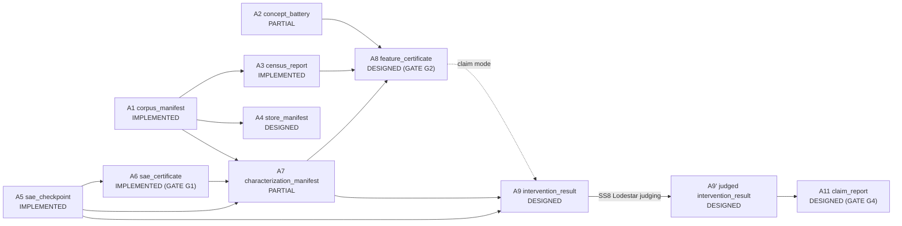

# Reproducing Golden Gate Claude on an Open-Weight Model: Sparse-Autoencoder Feature Steering in Qwen2.5-14B, with a Triangulated Feature-Quality Methodology

**Author:** Mohamed El Yazid — IID
**Date:** July 26, 2026

---

## Abstract

We report a single-model reproduction of Anthropic's Golden Gate Claude (GGC) feature-steering demonstration on an open-weight target, Qwen2.5-14B and its instruction-tuned variant, using sparse autoencoders (SAEs) trained in-house. The headline result is feature 9056, an identity-substitution "cheese" feature discovered on the instruct-model SAE (rwu04lpb, layer 28), which at steering scale 55 produces coherent, prompt-responsive text under LLM-judged evaluation: coherence 5.38, concept relevance 5.50. To assess feature quality beyond a single steering run, we developed a triangulated methodology combining open-ended survey statistics, rate-matched selectivity controls, and judged steering sweeps, three independent measurements that agree on the same feature ranking. We also report four negative results as findings in their own right: an exhaustive multi-attempt failure to isolate a clean "poutine" feature, a self-corrected discovery that an apparent Montreal/Quebec feature is bilingually entangled, evidence that base-model SAEs do not transfer to instruct-model geometry, and a fluency-before-topicality failure at high steering scale. Equally central to this internship is the research infrastructure built to support it. Lodestar, a six-rubric LLM-judge evaluation harness, was implemented and heavily exercised throughout: every judged operating point reported here is a Lodestar output. Interlab, a certificate-based provenance laboratory spanning eleven chain artifact types across twelve subsystems, is exercised end-to-end only as far as SAE certification (Gate G1); its remaining chain — feature validation, steering results, and claim assembly — is designed and schema-complete but not yet populated with live artifacts, by researcher decision rather than architectural gap. A cross-model arm (Gemma Scope) was staged but not run; findings here are scoped to Qwen2.5-14B(-Instruct) only.

---

## 1. Introduction

Anthropic's Golden Gate Claude demonstration showed that clamping a single sparse-autoencoder feature to a high value could make a production language model discuss itself in terms of that feature's concept — famously, the Golden Gate Bridge — while remaining otherwise coherent. That demonstration was run on a closed, proprietary model with internal tooling, and its public writeup reported qualitative examples rather than a quantitative, judge-scored evaluation of the steering effect across scales and features. This leaves an open question for the broader interpretability community: does the same phenomenon reproduce on an open-weight model, using an independently built training, certification, and evaluation pipeline, and can feature quality be assessed systematically rather than by inspection of hand-picked generations?

This report addresses that question for Qwen2.5-14B and Qwen2.5-14B-Instruct (Alibaba), chosen as the open-weight target for this internship. Four TopK SAEs were trained across three base-model checkpoints and one instruct-model checkpoint at layers 24 and 28, at expansion factors of 16× and 32×, with the instruct-model SAE (rwu04lpb) trained directly on the instruction-tuned model's own residual stream. The project's scope is deliberately single-model: a cross-model arm intended to repeat the discovery-validation-steering-multilingual battery on Gemma-2-9B (fallback Gemma-2-2B) — the "Gemma Scope arm" — was designed and scoped but is staged, not run, and is deferred to Future Work (Section 9).

Within that single-model scope, this report's contribution is not merely reproducing the steering effect but building and applying a methodology for judging *which* discovered features are trustworthy before or independently of steering them. Three measurement families — open-ended feature survey statistics, rate-matched selectivity controls against baseline probes, and LLM-judged steering sweeps scored by Lodestar (a purpose-built evaluation harness) — are shown to converge on the same quality ranking across three candidate features. This triangulation, together with four negative results reported with identified mechanisms rather than as gaps, and two supporting infrastructure contributions (Interlab for content-addressed provenance, Lodestar for judged evaluation), is what the original GGC blog post did not publish in comparable, auditable form. This report accordingly delivers two things together, neither subordinate to the other: a set of scientific findings about feature quality and steerability in Qwen2.5-14B, and a reusable laboratory infrastructure — Interlab's certificate-based provenance architecture and Lodestar's judged-evaluation harness — built to produce and audit those findings, described in full in Section 5.

The remainder of this report proceeds as follows. Section 2 describes the methods: the nine-stage pipeline, the four training runs, SAE certification, feature discovery, characterization, steering and judged evaluation, multilingual analysis, and seven methodological fixes made along the way. Section 3 reports the quantitative results, led by the cheese-feature headline result and the triangulation analysis. Section 4 reports the negative results. Section 5 describes the two infrastructure contributions. Sections 6 and 7 address threats to validity and reproducibility. Section 8 discusses the broader implications, and Section 9 lists future work. Appendix A provides a claim-by-claim evidence ledger, and Appendix B lists the supplementary material accompanying this submission.

To state the scope boundary plainly at the outset: this is a systematic, single-model reproduction and methodology study on Qwen2.5-14B(-Instruct). It does not claim cross-model generality — the Gemma Scope arm that would test that generality was staged but not executed — and its steering claims are, unless stated otherwise, sufficiency demonstrations (clamping a feature produces an effect), not necessity demonstrations (no ablation control was run to show the effect disappears without the feature). Both boundaries recur, with full detail, later in this report.

---

## 2. Methods

### 2.1 Pipeline and Provenance Overview

The project pipeline has nine stages: (1) **training** (`slurm/train_sae.sh`, `train_sae.py`) produces an SAE checkpoint; (2) **activation-store QA** (`store_qa.py`, not fully exercised in this run) checks activation extraction; (3) **SAE certification** (`scripts/certify.py`) computes L0, explained variance, dead-feature fraction, FVU, and assigns a health band; (4) **feature search/survey**, via concept-probing (`find_features.py`) and open-ended survey (`survey_features.py`), identifies candidate features; (5) **feature characterization** (`characterize_lite.py`) measures selectivity and activation distributions; (6) **steering experiments** (`steering_experiment.py`, `scripts/montreal_qwen.py`) clamp features and generate text across scale sweeps; (7) **LLM-judged evaluation**, via Lodestar (`D:\lodstar`), scores generations on coherence, concept relevance, prompt adherence, and integration naturalness, and searches for optimal operating points; (8) **multilingual analysis** (`multilingual_rerun.py`) measures cross-language feature overlap; and (9) **report assembly** (`report.py`) synthesizes claims against artifact provenance.

Threading these nine stages together is Interlab (`interplab/` package), a content-addressed artifact registry: every checkpoint, certificate, characterization manifest, feature certificate, intervention result, and claim report is registered under a content hash, giving each pipeline stage a verifiable provenance record rather than an ad hoc file path. Sections 2.2–2.8 give per-stage detail; Section 5 describes Interlab's design more fully as an infrastructure contribution.

---

*Figure FP-1: The nine-stage experimental pipeline, from SAE training through report assembly, with script ownership and registry connectivity per stage.*
---

### 2.2 Model and Training Runs

Four SAEs were trained, all with TopK architecture and `rescale_acts_by_decoder_norm: true`:

**Table 1 — SAE Training Runs**

| Checkpoint ID | Layer | Expansion | k | Tokens | Corpus | Training Time | Notes |
|---|---|---|---|---|---|---|---|
| 9odeg5hb | 24 | 16× (81,920) | 100 | 166.67M / 200M (83%) | pile-10k | 12h SLURM timeout | FEATURE_EXPERIMENT_LOG.md §1 |
| de575ae6 | 24 | 16× (81,920) | 100 | 199.97M / 200M (99.97%) | FineWeb CC-MAIN-2013-20, 30 shards | 12h46m | §6 |
| alhjs2qg | 28 | 32× (163,840) | 100 | 399.97M / 400M (99.99%) | FineWeb, same shards | 15h11m | §11 |
| rwu04lpb | 28 | 32× (163,840) | 100 | 400M | FineWeb | — | Qwen2.5-14B-Instruct; final_400001024/; execution_roadmap.md §Done |

The dataset switch from pile-10k to FineWeb (checkpoints de575ae6 onward) was not a methodological choice but a forced workaround: `monology/pile-uncopyrighted` requires `trust_remote_code`, which current `datasets` versions refuse to execute, and Tamia compute nodes have no direct internet access for on-the-fly resolution. This same root cause produced further downstream obstacles detailed in Section 2.8, item 5.

One caveat that governs how this report's identifiers should be read: the four training-run checkpoint IDs above and the four certified-SAE IDs reported in Section 2.3 overlap at exactly one ID, rwu04lpb. The other three certified SAEs (d1bgp5v5, zf2o13m2, o1cx1dow) do not have a documented training-run counterpart in this inventory. This is not an inconsistency to resolve here — the full explanation and its implications for reproducibility are deferred to Section 7 to avoid repeating the caveat at length twice.

### 2.3 SAE Certification

Certification is a health gate, computed by `scripts/certify.py` over a held-out 10M-token evaluation slice at fp32, against four metrics: cross-entropy (CE) recovered, fraction of variance unexplained (FVU), dead-feature fraction, and L0, with a "band" verdict (green/amber/red) assigned from thresholds on these metrics. Four SAEs were certified:

**Table 2 — Qwen2.5-14B SAE Certification (held-out 10M-token eval slice, fp32)**

| SAE | Layer×Exp | CE recovered | FVU | Dead frac | Verdict | Cert hash (A6) |
|---|---|---:|---:|---:|---|---|
| d1bgp5v5 | L16×32 | 0.9938 | 0.0076 | 0.0020 | amber | ed82c7245ca7 |
| rwu04lpb | L28×32 | 0.9884 | 0.0103 | 0.0008 | amber | 0a572198764d |
| zf2o13m2 | L40×32 | 0.9785 | 0.0441 | 0.0000 | amber | 1167ac6f099a |
| o1cx1dow | L28×64 | 0.9884 | 0.0162 | 0.0012 | green | fbdd53715b12 |

*Figure 1: SAE certification metrics across four checkpoints (CE recovered, FVU, dead-feature fraction, band verdict).*

Certification ran within Interlab's four-stage certification lane (certify, characterize, validate, steer), which enforces the ED-32 SAE-stack baseline (sae-lens 6.44.2, transformers 5.12.1, transformer-lens 3.2.1, datasets 5.0) at startup and fails closed on version mismatch. Band verdicts should be read strictly as a health gate, not as a feature-quality signal: the headline steering result reported in this document (Section 3) uses rwu04lpb, an *amber*-band SAE, not the single green-band checkpoint (o1cx1dow). Amber-vs-green status does not predict downstream feature cleanliness; feature quality is established independently in Section 3.

### 2.4 Feature Discovery: Concept-Probing and Open-Ended Survey

Two feature-discovery methods were used in sequence. `find_features.py` performs concept-driven, specificity-ranked candidate search against concept probes and a general-text baseline; it is now deprecated in favor of an open-ended approach. `survey_features.py` ranks *all* features in a checkpoint by peak activation × (1 − nonzero fraction), surfacing candidates without requiring a concept probe set in advance. On the instruct-model SAE (rwu04lpb), a survey run (job 358227) produced a top-150 ranked list from which the cheese, UNESCO, and Eurovision candidate features (Section 3) were drawn. This ranking is only meaningful after the outlier-norm masking fix described in Section 2.8, item 3; without it, a single artifact context dominates the top of the list.

The survey method is described here as recorded in the experiment log, not from an independently re-run or locally re-verified artifact: job 358227's output file (`results/feature_survey.json`, expected to contain the top-150 features with logit attribution and five max-activating examples per candidate) was not located in a spot check of the local `results/` tree, and its residency is presumed to be on the cluster rather than confirmed present locally. Accordingly, the top-150 list is not reproduced as a table in this report; only the three candidate features that were subsequently carried through characterization and steering are treated as verified.

### 2.5 Characterization and Selectivity Methodology

`characterize_lite.py` is an ad hoc script, not part of the production certification infrastructure, that measures feature selectivity against a document sample and a rate-matched control. For the instruct-model SAE (rwu04lpb, layer 28), the sample was 5,000 FineWeb documents comprising 1,712,777 token positions, with a population median firing rate of 4.03e-05. Selectivity for a candidate feature is reported as its firing-rate multiple over this population median, together with the maximum and mean activation on firing positions and the number of firing events; a rate-matched control feature (chosen to fire at a comparable overall rate but on an unrelated concept) is measured alongside each candidate as a check against firing-rate artifacts.

This ad hoc/production-infra distinction is flagged here once because it qualifies every selectivity number reported downstream (Section 3.2) without needing repetition per number: the method is sufficient as report-level evidence but is not a substitute for a full characterization-pipeline certificate, and its statistical resolution degrades for rarer concepts — the Eurovision candidate, with only 395 firing events in the sample, has correspondingly lower resolution than cheese or UNESCO. Activation-distribution figures produced by this method are placed in Results Section 3.2, where they support the triangulation claim directly, rather than here.

### 2.6 Steering and LLM-Judged Evaluation (Lodestar)

Steering is implemented as an encode-override-decode hook (`steering_experiment.py`; shared hook library in Interlab's `interventions/` subpackage) that clamps a chosen SAE feature's activation to a fixed scale during generation, with `rescale_acts_by_decoder_norm` support. Scale sweeps typically covered the range 40–150. Generations produced under each scale are scored by Lodestar, a purpose-built LLM-judge evaluation harness, using the judge model claude-sonnet-4.5 across four rubrics: coherence, concept relevance, prompt adherence, and integration naturalness. Judgments are cached in a content-addressed SQLite store (keyed on text, rubric, judge model, and repeat count) to avoid re-judging identical text, and an `estimate`/`--budget` mode predicts and caps cost before a run executes. Lodestar additionally implements an optimal-operating-point search: given a sweep, it returns the scale that maximizes concept relevance subject to a user-defined coherence floor (e.g., coherence ≥ 5), which is how the headline operating point in Section 3.1 was selected.

One distinction is still worth stating explicitly. The experiment log's phrase "Lodestar judge reliability confirmed" refers to a specific bug fix (Section 2.8, item 2): correcting `sweep_hash` so that ablation runs (scale = 0.0) are no longer silently averaged into steering-scale frontiers — a statement about analysis grouping, not about the judge. The judge's repeat-judgment agreement was, however, measured directly on every judged run in this report: each generation was scored with three repeat judgments, and per-rubric self-consistency was computed as Krippendorff's α (with ICC, and Fleiss' κ for the binary rubric). Across the six standard evaluation runs (56–161 items each), α ≥ 0.91 on every rubric, with coherence between 0.983 and 0.998 (`results/lodestar_*/reliability.csv`). One artifact requires explicit exclusion: the extreme-scale Montreal sweep directory (`lodestar_montreal_golden_gate`, scales 50–700) contains judgments produced by a deterministic mock judge (`mock-deterministic-v1` in its `run.json`) — placeholder scores from a pipeline test, not LLM judgments — so its determinism-check statistics are not evidence about the real judge and are cited nowhere in this report. Consequently, no real-judge determinism-check estimate exists for degenerate extreme-scale text, and the determinism-check figures here are scoped to the tested operating range where the Section 3 results live. What remains unexercised is human-correlation validation: no human-label study was run, so these α values measure the judge's self-consistency, not its agreement with human raters. Because the judge runs at temperature 0, these repeats measure near-deterministic repeat agreement under fixed settings — a determinism check, not judge reliability, stability, or validated repeatability.

### 2.7 Multilingual Methodology

Cross-language feature overlap was measured with `multilingual_rerun.py` over four concepts (world_cup, quebec, poutine, couscous) and four languages (English, French, Chinese, Arabic), using 10–25 probe sentences per language. For each (concept, language) pair, the top 20 features by mean activation over probe tokens were computed, and pairwise Jaccard overlap of these top-20 sets was measured across language pairs (BOS token excluded). All multilingual results cited in this report (job 383758) are from the instruct-model SAE (rwu04lpb); this is a hard citation constraint rather than a soft preference. An earlier multilingual analysis exists under `results/features/multilingual/` that predates the instruct-model SAE and uses a different checkpoint's geometry; it is not compatible with, and is not cited in, this report's multilingual findings.

### 2.8 Lessons from the Pipeline: Methodological Fixes

Seven fixes made during this project are recorded here as practitioner lessons for the next team running a similar pipeline, not as apologies for defects.

**1. FFFD replacement-character bug.** `tokenizer.decode()` at BPE multibyte-token boundary splits produces the Unicode replacement character (U+FFFD, "�") in output text. The Lodestar judge received this garbled text and silently fell back to a score of 1, which was concentrated at scale=80 (37.5% of judgments at that scale) and, across all judgments, affected 97 of 1,872 (5%). The fix strips "�" from decoded text in `steering_experiment.py`'s `generate_text()`. Left unfixed, this bug masks true coherence degradation with a spurious floor value at exactly the scales where coherence is most informative.

**2. `sweep_hash` ablation-conflation fix.** Lodestar's `sweep_hash` excludes the `scale` parameter so that scale sweeps group together for frontier analysis, but this meant an ablation condition (scale = 0.0, answering different, ablation-specific prompts) shared the same feature-ID/config hash as steering sweeps and was silently averaged into the steering frontier. The fix adds an `experiment` metadata column to `EvalRun.scores()` and groups by `experiment` in addition to `sweep_hash` in `coherence_relevance_frontier()` and `optimal_operating_points()` (`lodestar/models.py`, `lodestar/metrics/derived.py`); all 50 pre-existing Lodestar tests still pass after the change.

**3. Outlier-norm masking in feature survey.** Certain token positions have outlier L2-norm (>4× the per-sequence median), and `max_activation` computed over all positions spikes many unrelated features simultaneously, making them all rank near the top of a peak × sparsity survey score. Before the fix, the top-30 survey candidates were dominated by a single artifact position ("France won the 2018 World Cup," present in 27 of the top 30 features). The fix masks positions where `acts.norm(dim=-1) > 4 × median_norm` before computing statistics, remapping context windows via `kept_indices`. The cheese, UNESCO, and Eurovision candidates used in this report only emerged as clean, thematically coherent top candidates after this fix.

**4. Chat-template gap.** Base-model steering scripts never called `tokenizer.apply_chat_template()`, so prompts were fed as raw text continuations rather than questions to answer; a base model's natural continuation of "who are you?" is more document text, not a first-person reply. This was initially conflated with SAE feature quality — a weak-looking steering effect was attributed to the feature rather than to the prompting mismatch. The fix adds a `--chat_template` flag to `montreal_qwen.py`, threaded into `steering_experiment.py`'s `generate_text()` (off by default for backward compatibility); once applied, steered responses on the instruct model opened with clean first-person identity claims.

**5. Dataset-loading obstacles.** Three distinct obstacles forced changes to data acquisition. First, `monology/pile-uncopyrighted` requires `trust_remote_code`, which current `datasets` versions refuse to run, with no re-enable flag, blocking any revert to the original dataset configuration; the workaround was switching to pile-10k (Parquet, no loading script). Second, `load_dataset('HuggingFaceFW/fineweb', split='train[:200000]', ...)` on a sharded dataset silently resolved the *entire* shard file list rather than stopping after enough rows for a non-streaming slice, triggering a 27,468+ parquet-shard (50+ TB) download; this was killed after 1.5 hours (158/27,468 files, ~300 GB downloaded), and the fix uses `streaming=True` with `itertools.islice` for verification and explicit `hf_hub_download` over an exact file list for training. Third, Tamia compute nodes have no direct internet access, so datasets must be pre-cached from a login node before a training job can run.

**6. SAE dtype cascade bug.** `ActivationsStore.get_activations()` allocates its output buffer with no explicit dtype argument, silently defaulting to float32 regardless of the SAE's configured dtype. For bfloat16 SAEs this produced a type mismatch in the loss computation and a `RuntimeError` during `backward()`, because `TrainingSAE.process_sae_in()` casts locally but `training_forward_pass()` used the original, unconverted tensor. Three configuration fields were also found to be silently dropped by `train_sae.py`: `TopKTrainingSAEConfig.dtype` (defaulting to float32 independent of the runner's configured dtype), `output_path` (defaulting to `"output"`, causing a silent redundant copy to `$HOME`), and the Weights & Biases logger configuration (never wired at all). The fix monkeypatches `SAETrainer._train_step` to cast `sae_in = sae_in.to(sae.dtype)` once before either downstream code path, explicitly wires `dtype`, `output_path`, and the logger into the training YAML configs, and adds a smoke-test harness to catch out-of-memory failures cheaply before committing to a full 24-hour run.

**7. Specificity-ratio epsilon floor.** The specificity metric `mean_poutine / (mean_general + 1e-8)` blows up to `mean_poutine × 10^8` whenever the denominator hits the epsilon floor, which happens whenever a feature never ranks in the top-100 activations (TopK SAEs produce hard zeros outside the top-k) for any baseline probe. Ratio values in the hundreds of millions look meaningful but are an artifact of the floor, not a real specificity signal. The practical fix is to report the raw `mean_concept_activation` value instead of the ratio whenever a concept has zero baseline co-occurrence.

## 3. Results

### 3.1 Headline Result — Feature 9056 (Cheese) Steering Reproduction

Feature 9056, surfaced by the open-ended survey (Section 2.4) on the instruct-model SAE (rwu04lpb, layer 28), reproduces the Golden Gate Claude identity-substitution effect on Qwen2.5-14B-Instruct. At the operating point selected by Lodestar's coherence-floor search (coherence ≥ 5), steering scale 55, the feature achieves coherence 5.38, concept relevance 5.50, prompt adherence 3.13, and integration naturalness 1.75 (Table 3; source: FEATURE_EXPERIMENT_LOG.md §27d, run `lodestar_cheese_fine_v2/`). Of the three candidate features carried through full evaluation in this report (9056/cheese, 47735/UNESCO, 44189/Eurovision; Section 3.2), 9056 has the widest usable operating window — the span of scales that stay near the coherence floor while still producing on-topic content.

Qualitatively, generations at scale 55 open with identity claims of the form quoted below:

> "I'm an aged cheese..."
> — steering scale 55, feature 9056; quoted in FEATURE_EXPERIMENT_LOG.md §27a. (The underlying generation file, `results/steering_sweep_instruct/cheese_curds_fine/example_generations.md`, was not present under the local `results/` tree at the time of writing; this quotation is reproduced from the experiment log rather than independently re-verified against the generation file.)

The generation remains responsive to the original prompt rather than collapsing into unrelated repetition, consistent with a prompt-adherence score of 3.13 rather than near zero.

**Table 3 — Feature 9056 (cheese) Full Scale Sweep (40–150)**

| scale | coherence | concept_relevance |
|---:|---:|---:|
| 40 | 6.50 | 2.63 |
| 45 | 5.88 | 4.13 |
| 50 | 4.75 | 5.00 |
| 55 | 5.38 | 5.50 |
| 60 | 4.50 | 7.75 |
| 80 | 4.25 | 6.63 |
| 100 | 4.38 | 7.88 |
| 120 | 4.75 | 9.63 |
| 150 | 3.25 | 9.13 |

*Source: FEATURE_EXPERIMENT_LOG.md §27d, lines 2483–2489, 2501–2507.*

*Figure 2: Feature 9056 (cheese) steering scale curve, scales 40–150, final FFFD-corrected evaluation.*

*Figure 3: Feature 9056 (cheese) steering scale curve, scales 45/50/55, intermediate-scale refinement around the selected operating point.*

The full sweep is presented, not just the chosen optimum, because the coherence/relevance trade-off is non-monotonic: scale 60 achieves higher relevance (7.75) than scale 55 but at lower coherence (4.50), and scale 40 achieves higher coherence (6.50) at much lower relevance (2.63). The coherence-floor search selects 55 as the highest relevance achievable without breaching the coherence floor, not as a global maximum of either metric in isolation.

This evidence establishes sufficiency only: clamping feature 9056 produces the identity-substitution effect described above. No ablation or necessity control — removing feature 9056 and confirming the effect disappears — was run in this study (see Section 6.1 and Section 9), and the word "necessary" should not be read into this result.

### 3.2 Feature-Quality Triangulation

The central methodological claim of this report is that three independent measurements — open-ended survey/characterization labels, judged steering-sweep outcomes, and rate-matched selectivity controls — converge on the same quality ranking across the three candidate features: 9056 (cheese) > 47735 (UNESCO) > 44189 (Eurovision). Each column of evidence is presented in turn.

---

*Figure FP-2: Three independent measurement families converge on the same feature-quality ranking; Eurovision (44189) is rejected by all three.*
---

**Column 1 — monosemanticity label.** The characterize_lite selectivity report (Section 2.5) labels 9056 and 47735 both "clean monosemantic," and 44189 "weak / marginal" (Table 5 below).

**Column 2 — judged steering.** At their respective optimal operating points, the three features diverge sharply on prompt adherence and integration naturalness despite similar coherence:

**Table 4 — Lodestar-Judged Optimal Operating Points (coherence ≥ 5 floor)**

| Feature | Concept | Optimal Scale | Coherence | Concept Relevance | Prompt Adherence | Integration Naturalness |
|---:|---|---:|---:|---:|---:|---|
| **9056** | **cheese** | **55** | **5.38** | **5.50** | **3.13** | **1.75** |
| 47735 | UNESCO | 100 | 5.38 | 8.13 | 1.63 | 1.13 |
| 44189 | Eurovision | 100 | 5.00 | 7.50 | 1.00 | 1.00 |

*Source: FEATURE_EXPERIMENT_LOG.md §27d (cheese), §28 (UNESCO), §29 (Eurovision). Lodestar runs: `lodestar_cheese_fine_v2/`, `lodestar_unesco/`, `lodestar_eurovision/`.*

47735 reaches higher concept relevance (8.13) than 9056, but at the cost of prompt adherence (1.63) and integration naturalness (1.13) roughly half of 9056's — a "clean-but-override" pattern in which the feature takes over the response rather than integrating with it. 44189 is weakest across all four rubrics simultaneously.

**Column 3 — selectivity vs. rate-matched control.** The characterize_lite report (5,000 FineWeb documents, 1,712,777 token positions, population median firing rate 4.03e-05) measured each candidate's firing rate, peak activation, and mean activation on firing positions:

**Table 5 — Feature Selectivity (rwu04lpb, instruct-SAE, layer 28)**

| Feature | Concept | Firing rate | ×median | Max act | Mean (firing) | n firings | Selectivity |
|---:|---|---:|---:|---:|---:|---:|---|
| 9056 | cheese | 5.86e-04 | 14.5× | 47.50 | 8.71 | 1003 | clean monosemantic |
| 47735 | UNESCO | 4.08e-04 | 10.1× | 40.75 | 6.55 | 699 | clean monosemantic |
| 44189 | Eurovision | 2.31e-04 | 5.7× | 8.50 | 3.61 | 395 | weak / marginal |

*Source: results/characterize_lite/rwu04lpb/characterize_lite.json.*

Control checks reinforce the ranking directionally rather than merely repeating it: feature 90537 (cheese-rate-matched control) tops out at 21.4, well below 9056's 47.50, showing 9056 clears its own control by more than 2×; feature 2002 (Eurovision-rate-matched control) tops out at 28.1, *above* 44189's own maximum of 8.50 — 44189 fails to beat a feature chosen specifically to match its firing rate on unrelated content.

*Figure 4: Feature selectivity comparison across 9056, 47735, and 44189, with rate-matched controls.*

*Figure 5: Activation distribution, feature 9056 (cheese).*

*Figure 6: Activation distribution, feature 47735 (UNESCO).*

*Figure 7: Activation distribution, feature 44189 (Eurovision).*

*Figure 8: Feature 47735 (UNESCO) steering scale curve, scales 40–150 plus mid-sweep refinement at 85/90/95/105/110.*

*Figure 9: Feature 44189 (Eurovision) steering scale curve, scales 40–150.*

Feature 44189 (Eurovision) is best understood as a candidate the triangulation method *correctly rejects*, not as a pipeline failure: it fails its own rate-matched control, scores weakest on every judged rubric, and carries the "weak / marginal" characterize_lite label — three independent signals agreeing on rejection rather than one. The execution roadmap had pre-flagged Eurovision as weak and specified it should be carried into the final comparison "only if it costs nothing" (a scoping rule recorded in docs/execution_roadmap.md); its inclusion here, alongside a documented failed control check, satisfies that criterion and demonstrates the rejection was a deliberate, logged decision rather than an oversight.

### 3.3 Multilingual Cross-Language Feature Overlap

Cross-lingual overlap of the top-20 most-activated features per concept, measured on the instruct-model SAE (rwu04lpb, layer 28, job 383758), is concept-dependent and orders by apparent concept globality:

**Table 6 — Multilingual Cross-Language Feature Overlap (rwu04lpb, layer 28)**

| Concept | Shared all 4 langs (en/fr/zh/ar) | Shared frac | Mean pairwise Jaccard |
|---|---:|---:|---:|
| world_cup | 13/20 | 0.65 | 0.66 |
| quebec | 12/20 | 0.60 | 0.62 |
| poutine | 10/20 | 0.50 | 0.51 |
| couscous | 4/20 | 0.20 | 0.38 |

*Method: per (concept, language), mean feature activation over probe tokens → top-20 features; Jaccard = top-20 overlap per language pair; BOS excluded. Source: job 383758; 10–25 probe sentences per language.*

*Figure 10: Cross-language feature-overlap (Jaccard) by concept.*

Poutine's 0.51 mean pairwise Jaccard must be read at the correct unit of analysis: it is a *set-level* overlap of the top-20 most-activated features per language, indicating that the model represents "poutine-adjacent" content with broadly similar feature sets across English, French, Chinese, and Arabic at the population level. It does not indicate that a *single monosemantic poutine feature* exists anywhere in that set. This finding does not contradict the negative result reported in Section 4.1 (no clean poutine feature found after 16 targeted searches across two checkpoints); the two findings operate at different units of analysis — feature-*set* overlap versus single-feature cleanliness — and should not be read as being in tension with one another.

The apparent ordering by concept globality (world_cup > quebec > poutine > couscous) is a qualitative, interpretive link drawn from these four data points, not a relationship validated against any independent measure of concept prevalence or training-corpus frequency; no validated concept-prevalence or corpus-census measurements are part of this report's evidence base, so no quantitative correlation between globality and Jaccard overlap is claimed here.

### 3.4 SAE Certification Health (Cross-Reference Summary)

Restating Table 2 (Section 2.3) in results-facing terms: all four certified SAEs clear their health gates (CE recovered ≥ 0.9785, dead-feature fraction ≤ 0.0020, with zf2o13m2 at exactly 0.0000). The checkpoint underlying every headline and triangulation result in this report, rwu04lpb, is amber-band with CE recovered 0.9884 and dead-feature fraction 0.0008 — not the single green-band checkpoint (o1cx1dow). The point of restating this here is narrow: the cheese-feature headline result and the triangulation ranking both sit on a health-gated, but not top-band, checkpoint, which is worth keeping in view rather than assuming implicitly that only the "best" checkpoint produced usable results.

---

## 4. Negative Results

### 4.1 No Poutine Feature Across 16+ Attempts

Across sixteen distinct feature-search and steering attempts spanning two SAE checkpoints (9odeg5hb, trained on pile-10k; de575ae6, trained on FineWeb), no clean, monosemantic "poutine" feature was found. The root cause is training-corpus coverage: pile-10k, a small, generic subset of the Pile, contained little to no actual poutine content, so the SAE had no dedicated direction to learn (FEATURE_EXPERIMENT_LOG.md §1b, lines 42–76).

Two methodological traps compounded the search. First, specificity-ranking is not a monosemanticity test: feature 77391 scored a specificity ratio of 464 million× against a general-text baseline — an apparently overwhelming signal — yet decoded to a generic "Canada" concept, not poutine specifically (§2, Problem #1, lines 92–120). The metric only proves the feature is uniquely activated within the probe set used, not that it is clean or monosemantic. Second, doubling dictionary capacity did not resolve the problem: the 32×-expansion, 400M-token FineWeb checkpoint (alhjs2qg) cleanly separated France-culture and generic-sandwich features but still left poutine entangled — its best candidate, feature 96339, fired on generic fried foods rather than poutine specifically (§11, lines 1191–1268).

Combining features as a workaround also failed to resolve the trade-off cleanly: pairing feature 65223 (recipe) with feature 10413 (Montreal) achieved a 0.62 literal "poutine" hit rate at best, with text quality degrading sharply above steering scale 80. Nine weighting variants were tested to find a breakpoint; equal weighting proved to be a local optimum, and any deviation (1.2/1.0, 1.5/0.5, or a higher repetition penalty) reduced the literal hit rate rather than improving it (§8–§9).

This is reported as an honest negative result, per the project's stated negative-results guidance, rather than as a pipeline defect: the same pipeline produced two independently clean results elsewhere — feature 9056 (cheese, Section 3.1) and, separately, Celine Dion features (19815/singing, 96590/Las Vegas), which generated 14 literal name hits from a globally famous, well-represented concept (§12). The contrast between a globally salient concept (Celine Dion) and a niche one (poutine, never dedicated a feature even at 2× dictionary capacity) suggests concept coverage in the training corpus, not pipeline capability, bounds what is discoverable. This thread is picked back up in Discussion (Section 8).

### 4.2 Montreal/Quebec Bilingual Entanglement

This subsection reports both a finding and a correction of the team's own earlier work, and the correction is itself part of the evidence. In an earlier pass (§13), feature 10413 appeared to be a clean Montreal/Quebec place feature: it produced 25 literal "Montreal"/"Quebec" hits with geographically accurate content, including references to Mount Royal, the Notre-Dame Basilica, and Concordia University. That claim was subsequently overturned by the team's own follow-up analysis in §19–22, on the strength of four independent, convergent angles of evidence:

1. **Logit attribution.** Of the top-10 tokens attributed to feature 10413, only one is literally "Montreal"; the rest skew toward language, locale, and translation-related tokens (§19, line 1753).
2. **High-scale steering.** Cranking the feature to scales 175–700 does not sharpen Montreal content — it surfaces translation- and language-course-related content instead ("translate," "batch," "mode," "slots"), never converging on Montreal geography (§21, lines 1998–2030).
3. **English geography-scoped probes.** Probe sets restricted to Montreal-only or province-scope geographic content still rank a generic "Canada" feature (54439) as the top candidate, not a Montreal-specific one (§19, lines 1768–1792).
4. **Chinese probes with a matched baseline.** Re-running the search in Chinese token space, with a matched baseline, reproduces the same entanglement pattern — border relations, generic Canada, culture, rivers, and climate content — rather than Quebec-specific content (§22, lines 2048–2108).

**Table 7 — Montreal/Quebec Feature Search Negative Results (layer 24, v3 checkpoint)**

| Probe Set | Language | Top Candidate | Result | Notes |
|---|---|---|---|---|
| montreal_place | en | 54439 | generic "Canada" | L24, 32x, pure-geography probes |
| quebec_geographic | en | 54439 | generic "Canada" | L24, 32x, province-scope probes |
| quebec_geographic | zh | 131925 | border/neighbor relations | L24, 32x, Chinese probes with matched baseline |
| — | zh | 4269 | "Canada" (加拿大 token) | Same Chinese run, rank-4 feature |

*Source: §19, lines 1768–1900; §22, lines 2048–2108.*

*Note on checkpoint identity: the experiment log records these searches at layer 24 with a 32×-dictionary checkpoint, referred to internally as "v2"/"v3." Table 1 (Section 2.2) contains no layer-24, 32× training run — Table 1's layer-24 entries (9odeg5hb, de575ae6) are 16× expansion, and its 32× entries (alhjs2qg, rwu04lpb) are layer 28. This layer/width combination is therefore not present in Table 1's training-run list, and the exact checkpoint identity for these specific searches cannot be pinned to a Table 1 ID from the evidence available. The four-angle entanglement finding itself does not depend on resolving this discrepancy, but the checkpoint attribution is carried at reduced confidence in the Evidence Ledger (Appendix A).*

The Chinese-probe angle is the strongest single piece of evidence here: it rules out the possibility that the entanglement is an artifact of English-language token structure or probe wording, since the same pattern — generic Canada/border/geography content rather than a Quebec-specific signal — re-emerges in an entirely different token space with an independently constructed matched baseline. Taken together, the four angles support a firm conclusion: there is no clean, monosemantic "Montreal/Quebec the place" feature at layer 24 on the base-model FineWeb-era checkpoints (recorded in the experiment log under its internal shorthand "v2"/"v3"), regardless of probe language or geographic scope. The concept is entangled with bilingual/language clusters and generic geography, which is itself a reportable finding about this model's internal representation, not merely an absence of a finding.

The self-correction itself is worth stating plainly rather than downplaying: the §13 claim was an internally published result, and it was overturned by the same team's own later, more rigorous analysis. That the negative-results discipline caught and corrected its own earlier positive claim is a credibility asset for this report's other claims, not a weakness to soften.

### 4.3 Base-Model SAE Non-Transfer to Instruct-Model Geometry

Feature steering that works reliably on base Qwen2.5-14B does not necessarily work at all on Qwen2.5-14B-Instruct, even with the identical SAE checkpoint and the same layer index. Feature 19815 ("singing"), at scale 110, produces reliable singing-obsession text on the base model (§23), but produces no observable effect when the same checkpoint and feature index are applied to the instruct model.

The identified root cause is representational: the SAE in question was trained on the base model's residual-stream geometry at layer 28, and instruction-tuning (including RLHF) reorganizes internal representations substantially enough that the same layer 28 in the instruct model has a different geometry. Clamping "feature 19815" in that space no longer clamps a singing direction — it perturbs a direction that means something else, or nothing coherent, in the instruct model's geometry (§24, lines 2243–2256). The practical implication is direct: reproducing the full Golden Gate Claude effect on the instruct model required training a fresh SAE directly on the instruct model's own activations (Section 2.2, rwu04lpb), rather than reusing the base-model checkpoint.

This finding should be read as a fresh, generalizable methodological point — practitioners steering an instruction-tuned model should budget for RLHF-driven geometry drift before assuming a base-model SAE will port to the chat variant — rather than as a local troubleshooting footnote specific to this one feature. At the same time, the evidence base for this claim is a single feature (19815) tested in this way; it was not verified across a broader set of features, and the finding should be scoped accordingly rather than treated as an exhaustively tested property of base-to-instruct transfer in general.

### 4.4 Steering Breaks Fluency Before Topic at High Scale

For an entangled feature, pushing steering scale upward trades fluency for topicality in the wrong order: it degrades before it ever reaches an "obsessed but readable" effect. The Montreal feature (10413) at scales 175–500 first surfaces translation/language-course artifacts (as reported in Section 4.2, angle 2) and then collapses into word salad at higher scales, never achieving on-topic and fluent text simultaneously (§21, lines 1998–2030).

*Figure 11: Montreal-feature (10413) solo steering, Lodestar-judged coherence and concept relevance across scales 50–150 (`lodestar_montreal_eval`); operating point at scale 80 under the coherence ≥ 5 floor. The extreme-scale range (175–700) is not shown: its only judging artifacts are mock-judge placeholders (Section 2.6), so the fluency collapse at those scales rests on the logged qualitative samples cited in the text.*

A related Lodestar-judged coherence–relevance frontier for the same feature is available at `results/lodestar_montreal_eval/report.html`, which reports an optimum near scale 80; this artifact is cited here as a path rather than reproduced as an embedded figure.

This failure mode contrasts with feature 9056's behavior in Section 3.1: 9056's coherence/relevance trade-off across scales 40–150 is also non-monotonic, but it never collapses into incoherent word salad within the tested range, and its optimal point remains both on-topic and prompt-responsive. The fluency-before-topicality failure documented here is a property of the *entangled* Montreal feature specifically, not a general property of steering at high scale, and should not be generalized to imply that clean features such as 9056 share the same failure mode.

## 5. Research Infrastructure: A Certificate-Based Laboratory for SAE Interpretability

Infrastructure is treated here as a first-class deliverable of this internship, not a Methods appendix: a substantial share of the internship's time went into building Interlab and Lodestar, and both are described at the level of design reasoning, not just as tools that happened to produce Section 3's numbers.

### 5.1 Why Infrastructure Became a First-Class Problem

A repository audit and replication review, conducted before this run, identified three blocking infrastructure gaps that had lengthened feature work into what the project's own documentation calls "two blocked months" (docs/infrastructure_architecture.md §Gap Analysis).

**Silent SAE health failure.** The pipeline had no way to distinguish a well-trained SAE from an undertrained one. TopK architecture's fixed L0 (100 active features per token, used throughout this project's checkpoints; Table 1) actively hides the kind of sickness that an L1-penalized SAE would surface through its sparsity statistics directly — an undertrained TopK SAE can still report exactly 100 active features per token regardless of whether those features are meaningful. As a result, feature-discovery work in the early stages of this project ran on uncertified instruments: there was no gate that could have stopped work on a checkpoint before its health was known.

**Incomparable feature derivations.** Every experiment script maintained its own private copy of steering hooks and concept probes rather than calling a single shared implementation. Concretely, a steering bug — the residual stream was replaced by a reconstruction in non-identity form, using raw, unitless clamp values rather than a calibrated scale — was copied from script to script across multiple experiments. Because each copy diverged slightly and none were tested against a shared reference, results produced under the buggy and non-buggy versions were not comparable to each other, invalidating weeks of prior work before the bug was traced to its source.

**Corpus identity erasure.** Concept probe sentences were hardcoded directly inside `scripts/find_features.py` rather than tracked as a versioned artifact, and the pile-10k-to-FineWeb dataset switch (Section 2.2) was recorded in prose only, inside the experiment log (§1b). There was no canonical, machine-checkable answer to a question as basic as "how often did this SAE's training corpus actually contain the word poutine" — a gap that directly undercuts the poutine negative result in Section 4.1, where training-corpus coverage is the identified root cause but could only be argued qualitatively, not measured against a pinned corpus manifest.

These three failures are local instances of a reproducibility problem that is not specific to this project: steering results across the mechanistic-interpretability literature are frequently reported without a shared, tested hook implementation, without a version-pinned or content-addressed training corpus, and without a judged (rather than eyeballed) evaluation metric, which is precisely what makes results hard to compare paper to paper. Interlab and Lodestar were built as this project's answer to that gap. As of the architecture document's own status marker, the laboratory specification was DESIGNED — drafted as an architecture document — with implementation beginning in July 2026 (architecture inventory §A).

### 5.2 Interlab as Laboratory Architecture

Interlab (`interplab/` package) is best understood as a laboratory architecture, not a utility library: a set of design commitments about how artifacts, code, and claims relate to each other, realized across twelve subsystems (SS1–SS12) and twelve artifact schemas (A1–A12).

Five commitments run through the design (docs/infrastructure_architecture.md §Design Philosophy). **Certificates, not vibes** (IMPLEMENTED): every artifact carries a machine-generated pass/fail gate, claims chain certificates rather than assertions, and an incomplete certificate chain is auto-stamped `UNCERTIFIED` rather than silently treated as passing. **Explore freely, claim expensively** (PARTIAL): gates are designed to block *claims* — reports and papers — not exploratory runs, so infrastructure should never slow down exploration; in practice this claim-versus-explore boundary is documented but not yet enforced in a live run, since no live claim report exists yet to enforce it against (Section 5.4). **One implementation per concept** (IMPLEMENTED at the trunk level): steering hooks, statistics, and concept definitions each have exactly one shared implementation — `interplab.interventions` for hooks, `interplab.stats` for statistics — which is the architectural answer to the copied-steering-bug failure from Section 5.1. **Content-addressed identity** (IMPLEMENTED): every artifact is hashed at creation, and provenance is tracked by artifact hash rather than by file path, using one shared hashing module across all subsystems. **Immutability via derivation** (IMPLEMENTED at the core level): an artifact's certified-or-not status is never stored as a mutable field — it is computed at chain-assembly time by querying the registry for valid certificates, so status cannot silently drift out of sync with the evidence that justifies it.

The artifact ontology gives these commitments concrete form as twelve schema-governed types:

**Table 8 — Interlab Artifact Ontology (A1–A12)**

| ID | Artifact type | Status | Registry count | Role |
|---|---|---:|---:|---|
| A1 | corpus_manifest | IMPLEMENTED | 1 | Root artifact: pins the consumed token stream by recipe hash |
| A2 | concept_battery | PARTIAL | — (git-tracked) | Probe/negative sentences; researcher-authored only |
| A3 | census_report | IMPLEMENTED | 1 | Per-concept frequency measured over the corpus manifest |
| A4 | store_manifest | DESIGNED | 0 | QA verdict over the activation store |
| A5 | sae_checkpoint | IMPLEMENTED | 4 | Weight identity: hash of cfg.json + weights |
| A6 | sae_certificate | IMPLEMENTED | 4 | GATE G1: CE recovered, FVU, dead fraction, band |
| A7 | characterization_manifest | PARTIAL | 0 | Feature-index reference (firing rate, autointerp label) |
| A8 | feature_certificate | DESIGNED | 0 | GATE G2: specificity / sensitivity / selectivity |
| A9 | intervention_result | DESIGNED | 0 | Generations + blinding + Lodestar scores |
| A10 | run_card | IMPLEMENTED | 5 | Provenance record written by every job |
| A11 | claim_report | DESIGNED | 0 | GATE G4: assembled chain + certification stamp |
| A12 | eval_compat_map | DESIGNED | 0 | Judge/rubric/prompt compatibility classes (outside the A1→A11 chain) |

*Source: docs/infrastructure_architecture.md §The Artifact Ontology; registry/ population counts as of the T0.3 snapshot. Five of eleven chain artifact types (A1–A11) are populated with live instances; this is stated prominently here, not smoothed over, because it is the honest current state of the laboratory, not a defect to hide.*

Above the individual artifacts, the twelve subsystems collapse into gate-level segments:

**Table 9 — Subsystem Status by Pipeline Gate**

| Segment | Subsystems | Status | Note |
|---|---|---|---|
| Certification lane | SS1 corpus/concept, SS2 store QA, SS3 training, SS4 certification, SS10 registry, SS11 tests | IMPLEMENTED (lane) | Census, backfill, and certification are running end to end; SS2 store QA specifically remains DESIGNED (no live A4 artifacts) but is not on A6's critical path |
| Feature characterization | SS5 | PARTIAL | Search API and streaming indexer code present; zero live A7 artifacts |
| Feature validation | SS6 | DESIGNED | A8 schema and `validate.py` entry point exist; zero live A8 artifacts |
| Intervention engine | SS7 | IMPLEMENTED (trunk) | Hooks, delta-form steering, and control arms complete and CI-tested; zero live A9 artifacts |
| Behavioral evaluation | SS8 | PARTIAL | Blinding module and Lodestar adapter stubs present; no live judging inside Interlab |
| Statistics & reports | SS9 | PARTIAL | Bootstrap-CI and chain-assembly logic implemented; zero live A11 artifacts |

*Source: docs/infrastructure_architecture.md §Subsystem Specifications; architecture inventory §D.*

---

*Figure FP-3: Interlab's twelve subsystems, grouped by pipeline gate and status, connected through the content-addressed registry.*
---

Four design decisions illustrate the reasoning behind this architecture, and one of them is a story about a false assumption the architecture itself caught.

**ED-27 (checkpoint identity).** A checkpoint's identity is defined as the hash of exactly two files, `cfg.json` and `sae_weights.safetensors`, deliberately excluding trainer state, optimizer state, and logs. The rationale: the config determines how raw weight bytes are interpreted as a function, and identity needs to stay stable across a training restart or resumption — directly relevant here, since the 166.67M-token partial checkpoint (Table 1) was resumed to a 199.97M-token final checkpoint — without being perturbed by incidental, non-functional state.

**ED-28 (stream-by-recipe).** The corpus manifest (A1) pins the token stream a checkpoint actually *consumed*, via a recipe hash and an explicit subset specification, rather than the identity of whatever dataset happened to be available at training time. This is the direct architectural fix for the corpus-identity-erasure failure in Section 5.1: a census computed over the exact consumed stream is what would make "how often did the SAE see poutine" an answerable, machine-checkable question rather than a qualitative one.

**ED-32/ED-33 (fail-closed version baseline, and a wrong assumption caught).** ED-32 requires certification-lane jobs to assert the SAE-lens version they run against at startup, failing closed rather than proceeding silently on any mismatch — one supported software stack per set of certificates, because a hidden version difference is a fidelity hole underneath every downstream metric. The baseline was initially recorded as sae-lens 3.23.0. ED-33's verification pass — checking that all four checkpoints actually carry a 6.x-format `cfg.json` — disproved that assumption directly: the checkpoints had in fact been trained under 6.44.2, and the recorded 3.23.0 baseline had stood unverified until this check caught it. The baseline was corrected, the environment lock rebuilt, and the golden reference artifacts (`tiny_sae`, `delta_golden`) regenerated under the corrected stack, which also required widening the golden delta test's tolerance from MAX_ULP 32 to MAX_ULP 128 to accommodate the 6.x TopK kernel's different rounding behavior. This is the fail-closed discipline working as intended: a wrong baseline was an unverified assumption sitting in a config file until a dedicated verification step checked it against the artifacts themselves and corrected it.

The immutability-via-derivation principle introduced above underlies all three: none of these identities or statuses are hand-maintained fields that could silently drift out of sync with reality — they are either content hashes computed from the artifact bytes (ED-27, ED-28) or a status computed on demand from the registry at chain-assembly time — which is precisely what made an error like the ED-33 baseline correction something that could be caught and fixed cleanly rather than propagating silently through every certificate downstream.

Verification culture is concrete rather than aspirational: 583 tests across 61 test files pass as of the ED-33 migration (git commit 1d54b52), covering identity tests, golden delta tests, battery-snapshot tests, and schema round-trip tests across all twelve artifact types. The identity test (Gate G3) checks that a no-op intervention is bit-identical to its input and runs in continuous integration on every commit. The golden delta test checks that delta-form steering on a fixed prompt matches a pinned reference within an ULP (unit-in-the-last-place) tolerance — set at MAX_ULP 32 for ordinary cross-platform CPU kernel rounding differences, and widened to MAX_ULP 128 specifically and only to accommodate the ED-33 stack migration's different TopK kernel rounding, not loosened arbitrarily. Certification-lane jobs enforce the ED-32 version baseline with fail-closed behavior: a version mismatch exits with code 4 — a distinct, explicit environment-failure exit code — rather than completing silently against an unverified stack.

### 5.3 Lodestar: A Research Platform for Judged Evaluation

**Problem statement.** Lodestar was built to replace three specific, unsustainable manual processes identified in its own architecture documentation (Lodestar `README.md`, `ARCHITECTURE.md` §0–§1): ad-hoc keyword metrics (every paper reimplements its own `mentions_poutine()`-style grep, with no calibration or human validation behind the count it reports); manual sweet-spot hunting (reading on the order of a hundred generations by hand to pick a steering scale, producing choices that look arbitrary to a reviewer because no principled frontier stands behind them); and unsupported LLM-as-judge claims (a judge model is named with no self-consistency check, no human-correlation evidence, no cost accounting, and no caching, leaving the reported number both unreproducible and unboundedly expensive to regenerate).

**The evaluation workflow as a closed loop.** Read as a research platform rather than a feature list, Lodestar closes a loop that this project actually ran, not merely designed. A cluster steering job produces a `generations.json` file; ingestion auto-detects condition, scale, feature IDs, and language directly from the file and CLI flags, without hand-written glue per experiment. Before any judging happens, a cost preflight (`estimate`, with a `--budget` ceiling that refuses to proceed over budget) bounds the spend. Judging then runs through the cached judge layer described below, producing per-generation rubric scores; derived metrics — the coherence–relevance frontier, optimal-operating-point search, control gap, Steering Efficacy Score — are computed from those scores; and the result is rendered into a single self-contained HTML evaluation report. A researcher reviews that report and decides whether to accept the result or refine the sweep, closing the loop back into a new cluster job.

Two worked examples from this run ground each half of that loop. First, the cheese campaign (Section 3.1): the judged 40–150 sweep table exposed a gap between scale 40 (coherent but weakly steering: coherence 6.50, relevance 2.63) and scale 60 (steering but less coherent: coherence 4.50, relevance 7.75) that a table of judged numbers makes visible in a way a handful of eyeballed generations would not. That gap is what motivated the targeted 45/50/55 mid-sweep (`lodestar_cheese_mid`) that located the scale-55 optimum reported throughout Section 3 (FEATURE_EXPERIMENT_LOG.md §27d) — a refinement decision made from judged tables, not from reading generations by hand. The experiment log also records the cost of the manual alternative in its own words: an operating point eyeballed from hand-picked samples had been placed at scale 90 for the Montreal feature, and the log later describes it as "the scale=90 guess that turned out to be scale=80 on real judged data" (FEATURE_EXPERIMENT_LOG.md §21, lines 2036–2039) — a wrong answer that stood until a judged frontier replaced it.

Second, the §20 report.html episode, which is where scientific review actually happened rather than merely where results were displayed afterward. A researcher reading the rendered HTML report directly flagged that its optimal-operating-points section "didn't look right" — a judgment possible only because the report surfaced the frontier in a form a person could inspect and sanity-check, not because any automated test caught it. That flag is what triggered the root-cause investigation that found the `sweep_hash` ablation-conflation bug (Section 2.8, item 2). After the fix, the report was regenerated directly from the already-saved `run.json`, reusing every cached judgment at zero new API cost (FEATURE_EXPERIMENT_LOG.md §20). This is the report functioning as the review interface, and the content-addressed cache making that review free to repeat: re-analysis after a pipeline fix required no re-judging of a single generation.

---

*Figure FP-5: Lodestar's evaluation loop, from cluster sweep to researcher-reviewed HTML report and back, annotated with the cheese scale-refinement example.*
---

**HTML evaluation reports as a first-class engineering contribution.** These reports are themselves a first-class output of this internship, not an incidental byproduct of scoring. Each is a single, self-contained file — hand-coded SVG, no server required, opens in any browser — documented to cover eight sections: overview, frontier, optimal points, control gap, cross-lingual, cross-model, validation panel, and drill-down (`report/html.py`; IMPLEMENTED). The actual rendered report for the cheese campaign, `results/lodestar_cheese_fine_v2/report_atlas.html` (367 KB, verified present), organizes those sections under project-specific headings: "Steering toward cheese," "Coherence–relevance frontier," "Control gap," "Optimal operating points," "Judge validation," "Generations," and "Export."

Grounded directly in the §20 episode above, these reports became the primary interface through which steering campaigns in this project were actually analyzed: operating points were selected by reading a rendered frontier section, not a raw JSON array; a pipeline defect was caught by a researcher reading the report, not by inspecting code; and results were reviewed and shared as a single file rather than as a collection of JSON outputs requiring separate tooling to interpret. Every `lodestar_*` results directory produced in this project contains one of these reports.

---

*Figure FP-6: Composite view of a Lodestar evaluation report (source: `results/lodestar_cheese_mid/report_atlas.html`, the mid-sweep report containing the scale-55 optimum) — overview, coherence–relevance frontier, generation drill-down with per-rubric scores, judge-validation panel, optimal-operating-points table, and export.*
---

**Platform breadth and architecture decisions.** Beyond the workflow above, Lodestar is a broader platform. Six rubrics score every generation on a fixed scale rather than a keyword match: `coherence` and `concept_relevance` (1–10 ordinal), `literal_mention` (a binary/count check running both a deterministic grep and a judge cross-check, so the two can be compared rather than conflated), `prompt_adherence` (whether the model still answers the original question), `integration_naturalness` (concept woven in versus bolted on), and a categorical `degeneration_flags` detector (repetition loops, topic salad, language drift, gibberish). Beyond the frontier and optimal-operating-point search used throughout Section 3, the derived-metrics family also includes a Steering Efficacy Score (a single per-generation composite of relevance and coherence), a control-gap statistic with 95% bootstrap confidence intervals and a Mann–Whitney U significance test against a matched control arm, a cross-lingual transfer ratio, and a cross-model comparison metric — all IMPLEMENTED and tested per the project's own documentation. Stated honestly: the paths this run's campaigns actually exercised are the frontier, optimal-operating-point selection, repeat-judging determinism check (Section 2.6), and the reporting pipeline itself; the control-gap, cross-lingual-transfer-ratio, and cross-model-comparison metrics were not the ones driving the results in Section 3, even though they are implemented and available.

One architectural decision is worth calling out on its own terms: the judge is a protocol, not a hard-coded dependency. A mock judge exists for testing, and the reference implementation (Claude, via the `anthropic` SDK) is one swappable choice among others by design. This matters scientifically, not only as an engineering convenience: the judge is treated as a replaceable, versioned measuring instrument rather than an assumed ground truth, and rubric versioning ensures that changing the judge or a rubric invalidates exactly the cache entries affected by that change, not the entire evaluation history.

**Usage facts and fixes.** This run's use of Lodestar was substantial and ran standalone against `D:\lodstar`, independent of any Interlab-mediated pipeline. The judge model was claude-sonnet-4-5-20250929; the Montreal evaluation alone consumed 161 generations and 2,898 judgments at a cost of approximately $6.84, with further cost accrued for the cheese, UNESCO, and Eurovision steering sweeps in Sections 3.1–3.2. Two fixes were made to Lodestar in the course of this run: a SQLite write-ahead-log (WAL) mode and 30-second timeout fix for judge-cache corruption under concurrent access, and the `sweep_hash` ablation-conflation fix described above and in Section 2.8. Stated plainly, because the distinction matters for how the rest of this report should be read: Lodestar the evaluation tool was implemented and heavily exercised this run — every operating point, every coherence and relevance number in Section 3, is a Lodestar output, not a manual estimate. What was *not* exercised is a separate matter, addressed next: Lodestar's designed integration boundary *inside* Interlab's own artifact chain.

### 5.4 Integration and Implementation Status

The two systems are designed to connect through Interlab's artifact chain, which threads eleven schema-governed artifact types from raw corpus to final claim. In prose, independent of whether the diagram below renders: a corpus manifest and a census report anchor what data a checkpoint saw; a trained checkpoint is certified against held-out tokens to produce a certificate; the certified checkpoint is characterized into a feature index; index entries are validated into per-feature certificates; certified features are steered to produce generations, which are then judged — this is the Lodestar integration point — to produce a judged intervention result; and judged intervention results, together with the rest of the registry, are assembled into a final claim report carrying a CERTIFIED or DRAFT stamp.

---

*Figure FP-4: The A1→A11 artifact provenance chain, with per-artifact status, registry population counts, and Gate G1 marked as the current live frontier.*
---

Every job additionally writes an A10 run_card (IMPLEMENTED; five in the registry as of this run); run cards are omitted from the diagram for clarity since they attach to every stage rather than sitting on the main chain.

The honest status, stated plainly rather than smoothed over: the production chain is live and exercised from A1 through A6 — Gate G1 — and stops there. A5 (four checkpoints, three of them backfilled rather than trained under the blueprint directly) and A6 (four certificates) are populated, alongside A1, A3, and A10 for the certification lane's own bookkeeping. Beyond Gate G1, SS7 (the intervention/hook engine) and SS9 (the statistics module) are implemented as trunk components — hooks pass their identity test and golden-delta test, and the statistics functions (bootstrap confidence intervals, false-discovery correction) are coded and tested — but intervention_result (A9) has never been populated: zero live A9 artifacts exist in the registry, and `jobs/steer.py` is a stub. Chain-assembly logic for claim reports (`interplab/reports/chain.py`) is written but has never been exercised end to end, because it requires a judged A9′ artifact as input and none exists.

This is the fact that must not be read against Section 3, and the distinction is stated here explicitly rather than left implicit: the absence of a live A9 pipeline is a statement about Interlab's own SS8 integration boundary — the blinding module and Lodestar adapter are present as stubs but untested on real generations — not a statement that steering was never judged at all in this report. It was judged, extensively, by Lodestar running standalone (Section 5.3); what has not yet happened is folding those judged results back into Interlab's own content-addressed A9 artifact type.

**Table 10 — Honest Integration Status (T0.3 snapshot)**

| Component | Status | Evidence |
|---|---|---|
| Certify lane (A1, A3, A5, A6, A10) | IMPLEMENTED, populated | 15 total registry artifacts across 5 of 11 chain types |
| Intervention engine (SS7 hooks) | IMPLEMENTED (trunk), unpopulated | Identity test + golden-delta fixture pass; 0 live A9 |
| Intervention result (A9) | DESIGNED, EMPTY | Schema drafted; 0 artifacts; `jobs/steer.py` stub only |
| SS8 Lodestar–Interlab boundary | DESIGNED, untested on real generations | Blinding module present; Lodestar adapter stubs; no live judging inside Interlab |
| Statistics & chain assembly (SS9) | IMPLEMENTED (trunk) / DESIGNED (A11) | `interplab.stats` coded and tested; `chain.py` written but never exercised end-to-end |
| Claim report (A11) | DESIGNED, EMPTY | Schema drafted; 0 artifacts; requires A9′ as input |

*Source: architecture inventory §C, §D, §J, §K (T0.3 registry snapshot: 15 artifacts across 5 of 11 chain types — 1 A1, 1 A3, 4 A5, 4 A6, 5 A10).*

This is a snapshot of current population, not a verdict on the design: the architecture's own closing assessment records no remaining architectural gaps, and the frontier for a fully live pipeline is specifically SS5/SS6 feature work and SS7/SS8 steering under certification discipline — engineering time, not a redesign.

---

## 6. Threats to Validity

### 6.1 Internal Validity

The causal claims made about specific features in this report carry two internal-validity limitations worth stating together. First, the feature 9056 steering evidence (Section 3.1) is sufficiency-only: clamping the feature produces the effect, but no ablation or necessity control — removing the feature and confirming the effect disappears — was run, so the claim cannot rule out that some other mechanism co-produces the observed text. Second, the characterize_lite selectivity statistics (Section 3.2) have uneven statistical resolution across features: the Eurovision candidate's 395 firing events in a 5,000-document sample give it markedly lower resolution than cheese's 1,003 or UNESCO's 699, which should be kept in mind when comparing selectivity numbers across the three candidates directly.

A third, more general point: the FFFD replacement-character bug and the `sweep_hash` ablation-conflation bug (Section 2.8, items 1–2) were both found and fixed during this run, but their discovery was incidental to specific analyses, not the product of a systematic audit for this class of defect. Their existence demonstrates that silent measurement-pipeline artifacts are a live risk class for this kind of study, not a closed question resolved by having fixed the two instances found so far.

### 6.2 External Validity

Every finding in this report is limited to a single model family: Qwen2.5-14B and Qwen2.5-14B-Instruct. The cross-model arm designed to test generality — the Gemma Scope arm, covering feature discovery, validation, steering, and a multilingual battery on Gemma-2-9B (fallback Gemma-2-2B) — was staged but not run (Section 9). Within this single model family, only four SAE checkpoints carry certification records (Table 2), and it is not established from the available records how many additional, uncertified or legacy checkpoints exist from earlier stages of the project; the completeness of any layer-by-width health grid beyond these four checkpoints is unclear. Multilingual coverage (Section 3.3) is similarly bounded: four concepts across four languages (English, French, Chinese, Arabic), which is enough to support the concept-globality ordering reported there but not enough to generalize to language pairs or concepts outside that set.

Stated plainly: these findings should not yet be read as claims about SAE interpretability in general. They are Qwen2.5-14B(-Instruct) findings, obtained from a specific set of checkpoints and evaluation runs, pending the cross-model comparison that would test how far they generalize.

### 6.3 Construct Validity

Three measurement instruments used in this report have known gaps between what they are labeled as measuring and what has actually been validated. First, the Lodestar scores that drive every steering result in Section 3 have high measured self-consistency (three repeats per generation, Krippendorff's α ≥ 0.91 on all rubrics in the coherent operating range; Section 2.6) — because the judge runs at temperature 0, this is near-deterministic repeat agreement under fixed settings, a determinism check rather than judge reliability, stability, or validated repeatability — but self-consistency is not validity: no human-correlation study was run, so a judge that is systematically biased but reliably so would pass this check unchanged. And no reliability estimate exists at all for heavily degenerate extreme-scale text: the only extreme-scale judging artifacts were produced by a deterministic mock judge during pipeline testing and are excluded from this report's evidence (Section 2.6), so the instrument's stability outside the coherent operating range is simply unmeasured. Second, the open-ended survey process that surfaced the cheese, UNESCO, and Eurovision candidates (Section 2.4) is described here from the experiment log (job 358227) rather than from an independently re-verified artifact, since the expected output file was not located locally; the feature-selection process itself is therefore not independently auditable from this report's evidence base. Third, the specificity-ratio metric used earlier in the project (Section 2.8, item 7) was shown to produce numerically enormous but meaningless values under an epsilon-floor edge case, which is why raw activation means, not ratios, are used wherever this report reports concept selectivity. These three points restate, in validity-threat terms, the overclaim guards first raised in Sections 2.6 and 2.4 rather than introducing new caveats. Finally, the infrastructure claims made in Section 5 are explicitly status-labeled (IMPLEMENTED / PARTIAL / DESIGNED) for the same reason: a designed-but-unexercised component — Interlab's SS8 Lodestar-integration boundary or its A9/A11 artifact types, for instance — provides no empirical guarantee about its own correctness until it has run against real data, and this report does not treat "schema written" as equivalent to "validated in use."

---

## 7. Reproducibility Statement

Interlab's content-addressed registry grounds the phrase "reproducibility infrastructure" in artifact-level detail rather than leaving it as a description of intent. Each of the twelve artifact types in the ontology (Section 5.2, Table 8) content-addresses its corresponding pipeline stage, so that a given checkpoint, certificate, or intervention result can be identified by its hash rather than by a mutable file path — with the caveat, per Table 8, that five of the eleven chain types are populated with live artifacts as of this report and the rest are schema-complete but empty. The four SAE certificates reported in Table 2 are pinned by exact hash: `ed82c7245ca7` (d1bgp5v5), `0a572198764d` (rwu04lpb), `1167ac6f099a` (zf2o13m2), and `fbdd53715b12` (o1cx1dow); each hash identifies the exact weight-and-configuration state that produced the certified metrics, not merely a checkpoint name that could later be overwritten. At the software-stack level, ED-32 pins sae-lens 6.44.2, transformers 5.12.1, transformer-lens 3.2.1, and datasets 5.0 as the baseline for the certification lane, and enforces it with fail-closed behavior: a stack mismatch stops the lane rather than silently producing results under an unverified environment. Finally, RunCard finalization means that job completion is a positive, recorded fact — every completed job leaves a timestamped, config-captured card in `registry/run_card/` — so the absence of a card is itself informative (a job that did not finish), rather than an ambiguous silence in the record.

One limitation of this provenance chain needs to be stated explicitly rather than left to be inferred from Table 1 and Table 2 side by side. The four training-run checkpoint IDs in Table 1 (9odeg5hb, de575ae6, alhjs2qg, rwu04lpb) and the four certified-SAE IDs in Table 2 (d1bgp5v5, rwu04lpb, zf2o13m2, o1cx1dow) intersect at exactly one ID: rwu04lpb, the instruct-model SAE underlying every headline and triangulation result in Section 3. The other three certified SAEs — d1bgp5v5, zf2o13m2, o1cx1dow — do not have a documented training-run counterpart in this report's evidence base; they appear in the certification registry but not in the training-run log reproduced in Table 1. This should not be read as implying a unified four-checkpoint training lineage in which all four certified SAEs were trained, in sequence, as part of the same documented run history described in Section 2.2. Readers relying on this report to reconstruct the full training-to-certification chain for d1bgp5v5, zf2o13m2, or o1cx1dow should treat their training provenance as undocumented here, distinct from rwu04lpb's fully traceable chain from Table 1 through Table 2 through Section 3.

---

## 8. Discussion

Three findings from this report generalize beyond their specific features and are worth stating as claims about SAE-based interpretability practice, not just as facts about Qwen2.5-14B.

First, feature quality is measurable and, to a meaningful degree, predictable ahead of committing to a steering campaign. The triangulation in Section 3.2 showed that three independent measurements — survey/characterization monosemanticity labels, judged steering outcomes, and rate-matched selectivity controls — agree on the same ranking (9056 > 47735 > 44189) rather than each telling a different story. That agreement is itself evidence that these three cheap-to-compute or cheap-to-check signals can be used to prioritize which candidate features are worth the cost of a full steering sweep and judge evaluation, rather than running full evaluation on every survey candidate indiscriminately. This ranking also lines up with the training-data-coverage contrast documented in Section 4.1: a globally salient concept (Celine Dion) produced clean features readily, while a niche one (poutine) did not, across sixteen attempts and two checkpoints.

Second, and more strongly than "feature quality is measurable," concept coverage in the training corpus appears to bound what is discoverable *at all*, independent of dictionary width. Doubling the SAE's dictionary size (16× to 32× expansion) did not produce a clean poutine feature (Section 4.1); the limiting factor was not model capacity to represent the concept sparsely but the concept's near-absence from the training corpus actually used (pile-10k). A well-represented concept gets a clean, isolable feature; a poorly represented one does not, and more dictionary capacity does not substitute for corpus coverage. This is a practical planning implication for anyone selecting training corpora for interpretability work on niche or region-specific concepts.

Third, instruction-tuning reorganizes residual-stream geometry enough that an SAE trained on a base model cannot be assumed to transfer to its instruction-tuned variant, even at the same layer index. Section 4.3 showed this concretely with a single feature (19815, singing): reliable on the base model, silent on the instruct model, using the identical checkpoint. The practical implication is direct — budget for training a fresh SAE on the instruct model's own activations rather than assuming a base-model checkpoint will port, since the evidence available does not support that assumption and the one test run of it failed cleanly.

Fourth, the infrastructure that was actually exercised in this project — not the parts of it that remain designed but unpopulated — points to a transferable pattern for interpretability labs generally: certificate-based workflows with content-addressed provenance. The certification lane (Section 5.2) demonstrates the pattern concretely: four SAE checkpoints, hashed at creation and certified against held-out tokens, produce certificates that this report cites by hash rather than by a mutable checkpoint name, and a fail-closed version gate (ED-32/ED-33) caught a wrong software-baseline assumption — sae-lens 3.23.0, recorded but never verified — before it could silently sit underneath every certified metric. Lodestar's judged-evaluation harness (Section 5.3) demonstrates the complementary pattern for evaluation: structured, cached, cost-bounded judgments replacing ad-hoc keyword metrics and manual scale-hunting, with every operating point in Section 3 traceable back to a specific judge run rather than a researcher's eyeballed impression. Both patterns were exercised, not merely designed, which is why they are proposed here as transferable rather than aspirational; the parts of Interlab's architecture that remain designed-but-unexercised (Section 5.4 — feature validation, live steering results, claim assembly) are deliberately excluded from this claim.

Returning to the report's starting point: the Golden Gate Claude identity-substitution effect is reproduced quantitatively on an open-weight model, with feature 9056 producing coherent, prompt-responsive, judge-scored text at a well-defined operating point (Section 3.1). But the report's other headline property of the original GGC demonstration — text that stays fluent even as steering scale pushes the model toward "obsession" with a concept — was not matched for the one entangled feature pushed hardest in this study (Montreal, Section 4.4), which broke into incoherence before it ever reached a stable obsessed-but-readable regime. This report's claim is therefore scoped honestly: quantitative reproduction of the identity-substitution effect on a clean feature, not a demonstrated reproduction of the full high-scale fluency profile across all feature types, and not yet a claim that generalizes past Qwen2.5-14B(-Instruct).

---

## 9. Future Work

Ordered by priority rather than by the execution roadmap's internal chain lettering, since the highest-priority item directly resolves this report's own overclaim guard rather than merely continuing an existing roadmap thread:

1. **Feature 9056 ablation/necessity control (roadmap T1.2, priority P1).** This is the single highest-priority remaining item: a run demonstrating that removing feature 9056 causes the identity-substitution effect to disappear, which would upgrade the headline result in Section 3.1 from sufficiency-only to a sufficiency-and-necessity finding and directly close the overclaim guard stated there.
2. **Gemma Scope cross-model arm (roadmap Chain G, T2.1–T2.5).** Feature discovery, validation, steering, and the multilingual battery on Gemma-2-9B (fallback Gemma-2-2B), designed to test whether this report's findings generalize beyond Qwen2.5-14B. Marked "staged, not run" in the roadmap; a cross-model comparison table structure is already specified (roadmap T3.1, spec in T0.5).
3. **Circuits work (roadmap Chain C, T4.1–T4.3).** Circuit-tracer analysis on Gemma-2-2B for one concept (expected: cheese), and attribution-patching / head-and-MLP ablation directly on Qwen feature 9056. Marked "timeboxed" in the roadmap, with an acknowledged method asymmetry between the two approaches (Gemma transcoders versus Qwen manual ablation).
4. **Layer×width grid table (roadmap T1.4, marked P2, cut first).** A certify-only pass over any existing layer-16/layer-40/64×-expansion checkpoints, if present, to produce a layer-by-width health table. Deprioritized relative to the items above.

---

## Appendix A: Evidence Ledger

The table below indexes every major quantitative or causal claim made in Sections 3 through 9 against the artifact(s) that support it and a stated confidence level. Its purpose is audit, not narrative: every overclaim guard raised in the body of this report should resolve to a row here with an honest, often non-HIGH, confidence value, rather than being asserted once and left untracked.

**Table 11 — Evidence Ledger**

| Claim | Supporting artifact(s) | Confidence | Rationale |
|---|---|---|---|
| Feature 9056 sufficiency (Section 3.1) | FEATURE_EXPERIMENT_LOG.md §27d; results/steering_sweep_instruct/cheese_curds_fine/; registry/sae_certificate/0a572198764d.json | HIGH | Full 40–150 scale sweep plus a certified SAE checkpoint; sufficiency only, no necessity control. |
| Triangulation ranking 9056 > 47735 > 44189 (Section 3.2) | results/characterize_lite/rwu04lpb/characterize_lite.json; FEATURE_EXPERIMENT_LOG.md §27d/§28/§29; lodestar_cheese_fine_v2/, lodestar_unesco/, lodestar_eurovision/ | HIGH | Three independent methods (survey label, judged steering, rate-matched selectivity) agree on the same order. |
| Eurovision (44189) correctly rejected | results/characterize_lite/rwu04lpb/characterize_lite.json | MEDIUM | n = 395 firing events gives lower statistical resolution than cheese or UNESCO. |
| No clean poutine feature across 16+ attempts (Section 4.1) | FEATURE_EXPERIMENT_LOG.md §1–§11; results/features/poutine_candidates.json; results/features_v2/ | HIGH | 16 attempts across 2 checkpoints; root cause (training-corpus coverage) identified. |
| Montreal/Quebec bilingual entanglement (Section 4.2) | FEATURE_EXPERIMENT_LOG.md §13, §19–§22 | HIGH | Four convergent, independently designed angles of evidence. |
| Base-model SAE non-transfer (Section 4.3) | FEATURE_EXPERIMENT_LOG.md §23–§24 | MEDIUM | Single-feature (19815) case study; not tested across a broader feature set. |
| Fluency breaks before topic at high scale (Section 4.4) | FEATURE_EXPERIMENT_LOG.md §21; results/steering_montreal_solo/steering_scale_curve.png | MEDIUM | Montreal-specific; not cross-validated on clean features such as 9056. |
| Multilingual concept-globality ordering (Section 3.3) | docs/multilingual_findings_rwu04lpb.md, job 383758 | MEDIUM | 4 concepts × 4 languages; qualitative interpretive link, no prevalence/census validation. |
| Poutine Jaccard 0.51 ≠ single-feature existence (Section 3.3) | docs/multilingual_findings_rwu04lpb.md; FEATURE_EXPERIMENT_LOG.md §1–§11 | HIGH | Logical/methodological distinction between feature-set overlap and single-feature cleanliness, not an empirical estimate. |
| SAE certification health (Section 2.3, Table 2) | registry/sae_certificate/{ed82c7245ca7,0a572198764d,1167ac6f099a,fbdd53715b12}.json; docs/report_tables.md | HIGH | Hash-addressed registry entries, directly reproduced. |
| Checkpoint-ID lineage limited to rwu04lpb (Section 7) | Table 1 and Table 2 (this report), direct ID comparison | HIGH | Direct set intersection of two ID lists; no inference required. |
| Feature-survey process (Section 2.4) | job 358227; results/feature_survey.json (expected, not located locally) | LOW–MEDIUM | Described from the experiment log only; output artifact not independently re-verified. |
| Lodestar judge self-consistency (Section 2.6) | results/lodestar_*/reliability.csv (6 real-judge runs, 3 repeats per generation; judge model verified per run.json) | HIGH (self-consistency) / ABSENT (human correlation) | α ≥ 0.91 on all rubrics across the six standard runs (coherence 0.983–0.998); the extreme-scale sweep is excluded as mock-judge placeholder data (Section 2.6); no human-label validation was run. Because the judge runs at temperature 0, these α figures reflect near-deterministic repeat agreement under fixed settings — a determinism check, not judge reliability, stability, or validated repeatability. |
| Feature 9056 necessity/ablation control | docs/execution_roadmap.md, item T1.2 (P1) | ABSENT | Not run; flagged as the top-priority Future Work item (Section 9). |
| Layer×width grid completeness | docs/execution_roadmap.md, item T1.4; registry/sae_certificate/ | LOW | Unclear how many legacy/stale checkpoints exist beyond the four certified ones. |
| Attempt-8 cluster-artifact residency | FEATURE_EXPERIMENT_LOG.md §9, lines 571–718 | UNVERIFIED | Unverified; assumed present per the experiment log. |
| Montreal/Quebec search checkpoint attribution (Table 7) | FEATURE_EXPERIMENT_LOG.md §19–§22; Table 1 (this report) | HIGH (finding) / LOW (checkpoint ID) | The four-angle entanglement finding is well-supported; the specific checkpoint is recorded only under experiment-log shorthand ("v2"/"v3") that does not match any layer/width combination in Table 1. |
| Interlab certification lane exercised (Section 5.2, 5.4) | registry/sae_certificate/{ed82c7245ca7,0a572198764d,1167ac6f099a,fbdd53715b12}.json; registry/sae_checkpoint/; registry/run_card/ | HIGH | Four A6 certificates and four A5 checkpoints are live, hash-addressed registry entries; the certify lane runs end to end. |
| Artifact ontology: 5 of 11 chain types populated (Section 5.2, Table 8) | docs/infrastructure_architecture.md §The Artifact Ontology; registry/ (T0.3 snapshot, 15 artifacts) | HIGH | Direct registry count: A1, A3, A5, A6, A10 populated; A4, A7, A8, A9, A11 empty. |
| Interlab full chain A1→A11 (Section 5.4) | interplab/reports/chain.py; docs/infrastructure_architecture.md §Subsystem Specifications | DESIGNED / PARTIAL | Chain-assembly code and all eleven chain schemas exist; never exercised end-to-end (no live A9′ or A11 artifacts). |
| Lodestar judged evaluation exercised (Section 5.3, Section 3) | lodestar_cheese_fine_v2/, lodestar_unesco/, lodestar_eurovision/, lodestar_montreal_eval/ run directories; 2,898 judgments / ~$6.84 (Montreal) | HIGH | Every operating point and coherence/relevance number in Section 3 traces to a live, standalone Lodestar judge run. |
| Lodestar–Interlab SS8 integration (Section 5.4) | interplab/evaluation/blinding.py; Lodestar adapter stubs; registry/intervention_result/ (0 entries) | DESIGNED | Blinding module and adapter stubs exist; zero A9 artifacts; not yet exercised on real generations inside Interlab. |
| Lodestar HTML reports served as the primary campaign-analysis interface (Section 5.3) | results/lodestar_*/report_atlas.html artifacts; FEATURE_EXPERIMENT_LOG.md §20 (report review caught the frontier defect; cached zero-cost regeneration) | HIGH | Direct artifact plus a logged decision episode: a researcher reading the rendered report caught a real analysis defect, and the corrected report was regenerated from cache at zero new API cost. |

---

## Appendix B: Supplementary Material

This report is recommended for submission alongside a `supplementary_material/` folder rather than as a standalone document. The interactive evaluation reports listed below are self-contained HTML files: each opens directly in any browser with no server, database, or additional software required.

**Table 12 — Supplementary Material Manifest**

| # | Item | What the reader sees | Path |
|---|---|---|---|
| S1a | Interactive Lodestar report — cheese campaign (primary) | The full judged evaluation for feature 9056: coherence–relevance frontier, control gap, optimal-operating-points table, judge-validation panel, and every judged generation with per-rubric scores | `results/lodestar_cheese_fine_v2/report_atlas.html` |
| S1b | Interactive Lodestar report — cheese mid-sweep refinement | The targeted 45/50/55 refinement that located the scale-55 optimum (Section 5.3) | `results/lodestar_cheese_mid/report_atlas.html` |
| S1c | Interactive Lodestar report — UNESCO (47735) | Full judged evaluation supporting the Table 4/Table 5 triangulation comparison | `results/lodestar_unesco/report_atlas.html` |
| S1d | Interactive Lodestar report — Eurovision (44189) | Full judged evaluation supporting the correctly-rejected-candidate analysis (Section 3.2) | `results/lodestar_eurovision/report_atlas.html` |
| S1e | Interactive Lodestar report — Montreal (the §20 review case) | The specific report whose optimal-operating-points section a researcher flagged as "didn't look right," triggering the sweep_hash root-cause investigation (Section 5.3) | `results/lodestar_montreal_eval/report.html` |
| S2 | Selected steering examples | Hand-picked qualitative generations referenced in Sections 3–4 | `results/plots/best_steering_examples.md`, `results/plots/example_generations.md` |
| S3 | Machine-readable provenance | The four SAE certificates cited by hash in Table 2, and the run cards recording job provenance | `registry/sae_certificate/*.json`, `registry/run_card/` |
| S4 | Report figures | The eleven PNG figures embedded in this document | `results/report_assets/`, `results/characterize_lite/rwu04lpb/`, `results/steering_sweep_instruct/*/`, `results/steering_montreal_solo/` |

These are not decorative attachments. S1 is the evaluation evidence in its native, interactive form: every operating point reported in Section 3 can be traced down to the individual judged generation and per-rubric score that produced it, in the same interface a researcher used to review the results during the project (Section 5.3). S3 is what lets a reader independently verify the certificate hashes cited in Section 7 against the actual registry artifacts, rather than taking the hash values in this document on faith.
